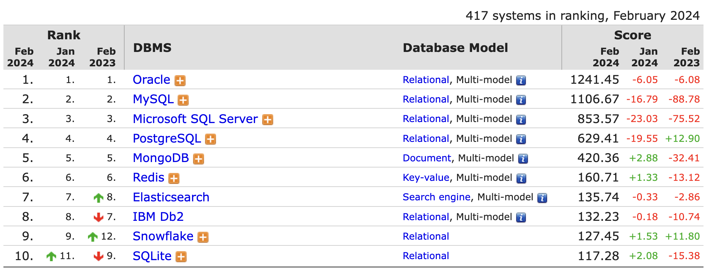

# 1.2 왜 MySQL 인가?

* 다른 DBMS와 비교할 때 MySQL의 경쟁력은 무엇일까?

> MySQL과 오라클을 비교해 본다면 당연히 MySQL의 경쟁력은 `가격`이나 `비용`일 것이다.

* "어떤 DBMS를 사용해야 가장 좋을까?"라는 질문에는  
"자기가 가장 잘 활용할 수 있는 DBMS가 가장 좋은 DMBS라고 답변한다.

* DBMS 선택의 고려사항

    - 안정성

    - 성능과 기능

    - 커뮤니티, 인지도

* 그림 1-1 : 2024년 2월 DBMS 랭킹

    

     

    - DB-Engines.com 에서 이 순위를 만들기 위해 점수를 부여할 때 사용하는 대표적인 기준은 다음과 같다.

        - 웹 사이트 언급 횟수 (website mentions)

        - 검색 빈도 (search frequency)

        - 기술 토론 빈도 (technical discussion frequency)

        - DBMS별 구인 (current job offers)

        - 전문가 인맥 (professional network profiles)

    * 그림 1-1 의 결과를 보면 MySQL 서버는 충분히 좋은 선택지인 것을 알 수 있다.

> MySQL 서버는 오픈소스 (또는 저비용)라는 무기를 갖추고 있으니 상위에 위치한 상용 DBMS보다 훨씬 더 매력적인 선택이 될 것이다.