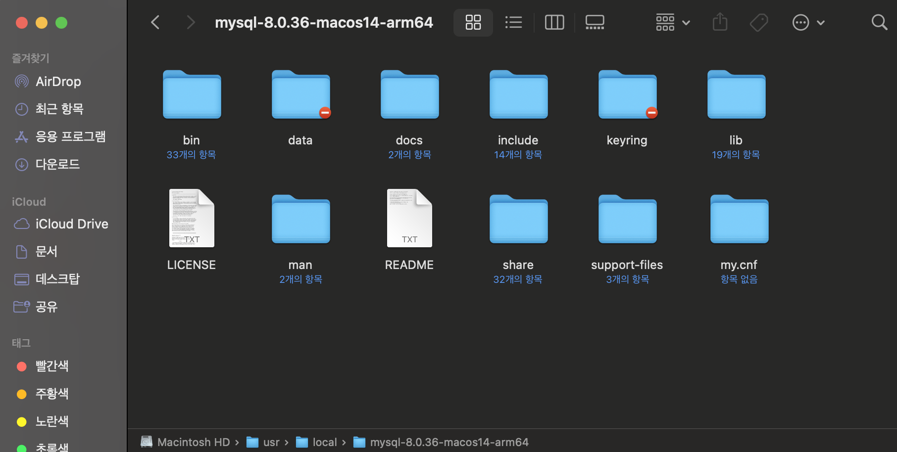
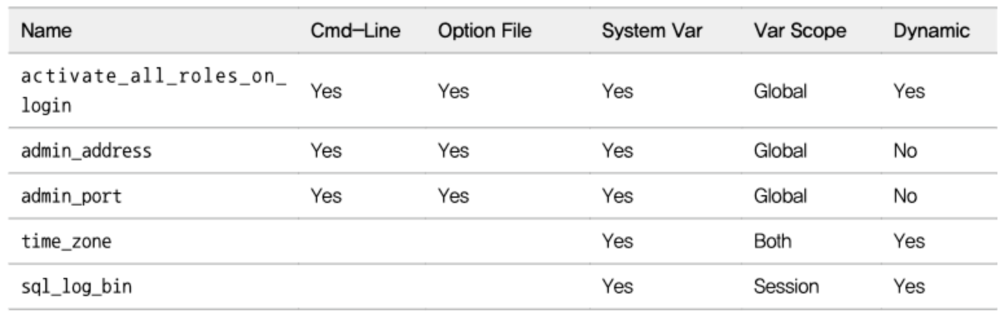

# 2.1 MySQL 서버 설치

* MySQL 서버는 다음과 같이 다양한 형태로 설치할 수 있지만 가능하다면 리눅스의 RPM이나 운영체제별 인스톨러를 이용하기를 권장한다.

    - Tar 또는 Zip으로 압축된 버전

    - 리눅스 RPM 설치 버전 (윈도우 인스톨러 및 macOS 설치 패키지)

    - 소스코드 빌드

* 이번 장에서는 인스톨러를 이용한 MySQL 서버 설치 및 디렉터리 준비, 그리고 MySQL 서버의 시작과 종료에 대해 살펴보자.

<br><br>

# 2.1.1 버전과 에디션(엔터프라이즈와 커뮤니티) 선택

* MySQL 서버의 버전을 선택할 때는 다른 제약 사항 (기존 솔루션이 특정 버전만 지원하는 경우)이 없다면 가능한 최신 버전을 설치하는 것이 좋다.

* 기존 버전에서 새로운 메이저 버전 (MySQL 5.1, 5.5, 5.6, 5.7, 8.0) 으로 업그레이드 하는 경우라면 최소 패치 버전이 15~20번 이상 릴리즈된 버전을 선택하는 것이 안정적인 서비스에 도움이 될 것이다.

> 즉, MySQL 8.0 버전이라면 MySQL 8.0.15 ~ 8.0.20 사이의 버전부터 시작하는 것을 권장한다.


* **오픈 코어 모델 (Open Core Model)**
    - MySQL 서버의 상용화 전략의 핵심내용은 엔터프라이즈 에디션과 커뮤니티 에디션 모두 동일하며, 특정 부가 기능들만 상용 버전인 엔터프라이즈 에디션에 포함되는 방식이다.

    * 다음과 같은 부가적인 기능과 서비스들은 엔터프라이즈 에디션에서만 지원한다.

        - Thread Pool

        - Enterprise Audit

        - Enterprise TDE (Mater Key 관리)

        - Enterprise Authentication

        - Enterprise Firewall

        - Enterprise Monitor

        - Enterprise Backup

        - MySQL 기술 지원

<br>

* Percona에서 출시는 Percona Server 백업 및 모니터링 도구, Percona Server에서 지원하는 플러그인을 활용하면 MySQL 커뮤니티 에디션의 부족한 부분을 메꿀 수 있었기 때문에 MySQL 엔터프라이즈 에디션의 필요성은 그다지 크지 않았다.

<br><br>

# 2.1.2 macOS운영체제 MySQL 설치

* MySQL 서버의 다양한 설치 방법 중 macOS 운영체제에서는 두 가지 설치 방법이 있다.

    1. 터미널에서 Homebrew를 이용해서 설치하는 방법

    2. MySQL 다운로드 페이지에서 설치파일 dmg를 다운로드 받아서 설치하는 방법

* 이번 장에서는 책에서와 같이 2번 방법으로 설치하겠습니다.

## 1. MySQL Community Server 다운로드 및 MySQL 설치


* [설치 링크](https://dev.mysql.com/downloads/)


* 설치방법 추가 예정


* MySQL 서버가 설치된 디렉터리는 /usr/local/mysql이며, 하위 디렉터리 정보는 다음과 같다.
    |   |   |
    |---|---|
    bin|MySQL 서버와 클라이언트 프로그램, 유틸리티를 위한 디렉터리
    data|로그 파일과 데이터 파일들이 저장되는 디렉터리
    include|C/C++ 헤더 파일들이 저장된 디렉터리
    lib|라이브러리 파일들이 저장된 디렉터리
    share|다양한 지원 파일들이 저장돼 있으며, 에러메시지는 샘플 설정 파일(my.cnf)이 있는 디렉터리


    

# 2.2 MySQL 서버의 시작과 종료

* 대부부의 서비스 환경에서 사용되는 리눅스 운영체제에서 MySQL 서버의 설정 파일을 비롯해 MySQL 서버를 시작, 종료하는 방법을 살펴보겠다.

## 설정 파일 및 데이터 파일 준비

* 리눅스 서버에서 yum 인스톨러나 RPM을 이용해 MySQL 서버를 설치하면 ...


## 시작과 종료

## 서버 연결 테스트

# 3. MySQL 서버 업그레이드

## 인플레이스 업그레이드 제약 사항


# 4. 서버 설정

* 일반적으로 MySQL 서버는 단 하나의 설정 파일을 사용한다.

    - 리눅스, 유닉스 : my.cnf

    - 윈도우 : my.ini

    - MySQL 서버는 지정된 여러 개의 디렉터리를 순차적으로 탐색하면서 처음 발견된 my.cnf 파일을 사용하게 된다.


* 또한 직접 MySQL을 컴파일해서 설치한 경우에는 이 디렉터리가 다르게 설정될 수 있다.

    ```
    # 클라이언트 프로그램으로 확인하는 방법 추천
    shell> mysql --help
    Default options are read from the following files in the given order:
    /etc/my.cnf /etc/mysql/my.cnf /usr/local/mysql/etc/my.cnf ~/.my.cnf 

    # MySQL 서버 프로그램으로 확인하다가 MySQL 서버가 실행 중인데 다시 시작을 한다거나 건드릴 수 있기 때문에
    shell> mysqld --verbose --help
    Default options are read from the following files in the given order:
    /etc/my.cnf /etc/mysql/my.cnf /usr/local/mysql/etc/my.cnf ~/.my.cnf
    ```

* MySQL 서버용 설정 파일은 주로 1번이나 2번을 사용한다.

## 설정 파일의 구성

* MySQL 설정 파일은 하나의 my.cnf 파일에 여러 개의 설정 그룹을 담을 수 있으며, 대체로 실행 프로그램 이름을 그룹명으로 사용한다.

* 예를 들어, mysqldupmp 프로그램은 [mysqldump] 설정 그룹, mysqld 프로그램은 [mysqld] 영역을 참조한다.

* 그리고 mysqld_safe 프로그램은 [mysqld_safe] 와 [mysqld] 섹션을 참조한다.

    ```
    [mysqld_safe]
    malloc-lib = /opt/lib/libtcmalloc_minial.so

    [mysqld]
    socket = /usr/local/mysql/tmp/mysql.sock
    port = 3306

    [mysql]
    default-charset-set = utf8mb4
    socket = /usr/local/mysql/tmp/mysql.sock
    port = 3304

    [mysqldump]
    default-char-set = utf8mb4
    socket = /usr/local/mysql/tmp/mysql.sock
    port = 3305
    ```

## MySQL 시스템 변수의 특징

* 시스템 변수(System Variables)

    - MySQL 서버는 시작하면서 설정 파일의 내용을 읽어 메모리나 작동 방식을 초기화하고, 접속된 사용자를 제어하기 위해 이러한 값을 별도로 저장해둔 값

    ```
    # 세션 변수 확인
    mysql> SHOW SESSION VARIABLES;

    # 글로벌 변수 확인
    mysql> SHOW GLOBAL VARIABLES;

    # 세션(기본값) 변수 확인
    mysql> SHOW VARIABLES;
    ```

    * 시스템 변수(설정) 값이 어떻게 MySQL 서버와 클라이언트에 영향을 미치는 지 판단하려면 각 변수가 글로벌 변수인지 세션 변수인지 구분할 수 있어야 한다.

<br>



* 시스템 변수가 가지는 5가지 속성의 의미는 다음과 같다.

1. Cmd-Line
    - MySQL 서버의 명령행 인자로 설정될 수 있는지 여부를 나타낸다.
    - Yes 이면 명령행 인자로 이 시스템 변수의 값을 변경하는 것이 가능하다

2. Option file
    - MySQL의 설정 파일인 my.cnf로 제어할 수 있는지 여부를 나타낸다.

3. System Var
    - 시스템 변수인지 아닌지를 나타낸다.
    - 시스템 변수를 언더스코어로 통일해가는 중이다. (하이픈(-)과 언더스코어(_)를 혼용해서 사용했다)
    - MySQL 8.0에서는 모든 시스템 변수들이 ‘_’를 구분자로 사용하도록 변경된 것으로 보인다
    - 명령행 옵션으로만 사용 가능한 설정들은 ‘-’을 구분자로 사용한다

4. Var Scope
    - 시스템 변수의 적용 범위를 나타낸다
    - 시스템 변수가 영향을 미치는 곳이 MySQL 서버 전체 (Global)인지,
    - MySQL 서버와 클라이언트 간의 컨낵션 (Session)인지
    - 세션과 글로벌 범위 모두 적용(Both)인지

5. Dynamic
    - 시스템 변수가 동적인지 정적인지 구분하는 변수


## 글로벌 변수와 세션 변수

* 적용 범위에 따라 글로벌 변수와 세션 변수로 나뉜다. 

* 일반적으로 세션별로 적용되는 시스템 변수의 경우 글로별 변수뿐만 아니라 세션 변수에도 동시에 존재한다.

    - 이러한 경우 MySQL 매뉴얼의 'Var Scope'에는 'Both'라고 표시된다.


## 정적 변수와 동적 변수

* MySQL 서버가 기동 중인 상태에서 변경 가능한지에 따라 `동적 변수`와 `정적 변수`로 구분된다.

* 이미 기동 중인 MySQL 서버의 메모리에 있는 시스템 변수를 변경하는 경우

    * SET 명령을 이용해 값을 변경 가능

    ```SQL
    mysql> SHOW GLOBAL VARIABLES LIKE '%max_connections%';
    +------------------------+-------+
    | Variable_name          | Value |
    +------------------------+-------+
    | max_connections        | 151   |
    | mysqlx_max_connections | 100   |
    +------------------------+-------+

    mysql> SET GLOBAL max_connections=500;


    mysql> SHOW GLOBAL VARIABLES LIKE '%max_connections%';
    +------------------------+-------+
    | Variable_name          | Value |
    +------------------------+-------+
    | max_connections        | 500   |
    | mysqlx_max_connections | 100   |
    +------------------------+-------+
    ```

    * SET 명령을 통해 변경되는 시스템 변수값은 MySQL 설정 파일(my.cnf)에 반영되는 것은 아니기 때문에 현재 기동중인 MySQL 인스턴스에만 유효하다.

    * MySQL 서버가 재시작되면 다시 설정 파일의 내용이 초기화 되기 때문에 영구적으로 반영하기 위해서는 my.cnf 파일도 변경해야 한다.

    * MySQL 8.0부터는 SET PERSIST 명령을 이용하면 실행 중인 MySQL 서버의 시스템 변수를 변경함과 동시에 자동으로 설정 파일로도 기록된다.

    * SET PERSIST 명령을 사용하는 경우 변경된 시스템 변수는 my.cnf 파일이 아닌 별도의 파일에 기록된다.

<br>

* 변경하려는 값이 동적 변수라면 SET 명령으로 변수 값을 변경할 수 있으며, 굳이 MySQL 서버를 재시작하지 않아도 된다.

    - 정적 변수는 실행 중 변경이 불가능하다.

* 재시작 후에도 설정을 변경하려면 `SET PERSIST` 를 이용해야 한다.

* 시스템 변수 범위가 'Both'인 경우 글로벌 시스템 변수의 값을 변경해도 이미 존재하는 커넥션의 세션 변수값은 변경되지 않고 그대로 유지된다.

<br>

## SET PERSIST

* SET PERSIST 명령으로 시스템 변수를 변경하면 MySQL 서버는 변경된 값을 즉시 적용함과 동시에 별도의 설정 파일 (mysqld-auto.cnf)에 변경 내용을 추가로 기록해 둔다.

* 그리고 MySQL 서버가 다시 시작될 때 기본 설정 파일(my.cnf)와 함께 자동 생성된 mysqld-auto.cnf 파일을 같이 참조해서 시스템 변수를 적용한다.

* SET PERSIST 명령은 세션 변수에는 적용되지 않으며, SET PERSIST 명령으로 시스템 변수를 변경하면 MySQL 서버는 자동으로 GLOBAL 시스템 변수의 변경으로 인식하고 변경한다.

* SET_PERSIST_ONLY

    - 현재 실행 중인 MySQL 서버에는 변경 내용을 적용하지 않고 다음 재시작을 위해 mysqld-auto.cnf 파일에만 변경 내용을 기록

    - 정적인 변수 값을 영구적으로 변경하고자 할 때도 사용 (정적인 변수는 SET, SET PERSIST로 변경이 불가능)

* RESET PERSIST

    - mysqld-auto.cnf 파일의 내용을 삭제

    ```SQL
    # 특정 시스템 변수만 삭제
    mysql> RESET PERSIST max_connections;
    mysql> RESET PERSIST IF EXISTS max_connections;

    # mysqld-auto.cnf 파일의 모든 시스템 변수 삭제
    mysql> RESET PERSIST;
    ```

## my.cnf 파일

* MySQL 8.0 서버의 시스템 변수는 대략 570개 수준이다.

