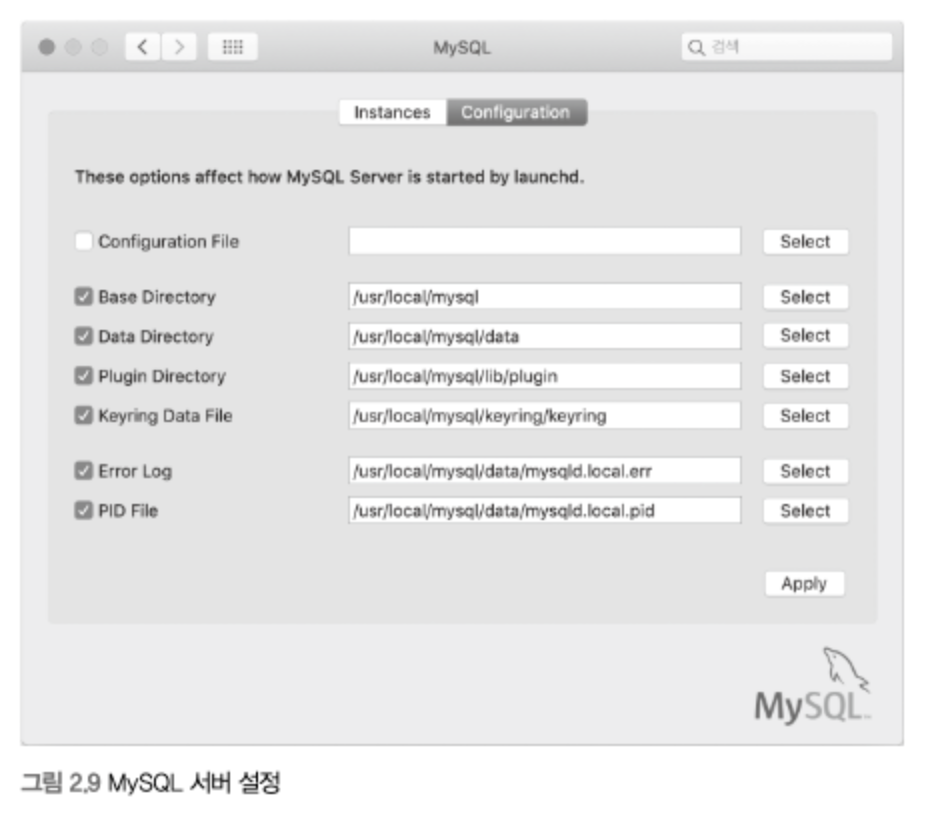

# 설치와 설정 (오류해결)

> 2장 설치와 설정을 따라하며 진행한 결과 다양한 오류들을 직면하고 해결한 과정을 적는 장입니다.

## 1. 첫 번째 오류

* MySQL 다운로드 페이지에서 설치파일 dmg를 다운로드 받아 설치하는 방법을 이용하여 설치하였다.

* 책 내용에 따라 /usr/local/mysql 디렉터리에 my.cnf라는 빈 파일을 생성하고, 위 그림 설정 파일 (Configuration File) 항목에 /usr/local/mysql/my.cnf 를 적용하였다.
 
    

*  ```mysqld --defaults-file=/etc/my.cnf --initialize-insecure``` 를 실행한 결과 다음과 같은 에러가 발생했다.

    - mysqld 명령에 --initialize-insecure 옵션을 사용하면, 필요한 초기 데이터 파일과 로그 파일들을 생성하고 마지막으로 비밀번호가 없는 관리자 계정인 root 유저를 생성한다.


- ```mysqld: [ERROR] Could not open required defaults file: /etc/my.cnf```

*  MySQL 서버가 어느 디렉터리에서 my.cnf 파일을 읽는지 확인하기 위해 다음과 같이 실행했다.
    - ```mysqld --verbose --help``` 
    - ```mysql --help```

* 실행한 결과 my.cnf 파일은 miniconda3 경로에 존재하였다.
    - (글을 작성할 시점에 미니콘다에 있는 mysql을 삭제하여 사진이나 my.cnf 파일의 경로는 존재하지 않습니다.)

### 원인

- 미니콘다에 my.cnf 파일 경로와 내가 생성한 파일 경로의 충돌

- 미니콘다 자동활성화로 인해 터미널에 가상환경 (base) 에서 모든 명령 및 sql 실행을 했기에 미니콘다 디렉터리에 있는 my.cnf 를 읽는 것이라 판단했다.

### 해결

- 사실 가장 간단한 해결법으로 해결했다.

- 기존에 local 에 있는 mysql 과 미니콘다에 있던 mysql을 삭제하고 Homebrew 를 통해 MySQL을 설치하였다.

### 번외


- 혹시 미니콘다를 사용하면서 터미널을 실행시켰을 때 위 사진과 같이 (base) 가 있으면 자동으로 활성화 되어있는 것이다.

- 다음과 같은 명령어를 수행하면 자동 활성화를 해제 할 수 있다.

```
conda activate base # 이미 (base) 인 경우 생략

conda config --set auto_activate_base false # 자동활성화 해제
````


        


