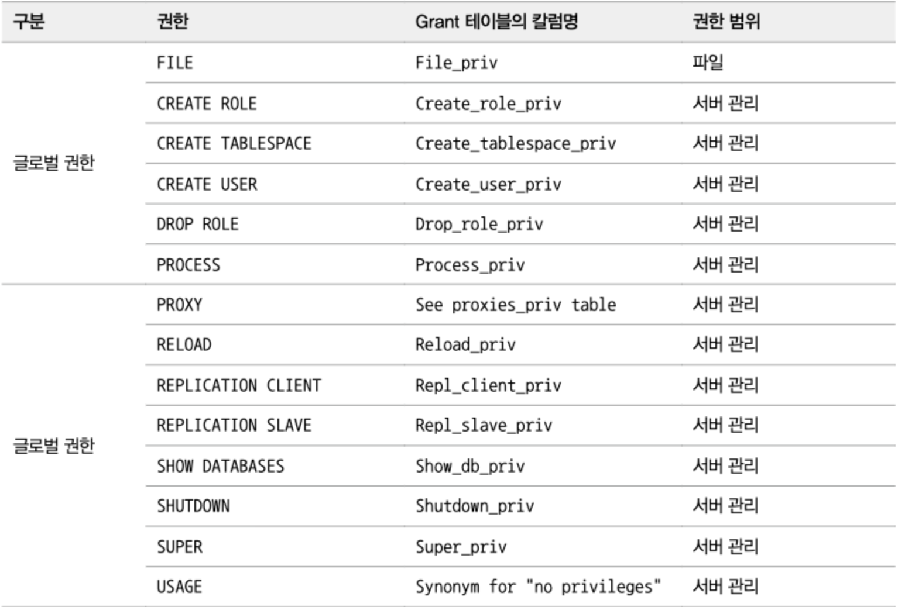
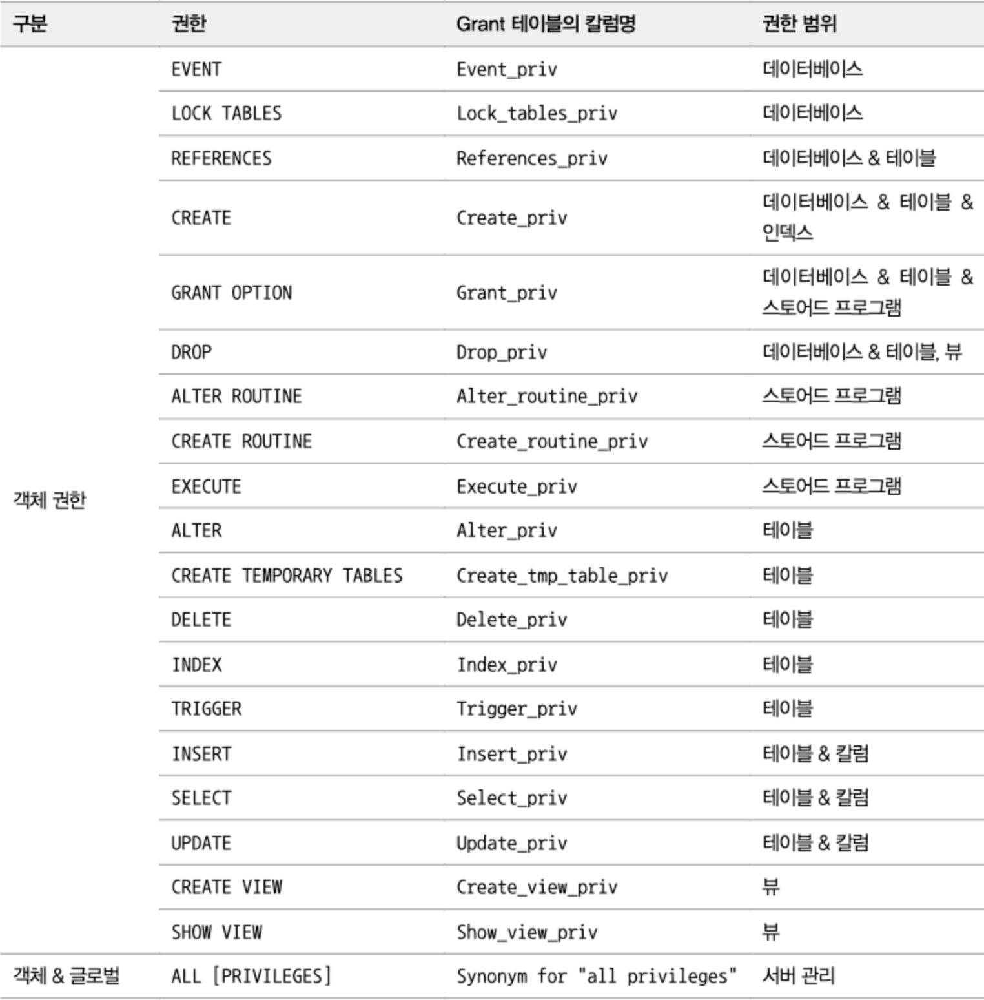
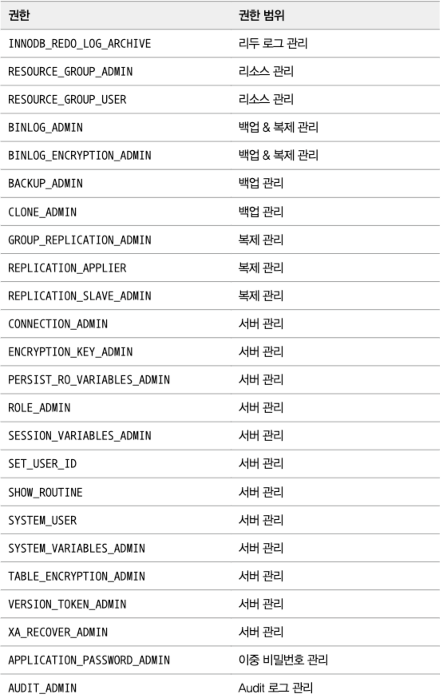

* MySQL 에서 사용자 계정을 생성하는 방법이나 각 계정의 권한을 설정하는 방법은 다른 DBMS 와는 조금 차이가 있다.

* 대표적으로 MySQL의 사용자 계정은 단순히 사용자의 아이디뿐 아니라 해당 사용자가 어느 IP에서 접속하고 있는지도 확인한다.

* 또한 MySQL 8.0 버전부터는 권한을 묶어서 관리하는 역할(Role, 롤) 의 개념도 도입되어 각 사용자의 권한으로 미리 준비된 권한 세트(Role)을 부여하는 것도 가능하다.

<br><br>


# 3.1 사용자 식별

* MySQL의 사용자는 다른 DBMS와는 조금 다르게 사용자의 계정뿐 아니라 사용자의 접속 지점(클라이언트가 실행된 호스트명이나 도메인 또는 IP 주소)도 계정의 일부가 된다.

> 따라서 MySQL에서 계정을 언급할 때는 항상 ‘아이디와 호스트’를 함께 명시해야 한다.

* 다음 계정은 항상 MySQL 서버가 기동 중인 로컬 호스트에서 svc_id라는 아이디로 접속할 때만 사용될 수 있는 계정이다.

    ```SQL
    `svc_id`@`127.0.0.1`
    'svc_id'@'127.0.0.1'
    ```

    - 역 따옴표(`)는 홀따옴표(')로 대체할 수 있다

* 모든 외부 컴퓨터에서 접속이 가능한 사용자 계정을 생성하고 싶다면 호스트 부분을 % 문자로 대체하면 된다

    ```SQL
    'svc_id'@'%'
    ```

* 서로 동일한 아이디가 있을 경우 범위가 더 좁은 것을 항상 선택한다.

    ```SQL
    'svc_id'@'192.168.0.10' (이 계정의 비밀번호는 123)
    'svc_id'@'%' (이 계정의 비밀번호는 abc)
    ```

    - 위 경우, 범위가 더 좁은 `'svc_id'@'192.168.0.10'`가 선택된다.

<br><br>

# 3.2 사용자 계정 관리

## 시스템 계정과 일반 계정

* SYSTEM_USER 권한을 가지고 있느냐에 따라 시스템 계정 (System Account)과 일반 계정 (Regular Account)으로 구분된다.

* 시스템 계정 : 데이터베이스 서버 관리자를 위한 계정

    - 계정 관리 : 계정 생성과 삭제, 계정의 권한 부여 및 제거

    - 다른세션(connection) 또는 그 세션에서 실행 중인 쿼리를 강제 종료

    - 스토어드 프로그램 생성 시 DEFINER를 타 사용자로 설정

* 일반 계정 : 응용프로그램이나 개발자를 위한 계정


## 내장 계정

* 'mysql.sys’@’localhost' : MySQL 8.0부터 기본으로 내장된 sys 스키마의 객체 (뷰나 함수, 그리고 프로시저)들의 DEFINER로 사용되는 계정

* 'mysql.session’@’localhost' : MySQL 플러그인이 서버로 접근할 때 사용되는 계정

* 'mysql.infoschema’@’localhost' : information_schema에 정의된 뷰의 DEFINER로 사용되는 계정


* 이 계정들은 처음부터 잠겨있는 상태이므로 의도적으로 잠긴 계정을 풀지 않는 한 악의적인 용도로 사용할 수 없으므로 보안을 걱정하지 않아도 된다.

```SQL
mysql> SELECT user, host, account_locked FROM mysql.user WHERE user LIKE 'mysql.%';
+------------------+-----------+----------------+
| user             | host      | account_locked |
+------------------+-----------+----------------+
| mysql.infoschema | localhost | Y              |
| mysql.session    | localhost | Y              |
| mysql.sys        | localhost | Y              |
+------------------+-----------+----------------+
```

<br>

## 계정 생성

* MySQL 5.7 버전까지는 GRANT 명령으로 권한의 부여와 동시에 계정 생성이 가능했다.

* 하지만 MySQL 8.0 버전부터는 계정의 생성은 CREATE_USER 명령으로, 권한 부여는 GRANT 명령으로 구분해서 실행하도록 바뀌었다.

* 계정 생성 시 설정할 수 있는 옵션

    - 계정의 인증 방식과 비밀번호

    - 비밀번호 관련 옵션 (비밀번호 유효 기간, 비밀번호 이력 개수, 비밀번호 재사용 불가 기간)

    - 기본 역할 (Role)

    - SSL 옵션

    - 계정 잠금 여부


```SQL
mysql> CREATE USER 'user'@'%'
				IDENTIFIED WITH 'mysql_native_password' BY 'password'
				REQUIRED NONE
				PASSWORD EXPIRE INTERVAL 30 DAY
				ACCOUNT UNLOCK
				PASSWORD HISTORY DEFAULT
				PASSWORD REUSE INTERVAL DEFAULT
				PASSWORD REQUIRE CURRENT DEFAULT;
```

<br>

## IDENTIFIED WITH, BY

* 인증 방식과 비밀번호를 설정한다.

    ```SQL
    IDENTIFIED WITH '{authentication}' BY '{password}'
    ```

* 4가지 인증방식

    1. Native Pluggable Authentication

        - MySQL 5.7 버전까지 기본으로 사용되던 방식

        - 비밀번호 해시(SHA-1 알고리즘) 값을 저장해두고 클라이언트가 보낸 해시 값과 일치하는 지 확인

    2. Caching SHA-2 Pluggable Authentication

        - SHA-2 (SHA-256) 알고리즘을 사용

        - 내부적으로 Salt 키를 활용하여 최소 5천번의 해시 계산을 수행해서 결과를 만들어 내서 동일한 키 값에 대해서 다른 결과

        - 해시값을 계산하는 방식은 시간 소모적이서 보완하기 위해 MySQL 서버는 해시 결과값을 메모리에 캐시해서 사용

        - 이 인증 방식을 사용하려면 SSL/TLS 또는 RSA 키페어를 반드시 사용. 이를 위해 클라이언트에서 SSL 옵션을 활성화해야 한다


    3. PAM Pluggable Authentication

        - 유닉스나 리눅스 패드워드 또는 LDAP 같은 외부 인증을 사용할 수 있게 해주는 방식

        - MySQL 엔터프라이즈에서만 사용 가능


    4. LDAP Pluggable Authentication

        - LDAP을 이용한 외부 인증을 사용할 수 있게 해주는 인증 방식

        - MySQL 엔터프라이즈에서만 사용 가능

<br>

## REQUIRE

- MySQL 서버에 접속할 때 암호화된 SSL/TLS 채널을 사용할 지 여부를 설정

- 기본값: 비암호화된 채널로 통신

- 하지만 Caching SHA-2 Authentication 인증 방식을 사용하면 암호화된 채널만으로 MySQL 서버에 접속


<br>

## PASSWORD EXPIRE

- 비밀번호의 유효 기간을 설정하는 옵션

- 기본값: default_password_lifetime 시스템 변수에 저장된 기간

- 개발자나 DBA의 비밀번호는 유효기간을 설정하는 것이 보안상 안전하지만 응용 프로그램 접속용 계정에 유효 기간을 설정하는 것은 위험할 수 있으니 주의

- `PASSWORD EXPIRE` : 계정의 생성과 동시에 비밀번호 완료 처리

- `PASSWORD EXPIRE NEVER` : 계정 비밀번호의 만료 기간 없음

- `PASSWORD EXPIRE DEFAULT` : default_password_lifetime 시스템 변수에 저장된 기간으로 비밀번호의 유효기간 설정

- `PASSWORD EXPIRE INTERVAL n DAY` : 비밀번호 유효 기간을 오늘부터 n일자로 설정


<br>

## PASSWORD HISTORY

- 비밀번호 히스토리를 몇 개까지 저장해 재사용하지 못하게 설정하는 옵션

- `PASSWORD HISTORY DEFAULT` : password_history 시스템 변수에 저장된 개수만큼 비밀번호의 이력을 저장하며, 저장된 이력에 남아있는 비밀번호는 재사용할 수 없다.

- `PASSWORD HISTORY n` : 비밀번호의 이력을 최근 n개까지만 저장하며, 저장된 이력에 남아있는 비밀번호는 재사용할 수 없다.


<br>

## PASSWORD REUSE INTERVAL

- 한 번 사용했던 비밀번호의 재사용 금지 기간을 설정하는 옵션

- `PASSWORD REUSE INTERVAL DEFAULT` : password_reuse_interval 변수에 저장된 기간으로 설정

- `PASSWORD REUSE INTERVAL n DAY` : n일자 이후에 비밀번호를 재상요할 수 있게 설정


<br>

## PASSWORD REQUIRE

- 비밀번호가 만료되어 새로운 비밀번호로 변경할 때 현재 비밀번호를 필요로 할지 말지를 결정하는 옵션

- `PASSWORD REQUIRE CURRENT` : 비밀번호를 변경할 때 현재 비밀번호를 먼저 입력하도록 설정

- `PASSWORD REQUIRE OPTIONAL` : 비밀번호를 변경할 때 현재 비밀번호를 입력하지 않아도 되도록 설정

- `PASSWORD REQUIRE DEFAULT` : password_require_current 시스템 변수의 값으로 설정


<br>

## ACCOUNT LOCK / UNLOCK

- 계정 생성 시 또는 ALTER USER 명령을 사용해 계정 정보를 변경할 때, 계정을 사용하지 못하게 (로그인 안됨) 잠글지 여부

- `ACCOUNT LOCK` : 계정을 사용하지 못하게 잠금 

- `ACCOUNT UNLOCK` : 잠긴 계저을 다시 사용 가능 상태로 잠금 해제

<br><br>

# 3.3 비밀번호 관리

## 고수준 비밀번호

- 비밀번호 보안 강도

    - LOW : 비밀번호 길이만 검증

    - MEDIUM : 비밀번호의 길이, 숫자와 대소문자 그리고 특수문자의 배합을 검증

    - STRONG : MEDIUM 레벨을 모두 수행하며, 금칙어 포함 여부까지 검증

- 금칙어 목록 파일은 validate_password.dictionary_file 시스템 변수에 저장

- 금칙어 파일은 한 줄에 하나씩 기록해서 텍스트 파일로 작성하면 된다

<br>

## 이중 비밀번호

- 응용 프로그램들이 데이터베이스 서버를 사용하기 때문에 데이터베이스 서버의 계정의 비밀번호를 변경하는 것이 쉽지가 않았다.

- 계정의 비밀번호를 2개 값을 동시에 사용할 수 있는 기능이다.

    - 새로운 비밀번호는 primary 비밀번호

    - 과거의 비밀번호는 secondary 비밀번호


- 두개의 비밀번호를 사용하려면 RETAIN CURRENT PASSWORD 옵션을 추가하면 됩니다

    ```SQL
    --// 비밀번호를 "ytrewq"로 설정
    mysql> ALTER USER 'root'@'localhost' IDENTIFIED BY 'old_password';
    
    --// 비밀번호를 "qwerty"로 변경하면서 기존 비밀번호를 세컨더리 비밀번호로 설정
    mysql> ALTER USER 'root'@'localhost' IDENTIFEID BY 'new_password' RETAIN CURRENT PASSWORD;
    ```

- old_password를 사용하고 있는 현재 응용 프로그램들에서 비밀번호를 모두 new_password로 수정합니다

- 응용 프로그램들을 재시작 한 후 MySQL 서버에서 세컨더리 비밀번호를 삭제합니다 (보안 목적)

    ```SQL
    mysql> ALTER USER 'root'@'localhost' DISCARD OLD PASSWORD;
    ```

<br><br>

# 3.4 권한 (Privilege)

- MySQL 5.7 버전까지는 글로벌 권한과 객체 권한만 있었다. MySQL 8.0에는 이에 더해 동적 권한이 추가됐다.

- 글로벌 권한
    
    - 데이터베이스나 테이블 이외의 객체에 적용되는 권한

    - GRANT 명령으로 부여할 때 객체를 명시하지 않는다

    

- 객체 권한

    - 데이터베이스나 테이블을 제어하는 권한

    - GRANT 명령으로 부여할 때 반드시 특정 객체를 명시

    

- 동적 권한

    - MySQL 서버가 시작되면서 동적으로 생성하는 권한

    - MySQL 서버의 컴포넌트나 플러그인이 설치되면 그때 등록되는 권한

    

<br>

- 사용자에게 권한을 부여할 때는 `GRANT` 명령을 사용한다.

    ```SQL
    mysql> GRANT {Privilege} ON {Object} TO {User}
    ```
<br>


* 글로벌 권한

```SQL
mysql> GRANT SUPER ON *.* TO 'user'@'localhost';
```


- 글로벌 권한은 특정 DB나 테이블에 부여될 수 없기 때문에 글로벌 권한을 부여할 때 GRANT 명령의 ON 절에는 항상 `*.*` 을 사용한다.

- `*.*`은 모든 DB의 모든 오브젝트 (테이블과 스토어드 프로시저, 함수 등)를 포함해서 MySQL 서버 전체를 의미한다.

- `CREATE USER`나 `CREATE ROLE`과 같은 글로벌 권한은 DB 단위나 오브젝트 단위로 부여할 수 있는 권한이 아니므로 항상 `*.*` 로만 대상을 상용할 수 있다.

<br>


## DB 권한

```SQL
mysql> GRANT EVENT ON *.* TO 'user'@'localhost';

mysql> GRANT EVENT ON employees.* TO 'user'@'localhost';
```

- DB 권한은 특정 DB에 대해서만 권한을 부여하거나 서버에 존재하는 모든 DB에 대해 권한을 부여할 수 있기 때문에 위의 예제와 같이 ON 절에 `*.*` 이나 `employees.*`  모두 사용할 수 있다.

- 여기서 DB라 함은 DB 내부에 존재하는 테이블 뿐만 아니라 스토어드 프로그램들도 모두 포함한다.

- DB 권한만 부여하는 경우에는 (DB 권한은 테이블에 대해 부여할 수 없기 때문에) `employees.department` 와 같이 테이블까지 명시할 수 없다.


<br>


## 테이블 권한

```SQL
mysql> GRANT SELECT,INSERT,UPDATE,DELETE ON *.* TO 'user'@'localhost';

mysql> GRANT SELECT,INSERT,UPDATE,DELETE ON employees.* TO 'user'@'localhost';

mysql> GRANT SELECT,INSERT,UPDATE,DELETE ON employees.department TO 'user'@'localhost';
```

- 테이블 권한은 모든 DB에 대해 권한을 부여(첫번째 에제)하는 것도 가능하며, 특정 DB 오브젝트에 대해서만 권한을 부여(두번째 예제)하는 것도 가능하다. 특정 DB의 특정 테이블에 대해서만 권한을 부여(세번째 예제)하는 것도 가능하다.

- 테이블의 특정 칼럼에 대해서만 권한을 부여하는 경우에는 GRANT 명령의 문법이 조금 달라져야 한다.

- 칼럼에 부여할 수 있는 권한은 DELETE를 제외한 SELECT, INSERT, UPDATE로 3가지이며, 각 권한 뒤에 칼럼을 명시하는 형태로 부여한다.

- 다음과 같은 경우, SELECT나 INSERT는 모든 칼럼에 수행할 수 있지만 UPDATE는 dept_name 칼럼에만 수행할 수 있다.

    ```SQL
    mysql> GRANT SELECT,INSERT,UPDATE(dept_name) ON employees.department TO 'user'@'localhost';
    ```

- 테이블이나 칼럼 단위의 권한은 잘 사용하지 않는다.

    - 칼럼 단위의 권한이 하나라도 설정되면 나머지 모든 테이블의 모든 칼럼에 대해서도 권한 체크를 하기 때문에 칼럼 하나에 대해서만 권한을 설정하더라도 전체적인 성능에 영향을 미칠 수 있다.

    - 칼럼 단위의 접근 권한이 꼭 필요하다면 GRANT 명령으로 해결하기보다는 테이블에서 권한을 허용하고자 하는 칼럼만을 별도의 뷰(VIEW)로 만들어 사용하는 방법도 생각해볼 수 있다.

    - 뷰도 하나의 테이블로 인식되기 때문에 뷰를 만들어 두면 뷰의 칼럼에 대해 권한을 체크하지 않고 뷰 자체에 대한 권한만 체크하게 된다.


<br><br>

# 3.5 역할 (Role)

- MySQL 8.0 버전부터는 권한을 묶어서 역할(Role)을 사용할 수 있게 됐다.

- 실제 MySQL 서버 내부적으로 역할(Role)은 계정과 똑같은 모습을 하고 있다.

* 역할 생성 : `CREATE ROLE`

```SQL
mysql> CREATE ROLE
        role_emp_read,
        role_emp_write;
```

* CREATE ROLE 명령을 이용해 role_emp_read 와 role_emp_write 라는 이름의 역할을 정의한다.

* CREATE ROLE 명령에서는 빈 껍데기만 있는 역할을 정의한 것이며, 다음과 같이 GRANT 명령으로 역할에 대해 실질적인 권한을 부여하면 된다.

* 역할에 권한 부여 : `GRANT`

```SQL
mysql> GRANT SELECT ON employees.* TO role_emp_read;
mysql> GRANT INSERT, UPDATE, DELETE ON employees.* TO role_emp_write;
```
<br>

* 기본적으로 역할은 그 자체로 사용될 수 없고 계정에 부여해야 하므로 CREATE USER 명령으로 reader와 writer라는 계정을 생성해보자.

<br>

```SQL
mysql> GRANT SELECT ON employees.* TO role_emp_read;
mysql> GRANT INSERT, UPDATE, DELETE ON employees.* TO role_emp_write;
```

<br>

* 기본적으로 역할은 그 자체로 사용될 수 없고 계정에 부여해야 하므로 CREATE USER 명령으로 reader와 writer라는 계정을 생성해보자.

<br>

```SQL
mysql> CREATE USER reader@'127.0.0.1' IDENTIFIED BY 'qwerty';
mysql> CREATE USER writer@'127.0.0.1' IDENTIFIED BY 'qwerty';
```

<br>

* CREATE USER 명령으로 계정은 생성됐지만 실제 이 계정들은 아무런 권한이 부여되지 않았으므로 employees DB에 대해 아무런 쿼리도 실행할 수 없는 상태다. GRANT 명령으로 reader와 writer 계정에 역할을 부여해보자.

<br>

```SQL
mysql> GRANT role_emp_read TO reader@'127.0.0.1';
mysql> GRANT role_emp_read, role_emp_write TO writer@'127.0.0.1';
```

<br>

* reader 계정이 role_emp_read 역할을 사용할 수 있게 하려면 `SET ROLE` 명령을 실행해 해당 역할을 활성화해야 한다.

* 역할이 활성화되면 그 역할이 가진 권한은 사용할 수 있는 상태가 되지만 계정이 로그아웃됐다가 다시 로그인하면 역할이 활성화되지 않은 상태로 초기화돼 버린다.  

* 사용자가 MySQL 서버에 로그인할 때 역할이 자동으로 활성화할지 여부를 `active_all_roles_on_login` 시스템 변수로 설정할 수 있다.

* `active_all_roles_on_login` 시스템 변수가 ON으로 설정되면 매번 SET ROLE 명령으로 역할을 활성화하지 않아도 로그인과 동시에 부여된 역할이 자동으로 활성화된다.

<br>

```SQL
mysql> SET GLOBAL active_all_roles_on_login=ON;
```

* MySQL 8.0에 도입된 역할의 비밀에 대해 좀 더 살펴보자

    - MySQL 서버 내부적으로 역할과 계정은 동일한 객체로 취급된다. 단지 하나의 사용자 계정에 다른 사용자 계정이 가진 권한을 병합해서 권한 제어가 가능해졌을 뿐이다.
    
    <br>

    ```SQL
    mysql> SELECT user, host, account_locked FROM mysql.user;
    +------------------+-----------+----------------+
    | user             | host      | account_locked |
    +------------------+-----------+----------------+
    | role_emp_read    | %         | Y              |
    | role_emp_write   | %         | Y              |
    | reader           | 127.0.0.1 | N              |
    | writer           | 127.0.0.1 | N              |
    +------------------+-----------+----------------+
    ```
    
    <br>

    - 역할과 계정의 차이는 account_locked 칼럼이 다를 뿐 아무런 차이가 없다. 역할이라 표기하는 플래그 칼럼도 없다.

    - 그렇다면 MySQL 서버는 계정과 권한을 어떻게 구분할까? 하나의 계정에 다른 계정의 권한을 병합하기만 하면 되므로 MySQL 서버는 역할과 계정을 구분할 필요가 없는 것이다.

    - 역할을 생성할 때는 자동으로 ‘모든 호스트(%)’가 자동으로 추가된다.

    <br>

    ```SQL
    mysql> CREATE ROLE
				role_emp_read,
				role_emp_write;

    mysql> CREATE ROLE
                    role_emp_read@'%',
                    role_emp_write@'%';
    ```

    <br>

    - MySQL 서버 내부적으로 계정과 역할은 아무런 차이가 없으며, 실제 관리자나 사용자가 볼 때도 역할인지 계정인지 구분하기가 어렵다. 그래서 프리픽스(ex. ’role_’)나 키워드를 추가해 역할의 이름을 선택하는 방법을 권장한다.

* 이제 계정과 역할이 내부적으로는 똑같은 객체라는 것을 이해했으니, 다음과 같이 호스트 부분을 가진 역할에 대해 한번 고민해보자.

<br>

```SQL
mysql> CREATE ROLE role_emp_local_read@localhost;

mysql> CREATE USER reader@'127.0.0.1' IDENTIFIED BY 'qwerty';

mysql> GRANT SELECT ON employees.* TO role_emp_local_read@'localhost';

mysql> GRANT role_emp_local_read@'localhost' TO reader@'127.0.0.1';
```

<br>

* role_emp_local_read@’localhost’ 역할을 reader@’127.0.0.1’ 계정에 부여하는 예제다.

* 역할과 계정의 호스트 부분이 서로 달라서 호환되지 않은 상태인데, 역할의 호스트 부분이 어떤 영향을 미치는지 살펴보기 위한 것이다.

* 이 예제에서는 사용자 계정은 employees DB의 객체들에 대해 SELECT 권한이 부여된다. 즉, 역할의 호스트 부분은 아무런 영향이 없다.

* 만약 역할을 다른 계정에 부여하지 않고 직접 로그인하는 용도로 사용한다면(실제 계정처럼 사용한다면) 그때는 역할의 호스트 부분이 중요해진다.

<br>

* 역할과 계정은 내외부적으로 동일한 객체라고 했는데, 왜 MySQL 서버에서는 굳이 `CREATE ROLE` 명령과 `CREATE USER` 명령을 구분해서 지원할까?

    > 데이터베이스 관리의 직무를 분리할 수 있게 해서 보안을 강화하는 용도

* 
