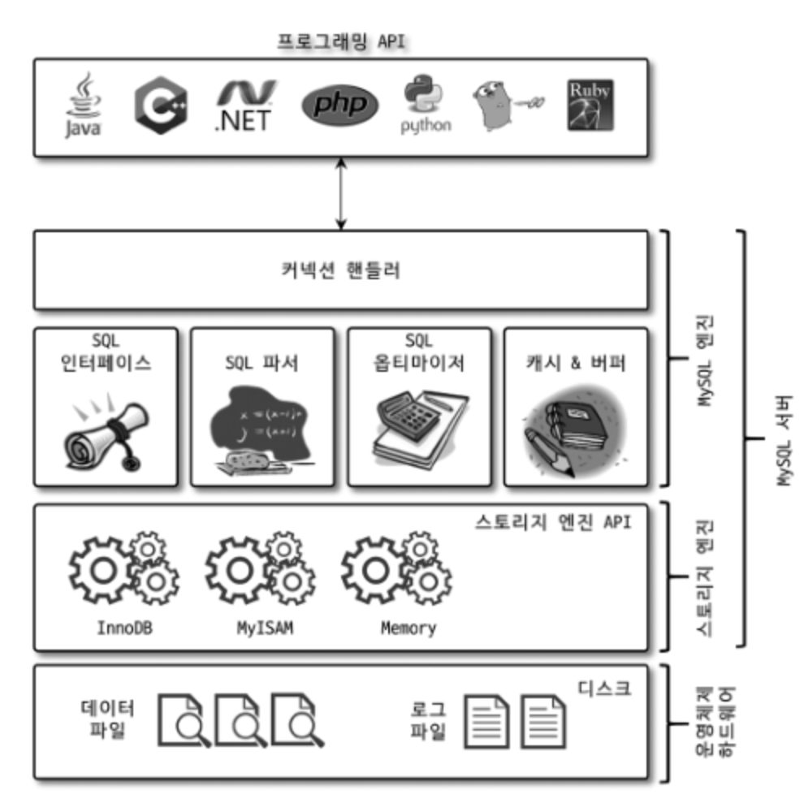
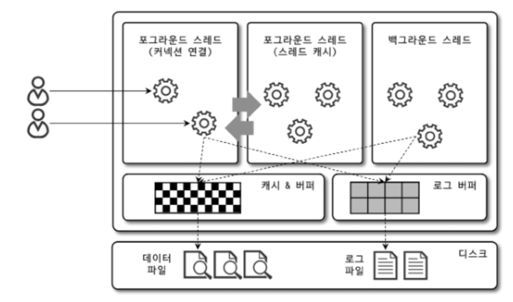

* MySQL 서버는 다음과 같이 구분할 수 있다.

    - MySQL 엔진 : 사람의 머리 역할을 담당

    - 스토리지 엔진 : 손발 역할을 담당
        
        - 핸들러 API를 만족하면 누구든지 스토리지 엔진을 구현해서 MySQL 서버에 추가해서 사용할 수 있다.


* 이번 장에서는 MySQL 엔진과 MySQL 서버에서 기본으로 제공되는 InnoDB 스토리지 엔진, 그리고 MyISAM 스토리지 엔진을 구분해서 살펴보겠다.

# 4.1 MySQL 엔진 아키텍처

* 먼저 MySQL의 쿼리를 작성하고 튜닝할 때 필요한 기본적인 MySQL 엔진의 구조를 훑어보겠다.

* MySQL 서버는 다른 DBMS에 비해 구조가 상당히 독특하다.

* 사용자 입장에서 보면 거의 차이가 느껴지지 않지만 이러한 독특한 구조 때문에 다른 DBMS에서는 가질 수 없는 엄청난 혜택을 누릴 수 있으며, 반대로 다른 DBMS에서는 문제가되지 않을 것들이 가끔 문제가 되기도 한다.

## MySQL의 전체 구조

* 그림 4-1 : MySQL 서버의 전체 구조



<br>

* MySQL은 일반 상용 RDBMS와 같이 대부분의 프로그래밍 언어로부터 접근 방법을 모두 지원한다.

    - C API, JDBC, ODBC, .NET의 표준 드라이버를 제공한다.

    - 이러한 드라이버를 이용하여 C/C++, PHP, 자바, 펄, 파이썬, 루비나 .NET 및 코볼까지 모든 언어로 MySQL 서버에서 쿼리를 사용할 수 있게 지원한다.

* MySQL 서버는 크게 `MySQL 엔진`과 `스토리지 엔진`으로 구분할 수 있다.

<br>

## MySQL 엔진

* MySQL 엔진은 클라이언트로부터의 접속 및 쿼리 요청을 처리하는 커넥션 핸들러와 SQL 파서 및 전처리기, 쿼리의 최적화된 실행을 위한 옵티마이저가 중심을 이룬다.

* 또한 MySQL은 표준 SQL(ANSI SQL) 문법을 지원하기 때문에 표준 문법에 따라 작성된 쿼리는 타 DBMS와 호환되어 실헹될 수 있다.

* MySQL 엔진
    - 요청된 SQL 문장을 분석하거나 최적화하는 등 DBMS의 두뇌에 해당하는 처리를 수행

<br>

## 스토리지 엔진

* 실제 데이터를 디스크 스토리지에 저장하거나 디스크 스토리지부터 데이터를 읽어오는 부분을 담당한다.

* MySQL 서버에서 MySQL 엔진은 하나지만, 스토리지 엔진은 여러 개를 동시에 사용할 수 있다.

* 다음 예제와 같이 테이블이 사용할 스토리지 엔진을 지정하면 이후 해당 테이블의 모든 읽기 작업이나 변경 작접은 정의된 스토리지 엔진이 처리한다.

    ```SQL
    mysql> CREATE TABLE test_table (fd1 INT, fd2 INT) ENGINE=INNODB;
    ```

    <br>

    - test_table 은 InnoDB 스토리지 엔진을 사용하도록 정의했다.

    - test_table에 대해 INSERT, UPDATE, DELETE, SELECT 등의 작업이 발생하면 InnoDB 스토리지 엔진이 그러한 처리를 담당한다.

    - 각 스토리지 엔진은 성능 향상을 위해 키 캐시(MyISAM 스토리지 엔진)나 InnoDB 버퍼 풀(InnoDB 스토리지 엔진)과 같은 기능을 내장히고 있다.

<br>

## 핸들러 API

- MySQL 엔진의 쿼리 실행기에서 데이터를 쓰거나 읽어야 할 때는 각 스토리지 엔진에 쓰기 또는 읽기를 요청하는데, 이러한 요청을 `핸들러(Handler) 요청`이라고 한다.

- 여기서 사용되는 API를 `핸들러 API`라고 한다.

- InnoDB 스토리지 엔진 또한 이 핸들러 API를 이용해 MySQL 엔진과 데이터를 주고 받는다.

- 이 핸들러 API를 통해 얼마나 많은 데이터(레코드) 작업이 있었는지는 `SHOW GLOBAL STATUS LIKE 'Handler%';` 명령으로 확인할 수 있다.

    ```SQL
    mysql> SHOW GLOBAL STATUS LIKE 'Handler%';
    +----------------------------+-------+
    | Variable_name              | Value |
    +----------------------------+-------+
    | Handler_commit             | 575   |
    | Handler_delete             | 8     |
    | Handler_discover           | 0     |
    | Handler_external_lock      | 6273  |
    | Handler_mrr_init           | 0     |
    | Handler_prepare            | 0     |
    | Handler_read_first         | 40    |
    | Handler_read_key           | 1719  |
    | Handler_read_last          | 0     |
    | Handler_read_next          | 4035  |
    | Handler_read_prev          | 0     |
    | Handler_read_rnd           | 0     |
    | Handler_read_rnd_next      | 154   |
    | Handler_rollback           | 0     |
    | Handler_savepoint          | 0     |
    | Handler_savepoint_rollback | 0     |
    | Handler_update             | 329   |
    | Handler_write              | 8     |
    +----------------------------+-------+
    18 rows in set (0.00 sec)
    ```

<br>

## MySQL 스레딩 구조

* 그림 4-2 : MySQL의 스레딩 모델



<br>

* MySQL 서버는 프로세스 기반이 아니라 스레드 기반으로 작동하며, 크게 `포그라운드(Foreground)스레드`와 `백그라운드(Background)스레드`로 구분할 수 있다.

* MySQL 서버에서 실행 중인 스레드의 목록은 다음과 같이 performance_schema 데이터베이스의 threads 테이블을 통해 확인할 수 있다.

    ```SQL
    mysql> SELECT thread_id, name, type, processlist_user, processlist_host FROM performance_schema.threads ORDER BY type, thread_id;
    +-----------+---------------------------------------------+------------+------------------+------------------+
    | thread_id | name                                        | type       | processlist_user | processlist_host |
    +-----------+---------------------------------------------+------------+------------------+------------------+
    |         1 | thread/sql/main                             | BACKGROUND | NULL             | NULL             |
    |         2 | thread/mysys/thread_timer_notifier          | BACKGROUND | NULL             | NULL             |
    |         4 | thread/innodb/io_ibuf_thread                | BACKGROUND | NULL             | NULL             |
    |         5 | thread/innodb/io_read_thread                | BACKGROUND | NULL             | NULL             |
    |         6 | thread/innodb/io_read_thread                | BACKGROUND | NULL             | NULL             |
    |         7 | thread/innodb/io_read_thread                | BACKGROUND | NULL             | NULL             |
    |         8 | thread/innodb/io_read_thread                | BACKGROUND | NULL             | NULL             |
    |         9 | thread/innodb/io_write_thread               | BACKGROUND | NULL             | NULL             |
    |        10 | thread/innodb/io_write_thread               | BACKGROUND | NULL             | NULL             |
    |        11 | thread/innodb/io_write_thread               | BACKGROUND | NULL             | NULL             |
    |        12 | thread/innodb/io_write_thread               | BACKGROUND | NULL             | NULL             |
    |        13 | thread/innodb/page_flush_coordinator_thread | BACKGROUND | NULL             | NULL             |
    |        14 | thread/innodb/log_checkpointer_thread       | BACKGROUND | NULL             | NULL             |
    |        15 | thread/innodb/log_flush_notifier_thread     | BACKGROUND | NULL             | NULL             |
    |        16 | thread/innodb/log_flusher_thread            | BACKGROUND | NULL             | NULL             |
    |        17 | thread/innodb/log_write_notifier_thread     | BACKGROUND | NULL             | NULL             |
    |        18 | thread/innodb/log_writer_thread             | BACKGROUND | NULL             | NULL             |
    |        19 | thread/innodb/log_files_governor_thread     | BACKGROUND | NULL             | NULL             |
    |        24 | thread/innodb/srv_lock_timeout_thread       | BACKGROUND | NULL             | NULL             |
    |        25 | thread/innodb/srv_error_monitor_thread      | BACKGROUND | NULL             | NULL             |
    |        26 | thread/innodb/srv_monitor_thread            | BACKGROUND | NULL             | NULL             |
    |        27 | thread/innodb/buf_resize_thread             | BACKGROUND | NULL             | NULL             |
    |        28 | thread/innodb/srv_master_thread             | BACKGROUND | NULL             | NULL             |
    |        29 | thread/innodb/dict_stats_thread             | BACKGROUND | NULL             | NULL             |
    |        30 | thread/innodb/fts_optimize_thread           | BACKGROUND | NULL             | NULL             |
    |        31 | thread/mysqlx/worker                        | BACKGROUND | NULL             | NULL             |
    |        32 | thread/mysqlx/worker                        | BACKGROUND | NULL             | NULL             |
    |        37 | thread/innodb/buf_dump_thread               | BACKGROUND | NULL             | NULL             |
    |        38 | thread/innodb/clone_gtid_thread             | BACKGROUND | NULL             | NULL             |
    |        39 | thread/innodb/srv_purge_thread              | BACKGROUND | NULL             | NULL             |
    |        40 | thread/innodb/srv_worker_thread             | BACKGROUND | NULL             | NULL             |
    |        41 | thread/innodb/srv_worker_thread             | BACKGROUND | NULL             | NULL             |
    |        42 | thread/innodb/srv_worker_thread             | BACKGROUND | NULL             | NULL             |
    |        44 | thread/sql/signal_handler                   | BACKGROUND | NULL             | NULL             |
    |        45 | thread/mysqlx/acceptor_network              | BACKGROUND | NULL             | NULL             |
    |        46 | thread/mysqlx/acceptor_network              | BACKGROUND | NULL             | NULL             |
    |        43 | thread/sql/event_scheduler                  | FOREGROUND | event_scheduler  | localhost        |
    |        47 | thread/sql/compress_gtid_table              | FOREGROUND | NULL             | NULL             |
    |        48 | thread/sql/one_connection                   | FOREGROUND | root             | localhost        |
    +-----------+---------------------------------------------+------------+------------------+------------------+
    39 rows in set (0.00 sec)
    ```

* 책과는 다르게 제가 실행했을 때는 총 48개의 스레드가 실행주이며, 그중에서 45개의 스레드가 백그라운드 스레드, 나머지 3개만 포그라운 스레드로 표시돼 있다.

* 그런데 이 중에서 마지막 `thread/sql/one_connection` 스레드만 실제 사용자의 요청을 처리하는 포그라운드 스레드다.

* 백그라운드 스레드의 개수는 MySQL 서버의 설정 내용에 따라 가변적일 수 있다.

* 동일한 이름의 스레드가 2개 이상씩 보이는 것은 MySQL 서버의 설정 내용에 의해 여러 스레드가 동일 작업을 병렬로 처리하는 경우다.

