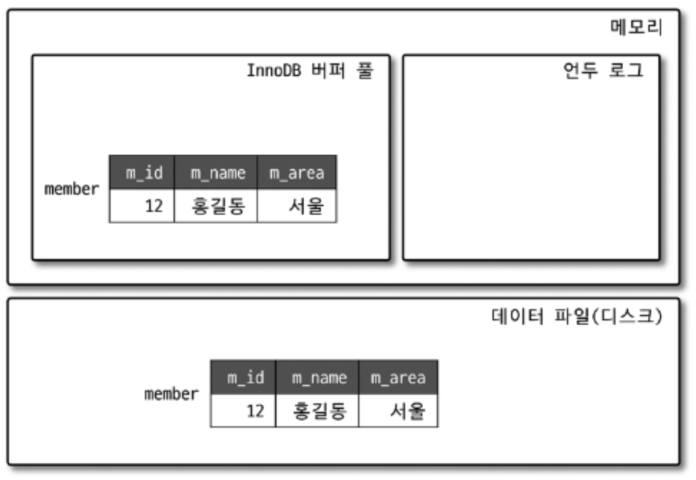

* MySQL 서버는 다음과 같이 구분할 수 있다.

    - MySQL 엔진 : 사람의 머리 역할을 담당

    - 스토리지 엔진 : 손발 역할을 담당
        
        - 핸들러 API를 만족하면 누구든지 스토리지 엔진을 구현해서 MySQL 서버에 추가해서 사용할 수 있다.


* 이번 장에서는 MySQL 엔진과 MySQL 서버에서 기본으로 제공되는 InnoDB 스토리지 엔진, 그리고 MyISAM 스토리지 엔진을 구분해서 살펴보겠다.

# 4.1 MySQL 엔진 아키텍처

* 먼저 MySQL의 쿼리를 작성하고 튜닝할 때 필요한 기본적인 MySQL 엔진의 구조를 훑어보겠다.

* MySQL 서버는 다른 DBMS에 비해 구조가 상당히 독특하다.

* 사용자 입장에서 보면 거의 차이가 느껴지지 않지만 이러한 독특한 구조 때문에 다른 DBMS에서는 가질 수 없는 엄청난 혜택을 누릴 수 있으며, 반대로 다른 DBMS에서는 문제가되지 않을 것들이 가끔 문제가 되기도 한다.

## MySQL의 전체 구조

* 그림 4-1 : MySQL 서버의 전체 구조


<br>

* MySQL은 일반 상용 RDBMS와 같이 대부분의 프로그래밍 언어로부터 접근 방법을 모두 지원한다.

    - C API, JDBC, ODBC, .NET의 표준 드라이버를 제공한다.

    - 이러한 드라이버를 이용하여 C/C++, PHP, 자바, 펄, 파이썬, 루비나 .NET 및 코볼까지 모든 언어로 MySQL 서버에서 쿼리를 사용할 수 있게 지원한다.

* MySQL 서버는 크게 `MySQL 엔진`과 `스토리지 엔진`으로 구분할 수 있다.

<br>

## MySQL 엔진

* MySQL 엔진은 클라이언트로부터의 접속 및 쿼리 요청을 처리하는 커넥션 핸들러와 SQL 파서 및 전처리기, 쿼리의 최적화된 실행을 위한 옵티마이저가 중심을 이룬다.

* 또한 MySQL은 표준 SQL(ANSI SQL) 문법을 지원하기 때문에 표준 문법에 따라 작성된 쿼리는 타 DBMS와 호환되어 실헹될 수 있다.

* MySQL 엔진
    - 요청된 SQL 문장을 분석하거나 최적화하는 등 DBMS의 두뇌에 해당하는 처리를 수행

<br>

## 스토리지 엔진

* 실제 데이터를 디스크 스토리지에 저장하거나 디스크 스토리지부터 데이터를 읽어오는 부분을 담당한다.

* MySQL 서버에서 MySQL 엔진은 하나지만, 스토리지 엔진은 여러 개를 동시에 사용할 수 있다.

* 다음 예제와 같이 테이블이 사용할 스토리지 엔진을 지정하면 이후 해당 테이블의 모든 읽기 작업이나 변경 작접은 정의된 스토리지 엔진이 처리한다.

    ```SQL
    mysql> CREATE TABLE test_table (fd1 INT, fd2 INT) ENGINE=INNODB;
    ```

    <br>

    - test_table 은 InnoDB 스토리지 엔진을 사용하도록 정의했다.

    - test_table에 대해 INSERT, UPDATE, DELETE, SELECT 등의 작업이 발생하면 InnoDB 스토리지 엔진이 그러한 처리를 담당한다.

    - 각 스토리지 엔진은 성능 향상을 위해 키 캐시(MyISAM 스토리지 엔진)나 InnoDB 버퍼 풀(InnoDB 스토리지 엔진)과 같은 기능을 내장히고 있다.

<br>

## 핸들러 API

- MySQL 엔진의 쿼리 실행기에서 데이터를 쓰거나 읽어야 할 때는 각 스토리지 엔진에 쓰기 또는 읽기를 요청하는데, 이러한 요청을 `핸들러(Handler) 요청`이라고 한다.

- 여기서 사용되는 API를 `핸들러 API`라고 한다.

- InnoDB 스토리지 엔진 또한 이 핸들러 API를 이용해 MySQL 엔진과 데이터를 주고 받는다.

- 이 핸들러 API를 통해 얼마나 많은 데이터(레코드) 작업이 있었는지는 `SHOW GLOBAL STATUS LIKE 'Handler%';` 명령으로 확인할 수 있다.

    ```SQL
    mysql> SHOW GLOBAL STATUS LIKE 'Handler%';
    +----------------------------+-------+
    | Variable_name              | Value |
    +----------------------------+-------+
    | Handler_commit             | 575   |
    | Handler_delete             | 8     |
    | Handler_discover           | 0     |
    | Handler_external_lock      | 6273  |
    | Handler_mrr_init           | 0     |
    | Handler_prepare            | 0     |
    | Handler_read_first         | 40    |
    | Handler_read_key           | 1719  |
    | Handler_read_last          | 0     |
    | Handler_read_next          | 4035  |
    | Handler_read_prev          | 0     |
    | Handler_read_rnd           | 0     |
    | Handler_read_rnd_next      | 154   |
    | Handler_rollback           | 0     |
    | Handler_savepoint          | 0     |
    | Handler_savepoint_rollback | 0     |
    | Handler_update             | 329   |
    | Handler_write              | 8     |
    +----------------------------+-------+
    18 rows in set (0.00 sec)
    ```

<br>

## MySQL 스레딩 구조

* 그림 4-2 : MySQL의 스레딩 모델


<br>

* MySQL 서버는 프로세스 기반이 아니라 스레드 기반으로 작동하며, 크게 `포그라운드(Foreground)스레드`와 `백그라운드(Background)스레드`로 구분할 수 있다.

* MySQL 서버에서 실행 중인 스레드의 목록은 다음과 같이 performance_schema 데이터베이스의 threads 테이블을 통해 확인할 수 있다.

    ```SQL
    mysql> SELECT thread_id, name, type, processlist_user, processlist_host FROM performance_schema.threads ORDER BY type, thread_id;
    +-----------+---------------------------------------------+------------+------------------+------------------+
    | thread_id | name                                        | type       | processlist_user | processlist_host |
    +-----------+---------------------------------------------+------------+------------------+------------------+
    |         1 | thread/sql/main                             | BACKGROUND | NULL             | NULL             |
    |         2 | thread/mysys/thread_timer_notifier          | BACKGROUND | NULL             | NULL             |
    |         4 | thread/innodb/io_ibuf_thread                | BACKGROUND | NULL             | NULL             |
    |         5 | thread/innodb/io_read_thread                | BACKGROUND | NULL             | NULL             |
    |         6 | thread/innodb/io_read_thread                | BACKGROUND | NULL             | NULL             |
    |         7 | thread/innodb/io_read_thread                | BACKGROUND | NULL             | NULL             |
    |         8 | thread/innodb/io_read_thread                | BACKGROUND | NULL             | NULL             |
    |         9 | thread/innodb/io_write_thread               | BACKGROUND | NULL             | NULL             |
    |        10 | thread/innodb/io_write_thread               | BACKGROUND | NULL             | NULL             |
    |        11 | thread/innodb/io_write_thread               | BACKGROUND | NULL             | NULL             |
    |        12 | thread/innodb/io_write_thread               | BACKGROUND | NULL             | NULL             |
    |        13 | thread/innodb/page_flush_coordinator_thread | BACKGROUND | NULL             | NULL             |
    |        14 | thread/innodb/log_checkpointer_thread       | BACKGROUND | NULL             | NULL             |
    |        15 | thread/innodb/log_flush_notifier_thread     | BACKGROUND | NULL             | NULL             |
    |        16 | thread/innodb/log_flusher_thread            | BACKGROUND | NULL             | NULL             |
    |        17 | thread/innodb/log_write_notifier_thread     | BACKGROUND | NULL             | NULL             |
    |        18 | thread/innodb/log_writer_thread             | BACKGROUND | NULL             | NULL             |
    |        19 | thread/innodb/log_files_governor_thread     | BACKGROUND | NULL             | NULL             |
    |        24 | thread/innodb/srv_lock_timeout_thread       | BACKGROUND | NULL             | NULL             |
    |        25 | thread/innodb/srv_error_monitor_thread      | BACKGROUND | NULL             | NULL             |
    |        26 | thread/innodb/srv_monitor_thread            | BACKGROUND | NULL             | NULL             |
    |        27 | thread/innodb/buf_resize_thread             | BACKGROUND | NULL             | NULL             |
    |        28 | thread/innodb/srv_master_thread             | BACKGROUND | NULL             | NULL             |
    |        29 | thread/innodb/dict_stats_thread             | BACKGROUND | NULL             | NULL             |
    |        30 | thread/innodb/fts_optimize_thread           | BACKGROUND | NULL             | NULL             |
    |        31 | thread/mysqlx/worker                        | BACKGROUND | NULL             | NULL             |
    |        32 | thread/mysqlx/worker                        | BACKGROUND | NULL             | NULL             |
    |        37 | thread/innodb/buf_dump_thread               | BACKGROUND | NULL             | NULL             |
    |        38 | thread/innodb/clone_gtid_thread             | BACKGROUND | NULL             | NULL             |
    |        39 | thread/innodb/srv_purge_thread              | BACKGROUND | NULL             | NULL             |
    |        40 | thread/innodb/srv_worker_thread             | BACKGROUND | NULL             | NULL             |
    |        41 | thread/innodb/srv_worker_thread             | BACKGROUND | NULL             | NULL             |
    |        42 | thread/innodb/srv_worker_thread             | BACKGROUND | NULL             | NULL             |
    |        44 | thread/sql/signal_handler                   | BACKGROUND | NULL             | NULL             |
    |        45 | thread/mysqlx/acceptor_network              | BACKGROUND | NULL             | NULL             |
    |        46 | thread/mysqlx/acceptor_network              | BACKGROUND | NULL             | NULL             |
    |        43 | thread/sql/event_scheduler                  | FOREGROUND | event_scheduler  | localhost        |
    |        47 | thread/sql/compress_gtid_table              | FOREGROUND | NULL             | NULL             |
    |        48 | thread/sql/one_connection                   | FOREGROUND | root             | localhost        |
    +-----------+---------------------------------------------+------------+------------------+------------------+
    39 rows in set (0.00 sec)
    ```

* 책과는 다르게 제가 실행했을 때는 총 48개의 스레드가 실행중이며, 그중에서 45개의 스레드가 백그라운드 스레드, 나머지 3개만 포그라운 스레드로 표시돼 있다.

* 그런데 이 중에서 마지막 `thread/sql/one_connection` 스레드만 실제 사용자의 요청을 처리하는 포그라운드 스레드다.

* 백그라운드 스레드의 개수는 MySQL 서버의 설정 내용에 따라 가변적일 수 있다.

* 동일한 이름의 스레드가 2개 이상씩 보이는 것은 MySQL 서버의 설정 내용에 의해 여러 스레드가 동일 작업을 병렬로 처리하는 경우다.

## 포그라운드 스레드 (클라이언트 스레드)

* 포그라운드 스레드는 최소한 MySQL 서버에 접속된 클라이언트의 수만큼 존재하며, 주로 각 클라언트 사용자가 요청하는 쿼리 문장을 처리한다.

* 클라이언트 사용자가 작업을 마치고 커넥션을 종료하면 해당 커넥션을 담당하던 스레드는 다시 스레드 캐시(Thread cache)로 되돌아간다.

* 포그라운드 스레드는 데이터를 MySQL의 데이터 버퍼나 캐시로부터 가져오며, 버퍼나 캐시에 없는 경우 직접 디스크의 데이터나 인덱스 파일로부터 데이터를 읽어와서 작업을 처리한다.

* MySQL 에서 사용자 스레드와 포그라운드 스레드는 똑같은 의미로 사용된다.

## 백그라운드 스레드

* MyISAM의 경우에는 별로 해당 사항이 없는 부분이지만 InnoDB는 다음과 같이 여러 가지 작업이 백그라운드로 처리된다.

    - 인서트 버퍼(Insert Buffer)를 병합하는 스레드

    - 로그를 디스크로 기록하는 스레드

    - InnoDB 버퍼 풀의 데이터를 디스크에 기록하는 스레드

    - 데이터를 버퍼로 읽어 오는 스레드

    - 잠금이나 데드락을 모니터링하는 스레드


## 메모리 할당 및 사용 구조

* 그림 4-3 : MySQL의 메모리 사용 및 할당 구조

    

<br>

* MySQL에서 사용되는 메모리 공간은 크게 `글로벌 메모리 영역`과 `로컬 메모리 영역` 으로 구분할 수 있다.

## 글로벌 메로리 영역

* 일반적으로 클라이언트 스레드의 수와 무관하게 하나의 메모리 공간만 할당된다.

* 대표적인 글로벌 메모리 영역은 다음과 같다.

    - 테이블 캐시

    - InnoDB 버퍼 풀

    - InnoDB 어댑티브 해시 인덱스

    - InnoDB 리두 로그 버퍼


## 로컬 메모리 영역

* 세션 메모리 영역이라고도 표현하며, MySQL 서버상에 존재하는 클라이언트 스레드가 쿼리를 처리하는 데 사용하는 메모리 영역이다.

* 대표적으로 커넥션 버퍼와 정렬 버퍼 등이 있다.

* 로컬 메모리는 각 클라이언트 스레드별로 독립적으로 할당되며 절대 공유되어 사용되지 않는다는 특징이 있다.

* 대표적인 로컬 메모리 영역은 다음과 같다.

    - 정렬 버퍼

    - 조인 버퍼

    - 바이너리 로그 캐시

    - 네트워크 버퍼

## 플러그인 스토리지 엔진

* 4-4 : MySQL 플러그인 모델

    

<br>

* MySQL의 독특한 구조 중 대표적인 것이 바로 플러그인 모델이다.

* MySQL 에서 쿼리가 실행되는 과정을 크게 그림 4.5와 같이 나눈다면 거의 대부분의 작업이 MySQL 엔진에서 처리되고, 마지막 '데이터 읽기/쓰기' 작업만 스토리지 엔진에 의해 처리된다.

    - 그림 4-5 : MySQL 엔진과 스토리지 엔진의 처리 영역

    

    <br>

* 하나의 쿼리 작업은 여러 하위 작업으로 나뉘는데, 각 하위 작업이 MySQL 엔진 영역에서 처리되는지 아니면 스토리지 엔진 영역에서 처리되는지 구분할 줄 알아야 한다.

* 설치된 MySQL 서버에서 지원되는 스토리지 엔지이 어떤 것이 있는지 확인해보자.

```SQL
mysql> SHOW ENGINES;

+--------------------+---------+----------------------------------------------------------------+--------------+------+------------+
| Engine             | Support | Comment                                                        | Transactions | XA   | Savepoints |
+--------------------+---------+----------------------------------------------------------------+--------------+------+------------+
| ARCHIVE            | YES     | Archive storage engine                                         | NO           | NO   | NO         |
| BLACKHOLE          | YES     | /dev/null storage engine (anything you write to it disappears) | NO           | NO   | NO         |
| MRG_MYISAM         | YES     | Collection of identical MyISAM tables                          | NO           | NO   | NO         |
| FEDERATED          | NO      | Federated MySQL storage engine                                 | NULL         | NULL | NULL       |
| MyISAM             | YES     | MyISAM storage engine                                          | NO           | NO   | NO         |
| PERFORMANCE_SCHEMA | YES     | Performance Schema                                             | NO           | NO   | NO         |
| InnoDB             | DEFAULT | Supports transactions, row-level locking, and foreign keys     | YES          | YES  | YES        |
| MEMORY             | YES     | Hash based, stored in memory, useful for temporary tables      | NO           | NO   | NO         |
| CSV                | YES     | CSV storage engine                                             | NO           | NO   | NO         |
+--------------------+---------+----------------------------------------------------------------+--------------+------+------------+
9 rows in set (0.00 sec)
```

* Support 칼럼에 표시될 수 있는 값은 다음 4가지다.

    - YES : MySQL 서버에 해당 스토리지 엔진이 포함돼 있고, 사용가능으로 활성화된 상태임

    - DEFAULT : 'YES' 와 동일한 상태이지만 필수 스토리지 엔진임을 의미함 (즉, 이 스토리지 엔진이 없으면 MySQL이 시작되지 않을 수도 있음을 의미한다.)

    - NO : 현재 MySQL 서버에 포함되지 않았음을 의미한다.

    - DISABLED : 현재 MySQL 서버에는 포함됐지만 파라미터에 의해 비활성화된 상태임


* MySQL 서버에서는 스토리지 엔진뿐만 아니라 다양한 기능을 플러그인 형태로 지원한다.

* 플러그인은 다음과 같은 명령을 통해 확인할 수 있다.

```SQL
mysql> SHOW PLUGINS;
+---------------------------------+----------+--------------------+---------+---------+
| Name                            | Status   | Type               | Library | License |
+---------------------------------+----------+--------------------+---------+---------+
| binlog                          | ACTIVE   | STORAGE ENGINE     | NULL    | GPL     |
| sha256_password                 | ACTIVE   | AUTHENTICATION     | NULL    | GPL     |
| caching_sha2_password           | ACTIVE   | AUTHENTICATION     | NULL    | GPL     |
| sha2_cache_cleaner              | ACTIVE   | AUDIT              | NULL    | GPL     |
| daemon_keyring_proxy_plugin     | ACTIVE   | DAEMON             | NULL    | GPL     |
| CSV                             | ACTIVE   | STORAGE ENGINE     | NULL    | GPL     |
| MEMORY                          | ACTIVE   | STORAGE ENGINE     | NULL    | GPL     |
| InnoDB                          | ACTIVE   | STORAGE ENGINE     | NULL    | GPL     |
| INNODB_TRX                      | ACTIVE   | INFORMATION SCHEMA | NULL    | GPL     |
| INNODB_CMP                      | ACTIVE   | INFORMATION SCHEMA | NULL    | GPL     |
| INNODB_CMP_RESET                | ACTIVE   | INFORMATION SCHEMA | NULL    | GPL     |
| INNODB_CMPMEM                   | ACTIVE   | INFORMATION SCHEMA | NULL    | GPL     |
| INNODB_CMPMEM_RESET             | ACTIVE   | INFORMATION SCHEMA | NULL    | GPL     |
| INNODB_CMP_PER_INDEX            | ACTIVE   | INFORMATION SCHEMA | NULL    | GPL     |
| INNODB_CMP_PER_INDEX_RESET      | ACTIVE   | INFORMATION SCHEMA | NULL    | GPL     |
| INNODB_BUFFER_PAGE              | ACTIVE   | INFORMATION SCHEMA | NULL    | GPL     |
| INNODB_BUFFER_PAGE_LRU          | ACTIVE   | INFORMATION SCHEMA | NULL    | GPL     |
| INNODB_BUFFER_POOL_STATS        | ACTIVE   | INFORMATION SCHEMA | NULL    | GPL     |
| INNODB_TEMP_TABLE_INFO          | ACTIVE   | INFORMATION SCHEMA | NULL    | GPL     |
| INNODB_METRICS                  | ACTIVE   | INFORMATION SCHEMA | NULL    | GPL     |
| INNODB_FT_DEFAULT_STOPWORD      | ACTIVE   | INFORMATION SCHEMA | NULL    | GPL     |
| INNODB_FT_DELETED               | ACTIVE   | INFORMATION SCHEMA | NULL    | GPL     |
| INNODB_FT_BEING_DELETED         | ACTIVE   | INFORMATION SCHEMA | NULL    | GPL     |
| INNODB_FT_CONFIG                | ACTIVE   | INFORMATION SCHEMA | NULL    | GPL     |
| INNODB_FT_INDEX_CACHE           | ACTIVE   | INFORMATION SCHEMA | NULL    | GPL     |
| INNODB_FT_INDEX_TABLE           | ACTIVE   | INFORMATION SCHEMA | NULL    | GPL     |
| INNODB_TABLES                   | ACTIVE   | INFORMATION SCHEMA | NULL    | GPL     |
| INNODB_TABLESTATS               | ACTIVE   | INFORMATION SCHEMA | NULL    | GPL     |
| INNODB_INDEXES                  | ACTIVE   | INFORMATION SCHEMA | NULL    | GPL     |
| INNODB_TABLESPACES              | ACTIVE   | INFORMATION SCHEMA | NULL    | GPL     |
| INNODB_COLUMNS                  | ACTIVE   | INFORMATION SCHEMA | NULL    | GPL     |
| INNODB_VIRTUAL                  | ACTIVE   | INFORMATION SCHEMA | NULL    | GPL     |
| INNODB_CACHED_INDEXES           | ACTIVE   | INFORMATION SCHEMA | NULL    | GPL     |
| INNODB_SESSION_TEMP_TABLESPACES | ACTIVE   | INFORMATION SCHEMA | NULL    | GPL     |
| MyISAM                          | ACTIVE   | STORAGE ENGINE     | NULL    | GPL     |
| MRG_MYISAM                      | ACTIVE   | STORAGE ENGINE     | NULL    | GPL     |
| PERFORMANCE_SCHEMA              | ACTIVE   | STORAGE ENGINE     | NULL    | GPL     |
| TempTable                       | ACTIVE   | STORAGE ENGINE     | NULL    | GPL     |
| ARCHIVE                         | ACTIVE   | STORAGE ENGINE     | NULL    | GPL     |
| BLACKHOLE                       | ACTIVE   | STORAGE ENGINE     | NULL    | GPL     |
| FEDERATED                       | DISABLED | STORAGE ENGINE     | NULL    | GPL     |
| ngram                           | ACTIVE   | FTPARSER           | NULL    | GPL     |
| mysqlx_cache_cleaner            | ACTIVE   | AUDIT              | NULL    | GPL     |
| mysqlx                          | ACTIVE   | DAEMON             | NULL    | GPL     |
| mysql_native_password           | ACTIVE   | AUTHENTICATION     | NULL    | GPL     |
+---------------------------------+----------+--------------------+---------+---------+
45 rows in set (0.00 sec)
```

<br>

## 컴포넌트

- MySQL 8.0 부터는 기존의 플러그인 아키텍처를 대체하기 위해 컴포넌트 아키텍처가 지원된다.

- 컴포넌트는 MySQL 서버의 플러그인의 단점들을 보완해서 구현되었다.

    1. 플러그인은 오직 MySQL 서버와 인터페이스할 수 있고, 플러그인끼리는 통신할 수 없음

    2. 플러그인은 MySQL 서버의 변수나 함수를 직접 호출하기 때문에 안전하지 않음 (캡슐화 X)

    3. 플러그인은 상호 의존 관계를 설정할 수 없어서 초기화 어려움

<br>

## 쿼리 실행 구조

- 그림 4-6 : 쿼리 실행 구조

    

    <br>

### 쿼리 파서

- 사용자 요청으로 들어온 쿼리 문장을 토큰으로 분리해 트리 형태의 구조로 만들어 내는 작업을 의미한다.

- 쿼리 문장의 기본 문법 오류는 이 과정에서 발견되고 사용자에게 오류 메시지를 전달한다.

### 전처리기

- 파서 과정에서 만들어진 파서 트리를 기반으로 쿼리 문장에 구조적인 문제점이 있는지 확인한다.

- 각 토큰을 테이블 이름, 칼럼 이름, 내장 함수와 같은 개체를 매핑해 해당 객체의 존재 여부와 객체의 접근 권한 등을 확인하는 과정을 수행

- 실제 존재하지 않거나 권한상 사용할 수 없는 개체의 토큰은 이 단계에서 걸러진다.

### 옵티마이저

- 쿼리 문장을 저렴한 비용으로 가장 빠르게 처리할지를 결정하는 역할을 담당한다.

- `DBMS의 두뇌`

### 실행 엔진

- 실행 엔진과 핸들러는 손과 발에 비유할 수 있다.

- 실행 엔진이 하는 일을 더 쉽게 이해할 수 있는 예시

- 옵티마이저가 GROUP BY를 처리하기 위해 임시 테이블을 사용하기로 결정했다고 가정

    1. 실행 엔진이 핸들러에게 임시 테이블을 만들라고 요청
    
    2. 다시 실행 엔진은 WHERE 절에 일치하는 레코드를 읽어오라고 핸들러에게 요청

    3. 읽어온 레코드들을 1번에서 준비한 임시 테이블로 저장하라고 다시 핸들러에게 요청

    4. 데이터가 준비된 임시 테이블에서 필요한 방식으로 데이터를 읽어 오라고 핸들러에게 다시 요청

    5. 최종적으로 실행 엔진은 결과를 사용자나 다른 모듈로 넘김

> 즉, 실행 엔진은 만들어진 계획대로 각 핸들러에게 요청해서 받은 결과를 또 다른 핸들러 요청의 입력으로 연결하는 역할을 수행한다.

### 핸들러 (스토리지 엔진)

- MySQL 서버의 가장 밑단에서 MySQL 실행 엔진의 요청에 따라 데이터를 디스크로 저장하고 디스크로부터 읽어 오는 역할을 담당한다.

<br><br>

## 쿼리 캐시

- SQL 실행 결과를 메모리에 캐시하고, 동일 SQL 쿼리가 실행되면 테이블을 읽지 않고 즉시 결과를 반환한다.

- 테이블의 데이터가 변경되면 캐시에 저장된 결과 중에서 변경된 테이블과 관련된 것들은 모두 삭제(Invalidate)해야 했다.

- 심각한 동시 처리 성능 저하를 유발하며, 많은 버그의 원인이 되기도 하면서 MySQL 8.0 서버의 기능에서 완전히 제거 되었다.

## 스레드 풀

- MySQL 서버 엔터프라이즈 에디션은 해당 기능을 제공하지만 커뮤니티 에디션은 지원하지 않는다.

- Percona Server에서 제공하는 스레드 풀 기능을 살펴보고자 한다.

- Percona Server의 스레드 풀은 플러그인 형태로 작동하게 구현되어있다.

- 스레드 풀은 내부적으로 사용자 요청을 처리하는 스레드 개수를 줄여서 동시 처리되는 요청이 많다하더라도  
MySQL 서버의 CPU가 제한된 개수의 스레드 처리에만 집중할 수 있게 해서 서버의 자원 소모를 줄이는 것이 목적이다.

- Percona Server 의 스레드 풀 플러그인은 선순위 큐와 후순위 큐를 이용해 특정 트랜잭션이나 쿼리를 우선적으로 처리할 수 있는 기능도 제공한다.

- 그림 4-7 : 사용자로부터 요청이 유입된 순서

- 그림 4-8 : Percona Server 의 선순위 후순위 큐로 재배치된 순서

    


<br><br>

## 트랜잭션 지원 메타 데이터

- 데이터베이스 서버에서 테이블의 구조 정보와 스토어드 프로그램 등의 정보를 `데이터 딕셔너리` 또는 `메타데이터`라고 한다.

- MySQL 서버는 5.7 버전까지 테이블의 구조를 FRM 파일에 저장하고 일부 스토어드 프로그램 또한 파일(*.TRN, *.TRG, *.PAR ...) 기반으로 관리했다.

- 이러한 파일 기반의 메타데이터는 생성 및 변경 작업이 트랜잭션을 지원하지 않기 때문에 MySQL 서버가 비정상적으로 종료되면 일관되지 않은 상태로 남는 문제가 있었다.

- MySQL 8.0 버전부터는 위 문제점을 해결하기 위해 테이블의 구조 정보나 스토어드 프로그램의 코드 관련 정보를 모두 InnoDB의 테이블에 저장하도록 개선했다.

- 스키마 변경 작업 중간에 서버가 비정상적으로 종료된다고 하더라도 스키마 변경이 완전한 성공 또는 완전한 실패로 정리된다.


# 4.2 InnoDB 스토리지 엔진 아키텍처

- MySQL의 스토리지 엔진 가운데 가장 많이 사용되는 InnoDB 스포리지 엔진을 간단히 살펴보자.

- 유일하게 레코드 기반의 잠금을 제공하며, 그 떄문에 높은 동시성 처리가 가능하고 안정적이며 성능이 뛰어나다.

- 그림 4-9 : InnoDB 구조

    

<br><br>

## 프라이머리 키에 의한 클러스트링

- InnoDB의 모든 테이블은 기본적으로 프라이머리 키를 기준으로 클러스터링되어 저장된다.

- 즉, 프라이머리 키 값의 순서대로 디스크에 저장된다는 뜻이며, 모든 세컨더리 인덱스는 레코드의 주소 대신 프라이머리 키의 값을 논리적인 주소로 사용한다.

- 프라이머리 키가 클러스터링 인덱스이기 때문에 프라이머리 키를 이용한 레인지 스캔은 상당히 빨리 처리될 수 있다.

<br>

## 왜래 키 지원

- InnoDB에서 외래 키는 부모 테이블과 자식 테이블 모두 해당 칼럼에 인덱스 생성이 필요하고,  
변경 시에는 반드시 부모 테이블이나 자식 테이블에 데이터가 있는지 체크하는 작업이 필요하므로 잠금이 여러 테이블로 전파되고,  
그로 인해 데드락이 발생할 때가 많으므로 개발할 때도 외래 키의 존재에 주의하는 것이 좋다.

<br>

## MVCC(Multi Version Concurrency Control)

- 일반적으로 레코드 레벨의 트랜잭션을 지원하는 DBMS가 제공하는 기능이다.

- MVCC의 가장 큰 목적은 잠금을 사용하지 않는 일관된 읽기를 제공하는 데 있다.

- InnoDB는 언두 로그(Undo log)를 이용해 이 기능을 구현한다.

- 여기서 멀티 버전은 하나의 레코드에 여러 개의 버전이 동시에 관리된다는 의미이다.

> InnoDB 스토리지 엔진을 사용하는 테이블의 데이터 변경을 어떻게 처리하는지 그림으로 살펴보자.

1. 우선 다음과 같은 테이블에 한 건의 레코드를 INSERT 한 다음 UPDATE 해서 발생하는 변경 작업 및 절차를 확인해보자.

```SQL
mysql> CREATE TABLE member(
    m_id INT NOT NULL,
    m_name VARCHAR(20) NOT NULL,
    m_area VARCHAR(100) NOT NULL,
    PRIMARY KEY (m_id),
    INDEX ix_area (m_area)
    );

mysql> INSERT INTO member (m_id, m_name, m_area) VALUES (12, '홍길동', '서울');
mysql> COMMIT;
```

2. INSERT 문이 실행되면 데이터베이스의 상태는 그림 4-10 과 같은 상태로 바뀔 것이다.

    - 그림 4-10 : InnoDB의 버퍼 풀과 데이터 파일의 상태
    
    

    <br>

3. 그림 4-11 은 MEMBER 테이블에 UPDATE 문장이 실행될 때의 처리 절차를 그림으로 보여준다.

    ```SQL
    mysql> UPDATE member SET m_area='경기' WHERE m_id=12;
    ```

    - 그림 4-11 : UPDATE 후 InnoDB 버퍼 풀과 데이터 파일 및 언두 영역의 변화

    

    <br>

4. UPDATE 문장이 실행되면 커밋 실행 여부와 관계없이 InnoDB의 버퍼 풀은 새로운 값인 '경기'로 업데이트된다.

    - 그리고 디스크의 데이터 파일에는 체크포인트나 InnoDB의 Write 스레드에 의해 새로운 값으로 업데이트돼 있을 수도 있고 아닐 수도 있다.


5. 아직 COMMIT 이나 ROLLBACK이 되지 않은 상태에서 다른 사용자가 다음 같은 쿼리로 작업 중인 레코드를 조회하면 어디에 있는 데이터를 조회할까?

    ```SQL
    mysql> SELECT * FROM member WHERE m_id=12;
    ```

    - 이 질문의 답은 MySQL 서버의 시스템 변수에 설정된 격리 수준에 따라 다르다는 것이다.

    1. 격리 수준이 READ_UNCOMMITED 인 경우에는 InnoDB 버퍼 풀이 현재 가지고 있는 변경된 데이터를 읽어서 반환한다.

    > 즉, 데이터가 커밋됐든 아니든 변경된 상태의 데이터를 반환한다.

    2. READ_COMMITED 나 그 이상의 격리 수준(REPEATABLE_READ, SERIALIZABLE) 인 경우에는 아직 커밋이되지 않았기 때문에 InnoDB 버퍼 풀이나  
    데이터 파일에 있는 내용 대신 변경되기 이전의 내용을 보관하고 있는 언두 영역의 데이터를 반환한다.

6. 즉, 하나의 레코드 (회원 번호가 12) 에 대해 2개의 버전이 유지되고, 필요에 따라 어느 데이터가 보여지는지 여러 가지 상황에 따라 달라지는 구조다.

- 지금까지 UPDATE 쿼리가 실행되면 InnoDB 버퍼 풀은 즉시 새로운 데이터로 변경되고 기존 데이터는 언두영역으로 복사되는 과정까지 살펴보았다.

- 이 상태에서 COMMIT 명령을 실행하면 InnoDB 는 더 이상의 변경 작업 없이 지금의 상태를 영구적인 데이터로 만들어 버린다.

- 하지만 롤백을 실행하면 InnoDB 는 언두 영역에 있는 백업된 데이터를 InnoDB 버퍼 풀로 다시 복구하고, 언두 영역의 내용을 삭제해 버린다.

- 커밋이 된다고 언두 영역의 백업 데이터가 항상 바로 삭제되는 것은 아니다. 이 언두 영역을 필요로 하는 트랜잭션이 더는 없을 때 비로소 삭제된다.

<br>

## 잠금 없는 일관된 읽기 (Non-Locking Consistene Read)

- InnoDB 스토리지 엔진은 MVCC 기술을 이용해 잠금을 걸지 않고 읽기 작업을 수행한다.

- 잠금을 걸지 않기 때문에 InnoDB 에서 읽기 작업은 다른 트랜잭션이 가지고 있는 잠금을 기다리지 않고, 읽기 작업이 가능하다.

- 그림 4-12 : 잠겨진 레코드 읽기

    

    <br>

    - 특정 사용자가 레코드를 변경하고 아직 커밋을 수행하지 않았다 하더라도 이 변경 트랜잭션이 다른 사용자의 SELECT 작업을 방해하지 않는다.

    - 이를 `잠금 없는 일관된 읽기`라고 표현하며, InnoDB 에서는 변경되기 전의 데이터를 읽기 위해 언두 로그를 사용한다.

- 오랜 시간 동안 활성 상태인 트랜잭션으로 인해 MySQL 서버가 느려지거나 문제가 발생할 때가 있는데, 일관된 읽기를 위해 언두 로그를 삭제하지 않고 유지하기 때문이다.

- 따라서 트랜잭션이 시작됐다면 가능한 한 빨리 롤백이나 커밋을 통해 트랜잭션을 완료하는 것이 좋다.

<br>

## 자동 데드락 감지

- InnoDB 스토리지 엔진은 내부적으로 잠금이 교착 상태에 빠지지 않았는지 체크하기 위해 잠금 대기 목록을 그래프 (Wait-for List) 형태로 관리한다.

- InnoDB 스토리지 엔진 데드락 감지 스레드를 가지고 있어서 주기적으로 잠금 대기 그래프를 검사해 교착 상태에 빠진 트랜잭션을 찾아 강제 종료한다.

- 어느 트랜잭션을 먼저 강제 종료할 것인지를 판단하는 기준은 트랜잭션의 언두 로그 양이다.
    
    - 언두 로그 레코드를 더 적게 가진 트랜잭션이 일반적으로 롤백의 대상이 된다.

    - 롤백을 해도 언두 처리를 해야 할 내용이 적다는 것이며, 트랜잭션 강제 롤백으로 인한 MySQL 서버의 부하도 덜 유발하기 때문이다.

<br>

## 자동화된 장애 복구

- InnoDB 에는 손실이나 장애로부터 데이터를 보호하기 위한 여러 가지 메커니즘이 탑재돼 있다.

- 메커니즘을 이용해 MySQL 서버가 시작될 때 완료되지 못한 트랜잭션이나 디스크에 일부만 기록된(Partial write) 데이터 페이지 등에 대한 일련의 복구 작업이 자동으로 진행된다.

- InnoDB 데이터 파일은 기본적으로 MySQL 서버가 시작될 때 항상 자동 복구를 수행한다.

- 이 단계에서 자동으로 복구될 수 없는 손상이 있다면 자동 복구를 멈추고 MySQL 서버는 종료돼 버린다.

- MySQL 서버가 종료 되었을 때 MySQL 서버 설정 파일에 innodb_force_recovery 시스템 변수를 설정해서 MySQL 서버를 시작해야 한다.

<br>

## InnoDB 버퍼 풀

- InnoDB 스토리지 엔진에서 가장 핵심적인 부분으로, 디스크의 데이터 파일이나 인덱스 정보를 메모리에 캐시해 두는 공간이다.

- 쓰기 작업을 지연시켜 일괄 작업으로 처리할 수 있게 해주는 버퍼 역할도 한다.

- 일반적인 애플리케이션에서는 INSERT, UPDATE, DELETE 처럼 데이터를 변경하는 쿼리는 데이터 파일의 이곳저곳에 위치한 레코드를 변경하기 때문에 랜덤한 디스크 작업을 발생시킨다.

- 하지만 버퍼 풀이 이러한 변경된 데이터를 모아서 처리하면 랜덤한 디스크 작업의 횟수를 줄일 수 있다.

<br>

### 버퍼 풀의 크기 설정

- 일반적으로 전체 물리 메모리의 80% 정도를 설정하라는 내용이 있지만, 운영체제와 각 클라이언트 스레드가 사용할 메모리도 충분히 고려해서 설정해야 한다.

<br>

### 버퍼 풀의 구조

- InnoDB 스토리지 엔진은 버퍼 풀이라는 거대한 메모리 공간을 페이지 크기(innodb_page_size 시스템 변수에 설정된) 의 조각으로 쪼개어 InnoDB 스토리지 엔진이 데이터를 필요로 할 때 해당 데이터 페이지를 읽어서 각 조각에 저장한다.

- 버퍼 풀의 페이지 크기 조각을 관리하기 위해 다음과 같은 3개의 자료 구조를 관리한다.

    - LRU (Least Recently Used) 리스트

    - 플러시(Flush) 리스트

    - 프리 (Free) 리스트

<br>

### 버퍼 풀과 리두 로그

- InnoDB의 버퍼 풀과 리두 로그는 매우 밀접한 관계를 맺고 있다.

- 그림 4-14 : InnoDB 버퍼 풀과 리두 로그의 관계

    

    <br><br>

- InnoDB의 버퍼 풀은 서버의 메모리가 허용하는 만큼 크게 설정하며 할수록 쿼리의 성능이 빨라진다.

- InnoDB의 버퍼 풀은 데이터베이스 서버의 성능 향상을 위해 데이터 캐시와 쓰기 버퍼링이라는 두 가지 용도가 있다.

    - 버퍼 풀의 메모리 공간만 단순히 늘리는 것은 데이터 캐시 기능만 향상시키는 것이다.

- InnoDB 버퍼 풀은 디스크에서 읽은 상태로 전혀 변경되지 않은 클린 페이지(Clean Page) 와 함께 INSERT, UPDATE, DELETE 명령으로 변경된 데이터를 가진 더티 페이지 (Dirty Page)도 가지고 있다.

- 더티 페이지는 디스크와 메모리 (버퍼 풀) 의 데이터 상태가 다르기 때문에 언젠가는 디스크로 기록돼야 한다.

- 하지만 더티 페이지는 버퍼 풀에 무한정 머무를 수 있는 것은 아니다.

- InnoDB 스토리지 엔진에서 리두 로그는 1개 이상의 고정 크기 파일을 연결해서 순환 고리처럼 사용한다.

    - 즉, 데이터 변경이 계속 발생하면 리두 로그 파일에 기록됐던 로그 엔트리는 어느 순간 다시 새로운 로그 엔트리로 덮어 쓰인다.

    - 그래서 InnoDB 스토리지 엔진은 전체 리두 로그 파일에서 재사용 가능한 공간과 당장 재사용 불가능한 공간을 구분해서 관리해야 한다.

    - 재사용 불가능한 공간을 `활성 리두 로그 (Active Redo Log)` 라고 한다.

    - 그림 4-14 에서 화살표를 가진 엔트리들이 활성 리두 로그 공간인 것이다.

- 리두 로그 파일의 공간은 계속 순환되어 재사용되지만 매번 기록될 때마다 로그 포지션은 계속 증가된 값을 갖게 되는데, 이를 `LSN(Log Sequence Number)` 이라고 한다.

- InnoDB 스토리지 엔진은 주기적으로 체크포인트 이벤트를 발생시켜 리두 로그와 버퍼 풀의 더티 페이지를 디스크로 동기화하는데,  
이렇게 발생한 체크포인트 중 가장 최근 체크포인트 지점의 LSN이 활성 리두 로그 공간의 시작점이 된다.  

- 하지만 활성 리두 로그 공간의 마지막은 계속해서 증가하기 때문에 체크포인트와 무관하다.

- 가장 최근 체크포인트의 LSN 과 마지막 리두 로그 엔트리의 LSN의 차이를 체크포인 에이지 (Checkpoint Age) 라고 한다.

    - 즉, 체크포인트 에이지는 활성 리두 로그 공간의 크기를 일컫는다.

<br>

### 버퍼 풀 플러시 (Buffer Pool Flush)

- InnoDB 스토리지 엔진은 버퍼 풀에서 아직 디스크로 기록되지 않은 더티 페이지들을 성능상의 악영향 없이 디스크에 동기화하기 위해 다음과 같이 2개의 플러시 기능을 백그라운드로 실행한다.

    1. 플러시 리스트(Flush_list) 플러시

    2. LRU 리스트 (LRU_list) 플러시

<br>

### 플러시 리스트 플러시

- InnoDB 스토리지 엔진은 리두 로그 공간의 재활용을 위해 주기적으로 오래된 리두 로그 엔트리가 사용하는 공간을 비워야 한다.

- 그런데 이때 오래된 리두 로그 공간이 지워지려면 반드시 InnoDB 버퍼 풀의 더티 페이지가 먼저 디스크로 동기화돼야 한다.

- 이를 위해 InnoDB 스토리지 엔진은 주기적으로 플러시 리스트(Flush_list) 플러시 함수를 호출해서 플러시 리스트에서 오래전에 변경된 데이터 페이지 순서대로 디스크에 동기화하는 작업을 수행한다.

- 이때 언제부터 얼마나 많은 더티 페이지를 한 번에 디스크를 기록하느냐에 따라 사용자의 쿼리 처리가 악영향을 받지 않으면서 부드럽게 처리된다.

    - 이를 위해 InnoDB 스토리지 엔진은 다음과 같은 시스템 변수들을 제공한다.

    - innodb_page_cleaners

    - innodb_max_dirty_pages_pct_lwm

    - innodb_max_dirty_pages_pct

    - innodb_io_capacity

    - innodb_io_capacity_max

    - innodb_flush_neighbors

    - innodb_adaptive_flushing

    - innodb_adaptive_flushing_lwm

<br>

### LRU 리스트 플러시

- InnoDB 스토리지 엔진은 LRU 리스트에서 사용 빈도가 낮은 데이터 페이지들을 제거해서 새로운 페이지들을 읽어올 공간을 만들어야 하는데,  
이를 위해 LRU 리스트 (LRU_list) 플러시 함수가 사용된다.

<br>

### 버퍼 풀 상태 백업 및 복구

- InnoDB 서버의 버퍼 풀은 쿼리의 성능에 매우 밀접하게 연결돼 있다.

- 쿼리 요청이 매우 빈번한 서버를 셧다운했다가 다시 시작하고 서비스를 시작하면 쿼리 처리 성능이 평상시보다 1/10도 안 되는 경우가 대부분일 것이다.

- 버퍼 풀에 쿼리들이 사용할 데이터가 이미 준비돼 있으므로 디스크에서 데이터를 읽지 않아도 쿼리가 처리될 수 있기 때문이다.

- 이렇게 디스크의 데이터가 버퍼 풀에 적재돼 있는 상태를 워밍업(Warming Up)이라고 표현한다.

- 버퍼 풀이 잘 워밍업된 상태에서는 그렇지 않은 경우보다 몇십 배의 쿼리 처리 속도를 보이는 것이 일반적이다.

- 그래서 MySQL5.5 버전에서는 점검을 위해 서버를 셧다운했다가 다시 시작하는 경우 강제 워밍업을 위해 주요 테이블과 인덱스에 대해 풀 스캔을 한 번씩 실행하고 서비스를 오픈했었다.

- 하지만 MySQL 5.6 버전부터는 버퍼 풀 덤프 및 적재 기능이 도입됐다.

- 서버를 재시작해야 하는 경우 innodb_buffer_pool_dump_now 시스템 변수를 이용해 현재 InnoDB 버퍼 풀의 상태를 백업할 수 있다.

- 그리고 MySQL 서버를 다시 시작하면 innodb_buffer_pool_load_now 시스템 변수를 이용해 백업된 버퍼 풀의 상태를 다시 복구할 수 있다.

- 위 방법처럼 수동으로 InnoDB 버퍼 풀의 백업과 복구를 살펴봤는데, 이러한 작업을 자동화하려면 innodb_buffer_pool_damp_at_shutdowm 과 innodb_buffer_pool_load_at_startup 설정을 MySQL 서버의 설정 파일에 넣어두면 된다.

<br>

### 버퍼 풀의 적재 내용 확인

- MySQL 5.6 버전부터 MySQL 서버의 information_schema 데이터베이스의 innodb_buffer_page 테이블을 이용해 InnoDB 버퍼 풀의 메모리에 어떤 테이블의 페이지들이 적재돼 있는지 확인할 수 있었다.

    - 하지만 InnoDB 버퍼 풀이 큰 경우에는 이 테이블 조회가 상당히 큰 부하를 일으키면서 서비스 쿼리가 느려지는 문제가 있었다.

- MySQL 8.0 버전에서는 이러한 문제점을 해결하기 위해 informaition_schema 데이터 베이스에 innodb_cached_indexes 테이블이 새로 추가됐다.

    - 이 테이블을 이용하면 테이블의 인덱스별로 데이터 페이지가 얼마나 InnoDB 버퍼 풀에 적재돼 있는지 확인할 수 있다.

<br>

## Double Write Buffer

- InnoDB 스토리지 엔진의 리두 로그는 리두 로그 공간의 낭비를 막기 위해 페이지의 변경된 내용만 기록한다.

- 이로 인해 InnoDB의 스토리지 엔진에서 더티 페이지를 디스크 파일로 플러시할 때 일부만 기록되는 문제가 발생하면 그 페이지의 내용은 복구할 수 없을 수도 있다.

    - 이렇게 페이지가 일부만 기록되는 현상을 `파셜 페이지(Partial-page)` 또는 `톤 페이지(Torn-page)`라고 한다.

    - 이런 현상은 하드웨어의 오작동이나 시스템의 비정상 종료 등으로 발생할 수 있다.

- 이 같은 문제를 막기 위해 `Double-Write 기법`을 이용한다.

- 그림 4-15 : Double Write 작동 방식

    

    <br><br>

    - InnoDB에서 'A' ~ 'E' 까지의 더티 페이지를 디스크로 플러시한다고 가정

    - 이때 스토리지 엔진은 실제 데이터 파일에 변경 내용을 기록하기 전에 'A' ~ 'E' 까지의 더티 페이지를 우선 묶어서 한 번의 디스크 쓰기로 시스템 테이블스페이스의 DoubleWrite 버퍼에 기록한다.

    - 그리고 InnoDB 스토리지 엔진은 각 더티 페이지를 파일의 적당한 위치에 하나씩 랜덤으로 쓰기를 실행한다.

    - 이렇게 시스템 테이블스페이스의 DoubleWrie 버퍼 공간에 기록된 변경 내용은 실제 데이터 파일에 'A' ~ 'E' 더티 페이지가 정상적으로 기록되면 더이상 필요가 없어진다.

    - DoubleWrite 버퍼의 내용은 실제 데이터 파일의 쓰기가 중간에 실패할 때만 원래의 목적으로 사용된다.

 <br>

 ## 언두로그

 - InnoDB 스토리지 엔진은 트랜잭션과 격리 수준을 보장하기 위해 DML(INSERT, UPDATE, DELETE)로 변경되기 이전 버전의 데이터를 별도로 백업한다.

 - 이렇게 백업된 데이터를 `언두 로그 (Undo Log)` 라고 한다.

    - 트랙잭션 보장

        - 트랙잭션이 롤백되면 트랜잭션 도중 변경된 데이터를 변경 전 데이터로 복구해야 하는데, 이때 언두 로그에 백업해둔 이전 버전의 데이터를 이용해 복구한다. 

    - 격리 수준 보장

        - 특정 커넥션에서 데이터를 변경하는 도중에 다른 커넥션에서 데이터를 조회하면 트랜잭션 격리 수준에 맞게 변경중인 레코드를 읽지 않고 언두 로그에 백업해둔 데이터를 읽어서 반환하기도 한다.

<br>

### 언두 로그 레코드 모니터링

- 언두 로그의 데이터가 어떻게 저장되고 어떤 목적으로 사용되는지 살펴보자.

- 언두 영역은 INSERT, UPDATE, DELETE 같은 문장으로 데이터를 변경했을 때 변경되기 전에 데이터를 보관하는 곳이다.

- 예를 들어, 다음과 같은 업데이트 문장을 실행했다고 해보자.

```SQL
mysql> UPDATE member SET name='홍길동' WHERE member_id=1;
```

- 위 문장이 실행되면 트랜잭션을 커밋하지 않아도 실제 데이터 파일(데이터/인덱스 버퍼) 내용은 '홍길동'으로 변경된다.

- 그리고 변경되지 전의 값이 '벽계수'였다면, 언두 영역에는 '벽계수'라는 값이 백업되는 것이다.

- 이 상태에서 사용자가 커밋하면 현재 상태가 그대로 유지되고, 롤백하면 언두 영역의 백업된 데이터를 다시 데이터 파일로 복구한다.

- 일반적으로 응용 프로그램에서 트랜잭션 관리가 잘못된 경우 (대용량, 장시간 트랜잭션) 언두 로그의 공간 사용량 증가 현상이 발생할 수 있지만, 사용자의 실수로 인해 더 자주 문제가 되곤 한다.

- MySQL 5.5 버전까지는 언두 로그의 사용 공간이 한 번 늘어나면 서버를 새로 구축하는 방법 외에는 줄일 수가 없었다.

- MySQL 5.7 과 8.0 으로 업그레이드 되면서 언두 로그 공간의 문제점은 완전히 해결됐다.

    - 언두 로그를 돌아가면서 순차적으로 사용해 디스크 공간을 줄이는 것도 가능하며, 필요한 시점에 사용 공간을 자동으로 줄여 주기도 한다.

- MySQL 서버의 언두 로그 레코드가 얼마나 되는지는 항상 모니터리하는 것이 좋다.

<br>

### 언두 테이블스페이스 관리

- 언두 로그가 저장되는 공간을 `언두 테이블스페이스(Undo Tablespace)`라고 한다.

- MySQL 8.0으로 업그레이드되면서(MySQL 8.0.14 버전부터) innodb_undo_tablespaces 시스템 변수는 효력이 없어졌으며,  
언두 로그는 항상 시스템 테이블스페이스 외부의 별도 로그 파일에 기록되도록 개선됐다.

- 그림 4-17 : 언두 테이블스페이스구조

    

    <br><br>

    - 하나의 언두 테이블스페이스는 1개 이상 128개 이해의 롤백 세그먼트를 가진다.

    - 롤백 세그먼트는 1개 이상의 언두 슬롯(Undo Slot)을 가진다.

    - 하나의 롤백 세그먼트는 InnoDB의 페이지 크기를 16바이트로 나눈 값의 개수만큼의 언두 슬롯을 가진다.

    - 하나의 트랜잭션이 필요로 하는 언두 슬롯의 개수는 트랙잭션이 실행하는 INSERT, UPDATE, DELETE 문장의 특성에 따라 최대 4개까지 언두 슬롯을 사용하게 된다.


- 언두 로그 공간이 남는 것은 크게 문제되지 않지만 언두 로그 슬롯이 부족한 경우에는 트랜잭션을 시작할 수 없는 심각한 문제가 발생한다.

- 언두 로그 관련 시스템 변수를 변경해야 한다면 적절히 필요한 동시 트랜잭션 개수에 맞게 언두 테이블 스페이스와 롤백 세그먼트의 개수를 설정해야 한다.

- MySQL 8.0 버전부터는 CREATE UNDO TABLESPACE 나 DROP TABLESPACE 같은 명령으로 새로운 언두 테이블스페이스를 동적으로 추가하고 삭제할 수 있다.

<br><br>

## 체인지 버퍼

- RDBMS에서 레코드가 INSERT 되거나 UPDATE 될 때는 데이터 파일을 변경하는 작업뿐 아니라 해당 테이블에 포함된 인덱스를 업데이트하는 작업도 필요하다.

- 인덱스를 업데이트하는 작업은 랜덤하게 디스크를 읽는 작업이 필요하므로 테이블에 인덱스가 많다면 이 작업은 상당히 많은 자원을 소모하게 된다.

- 그래서 InnoDB는 변경해야 할 인덱스 페이지가 버퍼 풀에 있으면 바로 업데이트를 수행하지만 그렇지 않고 디스크로부터 읽어와서 업데이트해야 한다면  
이를 즉시 실행하지 않고 임시 공간에 저장해 두고 바로 사용자에게 결과를 반환하는 형태로 성능을 향상시킨다.

- 이때 사용하는 임시 메모리 공간을 `체인지 버퍼(Change Buffer)`라고 한다.

- 체인지 버퍼에 임시로 저장된 인덱스 레코드 조각은 이후 백그라운드 스레드에 의해 병합되는데, 이 스레드를 `체인지 버퍼 머지 스레드(Merge thread)`라고 한다.

- MySQL 5.5 이전 버전까지는 INSERT 작업에 대해서만 이러한 버퍼링이 가능했는데, 이후 8.0에서는 INSERT, DELETE, UPDATE로 인해 키를 추가하거나 삭제하는 작업에 대해서도 버퍼링이 될 수 있게 개선되었다.

- 또 MySQL 5.5 이전 버전에서는 별도의 시스템 변수 설정 없이 기본적으로 기능이 활성화되었다.

- MySQL 5.5 부터는 innodb_change_buffering 이라는 시스템 변수가 새로 도입되어 작업의 종류별로 활성화 할 수 있으며, 비효울적일 때는 사용하지 않게 설정할 수 있게 개선되었다.

    - 시스템 변수에 설정할 수 있는 값은 다음과 같다.

    - all : 모든 인덱스 관련 작업 (inserts + deletes + purges)을 버퍼링

    - none : 버퍼링 안함

    - inserts : 인덱스에 새로운 아이템을 추가하는 작업만 버퍼링

    - deletes : 인덱스에서 기존 아이템을 삭제하는 작업 (삭제됐다는 마킹 작업)만 버퍼링

    - changes : 인덱스에 추가하고 삭제하는 작업만 (insets + deletes) 버퍼링

    - purges : 인덱스 아이템을 영구적으로 삭제하는 작업만 버퍼링 (백그라운드 작업)

- 체인지 버퍼는 기본적으로 InnoDB 버퍼 풀로 설정된 메모리 공간의 25% 까지 사용할 수 있게 설정돼 있으며, 필요하다면 InnoDB 버퍼 풀의 50% 까지 사용하게 설정할 수 있다.

<br>

## 리두 로그 및 로그 버퍼

- 리두 로그(Redo Log)는 트랜잭션의 4가지 요소인 ACID 중에서 D(Durable)에 해당하는 영속성과 가장 밀접하게 연관돼 있다.

- 리두 로그는 하드웨어나 소프트웨어 등 여러 가지 문제점으로 인해 MySQL 서버가 비정상적으로 종료됐을 때 데이터 파일에 기록되지 못한 데이터를 잃지 않게 해주는 안정장치다.

- 데이터베이스 서버는 ACID도 중요하지만 성능도 중요하기 때문에 데이터 파일뿐만 아니라 리두 로그를 버퍼링할 수 있는 InnoDB 버퍼 풀이나 리두 로그를 버퍼링할 수 있는 로그 버퍼와 같은 자료 구조도 가지고 있다.

- MySQL 서버가 비정상 종료되는 경우 InnoDB 스토리지 엔진의 데이터 파일은 다음과 같은 두 가지 종류의 일관되지 않은 데이터를 가질 수 있다.

    1. 커밋됐지만 데이터 파일에 기록되지 않은 데이터

        - 리두 로그에 저장된 데이터를 데이터 파일에 다시 복사하기만 하면 된다.

    2. 롤백됐지만 데이터 파일에 이미 기록된 데이터

        - 리두 로그로 해결 X

        - 변경되기 전 데이터를 가진 언두 로그의 내용을 가져와 데이터 파일에 복사하면 된다.

        - 리두 로그가 전혀 필요하지 않은 것은 아니다. 변경이 어떤 상태였는지 확인을 위해 리두 로그가 필요하다.

<br>

### 리두 로그 아카이빙

- MySQL 8.0 버전부터 InnoDB 스토리지 엔진의 리두 로그를 아카이빙할 수 있는 기능이 추가됐다.

- 리두 로그 아키이빙 기능은 데이터 변경이 많아서 리두 로그가 덮어쓰인다고 하더라도 백업이 실패하지 않게 해준다.

<br>

### 리두 로그 활성화 및 비활성화

- MySQL 8.0 버전부터 수동으로 리두 로그를 활성화하거나 비활성화 할 수 있게 됐다.

- 데이터를 복구하거나 대용량 데이터를 한 번에 적재하는 경우 다음과 같이 리두 로그를 비활성화해서 데이터의 적재 시간을 단축시킬 수 있다.

```SQL
mysql> ALTER INSTANCE DISABLE INNODB REDO_LOG;
Query OK, 0 rows affected (0.00 sec)

mysql> ALTER INSTANCE ENABLE INNODB REDO_LOG;
Query OK, 0 rows affected (0.01 sec)
```

<br>

## 어댑티브 해시 인덱스

- 일반적으로 '인덱스'라고 하면 이는 테이블에 사용자가 생성해둔 B-Tree 인덱스를 의미한다.

- 어댑티브 해시 인덱스(Adaptive Hash Index)는 사용자가 수동으로 생성하는 인덱스가 아니라 InnoDB 스토리지 엔진에서 사용자가 자주 요청하는 데이터에 대해 자동으로 생성하는 인덱스이다.

- 사용자는 innodb_adaptive_hash_index 시스템 변수를 이용해서 어댑티브 해시 인덱스 기능을 활성화하거나 비활성화 할 수 있다.

- 어댑티브 해시 인덱스는 B-Tree 검색 시간을 줄여주기 위해 도입된 기능이다.
    
    - B-Tree 인덱스에서 작업을 동시에 몇 천개의 스레드로 실행하면 컴퓨터의 CPU는 엄청난 프로세스 스케줄링을 하게 되고 쿼리의 성능을 떨어진다.

- InnoDB 스토리지 엔진은 자주 읽히는 데이터 페이지의 키 값을 이용해 해시 인덱스를 만들고, 필요할 때마다 어댑티브 해시 인덱스를 검색해서 레코드가 저장된 데이터 페이지를 즉시 찾아갈 수 있다.

- 해시 인덱스는 '인덱스 키 값'과 해당 인덱스 키 값이 저장된 '데이터 페이지 주소'의 쌍으로 관리 된다.

- 인덱스 키 값은 'B-Tree 인덱스 고유번호(ID)와 B-Tree 인덱스의 실제 키 값' 조합으로 생성된다.

    - 어댑티브 해시 인덱스의 키 값에 'B-Tree 인덱스 고유번호'가 포함되는 이유는 InnoDB 스토리지 엔진에서 어댑티브 해시 인덱스는  
    하나만 존재(물론 파티션 기능이 있지만)하기 때문이다.

    - 즉, 모든 B-Tree 인덱스에 대한 어댑티브 해시 인덱스가 하나의 해시 인덱스에 저장되며, 특정 키 값이 어느 인덱스에 속한 것인지도 구분해야 하기 때문이다.

    - 그리고 '데이터 페이지 주소'는 실제 키 값이 저장된 데이터 페이지의 메모리 주소를 가지는데, 이는 InnoDB 버퍼 풀에 로딩된 페이지의 주소를 의미한다.

- 그래서 어댑티브 해시 인덱스는 버퍼 풀에 올려진 데이터 페이지에 대해서만 관리되고, 버퍼 풀에서 해당 데이터 페이지가 없어지면 어댑티브 해시 인덱스에서도 해당 페이지의 정보는 사라진다.

- 어댑티브 해시 인덱스가 보여줄 수 있는 성능 효과를 그래프(그림 4-18, 4-19)로 잠시 살펴보자.

    

    <br><br>

    - 단순한 쿼리를 MySQL 서버가 최대한 처리할 수 있는 수준까지 실행하는 상태에서 어댑티브 해시 인덱스를 활성화 했을 때의 변화를 보여준다.

    - 활성화되지 않았을 때는 초당 20,000개 정도의 쿼리를 처리하면서 CPU 사용률은 100% 였다.

    - 그런데 어댑티브 해시 인덱스를 활성화한 후 쿼리의 처리량은 2배 가까이 늘어났음에도 불구하고 CPU 사용률은 오히려 떨어진 것을 볼 수 있다.


- 위 그림을 보면 어댑티브 해시 인덱스는 팔방미인처럼 보이지만, 실제로 의도적으로 비활성화하는 경우도 많다.

- 어댑티브 해시 인덱스가 성능 향상에 크게 도움이 되지 않는 경우는 다음과 같다.

    1. 디스크 읽기가 많은 경우

    2. 특정 패턴의 쿼리가 많은 경우 (조인이나 LIKE 패턴 검색)

    3. 매우 큰 데이터를 가진 테이블의 레코드를 폭넓게 읽는 경우

- 어댑티브 해시 인덱스가 성능 향상에 도움이 되는 경우

    1. 디스크의 데이터가 InnoDB 버퍼 풀 크기와 비슷한 경우 (디스크 읽기가 많지 않은 경우)

    2. 동등 조건 검색 (동등 비교와 IN 연산자)이 많은 경우

    3. 쿼리가 데이터 중에서 일부 데이터에만 집중되는 경우

- 하지만 단순히 어댑티브 해시 인덱스가 도움이 될지 아닐지를 판단하기는 쉽지 않다.

- 정확한 판단을 할 수 있는 가장 쉬운 방법은 MySQL 서버의 상태 값들을 살펴보는 것이다.

    - 어댑티브 해시 인덱스는 기본적으로 활성화되어있다. 비활성화인 경우 'hash search/s'의 값이 0으로 표시

```SQL
mysql> SHOW ENGINE INNODB STATUS\G

...
-------------------------------------
INSERT BUFFER AND ADAPTIVE HASH INDEX
-------------------------------------
Ibuf: size 1, free list len 0, seg size 2, 0 merges
merged operations:
 insert 0, delete mark 0, delete 0
discarded operations:
 insert 0, delete mark 0, delete 0
Hash table size 34679, node heap has 3 buffer(s)
Hash table size 34679, node heap has 0 buffer(s)
Hash table size 34679, node heap has 0 buffer(s)
Hash table size 34679, node heap has 1 buffer(s)
Hash table size 34679, node heap has 0 buffer(s)
Hash table size 34679, node heap has 0 buffer(s)
Hash table size 34679, node heap has 0 buffer(s)
Hash table size 34679, node heap has 0 buffer(s)
0.00 hash searches/s, 0.00 non-hash searches/s
---
...

```

## InnoDB와 MyISAM, MEMORY 스토리지 엔진 비교

- 지금까지는 MyISAM이 기본 스토리지 엔진으로 사용되는 경우가 많았다.

- MySQL 8.0 부터 MySQL 서버의 모든 시스템 테이블이 InnoDB 스토리지 엔진으로 교체됐고, 공간 좌표 검색이나 전문 검색 기능이 모두 InnoDB 스토리지 엔진만을 지원하도록 개선됐다.

- MyISAM 스토리지 엔진의 기능은 도태되는 상황이며, 이후 버전에서는 MyISAM 스토리지 엔진은 없어질 것으로 예상한다.

- MySQL 서버는 일반적으로 온라인 트랜잭션 처리를 위한 목적으로 사용되기에 MEMORY 스토리지 엔진은 동시 처리 성능에 있어서 InnoDB 스토리지 엔진을 따라갈 수 없다.

- 따라서 MEMORY 스토리지 엔진은 이전 버전과의 호환성 유지 차원일 뿐 향후 버전에서는 제거될 것으로 보인다.

# 4.3 MyISAM 스토리지 엔진 아키텍처

- 그림 4-20 : MyISAM 스토리지 엔진 구조

    

    <br><br>

## 키 캐시

- InnoDB 버퍼 풀과 비슷한 역할을 하는 것이 MyISAM의 키 캐시(Key cache, 키 버퍼라고도 불림)이다.

- MyISAM 키 캐시는 인덱스만을 대상으로 작동하며, 또한 인덱스의 디스크 쓰기 작업에 대해서만 부분적으로 버퍼링 역할을 한다.

- 키 캐시가 얼마나 효율적으로 작동하는지는 다음 수식으로 간단히 확인할 수 있다.

    - 키 캐시 히트율 (Hit rate) = 100 - (Key_reads / Key_read_requests * 100)

    - Key_reads : 인덱스를 디스크에서 읽어 들인 횟수를 저장하는 상태 변수

    - Key_read_requests : 키 캐시로부터 인덱스를 읽은 횟수를 저장하는 상태 변수

    - 이 상태 값을 알아보려면 다음과 같이 SHOW GLOBAL STATUS 명령을 사용하면 된다.

    ```SQL
    mysql> SHOW GLOBAL STATUS LIKE 'key%';
    +------------------------+-------+
    | Variable_name          | Value |
    +------------------------+-------+
    | Key_blocks_not_flushed | 0     |
    | Key_blocks_unused      | 6698  |
    | Key_blocks_used        | 0     |
    | Key_read_requests      | 0     |
    | Key_reads              | 0     |
    | Key_write_requests     | 0     |
    | Key_writes             | 0     |
    +------------------------+-------+
    7 rows in set (0.01 sec)
    ```

- 메뉴얼에서는 일반적으로 키 캐시를 이용한 쿼리의 비율(히트율, Hit rate)을 99% 이상으로 유지하라고 권장한다.

    - 히트율이 99% 미만이라면 키 캐시를 조금 더 크게 설정하는 것이 좋다.

<br>

## 데이터 파일과 프라이머리 키 (인덱스) 구조

- MyISAM 테이블은 프라이머리 키에 의한 클러스터링 없이 데이터 파일이 힙(Heap) 공간처럼 활용된다.

- 즉, MyISAM 테이블에 레코드는 프라이머리 키 값과 무관하게 INSERT 되는 순서대로 데이터 파일에 저장된다.

- 저장되는 레코드는 모두 ROWID라는 물리적인 주솟값을 가지는데, 프라이머리 키와 세컨더리 인덱스는 모두 데이터 파일에 저장된 레코드의 ROWID 값을 포인터로 가진다.

- ROWID는 가변 길이와 고정 길이의 두 가지 방법으로 저장될 수 있다.

<br>

# 4.4 MySQL 로그 파일

- 로그 파일을 이용하면 MySQL 서버의 깊은 내부 지식이 없어도 MySQL의 상태나 부하를 일으키는 원인을 쉽게 찾아서 해결할 수 있다.

<br>

## 에러 로그 파일

- MySQL이 실행되는 도중에 발생하는 에러나 경고 메시지가 출력되는 로그 파일이다.

- 에러 로그 파일의 위치는 MySQL 설정 파일(my.cnf) 에서 log_error 라는 이름의 파라미터로 정의된 경로에 생성된다.

- MySQL 설정 파일에 별도로 정의되지 않은 경우에는 데이터 디렉터리에 .err 라는 확장자가 붙은 파일로 생성된다.

- 여러 가지 메시지가 다양하게 출력되지만 다음에 소개되는 메시지들을 가장 자주 보게 될 것이다.

<br>

### MySQL이 시작하는 과정과 관련된 정보성 및 에러 메시지

- MySQL의 설정 파일을 변경하거나 데이터베이스가 비정상적으로 종료된 이후 다시 시작하는 경우에는  
반드시 MySQL 에러 로그 파일을 통해 설정된 변수의 이름이나 값이 명확하게 설정되고 의도한 대로 적용됐는지 확인해야 한다.

- MySQL 서버가 정상적으로 기동했고, 특별한 에러나 경고성 메시지가 없다면 정상적으로 적용된 것으로 판단하면 된다.

- 반대로 특정 변수가 무시(ignore) 된 경우에는 MySQL 서버는 정상적으로 기동하지만 해당 파라미터는 적용되지 못했음을 의미한다.

- 그리고 변수명을 인식하지 못하거나 설정된 파라미터 값의 내용을 인식하지 못하는 경우에는 에러 메시지를 출력하고 시작하지 못헀다는 메시지를 보여줄 것이다.

<br>

### 마지막으로 종료할 때 비정상적으로 종료된 경우 나타나는 InnoDB 트랜잭션 복구 메시지

- InnoDB의 경우에는 MySQL 서버가 비정상적 또는 강제적으로 종료됐다면 다시 시작되면서 완료되지 못한 트랜잭션을 정리하고  
디스크에 기록되지 못한 데이터가 있다면 다시 기록하는 재처리 작업을 하게 된다.

- 이 과정에 대한 간단한 메시지가 출력되는데, 간혹 문제가 있어서 복구되지 못할 때는 해당 에러 메시지를 출력하고 MySQL은 다시 종료될 것이다.

- 일반적으로 이 단계에서 발생하는 문제는 상대적으로 해결하기가 어려운 문제점일 때가 많다.

- 때로는 innodb_force_recovery 파라미터를 0보다 큰 값으로 설정하고 재시작해야만 MySQL이 시작될 수 있다.

<br>

### 쿼리 처리 도중에 발생하는 문제에 대한 에러 메시지

- 쿼리 도중 발생하는 문제점은 사전 예방이 어려우며, 주기적으로 에러 로그 파일을 검토하는 과정에서 알게 된다.

- 쿼리의 실행 도중 발생한 에러나 복제에서 문제가 될 만한 쿼리에 대한 경고 메시지가 에러 로그에 기록된다.

- 그래서 자주 에러 로그 파일을 검토하는 것이 데이터베이스의 숨겨진 문제점을 해결하는 데 많이 도움될 것이다.

<br>

### 비정상적으로 종료된 커넥션 메시지 (Aborted connection)

- 클라이언트 애플리케이션에서 정상적으로 접속 종료를 하지 못하고 프로그램이 종료된 경우 MySQL 서버의 에러 로그 파일에 이런 내용이 기록된다.

- 이런 메시지가 아주 많이 기록된다면 애플리케이션의 커넥션 종료 로직을 한 번 검토해볼 필요가 있다.

<br>

### InnoDB의 모니터링 또는 상태 조회 명령 (SHOW ENGINE INNODB STATUS 같은)의 결과 메시지

- 상태를 조회하는 명령은 상대적으로 큰 메시지를 에러 로그 파일에 기록한다.

- InnoDB의 모니터링을 활성화 상태로 만들어 두고 그래도 유지하는 경우에 로그 파일이 매우 커져서 파일 시스템의 공간을 다 사용해 버릴지도 모른다.

- 모니터링을 사용한 이후에는 다시 비활성화해서 에러 로그 파일이 커지지 않게 만들어야 한다.

<br>

### MySQL의 종료 메시지

- 가끔 MySQL이 아무도 모르게 종료돼 있거나 때로는 아무도 모르게 재시작되는 경우를 본 적이 있을 것이다.

- 이러한 경우 에러 로그 파일에서 MySQL이 마지막으로 종료되면서 출력한 메시지를 확인하는 것이 이유를 알 수 있는 유일한 방법이다.

- 만약 누군가가 MySQL 서버를 종료시킨 경우 : 'Received SHUTDOWN from user ...' 

- 아무런 종료 메시지가 없거나 스택 트레이스와 같은 애용이 출력되는 경우 : MySQL 서버가 세그먼테이션 폴트로 비정상적으로 종료된 것으로 판단

    - 스택 트레이스 내용을 최대한 참조해서 MySQL의 버그와 연관이 있는지 조사한 후 MySQL 버전을 업그레이드, 회피책을 찾는 것이 최적의 방법이다.

<br>

## 제너럴 쿼리 로그 파일 (제너럴 로그파일, General log)

- MySQL 서버에서 실행되는 쿼리로 어떤 것들이 있는지 전체 목록을 뽑아서 검토해 볼 때가 있다.

- 이때는 쿼리 로그를 활성화해서 쿼리를 쿼리 로그 파일로 기록한 후, 그 파일을 검포하면 된다.

- 쿼리 로그 파일에는 다음과 같이 시간 단위로 실행됐던 쿼리의 내용이 모두 기록된다.

    

    <br>

- 쿼리 로그 파일의 경로는 general_log_file 이라는 이름의 파라미터에 설정돼 있다.

    ```SQL
    mysql> SHOW GLOBAL VARIABLES LIKE 'general_log_file';
    +------------------+-------------------------------------------------+
    | Variable_name    | Value                                           |
    +------------------+-------------------------------------------------+
    | general_log_file | /opt/homebrew/var/mysql/sonjihyeong-ui-iMac.log |
    +------------------+-------------------------------------------------+
    1 row in set (0.04 sec)
    ```

<br>

## 슬로우 쿼리 로그

- MySQL 서버의 쿼리 튜닝은 크게 서비스가 적용되기 전에 전체적으로 튜닝하는 경우와 서비스 운영 중에 서버의 성능 저하를 감시하거나 정기적인 점검을 위한 튜닝으로 나눌 수 있다.

- 전자의 경우에는 검토해야 할 대상 쿼리가 전부라서 모두 튜닝하면 된다.

- 후자의 경우에는 어떤 쿼리가 문제의 쿼리인지 판단하기가 상당히 어렵다.

    - 이런 경우 서비스에서 사용되는 쿼리 중에서 어떤 쿼리가 문제인지 판단하는 데 슬로우 쿼리 로그가 상당히 많은 도움이 된다.


- 슬로우 쿼리 로그 파일에는 long_query_time 시스템 변수에 설정한 시간(마이크로 초 ~ 초 단위로 설정 가능) 이상의 시간이 소요된 쿼리가 모두 기록된다.

- MySQL이 쿼리를 실행한 후, 실제 소요된 시간을 기준으로 슬로우 쿼리 로그에 기록할지 여부를 판단하기 때문에 반드시 쿼리가 정상적으로 실행이 완료돼야 기록될 수 있다.

- 즉, 슬로우 쿼리 로그 파일레 기록되는 쿼리는 일단 정상적으로 실행이 완료됐고 실행하는 데 걸린 시간이 long_query_time에 정의된 시간보다 많이 걸린 쿼리인 것이다.


