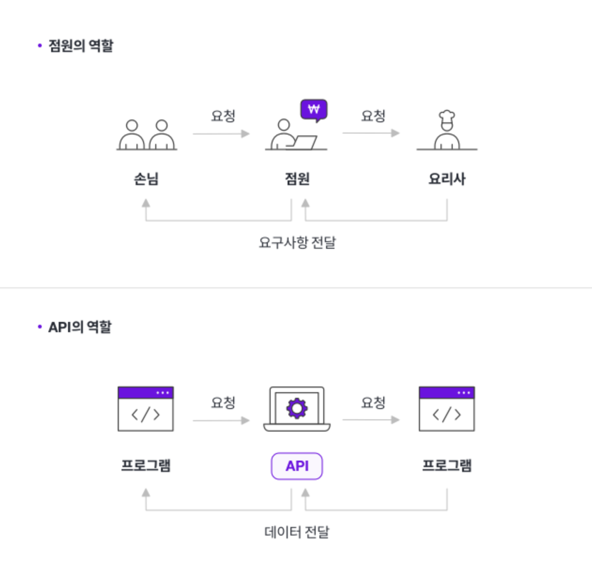
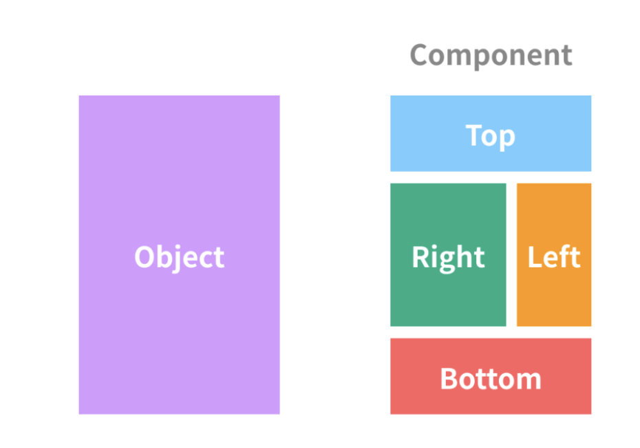
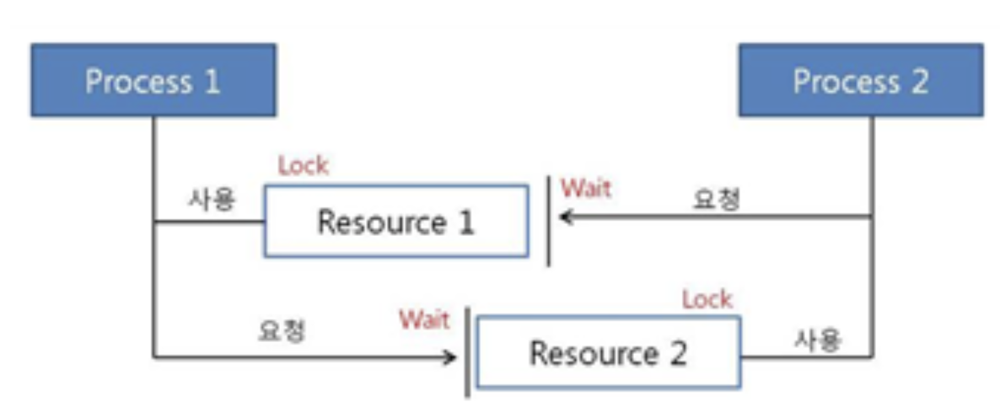

# 04. 아키텍처 용어 정리

## 애플리케이션 프로그래밍 인터페이스 (API)

- API는 정의 및 프로토콜 집합을 사용하여 두 소프트웨어 구성 요소가 서로 통신할 수 있게 하는 메커니즘이다.

- 여러 프로그램들과 데이터베이스, 그리고 기능들의 상호 통신 방법을 규정하고 도와주는 매개체이다.

- 예를 들어 레스토랑에 요리사, 점원, 손님이 있을 때 API는 레스토랑의 점원이다.

    - 레스토랑에서 손님에게 주문 가능한 메뉴를 보여주고 손님이 고른 음식을 주방에 전달한 후, 음식이 나오면 고객에게 전달하는 '점원'이 API이다.

    

  

## 핸들러(Handler)

- 핸들러라는 단어는 MySQL 서버의 소스코드로부터 넘어온 표현이다.

- 자동차로 비유하면 쉽게 이해할 수 있다.

- 사람이 핸들(운전대)을 이용해 자동차를 운전하듯이,  
    프로그래밍 언어에서는 어떤 기능을 호출하기 위해 사용하는 운전대와 같은 역할을 하는 `객체`를 `핸들러`라고 표현한다.

- MySQL 서버에서 MySQL 엔진은 사람 역할을 하고, 각 스토리지 엔진은 자동차 역할을 한다.

- MySQL 엔진이 스토리지 엔진을 조정하기 위해 핸들러라는 것을 사용하게 된다.

 

## 플러그인(Plugin)

- 프로그램이나 소프트웨어 추가 기능을 제공하기 위해 확장 모듈로서 동작하는 소프트웨어 구성 요소

- 플러그인은 원래의 소프트웨어에 연결되어 특정 작업을 수행하거나 기능을 확장하도록 설계되어 있다.

- 즉, 내가 사용하고 있는 프로그램에 어떠한 기능을 더하는 기능을 의미한다.

 

## 컴포넌트 (Component)

- 일반적으로 컴포넌트는 프로그래밍에 있어 재사용이 가능한 각각의 독립된 모듈을 뜻한다.

    

### 컴포넌트 개념의 유래

- 소프트웨어가 독립적으로 개발되었고, 다른 모듈과 호환을 생각하지 않고 개발하면, 소프트웨어의 재사용을 어렵게하고 유지보수 비용이 크게 증가하는 원인이 된다.

> 이러한 상황에서 소프트웨어의 재사용의 중요성과 필요성을 위해 나온 기술이 컴포넌트 기술이다.

### 데이터베이스의 구성요소 (Components)

 

- 엔터티 (Entity)

    > 엔터티는 사람, 장소, 물건, 사건, 개념 등 여러 개의 속성을 지닌 명사를 의미한다.

    - 데이터베이스의 테이블이라고 생각하면 이해가 편합니다.

 

- 릴레이션 (Relation)

    > 릴레이션은 데이터베이스에서 정보를 구분하여 저장하는 기본 단위이다.

    - 하나의 엔터티 내에서 데이터가 표현되는 방식으로 이해하면 편합니다.

    - RDBMS(관계형 데이터베이스) 에서는 엔터티 내부에서 릴레이션이 `테이블` 방식입니다.

    - MySQL 에서는 `레코드 - 테이블 - 데이터베이스` 형식으로 데이터가 관리됩니다.

 

- 속성 (Attribute)

    > 릴레이션에서 관리하는 구체적이며 고유한 이름을 가지고 있는 정보

    - 예를 들어, 6학년 10반이라는 엔터티가 있으면 그 안의 속성으로는 이름, 성별, 번호 등이 속성으로 있을 수 있다.

 

- 도메인 (Domain)

    > 각 속성이 가질 수 있는 데이터 값의 집합이다.

    - 학급의 성별은 남, 여 밖에 없으니, 성별의 도메인은 남과 여라고 볼 수 있다.

 

- 필드 (field)

    > 필드란 하나의 엔터티 내의 속성 하나 하나를 필드라고 말합니다.

    - 필드 타입은 다음과 같습니다.

        1. 숫자 : TINYINT, SMALLINT, MEDIUMINT, INT, BIGINT ...

        2. 날짜 : DATE, DATETIME, TIMESTAMP

        3. 문자 : CHAR, VARCHAR, TEXT, BLOB, ENUM, SET

 

- 레코드 or 튜플 (Record or Tuple)

    > 레코드 또는 튜플이란 테이블에서 여러 개의 속성에 대한 값을 하나의 행 (ROW) 단위로 묶어 놓은 것이다.

    - 한 줄의 데이터라고 볼 수 있다.

 

- 관게 (Relationship)

    > 테이블마다 서로의 관계를 정의할 수 있습니다.

    - 관계는 다음과 같은 유형으로 정의 될 수 있다.

        1. 1 : 1 (일 대 일)

        2. 1 : N (일 대 다)

        3. N : N (다 대 다)

 

- 키 (Keys)

    > 관계를 조금 더 명확하게 도와줄 수 있는 것이 바로 `키`이다.

    1. 기본 키 (Primary Key)

    2. 외래 키 (Foreign Key)

    3. 대체 키 (Alternate Key)

    4. 슈퍼 키 (Super Key)

 

## 데이터 베이스에서 클러스터링

- 보통 데이터베이스의 구축의 경우 1개의 서버로 하나의 데이터베이스를 구축해서 사용하는 편입니다.

- 만약 서버가 죽으면 서비스가 죽는 현상이 발생하게됩니다.

- 또는 많은 사용자가 유입되었을 때 이에 대한 처리를 1개의 서버가 처리하려고 하면 서버는 견디지 못합니다.

> 이러한 이유들로 하나의 데이터 베이스를 여러 서버가 나눠서 구축하게 되는 경우를 클러스터(Cluster)라고 합니다.

  

## 데드락 (DeadLock, 교착 상태)

 

- 두 개 이상의 프로세스나 스레드가 서로 자원을 얻지 못해서 다음 처리를 하지 못하는 상태

- 무한히 다음 자원을 기다리는 상태를 말한다.

- 시스템적으로 한정된 자원을 여러 곳에서 사용하려고 할 때 발생한다.

> 마치, 외나무 다리의 양 끝에서 서로가 비켜주기를 기다리고만 있는 것과 같은 상태이다.

- 데드락이 일어나는 경우

    - 프로세스1과 2가 자원1, 2를 모두 얻어야 한다고 가정해보자

    - t1 : 프로세스1이 자원1을 얻음 / 프로세스2가 자원2를 얻음

    - t2 : 프로세스1은 자원2를 기다림 / 프로세스2는 자원1을 기다림

    > 현재 서로 원하는 자원이 상대방에게 할당되어 있어서 두 프로세스는 무한정 wait 상태에 빠짐

  

## 트랜잭션의 특성 (ACID)

- 트랜잭션(Transaction)이란?

    > 데이터베이스의 상태를 변환시키는 하나의 논리적 기능(예 : UPDATE, DELETE)을 수행하기 위한 작업의 단위 혹은 일련의 연산을 말한다.

1. 원자성 (Atomicity)

    - 트랜잭션의 연산은 데이터베이스에 전부 반영이되거나 전부 반영이 되지 않아야 한다.

    - 즉, 트랜잭션 내의 모든 명령은 반드시 완벽히 수행되어야 한다.

    - 모두가 완벽히 수행되지 않고 어느 하나라도 오류가 발생하면 트랜잭션 전부가 취소되어야 한다.

     

2. 일관성 (Consistency)

    - 트랜잭션이 실행을 성공적으로 완료하면 언제나 일관성있는 데이터베이스 상태로 변환한다.

    - 시스템이 가지고 있는 고정요소는 트랜잭션 수행 전과 트랜잭션 수행 완료 후의 상태가 같아야 한다.

     

3. 독립성 (Isolation)

    - 하나의 트랜잭션이 실행하고 있는 도중에 다른 트랜잭션이 하이재킹 할 수 없다.

    - 수행중인 트랜잭션은 완전히 완료될 때까지 다른 트랜잭션에서 수행 결과를 참조할 수 없다.

     

4. 영속성 (Durability)

    - 성공적으로 완료된 트랜잭션의 결과는 시스템이 고장나더라도 영구적으로 반영되어야 한다.

     

 

## 아카이빙

- 사전적 의미로 '보관' 이라는 뜻을 가지고 있습니다.

- 현재 운영 시스템 및 데이터베이스에서 사용 빈도가 낮은 데이터를 확인하여 장기간 저장가능한 스토리지 시스템으로 옮기는 프로세스이다.

### 아카이빙의 목적

- 사용 빈도가 낮은 데이터 또는 과거 데이터가 손실되거나 제거되지 않도록 보호하고, 규정 또는 회사 보존 정책을 준수하도록 데이터를 보존하며, 액세스해야 하는 사용자가 데이터를 쉽게 사용할 수 있도록 설계되었다.

### 아카이빙의 이점

- 데이터베이스 및 기본 스토리지 사이트의 크기를 줄여 애플리케이션 및 시스템의 성능을 향상시킨다.

- 비용 절감

- 손쉽게 관리

  

## 슬로우 쿼리 (Slow Query)

### 쿼리 (Query)

- 사전적 의미로는 '질의', '문의', '질문하다' 이다.

- 데이터베이스 등에서 원하는 정보를 검색하기 위해 요청하는 것이다.

- 질의를 위한 특정한 구조의 프로그램 언어를 사용하기도 하며 대표적으로 `SQL(Structured Query Langauge)`이 있다.

### 슬로우 쿼리 (Slow Query)

- DBMS가 클라이언트로부터 요청받은 쿼리를 수행할 때 일정 시간 이상 수행되지 못한 쿼리를 말한다.

 

---

# 출처

* [API_1](https://aws.amazon.com/ko/what-is/api/)

* [API_2](https://brunch.co.kr/@operator/65)

* [API_3](https://www.hanl.tech/blog/api%EB%9E%80-api%EC%9D%98-%EC%A0%95%EC%9D%98%EC%99%80-%EC%A2%85%EB%A5%98-%EC%9E%A5%EB%8B%A8%EC%A0%90/)

* [API_4](https://blog.wishket.com/api%EB%9E%80-%EC%89%BD%EA%B2%8C-%EC%84%A4%EB%AA%85-%EA%B7%B8%EB%A6%B0%ED%81%B4%EB%9D%BC%EC%9D%B4%EC%96%B8%ED%8A%B8/)

* [플러그인](https://sharonprogress.tistory.com/193)

* [컴포넌트 및 컴포넌트 개념의 유래](https://hanamon.kr/%EC%BB%B4%ED%8F%AC%EB%84%8C%ED%8A%B8-component%EB%9E%80/)

* [데이터베이스의 구성요소](https://velog.io/@mathe1303/DataBase-DataBase-and-its-Component)

* [데이터 베이스에서 클러스터링](https://medium.com/@su_bak/%EB%8D%B0%EC%9D%B4%ED%84%B0%EB%B2%A0%EC%9D%B4%EC%8A%A4%EC%97%90%EC%84%9C-%ED%81%B4%EB%9F%AC%EC%8A%A4%ED%84%B0-cluster-%EB%9E%80-9f3aa611f22a)

* [데드락](https://gyoogle.dev/blog/computer-science/operating-system/DeadLock.html)

* [트랜잭션의 특성 (ACID)](https://jindevelopetravel0919.tistory.com/48)

* [아카이빙](https://www.dell.com/ko-kr/dt/learn/data-protection/what-is-archiving.htm)

* [슬로우 쿼리](https://dotherealthing.tistory.com/16)