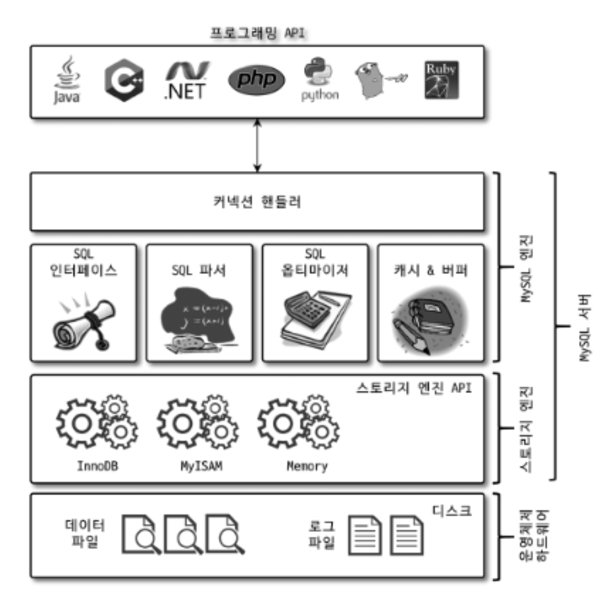
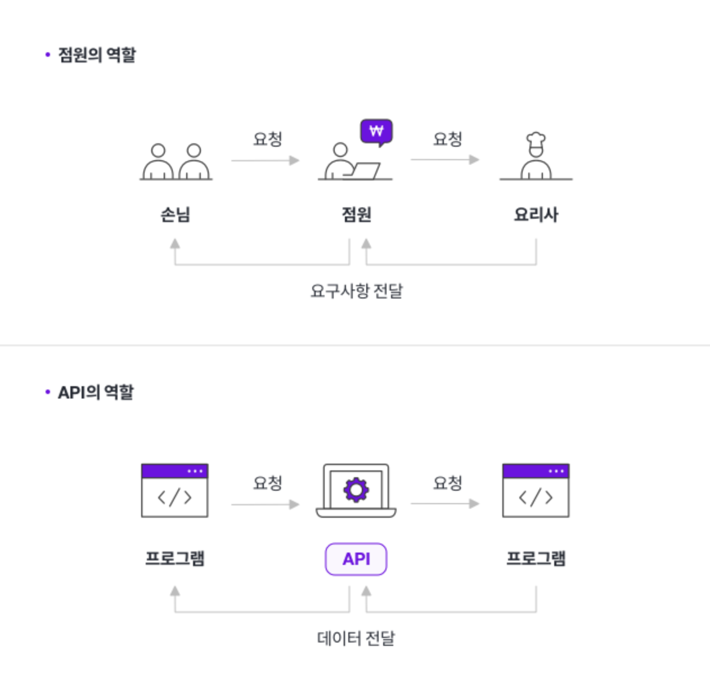

# 04. 아키텍처 용어 정리

* MySQL의 전체 구조

 

- 애플리케이션 프로그래밍 인터페이스 (API)

    - API는 정의 및 프로토콜 집합을 사용하여 두 소프트웨어 구성 요소가 서로 통신할 수 있게 하는 메커니즘이다.

    - 여러 프로그램들과 데이터베이스, 그리고 기능들의 상호 통신 방법을 규정하고 도와주는 매개체이다.

    - 예를 들어 레스토랑에 요리사, 점원, 손님이 있을 때 API는 레스토랑의 점원이다.

        - 레스토랑에서 손님에게 주문 가능한 메뉴를 보여주고 손님이 고른 음식을 주방에 전달한 후, 음식이 나오면 고객에게 전달하는 '점원'이 API이다.

        

  

- 핸들러(Handler)

    - 핸들러라는 단어는 MySQL 서버의 소스코드로부터 넘어온 표현이다.

    - 자동차로 비유하면 쉽게 이해할 수 있다.

    - 사람이 핸들(운전대)을 이용해 자동차를 운전하듯이,  
    프로그래밍 언어에서는 어떤 기능을 호출하기 위해 사용하는 운전대와 같은 역할을 하는 `객체`를 `핸들러`라고 표현한다.

    - MySQL 서버에서 MySQL 엔진은 사람 역할을 하고, 각 스토리지 엔진은 자동차 역할을 한다.

    - MySQL 엔진이 스토리지 엔진을 조정하기 위해 핸들러라는 것을 사용하게 된다.

# 출처

* [API_1](https://aws.amazon.com/ko/what-is/api/)

* [API_2](https://brunch.co.kr/@operator/65)

* [API_3](https://www.hanl.tech/blog/api%EB%9E%80-api%EC%9D%98-%EC%A0%95%EC%9D%98%EC%99%80-%EC%A2%85%EB%A5%98-%EC%9E%A5%EB%8B%A8%EC%A0%90/)

* [API_4](https://blog.wishket.com/api%EB%9E%80-%EC%89%BD%EA%B2%8C-%EC%84%A4%EB%AA%85-%EA%B7%B8%EB%A6%B0%ED%81%B4%EB%9D%BC%EC%9D%B4%EC%96%B8%ED%8A%B8/)