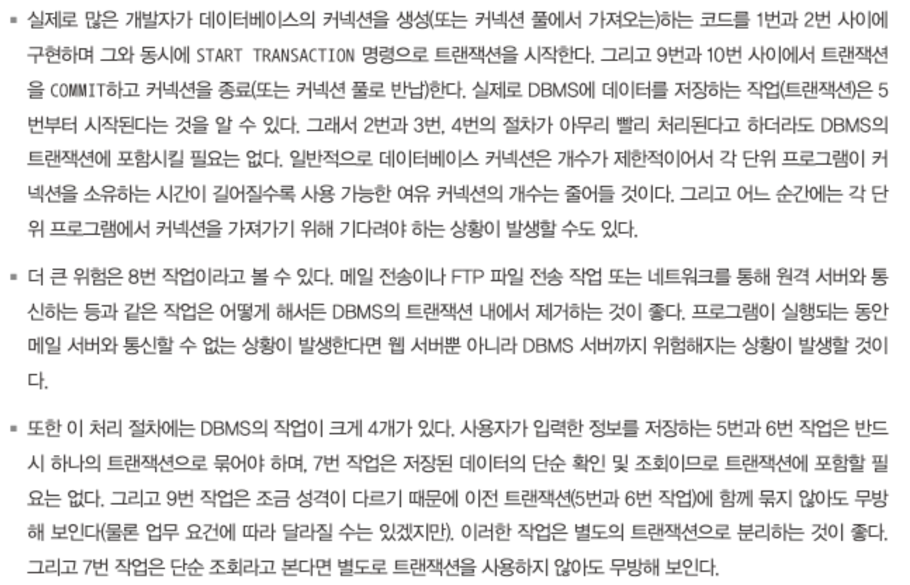
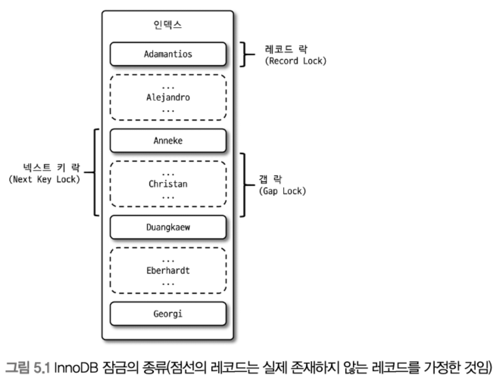
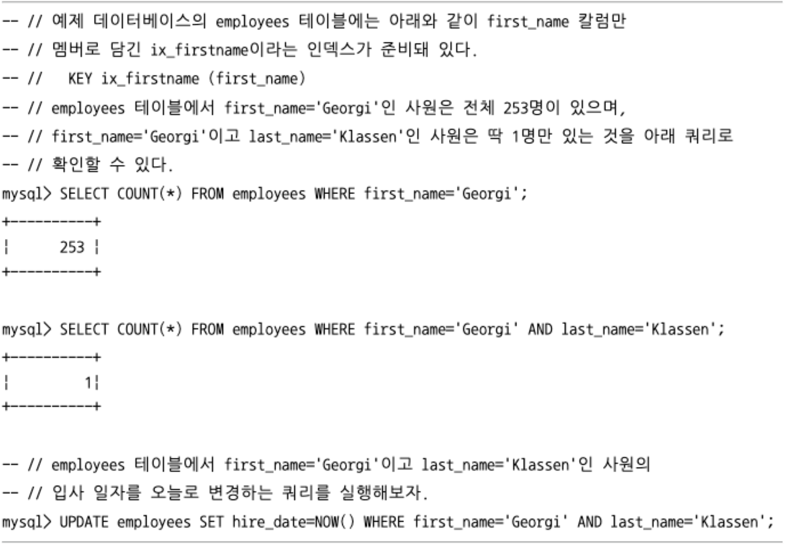
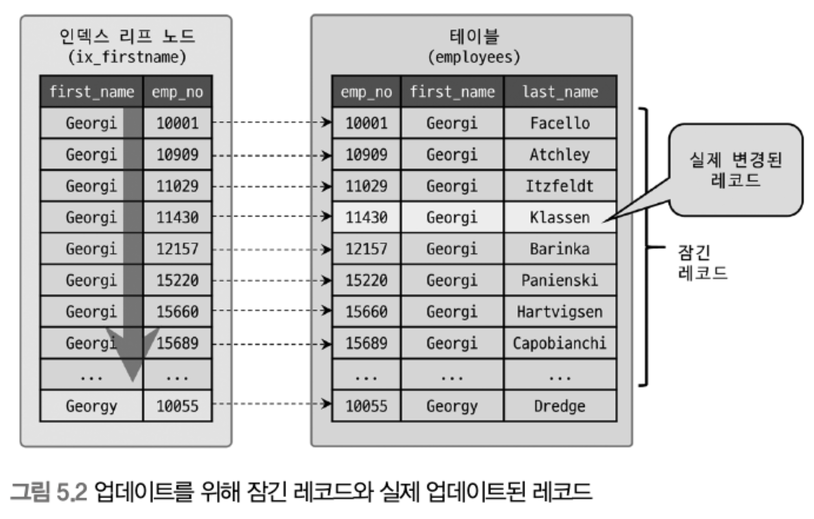
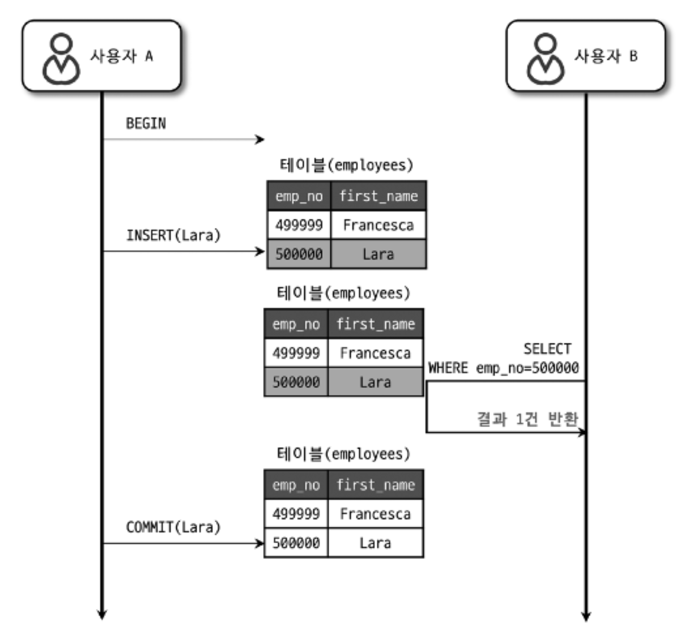
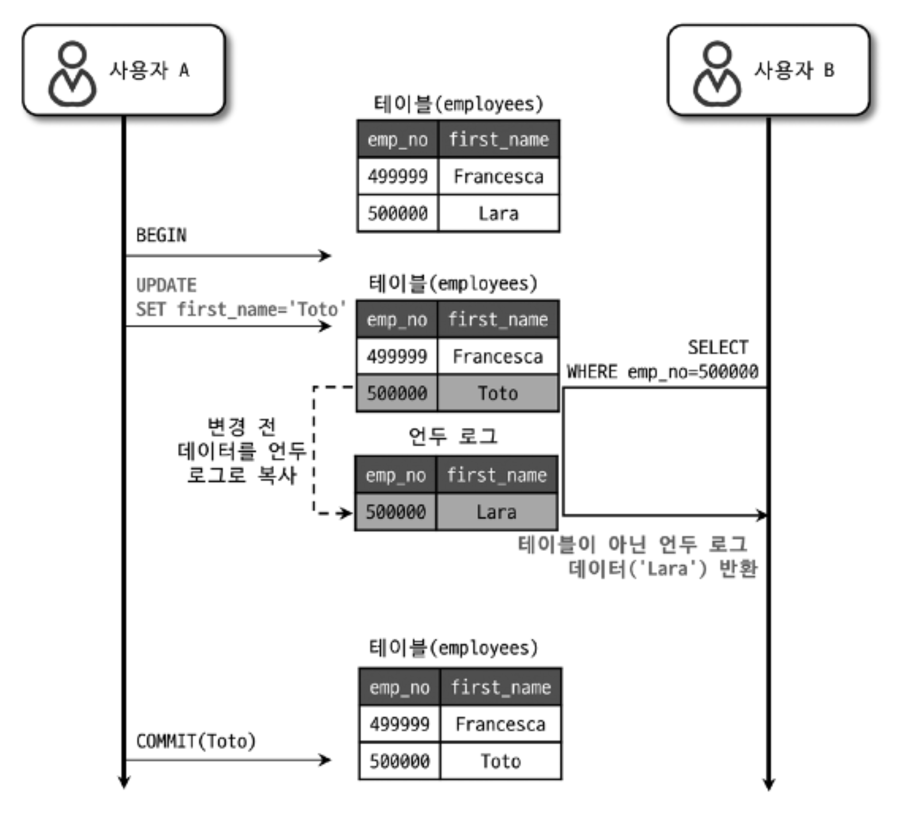
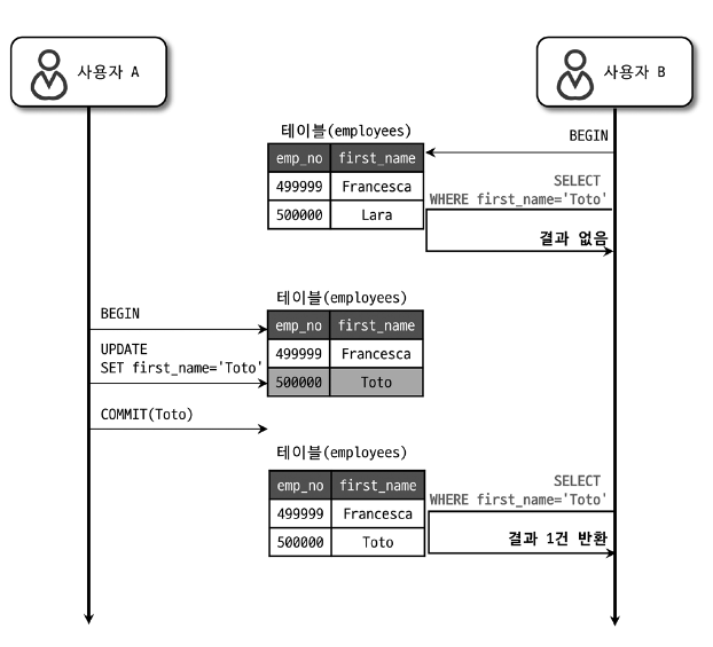
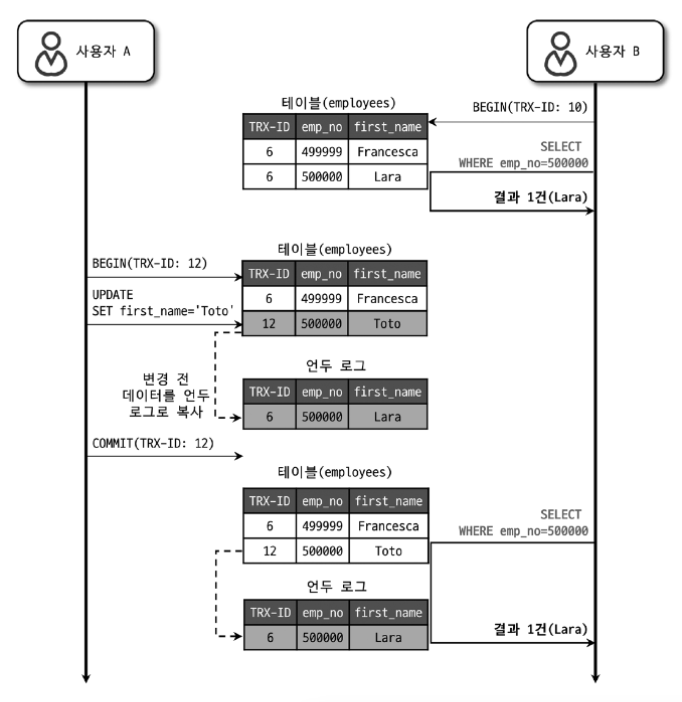
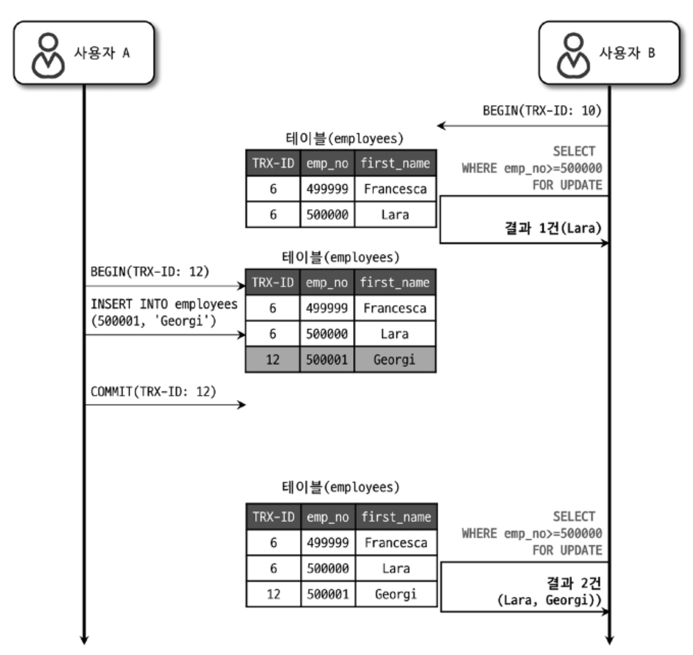

# 05. 트랜잭션과 잠금

이번 장에서는 MySQL의 동시성에 영향을 미치는 `잠금(Lock)`과 `트랜잭션`, `트랜잭션의 격리 수준(Isolation level)`을 살펴보겠습니다.

# 5.1 트랜잭션

트랜잭션을 지원하지 않는 MyISAM과 트랙잭션을 지원하는 InnoDB의 처리 방식 차이를 살펴보겠습니다.

그리고 트랜잭션을 사용할 경우 주의할 사항도 함께 살펴보겠습니다.

## 5.1.1 MySQL에서의 트랜잭션

> 트랜잭션은 논리작인 작업 셋 자체가 100% 적용되거나 아무것도 적용되지 않아야 함을 보장해주는 것이다.

- 100% 적용 : COMMIT을 실행했을 때

- 아무것도 적용 X : ROLLBACK 또는 트랜잭션을 ROLLBACK 시키는 오류가 발생했을 때

간단한 에제로 트랜잭션 관전에서 InnoDB 테이블과 MyISAM 테이블의 차이를 살펴보자.

```SQL
mysql> CREATE TABLE tab_myisam ( fdpk INT NOT NULL, PRIMARY KEY (fdpk) ) ENGINE=MyISAM;
Query OK, 0 rows affected (0.01 sec)

mysql> INSERT INTO tab_myisam (fdpk) VALUES (3);
Query OK, 1 row affected (0.01 sec)

mysql> CREATE TABLE tab_innodb ( fdpk INT NOT NULL, PRIMARY KEY (fdpk) ) ENGINE=INNODB;
Query OK, 0 rows affected (0.01 sec)

mysql> INSERT INTO tab_innodb (fdpk) VALUES (3);
Query OK, 1 row affected (0.00 sec)
```

위와 같이 테스트용 테이블에 각각 레코드를 1건씩 저장한 후,  
AUTO-COMMIT 모드에서 다음 쿼리 문장을 InnoDB 테이블과 MyISAM 테이블에서 각각 실행해보자.

```SQL
-- // AUTO-COMMIT 활성화
mysql> SET autocommit=ON;
Query OK, 0 rows affected (0.00 sec)

mysql> INSERT INTO tab_myisam (fdpk) VALUES (1), (2), (3);
ERROR 1062 (23000): Duplicate entry '3' for key 'tab_myisam.PRIMARY'

mysql> INSERT INTO tab_innodb (fdpk) VALUES (1),(2),(3);
ERROR 1062 (23000): Duplicate entry '3' for key 'tab_innodb.PRIMARY'

mysql> SELECT * FROM tab_myisam;
+------+
| fdpk |
+------+
|    1 |
|    2 |
|    3 |
+------+
3 rows in set (0.00 sec)

mysql> SELECT * FROM tab_innodb;
+------+
| fdpk |
+------+
|    3 |
+------+
1 row in set (0.00 sec)
```

두 INSERT 문장 모두 프라이머리 키 중복 오류로 쿼리가 실패했다.

그런데 두 테이블의 레코드를 조회해보면 MyISAM 테이블에는 오류가 발생했음에도 '1' 과 '2' 는 INSERT된 상태로 남아 있는 것을 확인할 수 있다.

즉, MyISAM 테이블에 INSERT 문장이 실행되면서 차례대로 '1' 과 '2'를 저장하고, 그 다음 '3'을 저장하려고 하는 순간 중복 키 오류가 발생한 것이다.

MyISAM 테이블에서 실행되는 쿼리는 이미 INSERT 된 '1'과 '2'를 그대로 두고 쿼리 실행을 종료해 버린다.

MEMORY 스토리지 엔진을 사용하는 테이블도 MyISAM 테이블과 동일하게 작동한다.

하지만 InnoDB는 쿼리 중 일부라도 오류가 발생하면 전체를 원 상태로 만든다는 트랜잭션의 원칙대로 INSERT 문장을 실행하기 전 상태로 복구했다.

MyISAM 테이블에서 발생하는 이러한 현상을 `부분 업데이트 (Partial Update)` 라고 표현한다.

부분 업데이트 현상은 테이블 데이터의 정합성을 맞추는데 상당히 어려운 문제를 만들어 낸다.

만약 부분 업데이트 현상이 발생하면 실패한 쿼리로 인해 남은 레코드를 다시 삭제하는 재처리 작업이 필요할 수 있다.

```SQL
INSERT INTO tab_a ...;

IF(_is_insert1_succeed){
    INSERT INTO tab_b ...;
    IF(_is_insert2_succeed){
        // 처리 완료
    }ELSE{
        DELETE FROM tab_a WHERE ...;
        IF(_is_delete_succeed){
            // 처리 실패 및 tab_a, tab_b 모두 원상 복구 완료
        }ELSE{
            // 해결 불가능한 심각한 상황 발생 ...
        }
    }
}
```

위의 코드가 매우 길고, 복잡하지만 트랜잭션이 지원되지 않는 MyISAM에 레코드를 INSERT 할 때 위와 같이 하지 않으면 방법이 없다.

반면 InnoDB 테이블에서 처리한다고 가정하면 다음과 같은 간단한 코드로 완벽한 구현이 가능하다.

```SQL
try {
    START TRANSACTION;
    INSERT INTO tab_a ...;
    INSERT INTO tab_b ...;
    COMMIT;
} catch(exception) {
    ROLLBACK;
}
```

## 5.1.2 주의사항

트랜잭션 또한 DBMS의 커넥션과 동일하게 꼭 필요한 최소 코드에만 적용하는 것이 좋다.

이는 프로그램 코드에서 트랜잭션의 범위를 최소화하라는 의미다.

다음 설명은 사용자가 게시판에 게시물을 작성한 후 저장 버튼을 클릭했을 때 서버에서 처리하는 내용을 순서대로 간단하게 정리한 것이다.

```
1) 처리 시작
    -> 데이터베이스 커넥션 생성
    -> 트랜잭션 시작

2) 사용자의 로그인 여부 확인
3) 사용자의 글쓰기 내용의 오류 여부 확인
4) 첨부로 업로드된 파일 확인 및 저장
5) 사용자의 입력 내용을 DBMS에 저장
6) 첨부 파일 정보를 DBMS에 저장
7) 저장된 내용 또는 기타 정보를 DBMS에서 조회
8) 게시물 등록에 대한 알림 메일 발송
9) 알림 메일 발송 이력을 DBMS에 저장
    <- 트랜잭션 종료 (COMMIT)
    <- 데이터베이스 커넥션 반납

10) 처리 완료
```

위 처리 절차 중에서 DBMS의 트랜잭션 처리에 좋지 않은 영향을 미치는 부분을 나눠서 살펴보자.



문제가 될 만한 부분 세 가지를 보완해서 위의 처리 절차를 다시 한 번 설계해보자.

```
1) 처리 시작
2) 사용자의 로그인 여부 확인
3) 사용자의 글쓰기 내용의 오류 여부 확인
4) 첨부로 업로드된 파일 확인 및 저장
    -> 데이터베이스 커넥션 생성
    -> 트랜잭션 시작

5) 사용자의 입력 내용을 DBMS에 저장
6) 첨부 파일 정보를 DBMS에 저장
    <- 트랜잭션 종료 (COMMIT)

7) 저장된 내용 또는 기타 정보를 DBMS에서 조회
8) 게시물 등록에 대한 알림 메일 발송
    -> 트랜잭션 시작
9) 알림 메일 발송 이력을 DBMS에 저장
    <- 트랜잭션 종료 (COMMIT)
    <- 데이터베이스 커넥션 종료 (또는 커넥션 풀에 반납)

10) 처리 완료
```

구현하고자 하는 업무 특성에 따라 최적의 트랜잭션 설계가 아닐 수 있다.

> 프로그램의 코드가 데이터베이스 커넥션을 가지고 있는 범위와 트랜잭션이 활성화돼 있는 프로그램의 범위를 최소화해야 한다는 것이다.

# 5.2 MySQL 엔진의 잠금

MySQL에서 사용되는 잠금은 크게 `스토리지 엔진 레벨`과 `MySQL 엔진 레벨`로 나눌 수 있다.

- MySQL 엔진 레벨의 잠금은 모든 스토리지 엔진에 영향을 미친다.

- 스토리지 엔진 레벨의 잠금은 스토리지 엔진 간 상호 영향을 미치지는 않는다.

## 5.2.1 글로벌 락

MySQL에서 제공하는 잠금 가운데 가장 범위가 크다.

일단 한 세션에서 글로벌 락을 획득하면 다른 세션에서 SELECT를 제외한 대부분의 DDL, DML 문장을 실행하는 경우 글로벌 락이 해제될 때까지 해당 문장이 대기 상태로 남는다.

대상 테이블이나 데이터베이스가 다르다 하더라도 동일하게 MySQL 서버 전체에 영향을 미친다.

여러 데이터베이스에 존재하는 MyISAM 이나 MEMORY 테이블에 대해 mysqldump 로 일관된 백업을 받아야할 때는 글로벌 락을 사용해야 한다.

글로벌 락(GLOBAL LOCK)은 다음 명령으로 획득 할 수 있다.

```SQL
mysql> FLUSH TABLES WITH READ LOCK
```

## 5.2.2 테이블 락

테이블 락(Table Lock)은 개별 테이블 단위로 설정되는 잠금이며, 묵시적으로 특정 테이블의 락을 다음과 같은 명령으로 획들 할 수 있다.

```SQL
mysql> LOCK TABLES table_name [READ | WRITE]
```

테이블 락은 MyISAM 뿐 아니라 InnoDB 스토리지 엔진을 사용하는 테이블도 동일하게 설정할 수 있다.

명시적으로 획득한 잠금은 UNLOCK TABLES 명령으로 잠금을 반납(해제)할 수 있다.

InnoDB 테이블의 경우 스토리지 엔진 차원에서 레코드 기반의 잠금을 제공하기 때문에 단순 데이터 변경 쿼리로 인해 묵시적인 테이블 락이 설정되지 않는다.

InnoDB 테이블에도 테이블 락이 설정되지만 대부분의 데이터 변경(DML) 쿼리에서는 무시되고 스키마를 변경하는 쿼리(DDL)의 경우에만 영향을 미친다.

## 5.2.3 네임드 락

네임드 락(Named Lock)은 `GET_LOCK()` 함수를 이용해 임의의 문자열에 대해 잠금을 설정할 수 있다.

특징은 대상이 테이블이나 레코드 또는 AUTO_INCREMENT와 같은 데이터베이스 객체가 아니라는 것이다.

네임드 락은 단순히 사용자가 지정한 문자열(String)에 대해 획득하고 반납(해제)하는 잠금이다.

```SQL
-- // "mylock"이라는 문자열에 대해 잠금을 획득한다.
-- // 이미 잠금을 사용 중이면 2초 동안만 대기한다. (2초 이후 자동 잠금 해제됨)
mysql> SELECT GET_LOCK('mylock', 2);

--// "mylock"이라는 문자열에 대해 잠금이 설정돼 있는지 확인한다.
mysql> SELECT IS_FREE_LOCK('mylock');

--// "mylock"이라는 문자열에 대해 획득했던 잠금을 반납(해제)한다.
mysql> SELECT RELEASE_LOCK('mylock');

--// 3개 함수 모두 정상적으로 락을 획득하거나 해제한 경우에는 1을, 아니면 NULL이나 0을 반환한다.
```

네임드 락의 경우 많은 레코드에 대해서 복잡한 요건으로 레코드를 변경하는 트랜잭션에 유용하게 사용할 수 있다.


## 5.2.4 메타데이터 락

메타데이터 락(Metadata Lock)은 데이터베이스 객체(대표적으로 테이블이나 뷰 등)의 이름이나 구조를 변경하는 경우에 획득하는 잠금이다.

명시적으로 획득하거나 해제할 수 있는 것이 아니고 "RENAME TABLE tab_a TO tab_b" 같이 테이블의 이름을 변경하는 경우 자동으로 획득하는 잠금이다.

RENAME TABLE 명령의 경우 원본 이름과 변경될 이름 두 개 모두 한꺼번에 잠금을 설정한다.

또한 실시간으로 테이블을 바꿔야 하는 요건이 배치 프로그램에서 자주 발생하는데, 다음 예제를 잠깐 살펴보자.

```SQL
-- // 배치 프로그램에서 별도의 임시 테이블(rank_new)에 서비스용 랭킹 데이터를 생성

-- // 랭킹 배치가 완료되면 현재 서비스용 랭킹 테이블(rank)을 rank_backup으로 백업하고
-- // 새로 만들어진 랭킹 테이블(rank_new)을 서비스용으로 대체하고자 하는 경우
mysql> RENAME TABLE rank TO rank_backup, rank_new TO rank;
```

위와 같이 하나의 RENAME TABLE 명령문에 두 개의 RENAME 작업을 한꺼번에 실행하면 실제 애플리케이션에서는 오류 없이 적용하는 것이 가능하다.

# 5.3 InnoDB 스토리지 엔진 잠금

InnoDB 스토리지 엔진은 MySQL에서 제공하는 잠금과는 별개로 스토리지 엔진 내부에서 레코드 기반의 잠금 방식을 탐재하고 있다.

InnoDB는 레코드 기반의 잠금 방식 때문에 MyISAM보다는 훨씬 뛰어난 동시성 처리를 제공할 수 있다.

까다롭던 과거와 다르게 최근 버전에서는 InnoDB의 트랜잭션 잠금, 그리고 잠금 대기 중인 트랜잭션의 목록을 조회할 수 있는 방법이 도입됐다.

위 방법은 MySQL 서버의 information_schema 데이터베이스에 존재하는 INNODB_TRX, INNODB_LOCKS, INOODB_LOCK_WAITS 와 같은 명령어로 조회할 수 있다.

더 나아가 InnoDB의 중요도가 높아졌고, InnoDB의 잠금에 대한 모니터링도 더 강화되면서 Performance Schema를 이용해 내부 잠금에 대한 모니터링 방법도 추가됐다.

## 5.3.1 InnoDB 스토리지 엔진의 잠금

InnoDB 스토리지 엔진은 레코드 기반의 잠금 기능을 제공한다.

잠금 정보가 상당히 작은 공간으로 관리되기 때문에 레코드 락이 페이지 락으로, 또는 테이블 락으로 레벨업되는 경우 (`락 에스컬레이션`)는 없다.

그리고 일반 상용 DBMS와는 조금 다르게 레코드 사이의 간격을 잠그는 갭(GAP) 이라는 것이 존재한다.



<br>

### 5.3.1.1 레코드 락

레코드 자체만을 잠금는 것을 `레코드 락(Record lcok, Record only lock)`이라고 한다.

다른 사용 DBMS의 레코드 락과 동일한 역할을 한다.

한 가지 중요한 차이는 InnoDB 스토리지 엔진은 레코드 자체가 아니라 인덱스의 레코드를 잠근다는 점이다.

인덱스가 없는 테이블이라도 내부적으로 자동 생성된 클러스터 인덱스를 이용해 잠금을 설정한다.

### 5.3.1.2 갭 락

갭 락은 레코드 자체가 아니라 레코드와 인전합 레코드 사이의 간격만을 잠그는 것을 의미한다.

갭 락의 역할은 레코드와 레코드 사이의 간격에 새로운 레코드가 생성(INSERT)되는 것을 제어하는 것이다.

갭 락은 그 자체보다는 넥스트 키 락의 일부로 자주 사용된다.

### 5.3.1.3 넥스트 키 락

레코드 락과 갭 락을 합쳐 놓은 형태의 잠금을 `넥스트 키 락(Next key lock)`이라고 한다.

STATEMENT 포맷의 바이너리 로그를 사용하는 MySQL 서버에서는 REPEATABLE READ 격리 수준을 사용해야 한다.

또한 innodb_locks_unsafe_for_binlog 시스템 변수가 비활성화되면(0으로 설정)변경을 위해 검색하는 레코드에는 넥스트 키 락 방식으로 잠금이 걸린다.

InnoDB의 갭락이나 넥스트 키락은 바이너리 로그에 기록되는 쿼리가 레플리카 서버에서 실행될 때 소스 서버에서 만들어 낸 결과와 동일한 결과를 만들어내도록 보장하는 것이 주 목적이다.

그런데 의외로 넥스트 키 락과 갭 락으로 인해 데드락이 발생하거나 다른 트랜잭션을 기다리게 만드는 일이 자주 발생한다.

가능하다면 바이너리 로그 포맷을 ROW 형태로 바꿔서 넥스트 키락이나 갭 락을 줄이는 것이 좋다.

> MySQL 8.0 에서는 ROW 포맷의 바이너리 로그가 기본 설정으로 변경됐다.

### 5.3.1.4 자동 증가 락

MySQL에서는 자동 증가하는 숫자 값을 추출(채번)하기 위해 AUTO_INCREMENT라는 칼럼 속성을 제공한다.

AUTO_INCREMENT 칼럼이 사용된 테이블에 동시에 여러 레코드가 INSERT되는 경우, 저장되는 각 레코드는 중복되지 않고 저장된 순서대로 일련번호 값을 가져야 한다.

InnoDB 스토리지 엔진에서는 이를 위해 내부적으로 AUTO_INCREMENT 락이라고 하는 테이블 수준의 잠금을 사용한다.

AUTO_INCREMENT은 INSERT와 REPLACE 쿼리 문장과 같이 새로운 레코드를 저장하는 쿼리에서만 필요하다. (UPDATE, DELETE $\rightarrow$ X)

AUTO_INCREMENT 락은 트랜잭션과 관계없이 INSERT나 REPLACE 문장에서 AUTO_INCREMENT 값을 가져오는 순간만 락이 걸렸다가 즉시 해제된다.

AUTO_INCREMENT 락은 테이블에 단 하나만 존재하기 때문에 두 개의 INSERT 쿼리가 동시에 실행되는 경우 나머지 하나는 AUTO_INCREMENT 락을 기다려야 한다.

## 5.3.2 인덱스와 잠금

InnoDB의 잠금은 레코드를 잠그는 것이 아니라 인덱스를 잠그는 방식으로 처리된다.

> 즉, 변경해야 할 레코드를 찾기 위해 검색한 인덱스의 레코드를 모두 락을 걸어야 한다.

### 예시



<br>

UPDATE 문장이 실행되면 1건의 레코드가 업데이트 될 것이다.

하지만 이 1건의 업데이트를 위해 몇 개의 레코드에 락을 걸어야 할까?

이 UPDATE 문장의 조건에서 인덱스를 이용할 수 있는 조건은 first_name='Georgi' 이며, last_name 칼럼은 인덱스가 없기 때문에 해당 레코드 253건의 레코드가 모두 잠긴다.

다음 그림은 예제의 UPDATE 문장이 어떻게 변경 대상 레코드를 검색하고, 실제 변경이 수행되는지를 보여준다.



<br>

UPDATE 문장을 위해 적절히 인덱스가 준비돼 있지 않다면 각 클라이언트 간의 동시성이 상당히 떨어질 것이다.

한 세션에서 UPDATE 작업을 하는 중에는 다른 클라이언트는 그 테이블을 업데이트하지 못하고 기다려야 하는 상황이 발생할 것이다.

> MySQL의 InnoDB에서 인덱스 설계가 중요한 이유이다.

## 5.3.3 레코드 수준의 잠금 확인 및 해제

테이블 잠금에서는 잠금의 대상이 테이블 자체이므로 쉽게 문제의 원인이 발견되고 해결될 수 있다.

하지만 레코드 수준의 잠금은 테이블의 레코드 각각에 잠금이 걸리므로 그 레코드가 자주 사용되지 않는다면 오랜 시간 동안 잠겨진 상태로 남아 있어도 잘 발견되지 않는다.

MySQL 5.1 부터는 레코드 잠금과 잠금 대기에 대한 조회가 가능하므로 쿼리 하나만 실행해 보면 잠금과 잠금 대기를 바로 확인할 수 있다.

각 트랜잭션이 어떤 잠금을 기다리고 있는지, 기다리고 있는 잠금을 어떤 트랜잭션이 가지고 있는지를 쉽게 메타 정보를 통해 조회할 수 있다.

1. MySQL 5.1 버전 ~

information_schema라는 DB에 INNODB_TRX라는 테이블과 INNODB_LOCKS, INNODB_WAITS라는 테이블을 통해 확인 가능했다.

2. MySQL 8.0 버전

infromation_schema의 정보들은 조금씩 제거(Deprecated)되고 있다.

그 대신 performance_schema의 data_locks 와 data_lock_waits 테이블로 대체되고 있다.

강제로 잠금을 해제하려면 KILL 명령을 이용해 MySQL 서버의 프로세스를 강제로 종료하면 된다.

# 5.4 MySQL의 격리 수준

> 트랜잭션의 격리 수준(isolation level)이란 여러 트랜잭션이 동시에 처리될 때 특정 트랜잭션이 다른 트랜잭션에서 변경하거나 조회하는 데이터를 볼 수 있게 허용할지 말지를 결정하는 것이다.

격리 수준은 크게 다음 4가지로 나뉜다.

1. READ UNCOMMITTED
    
    - DIRTY READ

    - 일반적인 데이터베이스에서는 거의 사용하지 않는다.

2. READ COMMITTED

3. REPEATABLE READ

4. SERIALIZABLE

    - 동시성이 중요한 데이터베이스에서는 거의 사용되지 않는다.

4개의 격리 수준에서 순서대로 뒤로 갈수록 각 트랜잭션 간의 데이터 격리(고립) 정도가 높아지며, 동시 처리 성능도 떨어지는 것이 일반적이다.

- 격리 수준을 이야기하면 항상 함께 언급되는 세 가지 부정합의 문제점이 있다.

    - 이 세가지 부정합의 문제는 격리 수준의 레벨에 따라 발생할 수도 있고 발생하지 않을 수도 있다.

||DIRTY READ|NON-REPEATABLE READ|PHANTOM READ
|---|---|---|---|
READ UNCOMMITTED|발생|발생|발생
READ COMMITTED|없음|발생|발생
REPEATABLE READ|없음|없음|발생(InnoDB는 없음)
SERIALIZBLE|없음|없음|없음

## 5.4.1 READ UNCOMMITTED



READ UNCOMMITTED 격리 수준에서는 위 그림과 같이 각 트랜잭션에서의 변경 내용이 COMMIT 이나 ROLLBACK 여부에 상관없이 다른 트랜잭션에서 보인다.

위 그림은 다른 트랜잭션이 사용자 B가 실행하는 SELECT 쿼리의 결과에 어떤 영향을 미치는지를 보여주는 예제다.

1. 사용자 A는 emp_no가 500000이고 first_name이 "Lara"인 새로운 사원을 INSERT 한다.

2. 사용자 B가 변경된 내용을 커밋하기도 전에 사용자 B는 emp_no = 500000 인 사원을 검색하고 있다.

    - 사용자 B는 사용자 A가 INSERT한 정보를 커밋되지 않은 상태에서 조회할 수 있다.

> 그런데 문제는 사용자 A가 처리 도중 문제가 발생해 ROLLBACK 하더라도 여전히 사용자 B는 "Lara"가 정상적인 사원이라고 생각하고 계속 처리할 것이라는 점이다.

이처럼 어떤 트랜잭션에서 처리한 작업이 완료되지 않았는데도 다른 트랜잭션에서 볼 수 있는 현상을 `터디 리드(Dirty read)`라고 한다.

더티 리드가 허용되는 격리 수준이 READ UNCOMMITTED다.

MySQL을 사용하다면 최소한 READ COMMITTED 이상의 격리수준을 사용할 것을 권장한다.

## 5.4.2 READ COMMITTED

온라인 서비스에서 가장 많이 선택되는 격리 수준이다.

이 레벨에서는 위에서 언급한 더티 리드(Dirty read)같은 현상은 발생하지 않는다.

어떤 트랜잭션에서 데이터를 변경했더라도 COMMIT이 완료된 데이터만 다른 트랜잭션에서 조회할 수 있기 때문이다.

### 예시 1



<br>

1. 사용자 A는 emp_no=500000인 사원의 first_name을 "Lara" 에서 "Toto"로 변경했다.

2. 새로운 값인 "Toto"는 employees 테이블에 즉시 기록되고 이전 값인 "Lara"는 언두 영역으로 백업된다.

3. 사용자 A가 커밋을 수행하기 전에 사용자 B가 SELECT 하면 조회된 결과는 "Lara"로 조회된다.

    - 여기서 사용자 B의 SELECT 쿼리 결과는 employees 테이블이 아니라 언두 영역에서 백업된 레코드에서 가져온 것이다.

4. 최종적으로 사용자 A가 변경된 내용을 커밋하면 그때부터는 다른 트랜잭션에서도 변경된 "Toto" 라는 값을 참조할 수 있게 된다.

> READ COMMITTED 격리 수준에서는 어떤 트랜잭션에 변경한 내용이 커밋되기 전까지는 다른 트랜잭션에서 변경 내역을 조회할 수 없다.

<br>

### 예시 2

READ COMMITTED 격리 수준에서도 `NON-REPEATABLE READ`라는 부정합 문제가 있다.



<br>

1. 사용자 B가 BEGIN 명령으로 트랜잭션을 시작하고 "Toto"인 사용자를 검색했는데, 일치하는 결과가 없었다.

2. 하지만 사용자 A가 사원번호 500000인 사원의 이름을 "Toto"로 변경 후 커밋을 실행한다.

3. 사용자 B가 똑같은 SELECT 쿼리로 다시 조회하면 이번에는 결과가 1건이 조회된다.

이는 별다른 문제가 없어보인다.

> 하지만 하나의 트랜잭션 내에서 똑같은 SELECT 쿼리를 실행했을 때는 항상 같은 결과를 가져와야한다는 "REPEATABLE READ" 정합성에 어긋나는 것이다.

## 5.4.3 REPEATABLE READ

MySQL의 InnoDB 스토리지 엔진에서 기본으로 사용되는 격리 수준이다.

바이너리 로그를 가진 MySQL 서버에서는 최소 REPEATABLE READ 격리 수준 이상을 사용해야 한다.

이 격리 수준에서는 READ COMMITTED 격리 수준에서 발생하는 "NON-REPEATABLE READ" 부정합이 발생하지 않는다.

InnoDB 스토리지 엔진은 트랜잭션이 ROLLBACK될 가능성에 대비해 변경되기 전 레코드를 언두(Undo) 공간에 백업해두고 실제 레코드 값을 변경한다.

> 이러한 변경 방식을 MVCC라고 한다.

READ COMMITTED도 MVCC를 이용해 COMMIT되기 전의 데이터를 보여준다.

READ COMMITTED 와 REPEATABLE READ의 차이는 언두 영역에 백업된 레코드의 여러 버전 가운데 몇 번째 이전 버전까지 찾아 들어가야 하느냐에 있다.

### 예시 (READ COMMITTED vs REPEATABLE READ)



<br>

우선 이 시나리오가 실행되기 전에 employees 테이블은 번호가 6인 트랜잭션에 의해 INSERT 됐다고 가정하자. (TRX-ID: 6)

1. 사용자 A의 트랜잭션 번호는 12, 사용자 B의 트랜잭션 번호는 10이다.

2. 사용자 A는 사원의 이름을 "Toto"로 변경하고 커밋을 수행했다.

3. 사용자 B가 emp_no=500000인 사원을 A 트랜잭션의 변경 전후 각가 한 번씩 SELECT 한 결과 항상 "Lara"라는 값을 가져온다.

> 사용자 B의 10번 트랜잭션 안에서 실행되는 모든 SELECT 쿼리는 트랜잭션 번호가 10보다 작은 트랜잭션 번호에서 변경한 것만 보게된다.

### 예시 (PHANTOM READ, PHANTOM ROWS)

REPEATABLE READ 격리 수준에서도 다음과 같은 부정합이 발생할 수 있다.



<br>

위 그림에서는 사용자 A가 employees 테이블에 INSERT를 실행하는 도중에 사용자 B가 SELECT...FOR UPDATE 쿼리로 테이블을 조회했을 때 어떤 결과가 나오는지 보여준다.

사용자 B가 실행하는 두 번의 SELECT ... FOR UPDATE 쿼리 결과는 서로 다르다.

> 이렇게 다른 트랜잭션에서 수행한 변경 작업에 의해 레코드가 보였다 안 보였다 하는 현상을 `PHANTOM READ` 라고 한다.

- SELECT ... FOR UPDATE 쿼리는 SELECT 하는 레코드에 쓰기 잠금을 걸어야 하는데, 언두 레코드에는 잠금을 걸 수 없다.

- 그래서 SELECT ... FOR UPDATE나 SELECT ... LOCK IN SHARE MODE로 조회되는 레코드는 언두 영역의 변경 전 데이터가 아닌 현재 레코드의 값을 가져오게 되는 것이다.

## 5.4.4 SERAIALIZABLE

가장 단순한 격리 수준이면서 동시에 가장 엄격한 격리 수준이다. (동시 처리 성능도 다른 트랜잭션 격리 수준보다 떨어진다.)

트랜잭션의 격리 수준이 SERIALIZABLE로 설정되면 읽기 작업도 공유 잠금(읽기 잠금)을 획득해야 한다.

동시에 다른 트랜잭션은 그러한 레코드를 변경하지 못하게 된다.

> 즉, 한 트랜잭션에서 읽고 쓰는 레코드를 다른 트랜잭션에서는 절대 접근할 수 없는 것이다.
