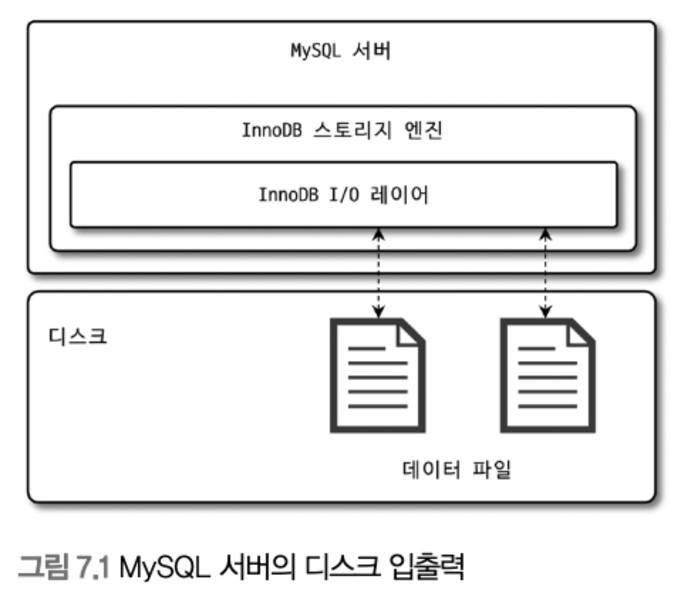
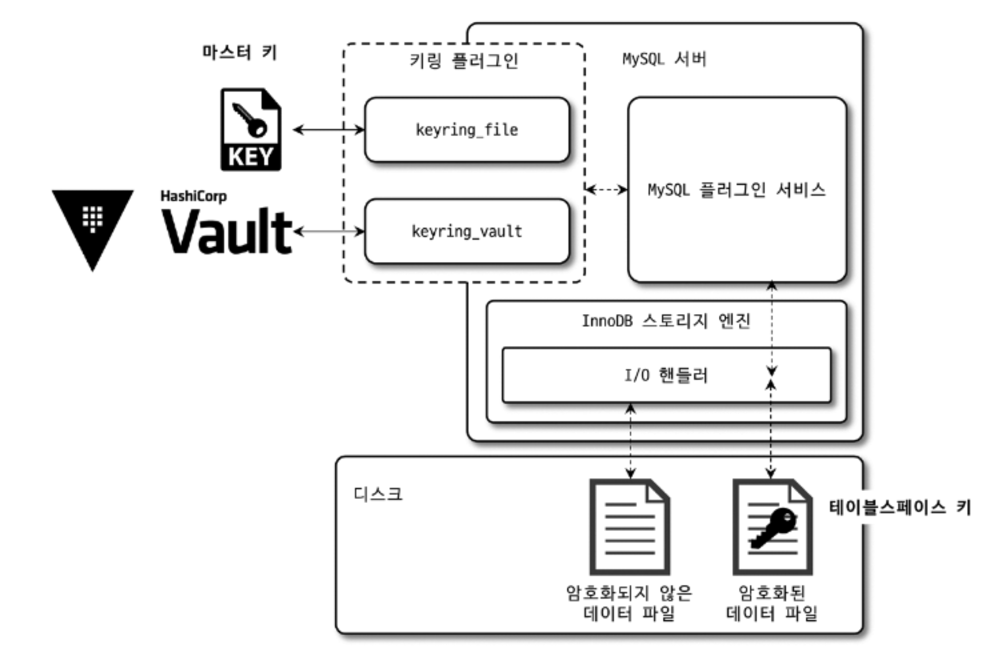
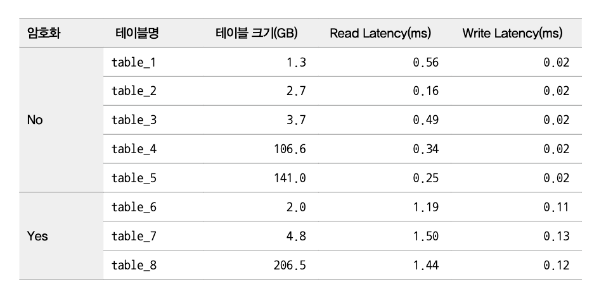
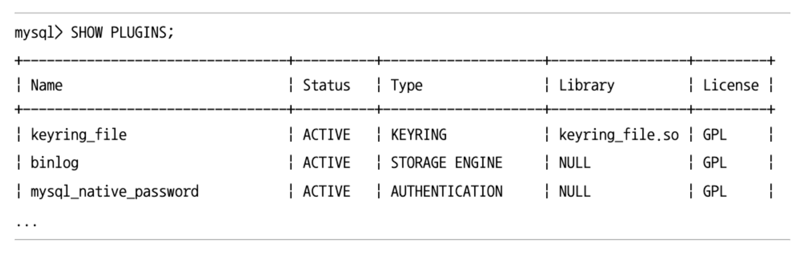
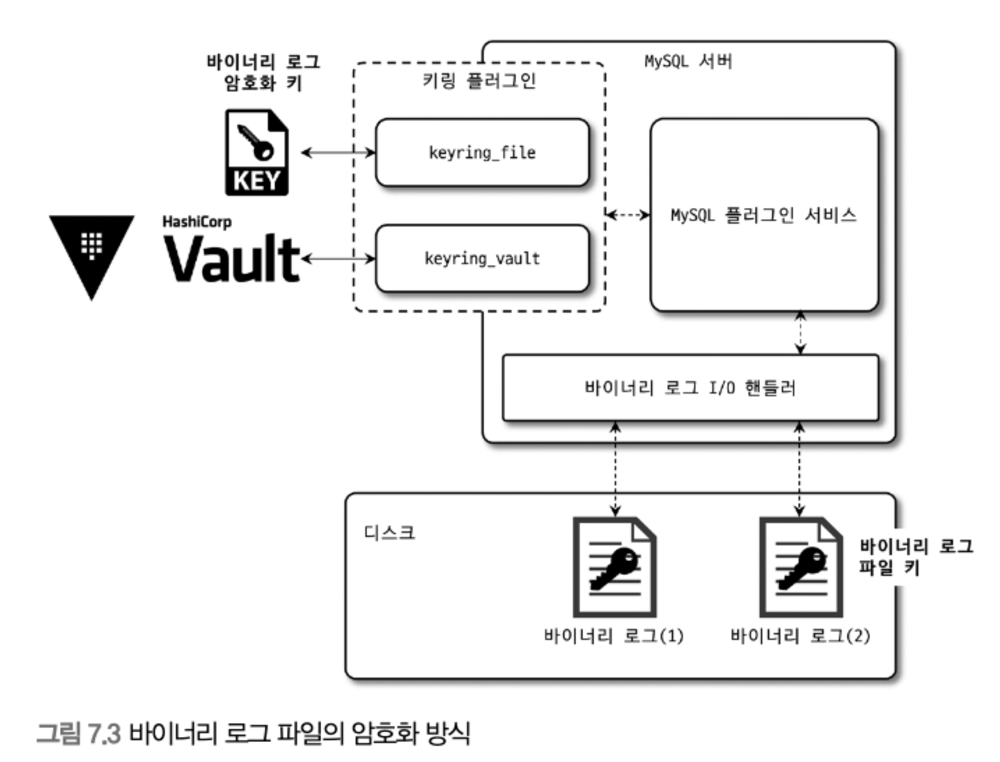

# 7. 데이터 암호화

MySQL 5.7 버전부터 지원되기 시작한 데이터 암호화 기능은 처음으로 데이터 파일(테이블스페이스)에 대해서만 암호화 기능을 제공했다.

MySQL 8.0으로 업그레이드되면서 데이터 파일뿐만 아니라 리두 로그, 언두 로그, 복제를 위한 바이너리 로그 등도 모두 암호화 기능을 지원하기 시작했다.

응용프로그램의 암호화는 주로 중요 정보를 가진 칼럼 단위로 암호화를 수행하며, 데이터베이스 수준에서는 테이블 단위로 암호화를 적용한다.

# 7.1 MySQL 서버의 데이터 암호화

<p align="center"></p>

<br>

MySQL 서버의 암호화 기능은 그림과 같이 데이터베이스 서버와 디스크 사이의 데이터 읽고 쓰기 지점에서 암호화 또는 복호화를 수행한다.

그래서 MySQL 서버에서 디스크 입출력 이외의 부분에서는 암호화 처리가 전혀 필요치 않다.

> 즉 MySQL 서버(InnoDB 스토리지 엔진)의 I/O 레이어에서만 데이터의 암호화 및 복호화 과정이 실행되는 것이다.

MySQL 내부와 사용자 입장에서는 아무런 차이가 없기 때문에 이러한 암호화 방식을 가리켜 `TDE(Transparent Data Encryption)` 이라고 한다.

또한 "Data at Rest Encryption" 라고도 한다.

여기서 "Data at Rest" 는 메모리(In-Process) 나 네트워크 전송(In-Transit) 단계가 아닌 디스크에 저장(At Rest)된 단계에서만 암호화된다는 의미로 사용되는 표현이다.

## 7.1.1 2단계 키 관리

MySQL 서버의 TDE에서 암호화 키는 `키링(KeyRing)` 플러그인에 의해 관리되며, MySQL 8.0 버전에서 지원되는 키링 플러그인은 다음과 같다.

- keyring_file File-Based 플러그인

- keyring_encrypted_file Keyring 플러그인

- keyring_okv KMIP 플러그인

- keyring_aws Amazon Web Services Keyring 플러그인

MySQL 커뮤니티 에디션에서는 keyring_file 플러그인만 사용 가능하다.

다양한 플러그인이 제공되지만 마스터 키를 관리하는 방법만 다를 뿐 MySQL 서버 내부적으로 작동하는 방식은 모두 동일하다.

MySQL 서버의 키링 플러그인은 2단계(2-Tier) 키 관리 방식을 사용하는데, 2단계 키 관리 아키텍처는 다음 그림과 같다.

<p align="center"></p>

<br>

MySQL 서버의 데이터 암호화는 `마스터 키(master key)`와 `테이블스페이스 키(tablespace key)`라는 두 가지 종류의 키를 자기오 있다. 

테이블스페이스 키는 프라이빗 키(private key)라고도 한다.

그림에서 보는 바와 같이 MySQL 서버는 HashiCorp Vault 같은 `외부 키 관리 솔루션(KMS, Key Management Service)` 또는 `디스크의 파일(플러그인 사용)`에서 마스터 키를 가져온다.

암호화된 테이블이 생성될 때마다 해당 테이블을 위한 임의의 테이블스페이스 키를 발급한다.

그리고 MySQL 서버는 마스터 키를 이용해 테이블스페이스키를 암호화해서 각 테이블의 데이터 파일 헤더에 저장한다.

이렇게 생성된 테이블스페이스 키는 테이블이 삭제되지 않는 이상 절대 변경되지 않는다.

하지만 테이블스페이스 키는 절대 MySQL 서버 외부로 노출되지 않기 때문에 테이블스페이스 키를 주기적으로 변경하지 않아도 보안상 취약점이 되지는 않는다.

반대로 마스터 키는 외부의 파일을 이용하기 때문에 노출 가능성이 있다.

그래서 마스터 키는 주기적으로 변경해야 한다.

MySQL 서버의 마스터 키는 다음과 같이 변경할 수 있다.

```SQL
mysql> ALTER INSTANCE ROTATE INNODB MASTER KEY;
```

마스터 키를 변경하면 MySQL 서버는 기존의 마스터 키를 이용해 각 테이블의 테이블스페이스 키를 복호화한 다음 새로운 마스터 키로 다시 암호화한다.

마스터 키가 변경되는 동안 MySQL 서버의 테이블스페이스 키 자체와 데이터 파일의 데이터는 변경되지 않는다.

> 이렇게 2단계 암호화 방식을 사용하는 이유는 암호화 키 변경으로 인한 과도한 시스템 부하를 피하기 위해서다.

MySQL 서버의 TDE에서 지원되는 암호화 알고리즘은 AES 256비트이며, 이외의 알고리즘은 지원되지 않는다.

테이블스페이스키는 AES-256 ECB(Electronic CodeBook) 알고리즘을 이용해 암호화된다.

실제 데이터 파일은 AES-256 CBC(Cipher Block Chaining) 알고리즘을 이용해 암호화된다.

## 7.1.2 암호화와 성능

MySQL 서버의 암호화는 TDE(Transparent Data Encryption) 방식이기 때문에 디스크로부터 한 번 읽은 데이터 페이지는 복호화되어 InnoDB 버퍼 풀에 적재된다.

그래서 데이터 페이지가 한 번 메모리에 적재되면 암호화되지 않은 테이블과 동일한 성능을 보인다.

하지만 쿼리가 InnoDB 버퍼 풀에 존재하지 않는 데이터 페이지를 읽어야 하는 경우에는 복호화 과정을 거치기 때문에 복호화 시간 동안 쿼리 처리가 지연될 것이다.

그리고 암호화된 테이블이 변경되면 다시 디스크로 동기화될 때 암호화돼야 하기 때문에 디스크에 저장할 때도 추가로 시간이 더 걸린다.

하지만 쿼리를 처리하는 스레드는 백그라운드 스레드가 수행하기 때문에 실제 사용자 쿼리가 지연되는 것이 아니다.

<br>

TDE를 적용한다고 해도 데이터 파일의 크기는 암호화되지 않은 테이블과 동일한 크기를 지닌다.

> 암호화한다고 해서 InnoDB 버퍼 풀의 효율이 달라지거나 메모리 사용 효율이 떨어지는 현상은 발생하지 않는다.

<br>

같은 테이블에 대해 암호화와 압축이 동시에 적용되면 MySQL 서버는 압축을 먼저 실행하고 암호화를 적용한다.

- 압축이 암호화보다 먼저 실행되는 이유

    1. 암호화된 결과문은 랜덤한 바이트 배열을 가지게 되는데, 이는 압축률을 떨어뜨린다. 압축 효율을 높이기 위해 데이터를 압축(용량 최소) 후 암호화를 적용한다.

    2. 압축된 데이터 페이지는 압축 또는 압축 해제의 모든 상태로 InnoDB 버퍼 풀에 존재할 수 있다. 암호화가 먼저 실행될 경우 버퍼 풀에 존재하는 데이터 페이지에 대해서도 매번 암복호화 작업을 수행해야 된다.

<br>

다음 표는 암호화된 테이블과 그렇지 않은 테이블의 디스크 읽고 쓰기에 걸리는 평균 시간을 수집한 정보다.

<p align="center"></p>

<br>

오차는 있겠지만 암호화된 테이블의 경우 읽기는 3~5배 정도 느리며, 쓰기의 경우에는 5~6배 정도 느린 것을 확인할 수 있다.


## 7.1.3 암호화와 복제

소스 서버와 레플리카 서버는 서로 각자의 마스터 키와 테이블스페이스 키를 관리한다.

그 이유로 복제 멤버들의 데이터 파일은 암호화 되기 전의 값이 동일하더라도 실제 암호화된 데이터가 저장된 데이터 파일의 내용은 완전히 달라진다.

복제 소스 서버의 마스터 키를 변경할 때는 `ALTER INSTANCE ROTATE INNODB MASTER KEY` 명령을 실행한다.

이때 위 명령 자체는 레플리카 서버로 복제되지만 실제 소스 서버의 마스터 키 자체가 레플리카 서버로 전달되는 것은 아니다.

그래서 마스터 키 로테이션을 샐행하면 소스 서버와 레플리카 서버가 각각 서로 다른 마스터 키를 새로 발급받는다.

<br>

MySQL 서버의 백업에서 TDE의 키링(Key Ring) 파일을 백업하지 않는 경우가 있는데, 이 경우 키링 파일을 찾지 못하면 데이터 복구를 할 수 없게 된다.

보안을 위해 키링 파일을 데이터 파일과 별도로 보관하는 것을 권장하지만 복구를 감안하고 백업 방식을 선택해야 한다.

<br>

# 7.2 Keyring_file 플러그인 설치

MySQL 서버의 데이터 암호화 기능인 TDE의 암호화 키 관리는 플러그인 방식으로 제공된다.

이번 장에서는 keyring_file 플러그인을 설치하고 사용하는 방법을 간단히 살펴보겠다.

우선 keyring_file 플러그인은 테이블스페이스 키를 암호화하기 위한 마스터 키를 디스크의 파일로 관리하는데, 이때 마스터 키는 평문으로 디스크에 저장된다.

즉, 마스터 키가 저장된 파일이 외부에 노출된다면 데이터 암호화는 무용지물이다.

<br>

TDE  플러그인의 경우 MySQL 서버가 시작되는 단계에서도 가장 빨리 초기화돼야 한다.

그래서 다음과 같이 MySQL 서버의 설정 파일(my.cnf)에서 early-plugin-load 시스템 변수에 keyring_file 플러그인을 위한 라이브러리 ("keyring_file.so")를 명시하면 된다.

그리고 keyring_file 플러그인이 마스터 키를 저장할 키링 파일의 경로를 keyring_file_data 설정에 명시하면 된다.

keyring_file_data 설정의 경로는 오직 하나의 MySQL 서버만 참조해야 한다.

만약 하나의 리눅스 서버에 MySQL 서버가 2개 이상 실행 중이라면 서로 다른 키링 파일을 사용하도록 설정해야 한다.

```
early-plugin-load = keyring_file.so
keyring_file_data = /very/secure/directory/tde_master.key
```

MySQL 서버의 설정 파일이 준비되면 MySQL 서버를 재시작하면 자동으로 keyring_file 플러그인이 초기화된다.

keyring_file 플러그인의 초기화 여부는 다음과 같이 SHOW PLUGINS 명령으로 확인 가능하다.

<p align="center"></p>

<br>

keyring_file 플러그인이 초기화되면 MySQL 서버는 플러그인의 초기화와 동시에 keyring_file_data 시스템 변수의 경로에 빈 파일을 생성한다.

플러그인만 초기화된 상태일 뿐, 아직 마스터 키를 사용한 적이 없기 때문에 실제 키링 파일의 내용은 비어있다.

데이터 암호화 기능을 사용하는 테이블을 생성하거나 마스터 로테이션을 실행하면 키링 파일의 마스터 키가 초기화된다.

<br>

# 7.3 테이블 암호화

키링 플러그인은 마스터 키를 생성하고 관리하는 부분까지만 담당한다.

그래서 어떤 키링 플러그인을 사용하든 관계없이 암호화된 테이블을 생성하고 활용하는 방법은 모두 동일하다.

## 7.3.1 테이블 생성

TDE를 이용하는 테이블은 다음과 같이 생성할 수 있다.

```SQL
mysql > CREATE TABLE tab_encrypted(
    id INT,
    data VARCHAR(100),
    PRIMARY KEY(id),
    ) ENCRYPTION='Y';
```

- 일반적인 테이블 생성 구문과 동일하며, 마지막에 "ENCRYPTION='Y'" 옵션만 추가로 넣으면 된다.

- 이 테이블의 데이터가 디스크에 기록될 때는 데이터가 자동으로 암호화되어 저장된다.

- 그리고 다시 디스크에서 메모리로 읽어올 때 복호화 된다.

MySQL 서버에서 암호화된 테이블만 검색할 때는 information_schema의 TABLES 뷰를 이용하면 된다.

테이블을 생성할 때마다 ENCRYPTION 옵션을 설정하면 실수로 암호화 적용을 잊어버릴 수도 있다.

MySQL 서버의 모든 테이블에 대해 암호화를 적용하고자 한다면 default_table_encryption 시스템 변수를 ON으로 설정하면 된다.

## 7.3.2 응용 프로그램 암호화와의 비교

응용 프로그램에서 직접 암호화해서 MySQL 서버에 저장하는 경우도 있다.

이 경우 저장된는 칼럼의 값이 암호화된 것인지 여부를 MySQl 서버는 인지하지 못한다.

> 그래서 응용 프로그램에서 암호화된 칼럼은 인덱스를 생성하더라도 인덱스의 기능을 100% 활용할 수없다.

MySQL 서버의 암호화 기능(TDE)을 사용한다면 MySQL 서버는 인덱스 관련된 작업을 모두 처리한 후 최종 디스크에 데이터 페이지를 저장할 때만 암호화하기 때문에 이 같은 제약은 없다.

응용 프로그램의 암호화와 MySQL 서버의 암호화 기능 중 선택해야 하는 상황이라면 고민할 필요 없이 MySQL 서버의 암호화 기능을 선택할 것을 권장한다.

## 7.3.3 테이블스페이스 이동

MySQL 서버의 데이터베이스 관리자라면 테이블스페이스만 이동하는 기능을 자주 사용하게 될 것이다.

TDE가 적용되어 암호화된 테이블의 경우 원본 MySQL 서버와 목적지 MySQL 서버의 암호화 키(마스터 키)가 다르기 때문에 하나 더 신경 써야 할 부분이 있다.

MySQL 서버에서 다음과 같은 명령으로 테이블스페이스를 익스포트(Export)할 수 있다.

```SQL
mysql> FlUSH TABLES source_table FOR EXPORT;
```

이 명령이 실행되면 MySQL 서버는 source_table 의 저장되지 않은 변경 사항을 모두 디스크로 기록한다.

더이상 source_table에 접근할 수 없게 잠금을 건다.

그와 동시에 source_table의 구조를 source_table.cfg 파일로 기록해 둔다.

그러면 source_table.ibd 파일과 source_table.cfg 파일을 목적지 서버로 복사한다.

복사가 완료되면 UNLOCK TABLES 명령을 실행해 source_table 을 사용할 수 있게 하면 된다.

> 지금까지의 과정이 암호화되지 않은 테이블의 테이블스페이스 복사 과정이다.

<br>

TDE로 암호화된 테이블에 대해 위 명령을 실행하면 MySQL 서버는 임시로 사용할 마스터 키를 발급해서 source_table.cfp 라는 파일로 기록한다.

그리고 암호화된 테이블의 테이블스페이스 키를 기존 마스터 키로 복호화한 후, 임시로 발급한 마스터 키를 이용해 다시 암호화해서 데이터 파일의 헤더 부분에 저장한다.

그래서 암호화된 테이블의 경우 테이블스페이스 이동 기능을 사용할 때는 반드시 데이터 파일과 임시 마스터 키가 저장된 *.cfp 파일을 함께 복사해야 한다.

<br>

# 7.4 언두 로그 및 리두 로그 암호화

테이블의 암호화를 적용하더라도 디스크로 저장되는 데이터만 암호화되고 MySQL 서버의 메모리에 존재하는 데이터는 복호화된 평문으로 관리된다.

이 평문 데이터가 테이블의 데이터 파일 이외의 디스크 파일로 기록되는 경우에는 여전히 평문으로 저장된다.

> 그래서 테이블 암호화를 적용해도 리두 로그나 언두 로그, 그리고 복제를 위한 바이너리 로그에는 평문으로 저장되는 것이다.

MySQL 8.0.16 버전부터는 `innodb_undo_log_encrypt` 시스템 변수와 `innodb_redo_log_encrypt` 시스템 변수를 이용해 InnoDB 스토리지 엔진의 리두 로그와 언두 로그를 암호화된 상태로 저장할 수 있게 개선됐다.

MySQL 서버는 리두 로그나 언두 로그를 평문으로 저장하다가 암호화가 활성화되면 그때부터 생성되는 리두 로그나 언두 로그만 암호화해서 저장한다.

반대로 리두 로그와 언두 로그가 암호화되는 상태에서 암호화를 비활성화하면 그때부터 저장되는 로그만 평문으로 저장한다.

리두 로그와 언두 로그 데이터 모두 각각의 테이블스페이스 키로 암호화되고, 테이블스페이스 키는 다시 마스터 키로 암호화된다.

즉 ALTER ROTATE INNODB MASTER KEY 명령이 실행되면 새로운 마스터 키가 발급되고 테이블 암호화에 사용된 테이블스페이스 키와 동일하게 새로운 마스터 키에 의해 다시 암호화된다.

여기서 이야기하는 `테이블스페이스 키`는 실제 테이블의 암호화에 사용된 테이블스페이스 키가 아니라 리두 로그와 언두 로그 파일을 위한 `프라이빗 키`를 의미한다.

즉 리두 로그와 언두 로그를 위한 각각의 프라이빗 키가 발급되고, 해당 프라이빗 키는 마스터 키로 암호화되어 리두, 언두 로그 파일의 헤더에 저장되는 것이다.

<br>

InnoDB 리두 로그가 암호화됐는지는 다음과 같이 간단히 확인할 수 있다.

```SQL
mysql> SHOW GLOBAL VARIABLES LIKE 'innodb_redo_log_encrypt';
+-------------------------+-------+
| Variable_name           | Value |
+-------------------------+-------+
| innodb_redo_log_encrypt | OFF   |
+-------------------------+-------+
1 row in set (0.05 sec)
```

# 7.5 바이너리 로그 암호화

테이블 암호화가 적용돼도 바이너리 로그와 릴레이 로그 파일 또한 리두 로그나 언두 로그처럼 평문을 저장한다.

바이너리 로그와 릴레이 로그 파일 암호화 기능은 디스크에 저장된 로그 파일에 대한 암호화만 담당한다.

MySQL 서버의 메모리 내부 또는 소스 서버와 레플리카 서버 간의 네트워크 구간에서 로그 데이터를 암호화하지는 않는다.

복제 멤버 간의 네트워크 구간에서도 바이너리 로그를 암호화하고자 한다면 MySQL 복제를 위한 계정이 SSL을 사용하도록 설정하면 된다.

## 7.5.1 바이너리 로그 암호화 키 관리

바이너리 로그와 릴레이 로그 파일 데이터의 암호화를 위해서도 MySQL 서버는 그림과 같이 2단계 암호화 키관리 방식을 사용한다.

<p align="center"></p>

<br>

바이너리 로그와 릴레이 로그 파일의 데이터 파일 키(File Key)로 암호화해서 디스크로 저장한다.

파일 키는 "바이너리 로그 암호화 키"로 암호화해서 각 바이너리 로그와 릴레이 로그 파일의 헤더에 저장된다.

> "바이너리 로그 암호화 키"는 테이블 암호화의 마스터 키와 동일한 역할을 한다.

> 파일 키는 바이너리 로그와 릴레이 로그 파일 단위로 자동으로 생성되어 해당 로그 파일의 데이터 암호화에서만 사용된다.

## 7.5.2 바이너리 로그 암호화 키 변경

바이너리 로그 암호화 키는 다음과 같이 변경(로테이션)할 수 있다.

```SQL
mysql> ALTER INSTANCE ROTATE BINLOG MASTER KEY;
```

바이너리 로그 암호화 키가 변경되면 다음의 과정을 거친다.

1. 증가된 시퀀스 번호와 함께 새로운 바이너리 로그 암호화 키 발급 후 키링 파일에 저장

2. 바이너리 로그 파일과 릴레이 로그 파일 스위치 (새로운 로그 파일로 로테이션)

3. 새로 생성되는 바이너리 로그와 릴레이 로그 파일의 암호화를 위해 파일 키를 생성하고, 파일 키는 바이너리 로그 파일 키 (마스터 키)로 암호화해서 각 로그 파일에 저장

4. 기존 바이너리 로그와 릴레이 로그 파일의 파일 키를 읽어서 새로운 바이너리 로그 파일 키로 암호화해서 다시 저장
    - (암호화되지 않은 로그 파일은 무시)

5. 모든 바이너리 로그와 릴레이 로그 파일이 새로운 바이너리 로그 암호화 키로 다시 암호화됐다면 기존 바이너리 로그 암호화 키를 키링 파일에서 제거

<br>

이 절차에서 4번 과정은 상당히 시간이 걸리는 작업일 수 있는데, 이를 위해 키링 파일에서 "바이너리 로그 암호화 키"는 내부적으로 `버전(시퀀스 번호)` 관리가 이뤄진다.

MySQL 서버의 바이너리 로그 파일이 암호화돼 있는지 여부는 다음과 같이 확인할 수 있다.

```SQL
mysql> SHOW BINARY LOGS;
+---------------+-----------+-----------+
| Log_name      | File_size | Encrypted |
+---------------+-----------+-----------+
| binlog.000001 |       849 | No        |
| binlog.000002 |       181 | No        |
| binlog.000003 |       181 | No        |
| binlog.000004 |       181 | No        |
| binlog.000005 |       181 | No        |
| binlog.000006 |      1855 | No        |
| binlog.000007 |       158 | No        |
+---------------+-----------+-----------+
7 rows in set (0.01 sec)
```

<br>

## 7.5.3 mysqlbinlog 도구 활용

MySQL 서버에서는 트랜잭션의 내용을 추적하거나 백업 복구를 위해 암호화된 바이너리 로그를 평문으로 복호화할 일이 자주 발생한다.

하지만 한 번 바이너리 로그 파일이 암호화되면 바이너리 로그 암호화 키가 없으면 복호화할 수 없다.

그런데 바이너리 로그 암호화 키는 MySQL 서버만 가지고 있어서 복호화가 불가능하다.

mysqlbinlog 도구를 이용해 암호화된 바이너리 로그 파일의 내용을 SQL 문장으로 한 번 풀어보면 다음과 같이 암호화된 바이너리 로그 파일을 직접 열어 볼 수 없다는 에러 메시지를 출력한다.

<p align="center"></p>

<br>

바이너리 로그 암호화 키는 그 바이너리 로그나 릴레이 로그 파일을 생성한 MySQL 서버만 가지고 있기 때문에 MySQL 서버와 관계없이 mysqlbinlog 도구만으로는 복호화할 방법이 없다.

> 그나마 바이너리 로그 파일의 내용을 볼 수 있는 방법은 MySQL 서버를 통해 가져오는 방법이 유일하다.

