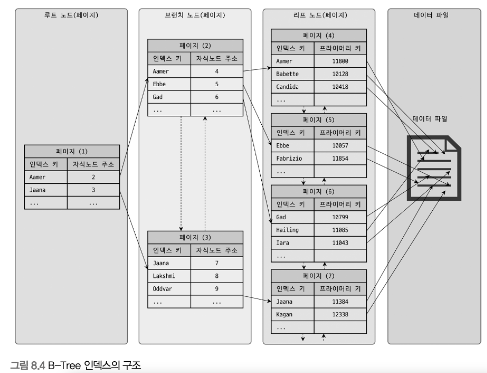
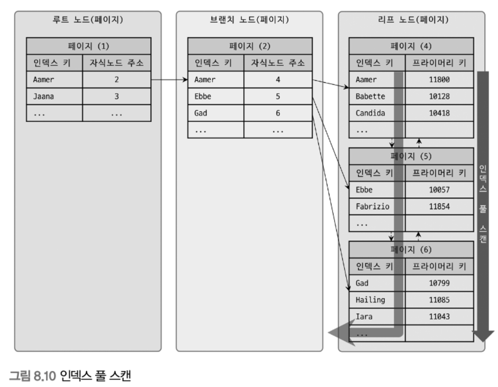
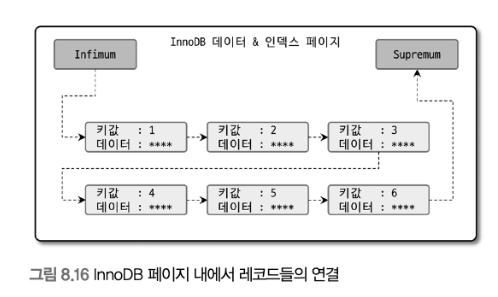
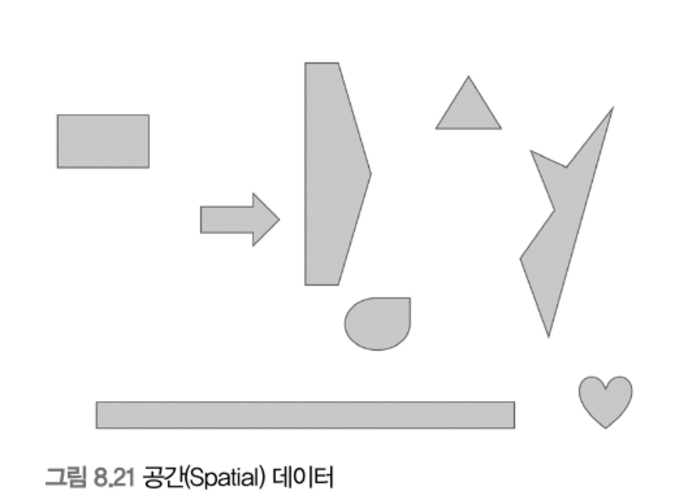

# 8. 인덱스

인덱스는 데이터베이스 쿼리의 성능을 언급하면서 빼놓을 수 없는 부분이다.

각 인덱스의 특성과 차이는 상당히 중요하며, 물리 수준의 모델링을 할 때도 중요한 요소가 될 것이다.

MySQL 8.0 버전까지 업그레이드되어 오면서 다른 상용 RDBMS에서 제공하는 많은 기능을 지원하게 되었다.

하지만 아무리 MySQL 서버의 옵티마이저가 발전하고 성능이 개선됐다고 해도 관리자의 역할은 매우 중요하다.

그래서 인덱스에 대한 기본 지식은 앞으로도 매우 중요한 부분이며, 쿼리 튜닝의 기본이 될 것이다.

<br>

## 8.1 디스크 읽기 방식

데이터베이스의 성능 튜닝은 어떻게 디스크 I/O 를 줄이느냐가 관건일 때가 상당히 많다.

<br>

## 8.1.1 하드 디스크 드라이브(HDD)와 솔리드 스테이트 드라이브(SSD)

컴퓨터에서 CPU나 메모리 같은 주요 장치는 대부분 전자식 장치지만 하드 디스크 드라이브는 기계식 장치다.

`그래서 데이터베이스 서버에서는 항상 디스크 장치가 병목이 된다.`

> 이러한 기계식 하드 디스크 드라이브를 대체하기 위해 전자식 저장 매체인 SSD(Solid State Drive)가 출시되고 있다.

<br>

<p align="center"></p>

<br>

디스크의 헤더를 움직이지 않고 한 번에 많은 데이터를 읽는 `순차 I/O` 에서는 SSD가 HDD 보다 조금 빠르거나 거의 비슷한 성능을 보이기도 한다.

하지만 SSD의 장점은 HDD 보다 `랜덤 I/O`가 훨씬 빠르다는 점이다.

<br>

## 8.1.2 랜덤 I/O 와 순차 I/O

랜덤 I/O 라는 표현은 하드 디스크 드라이브의 플래터(원판)를 돌려서 읽어야 할 데이터가 저장된 위치로 디스크 헤더를 이동시킨 다음 데이터를 읽는 것을 의미한다.

사실 순차 I/O 또한 이 작업 과정은 같다.

그렇다면 랜덤 I/O와 순차 I/O는 어떤 차이가 있을까?

<p align="center"></p>

<br>

1. 순차 I/O

    - 3개의 페이지 (3 x 16KB)를 디스크에 기록하기 위해 1번 시스템 콜 요청

    - 디스크의 헤드 1번 움직임


2. 랜덤 I/O

    - 3개의 페이지를 디스크에 기록하기 위해 3번 시스템 콜 요청

    - 디스크의 헤드 3번 움직임


`디스크에 데이터를 쓰고 읽는 데 걸리는 시간은 디스크 헤더를 움직여서 읽고 쓸 위치로 옮기는 단계에서 결정`

결국 순차 I/O는 랜덤 I/O보다 거의 3배 정도 빠르다고 볼 수있다.

일반적으로 쿼리를 튜닝하는 것은 랜덤 I/O 자체를 줄여주는 것이 목적이라고 할 수있다.

즉, 쿼리를 처리하는 데 꼭 필요한 데이터만 읽도록 쿼리를 개선하는 것을 의미한다.

<br>

## 8.2 인덱스란?

DBMS 데이터베이스 테이블의 모든 데이터를 검색해서 원하는 결과를 가져오려면 시간이 오래 걸린다.

그래서 칼럼의 값과 해당 레코드가 저장된 주소를 키와 값의 쌍(key-Value pair)으로 삼아 인덱스를 만들어 두는 것이다.

DMBS의 인덱스는 칼럼의 값을 주어진 순서로 미리 정렬해서 보관한다.

<br>

SortedList : 저장되는 값을 항상 정렬된 상태로 유지하는 자료 구조

ArrayList : 값을 저장되는 순서 그대로 유지하는 자료 구조

DBMS의 인덱스는 SortedList와 마찬가지로 저장되는 칼럼의 값을 이용해 항상 정렬된 상태를 유지한다.

데이터 파일은 ArrayList와 같이 저장된 순서대로 별도의 정렬 없이 그대로 저장해 둔다.

SortedList 저장하는 과정이 복잡하고 느리지만, 이미 정령돼 있어서 원하는 값을 빨리 찾아올 수 있다.

DBMS의 인덱스도 인덱스가 많은 테이블은 당연히 INSERT, UPDATE, DELETE 문장의 처리가 느려진다.

하지만 이미 정렬된 인덱스를 가지고 있기 떄문에 SELECT 문장은 매우 빠르게 처리된다.

`결론적으로 DBMS에서 인덱스는 데이터의 저장(INSERT, UPDATE, DELETE) 성능을 희생하고 그 대신 데이터의 읽기 속도를 높이는 기능이다.`

<br>

이 책에서는 키(Key)라는 말과 인덱스(Index)는 같은 의미로 사용한다.

인덱스를 역할별로 구분해 본다면 프라이머리 키(Primary key)와 보조 키(세컨더리 인덱스, Secondary key)로 구분할 수 있다.

```
프라이머리 키는 그 레코드를 대표하는 칼럽의 값으로 만들어진 인덱스를 의미한다.

이 칼럼은 테이블에서 해당 레코드를 식별할 수 있는 기준값이 되기 때문에 이를 식별자라고도 부른다.

프라이머리 키는 NULL 값을 허용하지 않으며 중복을 허용하지 않는 것이 특징이다.
```

```
프라이머리 키를 제외한 나머지 모든 인덱스는 세컨더리 인덱스(Secondary Index)로 분류한다.

유니크 인덱스는 프라이머리 키와 성격이 비슷하고 프라이머리 키를 대체해서 사용할 수도 있다고 해서 대체 키라고 한다.

별도로 분류하기도 하고 그냥 세컨더리 인덱스로 분류하기도 한다.
```

데이터 저장 방식(알고리즘) 별로 구분할 경우 많은 분류가 가능하겠지만 대표적으로 `B-Tree 인덱스`와 `Hash 인덱스`로 구분할 수 있다.

```
B-Tree 알고리즘은 가장 일반적으로 사용되는 인덱스 알고리즘이다.

B-Tree 인덱스는 칼럼의 값을 변형하지 않고 원래의 값을 이용해 인덱싱하는 알고리즘이다.
```

```
Hash 인덱스 알고리즘은 칼럼의 값으로 해시값을 계산해서 인덱싱하는 알고리즘으로, 매우 빠른 검색을 지원한다.

하지만 값을 변형해서 인덱싱하므로 전방(Prefix) 일치와 같이 값의 일부만 검색하거나 범위를 검색할 때는 해시 인덱스를 사용할 수 없다.

Hash 인덱스는 주로 메모리 기반의 데이터베이스에서 많이 사용한다.
```

<br>

데이터의 중복 허용 여부로 분류하면 `유니크 인덱스(Unique)`와 `유니크하지 않은 인덱스(Non-Unique)`로 구분할 수 있다.

<br>

## 8.3 B-Tree 인덱스

B-Tree 는 가장 범용적인 목적으로 사용되는 인덱스 알고리즘이다.

여러 가지 변형된 형태의 알고리즘이 있지만, 일반적으로 DBMS에서는 주로 B+-Tree 또는 B*-Tree가 사용된다.

## 8.3.1 구조 및 특성

기본적인 구조

최상위에 최하위 까지의 구조

`루트 노드(Root node)` - `브랜치 노드(Branch node)` - `리프 노드(Leaf node)`

인덱스의 리프 노드는 항상 실제 데이터 레코드를 찾아가기 위한 주솟값을 가지고 있다.

<br>

<p align="center"></p>

<br>

그림과 같이 인덱스의 키 값은 모두 정렬되어 있지만, 데이터 파일의 레코느느 정렬돼 있지 않고 임의의 순서로 저장돼 있다.

레코드가 삭제되어 빈 공간이 생기면 그 다음의 INSERT는 가능한 한 삭제된 공간을 재활용하도록 DBMS가 설계되기 때문에 항상 INSERT된 순서로 저장되는 것은 아니다.

인덱스는 테이블의 키 칼럼만 가지고 있으므로 나머지 칼럼을 읽으려면 데이터 파일에서 해당 레코드를 찾아야 한다.

`이를 위해 인덱스의 리프 노드는 데이터 파일에 저장된 레코드의 주소를 가진다.`

<br>

<p align="center"></p>

<br>

<br>

<p align="center"></p>

<br>

그림 8.5는 MyISAM 테이블의 인덱스와 데이터 파일의 관계를 보여준다.

`레코드 주소`는 MyISAM 테이블의 생성 옵션에 따라 레코드가 테이블에 INSERT된 순번이거나 데이터 파일 내의 위치(Offset)다.

<br>

그림 8.6은 InnoDB 테이블의 인덱스와 데이터 파일의 관계를 보여준다.

InnoDB 스토리지 엔진을 사용하는 테이블에서는 프라이머리 키가 ROWID의 역할을 한다.

> 두 스토리지 엔진의 인덱스에서 가장 큰 차이점은 세컨더리 인덱스를 통해 데이터 파일의 레코드를 찾아가는 방법에 있다.

MyISAM 테이블은 세컨더리 인덱스가 `물리적인 주소`를 가진다.

반면 InnoDB 테이블은 프라이머리 키를 주소처럼 사용하기 때문에 `논리적인 주소`를 가진다고 볼 수 있다.

그래서 InnoDB 테이블에서 인덱스를 통해 레코드를 읽을 때는 데이터 파일을 바로 찾아가지 못한다.

그림 8.6에서와 같이 인덱스에 저장돼 있는 프라이머리 키 값을 이용해 프라이머리 키 인덱스를 한 번 더 검색한 후, 프라이머리 키 인덱스의 리프 페이지에 저장돼 있는 레코드를 읽는다.

즉, InnoDB 스토리지 엔진에서는 모든 세컨더리 인덱스 검색에서 데이터 레코드를 읽기 위해서는 반드시 프라이머리 키를 저장하고 있는 B-Tree를 다시 한번 검색해야 한다.

이러한 작업으로 인해 InnoDB 스토리지 엔진을 사용하는 테이블은 성능이 떨어질 것처럼 보이지만 각 구조는 장단점을 가지고 있다.

자세한 내용은 8.8 클러스터링 인덱스에서 자세히 살펴보겠다.

<br>

## 8.3.2 B-Tree 인덱스 키 추가 및 삭제

테이블의 레코드를 저장하거나 변경하는 경우 인덱스 키 추가나 삭제 작업이 발생한다.

인덱스 키 추가나 삭제가 어떻게 처리되는지 알아두면 쿼리의 성능을 쉽게 예측할 수 있을 것이다.

<br>

### 8.3.2.1 인덱스 키 추가

새로운 키 값이 B-Tree에 저장될 때 테이블의 스토리지 엔진에 따라 새로운 키 값이 즉시 인덱스에 저장될 수도 있고 그렇지 않을 수도 있다.

B-Tree에 저장될 때는 저장될 키 값을 이용해 B-Tree 상의 적절한 위치를 검색해야 한다.

저장될 위치가 결정되면 레코드의 키 값과 대상 레코드의 주소 정보를 B-Tree의 리프 노드에 저장한다.

리프 노드가 꽉 차서 더는 저장할 수 없을 때는 리프 노드가 분리(Split)돼야 하는데, 이는 상위 브랜치 노드까지 처리의 범위가 넓어진다.

이러한 작업 탓에 B-Tree는 상대적으로 쓰기 작업(새로운 키를 추가하는 작업)에 비용이 많이 드는 것으로 알려졌다.

MyISAM이나 MEMORY 스토리지 엔진을 사용하는 테이블에서는 INSERT 문장이 실행되면 즉시 새로운 키 값을 B-Tree 인덱스에 변경한다.

하지만 InnoDB 스토리지 엔진은 필요하다면 인덱스 키 추가 작업을 지연시켜 나중에 처리할 수 있다.

프라이머리 키나 유니크 인덱스의 경우 중복 체크가 필요하기 때문에 즉시 B-Tree에 추가하거나 삭제한다.

<br>

### 8.3.2.2 인덱스 키 삭제

해당 키 값이 저장된 B-Tree의 리프 노드를 찾아서 그냥 `삭제 마크`만 하면 작업이 완료된다.

이렇게 삭제 마킹된 인덱스 키 공간은 계속 그대로 방치하거나 재활용할 수 있다.

인덱스 키 삭제로 인한 마킹 작업 또한 디스크 쓰기가 필요하므로 이 작업 역시 디스크 I/O가 필요한 작업이다.

<br>

### 8.3.2.3 인덱스 키 변경

B-Tree의 키 값이 변경되는 경우에는 단순히 인덱스 상의 키 값만 변경하는 것은 불가능하다.

B-Tree의 키 값 변경 작업은 먼저 키 값을 삭제한 후, 다시 새로운 키 값을 추가하는 형태로 처리된다.

<br>

### 8.3.2.4 인덱스 키 검색

INSERT, UPDATE, DELETE 작업을 할 때 인덱스 관리에 따르는 추가 비용을 감당하면서 인덱스를 구축하는 이유는 `빠른 검색`을 위해서다.

인덱스를 검색하는 작업은 B-Tree의 루트 노드부터 시작해 브랜치 노드를 거쳐 최종 리프 노드까지 이동하면서 비교 작업을 수행하는데, 이 과정을 `트리 탐색`이라고 한다.

인덱스 트리 탐색은 SELECT 에서만 사용하는 것이 아니라 UPDATE 나 DELETE를 처리하기 위해 항상 레코드를 먼저 검색해야 할 경우에도 사용된다.

B-Tree 인덱스를 이용한 검색은 100% 일치 또는 값의 앞부분(Left-most part)만 일치하는 경우에 사용할 수 있다.

<br>

## 8.3.3 B-Tree 인덱스 사용에 영향을 미치는 요소

B-Tree 인덱스는 인덱스를 구성하는 칼럼의 크기와 레코드의 건수, 그리고 유니크한 인덱스 키 값의 개수 등에 의해 검색이나 변경 작업의 성능이 영향을 받는다.

### 8.3.3.1 인덱스 키 값의 크기

```
InnoDB 스토리지 엔진은 디스크에 데이터를 저장하는 가장 기본 단위를 페이지(Page) 또는 블록(Block)이라고 한다.

이는 디스크의 모든 읽기 및 쓰기 작업의 최소 단위가 된다.

또한 페이지는 InnoDB 스토리지 엔진의 버퍼 풀에서 데이터를 버퍼링하는 기본 단위이기도 하다.
```

인덱스는 페이지 단위로 관리되며, 다음과 같은 그림에서 루트, 브랜치, 리프 노드를 구분한 기준이 `페이지 단위`이다.

<br>

일반적으로 DBMS의 B-Tree는 자식 노드의 개수가 가변적인 구조다.

MySQL의 B-Tree는 자식 노드의 개수는 `인덱스의 페이지 크기`와 `키 값의 크기`에 따라 결정된다.

```
MySQL 5.7 버전부터는 InnoDB 스토리지 엔진의 페이지 크기를 innodb_page_size 시스템 변수를 이용해 4KB ~ 64KB 사이의 값을 선택할 수 있지만 기본값은 16KB이다.
```

인덱스의 키가 16바이트라고 가정하면 다음 그림과 같이 인덱스 페이지가 구성될 것이다.

<p align="center"></p>

<br>

자식 노드 주소라는 것은 여러 가지 복합적인 정보가 담긴 영역이며, 페이지의 종류별로 대략 6바이트에서 12바이트까지 다양한 크기의 값을 가질 수 있다.

편의상 평균적으로 12바이트로 구성된다고 가정

그림의 경우 하나의 인덱스 페이지(16KB)에 몇 개의 키를 저장할 수 있을까?

계산해보면 `16 * 1024 / (16 + 12) = 585개` 저장할 수 있다.

최종적으로 이 경우는 자식 노드를 585개 가질 수 있는 B-Tree가 되는 것이다.

만약 인덱스 키 값이 커지게 (32KB) 되었다고 가정하면 한 페이지에 인덱스 키를 `16 * 1024 / (32 + 12) = 372개` 저장할 수 있다.

- SELECT 쿼리가 레코드 500개를 읽어햐 한다면 ??

전자의 경우 인덱스 페이지 한 번으로 해결할 수 있다.

후자의 경우 최소한 2번 이상 디스크로부터 읽어야 한다.

`결국 인덱스를 구성하는 키 값의 크기가 커지면 디스크로부터 읽어야하는 횟수가 늘어나고, 느려진다는 것을 의미한다.`

<br>

### 8.3.3.2 B-Tree 깊이

B-Tree 인덱스의 깊이(Depth)는 상당히 중요하지만 직접 제어할 방법은 없다.

위 그림으로 예제를 다시 들어보면 만약 인덱스의 B-Tree 깊이가 3인 경우 최대 몇 개의 키값을 가질 수 있을까?

1. 키 값이 16바이트인 경우

    - 585 * 585 * 585 $\rightarrow$ 최대 2억개 정도의 키 값을 담을 수 있다.

2. 키 값이 32바이트인 경우

    - 372 * 372 * 372 $\rightarrow$ 약 5천만개 정도의 키 값을 담을 수 있다.

`B-Tree의 깊이는 MySQL에서 값을 검색할 때 몇 번이나 랜덤하게 디스크를 읽어야 하는지와 직결되는 문제다.`

인덱스 키 값의 크기는 가능항면 작게 만드는 것이 좋다.

그리고 아무리 대용량 데이터베이스라도 B-Tree의 깊이(Depth)가 5단계 이상까지 깊어지는 경우는 흔치 않다.

<br>

### 8.3.3.3 선택도(기수성)

인덱스에서 선택도(Selectivity) 또는 기수성(Cardinality)은 거의 같은 의미로 사용된다.

`모든 인덱스 키 값 가운데 유니크한 값의 수를 의미한다.`

```
전체 인덱스 키 값은 100개

그 중 유니크한 값의 수는 10개

기수성은 10
```

인덱스 키 값 가운데 중복된 값이 적을수록 기수성은 높아지고, 선택도도 높아진다.

선택도가 높을수록 검색 대상이 줄어들기 때문에 그만큼 빠르게 처리된다.

```
<참고>

선택도가 좋지 않다고 하더라도 정렬이나 그루핑과 같은 작업을 하기 위해 인덱스를 만드는 것이 훨씬 나은 경우도 많다.

인덱스가 항상 검색에만 사용되는 것이 아니므로 여러 가지 용도를 고려해 적절히 인덱스를 설계할 필요가 있다.
```

### 8.3.3.4 읽어야 하는 레코드의 건수

인덱스를 통해 테이블의 레코드를 읽는 것 VS 인덱스를 거치지 않고 테이블의 레코드를 읽는 것

- 인덱스를 통해 레코드를 읽는 것이 더 높은 비용이 드는 작업이다.

인덱스를 이용한 읽기의 손익 분기점이 얼마인지 판단할 필요가 있다.

일반적인 DBMS 옵티마이저에서는 전자의 방법이 후자의 방법보다 4~5배 정도 비용이 더 많이 드는 작업인 것으로 예측한다.

`인덱스를 통해 읽어야 할 레코드의 건수가 전체 테이블 레코드의 20 ~ 25% 를 넘어서면 인덱스를 이용하지 않는 것이 효율적이다.`

<br>

## 8.3.4 B-Tree 인덱스를 통한 데이터 읽기

어떤 경우에 인덱스를 사용하게 유도할지, 또는 사용하지 못하게 할지 판다하려면 MySQL이 어떻게 인덱스를 이용해서 실제 레코드를 읽어 내는지 알아야 한다.

여기서는 MySQL이 인덱스를 이용하는 `대표적인 방법 세 가지`를 살펴보겠다.

<br>

### 8.3.4.1 인덱스 레인지 스캔

인덱스 접근 방법 중 가장 대표적인 접근 방식이며 나머지 두 가지 접근 방식보다는 빠른 방법이다.

검색해야 할 인덱스의 범위가 결정됐을 때 사용하는 방식이다.

검색하려는 값의 수나 검색 결과 레코드 건수와 관계없이 레인지 스캔이라고 표현한다.

<p align="center"></p>

<br>

그림의 화살표처럼 루트 노드에서부터 비교를 시작해 브랜치 노드를 거치고 최종적으로 리프 노드까지 찾아 들어가야만 비로소 필요한 레코드의 시작 지점을 찾을 수 있다.

시작 위치를 찾으면 리프 노드의 레코드만 순서대로 읽으면 된다(스캔).

스캔하다가 리프 노드의 끝까지 읽으면 리프 노드 간의 링크를 이용해 다음 리프 노드를 찾아서 다시 스캔한다.

그리고 최종적으로 스캔을 멈춰야할 위치에 다다르면 지금까지 읽은 레코드를 사용자에게 반환하고 쿼리를 끝낸다.

<br>

위 그림은 실제 인덱스만을 읽는 경우를 보여준다.

하지만 B-Tree 인덱스의 리프 노드를 스캔하면서 실제 데이터 파일의 레코드를 읽어 와야 하는 경우도 많다.

<p align="center"></p>

<br>

B-Tree 인덱스에서 루트와 브랜치 노드를 이용해 스캔 시작 위치를 검색하고, 그 지점부터 필요한 방향(오름차순, 내림차순)으로 인덱스를 읽어 나가는 과정을 위 그림에서 확인할 수 있다.

- 인덱스 레인지 스캔은 다음과 같이 크게 3단계를 거친다.

    1. 인덱스 탐색 (Index seek) : 인덱스에서 조건을 만족하는 값이 저장된 위치를 찾는다.

    2. 인덱스 스캔 (Index scan) : 1번에서 탐색된 위치부터 필요한 만큼 인덱스를 차례대로 쭉 읽는다.

    3. 2번에서 읽어 들인 인덱스 키와 레코드 주소를 이용해 레코드가 저장된 페이지를 가져오고, 최종 레코드를 읽어 온다.


쿼리가 필요로 하는 데이터에 따라 3번 과정은 필요하지 않을 수도 있는데, 이를 `커버링 인덱스`라고 한다.

커버링 인덱스로 처리되는 쿼리는 디스크의 레코드를 읽지 않아도 되기 때문에 랜덤 읽기가 상당히 줄어들고 성능은 그만큼 빨라진다.

<br>

### 8.3.4.2 인덱스 풀 스캔

인덱스의 처음부터 끝까지 모두 읽는 방식을 인덱스 풀 스캔이라고 한다.

대표적으로 쿼리의 조건절에 사용된 칼럼이 인덱스의 첫 번째 칼럼이 아닌 경우 인덱스 풀 스캔 방식이 사용된다.

예를 들어, 인덱스는 (A, B, C) 칼럼의 순서로 만들어져 있지만 쿼리의 조건절은 B 칼럼이나 C 칼럼으로 검색하는 경우이다.

쿼리가 인덱스에 명시된 칼럼만으로 조건을 처리할 수 있는 경우 주로 이 방식이 사용된다.

(만약 데이터 레코드까지 모두 읽어야 한다면 절대 이 방식으로 처리되지 않는다.)

<p align="center"></p>

<br>

먼저 인덱스 리프 노드의 제일 앞 또는 제일 뒤로 이동한다.

이후, 인덱스의 리프 노드를 연결하는 링크드 리스트를 따라서 처음부터 끝까지 스캔하는 방식이다.

(링크드 리스트 (Linked list) : 리프 노드 사이를 연결하는 세로로 그려진 두 쌍의 화살표)

이 방식은 인덱스 레인지 스캔보다는 빠르지 않지만 테이블 풀 스캔 보다는 효율적이다.

인덱스의 전체 크기는 테이블 자체의 크기보다는 훨씬 작으므로 인덱스 풀 스캔은 테이블 전체를 읽는 것보다는 적은 디스크 I/O로 쿼리를 처리할 수 있다.

<br>

### 8.3.4.3 루스 인덱스 스캔

루스 인덱스 스캔이란 말 그대로 느슨하게 또는 듬성듬성하게 인덱스를 읽는 것을 의미한다.

루스 인덱스 스캔은 인덱스 레인지 스캔과 비슷하게 작동하지만 중간에 필요치 않은 인덱스 키 값은 무시(SKIP)하고 다음으로 넘어가는 형태로 처리한다.

일반적으로 GROUP BY 또는 집합 함수 가운데 MAX(), MIN() 함수에 대해 최적화를 하는 경우에 사용된다.

<p align="center"></p>

<br>


### 8.3.4.4 인덱스 스킵 스캔

데이터베이스 서버에서 인덱스의 핵심은 `값이 정렬돼 있다`는 것이며, 이로 인해 인덱스를 구성하는 `칼럼의 순서가 매우 증요`하다.

예를 들어, employees 테이블에 다음과 같은 인덱스를 생성해보자.

```SQL
mysql> ALTER TABLE employees ADD INDEX ix_gender_birthdate (gender, birth_date); 
Query OK, 0 rows affected (0.26 sec)
Records: 0  Duplicates: 0  Warnings: 0
```

이 인덱스를 사용하려면 WHERE 조건절에 gender 칼럼에 대한 비교 조건이 필수다.

```SQL
--// 인덱스를 사용하지 못하는 쿼리
mysql> SELECT * FROM employees WHERE birth_date>='1965-02-01';
+--------+------------+----------------+-----------------+--------+------------+
| emp_no | birth_date | first_name     | last_name       | gender | hire_date  |
+--------+------------+----------------+-----------------+--------+------------+
|  11157 | 1965-02-01 | Mario          | Cochrane        | M      | 1985-03-30 |
|  33293 | 1965-02-01 | Adamantios     | Vanwelkenhuysen | M      | 1987-12-12 |
|  37592 | 1965-02-01 | Berni          | Stranks         | M      | 1985-11-05 |
                                    .....
| 459685 | 1965-02-01 | Hirochika      | Goldhammer      | M      | 1986-08-25 |
| 470472 | 1965-02-01 | Zhiguo         | Staudhammer     | F      | 1985-12-03 |
| 471397 | 1965-02-01 | Nigel          | Zirintsis       | F      | 1995-01-20 |
+--------+------------+----------------+-----------------+--------+------------+
49 rows in set (0.12 sec)

--// 인덱스를 사용할 수 있는 쿼리
mysql> SELECT * FROM employees WHERE gender='M' AND birth_date>='1965-02-01';
+--------+------------+------------+-----------------+--------+------------+
| emp_no | birth_date | first_name | last_name       | gender | hire_date  |
+--------+------------+------------+-----------------+--------+------------+
|  11157 | 1965-02-01 | Mario      | Cochrane        | M      | 1985-03-30 |
|  33293 | 1965-02-01 | Adamantios | Vanwelkenhuysen | M      | 1987-12-12 |
|  37592 | 1965-02-01 | Berni      | Stranks         | M      | 1985-11-05 |
                                    .....
| 431759 | 1965-02-01 | Alassane   | Ramsay          | M      | 1987-11-05 |
| 433260 | 1965-02-01 | Make       | Olivero         | M      | 1991-06-01 |
| 459685 | 1965-02-01 | Hirochika  | Goldhammer      | M      | 1986-08-25 |
+--------+------------+------------+-----------------+--------+------------+
26 rows in set (0.00 sec)
```

두 쿼리 중에서 gender 칼럼과 birth_date 칼럼의 조건을 모두 가진 두 번째 쿼리는 인덱스를 효율적으로 사용할 수 있다.

MySQL 8.0 버전부터는 옵티마이저가 gender 칼럼을 건너뛰어서 birth_date 칼럼만으로도 인덱스 검색이 가능하게 해주는 `인덱스 스킵 스캔(Index skip scan)` 최적화 기능이 도입됐다.

MySQL 8.0 버전 이전에는 루스 인덱스 스캔(Loose index scan)이라는 기능이 있었지만 GROUP BY 작업을 처리하기 위해 인덱스를 사용하는 경우에만 적용할 수 있었다.

하지만 MySQL 8.0 버전에 도입된 인덱스 스킵 스캔은 WHERE 조건절의 검색을 위해 사용 가능하도록 용도가 훨씬 넓어진 것이다.

<br>

- 인덱스 스킵 스캔 기능 비활성화

```SQL
mysql> SET optimizer_switch='skip_scan=off';
Query OK, 0 rows affected (0.00 sec)
```

```SQL
mysql> EXPLAIN SELECT gender, birth_date FROM employees WHERE birth_date>='1965-02-01';
+----+-------------+-------+---------------------+--------------------------+
| id |   table     | type  | key                 | Extra                    |
+----+-------------+-------+---------------------+--------------------------+
|  1 |  employees  | index | ix_gender_birthdate | Using where; Using index |
+----+-------------+-------+---------------------+---------------+----------+
1 row in set, 1 warning (0.01 sec)
```

여기서 type 칼럼이 "index" 라고 표시된 것은 인덱스를 처음부터 끝까지 모두 읽었다(풀 인덱스 스캔)는 의미이므로 비효율적으로 사용한 것이다.

- 인덱스 스킵 스캔 활성화

```SQL
mysql> SET optimizer_switch='skip_scan=on';
Query OK, 0 rows affected (0.00 sec)
```

```SQL
mysql> EXPLAIN SELECT gender, birth_date FROM employees WHERE birth_date>='1965-02-01';
+----+-------------+-------+---------------------+---------------------------------------+
| id |   table     | type  | key                 | Extra                                 |
+----+-------------+-------+---------------------+---------------------------------------+
|  1 |  employees  | range | ix_gender_birthdate |Using where; Using index for skip scan |
+----+-------------+-------+---------------------+---------------------------------------+
1 row in set, 1 warning (0.01 sec)
```

이번에는 type 칼럼의 값이 'range'로 표시됐는데, 이는 인덱스에서 꼭 필요한 부분만 읽었다는 것을 의미한다.

"Using index for skip scan" 이라는 문구는 인덱스에 대해 인덱스 스킵 스캔을 활용해 데이터를 조회했다는 것을 의미한다.

- 인덱스 스킵 스캔이 어떻게 처리되는지

<p align="center"></p>

<br>

인덱스 스킵 스캔 MySQL 8.0 버전에 새로이 도입된 기능이어서 다음과 같은 단점이 있다.

1. WHERE 조건절에 조건이 없는 인덱스의 선행 칼럼의 유니크한 값의 개수가 적어야함

2. 쿼리가 인덱스에 존재하는 칼럼만으로 처리 가능해야 함 (커버링 인덱스)

> 이러한 단점은 MySQL 서버의 옵티마이저가 개선되면 충분히 해결될 수 있는 부분으로 보인다.

<br>

## 8.3.5 다중 칼럼 (Multi-column) 인덱스

지금까지 살펴본 인덱스들은 모두 1개의 칼럼만 포함된 인덱스였다.

하지만 실제 서비스용 데이터베이스에서는 2개 이상의 칼럼을 포함하는 인덱스가 더 많이 사용된다.

`두 개 이상의 칼럼으로 구성된 인덱스를 다중 칼럼 인덱스(복합 칼럼 인덱스)`라고 한다.

또한 2개 이상의 칼럼이 연결됐다고 해서 `Concatenated Index`라고도 한다.

다음 그림은 2개 이상의 칼럼을 포함하는 다중 칼럼 인덱스의 구조를 보여준다.

<p align="center"></p>

<br>

위 그림은 다중 칼럼 인덱스일 때 각 인덱스를 구성하는 칼럼의 값이 어떻게 정렬되어 저장되는지 설명해준다.

그림에서 중요한 것은 인덱스의 두 번째 칼럼은 첫 번째 칼럼에 의존해서 정렬돼 있다는 것이다.

즉, 두 번째 칼럼의 정렬은 첫 번째 칼럼이 똑같은 레코드에서만 의미가 있다는 것이다.

다중 칼럼 인덱스에서는 인덱스 내에서 각 칼럼의 위치(순서)가 상당히 중요하며, 그것을 신중히 결정해야 한다.

<br>

## 8.3.6 B-Tree 인덱스의 정렬 및 스캔 방향

인덱스를 생성할 떄 설정한 정렬 규칙에 따라서 인덱스의 키 값은 항상 오름차순, 내림차순으로 정렬되어 저장된다.

하지만 읽는 방향에 따라서 인덱스를 사용하는 방법은 달라진다.

인덱스를 어느 방향으로 읽을지는 쿼리에 따라 옵티마이저가 실시간으로 만들어내는 실행 계획에 따라 결정된다.

<br>

### 8.3.6.1 인덱스의 정렬

MySQL 8.0 버전부터는 다음과 같은 형태의 정렬 순서를 혼합한 인덱스도 생성할 수 있게 됐다.

```SQL
mysql> CREATE INDEX ix_teamname_userscore ON employees (team_name ASC, user_score DESC);
```

<br>

### 8.3.6.1.1 인덱스 스캔 방향

first_name 칼럼에 대한 인덱스가 포함된 employees 테이블에 대해 다음 쿼리를 실행하는 과정을 살펴보자.

```SQL
mysql> SELECT * FROM employees ORDER BY first_name DESC LIMIT 1;
+--------+------------+------------+-----------+--------+------------+
| emp_no | birth_date | first_name | last_name | gender | hire_date  |
+--------+------------+------------+-----------+--------+------------+
|  10047 | 1952-06-29 | Zvonko     | Nyanchama | M      | 1989-03-31 |
+--------+------------+------------+-----------+--------+------------+
1 row in set (0.13 sec)
```

인덱스는 항상 오름차순으로만 정렬돼 있지만 인덱스를 최솟값부터 읽으면 오름차순으로 가져올 수 있고, 최댓값부터 거꾸로 읽으면 내림차순으로 값을 가져올 수 있다는 것을 MySQL 옵티마이저는 이미 알고 있다.

그래서 위 쿼리는 인덱스를 역순으로 접근해 첫 번째 레코드만 읽으면 된다.

다음 그림은 인덱스를 정순으로 읽는 경우와 역순으로 읽는 경우를 보여준다.

<br>

<p align="center"></p>

<br>

즉, 인덱스 생성 시점에 오름차순 또는 내림차순으로 정렬이 결정되지만 쿼리가 그 인덱스를 사용하는 시점에 인덱스를 읽는 방향에 따라 오름차순 또는 내림차순 정렬 효과를 얻을 수 있다.

```SQL
mysql> SELECT * FROM employees WHERE first_name>='Anneke' ORDER BY first_name ASC LIMIT 4;
+--------+------------+------------+-----------+--------+------------+
| emp_no | birth_date | first_name | last_name | gender | hire_date  |
+--------+------------+------------+-----------+--------+------------+
|  10640 | 1958-11-09 | Anneke     | Meszaros  | M      | 1992-12-04 |
|  11396 | 1955-02-06 | Anneke     | Servieres | F      | 1997-02-04 |
|  10006 | 1953-04-20 | Anneke     | Preusig   | F      | 1989-06-02 |
|  12061 | 1960-05-15 | Anneke     | Mellouli  | F      | 1988-04-14 |
+--------+------------+------------+-----------+--------+------------+
4 rows in set (0.13 sec)

mysql> SELECT * FROM employees ORDER BY first_name DESC LIMIT 5;
+--------+------------+------------+-----------+--------+------------+
| emp_no | birth_date | first_name | last_name | gender | hire_date  |
+--------+------------+------------+-----------+--------+------------+
|  16137 | 1959-10-27 | Zvonko     | Polupanov | F      | 1994-07-02 |
|  16375 | 1963-01-15 | Zvonko     | Begiun    | F      | 1991-03-06 |
|  12117 | 1956-07-22 | Zvonko     | Rosaz     | F      | 1999-02-01 |
|  10047 | 1952-06-29 | Zvonko     | Nyanchama | M      | 1989-03-31 |
|  17303 | 1953-01-09 | Zvonko     | Rajcani   | F      | 1994-03-11 |
+--------+------------+------------+-----------+--------+------------+
5 rows in set (0.13 sec)
```

첫 번째 쿼리는 first_name 칼럼에 정의된 인덱스를 이용해 "Anneke"라는 레코드를 찾은 후, 정순으로 해당 인덱스를 읽으면서 4개의 레코드만 가져오면 아무런 비용을 들이지 않고도 원하는 정렬 효과를 얻을 수 있다.

두 번째 쿼리는 이와 반대로 employees 테이블의 first_name 칼럼에 정의된 인덱스를 역순으로 읽으면서 처음 다섯 개의 레코드만 가져오면 된다.

쿼리의 ORDER BY 처리나 MIN() 또는 MAX() 함수 등의 최적화가 필요한 경우에도 MySQL 옵티마이저는 인덱스의 읽기 방향으로 전환해서 사용하도록 실행 계획을 만들어 낸다.

<br>

### 8.3.6.1.2 내림차순 인덱스

2개 이상의 칼럼으로 구성된 복합 인덱스에서 각각의 칼럼이 내림차순과 오름차순이 혼합된 경우에는 MySQL 8.0의 내림차순 인덱스로만 해결될 수 있다.

<br>

<p align="center"></p>

<br>

- 오름차순 인덱스 (Ascending index) : 작은 값의 인덱스 키가 B-Tree의 왼쪽으로 정렬된 인덱스

- 내림차순 인덱스 (Descending index) : 큰 값의 인덱스 키가 B-Tree의 왼쪽으로 정렬된 인덱스

- 인덱스 정순 스캔(Forward index scan) : 인덱스 키의 크고 작음에 관계없이 인덱스 리프 노드의 왼쪽 페이지부터 오른쪽으로 스캔

- 인덱스 역순 스캔(Backward index scan) : 인덱스 키의 크고 작음에 관계없이 인덱스 리프 노드의 오른쪽 페이지부터 왼쪽으로 스캔

<br>

내림차순 인덱스의 필용서에 대해 간단한 테스트 결과를 살펴보면서 알아보자.

간단한 테스트를 위해 다음과 같이 테스트용 테이블을 생성하고 대략 1천만 건 정도의 레코드를 준비해보자.

```SQL
mysql> CREATE TABLE t1 (
    tid INT NOT NULL AUTO_INCREMENT, 
    TABLE_NAME VARCHAR(64), 
    COLUMN_NAME VARCHAR(64), 
    ORDINAL_POSITION INT, 
    PRIMARY KEY(tid)
    ) ENGINE=InnoDB; 
Query OK, 0 rows affected (0.01 sec)
```

```SQL
mysql> INSERT INTO t1 
        SELECT NULL, TABLE_NAME, COLUMN_NAME, ORDINAL_POSITION 
        FROM information_schema.COLUMNS;
Query OK, 3594 rows affected (0.06 sec)
Records: 3594  Duplicates: 0  Warnings: 0

--// ...12번 실행...

mysql> SELECT COUNT(*) FROM t1;
+----------+
| COUNT(*) |
+----------+
|    43128 |
+----------+
1 row in set (0.01 sec)

mysql> SELECT * FROM t1 ORDER BY tid ASC LIMIT 43127,1;
+-------+------------+-------------+------------------+
| tid   | TABLE_NAME | COLUMN_NAME | ORDINAL_POSITION |
+-------+------------+-------------+------------------+
| 48639 | t1         | tid         |                1 |
+-------+------------+-------------+------------------+
1 row in set (0.03 sec)

mysql> SELECT * FROM t1 ORDER BY tid DESC LIMIT 43127,1;
+-----+--------------------+----------------------+------------------+
| tid | TABLE_NAME         | COLUMN_NAME          | ORDINAL_POSITION |
+-----+--------------------+----------------------+------------------+
|   1 | innodb_table_stats | clustered_index_size |                5 |
+-----+--------------------+----------------------+------------------+
1 row in set (0.03 sec)

--// 12번 실행 결과 레코드 수가 적어서 스캔하는데 시간 차이가 나지 않았다.
--// 삽입을 24번 더 실행하여 레코드 수를 늘려준 후 실행

mysql> SELECT COUNT(*) FROM t1;
+----------+
| COUNT(*) |
+----------+
|   129384 |
+----------+
1 row in set (0.01 sec)

mysql> SELECT * FROM t1 ORDER BY tid ASC LIMIT 129383,1;
+--------+------------+-------------+------------------+
| tid    | TABLE_NAME | COLUMN_NAME | ORDINAL_POSITION |
+--------+------------+-------------+------------------+
| 146919 | t1         | tid         |                1 |
+--------+------------+-------------+------------------+
1 row in set (0.05 sec)

mysql> SELECT * FROM t1 ORDER BY tid DESC LIMIT 129383,1;
+-----+--------------------+----------------------+------------------+
| tid | TABLE_NAME         | COLUMN_NAME          | ORDINAL_POSITION |
+-----+--------------------+----------------------+------------------+
|   1 | innodb_table_stats | clustered_index_size |                5 |
+-----+--------------------+----------------------+------------------+
1 row in set (0.06 sec)
```

이제 이 테이블을 풀 스캔하면서 정렬만 수행하는 쿼리를 다음과 같이 한 번 실행해보자.

다음 두 쿼리는 테이블의 프라이머리 키를 정순 또는 역순으로 스캔하면서 마지막 레코드 1건만 반환한다.

첫 번째 쿼리는 tid 칼럼의 값이 가장 큰 레코드 1건을, 두 번째 쿼리는 tid 칼럼의 값이 가장 작은 레코드 1건을 반환한다.

129384 건을 스캔하는데 0.01 초 차이가 났다.

<br>

<p align="center"></p>

<br>

해당 책에서는 1천 2백여만 건을 스캔하며 1.2초 차이가 났다.

책의 비율로 따져보면 역순 정렬 쿼리가 정순 정렬 쿼리보다 28.9% 더 시간이 걸린 것을 확인할 수 있다.

실제 내부적으로는 InnoD에서 인덱스 역순 스캔이 인덱스 정순 스캔에 비해 느릴 수 밖에 없는 다음의 두 가지 이유가 있다.

1. 페이지 잠금이 인덱스 정순 스캔에 적합한 구조

2. 페이지 내에서 인덱스 레코드가 단방향으로만 연결된 구조

<br>

<p align="center"></p>

<br>

> 결국 서비스 요건에 따라 인덱스를 생성하는 것이 잠금 병목 현상을 완화하는 데 도움이 될 것이다.

<br>

## 8.3.7 B-Tree 인덱스의 가용성과 효율성

쿼리의 WHERE 조건이나 GROUP BY, 또는 ORDER BY 절이 어떤 경우에 인덱스를 사용할 수 있고 어떤 방식으로 사용할 수 있는지 식별할 수 있어야 한다.

그래야만 쿼리의 조건을 최적화하거나, 역으로 쿼리에 맞게 인덱스를 최적으로 생성할 수 있다.

<br>

### 8.3.7.1 비교 조건의 종류와 효울성

다중 칼럼 인덱스에서 각 칼럼의 순서와 그 칼럼에 사용된 조건이 동등 비교(=), 범위 조건(>, <)에 따라 각 인덱스 칼럼의 활용 형태가 달라지며, 그 효율 또한 달라진다.

```SQL
mysql> SELECT * FROM dept_emp WHERE dept_no='d002' AND emp_no >= 10114 ;

+--------+---------+------------+------------+
| emp_no | dept_no | from_date  | to_date    |
+--------+---------+------------+------------+
|  10132 | d002    | 1997-06-18 | 9999-01-01 |
|  10144 | d002    | 1985-10-14 | 1988-09-02 |
|  10146 | d002    | 1988-06-28 | 1990-09-07 |
|  10147 | d002    | 1987-12-18 | 9999-01-01 |

--// ... 생략 ...

| 499868 | d002    | 1996-10-03 | 9999-01-01 |
| 499873 | d002    | 1997-08-03 | 9999-01-01 |
| 499892 | d002    | 1999-10-19 | 2000-10-05 |
| 499950 | d002    | 1999-02-02 | 2000-02-23 |
| 499975 | d002    | 1996-10-19 | 1997-07-23 |
| 499977 | d002    | 1999-12-28 | 9999-01-01 |
| 499989 | d002    | 1996-10-29 | 2001-03-07 |
| 499998 | d002    | 1993-12-27 | 9999-01-01 |
+--------+---------+------------+------------+
17342 rows in set (0.12 sec)
```

이 쿼리를 위해 dept_emp 테이블에 각각 칼럼의 순서만 다른 두 가지 케이스로 인덱스를 생성했다고 가정하자.

위의 쿼리가 처리 되는 동안 각 인덱스에 어떤 차이가 있었는지 살펴보자.

- 케이스 A : INDEX (dept_no, emp_no)

- 케이스 B : INDEX (emp_no, dept_no)

<br>

<p align="center"></p>

<br>


- 케이스 A의 경우

"dept_no = 'd002' AND emp_no >= 10144" 인 레코드를 찾고, 그 이후에는 dept_no가 'd002'가 아닐 때까지 인덱스를 쭉 읽기만 하면 된다.

조건을 만족하는 레코드가 5건이라고 할 때, 5건의 레코드를 찾는 데 꼭 필요한 5번의 비교 작업만 수행한 것이므로 상당히 효율적으로 인덱스를 이용한 것이다.

- 케이스 B의 경우

우선 "emp_no >= 10144 AND dept_no = 'd002'"인 레코드를 찾고, 그 이후 모든 레코드에 대해 dept_no가 'd002'인지 비교하는 과정을 거쳐야 한다.

이 경우에는 5건의 레코드를 찾기 위해 7번의 비교 과정을 거친 것이다.

<br>

이처럼 인덱스를 통해 읽은 레코드가 나머지 조건에 맞는지 비교하면서 취사선택하는 작업을 `필터링`이라고도 한다.

공식적인 명칭은 아니지만 케이스 A 인덱스에서의 두 조건과 같이 작업의 범위를 결정하는 조건을 `작업 범위 결정 조건`이라고 한다.

케이스 B 인덱스의 조건과 같이 비교 작업의 범위를 줄이지 못하고 거름종이 역할만 하는 조건을 `필러링 조건` 또는 `체크 조건`이라고 표현한다.

작업 범위를 결정하는 조건이 많으면 쿼리의 처리 성능을 높이지만, 체크 조건은 쿼리의 성능을 높이지는 못한다.

<br>

### 8.3.7.2 인덱스의 가용성

B-Tree 인덱스의 특징은 왼쪽 값에 기준해서(Left-most) 오른쪽 값이 정렬돼 있다는 것이다.

여기서 왼쪽이란 하나의 칼럼 내에서뿐만 아니라 다중 칼럼 인덱스의 칼럼에 대해서도 적용이다.

- 케이스 A : INDEX (first_name)

- 케이스 B : INDEX (dept_no, emp_no)

다음 그림에서는 인덱스 키 값의 정렬만 표현하지만 사실은 인덱스 키 값의 이런 정렬 특성은 빠른 검색의 전제 조건이다.

즉 하나의 칼럼으로 검색해도 값이 왼쪽 부분이 없으면 인덱스 레인지 스캔 방식의 검색이 불가능하다.

<br>

<p align="center"></p>

<br>

```SQL
mysql> SELECT * FROM employees WHERE first_name LIKE '%mer';
```

이 쿼리는 인덱스 레인지 스캔 방식으로 인덱스를 이용할 수 없다.

그 이유는 first_name 칼러엠 저장된 값의 왼쪽부터 한 글자씩 비교해 가면서 일치하는 레코드를 찾아야 하는데, 조건절에 주어진 상숫값 ('%mer') 에는 왼쪽 부분이 고정되지 않았기 때문이다.

따라서 정렬 우선순위가 낮은 뒷부분의 값만으로는 왼쪽 기준 정렬 기반의 인덱스인 B-Tree 에서는 인덱스의 효과를 얻을 수 없다.

```SQL
mysql> SELECT * FROM dept_no WHERE emp_no>=10144;
```

인덱스가 (dept_no, emp_no) 칼럼 순서대로 생성돼 있다면 인덱스의 선행 칼럼인 dept_no 조건 없이 emp_no 값으로만 검색하면 인덱스를 효율적으로 사용할 수 없다.

다중 칼럼으로 구성된 인덱스이므로 dept_no 칼럼에 대해 먼저 정렬한 후, 다시 emp_no 칼럼값으로 정렬돼 있기 떄문이다.

<br>

### 8.3.7.3 가용성과 효율성 판단

기본적으로 B-Tree 인덱스의 특성상 다음 조건에서는 사용할 수 없다.

여기서 사용할 수 없다는 것은 작업 범위 결정 조건으로 사용할 수 없다는 것을 의미하며, 경우에 따라서는 체크 조건으로 인덱스를 사용할 수는 있다.

<br>

<p align="center"></p>

<br>


MySQL 에서는 NULL 값도 인덱스에 저장된다.

다음과 같은 WHERE 조건도 작업 범위 결정 조건으로 인덱스를 사용한다.

```SQL
mysql> ..WHERE column IS NULL ..
```

<br>

다중 칼럼으로 만들어진 인덱스는 어떤 조건에서 사용될 수 있고, 어떤 경우에 절대 사용할 수 없는지 살펴보자.

<br>

<p align="center"></p>

<br>

여기서 설명하는 내용은 모두 B-Tree 인덱스의 특징이므로 MySQL뿐 아니라 대부분의 RDBMS에도 동일하게 적용된다.

<br>

## 8.4 R-Tree 인덱스

`공간 인덱스(Spatial Index)`는 `R-Tree 인덱스 알고리즘`을 이용해 `2차원의 데이터를 인덱싱하고 검색`하는 목적의 인덱스다.

최근 GPS, 지도 서비스를 내장하는 스마트 폰이 대중화되면서 SNS 서비스가 GIS와 GPS에 기반을 둔 서비스로 확장되고 있다.

MySQL의 공간 확장(Spatial Extension)을 이용하면 이러한 기능을 구현할 수 있다.

MySQL의 공간 확장에는 다음과 같이 크게 세 가지 기능이 포함돼 있다.

1. 공간 데이터를 저장할 수 있는 데이터 타입

2. `공간 데이터의 검색을 위한 공간 인덱스 (R-Tree 알고리즘)`

3. 공간 데이터의 연산 함수(거리 또는 포함 관계의 처리)

<br>

## 8.4.1 구조 및 특성

MySQL은 공간 정보의 저장 및 검색을 위해 여러 가지 기하하적 도형(Geometry) 정보를 관리할 수 있는 데이터 타입을 제공한다.

<br>

<p align="center"></p>

<br>

- 마지막에 있는 GEOMETRY 타입은 나머지 3개 타입의 슈퍼 타입으로, POINT, LINE, POLYGON 객체를 모두 저장할 수 있다.

<br>

<p align="center"></p>

<br>

공간 정보의 검색을 위한 R-Tree 알고리즘을 이해하려면 MBR 이라는 개념을 알아야 한다.

MBR이란 "Minimum Bounding Rectangle"의 약자로 해당 도형을 감싸는 최소 크기의 사각형을 의미한다.

이 사각형들의 포함 관계를 B-Tree 형태로 구현한 인덱스가 R-Tree 이다.

<br>

간단한 R-Tree의 구조

<br>

<p align="center"></p>

<br>

여기에는 표시되지 않았지만 단순히 X좌표와 Y좌표만 있는 포인트 데이터 또한 하나의 도형 객체가 될 수 있다.

이러한 도형이 저장됐을 때 만들어지는 인덱스의 구조를 이해하려면 도형들의 MBR이 어떻게 되는지 알아볼 필요가 있다.

<br>

<p align="center"></p>

<br>

1. 최상위 레벨 : R1, R2

2. 차상위 레벨 : R3, R4, R5, R6

3. 최하위 레벨 : R7 ~ R14

최상위 레벨은 R-Tree의 루트 노드, 차상위 레벨은 브랜치 노드, 마지막 각 도형의 객체는 리프 노드에 저장된다.

<br>

<p align="center"></p>

<br>


## 8.4.2 R-Tree 인덱스의 용도

일반적으로 WGS84(GPS) 기준의 위도, 경도 좌표 저장에 주로 사용된다.

하지만 좌표뿐아니라 CAD/CAM 소프트웨어 또는 회로 디자인 등과 같이 좌표 시스템에 기반을 둔 정보에 모두 적용할 수 있다.

<br>

R-Tree는 각 도형(MBR)의 포함 관계를 이용해 만들어진 인덱스다.

따라서 ST_Contains() 또는 ST_Within() 등과 같은 포함 관계를 비교하는 함수로 검색을 수행하는 경우에만 인덱스를 이용할 수 있다.

대표적으로는 '현재 사용자의 위치로부터 반경 5km 이내의 음식점 검색' 등과 같은 검색에 사용할 수 있다.

<br>

<p align="center"></p>

<br>

## 8.5 전문 검색 인덱스

MySQL의 B-Tree 인덱스는 실제 칼럼의 값이 1MB이더라도 1MB 전체의 값을 인덱스 키로 사용하지 않는다.

1,000바이트(MyISAM) 또는 3072바이트(InnoDB)까지만 잘라서 인덱스 키로 사용한다.

문서의 내용 전체를 인덱스화해서 특정 키워드가 포함된 문서를 검색하는 전문(Full Text) 검색에는 B-Tree 인덱스를 사용할 수 없다.

문서 전체에 대한 분석과 검색을 위한 이러한 인덱싱 알고리즘을 전문 검색 (Full Text search) 인덱스라고 한다.

<br>

## 8.5.1 인덱스 알고리즘

전문 검색에서는 문서 본문의 내용에서 사용자가 검색하게 될 키워드를 분석해 내고, 빠른 검색용으로 사용할 수 있게 이러한 키워드로 인덱스를 구축한다.

문서의 키워드를 인덱싱하는 기법에 따라 크게 단어의 어근 분석과 n-gram 분석 알고리즘으로 구분할 수 있다.

<br>

### 8.5.1.1 어근 분석 알고리즘

MySWL 서버의 전문 검색 인덱스는 다음과 같은 두 가지 중요한 과정을 거쳐 색인 작업이 수행된다.

1. 불용어 (Stop Word) 처리

2. 어근 분석(Stemming)

<br>

불용어 처리는 검색에서 별 가치가 없는 단어를 모두 필터링해서 제거하는 작업을 의미한다.

불용어의 개수는 많지 않기 때문에 알고리즘을 구현한 코드에 모두 상수로 정의해서 사용하는 경우가 많다.

유연성을 위해 불용어 자체를 데이터베이스화해서 사용자가 추가하거나 삭제할 수 있게 구현하는 경우도 있다.

현재 MySQL 서버는 불용어가 소스코드에 정의돼 있지만, 이를 무시하고 사용자가 별도로 불용어를 정의할 수 있는 기능을 제공한다.

<br>

어근 분석은 검색어로 선정된 단어의 뿌리인 원형을 찾는 작업이다.

MySQL 서버에서는 오픈소스 형태소 분석 라이브러리인 MeCab 플러그인 형태로 사용할 수 있게 지원한다.

MeCab 작동을 위해서는 단어 사전, 문장을 해체해서 각 단어의 품사를 식별할 수 있는 문장의 구조 인식이 필요한다.

문장의 구조 인식을 위해서는 학습하는 과정이 필요한데, 상당한 시간이 필요한 작업이다.

<br>

### 8.5.1.2 n-gram 알고리즘

MeCab을 위한 형태소 분석은 매우 전문적인 전문 검색 알고리즘이어서 만족할 만한 결과를 내기 위해서는 많은 노력과 시간을 필요로 한다.

전문적인 검색 엔진을 고려하는 것이 아니라면 범용적으로 적용하기는 쉽지 않다.

그래서 이런 단점을 보완하기 위한 방법으로 n-gram 알고리즘이 도입된 것이다.

<br>

n-gram이란 본문을 무조건 몇 글자씩 잘라서 인덱싱하는 방법이다.

n-gram에서 n은 인덱싱할 키워드의 최소 글자 수를 의미한다.

일반적으로 2글자 단위로 키워드를 쪼개서 인덱싱하는 2-gram (Bi-gram) 방식이 많이 사용된다.

<br>

<p align="center"></p>

<br>

## 8.5.2 전문 검색 인덱스의 가용성

전문 검색 인덱스를 사용하려면 반드시 다음 두 가지 조건을 갖춰야 한다.

1. 쿼리 문장이 전문 검색을 위한 문법 (MATCH ... AGAINST ...)을 사용

2. 테이블이 전문 검색 대상 커럼에 대해서 전문 인덱스 보유

```SQL
mysql> SELECT * FROM tb_test
        WHERE MATCH(doc_body) AGAINST('애플' IN BOOLEAN MODE);
```

<br>

## 8.6 함수 기반 인덱스

칼럼의 값을 변형해서 만들어진 값에 대해 인덱스를 구축해야 할 때도 있다.

이러한 경우 함수 기반의 인덱스를 활용하면 된다.

MySQL 서버에서 함수 기반 인덱스를 구현하는 두 가지 방법

1. 가상 칼럼을 이용한 인덱스

2. 함수를 이용한 인덱스

<br>

## 8.6.1 가상 칼럼을 이용한 인덱스

다음과 같이 사용자의 정보를 저장하는 테이블이 있다고 가정

<p align="center"></p>

<br>

만약 first_name과 last_name 을 합쳐서 검색해야 하는 요건이 생겼다고 가정하자.

이전 버전의 MySQL 서버는 full_name 이라는 칼럼을 추가하고 모든 레코드에 대해 full_name을 업데이트하는 작업을 거쳐야 했다.

하지만 MySQL 8.0 버전부터는 다음과 같이 가상 칼럼을 추가하고 그 가상 컬럼에 인덱스를 생성할 수 있게 됐다.

<p align="center"></p>

<br>

가상 칼럼이 VIRTUAL 이나 STORED 옵션 중 어떤 옵션으로 생성됐는 관계없이 해당 가상 칼럼에 인덱스를 생성할 수 있다.

가상 칼럼은 테이블에 새로운 칼럼을 추가하는 것과 같은 효과를 내기 때문에 실제 테이블 구조가 변경된다는 단점이 있다.

<br>

## 8.6.2 함수를 이용한 인덱스

MySQL 8.0 버전부터는 다음과 같이 테이블의 구조를 변경하지 않고, 함수를 직접 사용하는 인덱스를 생성할 수 있게 됐다.

<p align="center"></p>

<br>

함수 기반 인덱스를 활용하려면 반드시 조건절에 함수 기반 인덱스에 명시된 표현식이 그대로 사용돼야 한다.

함수 생성 시 명시된 표현식과 쿼리의 WHERE 조건절에 사용된 표현식이 다르다면 MySQL 옵티마이저는 다른 표현식으로 간주해서 함수 기반 인덱스를 사용하지 못한다.

<br>

## 8.7 멀티 밸류 인덱스

전문 검색 인덱스를 제외한 모든 인덱스는 레코드 1건이 1개의 인덱스 키 값을 가진다.

`즉, 인덱스 키와 데이터 레코드는 1:1의 관계를 가진다.`

하지만 `멀티 밸류(Multi-Value) 인덱스`는 하나의 데이터 레코드가 `여러 개의 키 값을 가질 수 있는 형태의 인덱스`다.

멀티 밸류 인덱스를 활용하기 위해서는 반드시 다음 함수들을 이용해서 검색해야 옵티마이저가 인덱스를 활용한 실행 계획을 수립한다.

1. MEMBER OF()

2. JSON_CONTAINS()

3. JSON_OVERLAPS()

<br>

## 8.8 클러스터링 인덱스

MySQL에서 클러스터링 인덱스는 InnoDB 엔진에서만 지원하고, 나머지 스토리지 엔진에서는 지원되지 않는다.

<br>

## 8.8.1 클러스터링 인덱스

클러스터링 인덱스는 테이블의 프라이머리 키에 대해서만 적용되는 내용이다.

즉 프라이머리 키 값이 비슷한 레코드끼리 묶어서 저장하는 것을 클러스터링 인덱스라고 표현한다.

여기서 중요한 것은 프라이머리 키 값에 의해 레코드의 저장 위치가 결정된다는 것이다.

또한 프라이머리 키 값이 변경된다면 그 레코드의 물리적인 저장 위치가 바뀌어야 한다는 것을 의미하기도 한다.

일반적으로 InnoDB와 같이 항상 클러스터링 인덱스로 저장되는 테이블은 프라이머리 키 기반의 검색이 매우 빠르다.

대신 레코드의 저장이나 프라이머리 키의 변경이 상대적으로 느리다.

<br>

- 클러스터링 테이블의 구조

<p align="center"></p>

<br>

세컨더리 인덱스를 위한 B-Tree의 리프 노드와는 달리 클러스터링 인덱스의 리프 노드에는 레코드의 모든 칼럼이 같이 저장되어 있다.

즉, 클러스터링 테이블은 그 자체가 하나의 거대한 인덱스 구조로 관리되는 것이다.

<br>

클러스터링 테이블에서 다음 쿼리와 같이 프라이머리 키를 변경하는 문장이 실행되면 어떻게 변화가 일어날까?

```SQL
mysql> UPDATE tb_test SET emp_no=100002 WHERE emp_no=100007;
```

<p align="center"></p>

<br>

- emp_no가 100007인 레코드는 3번 페이지에 저장돼 있음을 확인할 수 있다.

- 하지만 emp_no가 100002로 변경되면서 2번 페이지로 이동한 것을 알 수 있다.

<br>

- 만약 프라이머리 키가 없는 테이블은 어떻게 클러스터링 테이블로 구성될까?

- 프라이머리 키가 없는 경우에는 다음 우선순위대로 프라이머리 키를 대체할 칼럼을 선택한다.

1. 프라이머리 키가 있으면 기본적으로 프라이머리 키를 클러스터링 키로 선택

2. NOT NULL 옵션의 유니크 인덱스 중에서 첫 번째 인덱스를 클러스터링 키로 선택

3. 자동으로 유니크한 값을 가지도록 증가되는 칼럼을 내부적으로 추가한 후, 클러스터링 키로 선택

<br>

## 8.8.2 세컨더리 인덱스에 미치는 영향

클러스터링 키 값이 변경될 때마다 데이터 레코드의 주소가 변경되고 그때마다 해당 테이블의 모든 인덱스에 저장된 주솟값을 변경해야 할 것이다.

이런 오버헤드를 제거하기 위해 InnoDB 테이블(클러스터링 테이블)의 모든 세컨더리 인덱스는 해당 레코드가 저장된 주소가 아니라 프라이머리 키 값을 저장하도록 구현돼 있다.

<br>

## 8.8.3 클러스터링 인덱스의 장점과 단점

<br>

<p align="center"></p>

<br>

## 8.8.4 클러스터링 테이블 사용 시 주의사항

1. 클러스터링 인덱스 키의 크기

2. 프라이머리 키는 AUTO-INCREMENT보다는 업무적인 칼럼으로 생성

3. 프라이머리 키는 반드시 명시할 것

4. AUTO-INCREMENT 칼럼을 인조 식별자로 사용할 경우

<br>

## 8.9 유니크 인덱스

유니크는 인덱스라기보다는 `제약 조건`에 가깝다고 볼 수 있다.

테이블이나 인덱스에 같은 값이 2개 이상 저장될 수 없음을 의미한다.

<br>

## 8.9.1 유니크 인덱스와 일반 세컨더리 인덱스의 비교

유니크 인덱스와 유니크하지 않은 일반 세컨더리 인덱스는 사실 인덱스 구조상 아무런 차이점이 없다.

유니크 인덱스와 일반 세컨더리 인덱스의 읽기와 쓰기를 성능 관점에서 한번 살펴보자.

<br>

### 8.9.1.1 인덱스 읽기

읽어야할 레코드 건수가 같다면 성능상의 차이는 미미하다.

<br>

### 8.9.1.2 인덱스 쓰기

새로운 레코드가 INSERT 되거나 인덱스 칼럼의 값이 변경되는 경우에는 인덱스 쓰기 작업이 필요하다.

그런데 유니크 인덱스의 키 값을 쓸 때는 중복된 값이 있는지 없는지 체크하는 과정이 한 단계 더 필요하다.

그래서 유니크하지 않은 세컨더리 인덱스의 쓰기보다 느리다.

<br>

## 8.9.2 유니크 인덱스 사용 시 주의사항

꼭 필요한 경우라면 유니크 인덱스를 생성하는 것은 당연하다.

하지만 성능의 이유로 불필요하게 생성하는 것은 좋지않다.

<br>

## 8.10 외래키

MySQL에서 외래키는 InnoDB 스토리지 엔진에서만 생성할 수 있으며, 외래키 제약이 설정되면 자동으로 연관되는 테이블의 칼럼에 인덱스까지 생성된다.

외래키가 제거되지 않은 상태에서는 자동으로 생성된 인덱스를 삭제할 수 없다.

- InnoDB의 왜래키 관리에는 중요한 두 가지 특징이 있다.

1. 테이블의 변경(쓰기 잠금)이 발생하는 경우에만 잠금 경합(잠금 대기)이 발생하다.

2. 외래키와 연관되지 않은 칼럼의 변경은 최대한 잠금 경합(잠금 대기)을 발생시키지 않는다.

<br>

## 8.10.1 자식 테이블의 변경이 대기하는 경우

<br>

<p align="center"></p>

<br>

- 1번 커넥션에서 먼저 트랜잭션을 시작하고 부모 테이블에서 id가 2인 레코드에 UPDATE를 실행한다.

    - 이 과정에서 1번 커넥션이 부모 테이블에서 id가 2인 레코드에 대해 쓰기 잠금을 획득한다.

- 그리고 2번 커넥션에서 자식 테이블의 외래키 칼럼인 pid를 2로 변경하는 쿼리를 실행해보자.

- 이 쿼리(작업번호 4)는 부모 테이블의 변경 작업이 완료될 때까지 대기한다.

- 다시 1번 커넥션에서 ROLLBACK 이나 COMMIT으로 트랜잭션을 종료하면 2번 커넥션의 대기 중이던 작업이 즉시 처리되는 것을 확인할 수 있다.

- 즉 자식 테이블의 외래 키 칼럼의 변경은 부모 테이블의 확인이 필요한데, 이 상태에서 부모 테이블의 해당 레코드가 쓰기 잠금이 걸려 있으면 해당 쓰기 잠금이 헤제될 때까지 기라디게 되는 것이다.

`InnoDB의 외래키 관리의 첫 번째 특징에 해당`

<br>

- 자식 테이블의 외래키(pid)가 아닌 칼럼의 변경은 외래키로 인한 잠금 확장이 발생하지 않는다.

`InnoDB의 외래키 관리의 두 번째 특징에 해당`

<br>

## 8.10.2 부모 테이블의 변경이 대기하는 경우

<br>

<p align="center"></p>

<br>

첫 번째 커넥션에서 부모키 "1"을 참조하는 자식 테이블의 레코드를 변경하면 자식 테이블의 레코드에 대해 쓰기 잠금을 획득한다.

이 상태에서 2번 커넥션인 부모 테이블에서 id가 1인 레코드를 삭제하는 경우 이 쿼리(작업번호 4번)는 자식 테이블의 레코드에 대한 쓰기 잠금이 해제될 때까지 기다려야 한다.

이는 자식 테이블이 생성될 때 정의된 외래키 특성(ON DELETE CASCADE)때문에 부모 레코드가 삭제되면 자식 레코드도 동시에 삭제되는 식으로 작동하기 때문이다.

<br>

데이터베이스에서 외래 키를 물리적으로 생성하려면 이러한 현상으로 인한 잠금 경합까지 고려해 모델링을 진행하는 것이 좋다.