# 캐시

* 웹 캐시는 자주 쓰이는 문서의 사본을 자동으로 보관하는 HTTP 장치다.  
* 웹 요청이 캐시에 도착했을 때, 캐시된 로컬 사본이 존재한다면, 그 문서는 원 서버가 아니라 캐시로부터 제공된다.

* 캐시의 장점
    1. 캐시는 불필요한 데이터 전송을 줄여서, 네트워크 요금으로 인한 비용을 줄여준다.
    2. 캐시는 네트워크 병목을 줄여준다. 대역폭을 늘리지 않고도 페이지를 빨리 불러올 수 있게 된다.
    3. 캐시는 원 서버에 대한 요청을 줄여준다. 서버는 부하를 줄일 수 있으며 더 빨리 응답할 수 있게 된다.
    4. 페이지를 먼 곳에서 불러올수록 시간이 많이 걸리는데, 캐시는 거리로 인한 지연을 줄여준다.

* 이 장에서 배울 내용
    - 어떻게 캐시가 성능을 개선하고 비용을 줄이는지
    - 어떻게 그 효과를 측정하고 극대화하기 위해 캐시를 어디에 위치시켜야하는지
    - 어떻게 HTTP가 캐시된 사본을 신선하게 유지하는지
    - 어떻게 캐시가 다른 캐시나 서버와 상호작용하는지


## 7.1 불필요한 데이터 전송

* 복수의 클라이언트가 자주 쓰이는 원 서버 페이지에 접근할 때, 서버는 같은 문서를 클라이언트에게 각각 한 번씩 전송하게 된다.
    * 똑같은 바이트들이 네트워크를 통해 계속 반복해서 이동한다.

* 위와 같은 상황의 단점
    1. 값비싼 네트워크 데이터를 잡아먹는다.
    2. 전송을 느리게 만든다.
    3. 웹 서버에 부하를 준다.

* 이런 단점들 때문에 캐시를 이용한다.
    1. 캐시를 이용하면 서버 응답은 캐시에 보관된다.
    2. 캐시된 사본이 뒤이은 요청들에 대한 응답으로 사용될 수 있다.  
    > 원 서버가 중복해서 트래픽을 주고받는 낭비가 줄어들게 된다.


## 7.2 대역폭 병목

* 캐시는 네트워크 병목을 줄여준다.

* 많은 네트워크가 원격 서버보다 로컬 네트워크 클라이언트에 더 넓은 대역폭을 제공한다.

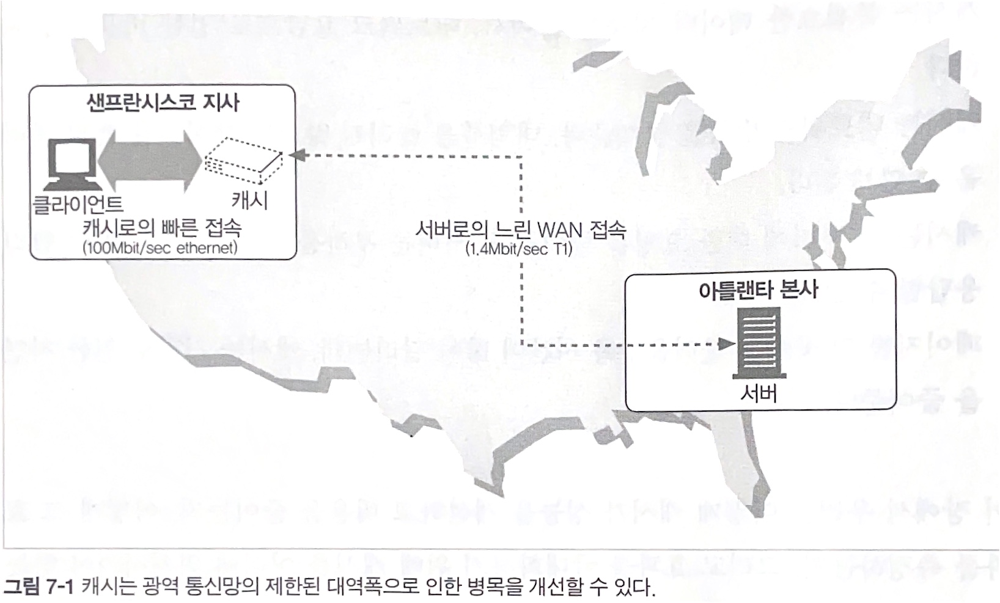

* 클라이언트들이 서버에 접근할 때의 속도는, 그 경로에 있는 가장 느린 네트워크 속도와 같다.  
만약 클라이언트가 빠른 LAN에 있는 캐시로부터 사본을 가져온다면, 캐싱은 성능을 대폭 개선할 수 있을 것이다.

## 7.3 갑작스런 요청 쇄도 (Flash Crowds)

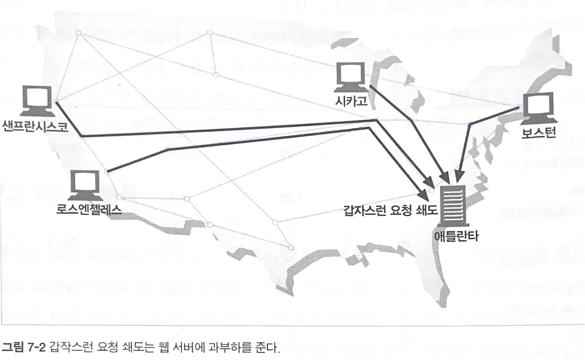

* 갑작스러 요청 쇄도, Flash Crowds는 갑작스런 사건(뉴스 속보, 이벤트 ... )으로 인해 많은 사람이 거의 동시에 웹 문서에 접근할 때 발생한다.  

* 특정 이벤트나 이슈로 인해 갑작스럽게 발생하는 트래픽을 말한다.    

* 이 결과로 초래된 불필요한 트래픽 급증은 네트워크와 웹 서버의 심각한 장애를 야기시킨다.

* 비슷한 효과로 슬래시 닷 효과(slashdot effect, slashdotting)가 있다.

* 예시
    - 연예인의 결혼소식, 대형 사고 소식이 전해지면, 해당 뉴스 사이트의 트래픽이 급증하는 경우

## 7.4 거리로 인한 지연

* 대역폭이 문제가 되지 않더라도, 거리가 문제가 될 수 있다.  

* 모든 네트워크 라우터는 제각각 인터넷 트래픽을 지연시킨다.  
그리고 클라이언트와 서버 사이에 라우터가 많지 않더라도, 빛의 속도 그자체가 유의미한 지연을 유발한다.

* 예시
    - 보스턴과 샌프라시스코 사이의 거리는 약 4,400킬로미터이다.
    - 이상적인 경우 빛의 속도(3000,000 킬로미터/초)
    - 보스턴 $\rightarrow$ 센프라시스코 : 15밀리초

    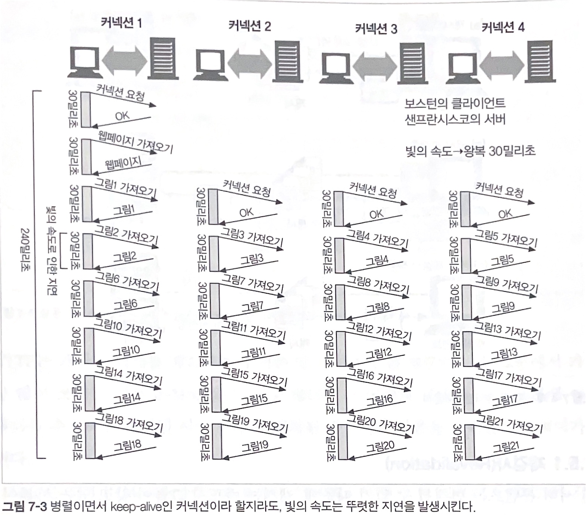

    - 복잡한 웹페이지들은 빛의 속도로 인한 지연이 수 초에 달할 수 있다.
    - 근처에 캐시를 설치해서 문서가 전송되는 거리를 수천 킬로미터에서 수십 미터로 줄일 수 있다.


## 7.5 적중과 부적중

* 캐시는 유용하지만, 세상 모든 문서의 사본을 저장하지 않는다.  

* 캐시 요청이 도착했을 때
    - 요청에 대응하는 사본 O : 캐시 적중 (cache hit)

    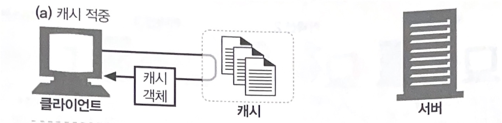

    - 요청에 대응하는 사본 X : 캐시 부적중 (cache miss)
        - 원 서버로 전달된다.

    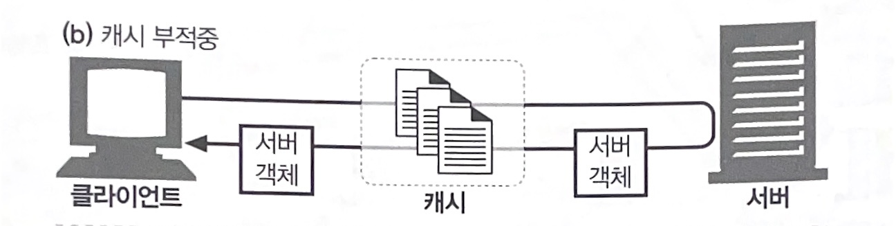

### 7.5.1 재검사 (Revalidation)

* 원 서버 콘텐츠는 변경될 수 있기 때문에, 캐시는 반드시 그들이 갖고 있는 사본이 최신이지 서버를 통해 때때로 점검해야한다.
* 이러한 '신선도 검사'를 `HTTP 재검사`라 부른다.

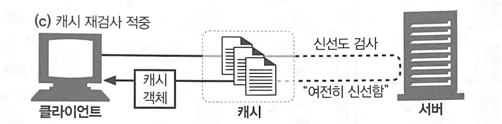

* 캐시는 스스로 원한다면 언제든지 사본을 재검사 할 수 있다.

* HTTP는 캐시된 객체를 재확인하기 위한 몇 가지 도구를 제공한다. 가장 많이 쓰이는 것은 If-Modified-Since 헤더다.
    - 서버에게 보내는 GET 요청에 이 헤더를 추가하면 캐시된 시간 이후에 변경된 경우에만 사본을 보내달라는 의미


* GET IF-Modified-Since 요청이 서버에 도착했을 때 일어날 수있는 세 가지 상황 
    1. 재검사 적중 (느린 적중)
    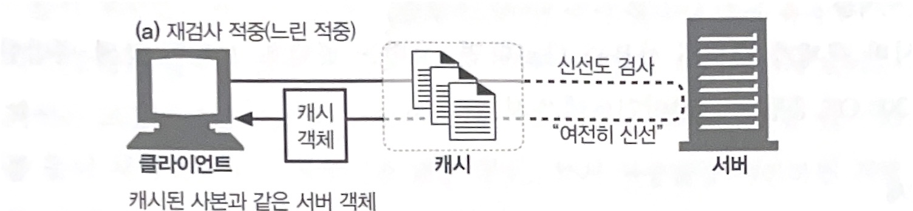

    * 만약 서버 객체가 변경되지 않았다면, 서버는 클라이언트에게 작은 `HTTP 304 Not Modified` 응답을 보낸다.

        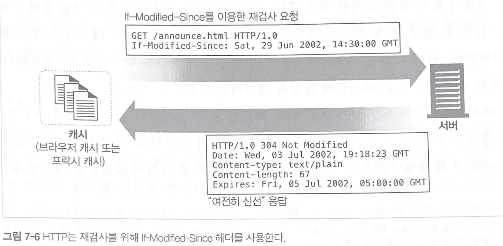

    2. 재검사 부적중
    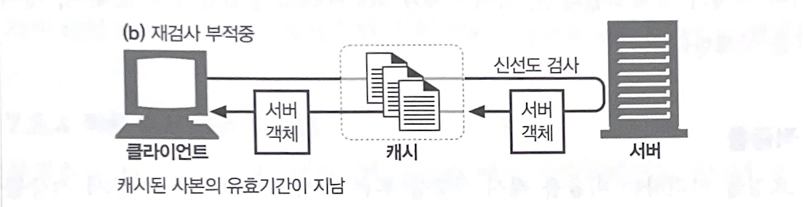
    * 만약 서버 객체가 캐시된 사본과 다르다면, 서버는 콘텐츠 전체와 함께 평범한 `HTTP 200 OK` 응답을 클라이언트에게 보낸다.

    3. 객체 삭제
    > 만약 서버 객체가 삭제되었다면, 서버는 `404 Not Found` 응답을 돌려내며, 캐시는 사본을 삭제한다.


### 7.5.2 적중률

* 캐시 적중률 (캐시 적중비) & 문서 적중률 (문서 적중비)
    - 캐시가 요청을 처리하는 비율
    - 0 ~ 1 값 (흔히 퍼센트로 표현)

* 캐시 적중률이 0% 이면 모든 요청이 캐시 부적중인 것이다. (네트워크 너머로 문서를 가져와야 했던 경우)
* 캐시 적중률이 100% 이면 모든 요청이 캐시 적중인 것이다. (캐시에서 사본을 가져온 경우)

* 오늘날 캐시 적중률 40%면 괜찮은 웹 캐시이다.
* 보통 크기의 캐시라도 충분한 분량의 자주 쓰이는 문서들을 보관하여 상당히 트래픽을 줄아고 성능을 개선할 수 있다.

> 캐시는 유용한 콘텐츠가 캐시 안에 머무르도록 보장하기 위해 노력한다.

### 7.5.3 바이트 적중률

* 바이트 단위 적중률은 캐시를 통해 제공된 모든 바이트의 비율을 표현한다.
* 이 측정값은 트래픽이 절감된 정도를 포착한다.
* 바이트 적중률이 100% 이면 모든 바이트가 캐시에서 왔으며, 어떤 트래픽도 인터넷으로 나가지 않았음을 의미한다.

* 문서 적중률과 바이트 단위 적중률은 둘 다 캐시 성능에 대한 유용한 지표이다.
    - 문서 적중률 : 얼마나 많은 웹 트랜잭션을 외부로 내보내지 않았는지
        - 트랜잭션은 고정된 소요 시간을 포함하게 되는데, 이 시간은 길 수도 있기 때문에 문서 적중률을 개선하면 전체 대기 시간이 줄어든다.
    
    - 바이트 단위 적중률 : 얼마나 많은 바이트가 인터넷으로 나가지 않았는지
        - 바이트 단위 적중률의 개선은 대역폭 절약을 최적화한다.

### 7.5.4 적중과 부적중의 구별

* HTTP는 클라이언트에게 응답이 캐시 적중이었는지 아니면 원 서버 접근인지 말해줄 수 있는 방법을 제공하지 않는다.
* 두 경우 모두 응답 코드는 200 OK 가 될 것이다.
* 어떤 상용 프락시 캐시는 캐시에 무슨 일이 일어났는지 설명하기 위해 Via 헤더에 추가 정보를 붙인다.

* 클라이언트가 응답이 캐시에서 왔는지 알아내는 방법
    1. Date 헤더
    - 응답의 Date 헤더 값을 현재 시각과 비교하여, 응답의 생성일이 더 오래되었다면 클라이언트는 응답이 캐시된 것임을 알아낼 수 있다.
    2. Age 헤더
    - 응답이 얼마나 오래되었는지 말해주는


## 7.6 캐시 토폴로지

* 토폴로지 (컴퓨터 네트워크에서의)
    > 네트워크를 배치하는 방식으로, 링크와 노드들이 어떤 식으로 배치되어 서로 연결되는지 물리적으로 혹은 논리적으로 설명

### 7.6.1 개인 전용 캐시(private cache)


* 한 명에게만 할당된 캐시
* 많은 에너지나 저장 공간을 필요로 하지 않으므로, 작고 저렴할 수 있다.
* 웹 브라우저는 개인 전용 캐시를 내장하고 있다.
* 대부분의 브라우저는 자주 쓰이는 문서를 개인용 컴퓨터의 디스크와 메로리에 캐시해 놓고, 사용자가 캐시 사이즈와 설정울 수정할 수 있도록 허용한다.

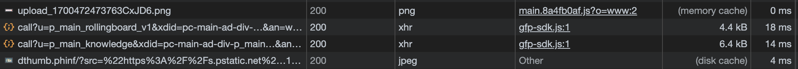

<br>
 
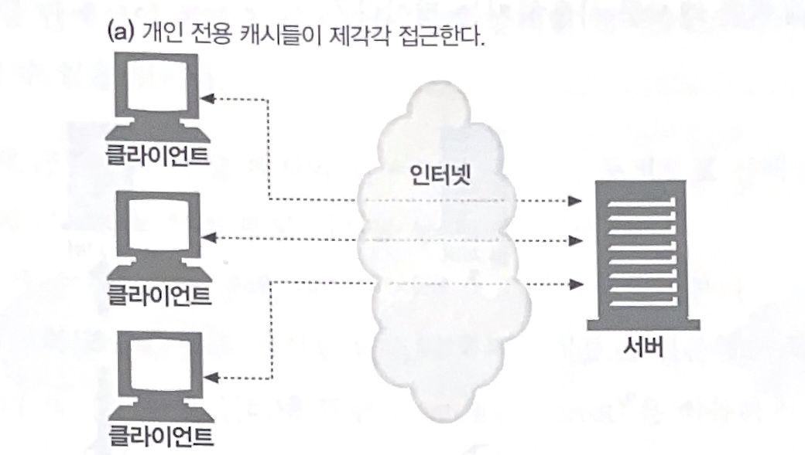

### 7.6.2 공용 프락시 캐시(public cache)

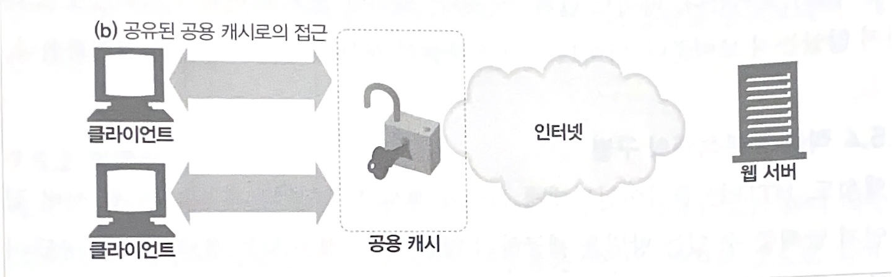

* 공용 캐시는 캐시 프락시 서버 혹은 더 흔히 프락시 캐시라고 불리는 특별한 종류의 공유된 프락시 서버이다.

* 프락시 캐시는 로컬 캐시에서 문서를 제공하거나 사용자의 입장에서 서버에 접근한다.

* 공용 캐시에는 여러 사용자가 접근하기 때문에, 불필요한 트래픽을 줄일 수 있다.

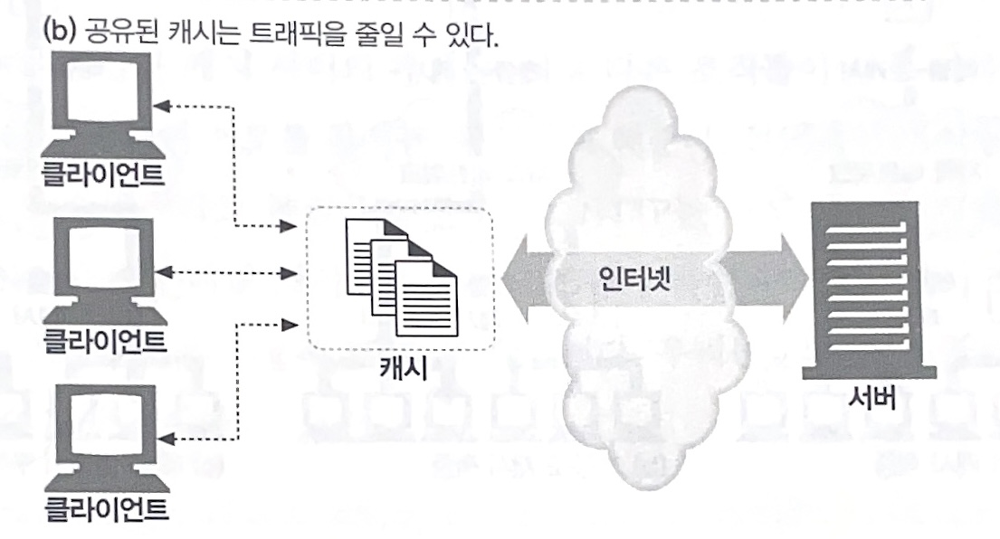


### 7.6.3 프락시 캐시 계층들

* 작은 캐시에서 캐시 부적중이 발생했을 때 더 큰 부모 캐시가 그 '걸러 남겨진' 트리팩을 처리하도록 하는 계층을 만드는 방식이 합리적인 경우가 많다.

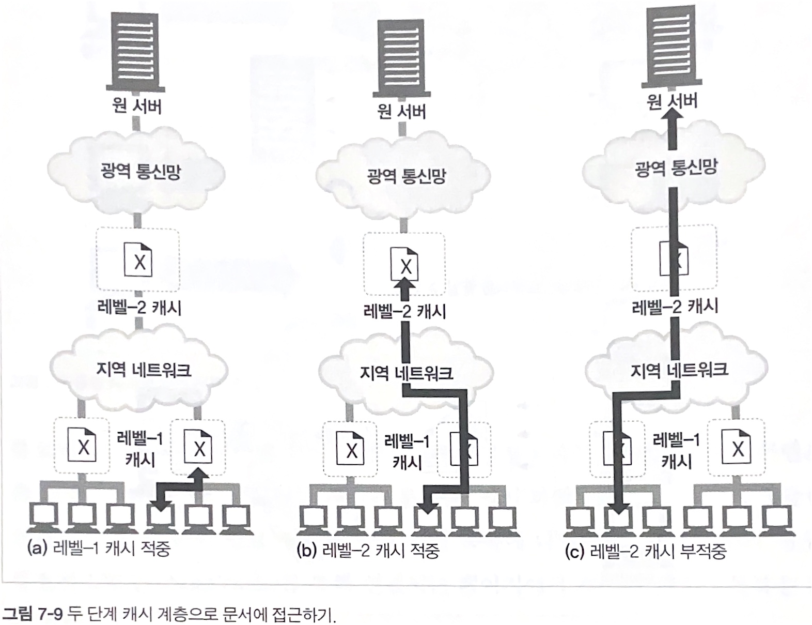

- 이 계층은 클라이언트 주위에는 작고 저렴한 캐시 사용, 계층 상단에는 많은 사용자들에 의해 공유되는 문서를 유지하기 위해 더 크고 강력한 캐시를 사용하자는 것이다.

- 캐시 계층이 깊다면 요청은 캐시의 긴 연쇄를 따라가게 될 것이다. 프락시 연쇄가 길어질수록 중간 프락시는 현저한 성능 저하가 발생할 것이다.

### 7.6.4 캐시망, 콘텐츠 라우팅, 피어링

* 몇몇 네트워크 아키텍처는 단순한 캐시 계층 대신 복잡한 캐시망을 만든다.  
* 캐시망의 프락시 캐시는 캐시 커뮤니케이션 결정을 동적으로 내린다.

* 커뮤니케이션
    - 어떤 부모 캐시와 대화할 것인지
    - 요청이 캐시를 완전히 우회해서 원 서버로 바로 가도록 할 것인지

* 캐시망 안에서의 콘텐츠 라우팅을 위해 설계된 캐시들은 다음 나열된 일들을 모두 할 수 있을 것이다.
    - URL에 근거하여, 부모 캐시와 원 서버 중 하나를 동적으로 선택한다.
    - URL에 근거하여 특정 부모 캐시를 동적으로 선택한다.
    - 부모 캐시에게 가기 전에, 캐시된 사본을 로컬에서 찾아본다.
    - 다른 캐시들이 그들의 캐시된 콘텐츠에 부분적으로 접근할 수 있도록 허용하되, 그들의 캐시를 통한 인터넷 트랜짓은 허용하지 않는다.

* 이러한 한층 더 복잡한 캐시 사이의 관계는, 서로 다른 조직들이 상호 이득을 위해 그들의 캐시를 연결하여 서로를 찾아볼 수 있도록 해준다.
* 선택적인 피어링을 지원하는 캐시는 형제 캐시라고 불린다.

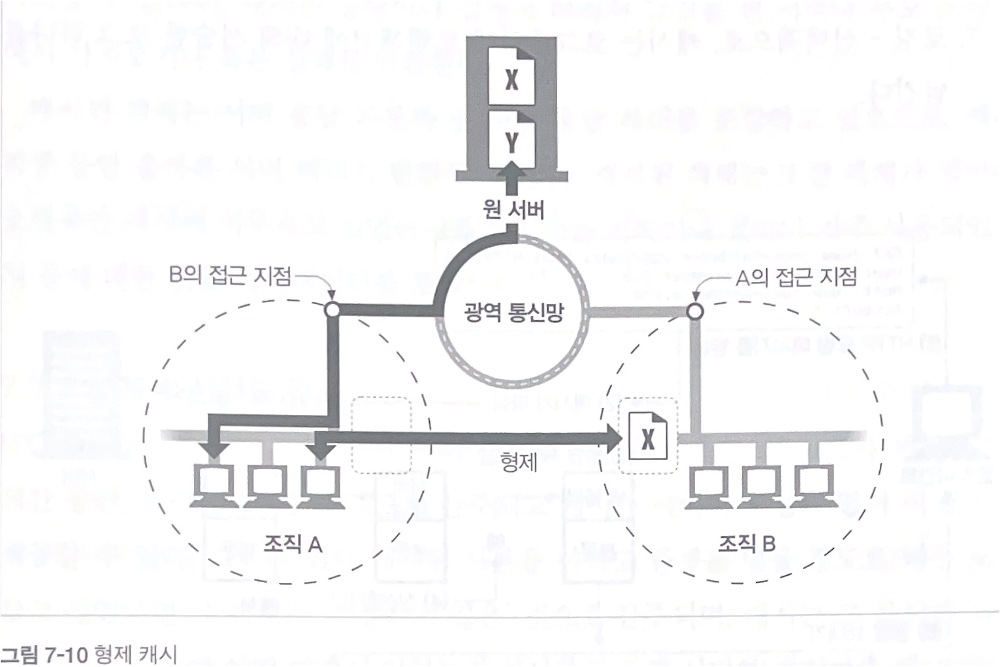

* HTTP는 형제 캐시를 지원하지 않기 때문에, 사람들은 인터넷 캐시 프로토콜(ICP), 하이퍼텍스트 캐시 프로토콜(HTCP) 같은 프로토콜을 이용해 HTTP를 확장했다.


## 7.7 캐시 처리 단계

* 웹 캐시의 기본적인 동작
* HTTP GET 메시지 하나를 처리하는 기본적인 캐시 처리 절차는 일곱 단계로 이루어져 있다.

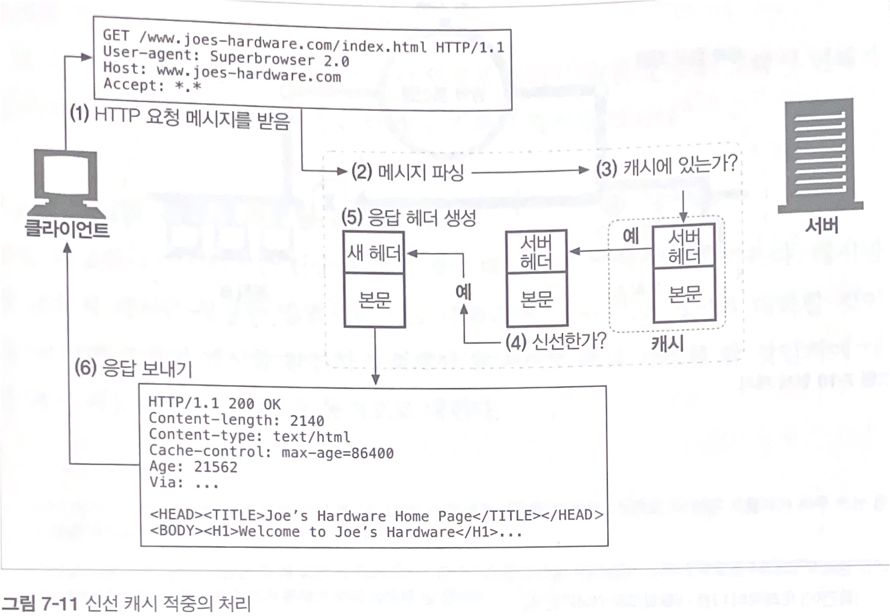

1. 요청 받기
    - 캐시는 네트워크로부터 도착한 요청 메시지를 읽는다.
2. 파싱
    - 캐시는 메시지를 파싱하여 URL과 헤더들을 추출한다.
3. 검색
    - 캐시는 로컬 복사본이 있는지 검사하고, 사본이 없다면 사본을 받아온다.(그리고 로컬에 저장한다.)
4. 신선도 검사
    - 캐시는 캐시된 사본이 충분히 신선한지 검사하고, 신선하지 않다면 변경사항이 있는지 서버에게 물어본다.
5. 응답 생성
    - 캐시는 새로운 헤더와 캐시된 본문으로 응답 메시지를 만든다.
6. 발송
    - 캐시는 네트워크를 통해 응답을 클라이언트에게 돌려준다.
7. 로깅
    - 선택적으로, 캐시는 로그파일에 트랜잭션에 대해 서술한 로그 하나를 남긴다.


### 7.7.1 단계 1 : 요청 받기

* 캐시는 네트워크 커넥션에서의 활동을 감지하고, 들어오는 데이터를 읽어들인다.
* 고성능 캐시는 여러 개의 들어오는 커넥션들로부터 데이터를 동시에 읽어들이고 메시지 전체가 도착하기 전에 트랜잭션 처리를 시작한다.

### 7.7.2 단계 2: 파싱

* 캐시는 요청 메시지를 여러 부분으로 파싱하여 헤더 부분을 조작하기 쉬운 자료 구조에 담는다.
* 이는 캐싱 소프트웨어가 헤더 필드를 처리하고 조작하기 쉽게 만들어준다.

### 7.7.3 단계 3: 검색

* 캐시는 URL을 알아내고 그에 해당하는 로컬 사본이 있는지 검사한다.

* 로컬 복사본은 메모리, 디스크, 다른 컴퓨터에 저장되어 있을 수 있다. 만약 문서를 로컬에서 가져올 수 없다면, 캐시는 상황이나 설정에 따라서 그것을 원 서버나 부모 프락시에서 가져오거나 실패를 반환한다.

* 캐시된 객체는 서버 응답 본문과 원 서버 응답 헤더를 포함하고 있으므로, 캐시 적중 동안 올바를 서버 헤더가 반환될 수 있다.
* 캐시된 객체는 또한 객체가 얼마나 오랫동안 캐시에 머무르고 있었는지를 알려주는 기록이나 얼마나 자주 사용되었는지 등에 대한 몇몇 메타데이터를 포함한다.

### 7.7.4 단계 4: 신선도 검사

* HTTP는 캐시가 일정 기간 동안 서버 문서의 사본을 보유할 수 있도록 해준다.
* 이 기간 동안, 문서는 '신선'한 것으로 간주되고 캐시는 서버와의 접촉 없이 이 문서를 제공할 수 있다.

* 캐시된 사본을 신선도 한계를 넘을 정도로 오래 갖고 있었다면 그 객체는 '신선하지 않은'것으로 간주된다.

* 캐시는 그 문서를 제공하기 전에 문서에 어떤 변경이 있었는지 검사하기 위해 서버와 재검사를 해야 한다.

### 7.7.5 단계 5: 응답 생성

* 캐시된 응답을 원 서버에서 온 것처럼 보이게 하고 싶기 때문에, 캐시는 캐시된 서버 응답 헤더를 토대로 응답 헤더를 생성한다.

* 이 기저 헤더들은 캐시에 의해 수정되고 늘어난다.

* 캐시는 클라이언트에 맞게 이 헤더를 조정해야 하는 책임이 있다.

* 예를 들어, 클라이언트가 HTTP/1.1 응답을 기대하는 상황에서 서버가 HTTP/1.0 응답을 반환했다면, 캐시는 반드시 헤더를 적절하게 번역해야 한다.

* 캐시는 캐시 신선도 정보(Cache-Control, Age, Expires 헤더)를 삽입하며, 또 요청이 프락시 캐시를 거쳐갔음을 알려주기 위해 종종 Via 헤더를 포함시킨다.

* 캐시가 Date 헤더를 조정해서는 안된다. Date 헤더는 그 객체가 원 서버에서 최초로 생겨난 일시를 표현하는 것이다.

### 7.7.6 단계 6: 전송

* 응답 헤더가 준비되면, 캐시는 응답을 클라이언트에게 돌려준다.

* 모든 프락시 서버들과 마찬가지로, 프락시 캐시는 클라이언트와의 커넥션을 유지할 필요가 있다.

### 7.7.7 단계 7: 로깅

* 대부분의 캐시는 로그 파일과 캐시 사용에 대한 통계를 유지한다.

* 각 캐시 트랜잭션이 완료된 후, 캐시는 통계 캐시 적중과 부적중 횟수에 대한 통계를 갱신하고 로그파일에 요청 종류, URL 그리고 무엇이 일어났는지를 알려주는 항목을 추가한다.

### 7.7.8 캐시 처리 플로 차트

* 그림 7-12 는 캐시가 어떻게 GET 요청을 처리하는지 간략한 형태로 보여준다.

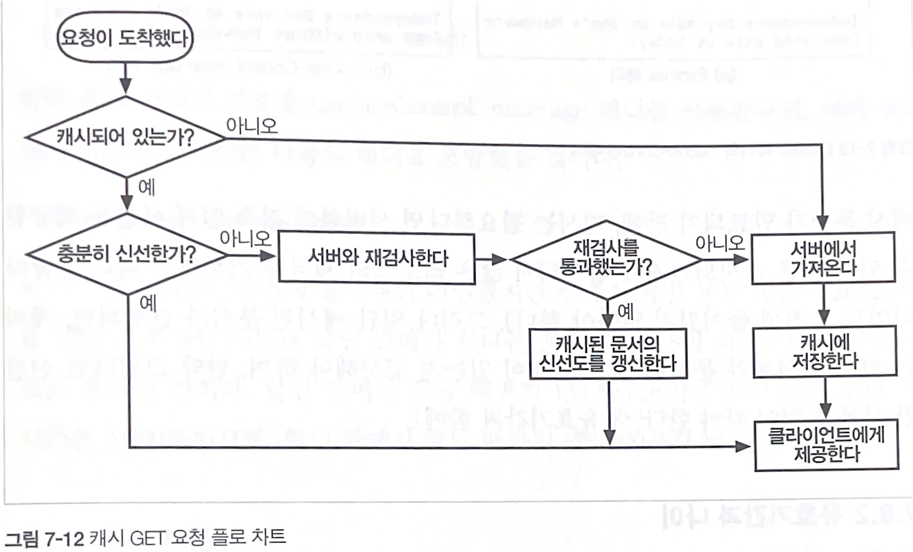

<br><br>

## 7.8 사본을 신선하게 유지하기

* 캐시된 사본 모두가 서버의 문서와 항상 일치하는 것은 아니다. 결국 문서들은 시간에 따라 변경된다.

* 오래된 데이터를 제공하는 캐시는 불필요한다.

> 캐시된 데이터는 서버의 데이터와 일치하도록 관리되어야 한다.

* HTTP는 어떤 캐시가 사본을 갖고 있는지 서버가 기억하지 않더라고, 캐시된 사본이 서버와 충분히 일치하도록 유지할 수 있게 해주는 `문서만료`와 `서버 재검사`가 있다.

### 7.8.1 문서 만료

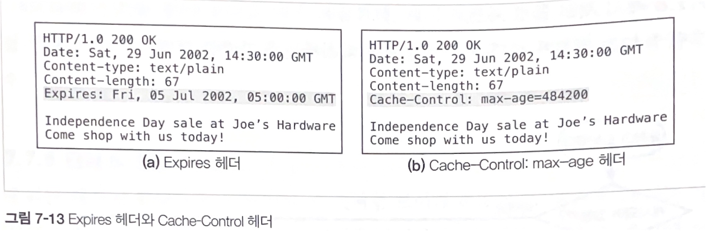

<br>

* HTTP는 Cache-Control과 Expires 라는 특별한 헤더들을 이용해서 원 서버가  각 문서에 유효기간을 붙일 수 있게 해준다.

* 이 헤더들은 콘텐츠가 얼마나 오랫동안 신선한 상태로 보일 수 있는지 좌우한다.

* 캐시 문서가 만료되기 전에, 캐시는 필요하다면 서버와의 접촉 없이 사본을 제공할 수 있다.

* 캐시 문서가 만료되면, 캐시는 반드시 서버와 문서에 변경된 것이 있는지 검사해야 하며, 만약 그렇다면 신선한 사본을 얻어 와야 한다.

### 7.8.2 유효기간과 나이

* 서버는 응답 본문과 함께하는, HTTP/1.0+ Expiress나 HTTP/1.1 Cache-Control:max-age 응답 헤더를 이용해서 유효기간을 명시한다.

* 헤더|설명
    ---|---
    Cache-Control: max-age|max-age 값은 문서의 최대 나이를 정의한다. 최대 나이는 문서가 처음 생성된 이후부터, 제공하기엔 더 이상 신선하지 않다고 간주될 때까지 경과한 시간의 합법적인 최댓값(초단위)이다.
    Expires|절대 유효기간을 명시한다. 만약 유효기간이 경과했다면, 그 문서는 더 이상 신선하지 않다.


* 오늘이 2002년 6월 29일 오전 9시 30분 가정하고 2002년 7월 4일까지 할인 상품을 판매한다.

1. Expires
    ```
    Expires: Fri, 05 Jul 2002, 05:00:00 GMT
    ```
2. 만료까지 남은 시간을 초로 환산한 것이다.  
    할인 판매가 끝날 때까지 134.5시간(약 5일) 남아 있다.  
    매 시간은 3,600초이므로, 할인 판매가 끝날 때까지 484,200초가 남은 것이다.
    ```
    Cache-Control: max-age=484200
    ```

### 7.8.3 서버 재검사

* 캐시된 문서가 만료되었다는 것은, 그 문서가 원 서버에 현재 존재하는 것과 실제로 다르다는 것을 의미하지는 않으며, 검사할 시간이 되었음을 뜻한다.

* 서버 재검사
    - 캐시가 원 서버에게 문서가 변경되었는지의 여부를 물어볼 필요가 있음을 의미

1. 재검사 결과 콘텐츠가 변경되었다면, 캐시는 그 문서의 새로운 사본을 가져와 오래된 데이터 대신 저장한 뒤 클라이언트에게도 보내준다.
2. 재검사 결과 콘텐츠가 변경되지 않았다면, 캐시는 새 만료일을 포함한 새 헤더들만 가져와서 캐시 안의 헤더들을 갱신한다.

* 위 1,2 방법은 문서의 신서도를 매 요청마다 검증할 필요가 없다. 문서가 만료되었을 때 한 번만 서버와 재검사하면 된다.
* 이는 신선하지 않은 콘텐츠는 제공하지 않으면서도, 서버 트래픽을 절약하고 사용자 응답 시간을 개선한다.

* HTTP 프로토콜은 캐시가 다음 중 하나를 반환하는 적절한 행동을 할 것을 요구한다.
    - '충분히 신선한' 캐시된 사본
    - 원 서버와 재검사되었기 때문에, 충분히 신선하다고 확신할 수 있는 캐시된 사본
    - 에러 메시지(재검사해야 하는 원 서버가 다운된 경우)
    - 경고 메시지가 부착된 캐시된 사본(부정확하다면)

### 7.8.4 조건부 메서드와의 재검사

* HTTP의 조건부 메서드는 재검사를 효율적으로 만들어준다.
* HTTP는 캐시가 서버에게 '조건부 GET'이라는 요청을 보낼 수 있도록 해준다.
    - 이 요청은 서버가 갖고있는 문서가 캐시가 갖고 있는 것과 다른 경우에만 객체 본문을 보내달라고 하는 것이다.

* 조건부 GET은 GET 요청 메시지에 특별한 조건부 헤더를 추가함으로써 시작된다. 웹 서버는 조건이 참인 경우에만 객체를 반환한다.

* HTTP는 다섯 가지 조건부 요청 헤더를 정의한다. 그 중 둘은 캐시 재검사를 할 때 가장 유용하다.

* 헤더|설명
    ---|---
    If-Modified-Since: < date >|만약 문서가 주어진 날짜 이후로 수정되었다면 요청 메서드를 처리한다. 이것은 캐시된 버전으로부터 콘텐츠가 변경된 경우에만 콘텐츠를 가져오기 위해 last-Modified 서버 응답 헤더와 함께 사용한다.
    If-None-Match: < tags >|마지막 변경된 날짜를 맞춰보는 대신, 서버는 문서에 대한 일련번호와 같이 동작하는 특별한 태그를 제공할 수 있다. If-None-Match 헤더는 캐시된 태그가 서버에 있는문서의 태그와 다를 때만 요청을 처리한다.

### 7.8.5 If-Modified-Since: 날짜 재검사

* 가장 흔히 쓰이는 캐시 재검사 해더이다.  
If-Modified-Since 재검사 요청은 흔히 'IMS' 요청으로 불린다.  
'IMS' 요청은 서버에게 리소스가 특정 날짜 이후로 변경된 경우에만 요청한 본문을 보내달라고한다.


1. 만약 문서가 주어진 날짜 이후에 변경되었다면, IMS 조건은 참이고, 따라서 GET 요청은 평범하게 성공한다. 새 문서가, 새로운 만료날짜와 그 외 다른 정보들이 담긴 헤더들과 함께 캐시에게 반환된다.

2. 만약 문서가 주어진 날짜 이후에 변경되지 않았더라면, IMS 조건은 거짓이고, 서버는 작은 304 Not Modified 응답 메시지를 클라이언트에게 돌려준다.

* If-Modified-Sice 헤더는 서버 응답 헤더의 Last-Modified 헤더와 함께 동작한다.  
원 서버는 제공하는 문서에 최근 변경 일시를 붙인다.  
캐시가 캐시된 문서를 재검사 하려고 할 때, 캐시된 사본이 마지막으로 수정된 날짜가 담긴 If-Modified-Since 헤더를 포함시킨다.  
    ```
    If-Modified-Since: <캐시된 마지막 수정일>
    ```

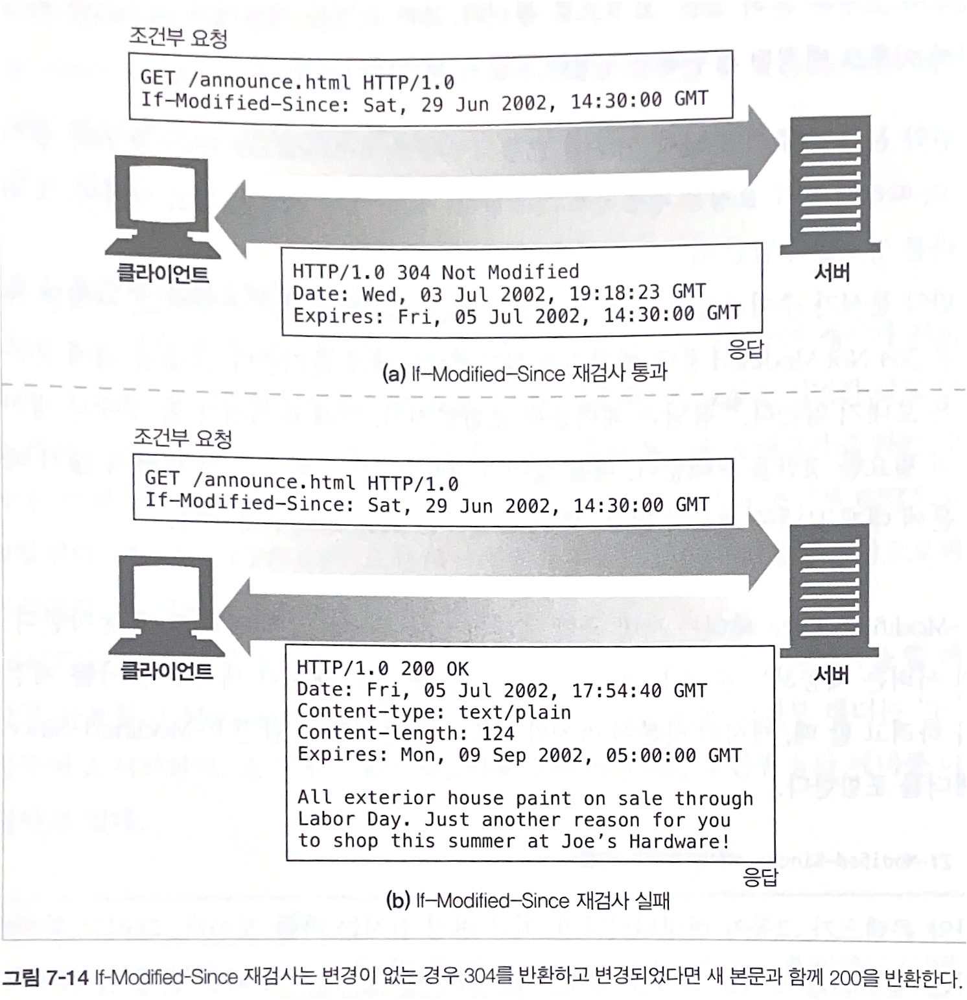

### 7.8.6 If-None-Match: 엔터티 태그 재검사

* 다음과 같이 최근 변경 일시 재검사가 적절히 행해지기 어려운 상황이 몇 가지 있다.
    1. 어떤 문서는 일정 시간 간격으로 다시 쓰여지지만 실제로는 같은 데이터를 포함하고 있다. 내용에는 아무런 변화가 없더라도 변경시각은 바뀔 수 있다.
    2. 어떤 문서들의 변경은 전 세계의 캐시들의 그 데이터를 다시 읽어들이기엔 사소한 것일 수도 있다.
    3. 어떤 서버들은 그들이 갖고 있는 페이지에 대한 최근 변경 일시를 정확하게 판별할 수 없다.
    4. 1초보다 작은 간격으로 갱신되는 문서를 제공하는 서버들에게는, 변경일에 대한 1초의 정밀도는 충분하지 않을 수 있다.


* 퍼블리셔가 문서를 변경했을 때, 그는 문서의 엔터티 태그를 새로운 버전으로 표현할 수 있다.  
엔터티 태그가 변경되었다면, 캐시는 새 문서의 사본을 얻기(GET)위해 IF-None-Match 조건부 헤더를 사용할 수 있다.  

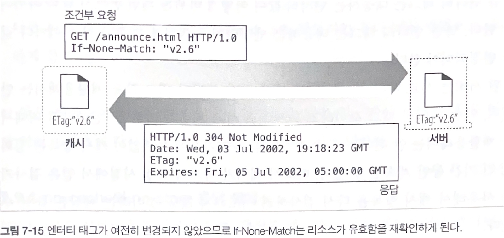

<br>

* 캐시는 엔터티 태그 "v2.6"인 문서를 갖고 있다.
* 캐시는 원 서버에게 태그가 더 이상 "v2.6"이 아닌 경우에만 새 객체를 달라고 요청하는 방법으로 유효한지 여부를 재검사한다.
    * 위 그림에서는 태그가 변경되지 않았기 때문에 304 Not Modified 응답이 반환된다.
    * 만약 태그가 변경되었다면, 서버는 200 OK 응답으로 새 콘텐츠를 새 ETag와 함께 반환했을 것이다.
* 캐시가 객체에 대한 여러 개의 사본을 갖고 있는 경우, 그 사실을 서버에게 알리기 위해 하나의 If-None-Match 헤더에 여러 개의 태그를 포함시킬 수 있다.
    ```
    If-None-Match: "v2.4","v2.5","v2.6"
    If-None_Match: "foobar","A34FAC0095","Profiles in Courage"
    ```


### 7.8.7 약한 검사기와 강한 검사기

* 캐시는 캐시된 버전이 서버가 갖고 있는 것에 대해 최선인지 확인하기 위해 엔터티 태그를 사용한다.  
이 경우, 엔터티 태그와 최근 변경일시는 둘 다 캐시 검사기다.

1. 약한 검사기
    - 서버는 때때로 모든 캐시된 사본을 무효화시키지 않고 문서를 살짝 고칠 수 있도록 허용하고 싶은 경우가 있다.
    - HTTP/1.1은, 비록 콘텐츠가 조금 변경되었라도 "그 정도면 같은 것"이라고 서버가 주장할 수 있도록 약한 검사기를 지원한다.

2. 강한 검사기
    - 콘텐츠가 바뀔 때마다 바뀐다.
    - 조건부 특정범위 가져오기 같은 몇몇 동작은 약한 검사기로 불가능하기 때문에, 서버는 'W/' 접두사로 약한 검사기를 구분한다.

```
ETag: W/"v2.6"
If-None-Match: W/"v2.6"
```

* 강한 엔터티 태그는 대응하는 엔터티 값이 어떻게 바뀌든 매번 반드시 같이 바뀌어야한다.  
약한 엔터티 태그는 대응하는 엔터티에 유의미한 변경이 있을 때마다 같이 변경되어야 한다.  

* 원 서버는 서로 다른 두 엔터티에 대해 강한 엔터티 태그 값을 재활용해서는 안되며, 약한 엔터티 태그 값이라고 할지라도 서로 의미가 다른 두 엔터티에 대해서는 재활용해서는 안된다.


### 7.8.8 언제 엔터티 태그를 사용하고 언제 Last-Modified 일시를 사용하는가

* HTTP/1.1 클라이언트는 만약 서버가 엔터티 태그를 반환했다면, 반드시 엔터티 검사기를 사용해야한다.  
만약 서버가 Last-Modified 값만 반환했다면, 클라이언트는 If-Modified-Since 검사를 사용할 수 있다.  
만약 엔터티 태그와 최근 변경일시가 모두 사용 가능하다면, HTTP/1.0과 HTTP/1.1 캐시 모두 적절히 응답할 수 있도록 클라이언트는 각각을 위해 두 가지의 재검사 정책을 모두 사용해야한다.


## 7.9 캐시 제어

* HTTP는 문서가 만료되기 전까지 얼마나 오랫동안 캐시될 수 있게 할 것인지 서버가 설정할 수 있는 여러 가지 방법을 정의한다.

    * Cache-Control: no-store 헤더를 응답에 첨부할 수 있다.

    * Cache-Control: no-cache 헤더를 응답에 첨부할 수 있다.

    * Cache-Control: must-revalidate 헤더를 응답에 첨부할 수 있다.

    * Cache-Control: max-age 헤더를 응답에 첨부할 수 있다.

    * Expires 날짜 헤더를 응답에 첨부할 수 있다.

    * 아무 만료 정보도 주지 않고, 캐시가 스스로 체험적인(휴리스틱) 방법으로 결정하게 할 수 있다.


### 7.9.1 no-cache 와 no-store 응답 헤더

* HTTP/1.1 은 신선도를 관리하기 위해, 객체를 캐시하는 것을 제한하거나 캐시된 객체를 제공하는 여러 가지 방법을 제공한다.

* no-store와 no-cache 헤더는 캐시가 검증되지 않은 캐시된 객체로 응답하는 것을 막는다.

```
Cache-Control: no-store
Cache-Control: no-cache
Pragma: no-cache
```

* 'no-store' 표시된 응답은 캐시가 그 응답의 사본을 만드는 것을 금지한다.
    - 캐시는 클라이언트에게 no-store 응답을 전달하고나면 객체를 삭제할 것이다.

* 'no-cache' 표시된 응답은 사실 로컬 캐시 저장소에 저장될 수 있다. 다만 먼저 서버와 재검사를 하지않고서는 캐시에서 클라이언트로 제공될 수 없을 뿐이다.
    - 이 헤더의 더 나은 이름은 "Do-Not-Serve-From-Cache-Without-Revalidation(재검사 없이 캐시에게 제공하지 마라)"일 것이다.

* Pragma: no-cache 헤더는 HTTP/1.0+ 와의 하위호환성을 위해 HTTP/1.1에 포함되어 있다.
    - HTTP/1.1 애플리케이션은 Pragma: no-cache만 이해할 수 있는 HTTP/1.0 애플리케이션에 대응해야 하는 경우가 아니라면 Cache-Control: no-cache를 사용해야 한다.

### 7.9.2 Max-Age 응답 헤더

* Cache-Control: max-age 헤더는 신선하다고 간주되었던 문서가 서버로부터 온 이후로 흐른 시간이고, 초로 나타낸다.

* s-maxage 헤더는 공유된(공용) 캐시에만 적용된다.

```
Cache-Control: max-age=3600
Cache-Control: s-maxage=3600
```

* 서버는 최대 나이먹음(maximum aging)을 0으로 설정함으로써, 캐시가 매 접근마다 문서를 캐시하거나 리프레시하지 않도록 요청할 수 있다.

### 7.9.3 Expires 응답 헤더

* Expires 헤더는 실제 만료 날짜를 명시한다.

* HTTP를 설계한 사람들은, 많은 서버가 동기화되어 있지 않거나 부정확한 시계를 갖고 있기 때문에, 만료를 절대시각 대신 경과된 시간으로 표현하는 것이 낫다고 판단했다.

* 신선도 수명의 근사값은 만료일과 생성일의 초 단위 시간차를 계산하여 얻을 수 있다.

```
Expires: Fri, 05, Jul, 2002, 05:00:00 GMT
```

### 7.9.4 Must-Revalidate 응답 헤더

* 캐시는 성능을 개선하기 위해 신선하지 않은(만료된) 객체를 제공하도록 설정될 수 있다.
* Cache-Control: must-revalidate 응답 헤더는 캐시가 이 객체의 신선하지 않은 사본을 원 서버와의 최초의 재검사 없이는 제공해서는 안 됨을 의미한다.  
캐시는 자유롭게 신선한 사본을 제공할 수 있다.

* 만약 캐시가 must-revalidate 신선도 검사를 시도했을 때 원 서버가 사용할 수 없는 상태라면, 캐시는 반드시 504 Gateway Timeout error를 반환해야 한다.

### 7.9.5 휴리스틱 만료

* 만약 응답이 Cache-Control: max-age 헤더나 Expires 헤더 중 어느 것도 포함하지 않고 있다면, 캐시는 경험적인 방법으로(heuristic) 최대 나이를 계산할 것이다.

* 어떤 알고리즘이든 사용될 수 있지만, 계산 결과 얻은 최대 나이 값이 24시간보다 크다면, Heuristic Expiration 경고 헤더가 응답 헤더에 추가되어야 한다.

* LM 인자 알고리즘
    - 문서가 최근 변경 일시를 포함하고 있다면 사용할 수 있다.
    - 최근 변경 일시를 문서가 얼마나 자주 바뀌는지에 대한 추정에 사용한다.

* LM 인자 알고리즘 로직
    - 만약 캐시된 문서가 마지막으로 변경된 것이 상당히 예전이라면, 그것은 아마 안정적인 문서일 것이고 갑자기 바뀔 가능성은 별로 크지 않을 것이므로, 캐시에 더 오래 보관하고 있어도 안전한다.
    - 만약 캐시된 문서가 최근에 변경되었다면, 그것은 아마 자주 변경될 것이고, 따라서 우리는 그것을 서버와 재검사하기 전까지 짧은 기간 동안만 캐시해야 한다.

* 실제 LM 인자 알고리즘은 캐시가 서버와 대화했을 때와 서버가 문서의 최근 변경 일시를 말해줬을 때의 시간차를 계산하고, 이 차의 일부분을 취하여, 이 일부분을 캐시의 신선도 지속기간으로 사용한다.

* LM 인자 알고리즘 의사코드
    ```
    마지막_수정_이후로_경과한 시간 = max(0, 서버의_Date - 서버의_Last_Modified);
    서버_신선도_한계 = int(마지막_수정_이후로_경과한_시간 * lm_인자);
    ```
* LM 인자 신선도 기간을 시각적으로 묘사
    - 사선 무늬 줄은 LM 인자를 0.2로 했을 때의 신선도 유지기간

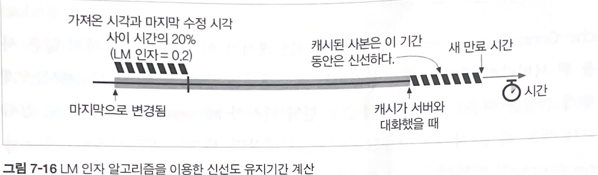


### 7.9.6 클라이언트 신선도 제약

* 웹브라우저는 브라우저나 프락시 캐시의 신선하지 않은 콘텐츠를 강제로 갱신시켜주는 리프레시나 리로드 버튼을 갖고 있다.

* 리프레시 버튼은 Cache-control 요청 헤더가 추가된 GET 요청을 발생시켜서, 강제로 재검사하거나 서버로부터 콘텐츠를 무조건 가져온다.  
정확한 리프레시 동작은 각 브라우저나 문서, 중간 캐시 설정에 달려있다.

* 클라이언트는 Cache-Control 요청 헤더를 사용하여 만료 제약을 엄격하게 하거나 느슨하게 할 수 있다.  
클라이언트는 문서를 최슨으로 유지할 필요가 있는 애플리케이션을 위해 Cache-Control 헤더를 사용해 만료를 더 엄격하게 할 수 있다.  

* 클라이언트 역시 성능, 신뢰성, 비용 개선을 위한 절충안으로 신선도 요구사항을 느슨하게 할 수도 있다.

* Cache-Control 요청 지시어

    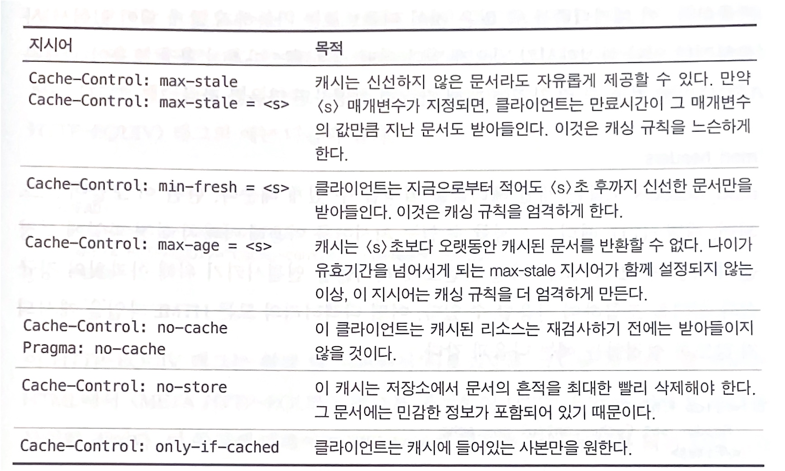


### 7.9.7 주의할 점

* 문서 만료는 완벽한 시스템이 아니다.  
만약 퍼블리셔가 잘못해서 유효기간을 까마득한 미래로 설정해버린다면, 만료되기 전까지는 그 문서에 대한 어떤 변경도 캐시에 반영되지 않을 것이다.  

## 7.10 캐시 제어 설정

* 웹 서버들은 캐시 제어와 만료 HTTP 헤더들을 설정하는 서로 다른 메커니즘을 제공한다.

### 7.10.1 아파치로 HTTP 헤더 제어하기

* 아파치 웹 서버는 HTTP 캐시 제어 헤더를 설정할 수 있는 여러 가지 메커니즘을 제공한다.

1. mod_headers
    - 개별 헤더들을 설정할 수 있게 해준다.
    - 개별 HTTP 헤더를 설정할 수 있는 지시어를 이용해 아파치 설정 파일에 설정을 추가할 수 있다.
    - 개별 콘텐츠에 헤더들을 연결시키기 위해 아파치의 정규식과 필터를 조합하여 사용할 수 있다.
    - 어떤 디렉터리의 모든 HTML 파일을 캐시되지 않도록 설정하는 예
    ~~~
    <Files *.html>
    Header set Cache-control no-cache
    </Files>
    ~~~

2. mod_expires
    - 적절한 만료 날짜가 담긴 Expires 헤더를 자동으로 생성하는 프로그램 로직을 제공한다.
    - 이 모듈은 문서에 마지막으로 접근한 날 혹은 수정한 날 이후의 일정 시한으로 유효기간을 설정할 수 있게 해준다.
    - 몇 가지 예시
    ```
    ExpiresDefault A3600
    ExpiresDefault M86400
    ExpiresDefault "access plus 1 week"
    ExpiresByType text/html "modification plus 2 days 6 hours 12 minutes"
    ```

3. mod_cern_meta

    - HTTP 헤더들의 파일을 특정 객체와 연결시켜준다.
    - 이 모듈을 켜면 제어하고자 하는 파일에 각각 대응되는 메터파일들을 생성하게 되므로, 각 메타파일에 원하는 헤더를 추가하면 된다.


### 7.10.2 HTTP-EQUIV 를 통한 HTML 캐시 제어

* HTTP 서버 응답 헤더는 문서의 만료와 캐시 제어 정보를 돌려주기 위해 사용된다.
* 웹 서버는 제공할 문서에 올바른 캐시 제어 헤더들을 부여하기 위해 설정 파일들과 상호작용한다.

* HTTP-EQUIV 태그는 원래 웹 서버에서 사용되도록 의도된 것이다.  
하지만 이 기능을 지원하는 웹 서버나 프락시는 거의 없다.
    - 서버의 부하를 가중시키고, 설정값이 정적이고, HTML을 제외한 다른 타입의 파일은 지원하지 않기 때문이다.

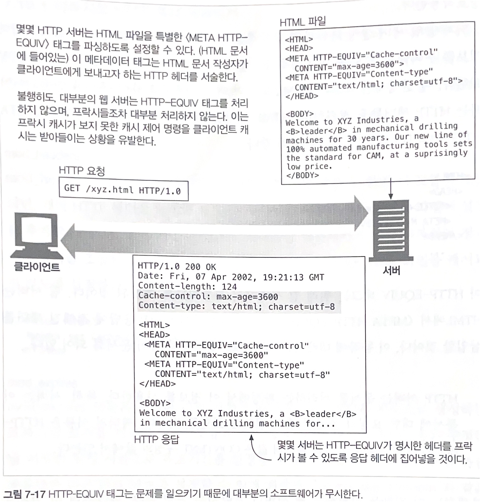

<br>

* 몇몇 브라우저는 HTML 콘텐츠 내의 HTTP-EQUIV 태그를 파싱하고 실제 HTTP 헤더처럼 다룬다.  
이건 불행한 일인데, HTTP-EQUIV를 지원하는 HTML 브라우저들은 중간의 프락시 캐시와는 다른 캐시 제어 규칙을 적용할 것이기 때문이다.  
이는 캐시 만료에 대한 동작에 혼란을 초래한다.

* 문서의 캐시 제어 요청과 커뮤니케이션하는 유일하게 확실한 방법은 올바르게 설정된 서버가 보내온 HTTP 헤더를 이용하는 것이다.


## 7.11 자세한 알고리즘

* HTTP 명세는 문서의 나이와 캐시 신선도를 계산하는, 자세하지만 조금 이해하기 어렵고 종종 혼란스러운 알고리즘을 제공한다.

* 이 절은 캐시 내부에 대한 일을 하는 독자들에게 유용하다.

## 7.12 캐시와 광고

* 캐시는 사용자를 도와 더 좋은 경험을 제공하고, 또한 네트워크 사업자들이 트래픽을 줄일 수 있도록 도와준다.

### 7.12.1 광고 회사의 딜레마

* 콘텐츠 제공자는 광고를 통해 수익을 창출한다.  
사용자가 광고를 볼 때마다(접근 횟수에 따라) 수익을 얻겠지만, 캐시와 관련되면 문제가 된다.
* 캐시는 원 서버가 실제 접근 횟수를 알수 없게 숨길 수 있다.  
만약 캐싱이 완벽하게 동작한다면 원 서버는 HTTP 접근을 전혀 수신하지 않게 된다.  
* 인터넷 캐시가 그 접근들을 모두 흡수하기 때문이다.

### 7.12.2 퍼블리셔의 응답

* 위 광고 회사의 딜레마처럼 캐시가 광고 시청 수를 가로채지 못하도록 광고회사들은 '캐시 무력화' 기법을 사용한다.
    - 광고를 CGI 게이트웨이를 통해 제공한다.
    - 매 접근마다 광고 URL을 고쳐쓴다.

* 캐시 무력화 기법은 단지 프락시 캐시만에 대한 것이 아닌, 주로 모든 웹브라우저에게 켜져 있는 캐시를 주요 대상으로 하고 있다.  
이는 캐싱의 긍정적인 효과를 감소시킨다.

* 콘텐츠 제공자는 캐시가 그들의 트래픽을 흡수하도록 내버려 두어야 하며, 캐시는 그들에게 적중이 얼마나 많이 일어났는지 알려주어야한다.

* 오늘날 캐시는 모든 접근에 대해 원 서버와 재검사하도록 설정한다.
    - 매 접근마다 원 서버에 캐시 적중이 있었음을 알리지만 보통 본문 데이터를 전송하지 않는다.
    - 이러한 방법은 트랜잭션을 느리게 만든다.


### 7.12.3 로그 마이그레이션

* 이상적인 해결책으로 서버로 요청이 가지 않게 하는 것이다.  
결국 캐시는 모든 적중의 로그를 유지할 수 있다.  
캐시는 이 로그를 서버에게 나누어 줄 수 있을 것이다.

* 하지만 적중로그는 크기 때문에 옮기기 어렵다.  
그리고 캐시 로그는 개별 콘텐츠 제공자별로 분리될 수 있도록 표준화되어 있지도 조직되어 있지도 않다.  
뿐만 아니라 인증과 프라이버시 이슈도 있다.

### 7.12.4 적중 측정과 사용량 제한

* RFC 2227, "HTTP를 위한 간단한 캐시 적중량 측정과 사용량 제한"은 더 간단한 방법을 정의한다.

* 이 프로토콜은 HTTP에 때때로 특정 URL에 대한 캐시 적중 횟수를 정기적으로 서버에게 돌려주는 Meter라고 하는 새 헤더 하나를 추가한다.
    - 이 방법은, 서버가 캐시된 문서가 적중한 횟수의 정기적인 업데이트를 추가적으로 받는다.

* 사용량 제한
    - 서버는 캐시가 서버에게 보고해야 하기 전까지, 문서를 제공할 수 있는 횟수나 소모할 수 있는 처리시간을 제어할 수 있다.
    - 캐시가 원 서버에게 보고하기 전에 캐시된 리소스가 얼마나 많이 사용될 수 있는지 서버가 제어할 수 있게 해준다.


