# 통합점: 게이트웨이, 터널, 릴레이

## 이 장을 통해 배울 내용

* 여러 종류의 리소스에 접근하는데 HTTP가 어떻게 쓰이는지 알아볼 것이다.
* 다른 프로토콜이나 애플리케이션 간 통신에 HTTP를 어떻게 사용하는지 알아볼 것이다.

1. 게이트웨이 : 서로 다른 프로토콜과 애플리케이션 간의 HTTP 인터페이스다.

2. 애플리케이션 인터페이스 : 서로 다른 형식의 웹 애플리케이션이 통신하는 데 사용한다.

3. 터널 : HTTP 커넥션을 통해서 HTTP가 아닌 트래픽을 전송하는 데 사용한다.

4. 릴레이 : 일종의 단순한 HTTP 프락시로, 한 번에 한 개의 홉에 데이터를 전달하는데 사용한다.

## 8.1 게이트웨이

* 게이트웨이의 등장  
    HTTP의 확장과 인터페이스는 필요에 따라 발전해왔다.
    웹에 더 복잡한 리소스를 올려야 할 필요가 생기면서, 모든 리소스를 한 개의 애플리케이션으로만 처리할 수 없다는 것은 분명해졌다.  
    이 문제에 대한 해결책으로, 인터프리터 같이 리소스를 받기 위한 경로를 안내하는 역할을 하는 게이트웨이를 고안했다.

* 게이트웨이는 리소스와 애플리케이션을 연결하는 역할을 한다.
    - 애플리케이션은 게이트웨이에게 요청을 처리해달라고 할 수 있고, 게이트웨이는 그에 응답할 수 있다.
    - 게이트웨이는 요청을 받고 응답을 보내는 포털 같이 동작하는데, 동적인 콘텐츠를 생성하거나 데이터 베이스에 질의를 보낼 수 있다.


* 그림 8-1 : 리소스 게이트웨이
    1. 클라이언트는 단순히 HTTP를 통해서 리소스 요청을 한다.
    2. 서버는 리소스를 얻기 위한 게이트웨이 인터페이스 역할을 한다.
    3. 게이트웨이는 HTTP 트래픽을 다른 프로토콜로 자동으로 변환하여, 클라이언트가 서버에 접속할 수 있게 해준다.

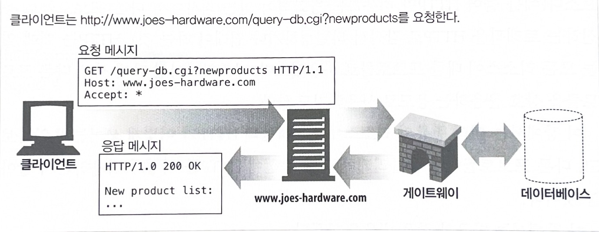

<br>

* 그림 8-2 : 웹 게이트웨이의 세 가지 예

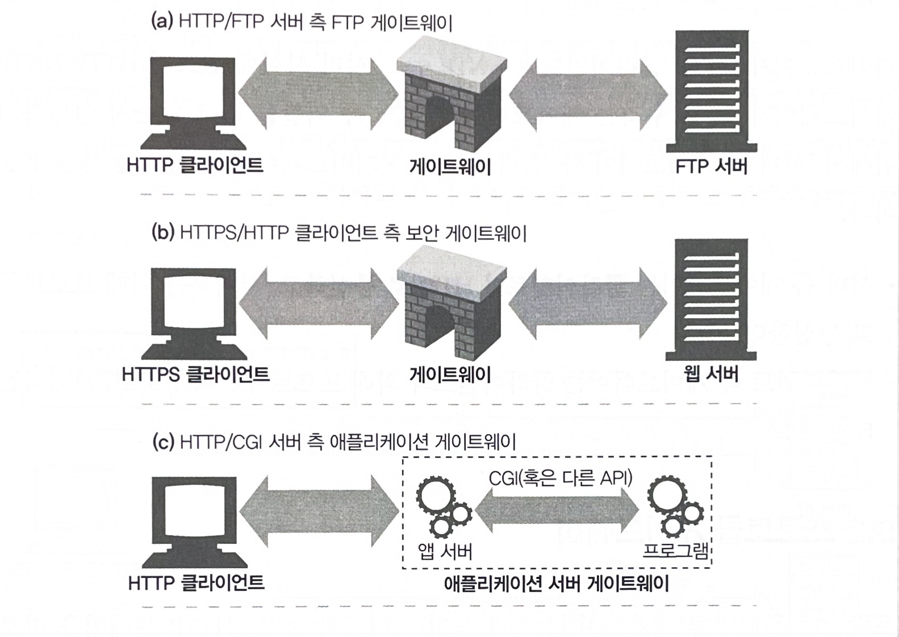


## 8.1.1 클라이언트 측 게이트웨이와 서버 측 게이트웨이

* 웹 게이트웨이는 한쪽에서는 HTTP로 통신하고 다른 한쪽에서는 HTTP가 아닌 다른 프로토콜로 통신한다.
* 게이트웨는 클라이언트, 서버측 프로토콜을 빗금(/)으로 구분해 기술한다.
    ```
    <클라이언트 프로토콜>/<서버 프로토콜>
    ```

1. 서버 측 게이트웨이
    - 클라이언트 $\rightarrow$ HTTP 통신
    - 서버 $\rightarrow$ 외래 프로토콜 통신

2. 클라이언트 측 게이트웨이
    - 클라이언트 $\rightarrow$ 외래 프로토콜 통신
    - 서버 $\rightarrow$ HTTP 통신

## 8.2 프로토콜 게이트웨이

* 게이트웨이는 HTTP 트래픽을 바로 보낼 수 있다.
    1. 브라우저에 명시적으로 게이트웨이를 설정하여 자연스럽게 트래픽이 게이트웨이를 거칠수 있다.
    2. 게이트웨이를 대리 서버(리버스 프락시)로 설정할 수 있다.

* 그림 8-3 : HTTP/FTP 게이트웨이 설정
    1. 브라우저는 gw1.joes-hardware.com을 모든 FTP URL에 대한 HTTP/FTP 게이트웨이로 설정
    2. 브라우저는 HTTP/FTP 게이트웨이인 gw1.joes-hardware.com의 8080포트에 HTTP 명령을 보낸다. 

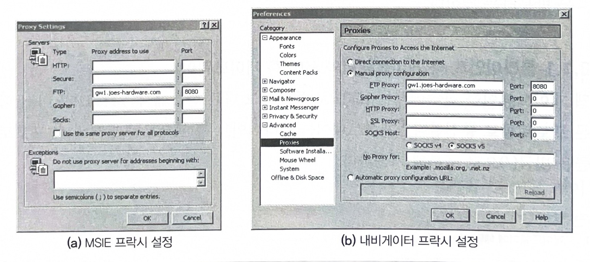

<br><br>

* 그림 8-4 : 게이트웨이 설정 후 브라우저의 동작
    1. 브라운저는 일반 HTTP 트래픽은 원 서버로 바로 보낸다.
    2. FTP URL을 포함한 요청은 gw1.joes-hardware.com 게이트웨이로 HTTP 요청을 보낸다.
    3. 게이트웨이는 클라이언트 요청을 FTP 요청으로 변환하여 처리한 뒤 클라이언트에게 그 결과를 HTTP로 전송한다.

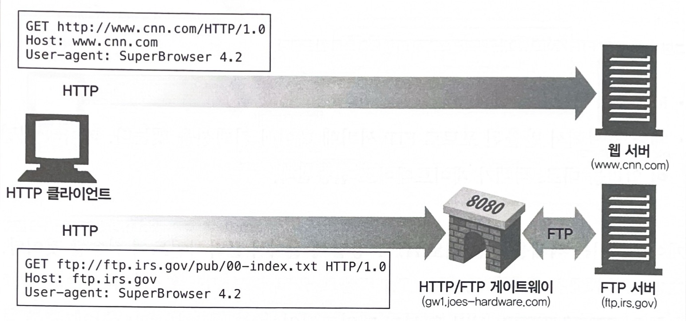

## 일반적인 게이트웨이의 종류

### 8.2.1 HTTP/*: 서버 측 웹 게이트웨이

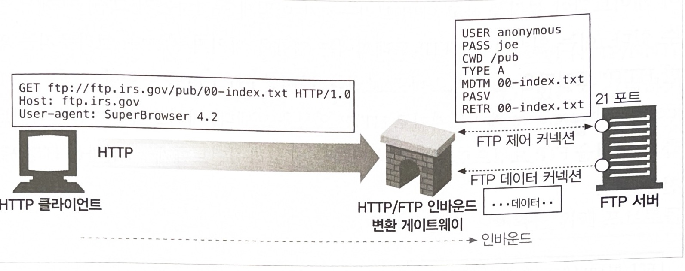

* 그림 8-5
    * 서버 측 웹 게이트웨이는 클라이언트로부터 HTTP 요청이 원 서버 영역으로 들어오는 시점에 클라이언트 측의 HTTP 요청을 외래 프로토콜로 전환한다.
    * 게이트웨이는 원 서버의 FTP 포트(21 포트)로 FTP 커넥션을 연결하고 FTP 프로토콜을 통해서 객체를 가져온다.

* 게이트웨이는 다음과 같은 일을 한다.
    - USER와 PASS 명령을 보내서 서버에 로그인한다.
    - 서버에서 적절한 디렉터리로 변경하기 위해 CWD 명령을 내린다.
    - 다운로드 형식을 ASCII로 설정한다.
    - MDTM으로 문서의 최근 수정 시간을 가져온다.
    - PASV로 서버에게 수동형 데이터 검색을 하겠다고 말한다.
    - RETR로 객체를 검색한다. (RETR : 클라이언트가 서버에게 파일 전송을 요청할 때 사용하는 FTP프로토콜에 정의되어 있는 명령어다.)
    - 제어 채널에서 반환된 포트로 FTP 서버에 데이터 커넥션을 맺는다.
    - 데이터 채널이 열리는 대로, 객체가 게이트웨이로 전송된다.
    - 게이트웨는 객체를 받는 대로 HTTP 응답에 실어서 클라이언트에 전송할 것이다.


### 8.2.2 HTTP/HTTPS: 서버 측 보안 게이트웨이

* 기업 내부의 모든 웹 요청을 암호화함으로써 개인 정보 보호와 보안을 제공하는데 게이트웨이를 사용할 수 있다.

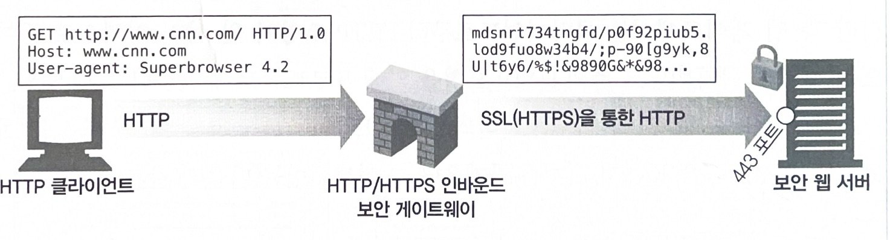

* 그림 8-6 : 내부 HTTP/HTTPS 보안 게이트웨이
    1. 클라이언트는 일반 HTTP를 사용하여 웹을 탐색
    2. 게이트웨이는 자동으로 사용자의 모든 세션을 암호화

### 8.2.3 HTTPS/HTTP: 클라이언트 측 보안 가속 게이트웨이

* 웹 서버의 앞단에 위치하고, 보이지 않는 인터셉트 게이트웨이나 리버스 프락시 역할을 한다.
* 원 서버보다 효율적으로 보안 트래픽을 복호화하는 암호화 하드웨어를 내장하여 원 서버의 부하를 줄인다.
* 게이트웨이와 원 서버 간의 암호화하지 않은 트래픽을 전송하기에, 네트워크가 안전한지 확인을 하고 사용해야 한다.

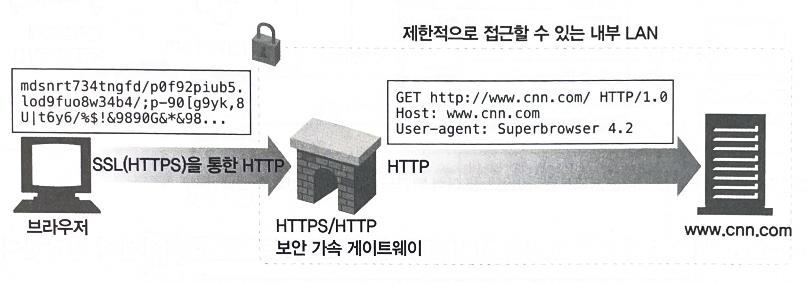

* 그림 8-7 : HTTPS/HTTP 보안 가속 게이트 웨이
    1. 보안 HTTPS 트래픽을 받아서 복호화한다.
    2. 웹 서버로 보낼 일반 HTTP 요청을 만든다.


## 8.3 리소스 게이트웨이

* 애플리케이션 서버
    - 게이트웨이의 가장 일반적인 형태
    - 목적지 서버와 게이트웨이를 한 개의 서버로 결합한다.
    - HTTP를 통해서 클라이언트와 통신한다.
    - 서버 측에 있는 애플리케이션 프로그램에 연결하는 서버 측 게이트웨이다.


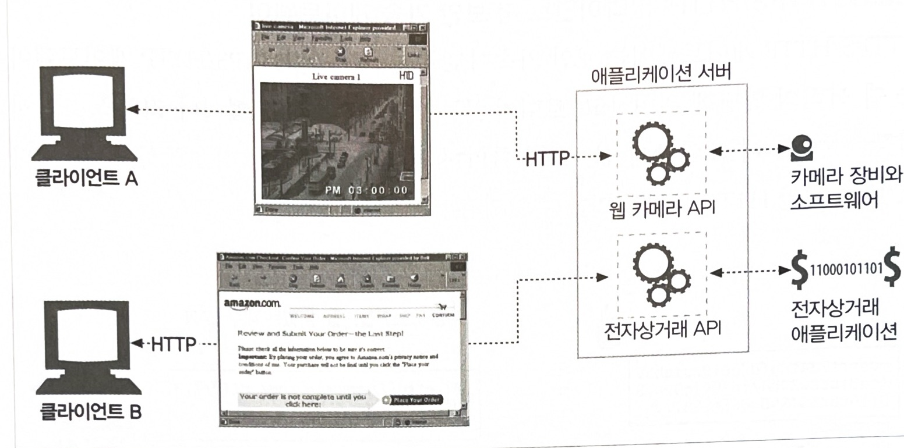

* 그림 8-8
    - 애플리케이션 서버는 HTTP 클라이언트를 여러 백엔드 애플리케이션으로 연결한다.
    1. 두 개의 클라이언트가 HTTP를 사용하여 애플리케이션 서버로 연결한다.
    2. 애플리케이션 서버는 게이트웨이의 API를 통해서 요청을 서버에서 동작하고 있는 애플리케이션에 전달한다.


>API(Application Programming Interface) : 애플리케이션 프로그래밍 인터페이스  
> * 소프트웨어 응용 프로그램이 서로 통신할 수 있도록 하는 인터페이스를 제공하는 프로그래밍 기술  
> * 두 소프트웨어 구성 요소 또는 서비스 간의 상호 작용을 정의하고, 이를 통해 두 구성 요소는 서로의 기능을 활용할 수 있다.  
> * 소프트웨어 개발의 효율성과 확장성을 높이는데 중요한 역할을 한다.

<br>

> 인터페이스(Interface)
> * 두 개 이상의 시스템 또는 구성 요소 간의 상호 작용을 정의하는 규칙 또는 약속
> * 인터페이스를 통해 두 시스템은 서로의 기능을 활용하고, 정보를 교환할 수 있다.


<br>

* CGI(Common Gateway Interface) : 공용 게이트웨이 인터페이스  
    * 웹 서버와 외부 프로그램 간의 통신을 위한 표준이다.

    * 웹사이트에서 동적인 페이지를 생성하기 위한 가장 흔한 방법

    * 특정 URL에 대한 HTTP 요청에 따라 프로그램을 실행, 프로그램의 출력 수집, HTTP 응답으로 회신하는데 웹 서버가 사용하는 표준화된 인터페이스 집합이다.

<br>

* 초기부터 오늘날까지 게이트웨이의 인터페이스를 구현하는 단순한 접근 방식은 이어지고 있다.

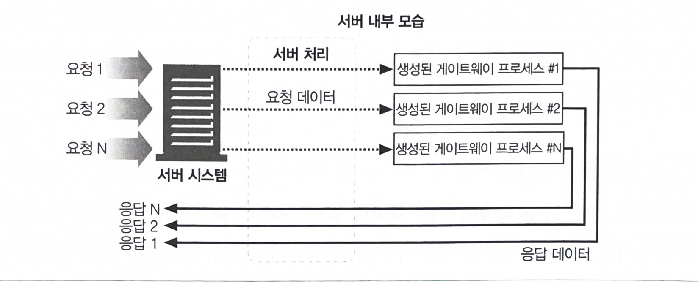

* 그림 8-9 : 서버 게이트웨이 애플리케이션의 동작 (CGI 모델의 기본 체계)
    1. 게이트웨이를 통해야 받을 수 있는 리소스 요청
    2. 서버는 헬퍼 애플리케이션을 생성하여 요청을 처리
    3. 헬퍼 애플리케이션은 필요한 데이터를 전달 받는다.
        - 전달받은 데이터 : 요청 전체, 사용자가 DB에서 실행시키려는 질의
    4. 클라이언트로 전달할 응답이나 응답 데이터를 서버에 반환

<br>

### 8.3.1 공용 게이트웨이 인터페이스

* CGI는 최초의 서버 확장이자 지금까지도 가장 널리쓰이는 서버 확장이다.

* 웹에서 동적인 HTML, 신용카드 처리, 데이터베이스 질의 등을 제공하는데 사용한다.

* CGI는 단순하므로 거의 모든 HTTP 서버를 지원한다.

* CGI 애플리케이션이 서버와 분리되면서 펄(Perl), Tel, C, 다양한 셸 언어를 포함하여 수많은 언어로 구현할 수 있게 되었다.

* 이러한 분리로 인해 성능 관련한 비용이 발생한다.
    - 부하 : 모든 CGI 요청마다 새로운 프로세스를 만든다.
    - CGI를 사용하는 서버의 성능을 제한하며 서버 장비에 부담을 준다.

* 위 문제들을 피하고자 새로운 CGI 형식인, Fast CGI가 개발되었다.

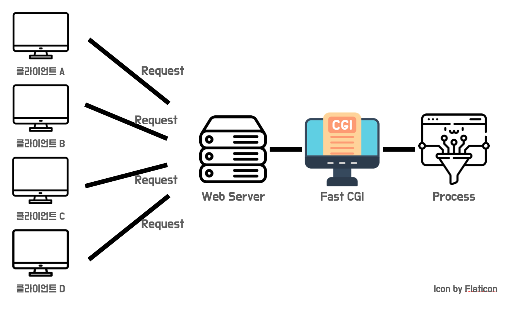

### 8.3.2 서버 확장 API

* 서버 자체의 동작을 바꾸고 싶거나 서버의 처리능력을 최고치로 끌어올리고자 할 때는 어떻게 해야 할까?
    - 서버 개발자는 웹 개발자가 자신의 모듈을 HTTP와 직접 연결할 수있는 강력한 인터페이스 서버 확장 API를 제공하였다.

* 확장 API는 프로그래머가 자신의 코드를 서버에 연결하거나 서버의 컴포넌트를 자신이 만든 것으로 교체해버릴 수 있게 하였다.

* 서버 확장 API는 다양한 방법으로 구현될 수 있다.
    - 모듈 : 서버에 추가할 수 있는 독립적인 구성요소
    - 플러그인 : 서버에 추가할 수 있는 소프트웨어 구성요소
    - 스크립트 : 서버에 추가할 수 있는 소프트웨어 코드

* 예시
    - Apache HTTP Server의 모듈
    - Nginx의 모듈
    - MySQL의 플로그인
    - Apache Tomcat의 스크립트


## 8.4 애플리케이션 인터페이스와 웹 서비스

* 애플리케이션을 연결하면서 생기는 까다로운 이슈
    - 데이터를 교환하려는 두 애플리케이션 사이에서 프로토콜 인터페이스를 맞추는 일이다.

* 인터넷 커뮤니티는 각 웹 애플리케이션이 서로 통신하는데 사용할 표준과 프로토콜 집합을 개발하였다.

* 이러한 표준은 웹서비스라 불리며, 애플리케이션이 정보를 공유하는데 사용하는 새로운 메커니즘을 의미한다.

* 웹 서비스는 SOAP을 통해 XML을 사용하여 정보를 교환한다.
    - XML (eXtensible Markup Language) : 데이터 객체를 담는 데이터를 생성하고 해석하는 방식을 제공
    - SOAP (Simple Object Access Protocol) : HTTP 메시지에 XML 데이터를 담는 방식에 대한 표준이다.


> 오늘날 웹 서비스는 REST 방식을 더 많이 쓰며, 데이터 포맷도 JSON을 주로 사용한다.


## 8.5 터널

* 웹 터널은 HTTP 프로토콜을 지원하지 않는 애플리케이션에 HTTP 애플리케이션을 사용해 접근하는 방법을 제공한다.

* 웹 터널을 사용하는 이유
    - HTTP 커넥션을 통해서 HTTP가 아닌 트래픽을 전송할 수 있다.
    - 다른 프로토콜을 HTTP 위에 올릴 수 있다.

> 웹 터널을 사용하면 웹 트래픽만을 허락하는 방화벽이 있더라도 HTTP가 아닌 트래픽을 전송할 수 있다.


### 8.5.1 CONNECT로 HTTP 터널 커넥션 맺기

* 웹 터널은 HTTP의 CONNECT 메서드를 사용하여 커넥션을 맺는다.

* CONNECT 메서드
    - 터널 게이트웨이가 임의의 목적 서버와 포트에 TCP커넥션을 맺고 클라이언트와 서버 간에 오는 데이터을 무조건 전달하기를 요청한다.

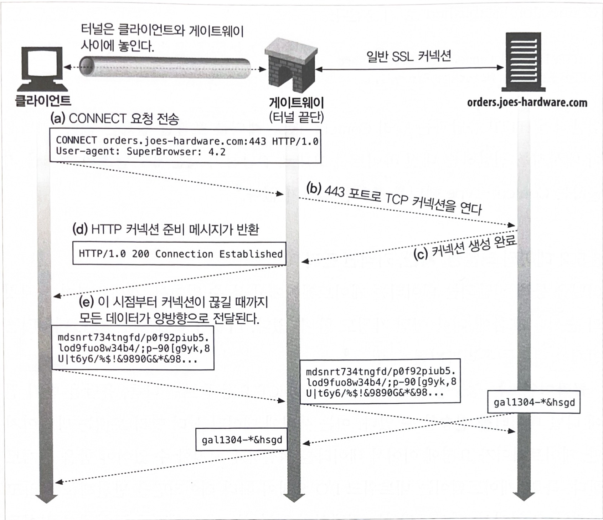

* 그림 8-10 : SSL 터널을 연결하기 위해 사용되는 CONNECT
    1. 클라이언트는 게이트웨이에 터널을 연결하려고 CONNECT 요청을 보낸다.  
       클라이언트의 CONNECT 메서드는 TCP 커넥션을 위해 게이트웨이에 터널 연결을 요청한다.
       (SSL 포트 : 443포트, 호스트명: orders.joes-hardware.com)
    2. TCP 커넥션은 (b)와(c) 와 같이 생성한다.
    3. TCP 커넥션이 맺어지면, 게이트웨이는 클라이언트에게 HTTP 200 Connection Established 응답을 전송히여 (d)와 같이 연결되었음을 알린다.
    4. 이 시점에 터널이 연결된다.
       HTTP 터널을 통해 전송된 클라이언트 위에서 맺은 TCP 커넥션으로 바로 전달될 것이다.
       서버로부터 전송된 데이터 역시 HTTP 터널을 통해서 클라이언트에게 전달될 것이다.

> SSL (Secure Sockets Layer)  
>  * 컴퓨터 네트워크를 통해 클라이언트와 서버 간의 안전한 통신을 제공하는 암호화 프로토콜이다.

#### CONNECT 요청

* CONNECT 문법은 시작줄을 제외하고는 다른 HTTP 메서드와 같다.
* 요청 URI는 호스트 명이 대신하며 콜론에 이어 포트를 기술한다.
* 호스트와 포트는 다음과 같이 기술해야 한다.
    ```
    CONNECT home.netscape.com:443 HTTP/1.0
    User-agent: Mozilla/4.0
    ```

* 시작줄 다음에는 다른 HTTP 메시지와 같이, 추가적인 HTTP 요청 헤더 필드가 있거나 없다.
* 보통 각 행은 CRLF로 끝나고, 헤더 목록의 끝은 빈줄의 CRLF로 끝난다.

#### CONNECT 응답

* 클라이언트는 요청을 전송한 다음, 게이트웨이의 응답을 기다린다.
* 일반 HTTP 메시지와 같이 200 응답 코드는 성공을 뜻한다.
* 편의상 응답에 있는 사유 구절은 'Connection Established'로 기술된다.
    ```
    HTTP/1.0 200 Connection Established
    Proxy-agent: Netscape-Proxy/1.1
    ```
* 커넥션이 메시지를 전달하는 대신 바이트를 그대로 전달하기 때문에 콘텐츠 형식을 기술하는 Content-Type 헤더를 포함할 필요는 없다.

### 8.5.2 데이터 터널링, 시간, 커넥션 관리

* 터널을 통해 전달되는 데이터는 게이트웨이에서 볼 수 없어서, 게이트웨이는 패킷의 순서나 흐름에 대한 어떤 가정도 할 수 없다.
* 터널이 연결되면, 데이터는 언제 어디로든 흘러가버릴 수 있다.
    > 터널의 양 끝단에서는 두 커넥션으로부터 언제든지 패킷을 받을 준비를 해야 하고 그 데이터를 즉시 전달해야 한다.  
    > 터널링된 프로토콜은 데이터 의존성을 포함하고 있거나, 터널의 한쪽에서 입력받은 데이터를 무시할 수 있기 떄문이다.  
    > 터널의 한쪽 끝단에서 데이터를 소비하지 않으면 터널의 다른 끝단의 데이터 생산자는 행에 걸리게 될 것이고, 결국 교착상태가 일어날 수 있다.

* 클라이언트는 CONNECT 요청을 보낸 다음, 응답을 받기 전에 터널 데이터를 전송할 수 있다.  
  이는 서버에 데이터를 더 빨리 보내는 방법이지만, 게이트웨이가 요청에 이어서 데이터를 적절하게 처리할 수 있어야 함을 전제로 한다.

* 게이트웨이는 네트워크 I/O 요청이 헤더 데이터만을 반환해줄 거라고 가정할 수 없어서, 게이트웨이는 커넥션이 맺어지는 대로 헤더를 포함해서 읽어들인 모든 데이터를 서버에 전송해야 한다.

* 요청 후 터널을 통해 데이터를 전송한 클라이언트 인증요구(authentication challenge)나 200 외의 응답이 왔을 때 데이터를 다시 보낼 준비가 되어 있어야 한다.

* 터널의 끝단 어느 부분이든 커넥션이 끊어지면, 그 끊어진 곳으로부터 온 데이터는 반대편으로 전달된다.  
  그 다음 커넥션이 끊어졌던 터널의 끝단 반대편의 커넥션도 프락시에 의해서 끊어질 것이다.  
  커넥션이 끊긴 한쪽에 아직 전송하지 않은 데이터는 버려진다.


### 8.5.3 SSL 터널링

* 웹 터널은 원래 방화벽을 통해서 암호화된 SSL 트래픽을 전달하려고 개발되었다.

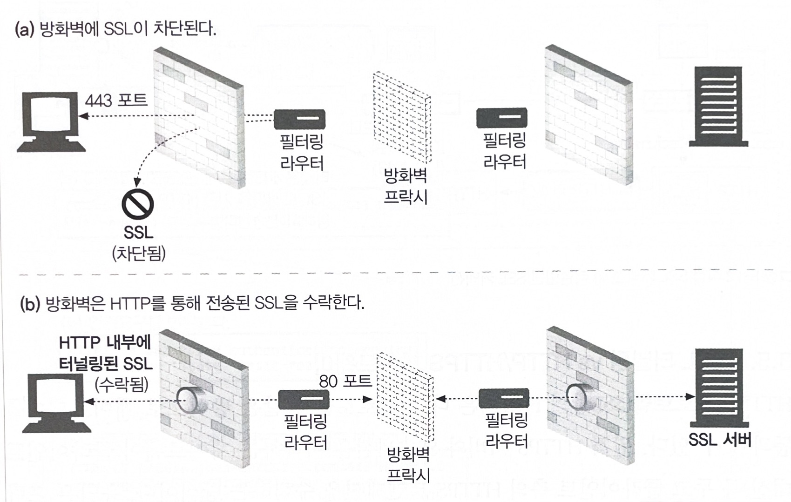

* 그림 8-11 : 터널은 HTTP가 아닌 트래픽을 HTTP 커넥션으로 전송한다.
    * 많은 회사들은 더 강력한 보안을 위해 모든 트래픽이 패킷을 필터링하는 라우터와 프락시를 지나도록 하였다.  
      하지만 SSL 같이 암호화된 프로토콜은 정보가 암호화되어 낡은 방식의 프락시에는 처리 되지 않는다.

    * 터널을 사용하면 SSL 트래픽을 HTTP 커넥션으로 전송하여 80포트의 HTTP만을 허용하는 방화벽을 통과시킬 수 있다.

<br>

* SSL 트래픽이 기존 프락시 방화벽을 통과할 수 있도록 HTTP 터널링 기능이 추가 되었다.  
  이 터널링 기능은 HTTP 메시지에 암호화된 날 데이터를 담고 일반 HTTP 체널을 통해 데이터를 전송한다.

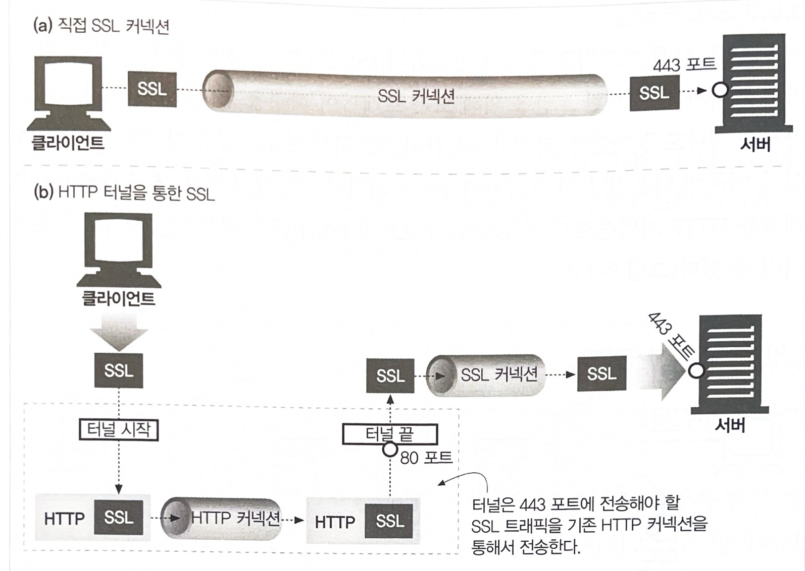

* 그림 8-12 : 직접 SSL 커넥션 vs 터널링된 SSL 커넥션
    1. 보안 웹 서버로 SSL 트래픽이 바로 전송된다. (SSL 포트인 43)
    2. SSL 트래픽은 일반 SSL 커넥션을 통해 전송되기 전까지는 HTTP 메시지에 담겨 전송된다.(HTTP 포트인 80)

* 터널은 HTTP가 아닌 트래픽이 포트를 제한하는 방화벽을 통과할 수 있게 해준다.  
  이는 보안 SSL 트래픽이 방화벽을 통과하는 데 유용하게 사용될 수 있다.  

* 터널은 악의적인 트래픽이 사내로 유입되는 경로가 될 수 있다.


### 8.5.4 SSL 터널링 vs HTTP/HTTPS 게이트웨이

* HTTPS 프로토콜(SSL 상의 HTML) 은 다른 프로토콜과 같은 방식으로 게이트웨이를 통과할 수 있다.
    - 원격 HTTPS 서버와 SSL 세션을 시작하는 게이트웨이(클라이언트 대신)를 두고 클라이언트 측의 HTTPS 트랜잭션을 수행하는 방식이다.
    - 응답은 프락시가 받아서 복호화하고 난 후에, HTTP(보안이 좋지 않은)를 통해 클라이언트로 전송한다.

* 위 방식의 단점
    - 클라이언트 - 게이트웨이 사이에는 보안이 적용되지 않은 일반 HTTP 커넥션이 맺어져 있다.
    - 프락시가 인증을 담당하고 있기 때문에, 클라이언트는 원격 서버에 SSL 클라이언트 인증(X509 인증서 기반의 인증)을 할 수 없다.
    - 게이트웨이는 SSL을 완벽히 지원해야 한다.

> SSL 터널링을 사용하면, 프락시에 SSL 구현할 필요가 없다.  
>   * SSL 세션은 클라이언트가 생성한 요청과 목적지(보안이 적용된) 웹 서버 간에 생성된다.
>   * 프락시 서버는 트랜잭션의 보안에는 관여하지 않고 암호화된 데이터를 그대로 터널링할 뿐이다.

### 8.5.5 터널 인증

* HTTP의 다른 기능들은 터널과 함께 적절히 사용할 수 있다.
* 특히 프락시 인증 기능은, 클라이언트가 터너을 사용할 수 있는 권한을 검사하는 용도로 터널에서 사용할 수 있다.

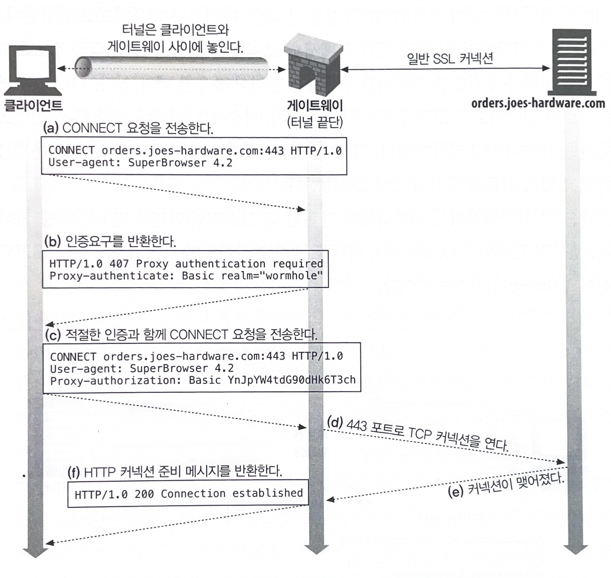

<br>

### 8.5.6 터널 보안에 대한 고려사항들

* 터널 게이트웨이는 통신하고 있는 프로토콜이 터널을 올바른 용도로 사용하고 있는지 검증할 방법이 없다.

* 터널의 오용을 최소화하기 위해서, 게이트웨이는 HTTPS 전용 포트인 443 같이 잘 알려진 특정 포트만을 터널링할 수 있게 허용해야 한다.


## 8.6 릴레이

* HTTP 릴레이는 HTTP 명세를 완전히 준수하지 않는 간단한 HTTP 프락시다.

* 릴레이는 커넥션을 맺기 위한 HTTP 통신을 한 다음, 바이트를 맹목적으로 전달한다.
    - 단순 필터링, 진단, 콘텐츠 변환에 사용

* 잠재적으로 심각한 상호 운용 문제를 가지고 있기 때문에 주의해서 배포해야 한다.

* 일반적인 문제로 맹목적 릴레이가 Connection 헤더를 제대로 처리하지 못해서 keep-alive 커넥션이 행(hang)에 걸리는 것이다.

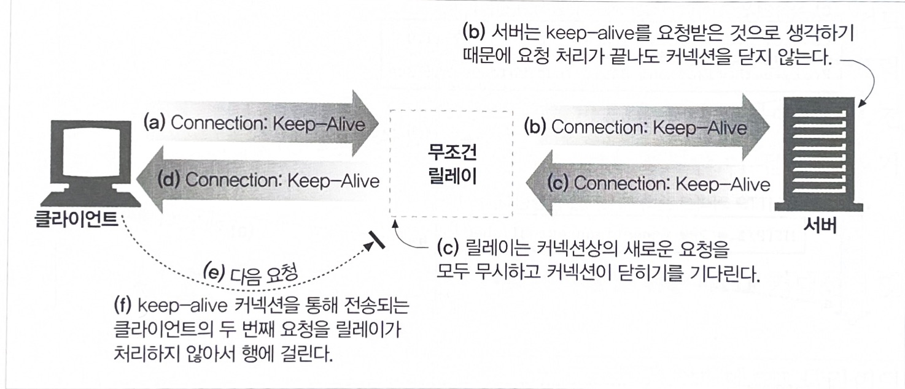

<br>

* 만약 특정 목적을 위해서 단순한 HTTP 릴레이를 구축한다면, 어떻게 사용할지 신중히 고민해야 한다.
* 여러 문제를 예방하기 위해서, HTTP를 제대로 준수하는 프락시를 사용하는게 좋다.


