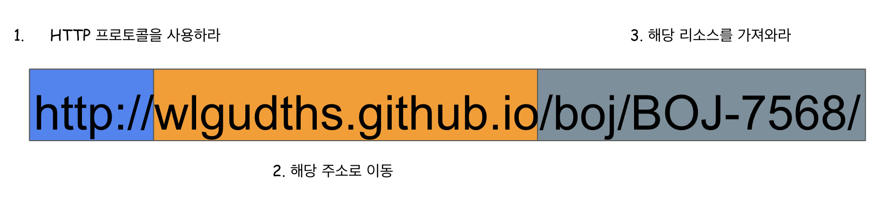

# 1.1 HTTP: 인터넷의 멀티미디어 배달부

> HTTP : HyperText Transfer Protocol  
* 프로토콜(Protocol) : 컴퓨터나 원거리 통신 장비 사이에서 메세지를 주고 받는 양식과 규칙의 체계이다. (약속, 규약)

* 우리가 흔히 이용하는 웹은 HTTP라는 프로토콜(약속, 규약)을 사용한 통신으로 이루어져 있다.

### HTTP의 배경
> 초기 HTTP가 등장하게 된 배경은 세계 곳곳에 있는 연구자들의 지식을 공유를 지원하기 위해서 제안되었다.

# 1.2 웹 클라이언트와 서버

### 웹 클라이언트
> 서버에게 HTTP 요청(Request)을 보내고 서버에서 제공하는 서비스를 사용하는 고객, 소비자이다.  
* 크롬, 파이어폭스, 인터넷 익스플로러 등이 클라이언트에 해당한다.

### 웹 서버
> 클라이언트로부터 요청받은 데이터를 HTTP 응답(Response)으로 돌려주는 일을 한다.

# 1.3 리소스

> 웹 서버는 웹 리소스를 관리하고 제공한다.

### 리소스(Resource)란?
> HTTP 요청(Request) 대상을 __리소스__ 라고 하며 리소스는 문서, 사진 등으로 어떤 것이든 될 수 있다.

## 1.3.1 미디어 타입

### MIME 타입 (Multipurpose Internet Mail Extensions)
> 인터넷은 수천 가지 데이터 타입을 다루기 때문에, HTTP는 웹에서 전송되는 객체 각각에 MIME 타입이라는 데이터 포맷 라벨을 붙인다.  
웹서버는 모든 HTTP 객체 데이터에 MIME 타입을 붙이고, 클라이언트는 서버로부터 객체를 돌려받을 때, 어떠한 객체인지 MIME 타입을 통해 확인한다.

#### MIME 타입의 구조
~~~
type/subtype
~~~
> 주 타입(primary object)/부 타입(specific subtype)으로 이루어진 문자열 라벨이다.

#### MIME 타입 예시
* text/html : HTML로 작정된 텍스트 문서
* image/jpeg : JPEG 이미지
* image/gif : GIF 이미지
* video/quicktime : 애플 퀵타임 동영상

## 1.3.2 URI

### URI (Uniform Resource Identifier)
> 통합 자원 식별자로 인터넷의 우편물 주소같이, 정보 리소스를 고유하게 식별하고 위치를 지정할 수 있다.

* 오늘날 대부분의 URI 는 URL이다.

#### URI 예시

## 1.3.3 URL (Unifiorm Resource Locator)
> 통합 자원 지시자는 리소스 식별자의 가장 흔한 형태이며, 특정 서버의 한 리소스에 대한 구체적인 위치를 서술한다.

### URL의 포맷
1. 스킴(scheme)
    - 리소스에 접근하기 위해 사용되는 프로토콜을 서술
    - 보통 HTTP 프로토콜 (http://)
2. 인터넷 주소
    - www.wlgudths.github.io
    - www.joes-hardware.com
3. 웹 리소스
    - /boj/BOJ-7568/
    - /specials/saw-blade.gif

# 1.4 트랜잭션
> HTTP 트랜잭션은 __요청 명령__ 과 __응답 결과__ 로 구성되어있다.

## 1.4.1 메서드

#### 메서드?
> 여러 종류의 요청 명령이다. 즉, 서버에게 어떤 동작이 취해져야 하는지 말해준다.
* 웹페이지 가져오기
* 게이트웨이 프로그램 실행하기
* 파일 삭제하기

#### 흔히 쓰이는 HTTP 메서드
* GET : 서버에서 클라이언트로 지정한 리소스를 보내라.
* PUT : 클라이언트에서 서버로 보낸 데이터를 지정한 이름의 리소스로 지정하라.
* DELETE : 지정한 리소스를 서버에서 삭제하라.
* POST : 클라이언트 데이터를 서버 게이트웨이 애플리케이션으로 보내라.
* HEAD : 지정한 리소스에 대한 응답에서, HTTP 헤더 부분만 보내라.

## 1.4.2 상태 코드

#### 상태코드
> 클라이언트에게 요청이 성공했는지, 추가 조치가 필요한지 알려주는 세자리 숫자이다.
* 클라이언트에게 요청에 대한 반환 메세지라고 생각하면 좋다.

#### 흔히 쓰이는 상태 코드
* 200 : 좋다. 문서가 바르게 반환되었다.
* 302 : 다시 보내라. 다른 곳에 가서 리소스를 가져가라.
* 404 : 없음. 리소스를 찾을 수 없다.

## 1.4.3 웹페이지는 여러 객체로 이루어질 수 있다.
> 어플리케이션은 보통 하나의 작업을 수행하기 위해 여러 HTTP 트랜잭션을 수행한다.  

* 웹 브라우저는 시각적으로 풍부한 웹페이지를 가져올 때 대량의 HTTP 트랜잭션을 수행한다. HTML '뼈대'를 한 번의 트랜잭션으로 가져온뒤, 첨부된 이미지, 자바 애플릿 등을 가져와 추가로 HTTP 트랜잭션들을 수행한다.

* 웹페이지는 보통 하나의 리소스가 아닌 리소스의 모음으로 이루어져 있다.

# 1.5 메세지

> 단순한 줄 단위의 문자열

### 요청 메세지
* 웹 클라이언트 $\rightarrow$ 웹 서버 : 요청 메세지  
~~~http
GET / test/hi-there.txt HTTP/1.0 # 시작줄
--------------------------------
Accept: text/*                   # 헤더
Accept-Language: en,fr

~~~

### 응답 메세지
* 웹 서버 $\rightarrow$ 웹 클라이언트 : 응답 메세지
~~~http
HTTP/1.0 200 OK                  # 시작줄
--------------------------------
Content-type: text/plain         # 헤더
Content-length: 19
--------------------------------
Hi! I'm a message!               # 본문
~~~

### 시작줄
* 요청 : 무엇을 해야하는지를 나타낸다.
* 응답 : 무슨일이 일어났는지를 나타낸다.

### 헤더
* 시작줄 다음에 0개 이상의 헤더 필드가 
* 쌍점(:)으로 구분되어 있는 하나의 이름과 하나의 값으로 구성
* 빈줄로 끝난다.

### 본문
* 어떤 종류의 데이터든 들어갈 수 있는 본문이 필요에 따라 올 수 있다.
* 요청의 본문은 웹서버로 데이터를 실어 보내며, 응답의 본문은 클라이언트로 데이터를 반환한다.

# 1.6 TCP 커넥션
> TCP : Transmission Control Protocol, 전송 제어 프로토콜

## 1.6.1 TCP/IP
> TCP와 IP가 층을 이루는, 패킷 교환 네트워크 프로토콜의 집합이다.

* 어떤 종류의 컴퓨터나 네트워크든 서로 신뢰성 있는 의사소통을 하게 한다.

### TCP/IP의 계층(Layer)

#### 애플리케이션 계층 (L4 응용 계층)
> 유저에게 제공되는 애플리케이션에서 사용하는 통신의 움직임을 결정  
주로 응용 프로그램(Application)들끼리 데이터를 교환하기 위한 계층
- 데이터 단위 : 데이터(Data) / 메세지 (Message)
- 예시 : 파일 전송, 이메일, FTP, HTTP, DNS 등

#### 트랜스포트 계층 (L3 전송 계층)
> 애플리케이션 계층에 네트워크로 접속되어 있는 2대의 컴퓨터 사이의 데이터 흐름을 제공합니다. 통신 노드간의 데이터 전송 및 흐름에 있어 신뢰성을 보장한다.
- 데이터 단위 : 세그먼트(Segment)
- 전송 주소: Port
- 예시 : TCP, UDP 등
#### 네트워크 계층 (L2 인터넷 계층)
> 네트워크 상에서 패킷의 이동을 다룬다. 어떠한 경로를 거쳐 상대의 컴퓨터까지 패킷을 보낼지를 결정한다.
- 패킷이란 전송하는 데이터의 최소 단위이다.
- 데이터 단위 : 패킷(Packet)
- 전송 주소 : IP
- 예시: IP,ARP,ICMP,RARP

#### 링크 계층 (L1 네트워크 연결 계층)
> 물리적인 데이터의 전송을 담당하는 계층으로, 하드웨어적인 면을 다룬다. 물리적인 주소인 MAC을 참조해 장비간 전송을 하고, 기본적인 에러 검출과 패킷의 Frame화를 담당
- 데이터 단위: 프레임(Frame)
- 전송 주소: MAC
- 예시: MAC, LAN, Ethernet

 

# 1.8 웹의 구성요소

## 1.8.1 프락시
> 클라이언트와 서버 사이에 위치한 HTTP 중재자
* 클라이언트로부터 리퀘스트를 서버에 전송하고, 서버로부터 리스폰스를 클러이언트에 전송한다.
* 주로 보안을 위해 사용하며, 모든 웹 트래픽 흐름 속에서 신뢰할 만한 중개자 역할을 한다.

## 1.8.2 캐시
> 많이 찾는 웹페이즈를 클라이언트 가까이에 보관하는 HTTP 창고
* 자주 찾는 것의 사본을 저장해 두는, 특별한 종류의 HTTP 프락시 서버다.
* 클라이언트는 멀리 떨어진 웹 서버보다 근처의 캐시에서 훨씬 더 빨리 다운 받을 수 있다.

## 1.8.3 게이트웨이
> 다른 애플리케이션과 연결된 특별한 웹 서버
* 주로 HTTP 트래픽을 다른 프로토콜로 변환하기 위해 사용
* 클라이언트로부터 수신한 리퀘스트를 리소스를 보유한 서버인 것처럼 수신

## 1.8.4 터널
> 단순히 HTTP 통신을 전달하기만 하는 특별한 트락시
* 두 커넥션 사이에서 날(raw) 데이터를 열어보지 않고 그대로 전달해주는 HTTP 어플리케이션
* 요구에 따라서 다른 서버와의 통신 경로를 확립
* 클라이언트는 SSL 같은 암호화 통신을 통해 서버와 안전하게 통신을 하기 위해 사용한다.

## 1.8.5 에이전트
> 자동화된 HTTP 요청을 만드는 준지능적(semi-intelligent) 웹클라이언트
* 사용자를 위해 HTTP 요청을 만들어주는 클라이언트 프로그램
* 웹 요청을 만드는 애플리케이션은 HTTP 에이전트이다.
* 예시: 스파이더, 웹로봇

# 참고문헌
* HTTP 완벽가이드
* 그림으로 배우는 Http Network Basic

# 참조
<https://velog.io/@seosu2000/Client-Server-%EB%9E%80-%EB%AC%B4%EC%97%87%EC%9D%B8%EA%B0%80>  
<https://developer.mozilla.org/ko/docs/Web/HTTP>  
<https://velog.io/@dyunge_100/Network-TCPIP-4%EA%B3%84%EC%B8%B5%EC%97%90-%EB%8C%80%ED%95%98%EC%97%AC>  
<https://velog.io/@jehjong/%EA%B0%9C%EB%B0%9C%EC%9E%90-%EC%9D%B8%ED%84%B0%EB%B7%B0-Cookie-Session>  
<http://www.ktword.co.kr/>  
<https://developer.mozilla.org/ko/docs/Web/HTTP/Basics_of_HTTP/MIME_Types>  
<https://velog.io/@seul06/%ED%81%B4%EB%9D%BC%EC%9D%B4%EC%96%B8%ED%8A%B8%EC%99%80-%EC%84%9C%EB%B2%84>

