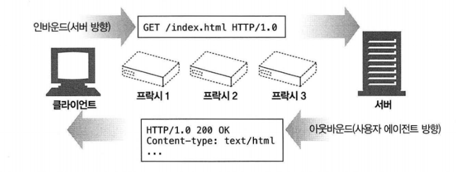
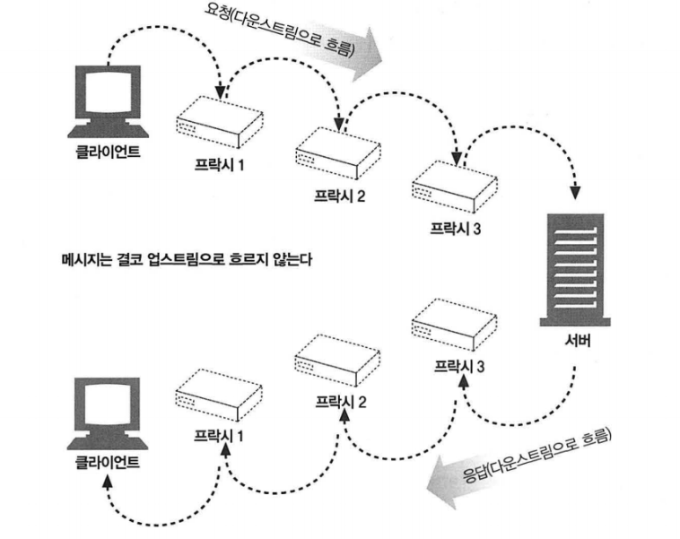
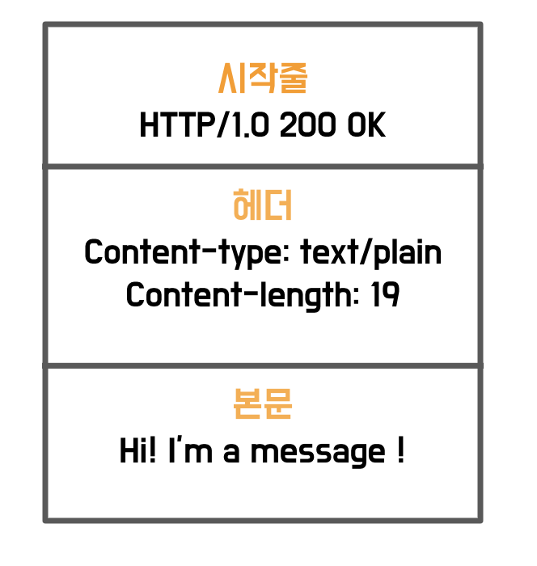
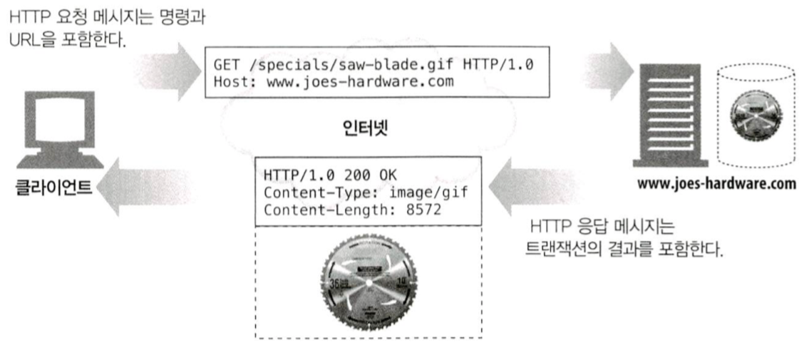
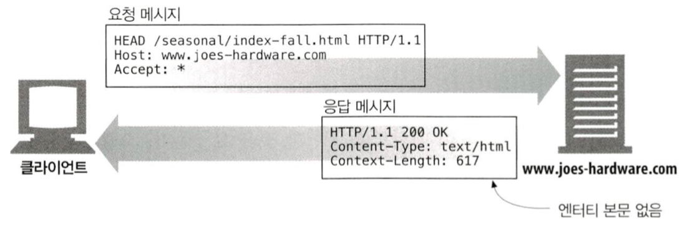
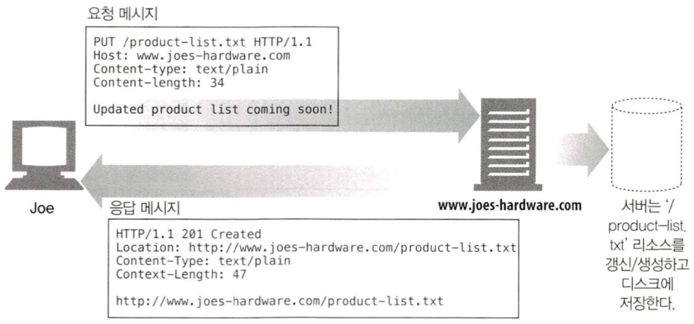
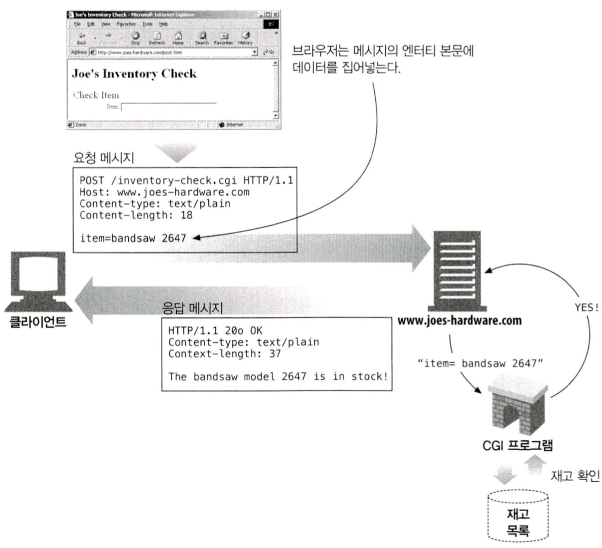
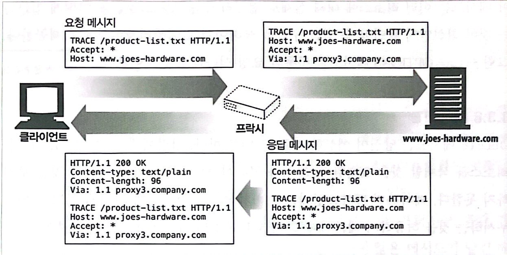
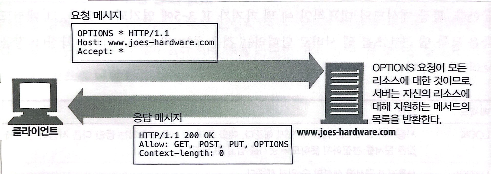
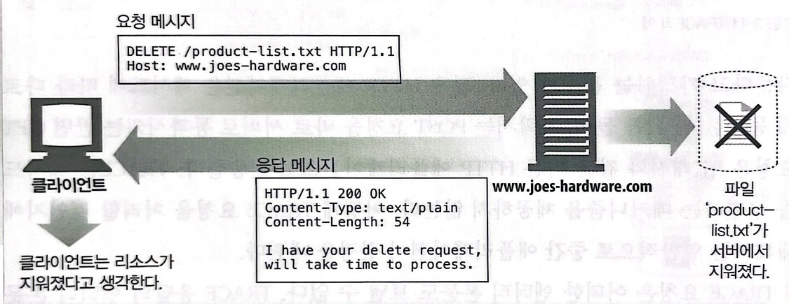

# HTTP 메세지

> HTTP가 인터넷의 배달원이면, HTTP 메세지는 무언가를 담아 보내는 소포와 같다.

## 메세지의 흐름

> 메세지는 클라이언트, 서버, 프록시 사이를 흐른다.  

* 트랜잭션의 방향을 표현하기 위해 사용 : 인바운드, 아웃바운드
  * 인바운드 : 클라이언트 $\rightarrow$ 서버
  * 아웃바운드 : 서버 $\rightarrow$ 클라이언트 (사용자 에이전트)  
 

 

* 메시지는 요청,응답 관계없이 모두 다운스트림으로 흐른다.

 

## 메세지의 구조

> HTTP 메세지는 단순한, 데이터의 구조화된 블럭이다.

   
 

1. 시작줄 : 어떤 메세지인지 서술
2. 헤더 : 속성
3. 본문 : 데이터 (본문은 없을 수도 있다)

* 시작줄과 헤더는 줄 단위로 분리된 아스키 문자열이다.
* 개행문자
  * CR(Carriage Return) : ASCII 13, 16진수 0x0d
  * LF(line feed) : ASCII 10, 16진수 0x0a

## 메세지 문법

> 모든 HTTP 메시지는 요청 메세지 or 응답 메시지로 분류

* 요청 메시지 : 웹 서버에 어떤 동작을 요구한다.

* 요청 메시지의 형식
> <메서드> <요청 URL> <버전>  
> <헤더>  
>  
> <엔터티 본문>

* 응답 메시지 : 요청의 결과를 클라이언트에게 돌려준다.

* 응답 메시지의 형식
> <버전> <상태 코드> <사유 구절>  
> <헤더>  
>  
> <엔터티 본문>

 

* GIF image를 가져오기 위한 요청과 응답 메시지 예시

 

### 메서드
> 클라이언트 측에서 서버가 리소스에 대해 수행해주길 바라는 동작이다.
 
요청의 시작줄로, 서버에게 무엇을 해야 하는지 말해준다.  

|메서드|설명|메시지 본문이 있는가?
:---:|:---:|:---:
GET|서버에서 어떤 문서를 가져온다.| X
HEAD|서버에서 어떤 문서에 대해 헤더만 가져온다.|X
POST|서버가 처리해야 할 데이터를 보낸다.|O
PUT|서버에 요청 메시지의 본문을 저장한다.|O
TRACE|메시지가 프록시를 거쳐 서버에 도달하는 과정을 추적한다.|X
OPTIONS|서버가 어떤 메서드를 수행할 수 있는지 확인한다.|X
DELETE|서버에서 문서를 제거한다|X
 

#### 안전한 메서드(Safe Method)
> HTTP는 안전한 메서드라 불리는 메서드의 집합을 정의한다.

* HTTP 요청의 결과로 서버에 어떤 작용도 없음을 의미
  * GET, HEAD
 

#### GET
* 가장 흔히 쓰이는 메서드
* 주로 서버에게 리소스를 달라고 요청하기 위해 쓰인다.
 
 

#### HEAD
* GET 처럼 행동하지만, 서버는 응답으로 헤더만을 돌려준다.
* 클라이언트가 리소스를 실제로 가져올 필요 없이 헤더만을 조사할 수 있도록 해준다.  

  * 리소스를 가져오지 않고도 그에 대해 무엇인가(타입 등)를 알아낼 수 있다.
  * 응답의 상태 코드를 통해, 개체가 존재하는지 확인할 수 있다.
  * 헤더를 확인하여 리소스가 변경되었는지 검사할 수 있다.

 
 

> 서버 개발자들은 반드시 반환되는 헤더가 GET으로 얻는 것과 정확히 일치함을 보장해야 한다.  
HTTP/1.1 준수를 위해서는 HEAD 메서드가 반드시 구현되어 있어야한다.

#### PUT
* GET 메서드는 서버로부터 문서를 읽지만, PUT메서드는 서버에 문서를 쓴다.
* 서버가 요청의 본문을 가지고 요청 URL의 이름대로 새 문서를 만들거나, 이미 URL이 존재한다면 본문을 사용해서 교체하는 것이다.

 
 

> PUT은 콘텐츠를 변경할 수 있게 해주기 때문에, 웹 서버가 PUT을 수행하기 전에 사용자에게 비밀번호를 입력해서 로그인을 하도록 요구할 것이다.

#### POST
* 서버에 입력 데이터를 전송하기 위해 설계되었다.
* HTML 폼을 지원하기 위해 흔히 사용된다.
  > 채워진 폼에 담긴 데이터는 서버로 전송되며, 서버는 이를 모아서 필요로 하는 곳(데이터를 처리할 서버 게이트웨이 프로그램)에 보낸다.  

 
 

#### TRACE
* 클라이언트에게 자신의 요청이 서버에 도달했을 때 어떻게 보이게 되는지 알려준다.
* 주로 진단을 위해 사용된다.

 
 

#### OPTIONS

* 서버에게 여러 가지 종류의 지원 범위에 대해 물어본다.
* 서버에게 특정 리소스에 대해 어떤 메서드가 지원되는지 물어볼 수 있다.
 

 
 

#### DELETE

* 서버에게 요청 URL로 지정한 리소스를 삭제할 것을 요청한다.
 

> 클라이언트는 삭제가 수행되는 것을 보장하지 못한다.  
HTTP 명세는 서버가 클라이언트에게 알리지 않고 요청을 무시하는 것을 허용하기 때문이다.

#### 확장 메서드

* HTTP/1.1 명세에 정의되지 않은 메서드다.
* 서버가 관리하는 리소스에 대한 능력을 확장하는 수단을 제공

 

* 확장 메서드 예시  

|메서드|설명
:---:|:---:
LOCK|사용자가 리소스를 잠글 수 있게 해준다.
MKCOL| 사용자가 문서를 생성할 수 있게 해준다.
COPY| 서버에 있는 리소스를 복사한다.
MOVE| 서버에 있는 리소스를 옮긴다.

### 상태 코드와 사유 구절

* 상태 코드(Status Code)

> 요청 중에 무슨 일이 일어났는지 설명하는 세 자리의 숫자이다.
 
각 코드의 첫 번째 자릿수는 상태의 일반적인 분류('성공', '에러')를 나타낸다.

전체 범위|정의된 범위|분류
:---:|:---:|:---:
100-199|100-101|정보
200-299|200-206|성공
300-399|300-305|리다이렉션
400-499|400-415|클라이언트 에러
500-599|500-505|서버 에러

* 사유 구절 (Reason-Phrase)  
> 응답 시작줄의 마지막 구성요소이며, 숫자로된 상태 코드의 의미를 사람이 이해할 수 있게 설명해주는 짧은 문구이다.
 
상태 코드 이후부터 줄바꿈 문자열까지가 사유 구절이다.

* 'HTTP/1.0 200 OK'라는 줄에서, 사유구절은 OK이다.  

#### 100 - 199 : 정보성 상태 코드

|상태 코드|사유 구절|의미
---|---|---
100|Continue|요청의 시작 부분 일부가 받아들여졌으며, 클라이언트는 나머지를 계속 이어서 보내야 함을 의미한다. 이것을 보낸 후, 서버는 반드시 요청을 받아 응답해야한다.
101|Switching Protocols|클라이언트가 Upgrade 헤더에 나열한 것 중 하나로 서버가 프로토콜을 바꾸었음을 의미한다.

#### 200 - 299 : 성공 상태 코드

> 클라이언트가 요청을 보내면, 그 요청은 대개 성공한다. 서버는 대응하는 성공을 의미하는 상태 코드의 배열을 갖고 있으며, 각각 다른 종류의 요청에 대응한다.  

|상태 코드|사유 구절|의미
---|---|---
200|OK|요청은 정상이고, 엔터티 본문은 요청된 리소스를 포함하고 있다.
201|Created|서버 개체를 생성하라는 요청을 위한 것(PUT)
202|Accepted|요청은 받아들여졌으나 서버는 아직 그에 대한 어떤 동작도 수행하지 않았다. 단지 요청이 받아들이기에 적법해 보인다는 의미일 뿐이다.
203|Non-Authoritative Information|엔터티 헤더에 들어있는 정보가 원래 서버가 아닌 리소스의 사본에서 왔다.
204|No content|응답 메시지는 헤더와 상태줄을 포함하지만 엔터티 본문은 포함하지 않는다. 주로 웹브라우저를 새 문서로 이동시키지 않고 생신하고자 할 때 사용한다.
205|Reset Content|주로 브라우저를 위해 사용되는 또 하나의 코드, 브라우저에게 현재 페이지에 있는 HTML 폼에 채워진 모든 값을 비우라고 말한다.
206|Partial Content|부분 혹은 범위 요청이 성공했다.

#### 300 - 399 : 리다이렉션 상태 코드
> 클라이언트가 관심있어 하는 리소스에 대해 다른 위치를 사용하라고 말해주거나 그 리소스 내용 대신 다른 대안 응답을 제공한다.
 
만약 리소스가 옮겨졌다면, 클라이언트에게 리소스가 옮겨졌으며 어디서 찾을 수 있는지 알려주기 위해 리다이렉션 상태 코드와 Location 헤더를 보낼 수 있다.

|상태 코드|사유 구절|의미
---|---|---
300|Multiple Choices|클라이언트가 동시에 여러 리소스를 가르키는 URL을 요청한 경우, 그 리소스의 목록과 함께 반환된다.
301|Moved Permanently|요청한 URL이 옮겨졌을 때 사용한다.
302|Found|301 상태 코드와 같다. 그러나 클라이언트는 Location 헤더로 주어진 URL을 리소스를 임시로 가리키기 위한 목적으로 사용해야 한다.
303|See Other|클라이언트에게 리소스를 다른 URL에서 가져와야 한다고 말해주고자 할 때 쓰인다.
304|Not Modified|클라이언트는 헤더를 이용해 조건부 요청을 만들 수 있다.
305|Use Proxy|리소스가 반드시 프락시를 통해서 접근되어야 함을 나타내기 위해 사용한다.
306|(사용되지 않음)|현재는 사용되지 않는다.
307|Temporary Redirect|301 상태 코드와 비슷하다.
#### 400 - 499 : 클라이언트 에러 상태 코드
> 가끔 클라이언트는 서버가 다룰 수 없는 무엇인가를 보낸다. 잘못 구성된 요청 메시지 같은 것이 있을 수 있으며, 가장 흔한 것은 존재하지 않는 URL에 대한 요청이다.

|상태 코드|사유 구절|의미
---|---|---
400|Bad Request|클라이언트가 잘못된 요청을 보냈다고 말해준다.
401|Unauthorized|리소스를 얻기 전에 클라이언트에게 스스로 인증하라고 요구하는 내용의 응답을 적절한 헤더와 함께 반환한다.
402|Payment Required|현재 이 상태 코드는 쓰이지 않지만, 미래에 사용될 가능성을 위해 준비해두었다.
403|Forbidden|요청이 서버에 의해 거부되었음을 알려주기 위해 사용한다.
404|Not Found|서버가 요청한 URL을 찾을 수 없음을 알려주기 위해 사용한다.
405|Method Not Allowed|요청한 URL에 대해, 지원하지 않는 메서드로 요청받았을 때 사용한다.
406|Not Acceptable|주어진 URL에 대한 리소스 중 클라이언트가 받아들이 수 있는 것이 없는 경우 사용한다.
407|Proxy Authentication Required|401 상태 코드와 같으나, 리소스에 대해 인증을 요구하는 프락시 서버를 위해 사용한다.
408|Request Timeout|클라이언트의 요청을 완수하기에 시간이 너무 많이 걸리는 경우, 서버는 이 상태 코드로 응답하고 연결을 끊을 수 있다.
409|Conflict|요청이 리소스에 대해 일으킬 수 있는 몇몇 충동을 지칭하기 위해 사용한다.
410|Gone|404와 비슷하나, 서버가 한때 그 리소스를 갖고 있었다는 점이 다르다.
411|Length Required|서버가 요청 메시지에 Content-Length 헤더가 있을 것을 요구할 때 사용한다.
412|Pricondition Failed|클라이언트가 조건부 요청을 했는데 그중 하나가 실패했을 때 사용한다.
413|Request Entity Too Large|서버가 처리할 수 있는 혹은 처리하고자 하는 한계를 넘은 크기의 요청을 클라이언트가 보냈을 때 사용한다.
414|Request URI Too Long|서버가 처리할 수 있는 혹은 처리하고자 하는 한계를 넘은 갈이의 요청 URL이 포함된 요청을 클라이언트가 보냈을 때 사용한다.
415|Unsupported Media Type|서버가 이해하거나 지원하지 못하는 내용 유형의 엔터티를 클라이언트가 보냈을 때 사용한다.
416|Requested Range Not Satisfiable|요청 메시지가 리소스의 특정 범위를 요청했는데, 그 범위가 잘못되었거나 맞지않을 때 사용한다.
417|Expectation Failed|요청에 포함된 Expect 요청 헤더에 서버가 만족시킬 수 없는 기대가 담겨있는 경우 사용한다.

#### 500 - 599 : 서버 에러 상태 코드
> 클라이언트가 올바른 요청을 보냈음에도 서버 자체에서 에러가 발생하는 경우가 있다.
 
클라이언트가 서버의 제한에 걸린 것일 수도 있고 혹은 게이트웨이 리소스와 같은 서버의 보조 구성요소에서 발생한 에러일 수도 있다.
 
프락시는 클라이언트의 입장에서 서버와 대화를 시도할 때 자주 에러를 만나게 되는데, 프락시는 문제를 설명하기 위해 5XX 서버 에러 상태 코드를 생성한다.

|상태 코드|사유 구절|의미
---|---|---
500|Internal Server Error|서버가 요청을 처리할 수 없게 만드는 에러를 만났을 떄 사용한다.
501|Not Implemented|클라이언트가 서버의 능력을 넘은 요청을 했을 때 사용한다.(서버가 지원하지 않는 메서드 사용)
502|Bad Gateway|프락시나 게이트웨이처럼 행동하는 서버가 그 요청 응답 연쇄에 있는 다음 링크로부터 가짜 응답에 맞닥뜨렸을 때 사용한다.
503|Service Unavailable|현재는 서버가 요청을 처리해 줄 수 없지만 나중에는 가능함을 의미하고자 할 때 사용한다.
504|Gateway Timeout|상태 코드 408과 비슷하지만, 다른 서버에게 요청을 보내고 응답을 기다리다 타임아웃이 발생한 게이트웨이나 프락시에서 온 응답이라는 점이 다르다.
505|HTTP Version Not Supported|서버가 지원할 수 없거나 지원하지 않으려고 하는 버전의 프로토콜로된 요청을 받았을 때 사용한다.

### 버전

> 메세지에서 사용 중인 HTTP의 버전이다.

* HTTP/<메이저>.<마이너> (메이저,마이너 모두 정수)

* 버전 번호는 HTTP/x.y 형식으로 요청과 응답 메시지 양쪽 모두에 기술된다.

* 버전 번호는 분수로 다루어지지 않음에 주의
  * HTTP/2.22 는 HTTP/2.3 보다 크다. 22는 3보다 큰 숫자이기 때문이다.

### 헤더

> 헤더 필드는 요청과 응답 메시지에 추가 정보를 더한다. 그들은 기본적으로 이름/값 쌍의 목록이다. 

#### 헤더 분류
> HTTP 헤더 명세는 여러 헤더 필드를 정의한다. 
 
애플리케이션은 또한 자유롭게 자신만의 헤더를 만들어낼 수 있다. HTTP 헤더는 다음과 같이 분류된다.

* 일반 헤더 : 요청가 응답 양쪽에 모두 나타날 수 있음.
* 요청 헤더 : 요청에 대한 부가 정보를 제공
* 응답 헤더 : 응답에 대한 부가 정보를 제공
* Entity 헤더 : 본문 크기와 콘텐츠, 혹은 리소스 그 자체를 서술
* 확장 헤더 : 명세에 정의되지 않은 새로운 헤더   

|헤더의 예|설명
:---|:---
Date: Tue, 3 Oct 1997 02:16:03 GMT|서버가 응답을 만들어낸 시각
Content-Length: 15040|15,040바이트의 데이터를 포함한 엔터티 본문
Content-type: image/gif|엔터티 본문은 GIF 이미지다.
Accept: image/gif, image/jpeg, text/html|클라이언트는 GIF,JPEG 이미지와 HTML을 받아들일 수 있다.

 

긴 헤더 줄은 그들을 여러 줄로 쪼개서 더 읽기 좋게 만들 수 있는데, 추가 줄 앞에는 최소 하나의 스페이스 혹은 탭 문자가 와야한다.  

~~~
HTTP/1.0 200 OK
Content-Type: image/gif
Content-Length: 8572
Server: Test Server
    Version 1.0
~~~

> 응답 메시지는 여러 줄로 값이 쪼개진 Server 헤더를 포함하고 있다.   
헤더의 완전한 값은 'Test Server Version 1.0'이다.  

#### 일반 헤더
* 클라이언트와 서버 양쪽 모두가 사용한다.  
* 클라이언트, 서버, 어딘가에 메시지를 보내는 다른 애플리케이션들을 위해 다양한 목적으로 사용된다.  
* Date 헤더는 서버와 클라이언트를 가리지 않고 메시지가 만들어진 일시를 지칭하기 위해 사용하는 일반 목적 헤더이다.

|헤더|설명
:---|:---
Connection|클라이언트와 서버가 요청/응답 연결에 대한 옵션을 정할 수 있게 해준다.
Date|메시지가 언제 만들어졌는지에 대한 날짜와 시간을 제공한다.
MIME-Version|발송자가 사용한 MIME의 버전을 알려준다.
Trailer chuncked transfer|인코딩으로 인코딩된 메시지의 끝 부분에 위치한 헤더들의 목록을 나열한다.
Transfer-Encoding|수신자에게 안전한 전송을 위해 메시지에 어떤 인코딩이 적용되었는지 말해준다.
Upgrade|발송자가 '업그레이드'하길 원하는 새 버전이나 프로토콜을 알려준다.
Via|이 메시지가 어떤 중개자(프록시, 게이트웨이)를 거쳐 왔는지 보여준다.

* 일반 캐시 헤더
  * HTTP/1.0은 HTTP 애플리케이션에게 매번 원 서버로부터 객체를 가져오는 대신 로컬 복사본으로 캐시할 수 있도록 해주는 최초의 헤더를 도입했다.

헤더|설명
:---|:---
Cache-Control|메시지와 함께 캐시 지시자를 전달하기 위해 사용한다.
Pragma|메시지와 함께 지시자를 전달하는 또 다른 방법, 캐시에 국한되지 않는다.

 
 

---

#### 요청 헤더
* 요청 헤더는 요청 메시지를 위한 헤더이다.  
* 서버에게 클라이언트가 받고자 하는 데이터의 타입이 무엇인지와 같은 부가 정보를 제공한다.

|헤더|설명
:---|:---
Client-IP|클라이언트가 실행된 컴퓨터의 IP를 제공한다.
From|클라이언트 사용자의 메일 주소를 제공한다.
Host|요청의 대상이 되는 서버의 호스트 명과 포트를 준다.
Referer|현재의 요청 URI가 들어있었던 문서의 URL을 제공한다.
UA-Color|클라이언트 기기 디스플레이의 색상 능력에 대한 정보를 제공한다.
UA-CPU|클라이언트의 CPU의 종류나 제조사를 알려준다.
UA-Disp|클라이언트의 디스플레이(화면)능력에 대한 정보를 제공한다.
UA-OS|클라이언트 기기에서 동작 중인 운영체제의 이름과 버전을 알려준다.
UA-Pixels|클라이언트 기기 디스플레이에 대한 픽셀 정보를 제공한다.
User-Agent|요청을 보낸 애플리케이션의 이름을 서버에게 말해준다.

* Accept 관련 헤더

클라이언트는 Accept 관련 헤더를 이용해 서버에게 자신의 선호와 능력을 알려줄 수 있다.  
클라이언트가 무엇을 원하고 무엇을 할 수 있는지, 그리고 무엇보다도 원치 않는 것은 무엇인지 알려줄 수 있다.  
이 헤더는 서버와 클라이언트가 사용할 수 없는 것을 전송하는데 시간과 대역폭을 낭비하지 않게 해준다.

|헤더|설명
:---|:---
Accept|서버에게 서버가 보내도 되는 미디어 종류를 말해준다.
Accept-Charset|서버에게 서버가 보내도 되는 문자집합을 말해준다.
Accept-Encoding|서버에게 서버가 보내도 되는 인코딩을 말해준다.
Accept-Language|서버에게 서버가 보내도 되는 언어를 말해준다.
TE|서버에게 서버가 보내도 되는 확장 전송 코딩을 말해준다.

* 조건부 요청 헤더

클라이언트는 요청에 몇몇 제약을 넣는다.  
예를 들어, 클라이언트가 이미 어떤 문서의 사본을 갖고 있는 상태라면, 서버에게 문서를 요청할 때 갖고 있는 사본과 다를 때만 전송해 달라고 요청할 수 있다.

|헤더|설명
:---|:---
Expect|클라이언트가 요청에 필요한 서버의 행동을 열거할 수 있게 해준다.
If-Match|문서의 엔터티 태그가 주어진 엔터티 태그와 일치하는 경우에만 문서를 가져온다.
If-Modified-Since|주어진 날짜 이후에 리소스가 변경되지 않았다면 요청을 제한한다.
If-None-Match|문서의 엔터티 태그가 주어진 엔터티 태그와 일치하지 않는 경우에만 문서를 가져온다.
If-Range|문서의 특정 범위에 대한 요청을 할 수 있게 해준다.
If-Unmodified-Since|주어진 날짜 이후에 리소스가 변경되었다면 요청을 제한한다.
Range|서버가 범위 요청을 지원한다면, 리소스에 대한 특정 범위를 요청한다.

 
 

* 요청 보안 헤더

HTTP는 자체적으로 요청을 위한 간단한 인증요구/응답 체계를 갖고있다.  
클라이언트가 리소스에 접근하기 전에 인증함으로써 트랜잭션을 더 안전하게 하기 위함이다.

|헤더|요청
:---|:---
Authorization|클라이언트가 서버에게 제공하는 인증 그 자체에 대한 정보를 담고있다.
Cookie|클라이언트가 서버에게 토큰을 전달할 때 사용한다. 진짜 보안 헤더는 아니지만, 보안에 영향을 줄 수 있다는 것은 확실하다.
Cookie2|요청자가 지원하는 쿠키의 버전을 알려줄 때 사용한다.

 
 

* 프록시 요청 헤더

인터넷에서 프록시가 점점 흔해지면서, 그 기능을 돕기 위해 몇몇 헤더들이 정의되었다.

|헤더|설명
:---|:---
Max-Forwards|요청이 원 서버로 향하는 과정에서 다른 프락시나 게이트웨이로 전달될 수 있는 최대 횟수. TRACE 메서드와 함께 사용된다.
Proxy-Authorization|Authorization과 같으나 프락시에서 인증을 할 때 쓰인다.
Proxy-Connection|Connection과 같으나 프락시에서 연결을 맺을 때 쓰인다.

 
 

---

#### 응답 헤더
* 클라이언트에게 정보를 제공하기 위한 자신만의 헤더를 갖고 있다.  
* 예를 들어 Server: Tiki-Hut/1.0

|헤더|설명
:---|:---
Age|응답이 얼마나 오래되었는지
Public|서버가 특정 리소스에 대해 지원하는 요청 메서드의 목록
Retry-After|현재 리소스가 사용 불가능한 상태일 때, 언제 가능해지는지 날짜 혹은 시각
Server|서버 애플리케이션의 이름과 버전
Title|HTML 문서에서 주어진 것과 같은 제목
Warning|사유 구절에 있는 것보다 더 자세한 경고 메세지

 
 

* 협상 헤더

서버가 여러가지 언어를 제공한다면, 서버와 클라이언트가 어떤 표현을 택할 것인지 협상할 수 있도록 지원한다.

|헤더|설명
:---|:---
Accept-Ranges|서버가 자원에 대해 받아들일 수 있는 범위의 형태
Vary|서버가 확힌해 보아야 하고 그렇기 때문에 응답에 영향을 줄 수 있는 헤더들의 목록

 
 

* 응답 보안 헤더

|헤더|설명
:---|:---
Proxy-Authenticate|프락시에서 클라이언트로 보낸 인증요구의 목록
Set-Cookie|진짜 보안 헤더는 아니지만, 보안에 영향을 줄 수 있다. 서버가 클라이언트를 인증할 수 있도록 클라이언트 측에 토큰을 설정하기 위해 사용한다.
Set-Cookie2|Set-Cookie와 비슷하게 RFC 2965로 정의된 쿠키
WWW-Authenticate|서버에서 클라이언트로 보낸 인증요구의 목록

 
 

---

#### 엔터티 헤더
* 본문에 대한 헤더를 말한다.
* 요청과 응답 양쪽 모두 엔터티를 포함할 수 있기에, 양쪽 헤더에 모두 포함될 수 있다.
* 개체의 타입, 주어진 리소스에 대해 요청할 수 있는 유효한 메서드. 광범위한 정보를 제공한다.
* 일반적으로 엔터티 헤더는 메시지의 수신자에게 자신이 다루고 있는 것이 무엇인지 말해준다.

|헤더|설명
:---|:---
Allow|이 엔터티에 대해 수행될 수 있는 요청 메서드들을 나열한다.
Location|클라이언트에게 엔터티가 실제로 어디에 위치하고 있는지 말해준다. 수신자에게 리소스에 대한 위치(URL)를 알려줄 때 사용한다.

 
 

* 콘텐츠 헤더

엔터티의 콘텐츠에 대한 구체적인 정보를 제공한다.  
콘텐츠의 종류, 크기, 기타 콘텐츠를 처리할 때 유용하게 활용될 수 있는 것들이다.

|헤더|설명
:---|:---
Content-Base|본문에서 사용된 상대 URL을 계산하기 위한 기저 URL
Content-Encoding|본문에 적용된 어떤 인코딩
Content-Language|본문을 이해하는데 가장 적절한 자연어
Content-Length|본문의 길이나 크기
Content-Location|리소스가 실제로 어디에 위치하는지
Content-MD5|본문의 MD5 체크섬(checksum)
Content-Range|전체 리소스에서 이 엔터티가 해당하는 범위를 바이트 단위로 표현
Content-Type|이 본문이 어떤 종류의 객체인지

 
 

* 엔터티 캐싱 헤더

일반 캐싱 헤더는 언제 어떻게 캐시가 되어야 하는지에 대한 지시자를 제공한다. 엔터티 캐싱 헤더는 엔터테 캐싱에 대한 정보를 제공한다.  
예를 들면, 리소스에 대한 캐시된 사본이 아직 유효한지에 대한 정보와, 캐시된 리소스가 더 이상 유효하지 않게 되는 시점을 더 잘 추정하기 위한 단서 같은 것이다.

|헤더|설명
:---|:---
ETag|이 엔터티에 대한 엔터티 태그
Expires|이 엔터티가 더 이상 유효하지 않아 원본을 다시 받아와야 하는 일시
Last-Modified|가장 최근 이 엔터티가 변경된 일시

 
 

---

#### 확장 헤더
* 애플리케이션 개발자들에 의해 만들어졌지만, 아직 승인된 HTTP 명세에는 추가되지 않은 비표준 헤더이다.

 
 
 

# 참조
* HTTP 완벽가이드
* 그림으로 배우는 Http Network Basic