# 커넥션 관리

## 📝 배울 항목들
* HTTP는 어떻게 TCP 커넥션을 사용하는가
* TCP 커넥션의 지연, 병목, 막힘
* 병렬 커넥션, keep-alive 커넥션, 커넥션 파이프라인을 활용한 HTTP 최적화
* 커넥션 관리를 위해 따라야 할 규칙들

## TCP 커넥션

> 전 세계 모든 HTTP 통신은, 패킷 교환 네트워크 프로토콜들의 계층화된 집합인 TCP/IP 를 통해 이루어진다.  

* 세계 어디서든 클라이언트 애플리케이션은 서버 애플리케이션으로 TCP/IP 커넥션을 맺을 수 있고, 클라이언트와 서버 컴퓨터 간에 주고받는 메시지들은 손상되거나 순서가 바뀌지 않고 **안전하게** 전달된다.

### TCP 커넥션 예시

* 브라우저는 예시와 같이 1~7 단계를 수행한다.  

    > <https://wlgudths.github.io/categories/>

 

1. 호스트명을 추출한다.
    > wlgudths.github.io
2. 호스명에 대한 IP 주소를 찾는다.
    > 185.199.109.153

3. 포트 번호 (**80**) 를 얻는다.  

4. 얻은 IP주소의 포트번호로 TCP 커넥션을 생성한다.  
5. 서버로 HTTP GET 요청 메시지를 보낸다.  
6. 서버에서 온 HTTP 응답 메시지를 읽는다.  
7. 커넥션을 끊는다.  

### 신뢰할 수 있는 데이터 전송 통로인 TCP

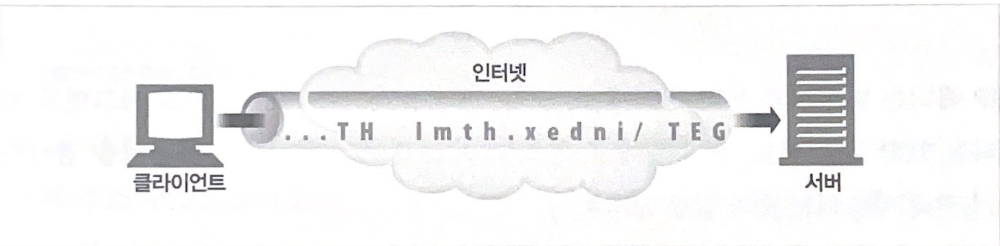

* TCP 커넥션은 인터넥을 안정적으로 연결해준다.
* TCP는 HTTP에게 신뢰할 만한 통신 방식을 제공
* 반대쪽으로 보내지는 바이트들은 순서에 맞게 정확히 전달된다.

### TCP 스트림은 세그먼트로 나뉘어 IP패킷을 통해 전송되다

* TCP는 IP패킷이라고 불리는 작은 조각을 통해 데이터를 전송한다.

* TCP는 세그먼트라는 단위로 데이터 스트림을 잘게 나누고, 세그먼트를 IP 패킷 봉투에 담아서 인터넷을 통해 데이터를 전달한다.

* 각 TCP 세그먼트는 하나의 IP 주소에서 다른 IP 주소로 IP 패킷에 담겨 전달된다.

### 커넥션 유지하기

* 컴퓨터는 여러 개의 TCP 커넥션을 가지고 있다.

* TCP는 **포트번호** 를 통해서 커넥션을 유지한다.

* IP 주소는 컴퓨터에 연결되고 포트 번호 해당 어플리케이션으로 연결 된다.

* TCP 커넥션은 4 가지의 값으로 식별하고 유일하다.
    > <발신지 IP주소, 발신지 포트, 수신지 IP 주소, 수신지 포트>

* 같은 목적지 포트 번호, 목적지 IP 주소를 가르킬 수 있지만, 4 가지의 구성요소가 같은 커넥션은 존재하지 않는다.

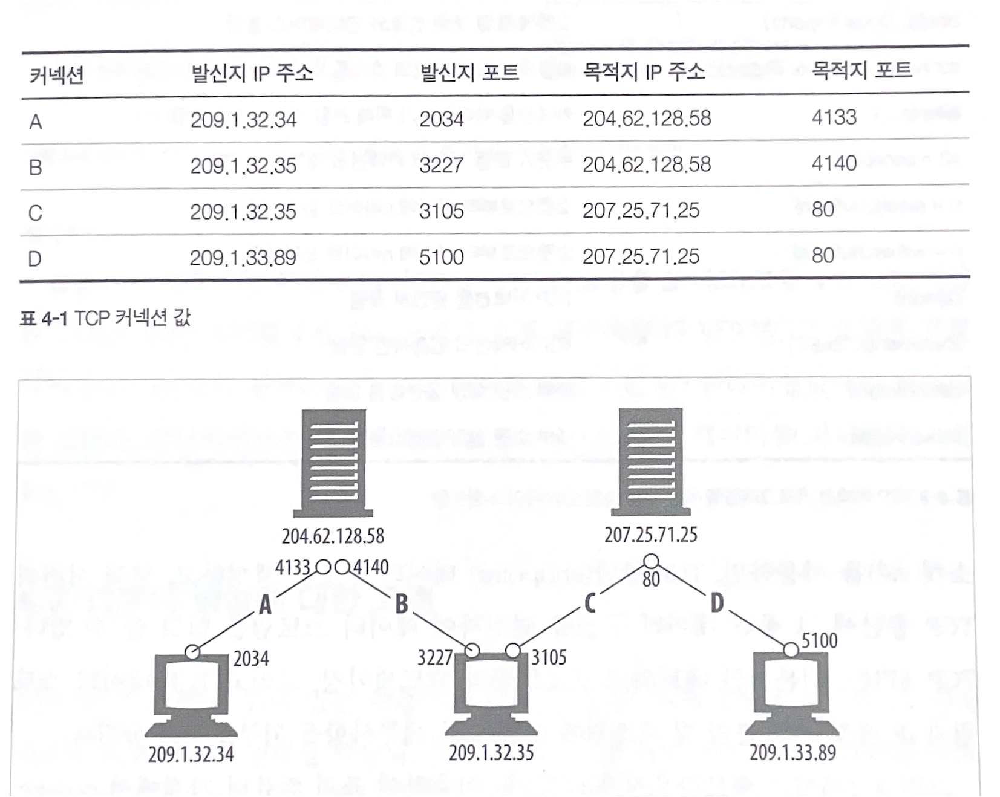

### TCP 소켓 프로그래밍

> 운영체제는 TCP 커넥션의 생성과 관련된 여러 기능을 제공한다.

#### 소켓 API

* 유닉스 운영체제용으로 개발 되었지만, 대부분의 운영체제와 프로그램 언어에서 사용할 수 있다.

* 개발자에게 TCP, IP의 세부사항들을 숨긴다.

* TCP 종단(endpoint) 데이터 구조를 생성

* 원격 서버의 TCP 종단에 데이터 구조를 연결하여 데이터 스트림을 읽고 쓸 수 있다.

* 의사 코드(pseudo code) 예시
    > 클라이언트와 서버 간에 HTTP 트랜잭션을 수행하기 위한 소켓 API의 사용 방법 

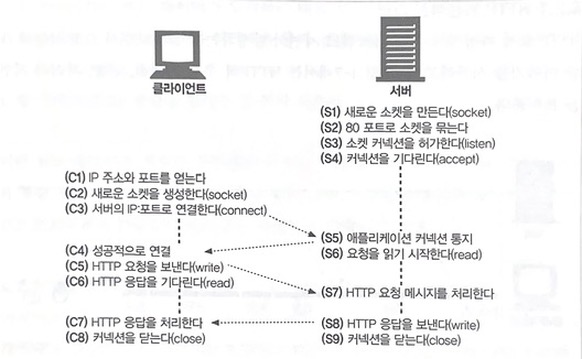

## TCP 성능에 대한 고려

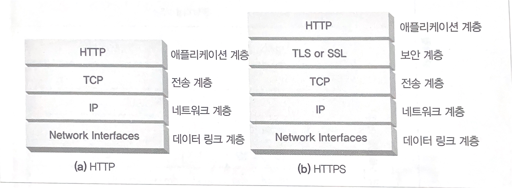

HTTP 트랜잭션 성능은 아래 계층인 TCP 성능에 영향을 받는다.  

### HTTP 트랜잭션 지연

HTTP 트랜잭션이 처리되는 과정  

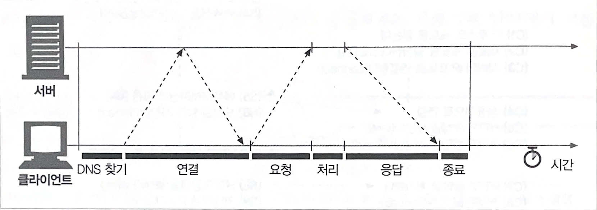

 
 

* 대부분의 HTTP 지연은 TCP 네트워크 지연 때문에 발생
    
    * HTTP 트랜잭션을 지연시키는 여러가지 원인  

        1. URI에서 IP 주소, 포트번호를 알아내는 시간  

        2. TCP 커넥션을 맺는 시간

        3. 클라이언트가 HTTP 요청을 웹 서버에 보내고, 서버가 처리하고 응답하는 시간

        4. 웹 서버가 HTTP 응답을 보내는 것

 

#### 1. TCP 커넥션의 핸드셰이크 지연

> TCP는 확실하게 데이터를 보내기 위해 "쓰리웨이 핸드셰이킹(Three Way Handshaking)" 방법을 사용한다.

* 패킷을 보낸 후 커넥션이 끝나는 것이 아니라, 보내졌는지 여부를 확인하는 과정이다.

* TCP 플래그 사용 : SYN, ACK 

* 클라이언트와 서버는 작은 TCP 패킷 (SYN, ACK)를 주고 받으며 생기는 TCP 커넥션으로 인한 지연이 생기게 된다.

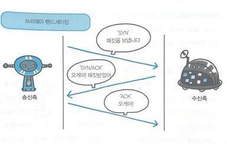 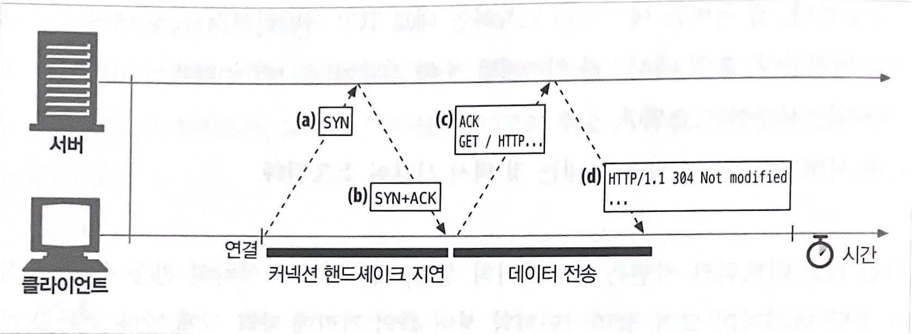

#### 2. 확인응답 지연

* 인터넷 자체가 패킷 전송을 완벽하게 보장하지 않는다. 인터넷 라우터는 과부하가 걸렸을 경우 IP 패킷을 마음대로 파기할 수 있다.

* 따라서 TCP는 성공적인 데이터 전송을 보장하기 위해 자체적인 확인 체계를 가진다. 각 TCP 세그먼트는 순번과 데이터 무결성 체크섬을 가지게 된다.

 
 

 
 

* 각 세그먼트의 수신자(서버)는 세그먼트를 온전히 받으면 작은 확인 응답 패킷을 반환(클라이언트)한다.  
만약 확인응답 메시지를 받지 못하면 패킷이 파기되었거나 오류가 있는 것으로 판단하고 데이터를 재전송한다.

* 확인응답은 크기가 작기 때문에, TCP는 같은 방향으로 송출되는 데이터 패킷(IP 패킷)에 확인응답을 편승(piggyback)시킨다.

* TCP는 네트워크를 효율적으로 사용하기 위해 데이터 패킷과 확인응답을 하나로 묶는 것이다.

* 확인응답이 편승(무임승차)되는 경우를 만들기 위해 확인 응답 지연 알고리즘을 구현한다.  
만약 확인응답을 보내야하는데 송출될 데이터 패킷이 없다면 약 0.1 ~ 0.2초 정도 버퍼에 저장된 후, 송출 데이터 패킷을 찾다가, 찾지 못한다면 별도의 패킷을 만들어 전송된다.

 

> HTTP 동작 방식(요청, 응답)은 확인응답을 편승할 기회를 감소시킨다.  
그래서 확인 응답 지연 알고리즘으로 인한 지연이 발생한다.

#### 3. TCP 느린 시작 (slow start)

* TCP의 데이터 전송 속도는 TCP 커넥션이 만들어진 지 얼마나 지났는지에 따라 달라질 수 있다.  
 
처음에는 커넥션의 최대 속도를 제한하고, 데이터가 성공적으로 전송됨에 따라 속도제한을 높여나간다(튜닝). 이렇게 조율하는 것을  **TCP 느린 시작** 이라고 한다.

 

* TCP의 느린 시작은 인터넷의 급작스러운 부하와 혼잡 방지를 위해 사용한다.  
 
처음에는 TCP가 한 번에 전송할 수 있는 패킷의 수를 제한하고, <u>패킷이 성공적으로 전달</u>되면 송신자는 패킷을 추가로 더 전송할 수 있다.

* 패킷의 성공적 전달 : 확인응답

> 새로운 커넥션은 '튜닝'된 커넥션 보다 느리게 된다.

#### 4. 네이글(Nagle)알고리즘과 TCP_NODELAY

* 네이글 알고리즘 ?
    * 네트워크 효율을 위해, 패킷을 전송하기 전에 많은 양의 TCP 데이터를 한개의 덩어리로 합쳐 전송하는 알고리즘이다.
    * 즉, 전송해야 하는 패킷 수를 줄임으로써 네트워크의 효율성을 향상하는 수단

 

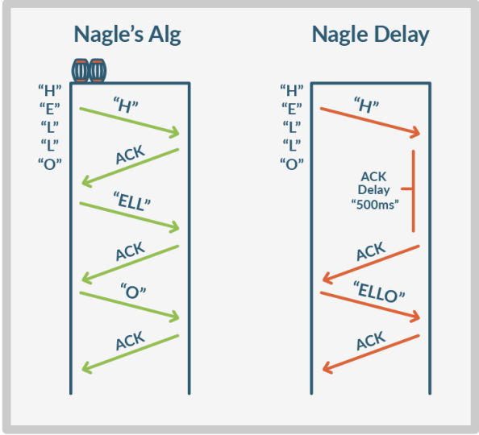

[출처](https://assets.extrahop.com/whitepapers/TCP-Optimization-Guide-by-ExtraHop.pdf)

 

> 한 번에 많이 보내 데이터 전송 횟수가 줄어들어 네트워크 효율성이 높아지지만, 패킷을 모으고 있기 때문에 네트워크를 지연시킨다.

* TCP_NODELAY
    - HTTP 스택에 TCP_NODELAY 파라미터 값을 성정하여 네이글 알고리즘 비활성화

 

#### 5. TIME_WAIT의 누적과 포트 고갈

* TCP 커넥션의 종단에서 커넥션을 끊으면, 종단에서는 커넥션의 IP 주소와 포트 번호를 메모리의 작은 제어영역(control blcok)에 기록해 놓는다.  
 
이 정보는 같은 주소와 포트번호를 사용하는 새로운 TCP 커넥션이 일정 시간 동안 생성되지 않게 하기 위한 것이다.  
보통 세그먼트의 최대 생명주기에 두 배 정도 (2MSL, 2분 정도)의 시간 동안 유지된다.

* 이전 커넥션과 관련된 패킷이 그 커넥션과 같은 주소와 포트 번호를 가지는 새로운 커넥션에 삽입되는 문제를 방지한다.

* 일반적으로 2MSL의 커넥션 종료 지연은 문제가 되지 않지만, 성능 시험을 하는 상황에서는 문제가 될 수 있다.  
 
일반적으로 HTTP의 기본 TCP 포트인 80번을 사용한다. 이런 상황에서는 가능한 연결의 조합이 제한되며, TIME_WAIT로 인해서 포트를 재활용하는 것이 불가능해지며 지연될 수 있다.

 

 

## HTTP 커넥션 관리

### 흔히 잘못 이해하는 커넥션 헤더

* HTTP는 클라이언트와 서버 사이 프록시와 캐시와 같은 중개 서버가 놓이는 것을 허락한다.

* HTTP의 커넥션 헤더는 인접한 HTTP 어플리케이션 사이의 커넥션에만 적용될 옵션을 지정할 수 있게 해준다.

* HTTP 커넥션 헤더 필드 : 커넥션 토큰을 쉼표(,)로 구분
    * 다른 커넥션에 전달 X

* 커넥션 헤더에 전달 될 수 있는 세 가지 종류의 토큰
    1. HTTP 헤더 필드 명
        * 이 커넥션에만 해당되는 헤더들을 나열 (hop-by-hop)

    2. 임시적인 토큰 값
        * 커넥션에 대한 비표준 옵션
    3. close
        * 커넥션 작업이 완료되면 종료되어야 함을 의미

### 순차적인 트랜잭션 처리에 의한 지연

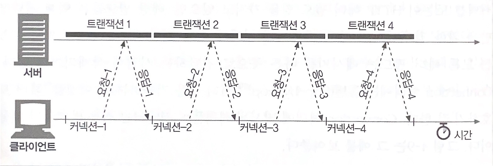

* 커넥션 관리가 제대로 이루어지지 않으면 TCP 성능이 매우 안 좋아 질 수 있다.  

* 순차적인 처리로 인한 지연에는 물리적인 지연뿐 아니라, 하나의 이미지를 내려받고 있는 중에는 웹페이지의 나머지 공간에 아무런 변화가 없어서 느껴지는 심리적인 지연도 있다.

* 총 10컷의 웹툰(이미지)을 보는데 이미지 하나 하나 로딩되는 것을 기다리는 것은 매우 답답할 것이다.

* 또한 순차적으로 로드하는 방식의 단점은, 특정 브라우저의 경우 객체를 화면에 배치하려면 캑체의 크기를 알아야하기 때문에, 모든 객체를 내려받기 전까지는 텅 빈 화면을 보여준다는 것이다.

* 이러한 HTTP 커넥션의 성능 향상시킬 수 있는 최신 기술은 다음과 같다.

### 1. 병렬(parallel) 커넥션

> 여러 개의 TCP 커넥션을 통한 동시 HTTP 요청

* 네 개의 이미지를, 할당받은 각 TCP 커넥션상의 트랜잭션을 통해 병렬로 내려 받는 예시

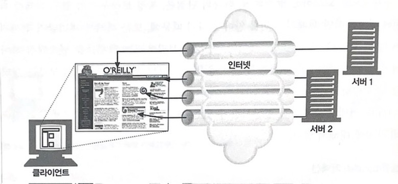

> 병렬 커넥션은 페이지를 더 빠르게 내려받는다.

* 단일 커넥션의 대여폭 제한과 커넥션이 동작하지 않고 있는 시간을 활용하면, 객체가 여러 개 있는 웹페이지를 더 빠르게 내려받을 수 있을 것이다.

* 각 커넥션의 지연 시간을 겹치게 하면 총 지연 시간을 줄일 수 있을 있고, 클라이언트의 인터넷 대역폭을 한 개의 커넥션이 다 써버리는 것이 아니라면 나머지 객체를 내려받는 데에 남은 대역폭을 사용할 수 있다.

 

> 병렬 커넥션이 항상 더 빠르지 않다.

* 네트워크의 대역폭이 좁을 때, 제한된 대역폭 내에서 각 개체를 전송받는 것은 느리기 때문에 성능상 장점은 거의 없어진다.

* 다수의 커넥션은 메모리를 많이 소모하고 자체적인 성능 문제를 발생시킨다.
    * 복잡한 웹페이지는 수십 ~ 수 백 개의 객체를 포함
    * 수백 개의 커넥션은 서버와 프락시의 성능을 떨어뜨릴 것이다. 

> 병렬 커넥션은 더 빠르게 **느껴질 수** 있다.

* 사용자는 화면에 여러 개의 객체가 동시에 보이면서 내려받고 있는 상황을 보기 때문에 더 빠르게 느낄 수 있다.

---

### 2. 지속(persistent) 커넥션

> 커넥션을 맺고 끊는 데서 발생하는 지연을 제거하기 위한 TCP 커넥션의 재활용

* 비지속 커넥션 : 각 처리가 끝날 때마다 커넥션을 끊음
* 지속 커넥션 : 클라이언트나 서버가 커넥션을 끊기 전까지는 트랜잭션 간에도 커넥션을 유지

> 지속 커넥션 VS 병렬 커넥션

* 병렬 커넥션의 단점
    1. 각 트랜잭션마다 새로운 커넥션을 맺고 끊기에 시간과 대역폭 소요
    2. 새로운 커넥션은 TCP의 느린 시작때문에 성능 하락
    3. 실제로 연결할 수 있는 커넥션 수의 제한

* 병렬 커넥션의 단점을 보완하는 지속 커넥션의 장점
    1. 커넥셔은 맺는 사전 작업과 지연을 줄여다.
    2. 튜닝된 커넥션 유지
    3. 커넥션 수 ${\downarrow}$

* 위 장점은 지속 커넥션을 잘못 관리할 경우, 계속 연결된 상태로 있는 수 많은 커넥션이 쌓이게 되어 로컬의 리소스, 원격의 클라이언트와 서버의 리소스에 불필요한 소모를 발생 시킬 것이다.

> 지속 커넥션 X 병렬 커넥션

* 지속 커넥션은 병렬 커넥션과 함계 사용될 때 가장 효과적
* 두 가지 지속 커넥션 타입
    1. HTTP/1.0+ ${\rightarrow}$ Keep-Alive
    2. HTTP/1.1 ${\rightarrow}$ 지속 커넥션

> HTTP/1.0+ 의 Keep-Alive 커넥션

* Keep-Alive 커넥션의 성능 상 장점은 커넥션을 맺고 끊는데 필요한 작업을 없애 시간이 단축시킬 수 있다.

> Keep-Alive 동작

* Keep-Alive는 사용하지 않기로 하여 HTTP/1.1 명세에는 빠졌으나, 아직도 브라우저와 서버 간에 keep-alive 핸드셰이크가 널리 사용되고 있다. 그래서 HTTP 애플리케이션은 그것을 처리할 수 있게 개발해야 한다.

* 동작 방식
    * 요청에 Conection:Keep-alive 헤더를 포함
    * 요청을 받은 서버는 그 다음 요청도 이 커넥션을 통해 받고자 한다면, 응답 메시지에 같은 헤더를 포함시켜 응답한다.

 

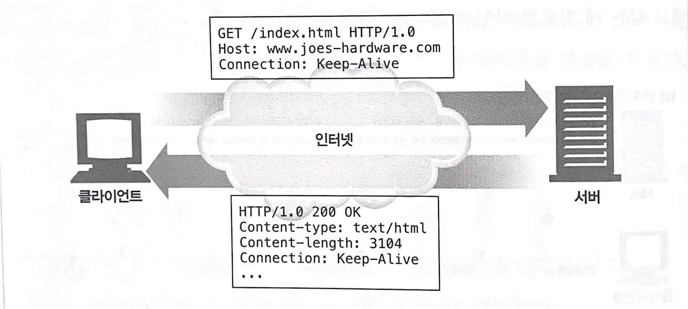

 

> Keep-Alive 옵션

* Keep-Alive 헤더는 커넥션 유지하기를 바라는 요청일 뿐, 무조건 그것을 따를 필요는 없다.
* Keep-Alive 의 동작은 Keep-Alive 헤더의 쉼표로 구분된 옵션들로 제어할 수 있다.
    * timeout 파라미터 : 커넥션이 얼마나 유지될 것인지 설정
    * max 파라미터 : 커넥션이 몇 개의 HTTP 트랜잭션을 처리할 때까지 유지될 것인지 설정

> Keep-Alive와 멍청한 프락시와 영리한 프락시

* 클라리언트와 서버 사이에 존재하는 멍청한 프락시는 Connection 헤더를 이해하지 못해 헤더 삭제없이 그대로 다음 프락시에 전달한다.
 

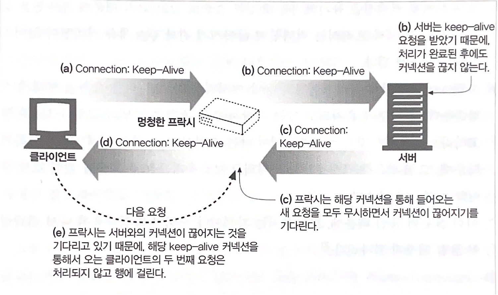

 

 

* 멍청한 프락시(모든 헤더를 무조건 전달하는)에 대한 차선책을 제시
    * Proxy-Connection 헤더 사용

 

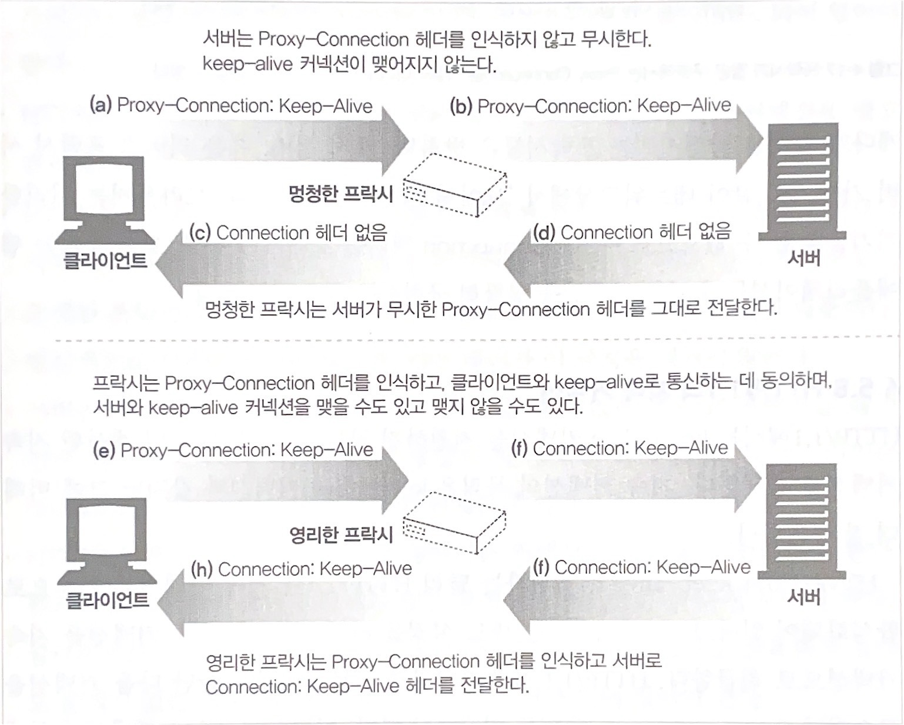

 

* 위 방식은 프락시 서버가 하나만 있는 경우에 동작한다.
    영리한 프락시만 있다면 문제가 없겠지만, 멍청한 프락시가 있는 경우 잘못된 헤더를 만들어내는 문제가 다시 발생한다.

 

> HTTP/1.1의 지속 커넥션

* HTTP/1.1에서는 Keep-Alive 커넥션을 지원하지 않는 대신, 설계가 더 개선된 지속 커넥션을 지원한다.

* 별도 설정하지 않는 한, 모든 커넥션을 지속 커넥션으로 취급한다.

---

### 3. 파이프라인(piplined) 커넥션

> 공유 TCP 커넥션을 통한 병렬 HTTP 요청

* 파이프라인
    * 한 데이터 처리 단계의 출력이 다음 단계의 입력으로 이어지는 형태로 연결된 구조를 가리킨다.
    * 이렇게 연결된 데이터 처리 단계는 한 여러 단계가 서로 동시에, 또는 병렬적으로 수행될 수 있어 효율성의 향상을 꾀할 수 있다.

* HTTP/1.1은 지속 커넥션을 통해서 요청을 파이프라이닝할 수 있다.
* Keep-Alive 커넥션의 성능을 높여준다.

 

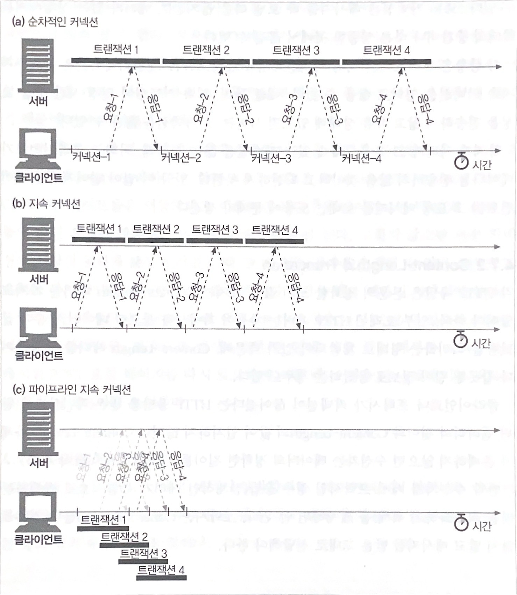

---

### 4. 다중(multiplexed) 커넥션

> 요청과 응답들에 대한 중재(실험적인 기술)

---

## 커넥션 끊기에 대한 미스터리

> 커넥션을 언제 어떻게 끊는가에 대한 명확한은 기준 없다.

### 마음대로 커넥션 끊기

> 어떠한 HTTP 클라이언트, 서버, 혹은 프락시든 언제든지 TCP 전송 커넥션을 끊을 수 있다.

### Content-Length와 Truncation

* 각 HTTP 응답은 본문의 정확한 크기 값을 가지는 Content-Length 헤더를 가지고 있어야 한다.
* 클라이언트나 프락시가 커넥션이 끊어졌다는 HTTP 응답을 받은 후, 실제 전달된 엔티티의 길이와 Content-Length의 값이 일치하지 않거나 Content-Length 자체가 존재하지 않으면 수신자는 데이터의 정확한 길이를 서버에게 물어봐야 한다.  
만약 수신자가 캐시 프락시일 경우 응답을 캐시하면 안된다. 프락시는 Content-Length를 정정하려 하지 말고 메시지를 받은 그대로 전달해야 한다.

### 커넥션 끊기의 허용, 재시도, 멱등성

* 커넥션은 에러가 없더라도 언제든 끊을 수 있다.
* HTTP 어플리케이션은 예상치 못한 커넥션 끊김에 대응할 수 있는 준비가 되어 있어야 한다.
* 한 번 혹은 여러 번 실행되었는지에 상관없이 같은 결과를 반환한다면 그 트랜잭셔은 멱등(idempotent)하다고 한다.
    * GET, HEAD, PUT, DELETE, TRACE, OPTIONS

* 반면 POST와 같이 멱등이 아닌 요청, 비멱등인 요청은 파이프라인을 통해 요청하면 안된다. 그렇지 않으면 전송 커넥션이 예상치 못하게 끊어져 버렸을 때, 알 수 없는 결과를 초래할 수 있다.

### 우아한 커넥션 끊기

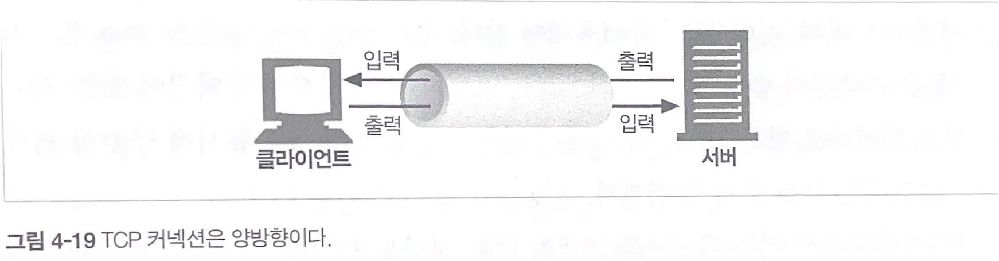

* TCP 커넥션은 그림에서 보듯 양방향이다.
* 양쪽에는 데이터를 읽거나 쓰기 위한 입력 큐와 출력 큐가 있다.
* 한쪽 출력 큐에 있는 데이터는 다른 쪽의 입력 큐에 보내질 것이다.

### 전체 끊기와 절반 끊기

> 애플리케이션은 TCP 입력 채널과 출력 채널 중 한 개만 끊거나 둘 다 끊을 수 있다.

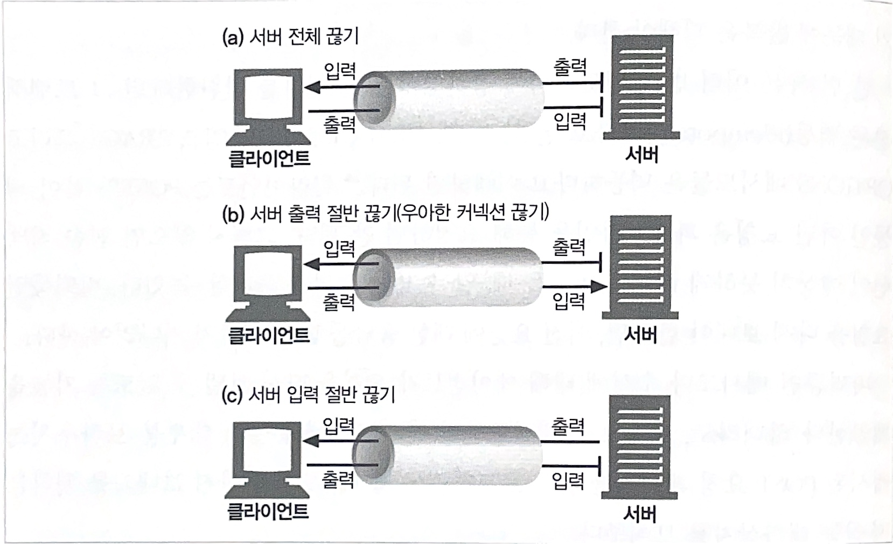

* 전체 끊기
    * close( ) 를 호출하면 TCP 커넥션의 입력 채널과 출력 채널의 커넥션을 모두 끊는다.

* 개별 끊기 (절반 끊기)
    * shudown( )을 호출하면 입력 채널이나 출력 채널 중에 하나를 개별적으로 끊을 수 있다.

### TCP 끊기와 리셋 에러

* 단순한 HTTP 애플리케이션은 전체 끊기만을 사용할 수 있다.
* 하지만 애플리케이션이 각기 다른 HTTP 클라이언트, 서버, 프락시와 통신할 때 기기들에 예상치 못한 쓰기 에러를 발생하는 것을 예방하기 위해 절반 끊기를 사용해야 한다.

* 보통 커넥션의 출력 채넝을 끊는 것이 안전하다.

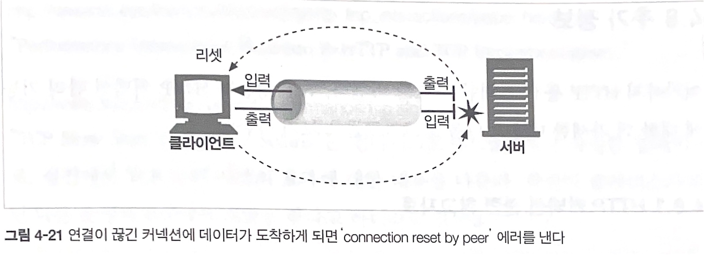

 

* 만약 클라이언트에서 이미 끊긴 입력 채널에 데이터를 전송하면 위 그림 같이 'connection reset by peer' 에러를 낼 것이다.

* 위 에러를 받게 되면, 응답 데이터가 클라이언트에 잘 도착하였어도 아직 읽히지 않은 버퍼가 있는 응답 데이터는 사라지게 될 것이다.

### 우아하게 커넥션 끊기

* 일반적인 우아하게 커넥션 끊기는 애플리케이션 자신의 출력 채널을 먼저 끊고 다른 쪽에 있는 기기의 출력 채널이 끊기는 것을 기다리는 것이다. 양쪽에서 더는 데이터를 전송하지 않을 것이라고 알려주면 커넥션은 리섹의 위험 없이 온전히 종료된다.

* 출력 채널에 절반 끊기를 하고 난 후에 데이터나 스트림의 끝을 식별하기 위해 입력 채널에 대해 상태 검사를 주기적으로 해야한다.

---

 
 
 
 

# 참조

* HTTP 완벽 가이드
* 그림으로 배우는 Http & Network Basic