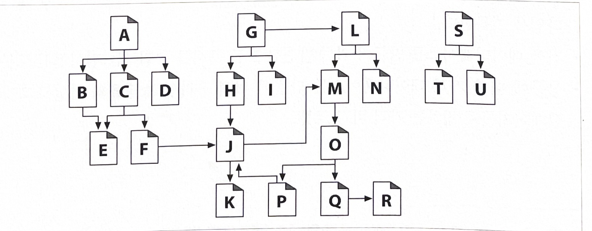
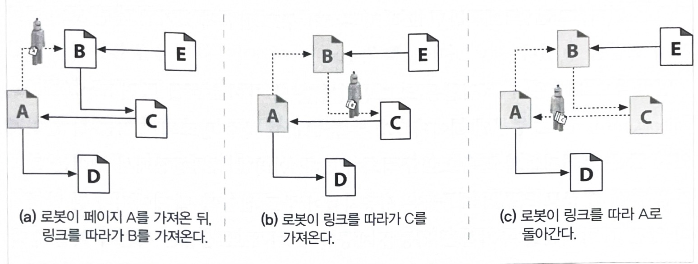
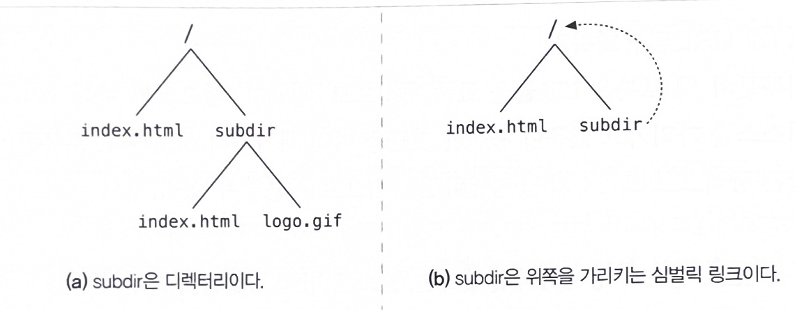
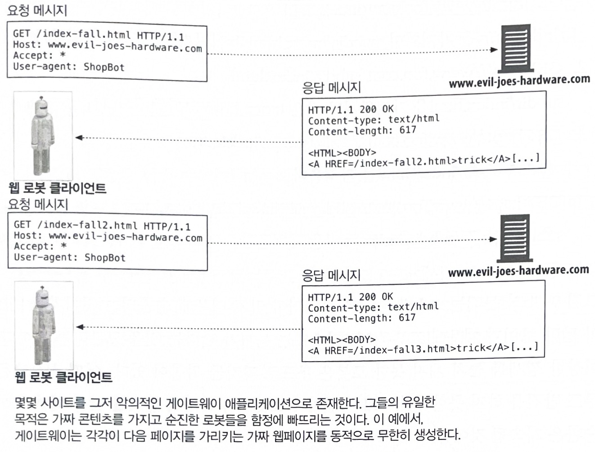
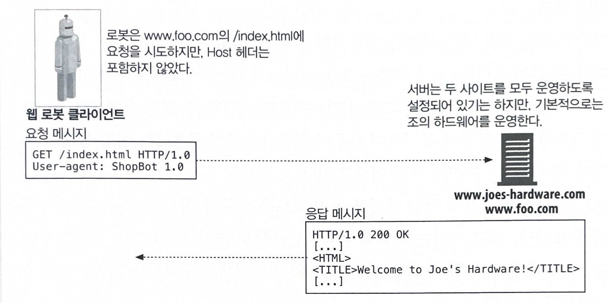
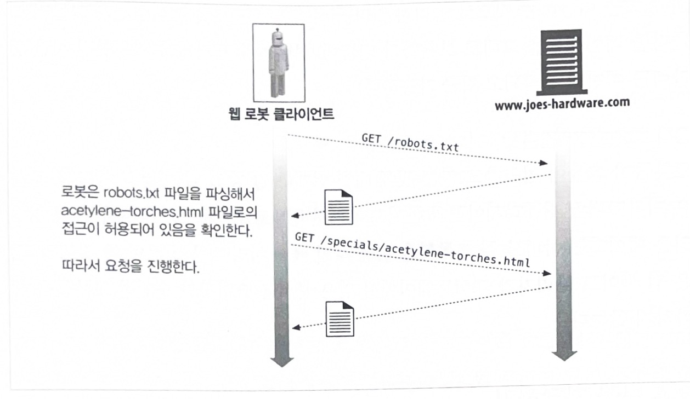
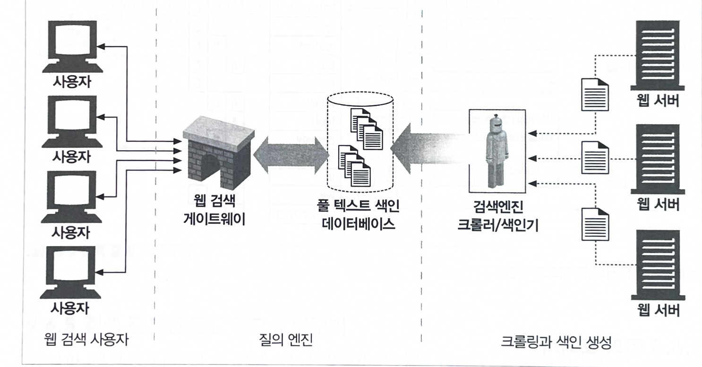
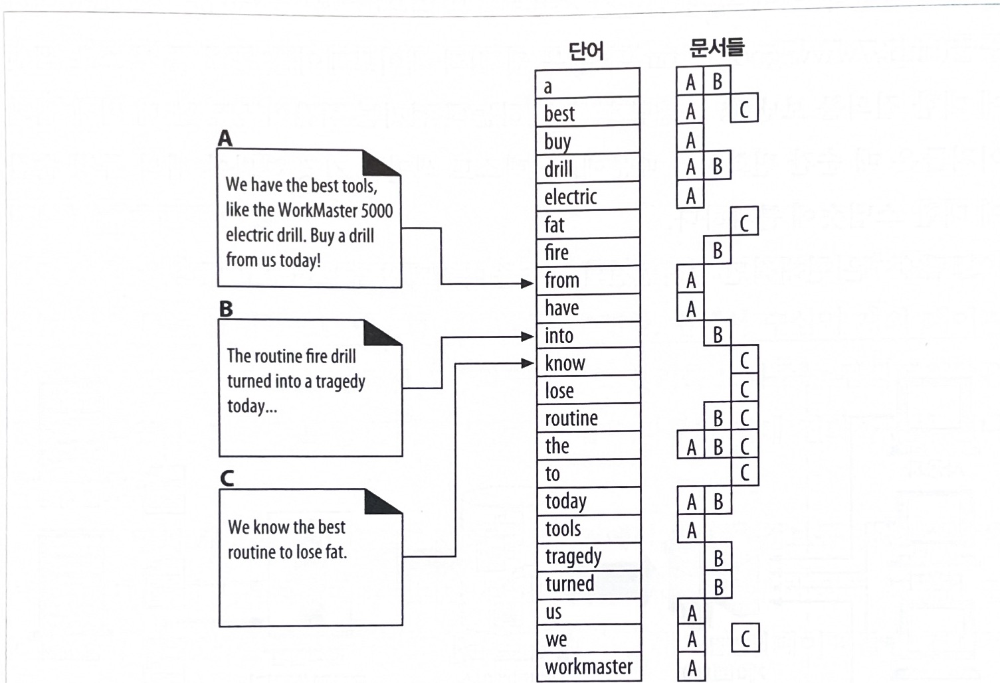
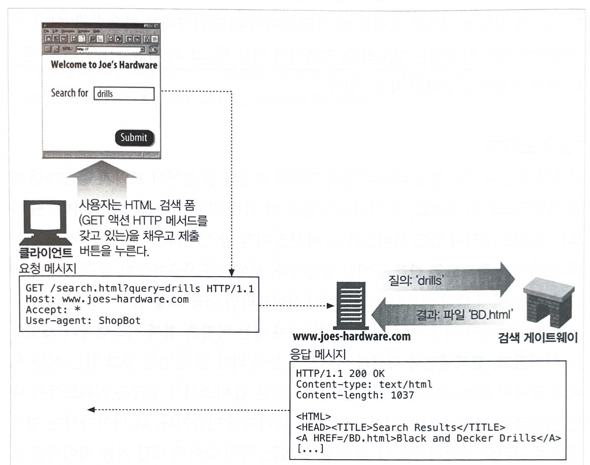

# 웹 로봇

* `웹 로봇` 은 사람과의 상호작용 없이 연속된 웹 트랜잭션들을 자동으로 수행하는 소프트웨어 프로그램이다.  

* 로봇은 웹 사이트에서 다른 웹 사이트로 떠돌아다니면서, 콘텐츠를 가져오고, 하이퍼링크를 따라가고, 그들이 발견한 데이터를 처리한다.

* 로봇은 방식의 따라 '크롤러', '스파이더', '웜', '봇' 등 다양한 이름으로 불린다.

## 웹 로봇의 예시

* 주식시장 서버에 매 분 HTTP GET 요청을 보내고, 여기서 얻은 데이터를 활용해 주가 추이 그래프를 생성하는 주식 그래프 로봇
* 검색 데이터베이스를 만들기 위해 발견한 모든 문서를 수집하는 검색엔진 로봇
* 상품에 대한 가격 데이터베이스를 만들기 위해 온라인 쇼핑몰의 카탈로그에서 웹페이지를 수집하는 가격 비교 로봇

## 9.1 크롤러와 크롤링

* 웹 크롤러는 재귀적으로 반복하는 방식으로 웹을 순회하는 로봇이다.

* 크롤러 혹은 스파이더라고 부르는데, HTML 하이퍼링크들로 만들어진 웹을 따라 '기어다니기(crawl)' 때문이다.

* 인터넷 검색엔진은 웹을 돌아다니면서 그들이 만나는 모든 문서를 끌어오기 위해 크롤러를 사용한다.

### 9.1.1 어디에서 시작하는가 : 루트 집합

* 루트 집합 (root set)
    - 출발 지점
    - 크롤러가 방문을 시작하는 URL들의 초기 집합
    - 모든 링크를 크롤링하면 결과적으로 관심 있는 웹페이지들의 대부분을 가져 오게 될 수 있도록 충분히 다른 장소에서 URL들을 선택해야 한다.


* 그림 9-1 : 모든 페이지에 도달하려면 루트 집합이 필요하다.

    - 루트 집합에 A, G, S가 있다면, 모든 페이지에 도달할 수 있다.



<br><br>

### 9.1.2 링크 추출과 상대 링크 정상화

* 크롤러는 웹을 돌아다니면서 꾸준히 HTML 문서를 검색한다.

* 크롤러는 검색한 페이지 안에 들어있는 URL 링크들을 파싱해서 크롤링할 페이지의 목록에 추가 해야 한다.

* 크롤러가 크롤링을 진행하면서 탐색해야 할 새 링크를 발견함에 따라, 이 목록들은 급속히 확장된다.

> 크롤러들은 간단한 HTML 파싱을 해서 이들 링크들을 추출하고 상대 링크를 절대 링크로 변환할 필요가 있다.

### 9.1.3 순환 피하기

* 로봇이 웹을 크롤링 할 때, 루프나 순환에 빠지지 않도록 매우 조심해야 한다.

* 그림 9-2 : 하이퍼링크의 웹을 크롤링하기
    
    - 로봇들은 순환을 피하기 위해 반드시 어디를 방문했는지 알아야 한다.
    - 순환은 로봇을 함정에 빠뜨려서 멈추게 하거나 진행을 느려지게 한다.



<br><br>

### 9.1.4 루프와 중복

* 순환은 최소한 세 가지 이유로 인해 크롤러에게 해롭다.

    1. 순환은 크롤러를 루프에 빠뜨려서 꼼짝 못하게 만들 수 있다. 
        - 이러한 크롤러가 네트워크 대역폭을 다 차지하고 그 어떤 페이지도 가져올 수 없게 되어버릴 수 있다.

    2. 크롤러가 같은 페이지를 반복해서 가져오면 웹 서버의 부담이 된다.

    3. 루프 자체가 문제가 되지 않더라도, 수 많은 중복된 페이지들을 가져오게 된다.


### 9.1.5 빵 부스러기의 흔적

* 수입억 개의 서로 다른 웹페이지들이 존재하고, 지속적으로 방문한 곳을 추적하는 것은 쉽지 않다.

* 대규모 웹 크롤러가 방문한 곳을 관리하기 위해 사용하는 유용한 기법들은 다음과 같다.

1. 트리와 해시 테이블
    - URL을 빨리 찾아볼 수 있게 해주는 소프트웨어 자료 구조이다.
2. 느슨한 존재 비트맵
    - 공간 사용을 최소화하기 위해, 존재 비트 배열(presence bit array)과 같은 느슨한 자료 구조를 사용한다.
3. 체크 포인트
    - 로봇 프로그램이 갑작스럽게 중단될 경우를 대비해, 방문한 URL의 목록이 디스크에 저장되었는지 확인한다.
4. 파티 셔닝
    - 각각이 분리된 한 대의 컴퓨터인 로봇들이 동시에 일하고 있는 농장(farm)을 이용한다.


### 9.1.6 별칭(alias)과 로봇 순환

* 표 9-1 
    - 다른 URL들이 같은 리소스를 가르키게 되는 몇 가지 간단한 예

첫 번째 URL | 두 번째 URL | 어떤 경우에 같은 URL을 가리키게 되는가
---|---|---
a http://www.foo.com/bar/html|http://www.foo.com:80/bar/html|기본 포트가 80번일 때
b http://www.foo.com/~fred|http://www.foo.com/%7~fred|%7F이 ~과 같을 때
c http://www.foo.com/x.html#early|http://www.foo.com/x.html#middle|태그에 따라 페이지가 바뀌지 않을 때
d http://www.foo.com/readme.htm|http://www.foo.com/README.HTM|서버가 대소문자를 구분하지 않을 때
e http://www.foo.com/|http://www.foo.com/index.html|기본 페이지가 index.html 일 때
f http://www.foo.com/index.html|http://209.231.87.45/index.html|www.foo.com이 아이피 주소를 가질 때

<br><br>

### 9.1.7 URL 정규화하기

* 웹 로봇은 URL들을 표준 형식으로 `정규화` 함으로써 다른 URL과 같은 리소스를 가리키고 있음이 확실한 것들을 미리 제거하려 시도한다.
* 로봇은 다음과 같은 방식으로 모든 URL을 정규화된 형식으로 변환할 수 있다.
    1. 포트번호가 명시되지 않았다면, 호스트 명에 ':80' 을 추가한다.
    2. 모든 %xx 이스케이핑된 문자들을 대응되는 문자로 변환한다.
    3. '#' 태그들을 제거한다.

### 9.1.8 파일 시스템 링크 순환

* 파일 시스템의 심벌릭 링크는 사실상 아무것도 존재하지 않으면서도 끝없이 깊어지는 디렉터리 계층을 만들 수 있기 때문에, 매우 교묘한 종류의 순환을 유발할 수 있다.

* 그림 9-3 : 심벌릭 링크 사이클
    - 그림 (b) 의 문제
        * subdir/ 이 / 로 링크되어 있기 때문에 순환되는 것이지만 URL이 달라 보이기 때문에 로봇은 URL 만으로는 문서가 같다는 것을 모른다는 점이다.
        * 로봇은 루프로 빠져들 위험이 있다.



<br><br>


### 9.1.9 동적 가상 웹 공간

* 악의적인 웹 마스터들은 로봇들을 함정에 빠뜨리기 위해 의도적으로 복잡한 크롤러 루프를 만든다.

* 그림 9-4 : 악의적인 동적 웹 공간의 예
     - 콘텐츠의 동적 성질을 이해하지 못하는 로봇이라면 무한히 다음 달 달력을 요청할 수도 있다.




<br><br>


### 9.1.10 루프와 중복 피하기

* 모든 순환을 피하는 방법은 없다.

* 잘 설계된 로봇은 순환을 피하기위해 휴리스틱의 집합을 필요로 한다.

* 휴리스틱은 문제를 피하는데 도움을 주지만 동시에 손실을 유발할 수 있다.

* 웹에서 로봇이 올바르게 동작하기 위해 사용하는 기법
    1. URL 정규화
    2. 너비 우선 크롤링
    3. 스로틀링
    4. URL 크기 제한
    5. URL / 사이트 블랙리스트
    6. 패턴 발견
    7. 콘텐츠 지문(finger print)
    8. 사람의 모니터링


## 9.2 로봇의 HTTP

* 로봇들은 다른 HTTP 클라이언트 프로그램과 다르지 않다.
* 로봇 또한 HTTP 명세의 규칙을 지켜야 한다.

### 9.2.1 요청 헤더 식별하기

* 로봇들이 HTTP를 최소한도로만 지원하려고 함에도 불구하고,  
그들 대부분은 약간의 신원 식별 헤더(특히 User-Agent HTTP 헤더)를 구현하고 전송한다.

* 로봇 개발자들이 구현을 하도록 권장되는 기본적인 신원 식별 헤더들에는 다음과 같은 것이 있다.

    1. User-Agent
        - 서버에게 요청을 만든 로봇이 이름을 말해준다.

    2. From
        - 로봇의 사용자/관리자의 이메일 주소를 제공한다.

    3. Accept
        - 서버에게 어떤 미디어 타입을 보내도 되는지 말해준다.

    4. Referer
        - 현재의 요청 URL을 포함한 문서의 URL을 제공한다.


### 9.2.2 가상 호스팅

* 로봇 구현자들은 Host 헤더를 지원할 필요가 있다.

* 가상 호스팅이 널리 퍼져있는 현실에서, 요청에 Host 헤더를 포함하지 않으면 로봇이 어떤 URL에 대해 잘못된 콘텐츠를 찾게 만든다.

* 이러한 이유로 HTTP/1.1은 Host 헤더를 사용할 것을 요구한다.

* 그림 9-5 : 요청에 Host 헤더가 없는 경우 docroot가 문제를 일으키는 예시



<br><br>


### 9.2.3 조건부 요청

* 로봇이 극악한 양의 요청을 시도한다는 것을 고려할 때, 로봇이 검색하는 콘텐츠의 양을 최소화하는 것은 의미 있는 일이다.
    - 인터넷 검색엔진 같은 경우, 오직 변경되었을 때만 콘텐츠를 가져오도록 하는 것은 의미가 있다.

* 이들 로봇 중의 몇몇은 시간이나 엔터티 태그를 비교함으로써 그들이 받아간 마지막 버전 이후에 업데이트 된 것이 있는지 알아보는 조건부 HTTP 요청을 구현한다.

### 9.2.4 응답 다루기

* 대다수 로봇은 단순히 GET 메서드로 콘텐츠를 요청해서 가져오기에, 응답 다루기라고 부를 만한 일은 거의 하지 않는다.

* HTTP의 특정 몇몇 기능을 사용하는 로봇들이나, 웹 탐색이나 서버의 상호작용을 더 잘해보려고 하는 로봇들은 여러 종류의 HTTP 응답을 다룰 줄 알아야 한다.

1. 상태코드
    - 로봇들은 최소한 일반적인 상태 코드나 예상할 수 있는 상태 코드를 다룰 수 있어야 한다. 
2. 엔터티
    - HTTP 헤더에 임베딩된 정보를 따라 로봇들은 엔터티 자체의 정보를 찾을 수 있다.


### 9.2.5 User-Agent 타기팅

* 웹 관리자들은 많은 로봇이 그들의 사이트를 방문하게 될 것임을 명시하고, 그 로봇들로부터의 요청을 예상해야 한다.

* 사이트 관리자들은 로봇의 요청을 다루기 위한 전략을 세워야 한다.

* 최소한 로봇이 사이트에 방문했다가 콘텐츠를 얻을 수 없어 당황하는 일이 없도록 대비해야 한다.

## 9.3 부적절하게 동작하는 로봇들

* 로봇들이 아수라장을 만들 여러 가능성이 있다.
* 로봇이 저지르는 실수 몇 가지와 그로 인해 초래되는 결과를 몇 가지 들어보면 다음과 같다.

### 폭주하는 로봇

* 로봇은 사람보다 빠르게 HTTP 요청을 만들 수 있고 빠른 네트워크 연결을 갖춘 컴퓨터 위에서 동작한다.

* 만약 로봇이 에러를 갖고 있거나 순환에 빠졌다면 웹 서버에 극심한 부하를 안겨 줄 수 있다.

* 모든 로봇 저자들은 폭주 방지를 위한 보호 장치를 신경 써서 설계해야 한다.

### 오래된 URL

* 몇몇 존재하지 않는 문서에 대한 접근 요청으로 에러 로그가 채워지거나, 에러 페이지를 제공하는 부하로 인해 웹 서버의 요청에 능력이 감소된다.

### 길고 잘못된 URL

* 순환이나 프로그래밍상의 오류로 인해 로봇은 웹 사이트에게 크고 의미 없는 URL을 요청할 수 있다.

* 웹 서버의 처리 능력에 영향을 주고, 웹 서버의 접근 로그를 어지럽게 채우고, 허술한 웹 서버라면 고장을 일으킬 수 있다.

### 호기심이 지나친 로봇

* 일반적으로 공개된 인터넷을 통해 리소스가 접근 가능하다면, 어디서든 접근할 수 있는 것이다.
* 인터넷에 링크가 존재하는한 진정한 의미의 사적인 리소스는 거의 없다.

* 민감한 데이터 (비밀번호 파일, 신용카드 정보) 를 로봇이 검색할 수 있다는 것에 주의해야 한다.

### 동적 게이트웨이 접근

* 로봇은 게이트웨이 애플리케이션의 콘텐츠에 대한 URL로 요청을 할 수도 있다.

*  이 경우 얻은 데이터는 아마도 특수 목적을 위한 것일 테고 처리 비용이 많이 들 것이다.

## 9.4 로봇 차단하기

* 로봇이 맞지 않는 장소에 들어오지 않도록 하고, 로봇의 동작을 제어할 수 있는 메커니즘을 제공하는 단순하고 자발적인 기법이 제안되었다.
    - "Robots Exclusion Standard" 라고 이름 지어졌지만, robot.txt 라고 불린다.

* 어떤 웹 서버는 서버의 문서 루트에 robot.txt라고 이름 붙은 선택적인 파일을 제공할 수 있다.
    - 어떤 부분에 접근할 수 있는지에 대한 정보가 담겨있다.

* 그림 9-6 : robots.txt를 가져와서 대상 파일을 크롤링하기 전에 접근해도 되는지 확인하기



<br><br>


### 9.4.1 로봇 차단 표준

* 로봇 차단 표준은 임시방편으로 마련된 표준이다.

* 로봇의 접근 제어하는 능력은 불안전한 데가 있지만, 대부분의 주류 업체들과 검색엔진 크롤러 들은 이 차단 표준을 지원한다.

* 표 9-2 : 로봇 차단 표준
    - 버전 넘버링을 채택한다.
    - 오늘날 대부분 로봇들은 v0.0 이나 v1.0 표준을 채택한다.

버전 | 이름과 설명 | 날짜
---|---|---
0.0|로봇 배제 표준-Disallow 지시자를 지원하는 마틴 코스터의 오리지널 robots.txt 메커니즘|1994년 6월
1.0|웹 로봇 제어 방법-Allow 지시자의 지원이 추가된 마틴 코스터의 IETF 초안|1996년 11월
2.0|로봇 차단을 위한 확장 표준-정규식과 타이밍 정보를 포함한 숀 코너의 확장. 널리 지원되지는 않는다.|1996년 11월

### 9.4.2 웹 사이트와 robots.txt 파일들

* 웹 사이트의 어떤 URL을 방문하기 전에, 그 웹 사이트에 robot.txt 파일이 존재한다면 로봇은 반드시 그 파일을 가져와서 처리해야 한다.

#### robo.txt 가져오기

* HTTP GET 메서드를 이용해 robot.txt 리소스를 가져온다.
* robot.txt가 존재한다면 서버는 그 파일을 text/plain 본문으로 반환한다.

#### 응답 코드

* 로봇은 robot.txt의 검색 결과 (상태 코드) 에 따라 다르게 동작한다.
    상태코드|설명
    |---|---|
    2XX |로봇은 파싱하여 차단 규칙을 얻고, 규칙에 따른다.
    404 | robot.txt의 제약 없이 사이트에 접근 할 수 있다.
    401 혹은 403 | 접근이 완전히 제한되어 있다고 가정한다.
    503 | 로봇은 사이트의 리소스를 검색하는 것을 뒤로 미루어야 한다.
    3XX | 로봇은 리소스가 발견될 때까지 리다이렉트를 따라가야 한다.

### 9.4.3 robots.txt 파일 포맷

* robot.txt 파일은 매우 단순한 줄 기반 갖는다.
```
# 이 robots.txt 파일은 Slurp과 Webcrawler가 우리 사이트의 공개된 영역을 클로링하는 것을 허락한다.
# 그러나 다른 로봇은 안된다.

User-Agent: slurp
User-Agent: Webcrawler
Disallow: /private

User-Agent: *
Disallow:
```

* 줄들은 레코드로 구분된다.
* 각 레코드는 특정 로봇들의 집합에 대한 차단 규칙의 집합을 기술한다.
* 이 방법을 통해 로봇별로 각각 다른 차단 규칙을 적용할 수 있다.

### 9.4.5 robot.txt의 캐싱과 만료

* 로봇은 주기적으로 robot.txt를 가져와서 그 결과를 캐시해야 한다.
* 로봇은 HTTP 응답의 Cache-Control 과 Expires 헤더에 주의를 기울여야한다.

### 9.4.6 로봇 차단 펄 코드

* robots.txt 파일과 상호작용하는 공개된 펄(Perl) 라이브러리가 몇 가지 존재한다.
* 한 예는 CPAN 공개 펄 아카이브의 WWW:RobustRules 모듈이다.

### 9.4.7 HTML 로봇 제어 META 태그

* robot.txt 파일은 사이트 관리자가 로봇들을 웹 사이트의 일부 혹은 전체에 접근할 수 없게 한다.
* robot.txt 파일의 단점 중 하나는 그 파일을 콘텐츠의 작성자 개개인이 아니라 웹 사이트 관리자가 소유한다는 것이다.

* HTML 페이지 저자는 로봇이 개별 페이지에 접근하는 것을 제한하는 좀 더 직접적인 방법을 갖고 있다.
    > HTML 문서에 직접 로봇 제어 태그를 추가할 수 있다.

* 로봇 차단 태그는 HTML META 태그를 이용해 다음과 같은 형식으로 구현된다.
    ```
    <META NAME="ROBOTS" CONTENT=directive-list>
    ```

#### 로봇 META 지시자

* 로봇 META 지시자에는 몇 가지 종류가 있으며, 가장 널리 쓰이는 로봇 META 지시자 두가지는 다음과 같다.

1. NOINDEX
    - 로봇에게 이 페이지를 처리하지 말고 무시하라고 말해준다.
    ```
    <META NAME="ROBOTS" CONTENT="NOINDEX">
    ```
2. NOFOLLOW
    - 로봇에게 이 페이지가 링크한 페이지를 크롤링하지 말라고 말해준다.
    ```
    <META NAME="ROBOTS" CONTENT="NOFOLLOW">
    ```

* 다른 지시자들
    - INDEX, FOLLOW, NOARCHIVE, ALL, NONE


#### 검색엔진 META 태그

* 웹 로봇의 크롤링과 색인 생성 작업을 제어하기 위해 사용되는 로봇의 META 태그에 대해 이야기 했다.
* 모든 로봇 META 태그는 name="robots" 속성을 포함한다.

* 표 9-5 : 추가 META 태그 지시자

name= | content= 
---|---
DESCRIPTION|<텍스트>
KEYWORDS|<쉼표 목록>
REVISIT-AFTER|<숫자 days>

## 9.5 로봇 에티켓

* 웹 로봇을 만드는 사람들을 위한 가이드라인 목록이 있다.
* 그 조언 중 몇 가지는 구식이 되어버렸지만, 대다수는 아직도 유용하다.

* 가이드라인
    1. 신원식별 : 로봇, 기계의 신원을 밝히라, 연락처를 밝히라

    2. 동작 : 긴장하라, 대비하라, 감시와 로그, 배우고 조정하라

    3. 스스로를 제한하라 : URL, 동적 URL 필터링, Accept 관련 헤더로 필터링, robot.txt 따르라, 스스로 억제하라

    4. 루프와 중복 견뎌내기 : 모든 응답 코드 다루기, URL 정규화하기, 적극적으로 순환 피하기, 함정을 감시하라, 블랙리스트를 관리하라

    5. 확장성 : 공간, 대역폭, 시간 이해하기, 분할 정복

    6. 신뢰성 : 철저하게 테스트하라, 체크포인트, 실패에 대한 유연성

    7. 소통 : 준비, 이해, 즉각 대응하라


## 9.6 검색엔진

* 웹 로봇을 가장 광범위하게 사용하는 것은 인터넷 검색엔진이다.

### 9.6.1 넓게 생각하라

* 웹이 아직 초창기였을 떄, 검색엔진들은 사용자들이 웹상에서 문서의 위치를 알아내는 것을 돕는 상대적으로 단순한 데이터베이스였다.

* 오늘날 인터넷 사용자들의 정보 찾기를 도와주는 검색엔진들은 필수가 되었다.

* 수십억 개의 웹페이지에서 원하는 정보를 찾는 상황에서, 사용자들이 생성하는 질의로 인한 부하를 다루기 위해 복잡한 엔진이 필요한 것과 마찬가지로, 검색엔진은 복잡한 크롤러를 사용해야 한다.

### 9.6.2 현대적인 검색엔진의 아키텍처

* 오늘날 검색엔진들은 그들이 갖고 있는 전 세계의 웹페이지들에 대해 '풀 텍스트 색인(full-text-indexes)'이라고 하는 복잡한 로컬 데이터베이스를 생성한다.
* 이 색인은 웹의 모든 문서에 대한 일종의 카드 카탈로그처럼 동작한다.

* 그림 9-7 : 크롤러와 질의 게이트웨이의 협업을 포함한 사용 검색 엔진



<br><br>


### 9.6.3 풀 텍스트 색인

* 풀 텍스트 색인은 단어 하나를 입력받아 그 단어를 포함하고 있는 문서를 즉각 알려줄 수 있는 데이터베이스다.

* 그림 9-8 : 세 문서와 풀 텍스트 색인



<br><br>


### 9.6.4 질의 보내기

* 사용자가 질의를 웹 검색엔진 게이트웨이로 보내는 방법
    - HTML 폼을 사용자가 채워 넣기
    - 브라우저가 그 폼을 GET, POST 요청을 이용하여 게이트웨이로 보내기

* 게이트웨이 프로그램은 검색 질의를 추출학 웹 UI 질의를 풀 텍스트 색인을 검색할 떄 사용되는 표현식으로 변환한다.

* 그림 9-9 : 검색 질의 요청의 예



<br><br>

### 9.6.5 검색 결과를 정렬하고 보여주기

* 질의의 결과를 확인하기 위해 검색엔진이 색인을 한 번 사용했다면,  
  게이트웨이 애플리케이션은 그 결과를 이용해 최종 사용자를 위한 결과 페이지를 즉석에서 만들어 낸다.

* 검색엔진 결과에 순위를 매기기 위해 똑똑한 알고리즘을 사용한다.
    - 관련도 랭킹 (relevancy ranking) : 검색 결과의 목록에 점수를 매기고 정렬하는 과정

### 9.6.6 스푸핑

* 웹 사이트를 찾을 때 검색 결과의 순서는 중요하다.
* 웹 사이트 노출을 위해 가짜 페이지를 만들거나, 특정 단어에 대한 가짜 페이지를 생성하는 게이트웨이 애플리케이션을 만들어 사용한다.

* 결국 검색엔진과 로봇 구현자들은 이러한 속임수를 더 잘 잡아내기 위해 끊임없이 그들의 관련도 알고리즘을 수정해야만 한다.

