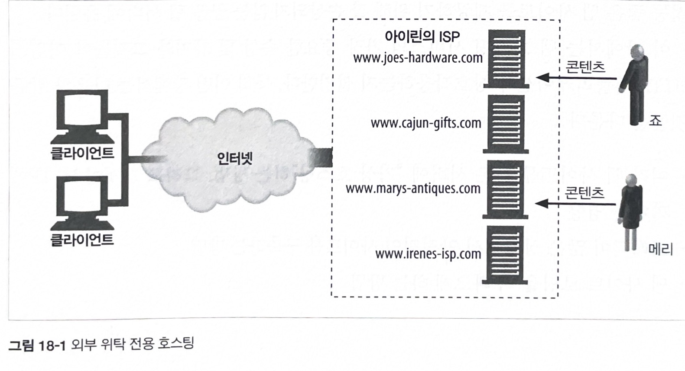
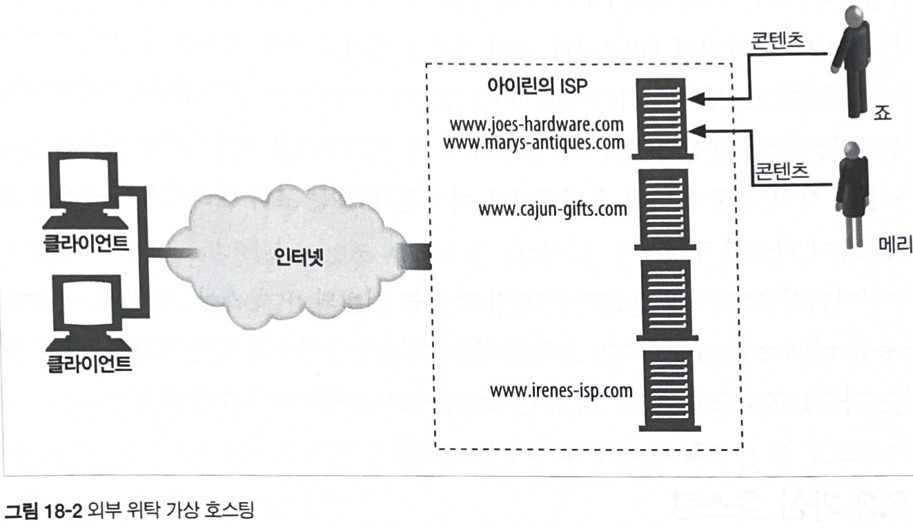
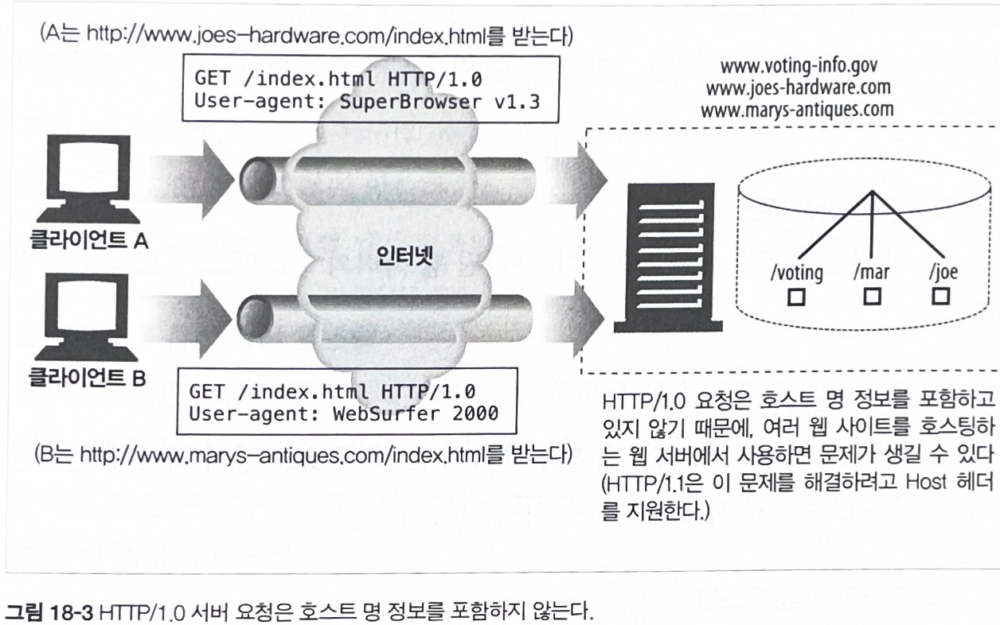
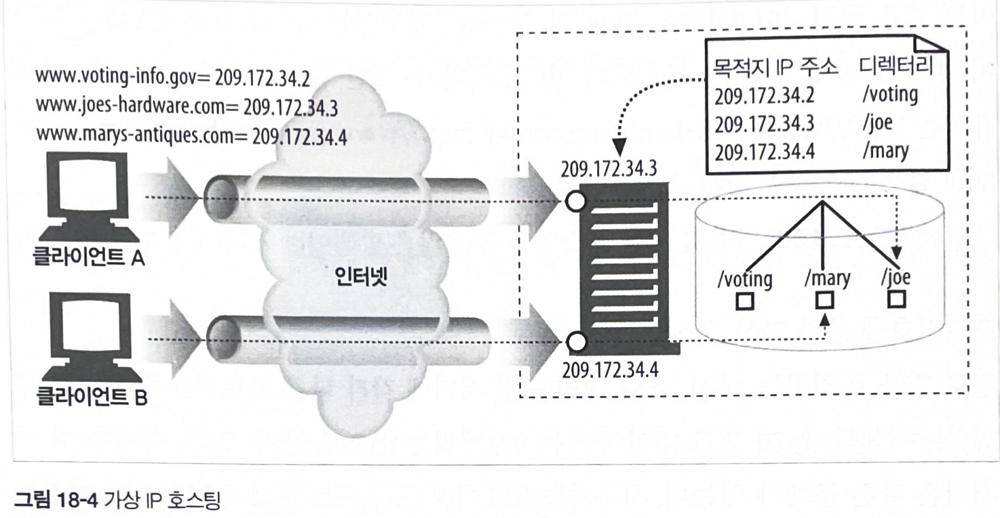
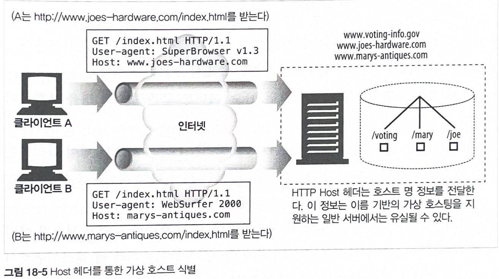
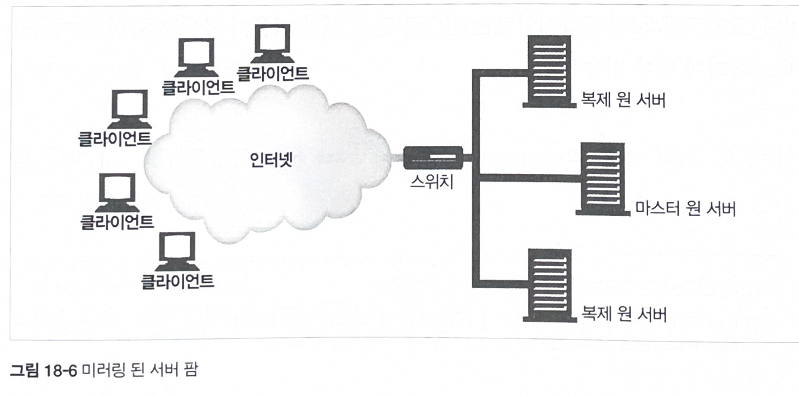
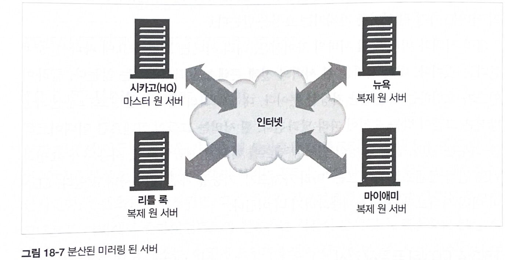
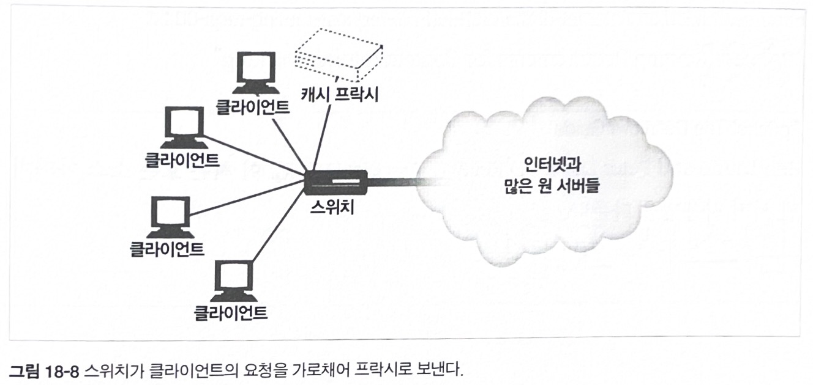

# 18장 웹 호스팅

* 리소스를 공용 웹 서버에 올려놓으면 인터넷을 통해 이용할 수 있다.

* 이 리소스들은 텍스트 파일이나 이미지 같이 단순할 수도 있고, 실시간 내비게이션이나 전자상거래 쇼핑 게이트웨이 같이 복잡할 수도 있다.

* 콘텐츠 리소스를 저장, 중개, 관리하는 일을 통틀어 `웹 호스팅`이라고 한다.

* 이 장에서 배울 내용
    - 웹 호스팅 서비스의 가장 중요한 속성 몇 가지와 그것들이 어떻게 HTTP 애플리케이션과 상호작용 하는지

    1. 여러 웹 사이트를 같은 서버에 "가상 호스팅"하는 방법. 그리고 그것이 HTTP에 끼치는 영향

    2. 트래픽이 많은 상황에서 안정적인 사이트를 구축하는 방법

    3. 웹 사이트 로딩을 더 빠르게 하는 방법

## 18.1 호스팅 서비스

* WWW 초기에는 각 회사가 자체적으로 하드웨어, 네트워크 연결, 웹 서버 소프트웨어를 관리했다.

* 웹이 발전하면서 자원과 시간을 절약하고자, 전문적으로 관리하는 웹 호스팅 서비스를 제공하는 여러 신사업이 만들어졌다.

* 이 장에서는 호스팅 웹 서버가 무엇을 제공하는지에 초점을 맞출 것이다.
    - 웹 사이트가 동작하는 데 필요한 많은 기능은 웹 서버 호스팅의 지원 범위에 따라 달라진다.

### 18.1.1 간단한 예 : 전용 호스팅

* ISP (Internet Service Provider)
    - 인터넷 서비스 제공자

    - 우리나라 예시
        - KT, LG유플러스, SK브로드밴드 등

* 그림 18-1 : 외부 위탁 전용 호스팅

    

    <br>

    * 죠와 메리는 아이린의 ISP가 구매해 유지보수하고 있는 전용 웹 서버를 임대한다.

    * 만약 죠 혹은 메리이 사이트가 유명해지면, 아이린의 ISP는 추가적인 서버를 즉시 제공할 수 있다.

    * 브라우저는 죠가 운영하고 있는 서버의 IP 주소를 가리키는 www.joes-hardware.com 에 HTTP 요청을 하고,   
    메리가 운영하고 있는 서버의 IP 주소를 가르키는 www.marys-antiques.com 에 요청한다.

## 18.2 가상 호스팅

* 많은 웹 호스팅 업자는 컴퓨터 한대를 여러 고객이 공유하게 해서 저렴한 웹 호스팅 서비스를 제공한다.

* 이를 `공유 호스팅` 혹은 `가상 호스팅`이라고 부른다.

* 각 웹 사이트는 다른 서버에서 호스팅하는 것처럼 보이겠지만, 사실은 물리적으로 같은 서버에 호스팅되는 것이다.

* 가상 호스팅은 비용, 공간, 관리에 이점이 있어, 가상 호스팅을 제공하는 업체는 가능한 많은 웹 사이트를 호스팅하려고 한다.
    * 하지만 그것이 PC 한 대에 많은 웹 사이트를 구축한다는 뜻은 아니다.

* 호스팅 업자는 복제 서버 더미(서버 팜)를 만들고 서버 팜에 부하를 분산할 수 있다.

* 팜에 있는 각 서버는 다른 서버를 복제한 것이며, 수많은 가상 웹 사이트를 호스팅하고 있기 때문에 관리자는 훨씬 편해진다.

* 그림 18-2 : 외부 위탁 가상 호스팅

    

    <br>
    
    - 죠와 메리가 웹 서버를 구축해야 할 정도로 트래픽이 올라가기 전까지는 비용을 절약하려고 가상 호스팅을 이용할 것이다.

### 18.2.1 호스트 정보가 없는 가상 서버 요청

* HTTP/1.0 명세는 공용 웹 서버가 호스팅하고 있는 가상 웹 사이트에 누가 접근하고 있는지 식별하는 기능을 제공하지 않는다.

* 그림 18-3 : HTTP/1.0 서버 요청은 호스트 명 정보를 포함하지 않는다.

    

    <br>

    - 웹 서버는 사용자가 어떤 웹 사이트로 접근하려고 하는지 아는데 필요한 정보가 충분하지 않다.

    - 두 요청이(서로 다른 웹 사이트에) 완전히 다른 문서를 요청을 하더라도, 요청 자체는 똑같이 생겼다.

    - 문제는 웹 사이트 호스트 정보가 요청에서 제가된다는 것이다.

    - HTTP/1.1 은 이 문제를 해결하려고 Host 헤더를 지원한다.

### 18.2.2 가상 호스팅 동작하게 하기

* URL 경로를 통한 가상 호스팅
    
    - 서버가 어떤 사이트를 요청하는 것인지 알 수 있게 URL에 특별한 경로 컴포넌트를 추가한다.

    - 예시
        * "GET/joe/index.html"은 죠의 컴퓨터 가게에 대한 요청이다.
        
        * "GET/mary/index.html"은 메리의 골동품 가게에 대한 요청이다.

        * 일반적으로, URL 기반의 가상 호스팅은 좋지 않는 방법이라 거의 사용하지 않는다.

<br>

* 포트번호를 통한 가상 호스팅

    - 각 사이트에 다른 포트번호를 할당하여, 분리된 웹 서버의 인스턴스가 요청을 처리한다.

    - 예시
        * 죠 : 82
        
        * 메리 : 83

        * 이 해결책은 같은 문제가 있는데, 사용자는 URL에 비표준 포트를 쓰지 않고서도 리소스를 찾길 원하기 때문이다.

<br>

* IP 주소를 통한 가상 호스팅

    - 각 가상 사이트에 별도의 IP 주소를 할당하고 모든 IP 주소를 장비 하나에 연결한다.

    - 웹 서버는 IP 주소로 사이트 이름을 식별한다.

    - 그림 18-4 : 가상 IP 호스팅
    
    

    <br>

    - 가상 IP 잘 동작하지만, 규모가 아주 큰 호스팅 업자에게는 어려운 문제를 안겨 준다.
        - 장비의 IP 개수 제한, 충분하지 않는 가상 IP 주소, 부하 균형

    - 가상 IP 호스팅은 위와 같은 IP 주소 부족 문제가 생길 수도이 있음에도 불구하고 널리 쓰이는 방식이다.

* Host 헤더를 통한 가상 호스팅

    - 그림 18-4 : Host 헤더를 통한 가상 호스트 식별

    


### 18.2.3 HTTP/1.1 Host 헤더

* Host 헤더는 RFC 2068에 정의되어 있는 HTTP/1.1 요청 헤더다.

* 가상 서버는 매우 흔하기 때문에 대부분의 HTTP 클라이언트가 HTTP/1.1 과 호환되지 않더라도, Host 헤더는 구현한다.

#### 문법과 사용 방법

* Host 헤더에는 원본 URL에 있는 요청 리소스에 대한 인터넷 호스트와 포트번호를 기술한다.

```
Host = "Host" ":"호스트[ ":"포트 ]
```

## 18.3 안정적인 웹 사이트 만들기

* 웹 사이트에 장애가 생기는 몇 가지 상황이 있다.

    - 서버 다운
    
    - 트래픽 폭증
    
    - 네트워크 장애나 손실

### 18.3.1 미러링 된 서버 팜

* 서버 팜은 서로 대신할 수 있고 식별할 수 있게 설정된 웹 서버들의 집합이다.

* 서버 팜의 서버에 있는 콘텐츠들은 한 곳에 문제가 생기면 다른 한 곳에서 대신 전달할 수 있게 미러링 할 수 있다.

* 그림 18-6 : 미러링된 서버 팜

    

    <br>

    - 마스터 원 서버는 복제 원 서버에 콘텐츠를 보낼 책임이 있다.

    - 외부에서 볼 때, 이 콘텐츠를 가리키는 IP 주소는 스위치의 IP 주소다.

    - 스위치는 서버에게 요청을 전송해야 하는 책임이 있다.

* 그림 18-7 : 분산된 미러링 된 서버

    
    
    <br>
    
    - 미러링 된 웹 서버는 다른 위치에 있는 콘텐츠와 정확히 같은 복제본이 있다.

    - 시카고에 마스터 서버가 있고 뉴욕, 마이애미, 리틀 록에 복제 서버로 구성된 네 개의 미러링 서버가 있다.

    - 마스터 서버는 시카고 지역에 있는 클라이언트에게 콘텐츠를 제공하면서 복제 서버들에게 콘텐츠를 퍼트리는 일을 한다.

* 그림 18-7 의 시나리오에서는, 클라이언트의 요청이 특정 서버로 가는 두 가지 방법이 있다.

    1. HTTP 리다이렉션
        - 콘텐츠에 대한 URL은 마스터 서버의 IP를 가리키고, 마스터 서버는 요청을 받는 즉시 복제 서버로 리다이렉트시킨다.
    
    2. DNS 리다이렉션
        - 콘텐츠의 URL은 네 개의 IP 주소를 가리킬 수 있고, DNS 서버는 클라이언트에게 전송할 IP 주소를 선택할 수 있다.


### 18.3.2 콘텐츠 분산 네트워크

* 콘텐츠 분산 네트워크(CDN)는 특정 콘텐츠의 분산을 목적으로 하는 단순한 네트워크이다.

* 네트워크의 노드는 서버, 대리 서버, 혹은 프락시 서버가 될 수 있다.

### 18.3.3 CDN의 대리 캐시

* 대리 캐시는 그림 18-6 과 18-7 에 있는 복제 원 서버를 대신해 사용될 수 있다.

* 리버스 프락시라고도 불리는 대리 서버는 미러링 된 웹 서버처럼 콘텐츠에 대한 요청을 받는다.
    
### 18.3.4 CDN의 프락시 캐시

* 프락시 캐시는 그림 18-6, 18-7 같이 설정해 배포할 수 있다.

* 대리 서버와는 다르게, 전통적인 프락시 캐시는 어떤 웹 서버 요청이든지 다 받을 수 있다.

* 하지만 대리 서버를 사용하면, 프락시 캐시의 콘텐츠는 요청이 있을 때만 저장될 것이고 원본 서버 콘텐츠를 정확히 복제한다는 보장이 없다.

* 그림 18-8 : 스위치가 클라이언트의 요청을 가로채어 프락시로 보낸다.

    


## 18.4 웹 사이트 빠르게 만들기

* 서버 팜이나 분산 프락시 캐시나 대리 서버는 혼잡을 조절하고 네트워크 트래픽을 분산시킨다.

* 콘텐츠를 분산시키면, 그 콘텐츠를 사용자에게 더 가깝게 만들어 주므로 콘텐츠를 서버에서 클라이언트로 전송하는 시간이 단축된다.

* 웹 사이트 속도를 높이는 또 다른 접근 방법은 콘텐츠를 인코딩하는 것이다.
