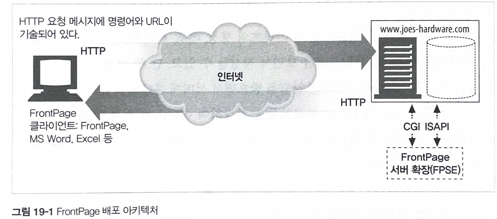
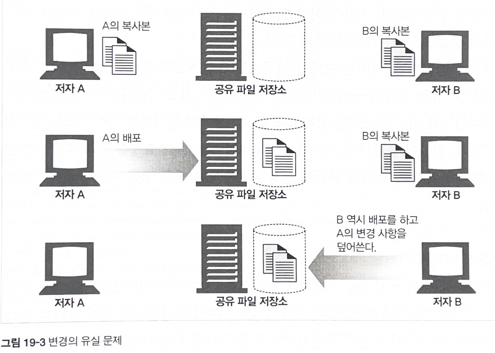

# 19장 배포 시스템

* 웹의 암흑기에는 HTML을 텍스트 편집기에서 수작업으로 개발했고 FTP를 통해 웹 서버에 콘텐츠를 직접 올렸다.
    - 이는 고통스러운 과정이고 동료와 협업하기 어려웠으며 특히 보안에 취약했다.

* 현대의 배포 도구를 이용하면 웹 콘텐츠의 생성, 배포, 관리를 더 쉽게 할 수 있다.

* 많은 종류의 도구가 HTTP 프로토콜을 확장하여 콘텐츠의 원격 배포 기능을 지원한다.

* HTTP에 기반을 둔 웹 콘텐츠 배포 기술은 `FrontPage` 와 `DAV` 가 있다.


## 19.1 배포 지원을 위한 FrontPage 서버 확장

* FrontPage(FP)는 다양한 기능을 제공하는 마이크로소프트사의 웹 개발 및 배포 도구 집합이다.

* 웹 사이트 관리와 제작을 모두 할 수 있는 제품이었다.

### 19.1.1 FrontPage 서버 확장

* "어디서든 배포한다" 라는 전략의 하나로, 마이크로소프트는 FrontPage 서버 확장 (FrontPage Server Extensions, FPSE)이라는 서버 측 소프트웨어 제품군을 출시했다.

* 서버 측 컴포넌트는 웹 서버와 통합되어 웹 사이트와 FrontPage를 구동시키는 클라이언트 사이에서 필요한 변환 작업을 수행한다.

* FrontPage 배포 프로토콜은 HTTP POST 요청 위에 RPC 계층을 구현했다.

* 이를 이용하면 웹 사이트에 있는 문서를 갱신하고, 검색을 수행하고, 웹 개발자들 간에 공동 작업을 할 수 있게 FrontPage 클라이언트가 서버에 명령을 보낼 수 있다.

* 그림 19-1 : FrontPage 배포 아키텍처

    

    * 웹 서버는 FPSE에 맞춘 POST 요청을 받아 처리한다.

    * 클라이언트와 서버 사이에 방화벽과 프락시 서버가 있더라도 POST 메서드 통신만 할 수 있으면 FrontPage는 서버와 통신을 계속할 수 있다.

### 19.1.2 FrontPage 용어

용어|내용
---|---
가상서버|웹 서버 한 개에서 웹 사이트 여러 개를 호스팅하며, 각 사이트는 브라우저에서 자체 전용 서버가 있는 것 처럼 보인다.
루트 웹| 보통 웹 서버의 최상위 콘텐츠 디렉터리, 다중 호스팅 환경에서 가상 웹 서버의 최상위 콘텐츠 디렉터리
서브 웹|루트 웹의 하위 디렉터리, 완전한 FPSE 확장 웹인 다른 서브웹의 하위 디렉터리

### FrontPage

1. 클라이언트는 한 서버의 여러 사이트 중에서 요청을 보낼 대상을 결정해야 한다. 이를 위해 GET 요청을 보낸다.

2. GET 요청의 응답이 오면 FPShtmlScriptUrl, FPAuthorScriptUrl,FPAdminScriptUrl 등 값을 통해 프로그램이 어디에 위치하고 있는지 알 수 있다.

3. 클라이언트는 method=<command> 형식으로 RPC 명령을 보낸다.

    ```
    method=list+documents:4.0.1.3717
    &service_name= // URL
    &listHiddenDocs=false
    listExplorerDocs=false
    .....
    ```

    * service_name
        - 메서드가 수행되어야 하는 웹 사이트의 URL.
    * listHiddenDocs
        - true : 숨겨진 문서가 보인다.
        - false : 숨겨진 문서 X
    * listExploreDocs
        - true : 태스크 리스트를 나열한다.

4. 서버는 특정 형식에 맞추어 응답을 보낸다.

### 19.1.4 FrontPage 보안 모델

* 보안은 서버에서 관리한다.

* 사용자를 관리자, 저작자, 브라우징하는 일반 사용자 세 등급으로 나눈다.

* 서브 웹은 루트 웹에서 권한을 상속받거나 자체 권한을 만든다.

* 설정 파일에 사용자의 권한(GET/POST/...), 그룹, IP 주소 등을 지정할 수 있다.

## 19.2 WebDAV와 공동 저작

* 웹 분산 저작과 버저닝 (Web Distributed Authoring and Versioning, WebDAV)의 줄임말이다.

* 현재는 svn, git은 높은 수준의 협업 기능을 제공하지만, 과거에는 협업 관련 기술 수준이 낮았다.

* 과거에는 대게 이메일을 사용하거나 분산 파일 공유를 함께 사용하여 프로세스에 대한 제어를 거의 할 수 없었다.


### 19.2.2 WebDAV 와 XML

* HTTP는 보통 요청과 응답 관련 정보를 메시지 헤더에 담아 전달한다.

* 위에 문제를 해결하기위해 WebDAV는 XML(Extensible Markup Language)을 지원한다.

* XML은 구조화된 데이터를 표현할 떄 사용하는 포맷으로, 메타 마크업 언어다.

* WebDAV는 XML을 다음과 같은 용도로 사용한다.
    
    - 데이터를 어떻게 처리할 것인지 설명하는 명령 포맷

    - 서버의 복잡한 응답을 표현하는 데 사용하는 포맷

    - 콜렉션과 리소스를 처리하는 데 사용하는 커스텀 정보 포맷

    - 데이터 자체를 표현할 수 있는 유연한 포맷

    - 대부분의 국제화 관련 문제에 대한 훌륭한 해결책

### 19.2.3 WebDAV 헤더

* WebDAV는 새로운 메서드들의 기능을 더 넓혖는 여러 HTTP 헤더를 도입했다.
    - DAV, Depth, Destination, If, Lock-Token, Overwrite, Timeout ...

### 19.2.4 WebDAV 잠금과 덮어쓰기 방지

* 공동 작업이란 주어진 문서에 한 명 이상의 사람이 붙어서 작업한다는 뜻이다.

* 그림 19-3 : 공동 작업과 관련한 문제들

    

* 잠금(lock)은 공동 작업시 덮어쓰는 문제를 방지한다.

* WebDAV 에서는 `LOCK` 과 `UNLOCK` 메서드로 지원한다.

    - 배타적 쓰기 잠금 : 잠금 소유자만 쓸 수 있다. 잠재적인 충돌을 완벽히 제거한다.

    - 공유적 쓰기 잠금 : 그룹 단위(여러 사람이 하나의 그룹을 구성) 하나의 문서를 쓴다.

### 다양한 메서드

* 더 자세한 기능에 대해서는 생략

### 19.2.16 WebDAV의 미래

* 현재도 잘 지원되고 있다. (~ 2002년)