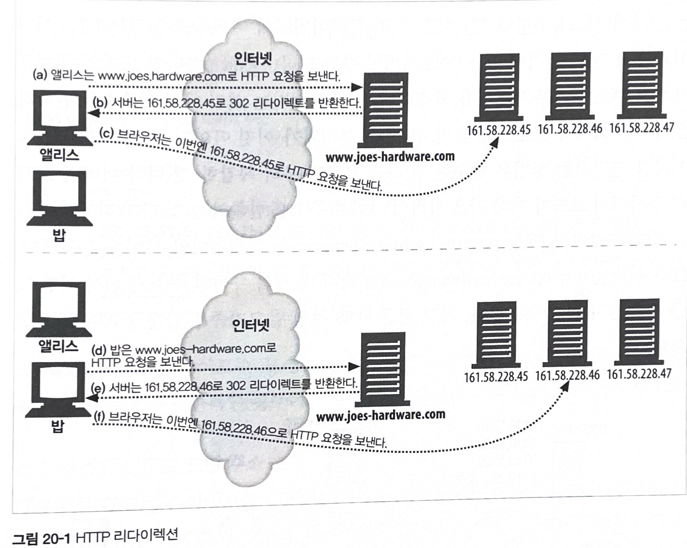
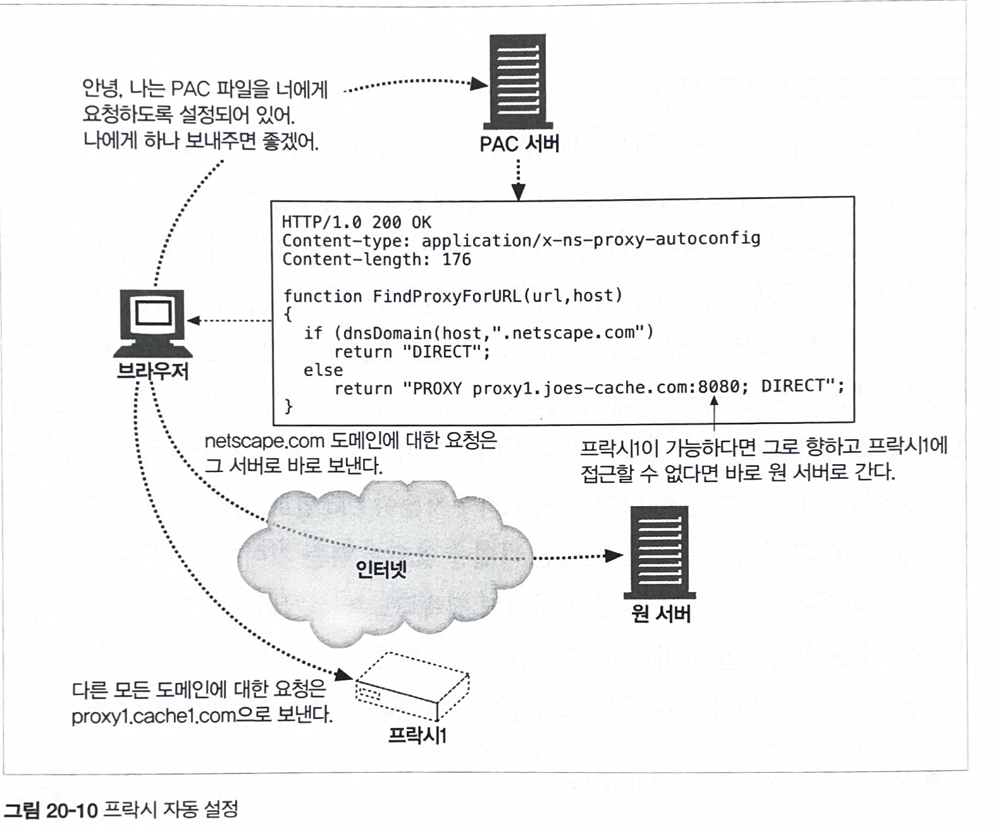

# 20장 리다이렉션과 부하 균형

* 웹에서 HTTP는 혼자가 아니다.

* HTTP 메시지의 데이터는 여정 중에 많은 프로토콜에 의해 통제된다.

* HTTP가 고려하는 것은 오직 출발지(송신자)와 목적지(수신자)뿐이지만, 미러링된 서버, 웹 프락시, 캐시가 함께 하는 웹의 세계에서 HTTP 메시지의 목적지는 항상 단순하지만은 않다.

* 이 장은 리다이렉션 기술 (HTTP 메시지의 최종 목적지를 결정하는 네트워크 도구, 기법, 프로토콜)에 대한 장이다.

* 리다이렉션 기술은 보통 메시지가 프락시, 캐시, 서버 팜의 특정 웹 서버 중 어디에서 끝나는지 판별하기 위해 사용한다.

* 리다이렉션 기술은 클라이언트의 메시지를 명시적으로 요청하지 않은 곳으로 보낼 수 있다.

## 20.1 왜 리다이렉트인가?

* 리다이렉션은 현대의 웹에서는 불가피한 현실이다.

* 왜냐하면 HTTP 애플리케이션은 언제나 다음 세 가지를 원하기 때문이다.

    - 신뢰할 수 있는 HTTP 트랜잭션의 수행

    - 지연 최소화

    - 네트워크 대역폭 절약

* 이러한 이유들로, 웹 콘텐츠는 흔히 여러 장소에 배포한다.
    - 한 곳에서 실패할 경우 다른 곳을 이용할 수 있으므로 신뢰성이 개선된다.

    - 클라이언트가 보다 가까운 리소스에 접근할 수 있게 되어 응답시간도 줄여준다.

    - 목적지 서버가 분산되므로 네트워크 혼잡도 줄어든다.

## 20.2 리다이렉트 할 곳

* 클라이언트에게 있어 서버, 프락시, 캐시, 게이트웨이는 모두 서버라고 할 수 있다.

* 서버, 프락시, 캐시, 게이트웨이가 모두 공통적으로 서버의 특성을 갖고 있기 때문에, 많은 리다이렉션 기법이 그들 모두에서 동작한다.

## 20.3 리다이렉션 프로토콜의 개요

* 리다이렉션의 목표는 HTTP 메시지를 가용한 웹 서버로 가급적 빨리 보내는 것이다.

* HTTP 메시지가 인터넷을 통해 나아가는 방향은 그 메시지가 오고, 거쳐가고, 향하는 HTTP 애플리케이션과 라우팅 장치에 영향을 받는다.

* 브라우저 설정, DNS, TCP/IP 라우팅, 그리고 HTTP는 모두 메시지를 리다이렉트하는 메커니즘을 제공한다.

## 20.4 일반적인 리다이렉션 방법

### 20.4.1 HTTP 리다이렉션

* 웹 서버들은 다른 곳에 요청을 보내보라고 말해주는 짧은 리다이렉트 메시지를 클라이언트에게 돌려줄 수 있다.

* HTTP 리다이렉션이 갖는 장점 중 하나는 리다이렉트를 하는 서버가 클라이언트의 IP 주소를 안다는 것이다.

* 그림 20-1 : HTTP 리다이렉션

    

    <br>

    1. 앨리스는 www.joes-hardware.com에 요청을 보낸다.

    ```
    GET /hammers.html HTTP/1.0
    Host: www.joes-hardware.com
    User-Agent: Mozilla/4.51 [en] (X11; U; IRIX 6.2 IP22)
    ```

    2. HTTP 상태 코드 200과 함께 웹페이지의 본문을 돌려주는 대신, 서버는 상태 코드 302와 함께 리다이렉트 메시지를 돌려보낸다.

    ```
    HTTP/1.0 302 Redirect
    Server: Stronghold/2.4.2 Apache/1.3.6
    Location: http://161.58.228.45/hammers.html
    ```

    3. 브라우저는 호스트를 161.58.228.45로 하여 리다이렉트 URL을 사용한 다음과 같은 요청을 다시 보낸다.

    ```
    GET /hammers.html HTTP/1.0
    Host: 161.58.228.45
    User-Agent: Mozilla/4.51 [en] (X11; U; IRIX 6.2 IP22)
    ```

    4. 또 다른 클라이언트는 다른 서버로 리다이렉트 될 수 있다., 밥의 요청은 161.58.228.46 으로 리다이렉트 되었다.


* HTTP 리다이렉션은 서버로 향하는 요청의 방향을 변경할 수 있지만, 다음과 같은 단점이 있다.

    - 어떤 서버로 리다이렉트할지 결정할 떄 원 서버는 많은 처리를 해야 한다.
    
    - 페이지에 접근할 때마다 두 번의 왕복이 필요하기 때문에, 사용자가 더 오래 기다리게 된다.

    - 만약 리다이렉트 서버가 고장 나면, 사이트도 고장 난다.

* 이러한 단점 때문에, HTTP 리다이렉션은 보통 몇몇 다른 리다이렉션 기법과 함께 조합하여 사용된다.

    - DNS 리다이렉션

    - 임의 캐스트 어드레싱

    - 아이피 맥 포워딩

    - 아이피 주소 포워딩

    - 네트워크 구성요소 제어 프로토콜 (Network Element Control Protocol, NECP)


## 20.5 프락시 리다이렉션 방법

* 프락시는 클라이언트의 요청을 다른 프락시로 리다이렉트할 수 있다.

    - 예를 들어, 요청 받은 콘텐츠를 갖고 있지 않은 프락시 캐시는 클라이언트를 다른 캐시로 리다이렉트하는 것을 택할 것이다.

    - 이는 클라이언트가 리소스를 요청한 곳과는 다른 곳에서 응답이 오도록 하게 하는 것이다.

### 20.5.1 명시적 브라우저 설정

* 대부분의 브라우저에는 프락시 서버에 접촉하기 위해 프락시 이름, 아이피 주소, 포트번호를 설정할 수 있는 풀다운 메뉴가 존재한다.

* 사용자가 이를 설정하면 브라우저는 모든 요청에 대해 프락시와 접촉한다.

* 몇몇 서비스 제공자들은 사용자들이 직접 브라우저의 설정을 변경해서 프락시를 사용하도록 하는 대신, 미리 설정이 다 되어 있는 브라우저를 다운 받도록 한다.

* 이렇게 다운 받은 브라우저들은 접촉할 프락시의 주소를 알고 있다.

* 명시적인 브라우저 설정에는 두 가지 중요한 단점이 있다.

    1. 프락시를 사용하도록 설정된 브라우저들은 프락시가 응답하지 않더라도 원 서버와 접촉하지 않는다.  
    만약 프락시가 다운되었거나 브라우저가 잘못 설정되었다면, 사용자는 접속 문제를 경험할 것이다.

    2. 네트워크 아키텍처를 번경했을 때 그 변경사항을 모든 최종 사용자에게 전파하는 것이 어렵다.

### 20.5.2 프락시 자동 설정 (Proxy Auto-Configuration, PAC)

* PAC는 넷스케이프 사에 의해 정의되었으며, 거의 모든 브라우저가 지원한다.

* PAC의 기본 아이디어는, 브라우저들이 URL 별로 접촉해야 할 프락시를 지정한 PAC 파일을 찾도록 하는 것이다.

* 브라우저는 반드시 PAC 파일을 얻기 위해 지정된 서버에 접촉하도록 설정되어야 한다.

* 그런 뒤에 브라우저는 재시작할 때마다 PAC 파일을 가져온다.

* 그림 20-10 : 프락시 자동 설정

    

<br>

* PAC 프로토콜은 상당히 강력하다.

* 오늘날 PAC는 미리 설정된 브라우저처럼 몇몇 주요 ISP들에 의해 사용되고 있다.

### 20.5.3 웹 프락시 자동발견 프로토콜 (Web Proxy Autodiscovery Protocol)

* 웹 프락시 자동발견 프로토콜은 웹 브라우저가 근처의 프락시를 찾아내어 사용할 수 있게 해주는 방법을 제공하는 것을 목적으로 하고 있다.

## 20.7 인터넷 캐시 프로토콜

* 인터넷 캐시 프로토콜(ICP)는 캐시들이 형제 캐시에서 일어난 캐시 적중을 찾아볼 수 있도록 해준다.

* 만약 캐시가 HTTP 메시지에서 요청한 콘텐츠를 갖고 있지 않다면, 캐시는 근처의 형제 캐시 중 그 콘첸츠를 갖고 있는 것이 있는지 찾아보고 만약 있다면 원 서버에 질의하는 것보다 비용이 더 들지 않을 것을 기대하며 그 캐시에서 콘텐츠를 가져온다.

## 20.8 캐시 배열 라우팅 프로토콜

* 프락시 서버는 사용자 개개인으로부터 요청을 가로채어 요청한 웹 캐시의 캐시된 사본을 제공함으로써 인터넷으로 향하는 트래픽을 대폭 줄여둔다.

* 그러나 사용자의 증가에 따라, 대량의 트래픽은 프락시 서버 자체에 과도한 부하를 줄 수 있다.

* 이 문제에 대한 해결책 중 하나는 부하를 분산하기 위해 사용하는 프락시 서버를 여러 대로 늘리는 것이다.

* 캐시 배열 라우팅 프로토콜 (CARP)은, 프락시 서버의 배열이 클라이언트의 시점에서는 마치 하나의 논리적인 캐시처럼 보이도록 관리해주는, 마이크로소프트와 넷스케이프 커뮤니케이션이 제안한 표준이다.

## 20.9 하이퍼텍스트 캐싱 프로토콜 (Hyper Text Caching Protocol, HTCP)

* 형제들이 URL과 모든 요청 및 응답 헤더를 사용하여 서로에게 문서의 존재 여부에 대한 질의를 할 수 있도록 해줌으로써 적중이 아님에도 적중으로 잘못 처리된 확률을 줄인다.

* 더 나아가, HTCP는 형제 캐시들이 서로의 캐시 안에 있는 선택된 문서의 추가 및 삭제를 모니터링하고 요청할 수 있게, 그리고 서로의 캐시된 문서에 대한 캐싱 정책을 변경할 수 있게 해준다.


