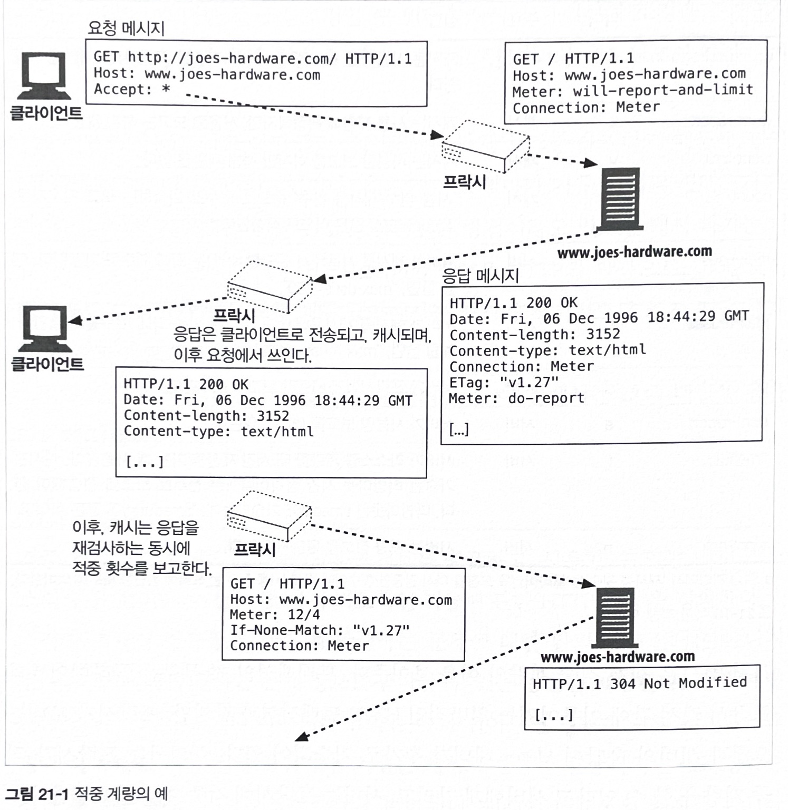

# 21장 로깅과 사용 추적

* 거의 모든 서버와 프락시는 처리했던 HTTP 트랜잭션을 요약해서 기록해 놓는다.

* 그 이유는 여러 가지다.
    - 사용 추적
    - 보안
    - 청구
    - 에러 탐지

## 21.1 로그란 무엇인가?

* 로깅을 하는 이유는 두 가지다.
    1. 서버나 프락시의 문제 찾기

    2. 웹 사이트 접근 통계

* HTTP 트랜잭션의 모든 헤더를 로깅할 수는 있지만, 하루에 수 많은 트랙잭션을 처리하기에 서버나 프락시가 감당하기 힘들다.

* 보통 트랜잭션의 기본적인 항목들만 로깅한다.

    - HTTP 메서드
    - 클라이언트와 서버의 HTTP 버전
    - 요청받은 리소스의 URL
    - 응답의 HTTP 상태 코드
    - 요청과 응답 메시지의 크기
    - 트랜잭션이 일어난 시간
    - Referer와 User-Agent 헤더 값

## 21.2 로그 포맷

### 21.2.1 일반 로그 포맷 (Common Log Format)

* 많은 서버가 이 로그 포맷을 기본으로 사용한다.

필드 | 설명
---|---
remotehost|요청한 컴퓨터의 호스트 명 혹은 IP 주소
username|ident 검색을 수행했다면, 인증된 요청자의 사용자 이름이 있다
auth-username|인증을 수행했다면, 인증된 요청자의 이름이 있다
timestamp|요청 날짜와 시간
request-line|HTTP 요청의 행을 그대로 기술한다
response-code|응답으로 보내는 HTTP 상태 코드
response-size|응답 엔터티의 Content-Length. 응답으로 아무런 엔터티도 반환하지 않으면 값이 0이 된다.

### 21.2.2 혼합 로그 포맷(Combined Log Format)

* 아파치 같은 서버들이 지원한다.

* 일반 로그 포맷에서 Referer 필드와 User-Agent 필드가 추가 되었다.

필드|설명
---|---
Referer|Referer HTTP 헤더의 값
User-Agent|User-Agent Referer HTTP 헤더의 값

### 21.2.3 넷스케이프 확장 로그 포맷

* 프락시나 웹 캐시 같은 HTTP 애플리케이션과 연관이 있는 여러 환경을 지원하려고 포맷을 확장했다.

필드|설명
---|---
proxy-response-code|트랜잭션이 프락시를 거칠 경우, 서버에서 프락시로의 HTTP 응답코드
proxy-response-size|트랜잭션이 프락시를 거칠 경우, 서버가 프띿에 전달하는 응답 엔터티의 Content-Length
client-request-size|클라이언트가 프락시로 보내는 요청의 본문이나 엔터티의 Content-Length
proxy-request-size|트랜잭션이 프락시를 거칠 경우, 프락시가 서버로 보내는 요청의 본문이나 엔터티의 Content-Length
client-request-hdr-size|클라이언트 요청 헤더의 바이트 길이
proxy-response-hdr-size|트랜잭션이 프락시를 거칠 경우, 프락시가 요청자에게 보내는 응답 헤더의 바이트 길이
proxy-request-hdr-size|트랜잭션이 프락시를 거칠 경우, 프락시가 서버로 전송하는 요청 헤더의 바이트 길이
server-response-hdr-size|서버 응답 헤더의 바이트 길이
proxy-timestamp|트랜잭션이 프락시를 거칠 경우, 요청과 응답이 프락시를 통해 오가는 총 시간(초 단위)

### 21.2.4 넷스케이프 확장 2 로그 포맷

* HTTP 프락시와 웹 캐시 에플리케이션과 관련한 더 많은 정보를 포함한다.

필드|설명
---|---
route|프락시가 클라이언트에 요청을 만드는 데 사용하는 경로
client-finish-status-code|클라이언트의 종료 상태 코드로, 클라이언트가 프락시로 보낸 요청이 성공적으로 완료(FIN) 되었는지 혹은 인터럽트(INTR)에 걸렸는지 기술한다.
proxy-finish-status-code|프락시의 종료 상태 코드로, 프락시가 서버로 보낸 요청이 성공적으로 완료(FIN)되었는지 혹은 인터럽트(INTR) 기술한다.
cache-result-code|캐시 결과 코드로, 캐시가 요청에 어떻게 응답했는지 기술한다.

### 21.2.5 스퀴드(Squid) 프락시 로그 포맷

* 스퀴드 프락시 캐시는 웹 분야에서 권위 있는 프로젝트다.

* 스퀴드는 수년간 오픈 소스 커뮤니티를 통해 확장 및 개선되어 온 프로젝트다.

* 그리고 스퀴드 애플리케이션을 관리하는 데 도움이 되는 수 많은 도구들이 개발되었다.

* 많은 차세대 프락시 캐시들이 이러한 도구를 활용하려고 자체 로그 포맷으로 스퀴드 포맷을 적용했다.

필드|설명
---|---
timestamp|요청이 도착한 시간을 GMT 1970년 1월 1일을 기준으로 지난 시간을 초 단위로 기술.
time-elapsed|요청과 응답이 프락시를 통해 오고간 총 시간을 밀리초로 기술.
host-ip|클라이언트(요청자)의 호스트 장비 IP 주소
result-code/status|result 필드에는 이 요청에 프락시가 어떤 일을 했는지 스퀴드 방식으로 기술된다. code 필드는 프락시가 클라이언트에 보낸 HTTP 응답 코드다.
size|프락시가 클라이언트에게 보낸 HTTP 응답 헤더와 본문을 포함한 응답의 길이가 바이트 단위로 기술된다.
method|클라이언트 요청의 HTTP 메서드
url|클라이언트 요청의 URL
rfc931-ident|클라이언트에 인증된 사용자 이름
hierachy/from|넷스케이프 포맷에 있는 경로(route) 필드 길이. hierarchy 필드에는 프락시가 클라이언트로 요청을 보내면서 거친 경로를 기술한다. from 필드는 프락시가 요청을 만들게한 서버의 이름을 기술한다.
content-type|프락시 응답 엔터티의 Content-Type.

## 21.3 적중 계량하기

* 원 서버는 결산을 하기 위해 상세 로그를 저장한다.

* 클라이언트와 서버 사이에 캐시가 있어서, 많은 요청이 서버까지 오지 않고 캐시되어 있는 리소스로 처리되고 끝난다.
    - 결국 로그 파일에 누락을 발생시킨다.

    - 로깅을 위해 캐시를 파기시키는 것은 요청에 대한 응답 속도를 느리게하고, 원 서버와 네트워크의 부하를 가중시킬 것이다.

* 적중 계량 (Hit Metering) 규약은 HTTP의 확장으로, 문제의 해결책으로 제시되었다.

* 적중 계량 규약에서는 캐시가 정기적으로 캐시 접근 통계를 원 서버에 보고하도록 한다.

* 그림 21-2 : 적중 계량의 예

    

### 21.3.1 개요

* 적중 계량 규약은 캐시와 서버가 접근 정보를 공유하고, 사용할 수 있는 캐시 리소스의 양을 제어할 수 있는 몇 가지 기초적인 기능에 관한 HTTP 확장을 정의한다.

* 적중 계량은 완벽한 해결책은 아니지만, 서버가 원하는 통계 정보를 받아볼 수 있는 방법을 제공한다.

### 21.3.2 Meter 헤더

* 적중 계량 확장은 Meter라는 새로운 헤더를 추가했다.

## 21.4 개인 정보 보호에 대해

* 로깅은 관리자와 개발자에게 매우 유용한 도구지만 로깅을 당하는 사용자들의 인지나 허가가 없으면 로깅이 사생활 침해가 된다는 것을 유념해야 한다.

