# 22장 핵심 정리

* 1장 `HTTP 개관`부터 21장 `로깅과 사용 추적` 까지 배운 내용을 토대로 핵심을 정리하는 장입니다.

* 가장 핵심적인 내용만 다루며, 이번 장에서 배울 내용은 1장 HTTP 개관을 토대로 작성했습니다.

# 1. HTTP (하이퍼텍스트 전송 프로토콜, Hypertext Transfer Protocol)

* 프로토콜 (Protocol) : 컴퓨터나 원거리 통신 장비 사이에서 메시지를 주고 받는 양식과 규칙의 체계입니다. (약속, 규약)

*  전 세계의 웹 브라우저, 서버, 웹 어플리케이션은 모두 `HTTP`를 통해 서로 대화합니다.

* HTTP는 JPEG, HTML, Text, MPEG, WAV, 음성 파일 등 다양한 멀티미디어 데이터를 신뢰성 있게 전송할 수 있는 프로토콜입니다.

## 1-1. 웹 클라이언트와 서버

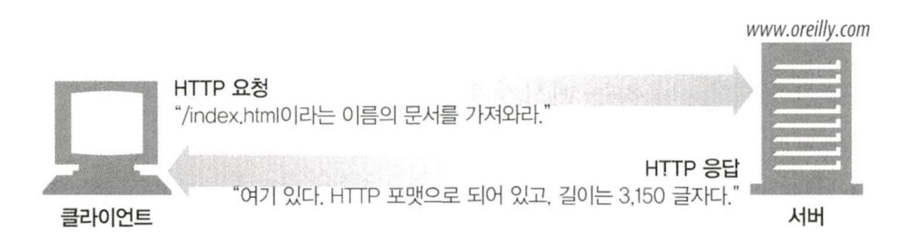

 

- 웹 클라이언트

    - 웹 서버에게 `HTTP 요청`을 보냅니다. (Request)

    - 가장 흔한 클라이언트는 웹 브라우저입니다. (크롬, 사파리 등)

    - 웹 브라우저는 서버에게 HTTP 객체를 요청하고 사용자의 화면에 보여줍니다.

 

- 웹 서버
    - 웹 클라이언트에게 `HTTP 응답`을 보냅니다. (Response)

    - HTTP 서버라고 불립니다.

    - 웹 서버는 인터넷의 데이터를 저장하고 HTTP 클라이언트가 요청한 데이터를 제공(응답)합니다.

## 1-2. 리소스 (Resource)

* 웹 서버는 웹 리소스를 관리하고 클라이언트에게 제공합니다.

* 어떤 종류의 콘텐츠 소스도 리소스가 될 수 있고, 가장 단순한 웹 리소스는 웹 서버 파일 시스템의 정적 파일입니다.
    
    - text, HTML 파일, JPEG $\cdots$

### 미디어 타입 (MIME, Multipurpose Internet Mail Extensions, 다목적 인터넷 메일 확장)

* 인터넷은 수천 가지 데이터 타입을 다루기 때문에, HTTP는 웹에서 전송되는 객체 각각에 `MIME 타입` 이라는 데이터 포맷 라벨을 붙입니다.

* MIME 타입은 사선(/) 으로 구분된 주 타입과 부타입으로 이루어진 문자열 라벨입니다.

* MIME 타입 예시

    - Content-Type: 주 타입/부타입
    
    - www.naver.com의 시작화면 기사의 사진

    
    

### URI (Uniform Resourse Identifier)

* `URI` : 통합 자원 식별자

* 웹 서버 리소스는 각자 이름을 갖고 있고, 클라이언트는 관심 있는 리소스를 지목할 수 있습니다.

* URI는 인터넷의 우편물 주소 같은 것으로, 정보 리소스를 고유하게 식별하고 위치를 지정할 수 있습니다.
    
* URI 에는 두 가지가 있는데, `URL` 과 `URN` 입니다.
    - 이 장에서는 URL만 다루겠습니다.

### URL (Uniform Resource Locator)

* `URL` : 통합 자원 지시자 

* 리소스 식별자의 가장 흔한 형태입니다.

* URL은 특정 서버의 한 리소스에 대한 구체적인 위치를 서술합니다.

* URL 예시

    - 위 MIME 타입의 그림 URL
    
    
    
    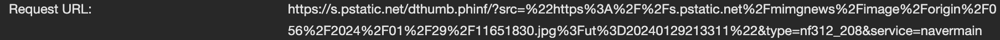

 

* 대부분의 URL은 세 부분으로 이루어진 표준 포맷을 따릅니다.

     

    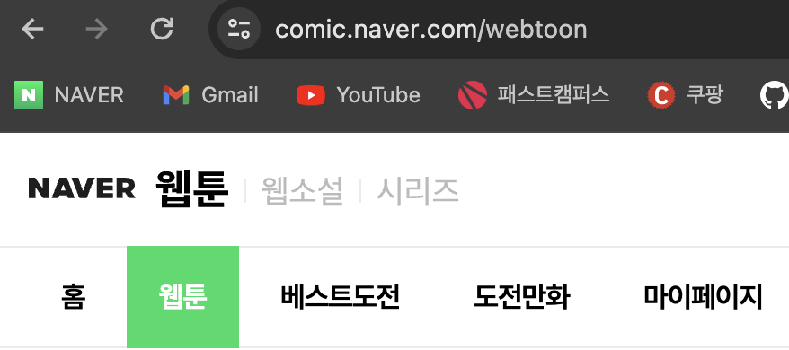
    

    |컴포넌트|설명|예시|
    |---|---|---|
    스킴|리소스를 가져오려면 어떤 프로토콜을 사용하여 서버에 접근해야 하는지 가리킨다.|https
    호스트|리소스를 호스팅하는 서버의 호스트명이나 IP 주소|www.comic.naver.com
    경로|빗금(/)으로 구분되어 있으며, 서버 내 리소스가 서버 어디에 있는지를 가리킨다.|/webtoon
    
     

    * 경로 / webtoon $\rightarrow$ / index로 바뀌었을 때

    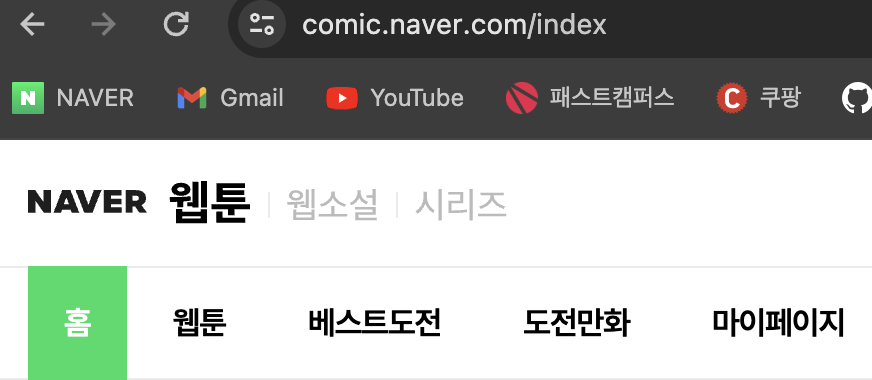

## 1-3 트랜잭션

* 위 2-1에서 웹 클라이언트와 웹 서버가 어떻게 소통하는지 더 자세히 다룰 것입니다.

* `HTTP 트랜잭션` 은 요청 명령과 응답 결과로 구성되어있습니다.

* 이러한 상호작용은 `HTTP 메시지` 라고 불리는 정형화된 데이터 덩어리를 이용해 이루어집니다.

## 1-4 HTTP 메시지

* HTTP 메시지는 시작줄, 헤더, 본문으로 이루어져있고, 요청 메시지와 응답 메시지로 나눌 수 있습니다.

    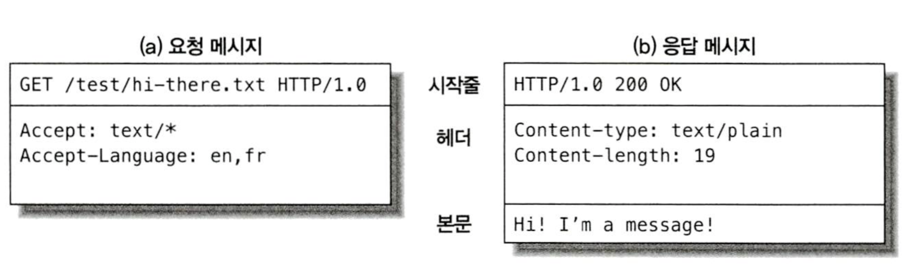

    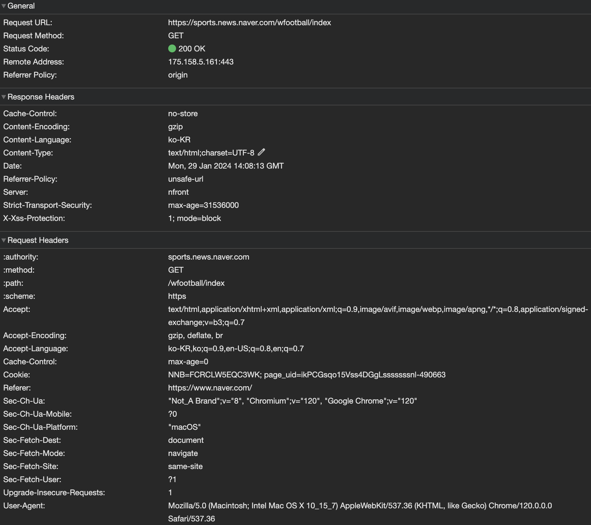

    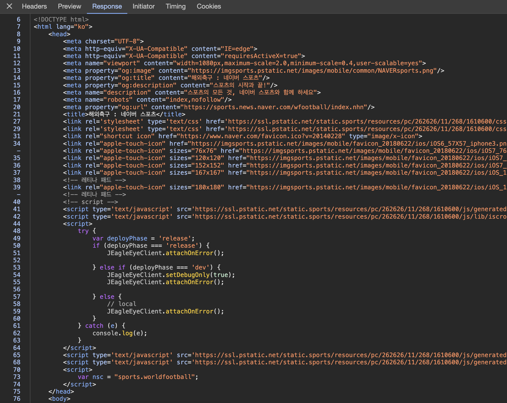

     

    HTTP 메시지의 세 부분 |설명 | 요청 | 응답
    ---|---|---|---
    시작줄|메시지의 첫줄|무엇을 해야하는지|무슨 일이 일어났는지
    헤더|시작줄 다음에는 0개 이상의 헤더 필드가 이어진다. 각 헤더 필드는 쌍점(:)으로 구분되어 있는 하나의 이름과 하나의 값으로 구성된다. 헤더는 빈줄로 끝난다.||
    본문|빈 줄 다음에는 어떤 종류의 데이터든 들어갈 수 있는 메시지 본문이 필요에 따라 올 수 있다.|웹 서버로 데이터를 실어보낸다.|클라이언트로 데이터를 반환한다.
    
* HTTP 메시지의 세 부분 안에는 다음과 같이 이루어져있습니다.

    |HTTP 요청 메시지|HTTP 응답 메시지|
    |---|---|
    HTTP 버전 유형 | HTTP 상태 코드
    URL | HTTP 응답 헤더
    HTTP 메서드 | 선택 사항인 HTTP 본문
    HTTP 요청 헤더
    선택 사항인 HTTP 본문

    
## 1-5 HTTP 요청 메시지의 형식

### HTTP 메서드

* 요청의 시작은 메서드로 시작하며, 서버에게 무엇을 해야 하는지 말해줍니다.

    

* 많이 쓰이는 HTTP 메서드

    메서드|설명
    ---|---
    GET|서버에서 어떤 문서를 가져온다.
    HEAD|서버에서 어떤 문서에 대해 헤더만 가져온다.
    POST|서버가 처리해야 할 데이터를 보낸다.
    PUT|서버에 요청 메시지의 본문을 저장한다.
    TRACE|메시지가 프락시를 거쳐 서버에 도달하는 과정을 추적한다.
    OPTIONS|서버가 어떤 메서드를 수행할 수 있는지 확인한다.
    DELETE|서버에서 문서를 제거한다.

### HTTP 요청 헤더

* HTTP 헤더에는 키값 쌍에 저장된 텍스트 정보가 포함되어 있으며 헤더는 모든 HTTP 요청에 포함됩니다.

* 이러한 헤더는 클라이언트가 사용하는 브라우저 및 요청되는 데이터와 같은 핵심 정보를 전달합니다.

    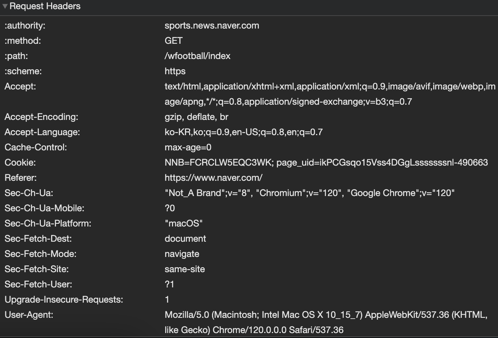

### HTTP 요청 본문

* 요청의 본문은 요청에서 전송되는 정보의 '본문'을 포함하는 부분입니다.

* HTTP 요청의 본문에는 사용자 이름 및 비밀번호 또는 양식에 입력된 기타 데이터와 같이 웹 서버에 제출되는 모든 정보가 포함됩니다.

## 1-6 HTTP 응답 메시지의 형식

### HTTP 상태 코드

* 상태 코드는 서버가 클라이언트에게 무엇이 일어났는지 말해줍니다.

* HTTP 요청이 성공적으로 완료되었는지 여부를 나타내는 데 가장 자주 사용되는 3자리 코드입니다.

    

 

* 상태 코드의 종류

    |전체 범위|정의된 범위|분류
    |---|---|---|
    100-199|100-101|정보
    200-299|200-206|성공
    300-399|300-305|리다이렉션
    400-499|400-415|클라이언트 에러
    500-599|500-505|서버 에러

### HTTP 응답 헤더

* HTTP 요청과 마찬가지로 HTTP 응답에는 응답 본문에서 전송되는 데이터의 언어 및 형식과 같은 중요한 정보를 전달하는 헤더가 함께 제공됩니다.

    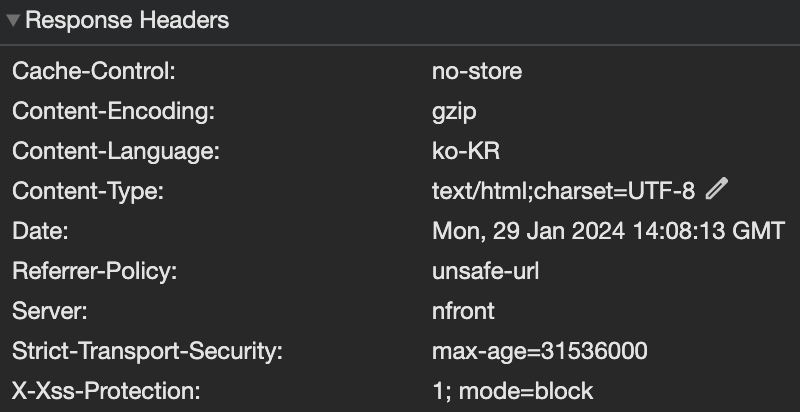

### HTTP 응답 본문

* GET 요청에 대한 성공적인 HTTP 응답에는 일반적으로 요청된 정보가 포함된 본문이 있습니다.

* 메시지의 화물이라고 할 수 있으며, HTTP가 수송하도록 설계된 것들입니다.

* 이미지, 비디오, HTML 문서 등 여러 종류의 데이터를 실어 나를 수 있습니다.

  

# 2. TCP 커넥션

## 2-1. 네트워크의 기본 TCP/IP

* 인터넷을 포함하여 일반적으로 사용하고 있는 네트워크는 `TCP/IP` 라는 프로토콜에서 움직이고 있습니다.

* 컴퓨터와 네트워크 기기가 상호간에 통신하기 위해서는 서로 같은 방법을 통신하지 않으면 안됩니다.

* 예를 들어, 우리가 여행가서 그 나라의 언어를 모를 때 영어를 쓰는 것과 같이 서로 다른 하드웨어와 운영체제 등을 가지고 서로 통신하기 위해서는 모든 요소에 규칙(프로토콜)이 필요하게 됩니다.

* 이러한 규칙 중 인터넷과 관련된 프로토콜들을 모은 것을 TCP/IP 라고 부릅니다.

* TCP/IP 는 `계층(Layer)` 으로 관리됩니다.

    

### TCP/IP 4 계층(Layer)과 각 계층의 역할

* TCP/IP 4계층은 TCP/IP 프로토콜 통신 과정에 초점을 맞추어, OSI 7계층을 좀 더 단순화 시킨 계층을 의미합니다.

* 계층으로 구분하는 이유

    - 각 계층별 처리 역할이 다르기 때문에, 계층별 간섭을 최소화할 수 있습니다.

    - 특정 계층에서 문제가 생기면, 해당 계층을 살펴보면 되기 때문에, 유지 보수가 편리합니다.

* 각 계층 별 역할

    |계층|TCP/IP|역할|주요 프로토콜|
    |---|---|---|---|
    4계층(L4)|응용 계층 (Application Layer)|응용 프로그램에서 데이터를 처리하는 계층 | HTTP, HTTPS, POP3, SMTP, FTP 등
    3계층(L3)|전송 계층 (Transport Layer)|어플리케이션에서 넘어온 데이터에 대한 검증, 재전송 등 각종 제어를 담당하는 계층|TCP, UDP 등
    2계층(L2)|인터넷 계층 (Internet Layer)|데이터를 목적지까지 효율적으로 전달하는 방법을 담당하는 계층|IP, ICMP 등
    1계층(L1)|링크 계층 (Link Layer)|실질적으로 데이터를 전송하는 계층|Ethernet, Wi-Fi 등

### TCP/IP 통신의 흐름

* 클라이언트는 계층을 순서대로 거쳐 서버와 통신을 합니다.

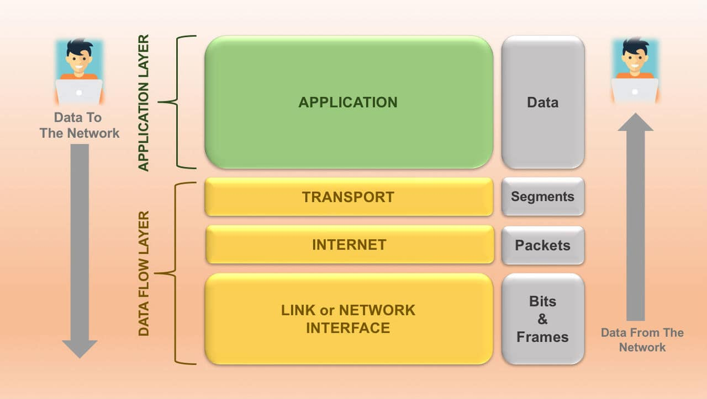

* 송신하는 측, 클라이언트는 애플리케이션(응용) 계층에서부터 내려갑니다. 

* 수신하는 측, 서버는 링크 계층 부터 애플리케이션 계층으로 올라갑니다.

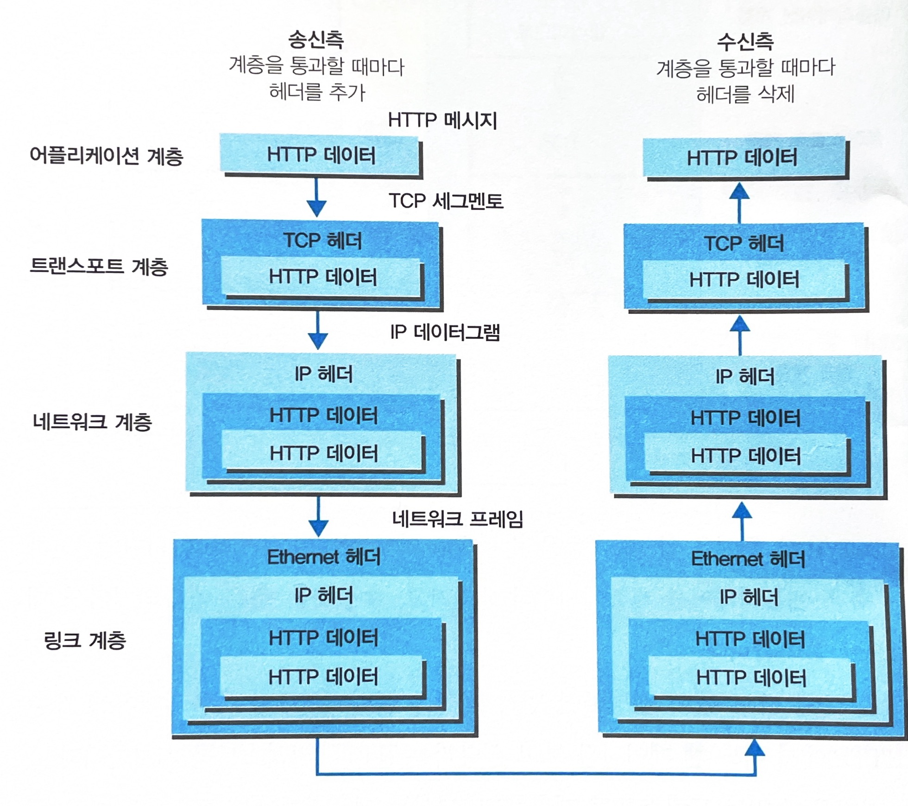

* 각 계층을 거칠 때는 반드시 헤더로 불려지는 해당 계충마다 해당 계층에 필요한 정보를 추가합니다.

* 반대로 수신측에서는 각 계층을 거칠 떄마다 반드시 해당 계층마다 사용한 헤더를 삭제합니다.

* 계층 이동마다 필요한 정보(헤더)를 추가하는 것을 `캡슐화`라고 합니다.

* 반대로 계층 이동 마다 추가된 헤더를 읽고, 헤더를 제거하는 것을 `역캡슐화`라고 합니다.

### 예제를 통한 TCP/IP 흐름 이해

> 패킷 : 네트워크를 통해 전송되는 형식화된 데이터 덩어리 입니다.

* 위 예제에선, 각 계층 별로 HTTP, TCP, IP, Ethernet 프로토콜을 사용한다고 가정하겠습니다.

1. 우리가 www.naver.com 을 웹 브라우저(크롬)에 입력하면 네이버 웹 서버에 80번 포트로 HTTP 요청을 보내는 것입니다.

    * 우선, 네이버 웹 서버에 HTTP 요청을 보내기 위해서는 아래와 같이 각 계층에 필요한 정보들을 담은 패킷을 만들어야 합니다.

    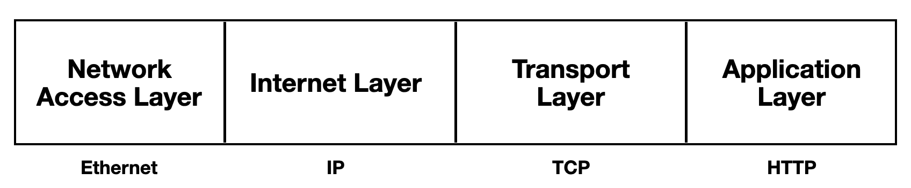
    
    * 먼저, 패킷의 Application Layer 에는 `HTTP 요청 헤더`가 들어갑니다.

    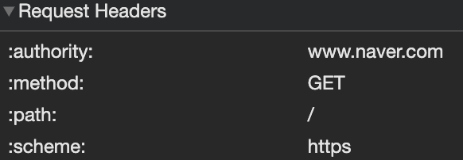
 

2. Transport Layer 에는 `TCP 헤더`가 추가됩니다.

    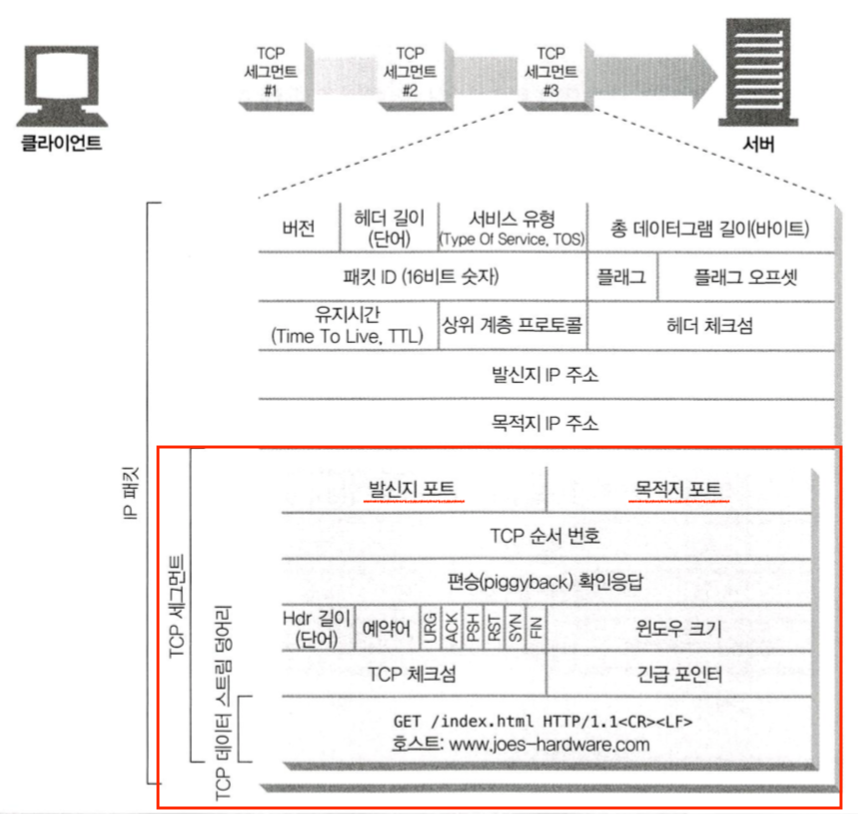
    
    * TCP 헤더에서 중요한 것은 `SP(발신지 포트번호)`와 `DP(목적지 포트번호)`입니다.

    * 발신지 포트번호는 내 컴퓨터에서 만든 소켓의 포트 번호이므로 알고 있습니다. 

    * 목적지 포트번호는 HTTP 프로토콜은 기본 80, HTTPS 에서는 443 포트입니다.

3. Internet Layer 에는 IP 헤더가 추가됩니다.

    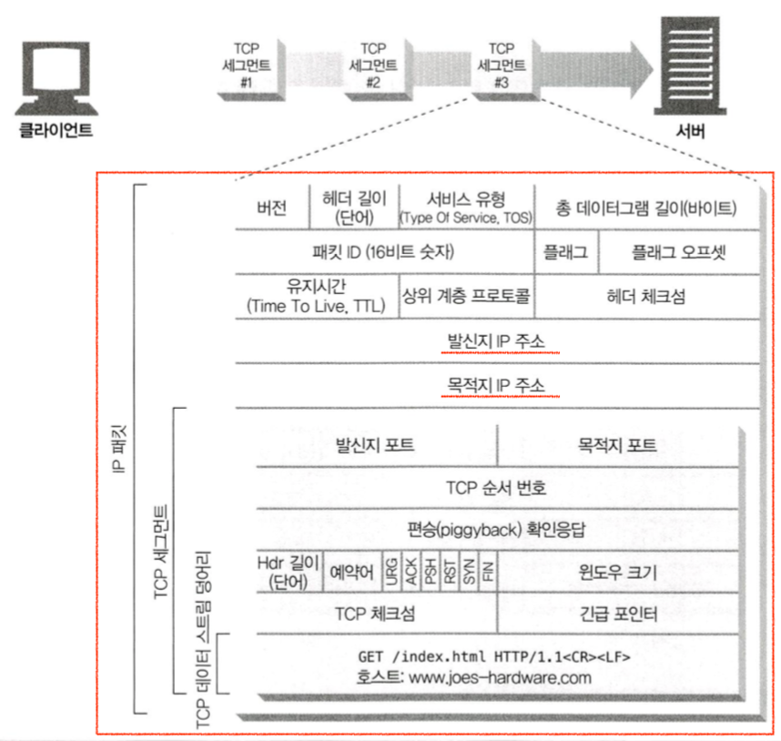

    * IP 헤더에서 중요한 것은 `SA(발신지 IP주소)` 와 `DA(목적지 IP주소)` 입니다.

    * 현재 www.naver.com 이라는 도메인 정보만 알고 있기 때문에 나의 시작 IP 주소는 알고 있지만, 목적지 IP 주소는 아직 모릅니다.

    * 따라서, 도메인 정보로 목적지 IP 주소를 알아내기 위해, 도메인 서버에 `DNS` 쿼리를 보내고, IP 주소를 응답받습니다.

        

        
DNS란?

        

        - `DNS(Domain Name System)`

        - HTTP와 같이 응용 계층 시스템에서 도메인 이름과 IP 주소 이름 확인을 제공합니다.

            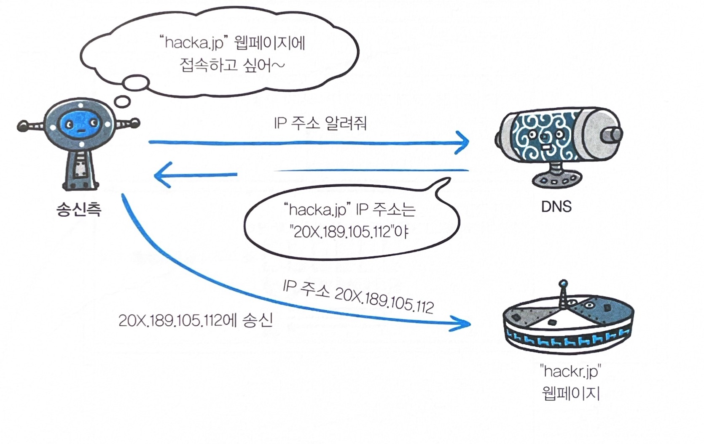

        

        

4. Network Access Layer 에는 `Ethernet 헤더`가 추가됩니다.

    * Ethernet 헤더에서 중요한 것은 `SA(발신지 MAC 주소)`와 `DA(목적지 MAC 주소)`입니다.

    * 목적지 MAC 주소는, 구글의 MAC 주소가 아닌 물리적으로 연결된 패킷이 전달될 라우터(Ex.공유기) 또는 게이트웨이의 MAC 주소를 의미합니다.

    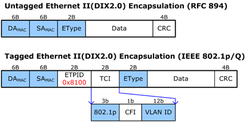

5. 패킷을 전송하기 전, TCP는 송신측과 수신측이 `서로 연결되는(커넥션) 작업`이 필요합니다,.

    * 이러한 작업을 `3 Way Handshaking` 이라고 합니다.

    * 3 Way Handshaking 을 수행하기 위해서는, TCP 헤더에 표시한 `SYN`(동기화), `ACK`(승인) 라는 TCP 플래그를 사용합니다.

    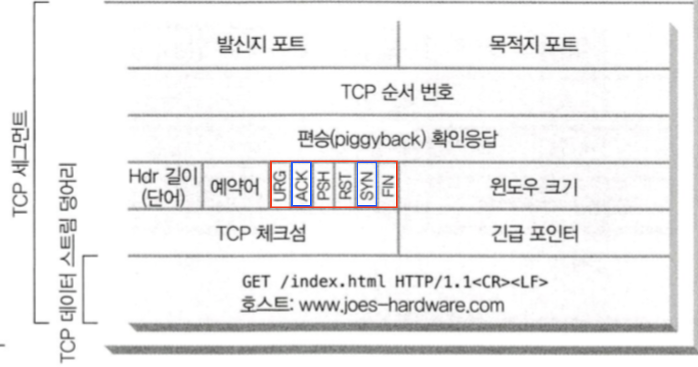

    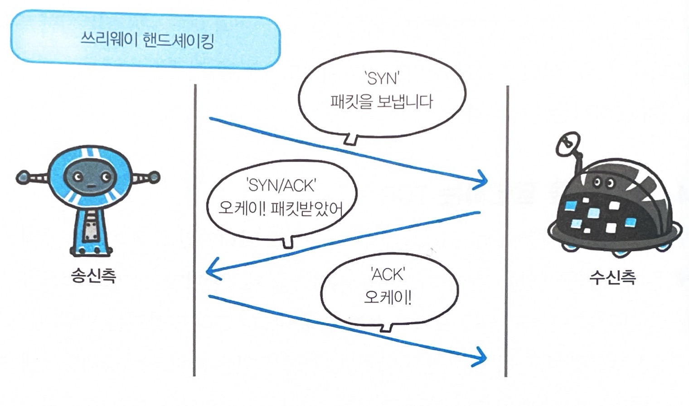

    * 먼저 클라이언트는 서버에게 접속을 요청하는 SYN 패킷을 보냅니다.

    * 서버는 SYN 패킷을 받고, 클라이언트에게 요청을 수락한다는 ACK 와 SYN 플래그가 설정된 패킷을 보냅니다.

    * 클라이언트는 다시 서버에게 ACK 패킷을 보냅니다.

    * 3 Way Handshaking 으로 기기 간 연결이 성립되었으니, 데이터 통신이 가능해집니다.

6. `라우팅`을 통해 패킷을 목적지 서버에 전송합니다.

    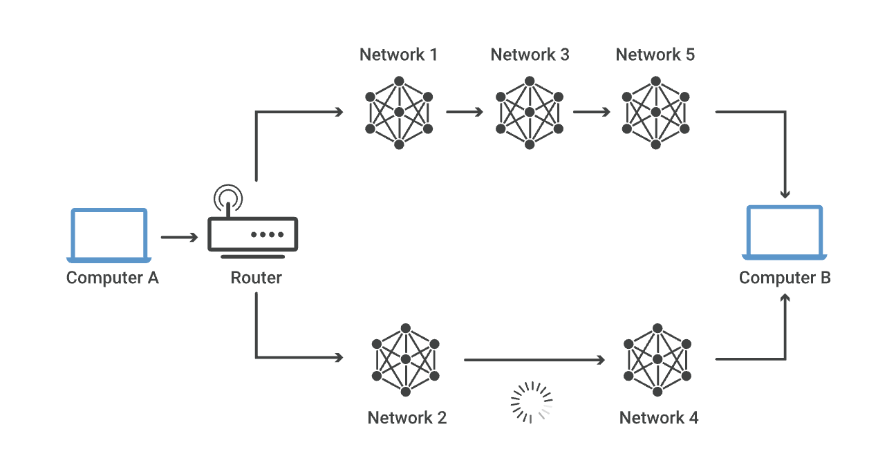

7. 목적지 서버에 전송 된 후

    * 패킷은 Network Access Layer 의 MAC 주소와 Internet Layer 의 IP 주소로 라우팅을 반복해 목적시 서버인 네이버 서버까지 도착합니다.

    * 네이버 서버가 받은 패킷 내부 Transport Layer 의 목적지 포트 번호에는 80번 혹은 443번이 적혀있습니다.

    * 따라서 Transport Layer는 80번 혹은 443번 포트를 사용하고 있는 Application Layer에 데이터를 전송합니다.

    * 이후, Application Layer는 HTTP 요청 데이터를 받아 "/" 에 매핑된 GET 요청을 처리합니다.

    * 이후 요청한 리소스들을 클라이언트에게 응답합니다.

        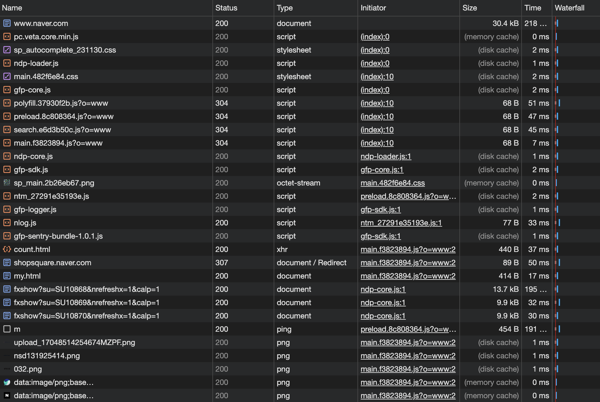

     

    * 클라이언트는 라우팅을 통해 전달 받은 "www.naver.com"에 해당하는 HTML, text, png 등 다양한 리소스 들을 브라우저에 띄웁니다.

        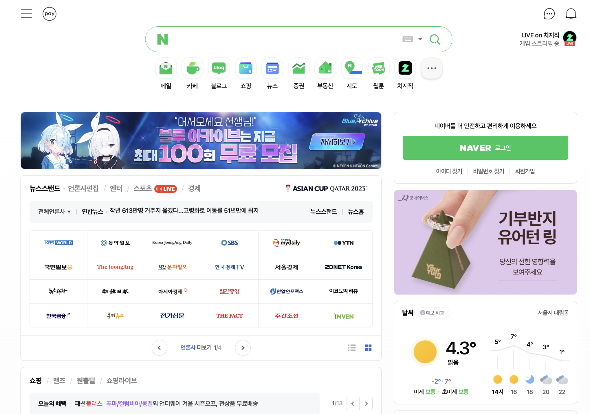

8. HTTP 요청과 응답이 끝났으므로 연결을 종료해야 합니다.

    * 위에서 3 Way Handshake 를 이용했지만, 세션을 종료하기 위해서는 `4 Way Handshake` 를 이용합니다.

    * 4 Way Handshake 는 `ACK`, `FIN` 플래그가 사용됩니다.

        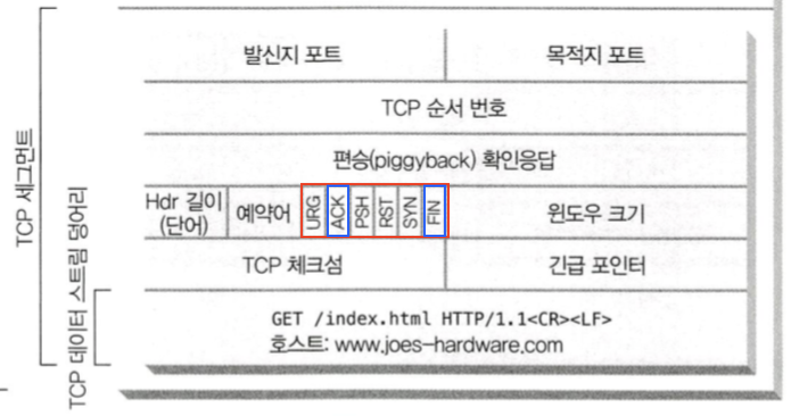

    * 진행 절차는 다음과 같습니다.

        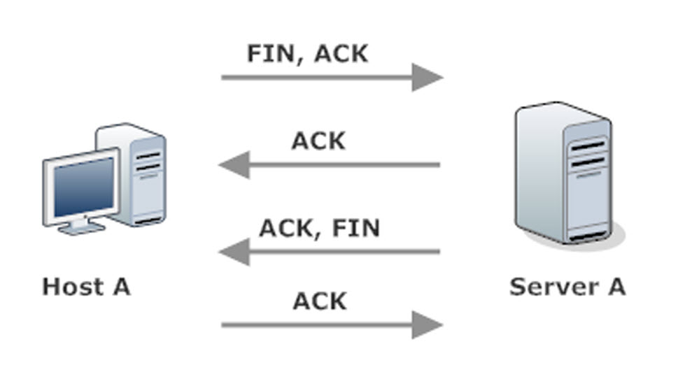    

9. 4 Way Handshake 이후에 커넥션이 닫힙니다(연결 종료).

  

# 3. 웹의 구성요소

* 지금까지 웹 애플리케이션 (클라이언트와 서버, 웹 브라우저와 웹 서버)이 기본적인 트랜잭션을 구현하기 위해 어떻게 메시지를 주고받는지에 중점을 두었습니다.

* 인터넷과 상호작용 할 수 있는 웹 애플리케이션은 많습니다.

* 이 절에서는 우리는 다음을 포함한 여러 애플리케이션들에 대해 설명하겠습니다.

## 3-1. 프락시 (Proxy)

* 프락시는 클라이언트와 서버 사이에 위치하고 클라이언트 입장에서 트랜잭션을 수행하는 `HTTP 중개자`입니다.

    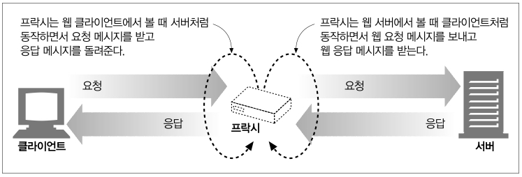

* 프락시는 같은 프로토콜을 사용하는 둘 이상의 애플리케이션을 연결합니다.

* 프락시 사용 예시

    - 어린이 필터
        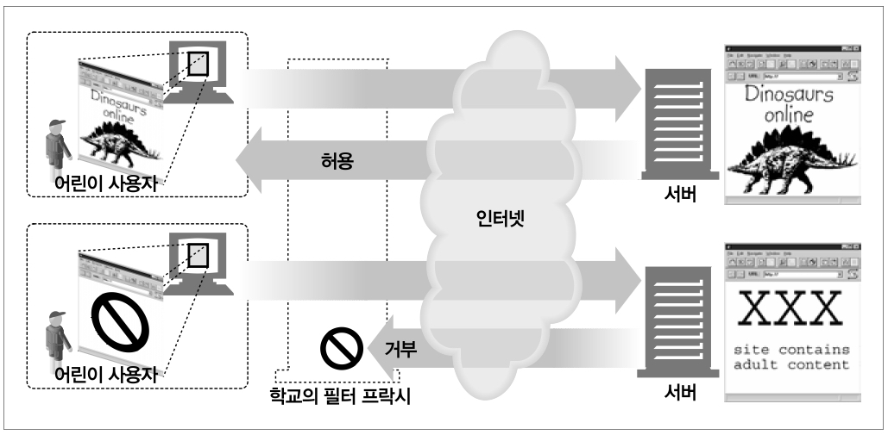

         

    - 문서 접근 제어자
        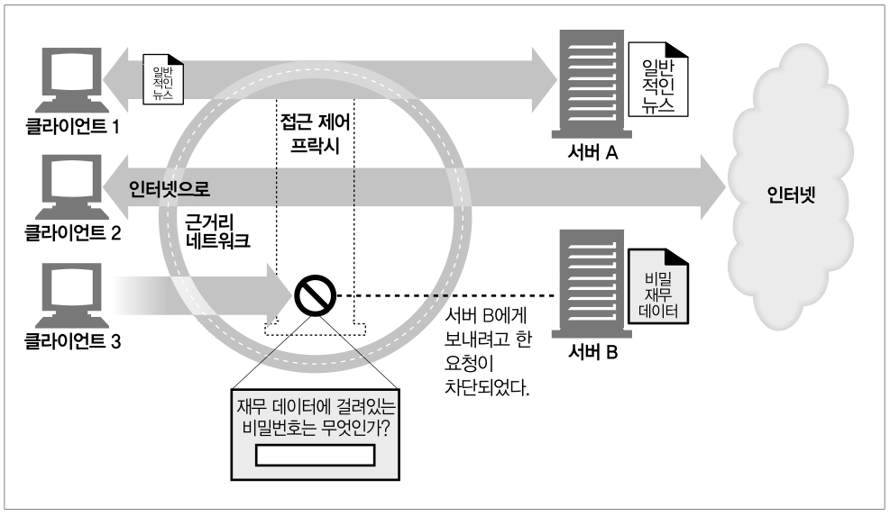

         

    - 보안 방화벽
        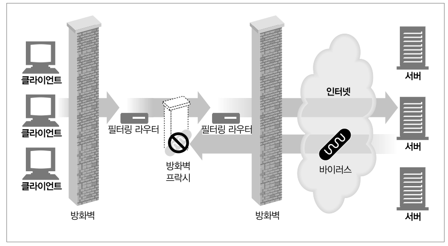

         

    - 웹 캐시
        

         

    - 대리 프락시
        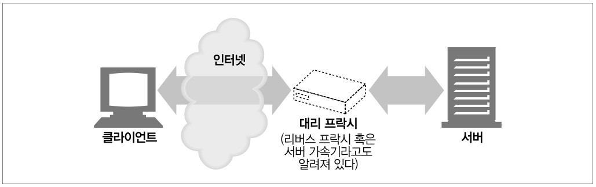

         

    - 콘텐츠 라우터
        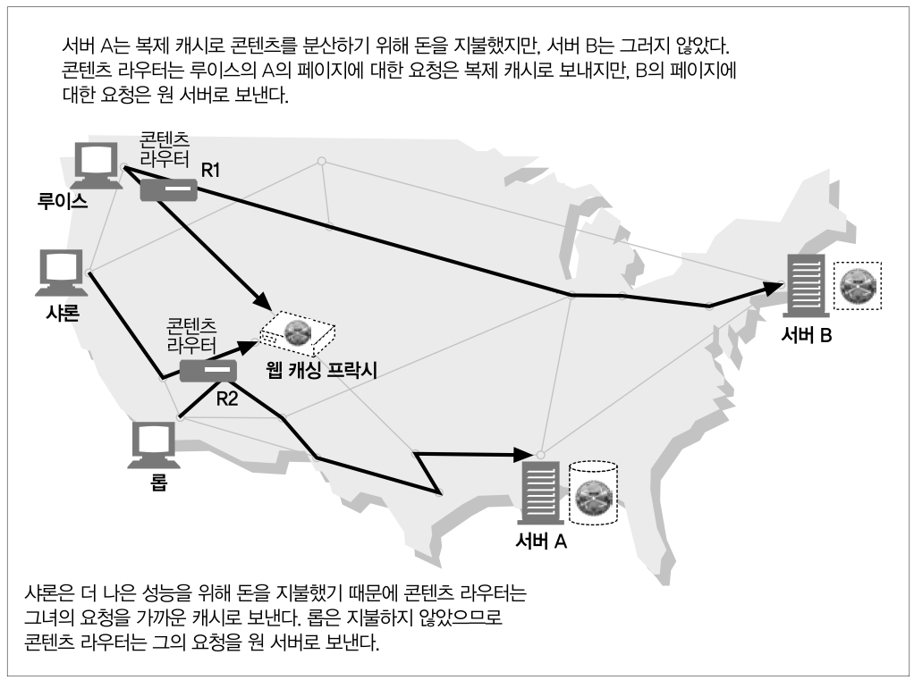

         

    - 트랜스코더
        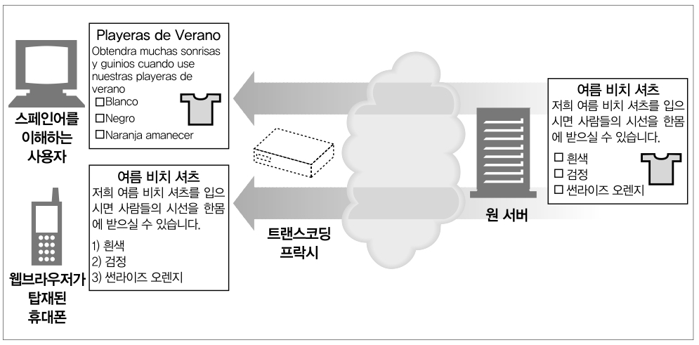

         

    - 익명화 프락시
        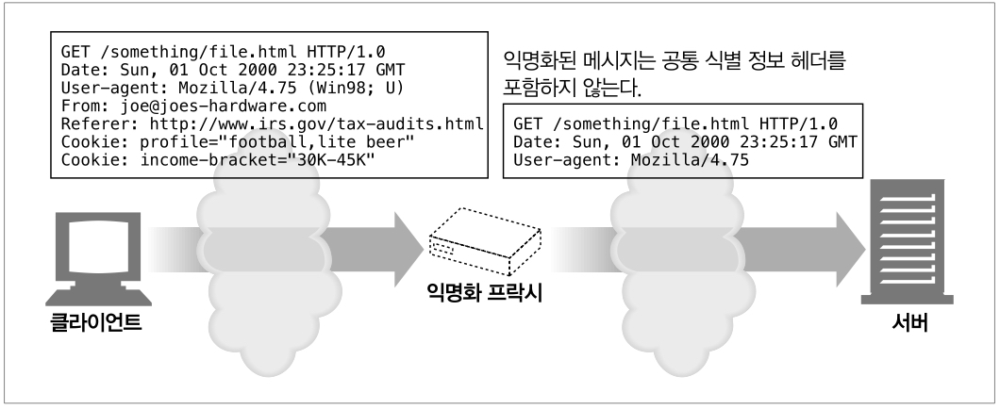

         

* 프락시의 위치

    - 프락시는 어떻게 사용할지에 따라서 어디에든 배치할 수 있다.

        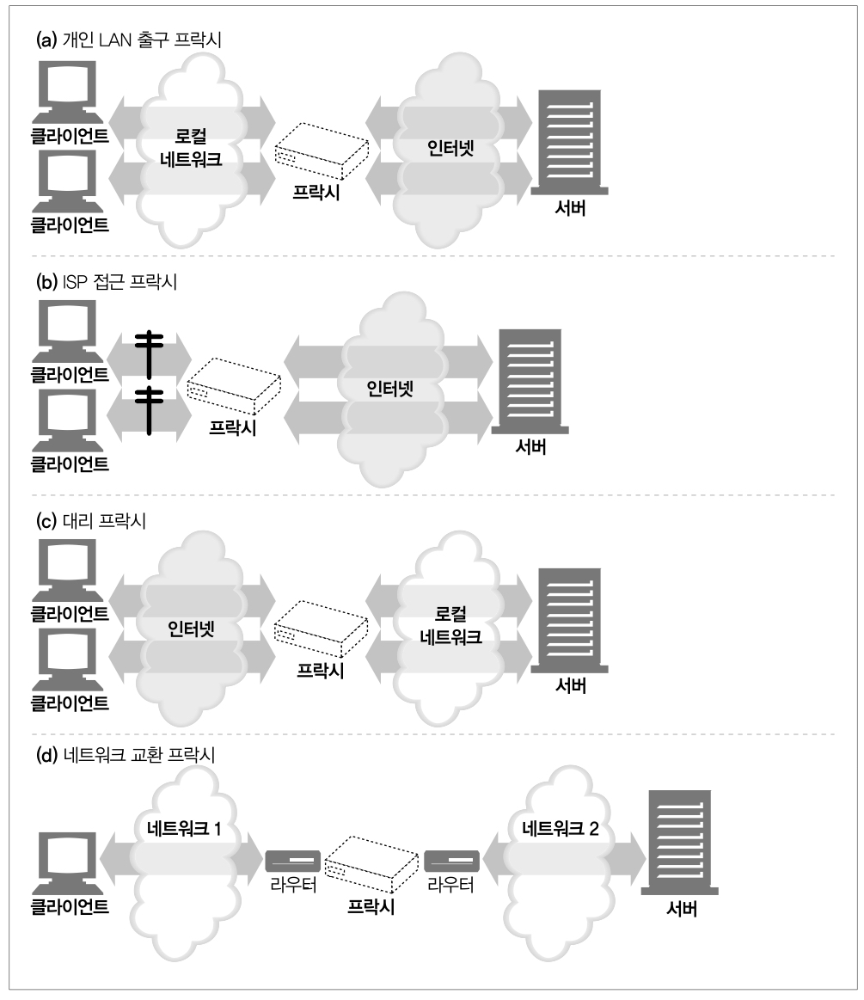

## 3-2. 캐시 (Cache)

* 캐시는 많이 찾는 웹페이지를 클라이언트 가까이에 보관하는 `HTTP 창고`입니다.

* 웹 캐시는 자주 쓰이는 문서의 사본을 자동으로 보관하는 HTTP 장치입니다.

* 웹 요청이 캐시에 도착했을 때, 캐시된 로컬 사본이 존재한다면, 그 문서는 원 서버가 아니라 캐시로부터 제공됩니다.

* www.naver.com 의 이미지 파일(png) 캐시 예시

    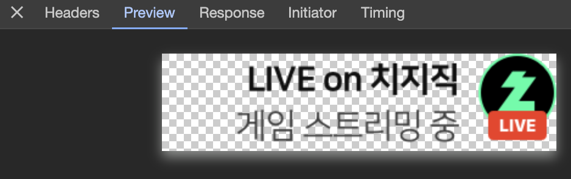
    
    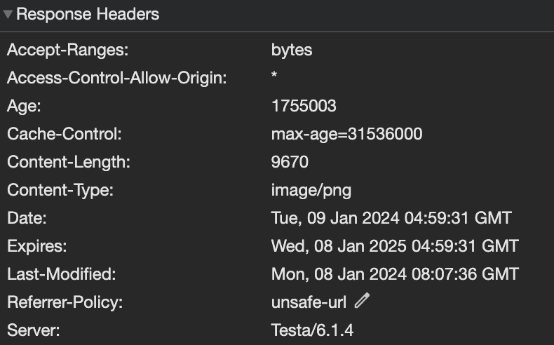

* 캐시를 사용하면 다음과 같은 이점이 있습니다.

    - 불필요한 데이터 전송을 줄여, 네트워크 요금으로 인한 비용을 줄여줍니다.

    - 네트워크 병목을 줄여주고, 대역폭을 늘리지 않고도 페이지를 빨리 불러올 수 있게 됩니다.

    - 원 서버에 대한 요청을 줄여줍니다. 이는 서버의 부하를 줄일 수 있으며 더 빨리 응답할 수 있게 해줍니다.

    - 페이지를 먼 곳에서 불러올수록 시간이 많이 걸리는데, 캐시는 거리로 인한 지연을 줄여줍니다.

## 3-3. 게이트웨이 (Gateway)

* `디른` 애플리케이션과 연결된 특별한 웹 서버입니다.

* 게이트웨이는 주로 HTTP 트래픽을 다른 프로토콜로 변환하기 위해 사용됩니다.

* 웹 게이트웨이의 예시

    
    
    
    

* 리소스 게이트웨이

    - 애플리케이션 서버도 게이트웨이의 일종입니다.

    - 애플리케이션 서버는 게이트웨이와 목적지 서버를 한 개의 서버로 결합하고 클라이언트와는 HTTP로 통신합니다.

    - 애플리케이션 게이트웨이에서 유명했던 최초의 API는 `공용 게이트웨이 인터페이스 (Commmon Gateway Interface, CGI)` 였습니다.
    
        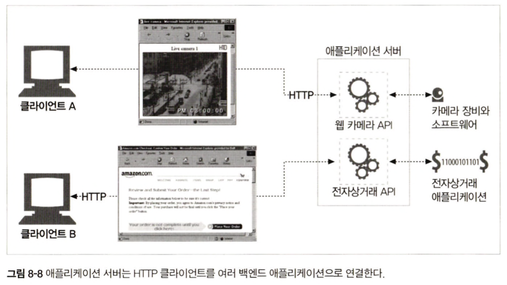

> CGI : 
특정 URL에 대한 HTTP 요청에 따라 프로그램을 실행, 프로그램의 출력을 수집, HTTP 응답으로 회신하는데 웹 서버가 사용하는 표준화된 인터페이스 집합

## 3-4. 터널

* 터널은 두 커넥션 사이에서 날(raw) 데이터를 열어보지 않고 그대로 전달해주는 HTTP 애플리케이션입니다.

* HTTP 터널을 활용하는 대표적인 예로 암호화된 SSL 트래픽을 HTTP 커넥션으로 전송함으로써 웹 트래픽만 허용하는 사내 방화벽을 통과시키는 것이 있습니다.

    

# 4. HTTPS

* HTTPS는 HTTP를 안전하게 만드는 방식 중에서 가장 인기있는 방식입니다.

    

* HTTPS 를 사용할 때, 모든 HTTP 요청과 응답 데이터는 네트워크로 보내지기 전에 `암호화`됩니다.

* HTTPS 는 HTTP의 하부에 전송 레벨 암호 보안 계층을 제공합니다.

* 이 보안 계층은 `안전 소켓 계층 (Secure Sockets Layer, SSL)`혹은 그를 계승한 `전송 계층 보안 (Transport Layer Security, TLS)` 을 이용하여 구현됩니다.

    

    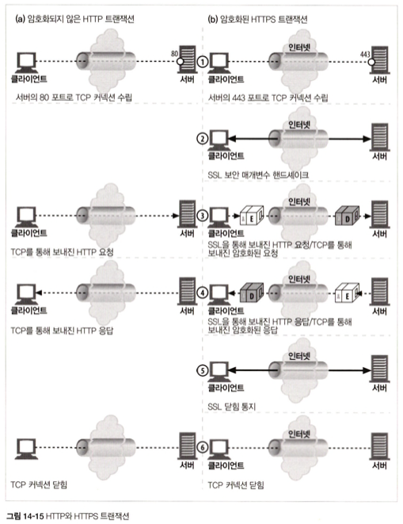

