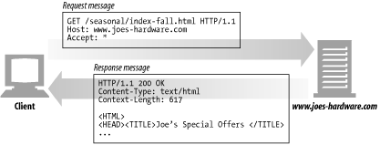
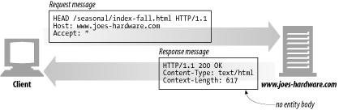
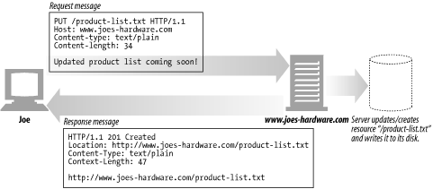
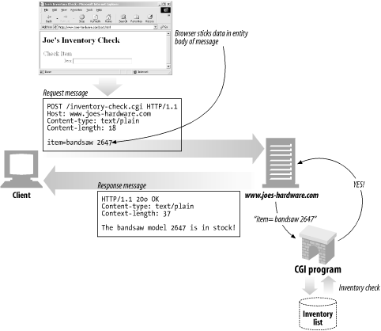
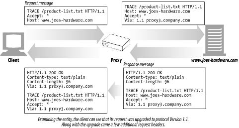
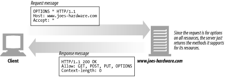
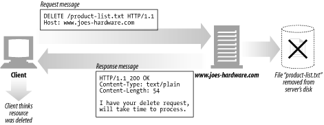

# 3장. HTTP 메시지

 

## 소개

 

이번 장을 통해 HTTP 메시지의 모든 것(어떻게 메시지를 만들고 이해하는지)에 대해 알아보자.

- 메시지가 어떻게 흘러가는가

- HTTP 메시지의 세 부분(시작줄, 헤더, 개체 본문)

- 요청과 응답 메시지의 차이

- 요청 메시지가 지원하는 여러 기능(메서드)들

- 응답 메시지가 반환하는 여러 상태 코드들

- 여러 HTTP 헤더들은 무슨 일을 하는가

  

## 3.1 메시지의 흐름

- HTTP 메시지는 HTTP 애플리케이션 간에 주고받은 데이터의 블록들이다.

- 이 메시지는 클라이언트, 서버, 프록시 사이를 흐른다.

- 인바운드, 아웃바운드, 업스트림, 다운스트림이라는 방향을 의미하는 용어를 사용한다.

  

### 3.1.1 메시지는 원 서버 방향을 인바운드로 하여 송신된다.

- 메시지가 `원 서버로 항하는 것은 인바운드`로 이동하는 것이다.

-  모든 처리가 끝난 뒤에 메시지가 `사용자 에이전트로 돌아오는 것은 아웃바운드`로 이동하는 것이다.

 

### 3.1.2 다운스트림으로 흐르는 메시지

- 요청 메시지냐 응답 메시지냐에 관계없이 `모든 메시지는 다운스트림으로 흐른다.` 결코 업스트림으로 흐르지 않는다.

  

## 3.2 메시지의 각 부분

- HTTP 메시지는 단순한, 데이터의 구조화된 블록이다.

- 각 메시지는 클라이언트로부터의 요청이나 서버로부터의 응답 중 하나를 포함한다.

- 시작줄, 헤더 블록, 본문 세 부분으로 이루어진다.

    - 시작줄은 이것이 어떤 메시지인지 서술한다.

    - 헤더 블록은 속성을 서술한다.

    - 본문은 데이터를 담고 있다. 없을 수도 있다.

  

### 3.2.1 메시지 문법

 

 

- 모든 HTTP 메시지는 요청 메시지나 응답 메시지로 분류된다.

- 요청 메시지

    <메서드> <요청 URL> <버전>
     
    <헤더>
      
    <엔터티 본문>

 

- 응답 메시지

    <버전> <상태 코드> <사유 구절>
     
    <헤더>
      
    <엔터티 본문>

 

- 메서드

    `클라이언트 측에 서버가 리소스에 대해 수행해주길 바라는 동작`이다.

    GET, POST, PUT 과 같이 한 단어로 되어 있다.

 

- 요청 URL

    `요청 대상이 되는 리소스를 지칭하는 완전한 URL 혹은 URL의 경로 구성요소`이다.

 

- 버전

    이 메시지에서 사용중인 HTTP의 버전이다.

    HTTP/<메이저>.<마이너>

 

- 상태 코드

    요청 중에 무엇이 일어났는지 설명하는 세 자리의 숫자다.

    첫 번째 자릿수는 상태의 일반적인 분류(성공, 에러 등)을 나타낸다.

 

- 사유 구절

    상태 코드를 사람이 이해할 수 있게 설명해주는 짧은 문구로 오로지 사람에게 읽히기 위한 목적이기에 사유 구절로 인해 응답에 영향이 가진 않는다.

    HTTP/1.0 200 OK

 

- 헤더들

    빈 줄(CRLF)로 끝나 헤더 목록의 끝과 엔터티 본문의 시작을 표시한다.

 

- 엔터티 본문

    임의의 데이터 블록을 포함한다. 모든 메시지가 엔터티 본문을 갖는 것은 아니므로, 때때로 메시지는 그냥 CRLF로 끝나게 된다.

  

### 3.2.2 시작줄

- 모든 HTTP 메시지는 시작줄로 시작한다.

 

- 요청줄 

    요청 메시지는 서버에게 리소스에 대해 무언가를 해달라고 부탁한다.

    서버에서 어떤 동작이 일어나야 하는지 설명해주는 메서드와 그 동작에 대한 대상을 지칭하는 요청 URL이 들어있다.

 

- 응답줄

    응답 메시지는 수행 결과에 대한 상태 정보와 결과 데이터를 클라이언트에게 돌려준다.

    HTTP의 버전, 상태 코드, 사유 구절이 들어있다.

 

- 메서드

    요청의 시작줄은 메서드로 시작하며, 서버에게 무엇을 해야 하는지 말해준다.

    예를 들어, 'GET /speicals/saw-blade.gif HTTP/1.0'에서 메서드는 GET이다.

    | 메서드 | 설명 | 메시지 본문이 있는가? |
    | --- | --- | --- |
    | GET | 서버에서 어떤 문서를 가져온다. | 없음 |
    | HEAD | 서버에서 어떤 문서에 대한 헤더만 가져온다. | 없음 |
    | POST | 서버가 처리해야 할 데이터를 보낸다. | 있음 |
    | PUT | 서버에 요청 메시지의 본문을 저장한다. | 있음 |
    | TRACE | 메시지가 프록시를 거쳐 서버에 도달하는 과정을 추적한다. | 없음 |
    | OPTIONS | 서버가 어떤 메서드를 수행할 수 있는지 확인한다. | 없음 |
    | DELETE | 서버에서 문서를 제거한다. | 없음 |

 

- 상태 코드

    클라이언트에게 무엇이 일어났는지 말해준다.

    | 전체 범위 | 정의된 범위 | 분류 |
    | --- | --- | --- |
    | 100 ~ 199 | 100 ~ 101 | 정보 |
    | 200 ~ 299 | 200 ~ 206 | 성공 |
    | 300 ~ 399 | 300 ~ 305 | 리다이렉션 |
    | 400 ~ 499 | 400 ~ 415 | 클라이언트 에러 |
    | 500 ~ 599 | 500 ~ 505 | 서버 에러 |

     

    많이 쓰이는 상태 코드들

    | 상태 코드 | 사유 구절 | 의미 |
    | --- | --- | --- |
    | 200 | OK | 성공! 요청한 모든 데이터는 응답 본문에 들어있다. |
    | 401 | Unauthorized | 사용자 이름과 비밀번호를 입력해야 한다. |
    | 404 | Not Found | 서버는 요청한 URL에 해당하는 리소스를 찾지 못했다. |
    | 400 | Bad Request | 사용자의 잘못된 요청 |
    | 500 | Internet Sever Error | 서버 내부 에러 |

 

- 사유 구절

    상태 코드에 대한 글로 된 설명을 제공한다.

 

- 버전 번호

    HTTP 애플리케이션들이 자신이 따르는 프로토콜의 버전을 상대방에게 말해주기 위한 수단

  

### 3.2.3 헤더

- HTTP 헤더 필드는 요청과 응답 메시지에 추가 정보를 더한다.

    ex) Content-length: 19, Content-Type: image/gif

 

- 헤더 분류

    - 일반 헤더

        요청과 응답 양쪽에 모두 나타날 수 있음 

     

    - 요청 헤더

        요청에 대한 부가 정보를 제공

     
    
    - 응답 헤더

        응답에 대한 부가 정보를 제공

     

    - Entity 헤더

        본문 크기와 콘텐츠, 혹은 리소스 그 자체를 서술

     

    - 확장 헤더

        명세에 정의되지 않은 새로운 헤더

    | 헤더의 예 | 설명 |
    | --- | --- | 
    | Date: Tue, 3 Oct 2023 | 서버가 응답을 만들어 낸 시각 | 
    | Content-length: 15040 | 15,040바이트의 데이터를 포함한 엔터티 본문 | 
    | Content-type: image/gif | 엔터티 본문은 GIF 이미지이다. | 
    | Accept: image/gif, image/jpeg, text/html | 클라이언트는 GIF, JPEG 이미지와 HTML을 받아들일 수 있다. |

      

### 3.2.4 엔터티 본문

- 엔터티 본문은 HTTP 메시지의 화물이며, 이미지, 비디오, HTML 문서 등 여러 종류의 디지털 데이터를 실어 나를 수 있다.

  

## 3.3 메서드

 

### 3.3.1 안전한 메소드

- GET, HEAD 메서드는 HTTP 요청의 결과로 서버에서 일어나는 일이 없기 때문에 안전하다.

- 서버에 영향을 줄 수 있는 안전하지 않은 메서드가 사용될 때 사용자에게 그 사실을 HTTP 애플리케이션을 만드는 것이 중요하다.

 

### 3.3.2 GET

 

 

- 가장 흔히 쓰이는 메서드이며, 서버에게 리소스를 달라고 요청하기 위해 쓰인다.

### 3.3.3 HEAD

 

 

- GET처럼 행동하지만, 서버는 응답으로 헤더만을 돌려준다.

- HEAD를 사용하면,

    - 리소스를 가져오지 않고도 그에 대해 무엇인가를 알 수 있다.

    - 응답의 상태 코드를 통해, 개체가 존재하는지 확인할 수 있다.

    - 헤더를 확인하여 리소스가 변경되었는지 검사할 수 있다.

### 3.3.4 PUT

 

 

- 서버가 요청의 본문을 가지고 요청 URL의 이름대로 새 문서를 만들거나, 이미 URL이 존재한다면 본문을 사용해서 교체하는 것이다.

- PUT은 콘텐츠를 변경할 수 있게 하기 때문에 PUT을 수행하기 전에 비밀번호를 입력해서 로그인을 하도록 요구할 것이다.

### 3.3.5 POST

 

 

- POST는 서버에 입력 데이터를 전송한다. 채워진 폼에 담긴 데이터는 서버로 전송되고 서버는 이를 모아서 필요로 하는 곳에 보낸다. 예를 들어 데이터를 처리할 서버 게이트웨이 프로그램 등

- PUT과 다른 점은 PUT은 서버에 있는 리소스(파일 등)에 데이터를 입력하기 위해 사용된다.

### 3.3.6 TRACE

 

 

- 진단을 위해 사용된다. 예를 들어 요청이 의도한 요청/응답 연쇄를 거쳐가는지 검사할 수 있다. 또한 프록시나 다른 애플리케이션들이 요청에 어떤 영향을 미치는지 확인해보고자도 사용한다.

### 3.3.7 OPTIONS

 

 

- 웹 서버에게 특정 리소스에 대해 어떤 메서드가 지원되는지 물어본다.

### 3.3.8 DELETE

 

 

- 서버에게 요청 URL로 지정한 리소스를 삭제할 것을 요청한다.

- 하지만 HTTP 명세는 서버가 클라이언트에게 알리지 않고 요청을 무시하는 것을 허용하기 때문에 삭제가 수행되는 것을 보장하지 못한다.

### 3.3.9 확장 메서드

- HTTP/1.1 명세에 정의되지 않은 메서드이며, 필요에 따라 새로운 기능을 추가할 수 있다.

  

## 3.4 상태 코드

- HTTP 상태 코드는 크게 5가지로 나뉘며, 클라이언트에게 트랜잭션을 이해할 수 있는 쉬운 방법을 제공한다.

### 3.4.1 100-199: 정보성 상태 코드

| 상태 코드 | 사유 구절 | 의미 |
| --- | --- | --- |
| 100 | Continue | 클라이언트가 서버로 보낸 요청에 문제가 없으니 다음 요청을 이어서 보내도 된다는 것을 의미한다. |
| 101 | Switching Protocols | 클라이언트가 Upgrade 헤더에 나열한 것 중 하나로 서버가 프로토콜을 바꾸었음을 의미한다. |

### 3.4.2 200-299: 성공 상태 코드

| 상태 코드 | 사유 구절 | 의미 |
| --- | --- | --- |
| 200 | OK | 요청은 정상이고, 엔터티 본문은 요청된 리소스를 포함하고 있다. |
| 201 | Created | 요청이 성공적으로 처리되었으며, 자원이 생성되었음을 나타내는 성공 상태이다. |
| 202 | Accepted | 요청이 처리를 위해 수락되었으나, 아직 해당 요청에 대해 처리 중이거나 처리 시작되지 않았을 수 있다는 것을 의미한다. |
| 203 | Non-Authoritative Information | 엔터티 헤더에 들어있는 정보가 원래 서버가 아닌 리소스의 사본에서 왔다. |
| 204 | No Content | 헤더와 상태줄을 포함하지만 엔터티 본문은 포함하지 않는다. |
| 205 | Reset Content | 브라우저에게 현재 페이지에 있는 HTML 폼에 채워진 모든 값을 비우라고 말한다. |
| 206 | Partial Content | 부분 혹은 범위 요청이 성공했다. |

### 3.4.3 300-399: 리다이렉션 상태 코드

- 클라이언트가 관심있어 하는 리소스에 대해 다른 위치를 사용하라고 알려주거나 그 리소스의 내용 대신 다른 대안 응답을 제공한다.

| 상태 코드 | 사유 구절 | 의미 |
| --- | --- | --- |
| 300 | Multiple Choices | 클라이언트가 동시에 여러 리소스를 가리키는 URL을 요청한 경우, 그 리소스의 목록과 함께 반환한다. |
| 301 | Moved Permanently | 요청한 URL이 옮겨졌을 때 사용한다. Location 헤더에 현재 리소스가 존재하고 있는 URL을 포함해야 한다. |
| 302 | Found | 301 상태 코드와 같다. |
| 303 | See Other | 클라이언트에게 리소스를 다른 URL에서 가져와야 한다고 말해주고자 할 때 쓰인다. |
| 304 | Not Modified | 만약 클라이언트가 GET과 같은 조건부 요청을 보냈고 그 요청한 리소스가 최근에 수정된 일이 없다면, 이 코드는 리소스가 수정되지 않았음을 의미한다. |
| 305 | Use Proxy | 리소스가 반드시 프록시를 통해서 접근되어야 함을 나타내기 위해 사용한다. |
| 307 | Temporary Redirect | 301 상태 코드와 비슷하다. |

### 3.4.4 400-499: 클라이언트 에러 상태 코드

| 상태 코드 | 사유 구절 | 의미 |
| --- | --- | --- |
| 400 | Bad Request | 클라이언트가 잘못된 요청을 보냈다고 말해준다. |
| 401 | Unauthorized | 리소스를 얻기 전에 클라이언트에게 스스로를 인증하라고 요구하는 내용의 응답을 적절한 헤더와 함께 반환한다. |
| 403 | Forbidden | 요청이 서버에 의해 거부되었음을 알려주기 위해 사용한다. |
| 404 | Not Found | 서버가 요청한 URL을 찾을 수 없음을 알려주기 위해 사용한다. |

### 3.4.5 500-599: 서버 에러 상태 코드

| 상태 코드 | 사유 구절 | 의미 |
| --- | --- | --- |
| 500 | Internal Server Error | 서버가 요청을 처리할 수 없게 만드는 에러를 만났을 때 사용한다. |
| 501 | Not Implemented | 클라이언트가 서버의 능력을 넘은 요청을 했을 때 사용한다. 예를 들어 서버가 지원하지 않는 메서드를 사용하는 경우 |
| 503 | Service Unavailable | 현재는 서버가 요청을 처리해줄 수 없지만 나중에는 가능함을 의미하고자 할 때 사용한다. |

  

## 3.5 헤더

- 헤더와 메서드는 클라이언트와 서버가 무엇을 하는지 결정하기 위해 함께 사용된다. 

### 과거

- 과거 RFC 2616(1999년) 명세에서는 5가지 헤더를 사용하였다.

    - 일반 헤더 : 메시지 전체에 적용되는 헤더

        ex) Connection: close

    - 요청 헤더 : 요청 메시지를 위한 헤더

        ex) User-Agent: Mozilla/5.0

    - 응답 헤더 : 응답 메시지를 위한 헤더

        ex) Server: Apache

    - 엔터티 헤더 : 엔터티(메시지가 전달하고자 하는 데이터) 본문에 대한 헤더

        ex) Content-Type; text/html, Content-Length: 3423

    - 확장 헤더 : HTTP 명세에 추가되지 않은 비표준 헤더

### 현재

    - 엔터티 ❌
    - 표현 ⭕

- 2014년 공개된 RFC7230 ~ RFC7235에서는 엔터티라는 단어를 더 이상 사용하지 않고, 표현이라는 단어를 사용하기로 했다.

- 엔터티 헤더 -> 표현 헤더
    
    엔터티 본문 -> 표현 데이터

- 즉, 표현은 표현 헤더와 표현 데이터를 모두 포함하는 개념이다.

 

### 3.5.1 표현 헤더

- 요청과 응답 모두 사용한다.

| 헤더 | 설명 | 
| --- | --- | 
| Content-Type | 표현 데이터의 형식, 미디어 타입, 문자 인코딩 / text/html, application/json |
| Content-Encoding | 표현 데이터의 압축 방식, 데이터 전달하는 곳에서 압축 후 인코딩 헤더 추가 / gzip, deflate 등 | 
| Content-Language | 표현 데이터의 자연 언어 / ko, en, en-US | 
| Content-Length | 표현 데이터의 길이 | 

  

### 3.5.2 협상 헤더

- 클라이언트가 선호하는 표현 요청, 요청시에만 사용한다.

| 헤더 | 설명 | 
| --- | --- | 
| Accept | 클라이언트가 선호하는 미디어 타입 전달 |
| Accept-Charset | 클라이언트가 선호하는 문자 인코딩 | 
| Accept-Encoding | 클라이언트가 선호하는 압축 인코딩 | 
| Accept-Language | 클라이언트가 선호하는 자연 언어 | 

  

### 3.5.3 일반 헤더

| 헤더 | 설명 | 
| --- | --- | 
| From | 유저 에이전트의 이메일 정보 |
| Referer | 현재 요청된 페이지의 이전 웹 페이지 주소, 유입 경로 분석 가능 | 
| User-Agent | 유저 에이전트 애플리케이션 정보 / Safari/537.36 | 
| Server | 요청을 처리하는 ORIGIN 서버의 소프트웨어 정보 | 
| Date | 메시지가 생성된 날짜와 시간 |

  

### 3.5.4 특별한 정보

| 헤더 | 설명 | 
| --- | --- | 
| Host | 요청한 호스트 정보(도메인) |
| Allow | 허용 가능한 HTTP 메서드 | 
| Retry-After | 유저 에이전트가 다음 요청을 하기까지 기다려야 하는 시간 | 
| Authorization | 클라이언트 인증 정보를 서버에 전달 |
| WWW-Authenticate | 리소스 접근시 필요한 인증 방법 정의 |
| Cookie | 클라이언트가 서버에서 받은 쿠키를 저장하고, HTTP 요청시 서버로 전달 |
| Set-Cookie | 서버에서 클라이언트로 쿠키 전달(응답) , 사용자 로그인 세션 관리, 광고 정보 트래킹 등에서 사용 |

- 쿠키는 11장에서 다루기로 하자

  

## 참고 자료

HTTP 상태 코드

https://developer.mozilla.org/ko/docs/Web/HTTP/Status

RFC7230 ~ RFC7235

https://blog.naver.com/dacapolin/222881495745