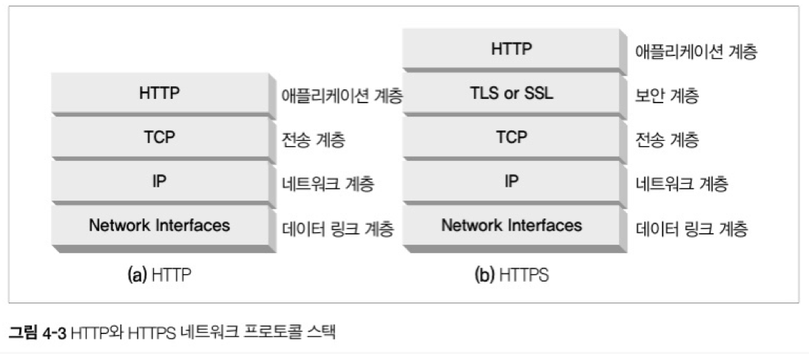
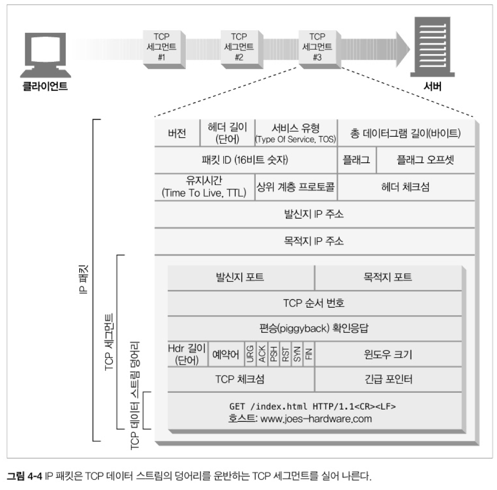
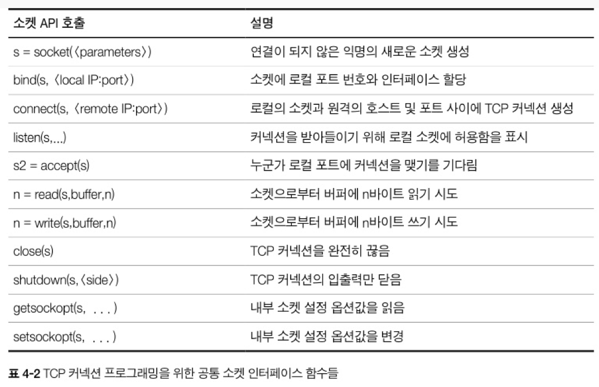
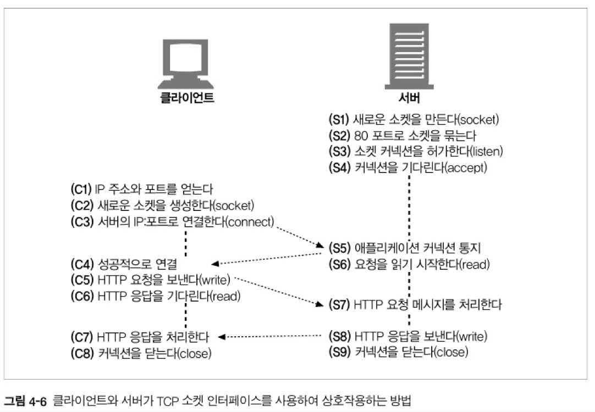

# 4장. 커넥션 관리

<br>

## 소개

<br>

HTTP 애플리케이션을 개발하고 있다면 HTTP 커넥션과 그것이 어떻게 사용되는지에 대해 잘 이해하고 있어야 한다.

해당 장에서는 다음과 같은 내용을 배운다.

- HTTP는 어떻게 TCP 커넥션을 사용하는가

- TCP 커넥션의 지연, 병목, 막힘

- 병렬 커넥션, keep-alive 커넥션, 커넥션 파이프라인을 활용한 HTTP의 최적화

- 커넥션 관리를 위해 따라야 할 규칙들

<br><br>

## 4.1 TCP 커넥션

- 모든 HTTP 통신은 패킷 교환 네트워크 프로토콜들의 계층화된 집합인 TCP/IP를 통해 이루어진다.

- 클라이언트 애플리케이션은 서버 애플리케이션으로 TCP/IP 커넥션을 맺을 수 있다.

- 커넥션이 맺어지면 클라이언트와 서버 컴퓨터 간의 메시지들은 손상되거나 순서가 바뀌지 않고 안전하게 전달된다.

<br>

- 즉, 클라이언트와 서버가 TCP/IP 커넥션을 맺게 되면 주고받는 메시지들이 손상되거나 순서가 바뀌지 않고 안전하게 전달된다. 

<br>

- 예를 들어, 죠의 컴퓨터 가게에서 전동공구의 최신 가격 목록을 가져온다면

<br>

<p align="center"></p>

<br>


1. 호스트 명을 추출
2. 호스트 명에 대한 IP 주소 추출
3. 포트 번호 추출
4. 브라우저가 IP 주소와 포트 번호로 TCP 커넥션을 생성
5. 서버로 HTTP GET 요청 메세지
6. 서버에서 온 응답 메세지 
7. 커넥션 종료

의문점 : 한 요청당 한 TCP 커넥션을 해야 하는가?
<br>

### 4.1.1 신뢰할 수 있는 데이터 전송 통로인 TCP

- TCP 커넥션은 인터넷을 안정적으로 연결해준다.

- TCP는 충돌 없이 순서에 맞게 HTTP 데이터를 전달한다.

<br>

### 4.1.2 TCP 스트림은 세그먼트로 나뉘어 IP 패킷을 통해 전송된다.

- TCP는 IP 패킷이라고 불리는 작은 조각을 통해 데이터를 전송한다.

- HTTP 메세지를 전송할 때 현재 연결된 TCP 커넥션을 통해 메세지 데이터의 내용을 순서대로 보낸다.

<br>

<p align="center"></p>

<br>

- `애플리케이션 계층` 
    
    HTTP 메세지가 생성된다.

- `전송 계층` 

    TCP는 세그먼트라는 단위로 데이터 스트림을 잘게 나눈다.

    세그먼트를 IP 패킷이라고 불리는 봉투에 담아 인터넷을 통해 데이터를 전달한다.
    
    IP 패킷은 특정 IP 주소에서 다른 IP 주소로 전달된다.

    - 해당 패킷은 IP 패킷 헤더, TCP 세그먼트 헤더, TCP 데이터 조각을 포함한다.


<br>

- 이 모든 것은 TCP/IP 소프트웨어에 의해 처리되며 과정은 프로그래머에게 보이지 않는다.

<br>

### IP 패킷

- IP 패킷은 TCP 데이터 스트림의 덩어리를 운반하는 TCP 세그먼트를 실어 나른다.

<br>

<p align="center"></p>

<br>

### 4.1.3 TCP 커넥션 유지하기

- 컴퓨터는 항상 TCP 커넥션을 여러 개 가지고 있다. TCP는 포트 번호를 통해서 여러 개의 커넥션을 유지한다.

- IP 주소는 해당 컴퓨터에 연결되고 포트 번호는 해당 애플리케이션으로 연결된다.

<br>


```
- TCP 커넥션 값

<발신지 IP 주소, 발신지 포트, 수신지 IP 주소, 수신지 포트>
```

<br>

### 4.1.4 TCP 소켓 프로그래밍

- 운영체제는 TCP 커넥션의 생성과 관련된 여러 기능을 제공한다. 

- 소켓 API는 HTTP 프로그래머에게 TCP와 IP의 세부사항을 숨긴다.

<br>

<p align="center"></p>

<br>

- 소켓 API를 사용하면 TCP 종단 데이터 구조를 생성하고, 원격 서버의 TCP 종단에 그 데이터 구조를 연결하여 데이터 스트림을 읽고 쓸 수 있다.

- TCP API는 네트워크 프로토콜의 핸드쉐이킹, TCP 데이터 스트림과 IP 패킷 간의 분할 및 제조립에 대한 모든 세부사항을 외부로부터 숨긴다.

<br>

<p align="center"></p>

<br>

 cf) 소켓이란?

    소켓은 네트워크 상에서 두 프로세스 간의 통신을 가능하게 하는 인터페이스입니다. 소켓은 IP 주소와 포트 번호를 사용하여 두 프로세스를 식별합니다.

    예를 들어, 웹 브라우저에서 웹 페이지를 요청하면 브라우저는 웹 서버에 연결하기 위해 소켓을 사용합니다. 브라우저의 IP 주소와 포트 번호는 웹 서버에 요청을 보내는 데 사용됩니다. 웹 서버는 웹 페이지를 브라우저로 전송하기 위해 자신의 IP 주소와 포트 번호를 사용하여 소켓을 사용합니다.

    소켓은 TCP(Transmission Control Protocol)와 UDP(User Datagram Protocol)라는 두 가지 프로토콜을 사용하여 통신합니다. TCP는 신뢰할 수 있는 연결을 제공하는 반면 UDP는 비신뢰할 수 있는 연결을 제공합니다.
