# 5장. 웹 서버

<br>

## 소개

<br>

웹 프락시 서버는 중개자다. 

프락시는 클라이언트와 서버 사이에 위치하여 그들 사이의 HTTP 메시지를 정리하는 중개인처럼 동작한다.

이 장에서는 프락시 기능에 대한 특별한 지원, 그리고 HTTP 프락시 서버의 모든 것에 대해 이야기한다.

- HTTP 프락시와 웹 게이트웨이를 비교하고 HTTP 프락시가 어떻게 배치되는지 그림으로 보여주면서 설명한다.

- 프락시가 실제 네트워크에 어떻게 배치되어 있는지 그리고 트래픽이 어떻게 프락시 서버로 가게 되는지 설명한다.

- 브라우저에서 프락시를 사용하려면 어떻게 설정해야 하는지 보여준다.

- HTTP 프락시 요청이 서버 요청과 어떻게 다른지, 그리고 프락시가 어떻게 브라우저의 동작을 미묘하게 바꾸는지 보여준다.

- 프락시에 기반한 HTTP 접근 제어를 설명한다.

- 어떻게 프락시가 클라이언트와 서버 사이에서 각각의 다른 기능과 버전들을 지원하면서 상호작용할 수 있는지 설명한다.

<br><br>

## 6.1 웹 중개자

- `웹 프락시 서버는 클라이언트의 입장에서 트랜잭션을 수행하는 중개인`이다. 
  
- 웹 프락시가 없다면, 클라이언트는 HTTP 서버와 직접 이야기한다. 
  
- 웹 프락시가 있다면, 클라이언트는 HTTP 서버와 이야기하는 대신, 자신의 입장에서 서버와 대화해주는 프락시와 이야기한다.

<br>

- HTTP 프락시 서버는 웹 서버이기도 하고 웹 클라이언트이기도 하다.

- 프락시는 HTTP 클라이언트의 요청을 받게 되므로, 반드시 웹 서버처럼 요청과 커넥션을 적절히 다루고 응답을 돌려줘야 한다.

- 동시에 프락시는 요청을 서버로 보내기도 하므로, 요청을 보내고 응답을 받는 올바른 HTTP 클라이언트처럼 동작해야 한다. 

<br>

<p align="center"></p>

<br>

### 6.1.1 개인 프락시와 공유 프락시

- 프락시 서버는 하나의 클라이언트가 독점적으로 사용(개인 프락시)할 수도 있고, 여러 클라이언트가 공유(공유 프락시)할 수도 있다.

- 공유 프락시

    `대부분의 프락시는 공용이며 공유된 프락시`다.

    캐시 프락시 서버와 같은 몇몇 프락시 애플리케이션은 프락시를 이용하는 사용자가 많을수록 유리한데, 여러 사용자들의 공통된 요청에서 이득을 취할 수 있기 때문이다.

<br>

- 개인 프락시

    흔하지 않은 형태지만 꾸준히 사용되고 있다.

<br>

### 6.1.2 프락시 대 게이트웨이

<br>

<p align="center">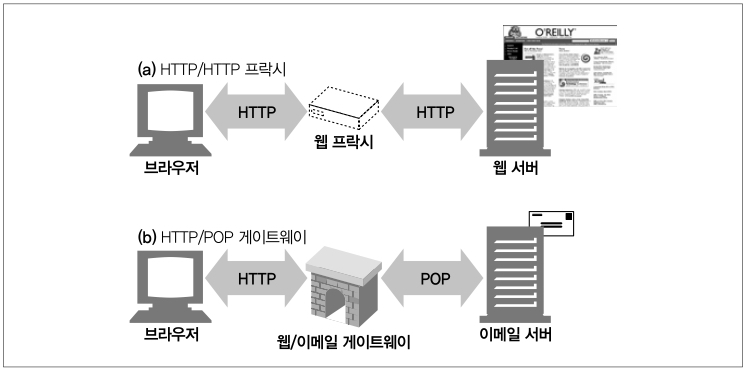</p>

<br>

   | 프락시 | 게이트웨이 |
   | --- | --- |
   | 같은 프로토콜을 사용하는 둘 이상의 애플리케이션을 연결 | 다른 프로토콜을 사용하는 둘 이상의 애플리케이션을 연결 | 

<br>

- 게이트웨이는 서로 다른 프로토콜의 서로 간의 트랜잭션을 완료할 수 있도록 해주는 프로토콜 변환기처럼 동작한다.

- 실질적으로 프락시와 게이트웨이의 차이점은 모호하다.

- 브라우저와 서버가 다른 버전의 HTTP를 구현한다면 약간의 프로토콜 변환을 하기 때문이다.

<br><br>

## 6.2 왜 프락시를 사용하는가?

<br>

- 프락시 서버는 보안을 개선하고, 성능을 높여주며, 비용을 절약한다.

- 모든 HTTP 트래픽을 들여다보고 건드릴 수 있기 때문에 부가적인 가치를 주는 여러 유용한 웹 서비스를 구현하기 위해 트래픽을 감시하고 수정할 수 있다.

### 어린이 필터

<br>

<p align="center">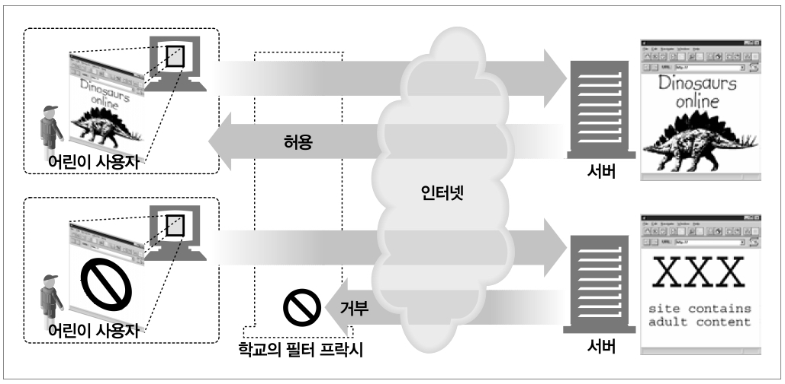</p>

<br>

- 예를 들어, 초등학교는 어린이들에게 교육 사이트를 제공하면서 동시에 성인 콘텐츠를 차단하는 필터링 프락시를 사용할 수 있다.

### 문서 접근 제어자

<br>

<p align="center">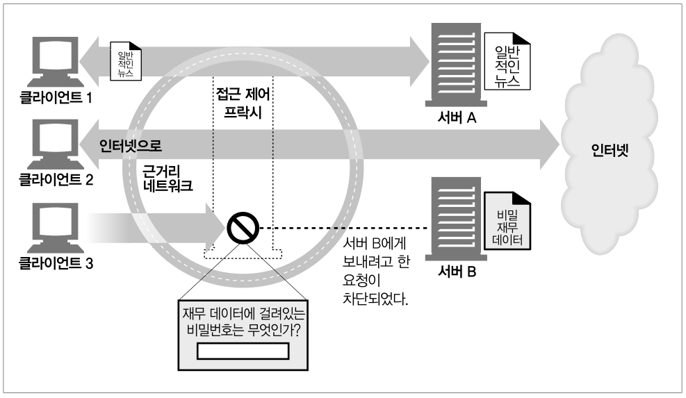</p>

<br>

- 많은 웹 서버들과 웹 리소스에 대한 단일한 접근 제어 전략을 구현하고 감사 추적을 하기 위해 사용될 수 있다.

- 이것은 접근 제어를 수시로 갱신할 필요 없이, 중앙 프록시 서버에서 접근 제어를 설정할 수 있기에 대기업 환경이나 분산된 관료 조직에서 유용하다.

### 보안 방화벽

<br>

<p align="center"></p>

<br>

- 네트워크 보안 엔지니어는 보안을 강화하기 위해 프락시 서버를 사용한다.

- 조직 안에 들어오거나 나가는 응용 레벨 프로토콜의 흐름을 네트워크 한 지점에서 통제하며, 바이러스를 제거하는 웹이나 이메일 프락시가 사용할 수 있는 트래픽을 세심히 살펴볼 수 있는 후크(hook)를 제공한다.

<br>

    응용 레벨 프로토콜이란?

    응용 레벨 프로토콜은 응용 프로그램 간에 통신을 위한 규칙을 정의한 것입니다. 
    
    응용 프로그램은 서로 다른 플랫폼이나 언어로 작성될 수 있기 때문에, 응용 프로그램 간에 통신을 하기 위해서는 서로가 이해할 수 있는 규칙이 필요합니다.

    응용 레벨 프로토콜의 예로는 다음과 같은 것들이 있습니다.

    HTTP: 웹 브라우저와 웹 서버 간의 통신을 위한 프로토콜입니다.
    FTP: 파일 전송을 위한 프로토콜입니다.
    SMTP: 이메일 전송을 위한 프로토콜입니다.
    TCP: 신뢰성 있는 연결을 위한 프로토콜입니다.
    UDP: 비신뢰성 있는 연결을 위한 프로토콜입니다.

### 웹 캐시

- 프락시 캐시는 인기 있는 문서의 로컬 사본을 관리하고 해당 문서에 대한 요청이 오면 빠르게 제공하여, 느리고 비싼 인터넷 커뮤니케이션을 줄인다.

    
<br>

    Redis 캐시와 프록시 캐시의 차이
    
    Redis 캐시는 일반적으로 애플리케이션 서버와 함께 위치합니다. 즉, 애플리케이션 서버가 요청을 처리하기 전에 먼저 Redis 캐시를 확인하여 데이터를 찾습니다.

    프록시 캐시는 일반적으로 애플리케이션 서버와 클라이언트 사이에 위치합니다. 즉, 클라이언트가 요청을 보내기 전에 먼저 프록시를 통해 요청을 보내고, 프록시는 캐시를 확인하여 데이터를 찾습니다.

    Redis 캐시는 주로 데이터의 액세스 속도를 높이는 데 사용됩니다. 즉, 자주 요청되는 데이터를 캐시에 저장하여, 클라이언트가 해당 데이터를 요청할 때 캐시에서 데이터를 가져와 응답 시간을 단축합니다.

    프록시 캐시는 주로 보안, 로드 밸런싱, 콘텐츠 전송 등의 목적으로 사용됩니다. 즉, 클라이언트와 원본 서버 사이에 위치하여 클라이언트의 요청을 중개하거나, 클라이언트의 요청을 여러 원본 서버에 분산하여 응답 시간을 단축하거나, 콘텐츠를 캐시에 저장하여 콘텐츠 전송 속도를 높이는 등의 역할을 합니다.


<br>

### 대리 프락시(리버스 프락시)

<br>

<p align="center"></p>

<br>

- 웹 서버인 것처럼 위장하는 프락시이다. 리버스 프록시라고 불린다.
  
- 진짜 웹 서버 요청을 받지만 웹 서버와는 달리 요청 받은 콘텐츠의 위치를 찾아내 기 위해 다른 서버와 커뮤니케이션을 시작한다.

- 공용 콘텐츠에 대한 느린 웹 서버의 성능을 개선하기 위해 사용할 수 있다.

### 콘텐츠 라우터

<br>

<p align="center"></p>

<br>

- 인터넷 트래픽 조건과 콘텐츠의 종류에 따라 요청을 특정 웹 서버로 유도하는 콘텐츠 라우터로 동작할 수 있다.

### 트랜스코더

<br>

<p align="center">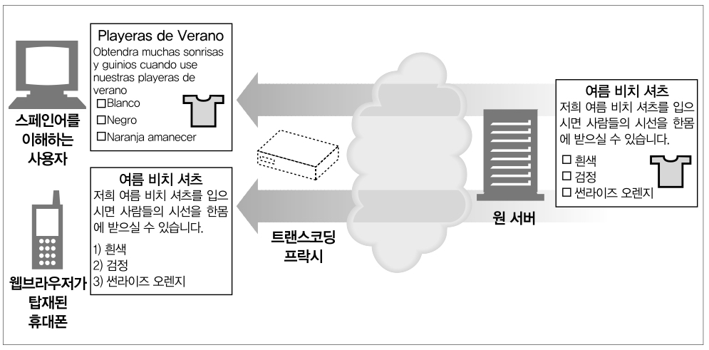</p>

<br>

- 콘텐츠를 클라이언트에게 전달하기 전에 본문 포맷을 수정할 수 있다. 이렇게 데이터의 표현 방식을 자연스럽게 변환하는 것을 트랜스 코딩이라고 부른다.

### 익명화 프락시

<br>

<p align="center">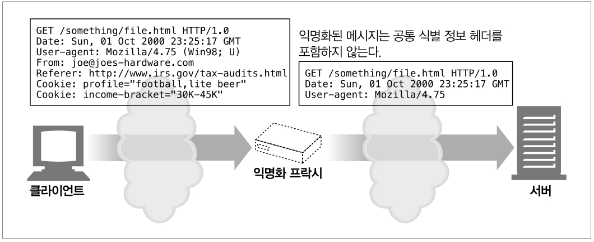</p>

<br>

- HTTP 메시지에서 신원을 식별할 수 있는 특성(클라이언트 IP 주소, 쿠키, URI 세션 아이디 등)들을 적극적으로 제거함으로써 개인 정보 보호와 익명성 보장에 기여한다.

<br><br>

## 6.3 프락시는 어디에 있는가?

<br>

- 어떻게 프락시가 네트워크에 배치되는가

- 어떻게 프락시의 연쇄가 계층을 이루는가

- 어떻게 트래픽이 올바르게 프락시를 찾아가는가

### 6.3.1 프락시 서버 배치

<br>

<p align="center">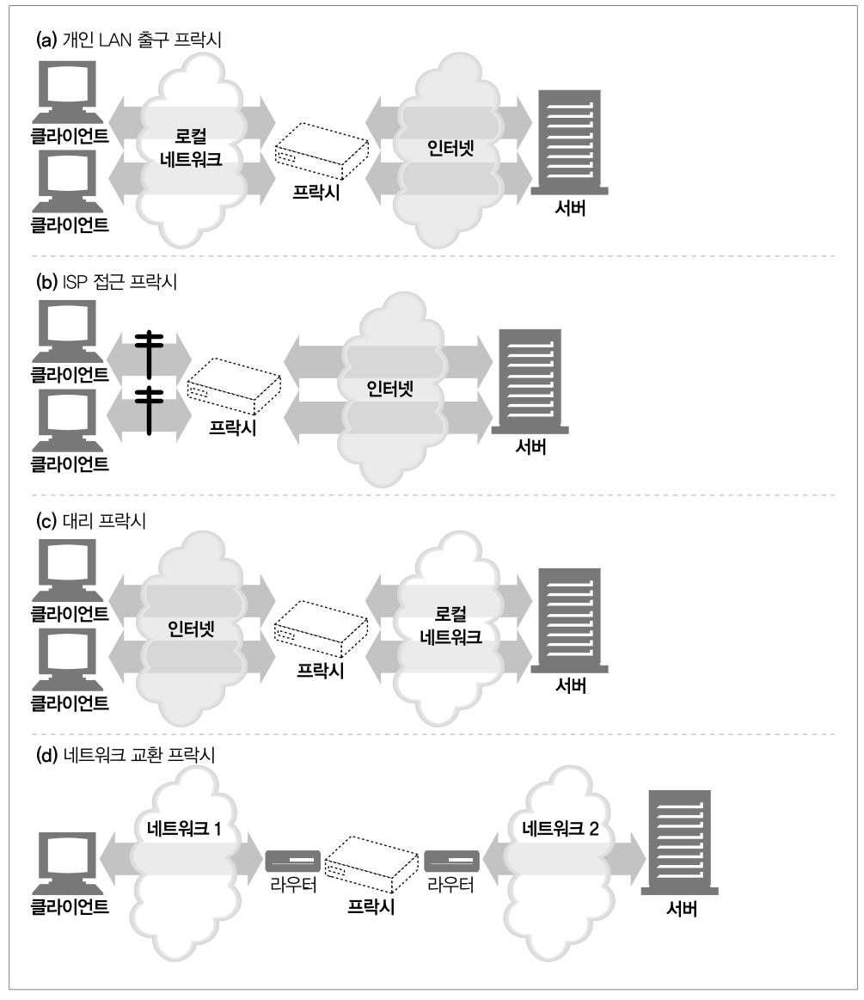</p>

<br>

- 출구 프락시

    로컬 네트워크와 더 큰 인터넷 사이를 오가는 트래픽을 제어하기 위해 프락시를 로컬 네트워크의 출구에 넣는다.

    회사의 방화벽, 필터링 출구 프락시 등

<br>

- 접근 프락시

    고객으로부터의 모든 요청을 종합적으로 처리하기 위해 프락시는 ISP 접근 지점에 위치한다.

        ISP란?

        ISP는 Internet Service Provider의 약자로, 인터넷 서비스 제공자를 의미합니다. 
        
        인터넷에 접속하는 수단을 제공하는 주체를 말합니다. 일반 사용자, 기업체, 기관, 단체 등이 인터넷에 접속하여 인터넷을 이용할 수 있도록 돕는 사업자입니다.

<br>

- 대리 프락시

    리버스 프락시라고도 하며, 네트워크의 가장 끝에 있는 웹 서버들의 바로 앞에 위치하여 웹 서버로 향하는 모든 요청을 처리하고 필요할 때만 웹 서버에게 자원을 요청할 수 있다.

    또한, 보안 기능을 추가하거나 빠른 웹 서버 캐시를 느린 웹 서버의 앞에 놓음으로써 성능을 개선한다.

<br>

- 네트워크 교환 프락시

    캐시를 이용해 인터넷 교차로의 혼잡을 완화하고 트래픽 흐름을 감시하기 위해 네트워크 사이의 인터넷 피어링 교환 지점에 놓는다.

        인터넷 피어링 교환 지점이란?
        
        인터넷 피어링 교환 지점(Internet Exchange Point, IXP)은 서로 다른 네트워크가 인터넷 트래픽을 교환하기 위해 모이는 물리적 위치입니다. 
        
        IXP는 인터넷 서비스 제공업체(ISP), 콘텐츠 전송 네트워크(CDN), 기업, 기관 등 다양한 네트워크가 하나의 점에서 데이터 전송을 수행할 수 있도록 하는 중요한 허브 역할을 합니다.

<br>

### 6.3.2 프락시 계층

<br>

<p align="center">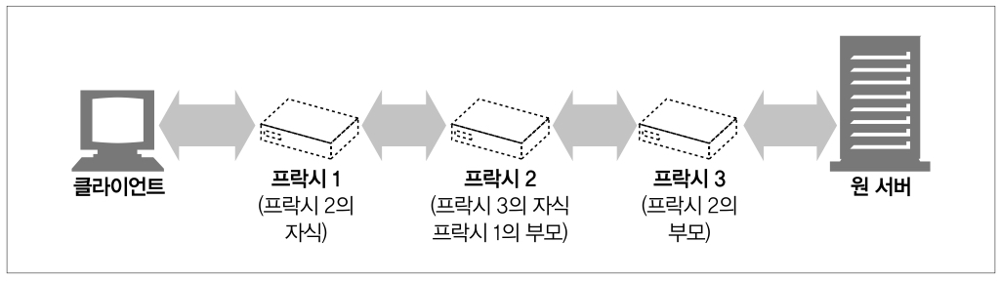</p>

<br>

- 프락시들은 프락시 계층이라고 불리는 연쇄를 구성할 수 있다.

- 프락시 계층에서 프락시 서버들은 부모와 자식의 관계를 갖는다.

<br>

<p align="center">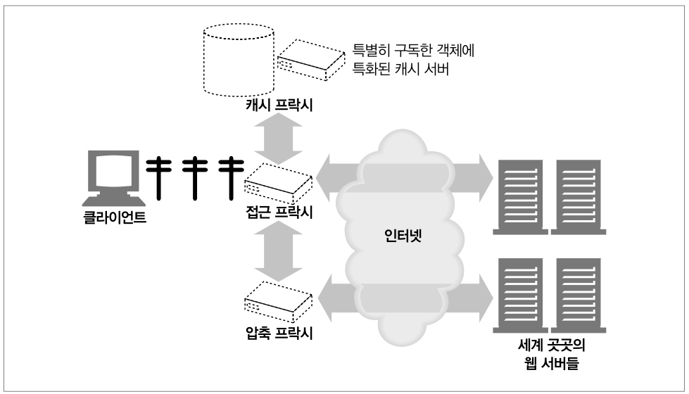</p>

<br>

- 해당 그림에서서 접근 프락시는 상황에 맞게 부모 프락시나 원 서버에게 라우팅한다.

    요청된 객체가 콘텐츠 분산을 위해 돈을 지불한 웹 서버에 속한 경우, 프락시는 요청을 가까운 캐시 서버에게 보내 캐시된 객체를 반환할 수 있다.

    요청이 특정 종류의 이미지인 경우, 접근 프락시는 그 요청이 특화된 압축 프락시에게 보내어 그 프락시가 이미지를 가져와 압축을 하게 하여 빠르게 클라이언트가 다운로드할 수 있게 한다.

<br>

- 동적 부모 선택의 몇 가지 예

    - 부하 균형

        자식 프락시는 부하를 분산하기 위해 부모들의 작업량 수준에 근거하여 부모 프락시를 고른다.

    - 지리적 인접성에 근거한 라우팅

        자식 프락시는 원 서버의 지역을 담당하는 부모를 선택할 수도 있다.

    - 프로토콜/타입 라우팅

        어떤 자식 프락시는 URI에 근거하여 다른 부모나 원 서버로 라우팅할 수 있다.

    - 유료 서비스 가입자를 위한 라우팅

        추가금을 지불했다면, 그들의 URI는 대형 캐시나 성능 개선을 위한 압축 엔진으로 라우팅될 수 있다.

<br>

### 6.3.3 어떻게 프락시가 트래픽을 처리하는가

- 클라이언트는 보통 웹 서버와 직접 대화하기 때문에, 먼저 어떻게 HTTP 트래픽이 프락시로 향하는 길을 찾아내는지 설명할 필요가 있다.

<br>

<p align="center"></p>

<br>


- 클라이언트는 수정한다

    많은 웹 클라이언트들은 수동 혹은 자동 프락시 설정을 지원한다.

    프락시를 사용하도록 설정되어 있다면 클라이언트는 HTTP 요청을 원 서버가 아닌 프락시로 보낸다.

- 네트워크를 수정한다

    네트워크 인프라를 가로채서 웹 트래픽을 프락시로 가도록 조정하는 기법이 있다.

    HTTP 트래픽을 지켜보고 가로채어 클라이언트 모르게 트래픽을 프락시로 보내는 스위칭 장치와 라우팅 장치를 필요로 한다. 이것을 인터셉트 프락시라고 부른다.

- DNS 이름 공간을 수정한다

    리버스 프락시는 웹 서버의 이름과 IP 주소를 직접 사용한다. 
    
    이는 DNS 이름 테이블을 수동으로 편집하거나 특별한 동적 DNS 서버를 이용해서 조정될 수 있다.

- 웹 서버를 수정한다

    HTTP 리다이렉션 명령(응답 코드 305)을 클라이언트에게 돌려줌으로써 프락시로 리다이렉트 하도록 설정할 수 있다.

<br><br>

## 6.4 클라이언트 프락시 설정

프락시를 설정하는 여러 가지 방법

- 수동 설정
  
    프락시를 사용하겠다고 명시적으로 설정한다.

- 브라우저 기본 설정

- 프락시 자동 설정

    자바스크립트 프락시 자동 설정(PAC) 파일에 대한 URI를 제공할 수 있다.

- WPAD 프락시 발견

    브라우저는 자동설정 파일을 다운받을 수 있는 설정 서버를 자동으로 찾아주는 웹 프락시 자동발견 프로토콜을 제공한다.

<br>

### 6.4.1 수동 설정

- 많은 웹 클라이언트가 프락시를 수동으로 설정할 수 있도록 하고 있다.

### 6.4.2 PAC 파일

- 수동 프락시 설정은 유연하지 못하기에 동적으로 해결할 방법이 필요하다. 

- 문서에 접근할 때마다, 자바스크립트 함수가 적절한 프락시 서버를 선택한다.

### 6.4.3 WPAD

- 브라우저에 알맞은 PAC 파일을 자동으로 찾아주는 알고리즘이다.

- 다음과 같은 순서로 진행된다.

    1. PAC URI를 찾기 위해 WPAD를 사용한다.

    2. 주어진 URI에서 PAC 파일을 가져온다.

    3. 프락시 서버를 알아내기 위해 PAC 파일을 실행한다.

    4. 알아낸 프락시 서버를 이용해서 요청을 처리한다.

<br><br>

## 6.5 프락시 요청의 미묘한 특징들

### 6.5.1 프락시 URI는 서버 URI와 다르다

- 클라이언트가 프락시 대신 서버로 요청을 보내면 요청의 URI가 달라진다.

```
클라이언트 -> 웹 서버 요청

GET /index.html HTTP/1.0
User-Agent: SuperBrowserv1.3
```

- 단일 서버는 호스트 명과 포트번호를 알고 있기에 스킴과 호스트가 없는 부분 URI만 보낸다.

```
클라이언트 -> 프락시 요청

GET  http://www.marys-antiques.com/index.html HTTP/1.0
User-Agent: SuperBrowserv1.3
```

- 프락시는 목적지 서버와 커넥션을 맺어야 하기 때문에 전체 URI로 보내야 한다.

<br>

### 6.5.2 가상 호스팅에서 일어나는 같은 문제

- 프락시의 스킴/호스트/포트번호 누락 문제는 가상으로 호스팅되는 웹 서버가 직면한 것과 같은 문제이다.

- 가상으로 호스팅되는 웹 서버는 여러 웹 사이트가 같은 물리적 웹 서버를 공유한다.

- 요청 하나가 부분 URI /index.html로 오면 가상으로 호스팅되는 웹 서버는 그 요청이 접근하고자 하는 웹 사이트의 호스트 명을 알 필요가 있다.

### 6.5.3 인터셉트 프락시는 부분 URI를 받는다.

<br>

<p align="center">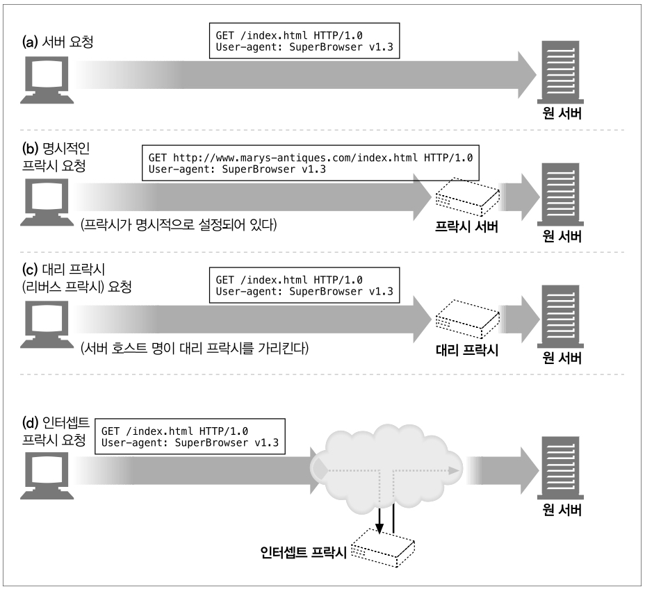</p>

<br>

- 인터셉트 프락시는 네트워크 흐름에서 클라이언트에서 서버로 가는 트래픽을 가로채 캐시된 응답을 돌려주는 등의 일을 하는 프락시 서버이다.

- 클라이언트에서 서버로 가는 트래픽을 가로채기 때문에, 웹 서버로 보내는 부분 URI를 얻게 될 것이다.

### 6.5.4 프락시는 프락시 요청과 서버 요청을 모두 다룰 수 있다.

- 트래픽이 프락시 서버로 리다이렉트 될 수 있는 여러 방법이 존재하기 때문에 다목적 프락시 서버는 요청 메시지의 완전한 URI와 부분 URI를 모두 지원해야 한다.

- 완전 URI와 부분 URI를 사용하는 규칙

    1. 완전한 URI가 주어졌다면, 프락시는 그것을 사용해야 한다.

    2. 부분 URI가 주어졌고 Host 헤더가 있다면, 이것을 이용해 원 서버의 이름과 포트 번호를 알아내야 한다.

    3. 부분 URI가 주어졌으나 Host 헤더가 없다면?

        - 프락시가 리버스 프락시라면 프락시에 실제 서버의 주소와 포트가 설정되어 있을 수 있다.

        - 이전에 어떤 인터셉트 프락시가 가로챘던 트래픽을 받았고, 그 인터셉트 프락시가 원 IP 주소와 포트 번호를 사용할 수 있게 해뒀다면, 그것을 사용할 수 있다.

        - 모두 실패했다면, 에러 메시지를 반환해야 한다.

### 6.5.5 전송 중 URI 변경

- 프락시 서버는 요청 URI의 변경에 신경을 써야 한다.

- 사소한 URI 변경이라도 상호운용성 문제를 일으킬 수 있기 때문이다.

### 6.5.6 URI 클라이언트 자동확장과 호스트명 분석

- 브라우저는 프락시의 존재 여부에 따라 요청 URI를 다르게 분석한다.

- 일반적인 웹 사이트 이름의 가운데 부분만 입력한다면, 예를 들어 naver를 입력한다면 자동으로 www.naver.com으로 바꿔준다.

- 몇몇 브라우저는 해석할 수 없는 URI를 오타 교정을 시도하고 사용자가 의도했을 URI를 제시하기도 한다.

### 6.5.7 프락시 없는 URI 분석

<br>

<p align="center">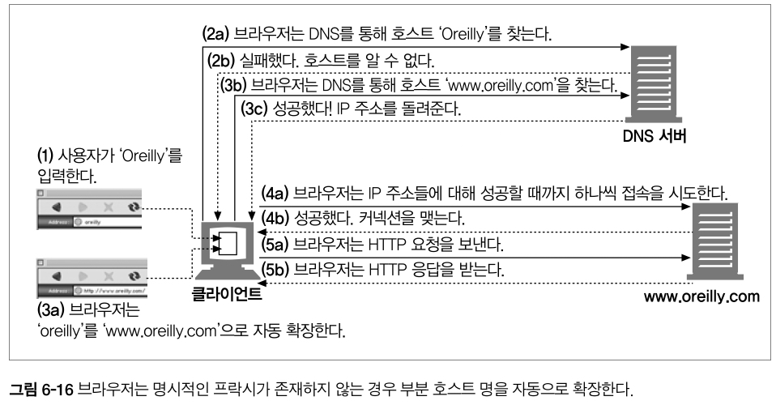</p>

<br>

### 6.5.8 명시적인 프락시를 사용할 때의 URI 분석

<br>

<p align="center">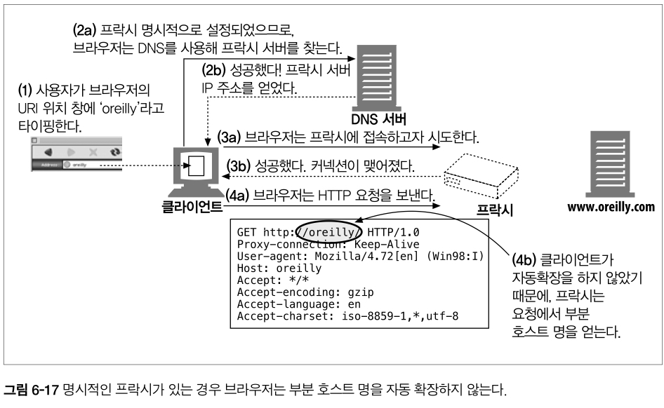</p>

<br>

### 6.5.9 인터셉트 프락시를 이용한 URI 분석

<br>

<p align="center">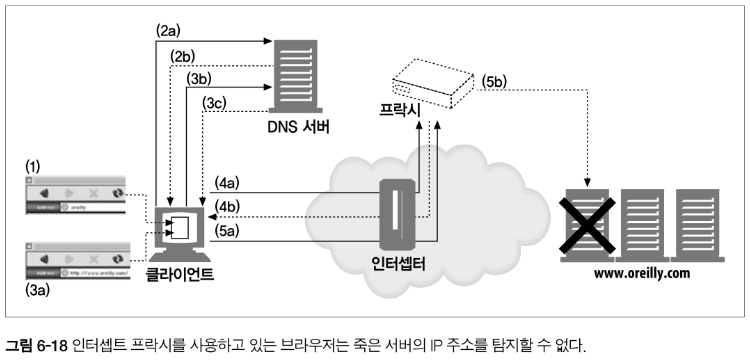</p>

<br>

- 단계 1에서 사용자는 브라우저의 URI 위치 창에 ‘oreilly’라고 타이핑한다.

- 단계 2a에서 브라우저는 호스트 ‘oreilly’를 DNS를 통해 찾아보지만, 단계 2b에서 DNS 서버는 실패하고 그 호스트는 알 수 없다고 응답한다.

- 단계 3a에서 브라우저는 ‘oreilly’를 ‘www.oreilly.com’으로 변환하는 자동확장을 한다. 단계 3b에서 브라우저는 DNS를 통해 호스트 ‘www.oreilly.com’를 찾아본다. 이때, 단계 3c에서 DNS 서버는 성공하고 IP 주소를 브라우저에게 반환한다.

- 단계 4a에서 클라이언트는 이미 성공적으로 호스트 명을 분석하였고 IP 주소의 목록을 갖고 있다. 일반적으로, 클라이언트는 성공할 때까지 모든 IP 주소에 대해 접속을 시도하지만, 어떤 IP 주소들은 죽은 것일 수 있다. 그러나 인터셉트 프락시와 함께라면, 첫 번째 접속 시도는 원 서버가 아닌 프락시 서버에 의해 종료된다. 클라이언트는 성공적으로 웹 서버와 대화했다고 믿지만, 웹 서버는 살아있지도 않았을 것이다.
  
- 프락시가 최종적으로 진짜 원 서버와 상호작용할 준비가 되었을 때(단계 5b), 프락시는 그 IP 주소가 실제로는 다운된 서버를 가리키고 있음을 알게 될 것이다. 브라우저에서 제공하는 것과 동등한 수준의 장애 허용(fault tolerance)을 제공하기 위해서, 프락시는 호스트 헤더에 들어 있는 호스트 명을 다시 분석하든 아니면 IP 주소에 대한 역방향 DNS 룩업을 해서든 다른 IP 주소를 시도해야 한다. 인터셉트 프락시와 명시적인 프락시 모두 죽은 서버의 DNS 분석에 대한 장애 허용을 지원해야 한다는 것은 중요한데, 왜냐하면 브라우저가 명시적인 프락시를 사용하도록 설정되어 있는 경우의 장애 허용은 프락시에 달려있기 때문이다.

<br><br>

## 6.6 메시지 추적

- 웹 요청이 클라이언트에서 서버로 향하는 도중에 둘 이상의 프락시를 지나게 되는 것은 빈번하다.

- 보안과 비용 절감을 위해 캐시 프락시 서버를 사용하며 많은 대형 ISP들이 성능 개선과 기능 구현을 위해 프락시 캐시를 사용한다.


<br>

### 6.6.1 Via 헤더

- Via 헤더 필드는 메시지가 지나는 각 중간 노드(프락시나 게이트웨이)의 정보를 나열한다.

- 다른 노드들을 지나갈 때마다 Via 목록의 끝에 추가되어야 한다.

<br>

<p align="center">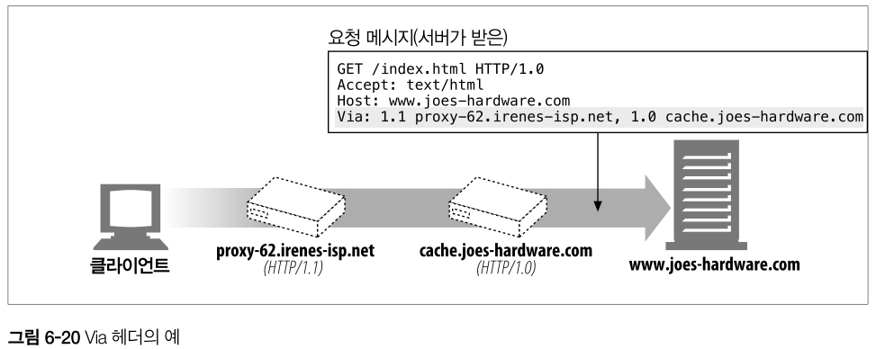</p>

<br>

- Via 헤더는 메시지의 전달을 추적하고, 루프를 진단하고, 요청과 응답을 지나는 과정에서 모든 메시지 발송자들의 프로토콜을 다루는 능력을 알아보기 위해 사용된다.

- Via 문법

```
예시

Via: 1.1 proxy-62.irenes-isp.net, 1.0 cache.joes-hardware.com
```

```
문법

Via               = "Via" ":" ( waypoint ) [", " ( waypoint )...]
waypoint          = ( received-protocol received-by [ comment ] )
received-protocol = [ protocol-name "/" ] protocol-version
received-by       = ( host [ ":" port ] ) | pseudonym
```

- 각 Via waypoint는 프로토콜 이름(선택. 기본은 HTTP), 프로토콜 버전(필수), 노드 이름(필수), 코멘트(선택)의 최대 4개의 구성요소를 담을 수 있다.

<br>

- 프로토콜 이름
  
    중개자가 받은 프로토콜. 만약 프로토콜이 HTTP라면 프로토콜 이름은 없어도 된다. 한편, 프로토콜 이름은 버전 앞에 /로 구분되어 붙는다. 비 HTTP 프로토콜은 게이트웨이가 다른 프로토콜(HTTPS, FTP 등)을 위해 HTTP 요청에 접속할 때 발생할 수 있다.

<br>

- 프로토콜 버전
  
    수신한 메시지의 버전. 버전의 포맷은 프로토콜에 달려있다. HTTP의 경우, 표준 버전 번호(1.0, 1.1 등)가 사용된다. 버전은 Via 필드에 포함되므로, 애플리케이션들은 자신 이전의 모든 중개자들이 어떤 버전을 다룰 수 있는지 알 수 있다.

<br>

- 노드 이름

    중개자의 호스트와 포트 번호(선택. 만약 포트가 포함되어 있지 않다면, 사용하는 프로토콜의 기본 포트라고 간주할 수 있다). 몇몇 조직은 정보 보호를 이유로 진짜 호스트 명을 밝히고 싶어 하지 않을 수 있는데, 그러한 경우 가명으로 대체할 수 있다.

<br>

- 노드 코멘트
    
    중개자 노드를 서술하는 선택적인 코멘트. 벤더나 버전 정보를 여기에 포함시키는 것은 흔한 일이며, 몇몇 프락시 서버는 장치에서 일어난 이벤트에 대한 진단 정보를 포함하는 데도 코멘트 필드를 사용한다.

<br>

- Via 요청과 응답 경로
    
    요청 메시지와 응답 메시지 모두 프락시를 지나므로 둘 모두 Via 헤더를 가진다.
    
    요청과 응답은 보통 같은 TCP 커넥션을 오가므로, 응답 메시지는 요청과 같은 경로를 되돌아간다. 만약 요청 메시지가 프락시 A, B, C를 지나간다면, 그에 대한 응답 메시지는 프락시 C, B, A를 지나간다. 즉, 응답의 Via 헤더는 거의 언제나 요청의 Via 헤더와 반대다.

<br>

- Via와 게이트 웨이
  
<br>

<p align="center">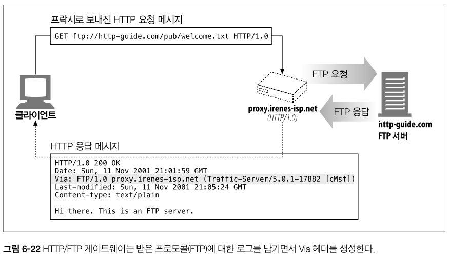</p>

<br>

- 몇몇 프락시는 서버에게 비 HTTP 프로토콜을 사용할 수 있는 게이트웨이 기능을 제공한다. 
  
- Via 헤더는 이러한 프로토콜 변환을 기록하므로 HTTP 애플리케이션은 프락시 연쇄에서 프로토콜 능력과 변환이 있었는지를 알아챌 수 있다.

<br>

- Server 헤더와 Via 헤더

    응답 메시지가 프락시를 통과할 때, 프락시는 Server 헤더를 수정해서는 안 된다. Server 헤더는 원 서버를 위해 존재한다. 대신 프락시는 Via 항목을 추가해야 한다.

<br>

- Via가 개인정보 보호와 보안에 미치는 영향

    Via 문자열 안에 정확한 호스트 명이 들어가기를 원하지 않는 몇 가지 경우가 있다. 
    
    보통 명시적으로 이 동작이 켜져 있지 않은 이상, 프락시 서버가 네트워크 방화벽의 일부인 경우 프락시는 방화벽 뒤에 숨어있는 호스트의 이름과 포트를 전달해서는 안 된다. 
    
    방화벽 뒤의 네트워크 아키텍처에 대한 정보가 악의적인 집단에 의해 이용될 수 있기 때문이다.

    만약 Via 노드 이름 전달이 가능하지 않다면, 보안 경계선의 일부분인 프락시는 호스트 명을 그 호스트에 대한 적당한 가명으로 교체해야 한다. 
    
    하지만 이로 인해 실제 이름을 알기 어렵게 되었다고 하더라도, 일반적으로 프락시는 각 프락시 서버에 대한 Via 경유지 항목을 유지하려 노력해야 한다.

### 6.6.2 TRACE 메서드

<br>

<p align="center">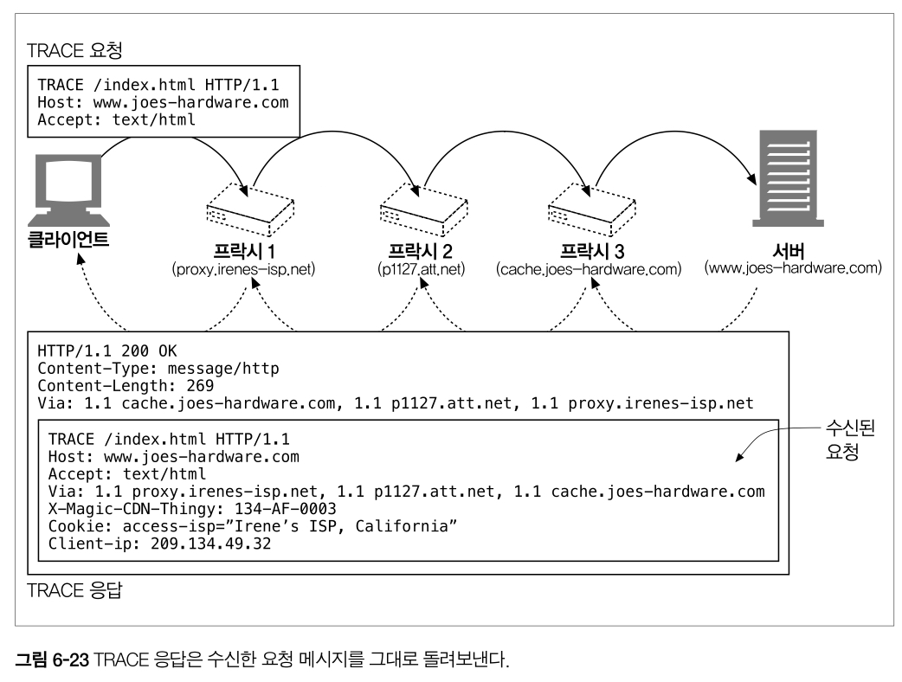</p>

<br>

- 프락시 서버는 메시지가 전달될 때 메시지를 바꿀 수 있다. 

- 헤더가 추가되거나, 변경되거나, 삭제될 수 있으며, 본문이 다른 형식으로 변환될 수 있다.

- 프락시가 점점 복잡해지고 더 많은 벤더가 프락시 제품을 배치하면서, 상호운용성 문제가 증가한다. 
  
- 프락시 네트워크를 쉽게 진단하기 위해, 우리는 HTTP 프락시 네트워크를 통해 홉에서 홉으로 전달될 때마다 메시지의 내용이 어떻게 변하는지 편리하게 관찰할 방법이 필요하다.

- HTTP/1.1의 TRACE 메서드는 요청 메시지를 프락시의 연쇄를 따라가면서 어떤 프락시를 지나가고 어떻게 각 프락시가 요청 메시지를 수정하는지 관찰/추적할 수 있도록 해준다. 
  
- TRACE는 프락시 흐름을 디버깅하는데 매우 유용하다.

- Max-Forwards 헤더로 TRACE와 OPTIONS 요청의 프락시 홉(hop) 개수를 제한할 수 있다.


<br>

## 6.7 프락시 인증

<br>

<p align="center">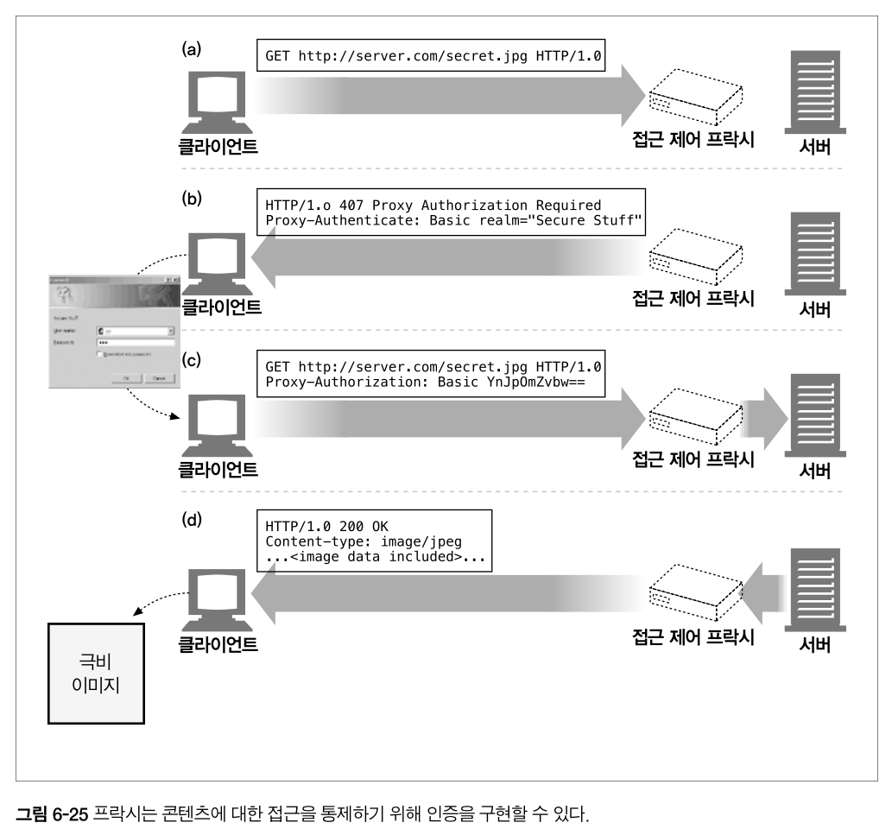</p>

<br>

- 프락시는 접근 제어 장치로서 제공될 수 있다. 

- HTTP는 사용자가 유효한 접근 권한 자격을 프락시에 제출하지 않는 한 콘텐츠에 대한 요청을 차단하는 프락시 인증이라는 메커니즘을 정의하고 있다.

<br>

## 6.8 프락시 상호운용성

- 클라이언트, 서버, 프락시는 HTTP 명세의 여러 버전에 대해 여러 벤더에 의해 만들어진다. 

- 그들이 지원하는 여러 가지 기능을 지원하며 제각각 다른 버그를 갖고 있다. 프락시 서버는 서로 다른 프로토콜을 구현했을 수도 있고 골치 아프게 이상한 동작을 할 수도 있는 클라이언트와 서버 사이를 중개해야 한다.

### 6.8.1 지원하지 않는 헤더와 메서드 다루기

- 프락시 서버는 넘어오는 헤더 필드들을 모두 이해하지 못할 수도 있다. 

- 프락시는 이해할 수 없는 헤더 필드는 반드시 그대로 전달해야 하며, 같은 이름의 헤더 필드가 여러 개 있는 경우에는 그들의 상대적인 순서도 반드시 유지해야 한다.
  
- 만약 프락시가 어떤 메서드와 친숙하지 않다면, 가능한 한 그 메시지를 다음 홉으로 전달하려 시도해야 한다.

### 6.8.2 OPTIONS: 어떤 기능을 지원하는지 알아보기

<br>

<p align="center">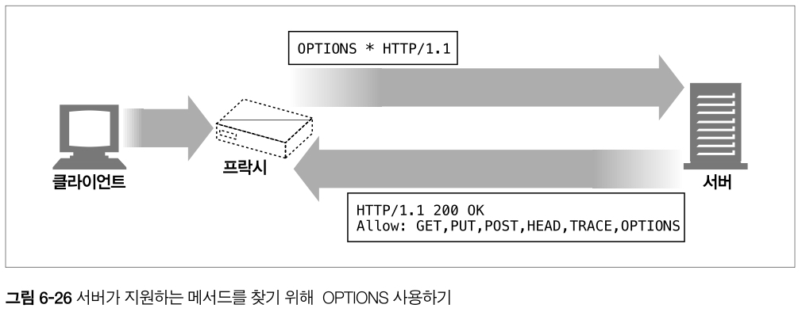</p>

<br>

- HTTP OPTIONS 메서드는 서버나 웹 서버의 특정 리소스가 어떤 기능을 지원하는지(예를 들면 지원하는 메서드) 클라이언트(혹은 프락시)가 알아볼 수 있게 해준다.

### 6.8.3 Allow 헤더

- Allow 엔터티 헤더 필드는, 요청 URI에 의해 식별되는 자원에 대해 지원되는 메서드들이나 서버가 지원하는 모든 메서드(요청 URI가 별표인 경우)를 열거한다.

