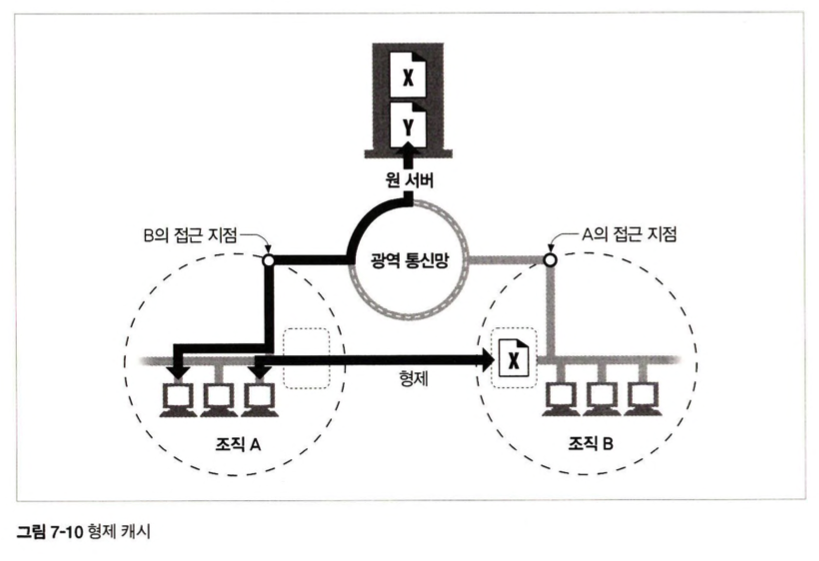

# 7장. 캐시

 

## 소개

 

웹 캐시는 자주 쓰이는 문서의 사본을 자동으로 보관하는 HTTP 장치이다.

웹 요청이 캐시에 도착했을 때, 캐시된 로컬 사본이 존재한다면, 그 문서는 원 서버가 아니라 그 캐시로부터 제공된다.

캐시의 혜택

- 불필요한 데이터 전송을 줄여서 네트워크 요금을 줄여준다.

- 네트워크 병목을 줄여준다. 대역폭을 늘리지 않고도 페이지를 빨리 불러올 수 있다.

- 원 서버에 대한 요청을 줄여준다. 서버는 부하를 줄일 수 있으며 더 빨리 응답할 수 있게 된다.

- 거리로 인한 지연을 줄여준다.

이 장에서 우리는 어떻게 캐시가 성능을 개선하고 비용을 줄이는지, 어떻게 그 효과를 측정하는지, 효과를 극대화하기 위해서는 캐시를 어디에 위치시켜야 하는지를 알아보자.

  

## 7.1 불필요한 데이터 전송

- 복수의 클라이언트가 자주 쓰이는 원 서버 페이지에 접근할 때, 서버는 같은 문서를 클라이언트들에게 각각 한 번씩 전송하고 똑같은 바이트들이 네트워크를 통해 계속 반복해서 이동한다.

- `캐시를 이용하면 첫번째 서버 응답은 캐시에 보관된다.` 캐시된 사본이 뒤이은 요청들에 대한 응답으로 사용될 수 있기 때문에 원 서버가 중복해서 트래픽을 주고받는 낭비가 줄어들게 된다.

  

## 7.2 대역폭 병목

- 캐시는 네트워크 병목을 줄여준다. 많은 네트워크가 원격 서버보다 로컬 네트워크 클라이언트에 더 넓은 대역폭을 제공한다.

- 클라이언트들이 서버에 접근할 때 속도는 그 경로에 있는 가장 느린 네트워크의 속도와 같다.

        대역폭이란?

        네트워크 대역폭은 주어진 시간 (보통 1 초) 동안 컴퓨터 네트워크 또는 인터넷 연결을 통해 한 지점에서 다른 지점으로 최대 데이터 양을 전송하는 유선 또는 무선 네트워크 통신 링크의 용량입니다. 
        
        용량과 동의어인 대역폭은 데이터 전송 속도를 나타 냅니다. 대역폭은 네트워크 속도의 척도가 아니며 일반적인 오해입니다.

  

## 7.3 갑작스런 요청 쇄도

- 많은 사람들이 동시에 웹 문서에 접근할 때 불필요한 트래픽 급증을 발생시키고, 네트워크와 웹 서버에 심각한 장애를 만든다.

  

## 7.4 거리로 인한 지연

- 모든 네트워크 라우터는 제각각 인터넷 트래픽을 지연시킨다. 그리고 클라이언트와 서버 사이에 라우터가 그다지 많지 않더라도, 빛의 속도 그 자체가 유의미한 지연을 유발한다.

  

## 7.5 적중과 부적중

- `캐시 적중(cache hit)`은 캐시에 요청이 도착했을 때, 그에 대응하는 사본이 있다면 그를 이용해 요청이 처리되는 것이다.

- `캐시 부적중(cache miss)`은 대응하는 사본이 없다면 원 서버로 전달이 되는 것이다.

### 7.5.1 재검사

- 원 서버 콘텐츠는 변경될 수 있기 때문에, 캐시는 반드시 그들이 갖고 있는 사본이 여전히 최신인지 서버를 통해 점검해야 한다. 이런 신선도 검사를 `HTTP 재검사`라 부른다.

- 효과적인 재검사를 위해 서버로부터 전체 객체를 가져오기 않고도 여전히 신선한지 빠르게 검사할 수 있는 특별한 요청을 정의한다.

 

- 캐시가 사본의 재검사가 필요할 때, 원 서버에 작은 재검사 요청을 보낸다. 컨텐츠가 변경되지 않았다면, 서버는 304 Not Modified 응답을 보낸다.

- 그 사본이 여전히 유효함을 알게 된 캐시는 사본이 신선하다고 임시로 표시한 뒤 그 사본을 클라이언트에게 제공한다. 이를 `재검사 적중 혹은 느린 적중`이라고 부른다.

- 이것은 원 서버와 검사가 필요하기 때문에 순수 캐시 적중보다 느리다.

 

- 캐시된 객체를 재확인하기 위한 몇 가지 도구

    - If-Modified-Since 헤더

        서버에게 보내는 GET 요청에 이 헤더를 추가하면 캐시된 시간 이후에 변경된 경우에 사본을 보내달라는 의미

        변경되지 않았다면 304 Not Modified, 변경되었다면 콘텐츠 전체와 함께 200 OK, 삭제되었다면 404 Not Found와 함께 캐시의 사본 삭제

 

### 7.5.2 적중률

- 캐시가 요청을 처리하는 비율을 캐시 적중률 혹은 문서 적중률이라고 부른다.

- 오늘날 적중률은 40% 정도면 괜찮은 편이다.

- 보통 크기의 캐시라도 충분한 분량의 자주 쓰이는 문서들을 보관하여 트래픽을 줄이고 성능을 개선할 수 있다는 점이다. 캐시는 유용한 콘텐츠가 캐시 안에 머무르도록 보장하기 위해 노력한다.

 

### 7.5.3 바이트 적중률

- 얼마나 많은 바이트가 인터넷을 나가지 않았는지의 비율을 바이트 단위 적중률이라고 부른다.

 

### 7.5.4 적중과 부적중의 구별

- HTTP는 클라이언트에게 응답이 캐시 적중인지 원 서버 접근인지 알려주지 않는다. 모두 200 OK 응답을 제공하기 때문이다.

- Date 헤더를 통해 현재 시각과 비교하여 응답 생성일이 오래되었다면 응답이 캐시된 것이다.

- 다른 방법으로는 Age 헤더를 이용하여 응답이 얼마나 오래되었는지 알 수 있다.

  

## 7.6 캐시 토폴리지

- 캐시는 한 명의 사용자에게만 할당될 수도 있고, 반대로 수천 명의 상요자들 간에 공유될 수도 있다.

- 개인 전용 캐시는 개인만을 위한 캐시이므로, 한 명의 사용자가 자주 찾는 페이지를 담는다.

- 공용 캐시는 사용자 집단에게 자주 쓰이는 페이지를 담는다.

 

### 7.6.1 개인 전용 캐시

- 개인 전용 캐시는 많은 에너지나 저장 공간을 필요로 하지 않기에 작고 저렴하다.

- 웹브라우저는 개인 전용 캐시를 내장하고 있다. 대부분의 브라우저는 자주 쓰이는 문서를 개인용 컴퓨터의 디스크와 메모리에 캐시해놓고 사용자가 캐시 사이즈와 설정을 수정할 수 있도록 허용한다.

- 캐시에 어떤 것들이 들어있는지 확인하기 위해 브라우저 안을 들여다보는 것도 가능하다.

### 7.6.2 공용 프락시 캐시

- 공용 캐시는 캐시 프락시 서버 혹은 프락시 캐시라고 불리는 특별한 종류의 공유된 프락시 서버이다.

- 공용 캐시에는 여러 사용자가 접근하기 때문에 불필요한 트래픽을 줄일 수 있는 기회가 많다.

### 7.6.3 프락시 캐시 계층들

- 작은 캐시에서 캐시 부적중이 발생했을 때, 더 큰 부모 캐시가 그 걸러 남겨진 트래픽을 처리하도록 계층을 만드는 방식이 합리적인 경우가 많다. 즉, 2단계 이상의 캐시 구조

### 7.6.4 캐시망, 콘텐츠 라우팅, 피어링

- 몇몇 네트워크 아키텍쳐는 단순한 캐시 계층 대신 복잡한 캐시망을 만든다.

- 캐시망의 프락시 캐시는 어떤 부모 캐시와 대화할 것인지, 원 서버로 바로 가도록 할 것인지에 대해 캐시 커뮤니케이션 결정을 동적으로 내린다.

- 캐시망 안에서의 콘텐츠 라우팅을 위해 설계된 캐시들은 다음과 같은 일을 한다.

    1. URL에 근거하여 부모 캐시와 원 서버 중 하나를 동적으로 선택한다.

    2. URL에 근거하여 특정 부모 캐시를 동적으로 선택한다.

    3. 부모 캐시에 가기 전에 캐시된 사본을 로컬에서 찾아본다.

    4. 다른 캐시들이 그들의 캐시된 콘텐츠에 부분적으로 접근할 수 있도록 허용하되, 그들의 캐시를 통한 인터넷 트랜짓(트래픽이 다른 네트워크로 건너가는 것)은 허용하지 않는다.

 

 

- 이러한 복잡한 캐시 사이의 관계는 서로 다른 조직들이 상호 이득을 위해 그들의 캐시를 연결하여 서로를 찾아볼 수 있도록 해준다.

- 선택적인 피어링을 지원하는 캐시는 형제 캐시라고 불리며 HTTP는 형제 캐시를 지원하지 않기 때문에 사람들은 인터넷 캐시 프로토콜(ICP)이나 하이퍼텍스트 캐시 프로토콜(HTCP)같은 프로토콜을 이용해 HTTP를 확장한다.