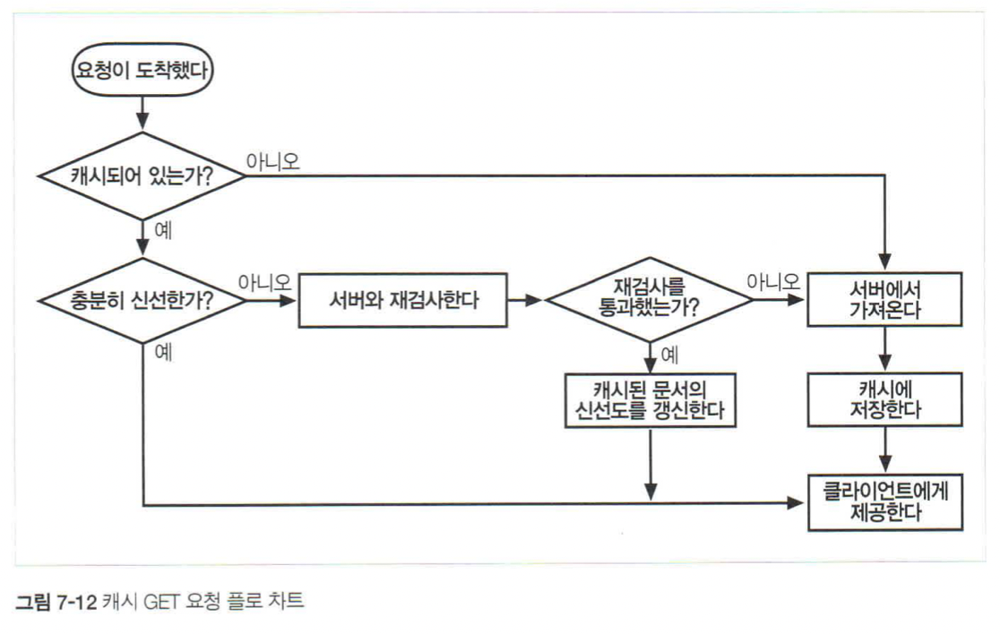
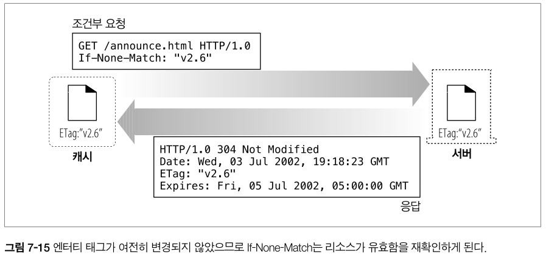

# 7장. 캐시

<br>

## 소개

<br>

웹 캐시는 자주 쓰이는 문서의 사본을 자동으로 보관하는 HTTP 장치이다.

웹 요청이 캐시에 도착했을 때, 캐시된 로컬 사본이 존재한다면, 그 문서는 원 서버가 아니라 그 캐시로부터 제공된다.

캐시의 혜택

- 불필요한 데이터 전송을 줄여서 네트워크 요금을 줄여준다.

- 네트워크 병목을 줄여준다. 대역폭을 늘리지 않고도 페이지를 빨리 불러올 수 있다.

- 원 서버에 대한 요청을 줄여준다. 서버는 부하를 줄일 수 있으며 더 빨리 응답할 수 있게 된다.

- 거리로 인한 지연을 줄여준다.


이 장에서 우리는 어떻게 캐시가 성능을 개선하고 비용을 줄이는지, 어떻게 그 효과를 측정하는지, 효과를 극대화하기 위해서는 캐시를 어디에 위치시켜야 하는지를 알아보자.

<br><br>

## 7.1 불필요한 데이터 전송

- 복수의 클라이언트가 자주 쓰이는 원 서버 페이지에 접근할 때, 서버는 같은 문서를 클라이언트들에게 각각 한 번씩 전송하고 똑같은 바이트들이 네트워크를 통해 계속 반복해서 이동한다.

- `캐시를 이용하면 첫번째 서버 응답은 캐시에 보관된다.` 캐시된 사본이 뒤이은 요청들에 대한 응답으로 사용될 수 있기 때문에 원 서버가 중복해서 트래픽을 주고받는 낭비가 줄어들게 된다.

<br><br>

## 7.2 대역폭 병목

- 캐시는 네트워크 병목을 줄여준다. 많은 네트워크가 원격 서버보다 로컬 네트워크 클라이언트에 더 넓은 대역폭을 제공한다.

- 클라이언트들이 서버에 접근할 때 속도는 그 경로에 있는 가장 느린 네트워크의 속도와 같다.

        대역폭이란?

        네트워크 대역폭은 주어진 시간 (보통 1 초) 동안 컴퓨터 네트워크 또는 인터넷 연결을 통해 한 지점에서 다른 지점으로 최대 데이터 양을 전송하는 유선 또는 무선 네트워크 통신 링크의 용량입니다. 
        
        용량과 동의어인 대역폭은 데이터 전송 속도를 나타 냅니다. 대역폭은 네트워크 속도의 척도가 아니며 일반적인 오해입니다.

<br><br>

## 7.3 갑작스런 요청 쇄도

- 많은 사람들이 동시에 웹 문서에 접근할 때 불필요한 트래픽 급증을 발생시키고, 네트워크와 웹 서버에 심각한 장애를 만든다.

<br><br>

## 7.4 거리로 인한 지연

- 모든 네트워크 라우터는 제각각 인터넷 트래픽을 지연시킨다. 그리고 클라이언트와 서버 사이에 라우터가 그다지 많지 않더라도, 빛의 속도 그 자체가 유의미한 지연을 유발한다.

<br><br>

## 7.5 적중과 부적중

- `캐시 적중(cache hit)`은 캐시에 요청이 도착했을 때, 그에 대응하는 사본이 있다면 그를 이용해 요청이 처리되는 것이다.

- `캐시 부적중(cache miss)`은 대응하는 사본이 없다면 원 서버로 전달이 되는 것이다.

### 7.5.1 재검사

- 원 서버 콘텐츠는 변경될 수 있기 때문에, 캐시는 반드시 그들이 갖고 있는 사본이 여전히 최신인지 서버를 통해 점검해야 한다. 이런 신선도 검사를 `HTTP 재검사`라 부른다.

- 효과적인 재검사를 위해 서버로부터 전체 객체를 가져오기 않고도 여전히 신선한지 빠르게 검사할 수 있는 특별한 요청을 정의한다.

<br>

- 캐시가 사본의 재검사가 필요할 때, 원 서버에 작은 재검사 요청을 보낸다. 컨텐츠가 변경되지 않았다면, 서버는 304 Not Modified 응답을 보낸다.

- 그 사본이 여전히 유효함을 알게 된 캐시는 사본이 신선하다고 임시로 표시한 뒤 그 사본을 클라이언트에게 제공한다. 이를 `재검사 적중 혹은 느린 적중`이라고 부른다.

- 이것은 원 서버와 검사가 필요하기 때문에 순수 캐시 적중보다 느리다.

<br>

- 캐시된 객체를 재확인하기 위한 몇 가지 도구

    - If-Modified-Since 헤더

        서버에게 보내는 GET 요청에 이 헤더를 추가하면 캐시된 시간 이후에 변경된 경우에 사본을 보내달라는 의미

        변경되지 않았다면 304 Not Modified, 변경되었다면 콘텐츠 전체와 함께 200 OK, 삭제되었다면 404 Not Found와 함께 캐시의 사본 삭제

<br>

### 7.5.2 적중률

- 캐시가 요청을 처리하는 비율을 캐시 적중률 혹은 문서 적중률이라고 부른다.

- 오늘날 적중률은 40% 정도면 괜찮은 편이다.

- 보통 크기의 캐시라도 충분한 분량의 자주 쓰이는 문서들을 보관하여 트래픽을 줄이고 성능을 개선할 수 있다는 점이다. 캐시는 유용한 콘텐츠가 캐시 안에 머무르도록 보장하기 위해 노력한다.

<br>

### 7.5.3 바이트 적중률

- 얼마나 많은 바이트가 인터넷을 나가지 않았는지의 비율을 바이트 단위 적중률이라고 부른다.

<br>

### 7.5.4 적중과 부적중의 구별

- HTTP는 클라이언트에게 응답이 캐시 적중인지 원 서버 접근인지 알려주지 않는다. 모두 200 OK 응답을 제공하기 때문이다.

- Date 헤더를 통해 현재 시각과 비교하여 응답 생성일이 오래되었다면 응답이 캐시된 것이다.

- 다른 방법으로는 Age 헤더를 이용하여 응답이 얼마나 오래되었는지 알 수 있다.

<br><br>

## 7.6 캐시 토폴리지

- 캐시는 한 명의 사용자에게만 할당될 수도 있고, 반대로 수천 명의 상요자들 간에 공유될 수도 있다.

- 개인 전용 캐시는 개인만을 위한 캐시이므로, 한 명의 사용자가 자주 찾는 페이지를 담는다.

- 공용 캐시는 사용자 집단에게 자주 쓰이는 페이지를 담는다.

<br>

### 7.6.1 개인 전용 캐시

- 개인 전용 캐시는 많은 에너지나 저장 공간을 필요로 하지 않기에 작고 저렴하다.

- 웹브라우저는 개인 전용 캐시를 내장하고 있다. 대부분의 브라우저는 자주 쓰이는 문서를 개인용 컴퓨터의 디스크와 메모리에 캐시해놓고 사용자가 캐시 사이즈와 설정을 수정할 수 있도록 허용한다.

- 캐시에 어떤 것들이 들어있는지 확인하기 위해 브라우저 안을 들여다보는 것도 가능하다.

### 7.6.2 공용 프락시 캐시

- 공용 캐시는 캐시 프락시 서버 혹은 프락시 캐시라고 불리는 특별한 종류의 공유된 프락시 서버이다.

- 공용 캐시에는 여러 사용자가 접근하기 때문에 불필요한 트래픽을 줄일 수 있는 기회가 많다.

### 7.6.3 프락시 캐시 계층들

- 작은 캐시에서 캐시 부적중이 발생했을 때, 더 큰 부모 캐시가 그 걸러 남겨진 트래픽을 처리하도록 계층을 만드는 방식이 합리적인 경우가 많다. 즉, 2단계 이상의 캐시 구조

### 7.6.4 캐시망, 콘텐츠 라우팅, 피어링

- 몇몇 네트워크 아키텍쳐는 단순한 캐시 계층 대신 복잡한 캐시망을 만든다.

- 캐시망의 프락시 캐시는 어떤 부모 캐시와 대화할 것인지, 원 서버로 바로 가도록 할 것인지에 대해 캐시 커뮤니케이션 결정을 동적으로 내린다.

- 캐시망 안에서의 콘텐츠 라우팅을 위해 설계된 캐시들은 다음과 같은 일을 한다.

    1. URL에 근거하여 부모 캐시와 원 서버 중 하나를 동적으로 선택한다.

    2. URL에 근거하여 특정 부모 캐시를 동적으로 선택한다.

    3. 부모 캐시에 가기 전에 캐시된 사본을 로컬에서 찾아본다.

    4. 다른 캐시들이 그들의 캐시된 콘텐츠에 부분적으로 접근할 수 있도록 허용하되, 그들의 캐시를 통한 인터넷 트랜짓(트래픽이 다른 네트워크로 건너가는 것)은 허용하지 않는다.

<br>

<p align="center"></p>

<br>

- 이러한 복잡한 캐시 사이의 관계는 서로 다른 조직들이 상호 이득을 위해 그들의 캐시를 연결하여 서로를 찾아볼 수 있도록 해준다.

- 선택적인 피어링을 지원하는 캐시는 형제 캐시라고 불리며 HTTP는 형제 캐시를 지원하지 않기 때문에 사람들은 인터넷 캐시 프로토콜(ICP)이나 하이퍼텍스트 캐시 프로토콜(HTCP)같은 프로토콜을 이용해 HTTP를 확장한다.

<br><br>

## 7.7 캐시 처리 단계

- 오늘날 상용 프락시 캐시는 복잡하다. 매우 고성능이면서도 HTTP와 그외 다른 기술의 고급 기능을 지원하도록 만들어졌다. 하지만 웹 캐시의 기본적인 동작은 단순하다.

<br>

<p align="center"></p>

<br>

- HTTP GET 메시지 하나를 처리하는 기본적인 캐시 처리 절차는 일곱 단계로 이루어져 있다.

    1. 요청 받기

        캐시는 네트워크로부터 도착한 요청 메시지를 읽는다.

    2. 파싱

        캐시는 메시지를 파싱하여 URL과 헤더들을 추출한다.
    
    3. 검색

        캐시는 로컬 복사본이 있는지 검사하고, 사본이 없다면 사본을 받아온다.(그리고 로컬에 저장한다.)

    4. 신선도 검사

        캐시는 캐시된 사본이 충분히 신선한지 검사하고 신선하지 않다면 변경사항이 있는지 서버에게 물어본다.

    5. 응답 생성

        캐시는 새로운 헤더와 캐시된 본문으로 응답 메시지를 만든다.

    6. 발송

        캐시는 네트워크를 통해 응답을 클라이언트에게 돌려준다.

    7. 로깅

        선택적으로 캐시는 로그파일에 트랜잭션에 대해 서술한 로그 하나를 남긴다.

<br>

### 7.7.1 단계 1: 요청 받기

- 캐시는 네트워크 커넥션에서의 활동을 감지하고, 들어오는 데이터를 읽어들인다.

- 고성능 캐시는 여러 개의 들어오는 커넥션들로부터 데이터를 동시에 읽어드리고 메시지 전체가 도착하기 전에 트랜잭션 처리를 시작한다.

### 7.7.2 단계 2: 파싱

- 캐시는 요청 메시지를 여러 부분으로 파싱하여 헤더 부분을 조작하기 쉬운 자료 구조에 담는다. 

- 이는 캐싱 소프트웨어가 헤더 필드를 처리하고 조작하기 쉽게 만들어준다.

### 7.7.3 단계 3: 검색

- 캐시는 URL을 알아내고 그에 해당하는 로컬 사본이 있는지 검사한다. 

- 로컬 복사본은 메모리에 저장되어 있을 수도 있고, 아니면 디스크나 심지어 근처의 다른 컴퓨터에 있을 수도 있다.

- 전문적인 수준의 캐시는 객체를 로컬 캐시에서 가져올 수 있는지 판단하기 위해 빠른 알고리즘을 사용한다.

- 캐시된 객체는 서버 응답 본문과 원 서버 응답 헤더를 포함하고 있으므로, 캐시 적중 동안 올바른 서버 헤더가 반환될 수 있다. 캐시된 객체는 객체가 얼마나 오랫동안 캐시에 머무르고 있었는지를 알려주는 기록이나 얼마나 자주 사용되었는지 등에 대한 몇몇 메타데이터를 포함한다.

### 7.7.4 단계 4: 신선도 검사

- HTTP는 캐시가 일정 기간동안 서버 문서의 사본을 보유할 수 있도록 해준다. 이 기간동안 문서는 신선한 것으로 간주되고 캐시는 서버와의 접촉없이 이 문서를 제공할 수 있다.

- 그러나 캐시된 사본을 신선도 한계를 넘을 정도로 너무 오래 갖고 있었다면, 신선하지 않은 것으로 간주하고 캐시는 그 문서를 제공하기 전에 문서에 어떤 변경이 있었는지 검사하기 위해 서버와 재검사를 해야 한다.

### 7.7.5 단계 5: 응답 생성

- 캐시된 응답을 원 서버에서 온 것처럼 보이게 하고 싶기 때문에, 캐시는 캐시된 서버 응답 헤더를 토대로 응답 헤더를 생성한다.

- 캐시는 캐시 신선도 정보(Cache-Control, Age, Expires 헤더)를 삽입하며 요청이 프락시 캐시를 거쳐갔음을 알려주기 위해 종종 Via 헤더를 포함시킨다.

- 캐시가 Date 헤더를 조정해서는 안된다. Date 헤더는 그 객체가 원 서버에서 최초로 생겨난 일시를 표현하는 것이기 때문이다.

### 7.7.6 단계 6: 전송

- 응답 헤더가 준비되면, 캐시는 응답을 클라이언트에게 돌려준다.

- 프락시 캐시는 클라이언트와의 커넥션을 유지할 필요가 있다. 고성능 캐시는 로컬 저장장치와 네트워크 I/O 버퍼 사이에서 문서의 콘텐츠 복사를 피함으로써 데이터를 효과적으로 전송하기 위해 노력한다.

### 7.7.7 단계 7: 로깅

- 대부분의 캐시는 로그 파일과 캐시 사용에 대한 통계를 유지한다.

- 각 캐시 트랜잭션이 완료된 후, 캐시는 통계 캐시 적중과 부적중 횟수에 대한 통계를 갱신하고 로그 파일에 요청 종류, URL 그리고 무엇이 일어났는지를 알려주는 항목을 추가한다.

### 7.7.8 캐시 처리 플로 차트

<br>

<p align="center"></p>

<br>

## 7.8 사본을 신선하게 유지하기

- 캐시된 사본 모두가 서버의 문서와 항상 일치하는 것은 아니다. 결국 문서들은 시간에 따라 변경된다.

- 오래된 데이터를 제공하는 캐시는 불필요하다. 캐시된 데이터는 서버의 데이터와 일치하도록 관리되어야 한다.

- HTTP는 어떤 캐시가 사본을 갖고 있는지 서버가 기억하지 않더라도, 캐시된 사본이 서버와 충분히 일치할 수 있도록 유지할 수 있게 해주는 단순한 매커니즘을 갖고 있다. HTTP는 이를 `문서 만료와 서버 재검사`라고 부른다.

### 7.8.1 문서 만료

- HTTP는 Cache-Control과 Expires라는 특별한 헤더들을 이용해서 원 서버가 각 문서에 유효기간을 붙일 수 있게 해준다.

- 캐시된 문서가 만료되면, 캐시는 반드시 서버와 문서에 변경된 것이 있는지 검사해야 하며 신선한 사본을 얻어 와야 한다.(새 유효기간과 함께)

### 7.8.2 유효기간과 나이

- 서버는 응답 본문과 함께 HTTP/1.0+ Expires나 HTTP/1.1 Cache-Control:max-age 응답 헤더를 이용해서 유효기간을 명시한다.

- Expires와 Cache-Control:max-age 헤더는 기본적으로 같은 일을 하지만 절대 시간은 컴퓨터의 시계가 올바르게 맞추어져 있을 것을 요구한다.

| 헤더 | 설명 | 
| --- | --- | 
| Cache-Control: max-age | max-age 값은 문서의 최대 나이를 정의한다. 최대 나이는 문서가 처음 생성된 이후부터, 제공하기엔 더 이상 신선하지 않다고 간주될 때까지 경과한 시간의 합법적인 최댓값(초 단위)이다. <br><br> Cache-Control: max-age=484200 | 
| Expires | 절대 유효기간을 명시한다. 만약 유효 기간이 경과했다면, 그 문서는 더 이상 신선하지 않다. <br><br> Expires: Fri, 05 Jul 2023, 05:00:00 GMT | 

### 7.8.3 서버 재검사

- 캐시된 문서가 만료되었다는 것은, 그 문서가 원 서버에 현재 존재하는 것과 실제로 다르다는 것을 의미하지는 않으며, 다만 이제 검사할 시간이 되었음을 뜻한다.

- 이 검사를 캐시가 원 서버에게 문서가 변경되었는지의 여부를 물어볼 필요가 있음을 의미하는 `서버 재검사`라고 부른다.

- 재검사 결과 콘텐츠가 변경되었다면, 새로운 사본을 저장한 뒤 클라이언트에게 보내준다.

- 콘텐츠가 변경되지 않았다면, 캐시는 새 만료일을 포함한 새 헤더들만 가져와서 캐시 안의 헤더들을 갱신한다.

- HTTP 프로토콜은 캐시가 다음 중 하나를 반환하는 적절한 행동을 할 것을 요구한다.

    1. 충분히 신선한 캐시된 사본
    2. 원 서버와 재검사되었기 때문에 충분히 신선하다고 확신할 수 있는 캐시된 사본
    3. 에러 메시지(재검사해야 하는 원 서버가 다운된 경우)
    4. 경고 메시지가 부착된 캐시된 사본(부정확하다면)

### 7.8.4 조건부 메서드와의 재검사

- HTTP 조건부 메서드는 재검사를 효율적으로 만들어준다.

- HTTP는 캐시가 서버에게 `조건부 GET`이라는 요청을 보낼 수 있도록 해준다.

- 이 요청은 서버가 갖고 있는 문서가 캐시가 갖고 있는 것과 다른 경우에만 객체 본문을 보내달라고 하는 것이다.

- 이런 식으로 신선도 검사와 객체를 받아오는 것은 하나의 조건부 GET으로 결합된다. 조건부 GET은 GET 요청 메세지에 특별한 조건부 헤더를 추가함으로써 시작된다. 웹 서버는 조건이 참인 경우에만 객체를 반환한다.

- 캐시 재검사를 할 때 가장 유용한 헤더는 If-Modified-Since, If-None-Match이다.

| 헤더 | 설명 | 
| --- | --- | 
| If-Modified-Since: <date> | 만약 문서가 주어진 날짜로 이후로 수정되었다면 요청 메서드를 처리한다. 이것은 캐시된 버전으로부터 콘텐츠가 변경된 경우에만 콘텐츠를 가져오기 위해 Last-Modified 서버 응답 헤더와 함께 사용된다. | 
| If-None-Match: <tags> | 마지막 변경된 날짜를 맞춰보는 대신, 서버는 문서에 대한 일련 번호와 같이 동작하는 특별한 태그를 제공할 수 있다. If-None-Match헤더는 캐시된 태그가 서버에 있는 문서의 태그와 다를 때만 요청을 처리한다. | 

### 7.8.5 If-Modified-Since: 날짜 재검사

- 흔히 IMS 요청으로 불리며 서버에게 리소스가 특정 날짜 이후로 변경된 경우에만 요청한 본문을 보내달라고 한다.

- 만약 문서가 주어진 날짜 이후에 변경되었다면, IMS 조건은 참이고 GET 요청은 성공한다. 새 문서가 새로운 만료 날짜와 그 외 다른 정보들이 담긴 헤더들과 함께 캐시에게 반환된다.

- 만약 문서가 주어진 날짜 이후에 변경되지 않았다면 조건은 거짓이고, 서버는 304 Not Modified 응답 메시지를 클라이언트에게 돌려준다. 

- IMS 헤더는 서버 응답 헤더의 Last-Modified 헤더와 함께 동작한다.

- 원 서버는 제공하는 문서에 최근 변경 일시를 붙인다. 캐시가 캐시된 문서를 재검사하려고 할 때, 캐시된 사본이 마지막으로 수정된 날짜가 담긴 IMS 헤더를 포함한다.

        If-Modified-Since: <캐시된 마지막 수정일>

###  7.8.6 If-None-Match: 엔터티 태그 재검사

- 최근 변경 일시 재검사가 적절히 행해지기 어려운 상황

    1. 어떤 문서는 일정 시간 간격으로 다시 쓰여지지만, 실제로 같은 데이터를 포함하고 있으며 내용에는 아무런 변화가 없더라도 변경시각은 바뀔 수 있다.

    2. 어떤 문서들의 변경은 전 세계의 캐시들이 그 데이터를 다시 읽어들이기엔 사소한 것들일 수 있다.(철자나 주석의 변경)

    3. 어떤 서버들은 그들이 갖고 있는 페이지에 대한 최근 변경 일시를 정확하게 판별 할 수 없다.

    4. 1초보다 작은 간격으로 갱신되는 문서를 제공하는 서버들에게는 변경일에 대한 1초의 정밀도는 충분하지 않을 수 있다.

<br>

<p align="center"></p>

<br>

- 퍼블리셔가 문서를 변경했을 때 그 문서의 엔터티 태그를 새로운 버전으로 표현할 수 있다. 엔터티 태그가 변경되었다면, 캐시는 새 문서의 사본을 얻기(GET) 위해 If-None-Match 조건부 헤더를 사용할 수 있다.

- 위의 그림에서 캐시는 v2.6 문서를 가지고 있고 v2.6이 아닌 경우에만 새 객체를 달라고 요청하고 있다.

- 캐시가 객체에 대한 여러 개의 사본을 갖고 있는 경우, 하나의 If-None-Match 헤더에 여러 개의 엔터티 태그를 포함시킬 수 있다.

        If-None-Match: "v2.4", "v2.5"
        If-None-Match: "foobar", "A34FAC0095"

### 7.8.7 약한 검사기와 강한 검사기

- 약한 검사기란 모든 캐시된 사본을 무효화시키지 않고 문서의 특정 부분만 고칠 수 있도록 허용하고 싶은 경우 사용하기 위한 방법이다. 단, 중요한 내용이 변경된 경우 변경된다. 이 방법은 HTTP/1.1 부터 지원한다.

- 추가적으로 조건부 특정 범위 가져오기 같은 몇몇 동작들은 서버에서 구분하지 못하기 때문에 W/ 같은 접두사로 약한 검사기를 구분한다.

- 강한 검사기란 콘텐츠가 바뀔때 마다 바뀐다.

### 7.8.8 언제 엔터티 태그를 사용하고 언제 Last-Modified 일시를 사용하는가

- 서버가 엔터티 태그를 반환했다면 반드시 엔터티 태그 검사기를 사용해야 한다.

- 서버가 Last-Modified 값만 반환했다면 클라이언트는 If-Modfied-Since 검사를 사용할 수 있다.

- 엔터티 태그와 최근 변경 일시가 모두 사용 가능하다면 HTTP/1.0 과 HTTP/1.1 캐시 모두 적절히 응답할 수 있도록 클라이언트는 각각을 위해 두 가지의 재검사 정책을 사용해야 한다.

- HTTP/1.1 원 서버는 실현 불가능하지만 않다면 엔터티 태그 검사기를 보내야 하며, 강한 엔터티 태그 대신 약한 엔터티 태그를 보낼수도 있다. 또한 Last-Modified 값을 같이 보내는 것도 선호된다.

- HTTP/1.1 캐시나 서버가 If-Modified-Since와 엔터티 태그 조건부 헤더를 모두 받았다면 요청의 모든 조건부 헤더 필드의 조건에 부합되지 않는 한 304 Not Modified 를 반환해서는 안된다.

```
예시 1

웹 브라우저가 웹페이지를 요청합니다. 서버는 웹페이지의 Last-Modified 일시와 엔터티 태그를 응답으로 보냅니다.

HTTP/1.1 200 OK
Content-Type: text/html
Content-Length: 1000
Last-Modified: Tue, 2023-11-28 20:00:00 GMT
ETag: "1234567890"

웹 브라우저가 다음에 해당 웹페이지를 요청할 때, 이전에 요청한 엔터티 태그와 Last-Modified 일시를 사용하여 서버에 재검사 요청을 보냅니다.

GET /index.html HTTP/1.1
Host: www.example.com
If-Modified-Since: Tue, 2023-11-28 20:00:00 GMT
If-None-Match: "1234567890"

서버는 웹페이지의 내용이 변경되지 않았다는 것을 확인하고, 304 Not Modified 응답을 보냅니다. 이 경우 웹 브라우저는 캐시된 웹페이지를 사용합니다.
```

```
예시 2

웹 브라우저가 이미지 파일을 요청합니다. 서버는 이미지 파일의 Last-Modified 일시만 응답으로 보냅니다.

HTTP/1.1 200 OK
Content-Type: image/jpeg
Content-Length: 100000
Last-Modified: Tue, 2023-11-28 20:00:00 GMT

웹 브라우저가 다음에 해당 이미지 파일을 요청할 때, 이전에 요청한 Last-Modified 일시를 사용하여 서버에 재검사 요청을 보냅니다.

GET /image.jpg HTTP/1.1
Host: www.example.com
If-Modified-Since: Tue, 2023-11-28 20:00:00 GMT

서버는 이미지 파일의 내용이 변경되지 않았다는 것을 확인하고, 304 Not Modified 응답을 보냅니다. 이 경우 웹 브라우저는 캐시된 이미지 파일을 사용합니다.
```

- 결론

    엔터티 태그와 Last-Modified 일시를 적절히 사용하면 캐시의 효율성을 높일 수 있습니다. 일반적으로 엔터티 태그를 사용하는 것이 더 효율적이지만, 서버가 Last-Modified 일시만 반환하는 경우에도 캐시를 사용할 수 있습니다.