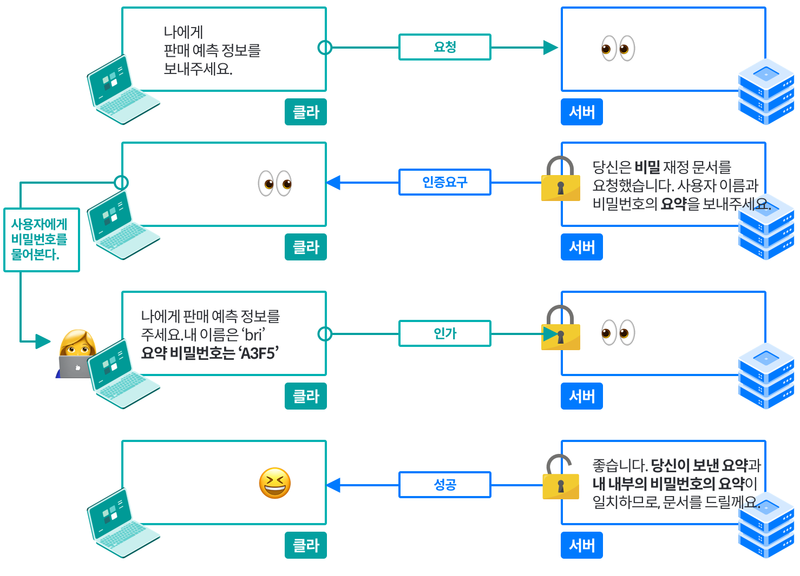

# 13장. 다이제스트 인증

 

## 소개

 

기본 인증은 편리하고 유연하지만 전혀 안전하지 않다.

다이제스트 인증은 널리 쓰이지는 않지만, 보안 트랜잭션을 구현하고자 하는 이들에게 여전히 유용하다.

## 13.1 다이제스트 인증의 개선점

- 다이제스트 인증은 기본 인증의 가장 심각한 결함을 수정한 또 다른 HTTP 인증 프로토콜이다.

- 다이제스트 인증의 특징

    - 비밀번호를 네트워크를 통해 평문으로 전송하지 않음

    - 인증 체결을 가로채 재현하려는 악의적인 사람들을 차단함

    - 메시지 내용 위조를 막는 것도 가능

    - 여러 형태의 공격을 막음

- 공개키 기반 메커니즘과 비교해 그다지 안전한 프로토콜은 아니다.

- 요청과 응답의 나머지 부분은 다른 누군가가 엿보는 게 가능하기 때문이다.

- 하지만 CRAM-MD5 등 다른 보안 체계들보다는 강력하다.

 

### 13.1.1 비밀번호를 안전하게 지키기 위해 요약 사용하기

- 다이제스트 인증은 `절대로 비밀번호를 네트워크를 통해 보내지 않는다`를 지켜야 한다.

- 서버에 비밀번호를 보내는 대신, 비밀번호를 비가역적으로 뒤섞은 지문(fingerprint) 혹은 요약(digest)를 보낸다.

- 서버는 클라이언트가 보낸 요약이 비밀번호에 알맞게 대응하는지 검사할 수 있다.

- 요약만 주어지면, 모든 비밀번호를 하나씩 시도해보지 않고선 알아내기 어렵다.

 

- 다이제스트 인증이 동작하는 방식

 

 

### 13.1.2 단방향 요약

- 요약은 단방향 함수로 동작하고, 입력 가능한 무한 가지의 모든 입력값들을 유한한 범위의 압축으로 변환한다.
  
- 두 개의 서로 다른 입력이 같은 다이제스트로 변환하는 충돌(collision)이 발생하기도 하지만 실제 충돌을 만날 확률은 매우 작다.

- 인기 있는 요약함수인 MD5(Message Digest)는 임의의 바이트 배열을 원래 길이와 상관 없이 128비트 요약으로 변환한다.

- 128비트는 종종 32글자의 16진수 문자로 표현되며 각 문자는 각각 4비트의 값을 의미한다.

- 비밀번호 혹은 요약 둘중 하나만 가져도 나머지를 추측하기 쉽지 않다.

- 요약 함수는 보통 암호 체크섬(cryptographic checksums)로 불리고, 단방향 해시 함수이거나 지문 함수(fingerprint function)이다.

 

### 13.1.3 재전송 방지를 위한 난스(nonce) 사용

- 단방향 요약은 비밀번호를 그대로 전송해야 할 필요가 없다.

- 대신 비밀번호에 대한 요약을 보내주고 악의적인 집단이 쉽게 요약에서 원래 비밀번호를 해독할 수 없음을 보장받기만 하면 된다.

- 하지만 요약을 가로채서 서버로 재전송을 하는 것이 가능하기에 위험에서 지켜주기 어렵다.

- 그래서 재전송 공격을 방지하기 위해서 서버는 자주 바뀌는 난스를 건네준다.
  
- 난스를 비밀번호에 섞으면 난스가 바뀔 때마다 요약도 바뀌게 되기에 비밀번호 요약이 특정한 난스 값에 대해서만 유효하게 만든다.