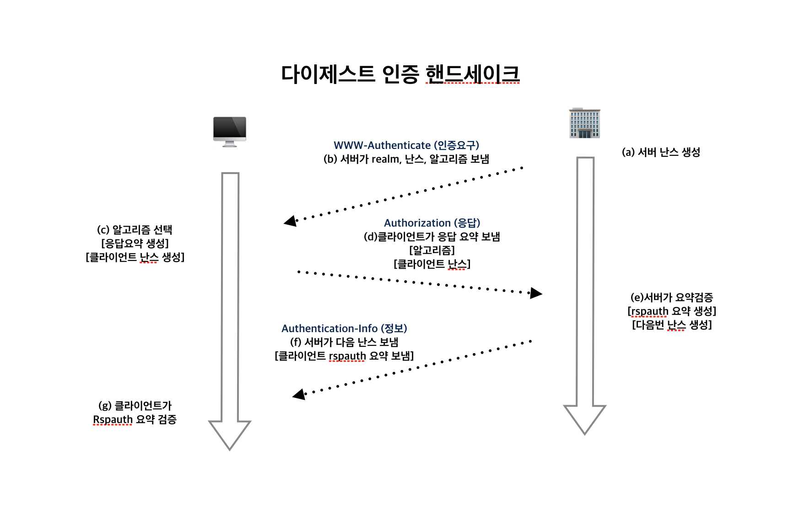
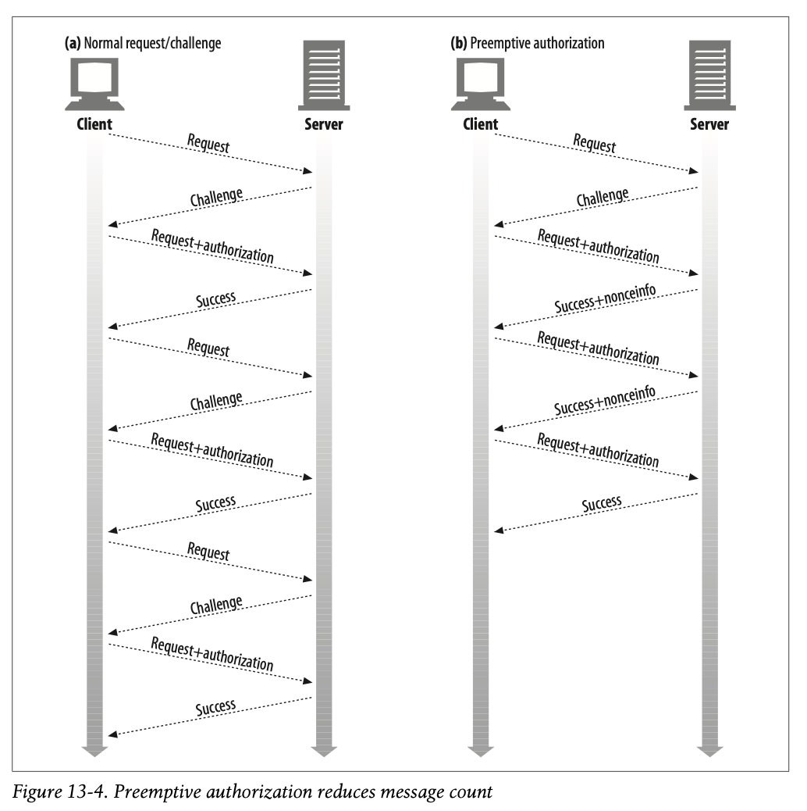
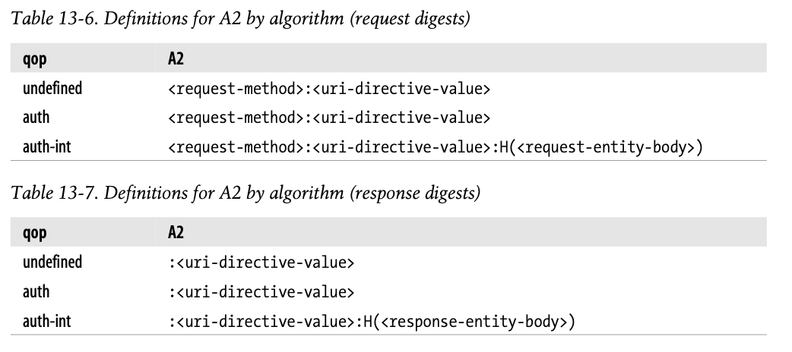

# 13장. 다이제스트 인증

<br>

## 소개

<br>

기본 인증은 편리하고 유연하지만 전혀 안전하지 않다.

다이제스트 인증은 널리 쓰이지는 않지만, 보안 트랜잭션을 구현하고자 하는 이들에게 여전히 유용하다.


## 13.1 다이제스트 인증의 개선점

- 다이제스트 인증은 기본 인증의 가장 심각한 결함을 수정한 또 다른 HTTP 인증 프로토콜이다.

- 다이제스트 인증의 특징

    - 비밀번호를 네트워크를 통해 평문으로 전송하지 않음

    - 인증 체결을 가로채 재현하려는 악의적인 사람들을 차단함

    - 메시지 내용 위조를 막는 것도 가능

    - 여러 형태의 공격을 막음

- 공개키 기반 메커니즘과 비교해 그다지 안전한 프로토콜은 아니다.

- 요청과 응답의 나머지 부분은 다른 누군가가 엿보는 게 가능하기 때문이다.

- 하지만 CRAM-MD5 등 다른 보안 체계들보다는 강력하다.

<br>

### 13.1.1 비밀번호를 안전하게 지키기 위해 요약 사용하기

- 다이제스트 인증은 `절대로 비밀번호를 네트워크를 통해 보내지 않는다`를 지켜야 한다.

- 서버에 비밀번호를 보내는 대신, 비밀번호를 비가역적으로 뒤섞은 지문(fingerprint) 혹은 요약(digest)를 보낸다.

- 서버는 클라이언트가 보낸 요약이 비밀번호에 알맞게 대응하는지 검사할 수 있다.

- 요약만 주어지면, 모든 비밀번호를 하나씩 시도해보지 않고선 알아내기 어렵다.

<br>

- 다이제스트 인증이 동작하는 방식

<br>

<p align="center"></p>

<br>

### 13.1.2 단방향 요약

- 요약은 단방향 함수로 동작하고, 입력 가능한 무한 가지의 모든 입력값들을 유한한 범위의 압축으로 변환한다.
  
- 두 개의 서로 다른 입력이 같은 다이제스트로 변환하는 충돌(collision)이 발생하기도 하지만 실제 충돌을 만날 확률은 매우 작다.

- 인기 있는 요약함수인 MD5(Message Digest)는 임의의 바이트 배열을 원래 길이와 상관 없이 128비트 요약으로 변환한다.

- 128비트는 종종 32글자의 16진수 문자로 표현되며 각 문자는 각각 4비트의 값을 의미한다.

- 비밀번호 혹은 요약 둘중 하나만 가져도 나머지를 추측하기 쉽지 않다.

- 요약 함수는 보통 암호 체크섬(cryptographic checksums)로 불리고, 단방향 해시 함수이거나 지문 함수(fingerprint function)이다.

<br>

### 13.1.3 재전송 방지를 위한 난스(nonce) 사용

- 단방향 요약은 비밀번호를 그대로 전송해야 할 필요가 없다.

- 대신 비밀번호에 대한 요약을 보내주고 악의적인 집단이 쉽게 요약에서 원래 비밀번호를 해독할 수 없음을 보장받기만 하면 된다.

- 하지만 요약을 가로채서 서버로 재전송을 하는 것이 가능하기에 위험에서 지켜주기 어렵다.

- 그래서 재전송 공격을 방지하기 위해서 서버는 자주 바뀌는 난스를 건네준다.
  
- 난스를 비밀번호에 섞으면 난스가 바뀔 때마다 요약도 바뀌게 되기에 비밀번호 요약이 특정한 난스 값에 대해서만 유효하게 만든다.

- 자잘한 재전송 공격들이 난스를 쓰지 않는 다이제스트 인증을 기본 인증만큼 허약한 것으로 만든다.
  
- 난스는 WWW-Authenticate 인증 요구에 담겨 서버에서 클라로 넘겨진다.

<br>

### 13.1.4 다이제스트 인증 핸드셰이크

- HTTP 다이제스트 인증 프로토콜은 기본 인증에서 사용하는 것과 비슷한 헤더를 사용하는 강화된 버전의 인증이다.

- 기존 헤더에 몇몇 새 옵션이 추가되었고, 선택적인 헤더인 Authorization-Info 가 추가되었다.


<br>

<p align="center"></p>

<br>

## 13.2 요약 계산

- 다이제스트 인증의 핵심은 공개된 정보, 비밀 정보, 난스 값을 조합한 단방향 요약이다.

### 13.2.1 요약 알고리즘 입력 데이터

- 요약은 다음의 세 요소로부터 계산된다.

    - 단방향 해시 함수 `H(d)` 와 요약 함수 `KD(s, d)`

    - s는 비밀(secret), d는 데이터(data)를 의미

    - 비밀번호 등 보안 정보를 담고 있는 데이터 덩어리. `A1`

    - 요청 메시지의 비밀이 아닌 속성을 담고 있는 데이터 덩어리. `A2`

- A1, A2 두 조각의 데이터는 요약을 생성하기 위해 H와 HD에 의해 처리된다.

<br>

### 13.2.2 H(d)와 KD(s, d) 알고리즘

- 다이제스트으 인증은 여러 가지 인증 알고리즘을 선택할수 있도록 지원하며 MD5와 MD5-sess가 RFC-2617에서 제안된 알고리즘이다. 기본값은 MD5이다.

- H 함수는 MD5를 계산하고, KD는 콜론으로 연결된 비밀 데이터와 일반 데이터의 MD5를 계산한다.


- H(데이터) = MD5(데이터) 
  
- KD(비밀, 데이터) = H(concatenate(비밀:데이터))

<br>

### 13.2.3 보안 관련 데이터(A1)

- 사용자 이름, 비밀번호, 보호 영역, 난스와 같은 비밀 보호 정보로 이루어져 있다.

- 메시지 자체가 아닌 비밀 정보와만 연관되어 있다.

<br>

### 13.2.4 메시지 관련 데이터(A2)

- URL, 요청 메서드, 메시지 엔터티 본문과 같은 메시지 자체의 정보를 나타낸다.
  
- 이 정보들의 위조를 방지하기 위해 사용된다.

<br>

### 13.2.5 요약 알고리즘 전반

- RFC 2617은 H, KD, A1, A2로 요약을 계산하는 두 가지 방법을 정의한다.

<br>

### 13.2.6 다이제스트 인증 세션

- 어떤 보호 공간을 위한 WWW-Authenticate 인증요구에 대한 클라의 응답은, 그 보호 공간에 대한 인증 세션을 시작하게 한다.

- 보호 공간은 접근 중인 서버의 루트와 영역(realm)의 결합으로 정의된다.

- 인증 세션은 클라이언트가 보호 공간의 다른 서버로부터 또 다른 WWW-Authenticate 인증요구를 받을 때까지 지속된다.

- 클라이언트는 사용자 이름, 비밀번호, 난스, 난스 횟수(nc), 그리고 보호 공간 내 미래의 요청에 들어갈 Authorization 헤더를 만들기 위해 사용될 인증 세션과 연관된 알아보기 힘든 값들을 기억해야 한다.

- 난스가 만료되면, 서버는 난스 값이 낡은 것임을 감수하고 오래된 Authorizastion 헤더 정보를 받아들이는 것을 택할 수 있다.

- 아니면, 서버는 클라이언트가 다시 요청을 보내도록 새 난스 값과 401을 반환할 수 있다. 이때 이 응답에 stale=true로 정의하여 서버는 클라이언트에게 사용자 이름과 비밀번호를 새로 입력할 필요가 없게 한다.

<br>

### 13.2.7 사전(preemptive) 인가

- 일반적인 인증에서 각 요청은 트랜잭션이 완료되기 전에 요청/인증요구 사이클을 필요로 한다.

- 클라이언트가 다음 난스가 무엇이 될지 미리 알고 있어서, 서버가 물어보기 전에 올바른 Authorization 헤더를 생성할 수 있다면 요청/인증요구 사이클을 생략할 수 있게 된다.

<br>

<p align="center"></p>

<br>

- 기본 인증에서, 브라우저는 클라이언트 데이터베이스를 관리하여 인증에 대한 정보를 저장하고, 다음 요청때 Authorization 헤더를 제대로 세팅할 수 있다.
  
- 그러나 다이제스트 인증에서 사전 인가는 복잡하다. 난스 기술이 재전송 공격을 저지하기 위한 것이기 때문이다.
  
- 서버가 임의의 난스를 생성하므로, 인증요구를 받기 전에는 클라가 무엇이 올바른 Authorization 헤더인지 알 방법이 없다.

<br>

- 다이제스트 인증에서 이를 위해 몇가지 방법을 제안한다.

    - 서버가 다음 난스를 Authentication-Info 성공 헤더에 담아 미리 보낸다.

    - 서버가 짧은 시간 동안 같은 난스를 재사용하는 것을 허용한다.

    - 클라이언트가 서버와 동기화되어 있고 예측 가능한 난스 생성 알고리즘을 사용.

<br>

- 다음 난스 미리 생성하기
    
    - 서버는 Authentication-Info 성공 헤더로 다음 난스 값을 미리 제공할 수 있다.

    - 서버는 인증이 성공했을 때 200 OK 응답과 함께 헤더를 미리 보낸다.

    ```
    Authentication-Info: nextnonce="<nonce-value>"
    ```

    - 이 다음 난스로 클라이언트는 Authorization 헤더를 미리 만들어둘 수 있다.

    - 서버에 다중 요청을 파이프라이닝하는 능력은 쓸모가 없어진다. 다음 요청을 보내기 전에 반드시 다음 난스 값을 받아야 하기 때문이다.

    - 파이프라이닝은 회전 지연(latency)를 회피하기 위한 기술이기 때문에 성능상 불이익이 더 커진다.

<br>

- 제한된 난스 재사용

    - 예로 서버는 한 난스를 다섯 번, 혹은 10초간 재사용하도록 허용할 수 있다.
  
    - 클라는 자유롭게 Authorization 헤더와 함께 요청을 발행하여 파이프라이닝할 수 있다.

    - 난스가 만료되면 서버는 401 Unauthorized 인증요구를 보낼 것.

    - 이때 WWW-Authenticate:stale=true 지시어는 다음과 같이 설정된다.

    ```
    WWW-Authenticate: Digest
        realm="영역 값" 
        nonce="난스 값" 
        stale=true
    ```

<br>

- 동기화된 난스 생성
  
    - 제3자가 쉽게 예측할 수 없는 공유된 비밀키에 기반하면서, 클라이언트와 서버가 순차적으로 같은 난스를 생성할 수 있도록 동기화된 난스 생성 알고리즘을 사용하는 것도 가능

<br>

### 13.2.8 난스 선택

- 난스 내용은 불투명하고 구현 의존적이다.

- 그러나 성능 수준, 보안, 편의성은 현명한 선택에 달려있다.

- RFC 2617이 가상의 난스 공식을 제안했다.

```
BASE64(time-stamp H(time-stamp ":" ETag ":" private-key))

time-stamp - 서버에서 생성된 시간 혹은 반복 불가능한 값
ETag - 요청된 엔터티에 대한 ETag 헤더값
private-key - 서버만이 알고 있는 값
```

- 서버는 클라 인증 헤더를 받은 뒤, 위 공식에서 해시 부분을 재계산하고 클라 인증 헤더의 난스와 일치하지 않거나 타임스탬프가 오래되었다면 요청을 거절한다.
  
- 서버는 난스의 유효 기간을 제한할 수 있으며, ETag를 포함하면 갱신된 리소스에 대한 재요청을 방지한다.

<br>

### 13.2.9 상호 인증

- RFC 2617은 클라이언트가 서버를 인증할 수 있도록 다이제스트 인증을 확장했다.
 
- 서버가 공유된 비밀 정보에 근거한 올바른 응답 요약을 생성할 수 있도록, 클라이언트 난스 값을 제공함으로써 가능해진다.
  
- 이후 서버는 이 요약을 Authentication-Info 헤더를 통해 클라에 전달한다.

- 보안이 상당히 개선되므로 현대적인 클라라면 구현할 것을 권한다.

- 상호 인증은 qop 지시자가 존재할 경우 항상 수행하고, 없다면 수행하지 말아야 한다.
  
- 응답 요약은 A2가 다르다는 것만 제외하면 요청 요약과 같은 방법으로 계산한다.

- A2가 다른 이유는 응답에는 HTTP 메서드가 없고 메시지 엔터티 데이터가 다르기 때문.


<br>

<p align="center"></p>

<br>

- cnonce와 nc는 반드시 응답에 대응하는 클라 요청을 위한 것이어야 한다.
  
- qop="auth", "auth-int"가 지정된 경우 반드시 응답 auth, cnonce, nc가 존재해야 한다.

## 13.3 보호 수준(Quality of Protection) 향상

- qop는 WWW-Authenticate, Authorization, Authentication-Info에 모두 존재할 수 있다.
  
- qop는 서버와 클라가 어떤 보호 기법을 어느 정도 수준으로 사용할 것인지 협상할 수 있게 해준다.

- 예로, 몇몇 트랜잭션은 전송 속도가 크게 떨어지는 것을 감수하고서도 메시지 본문의 무결성을 간단하게 검사하려고 할 수도 있다.

- 서버는 우선 WWW-Authenticate 헤더에 qop 옵션을 쉼표로 구분된 목록 형태로 내보낸다.
  
- 클라이언트는 그 옵션들 중 지원할 수 있으면서 자신의 요구에도 맞는 것을 선택한다. 그것을 Authorization 헤더의 qop 필드에 담아 돌려준다.
  
- 현대적인 요약 구현은 qop 옵션을 지원해야 한다.

- auth 는 인증을 의미. auth-int는 인증 및 메시지 무결성 보호를 의미.


## 13.4 실제 상황에 대한 고려

### 13.4.1 다중 인증요구

- 서버는 한 리소스에 대해 여러 인증을 요구할 수 있다.
  
- 다중 인증요구에 직면했을 때, 클라이언트는 반드시 자신이 지원할 수 있는 가장 강력한 인증 메커니즘을 선택해야 한다.
  
- 사용자 에이전트는 www-authenticate나 proxy-authenticate 헤더 필드의 값을 분석할 때 반드시 특별한 주의를 기울여야 한다.
  
- 인증요구 그 자체가 쉼표로 구분된 목록으로 된 여러 개의 인증 매개변수들을 담을 수 있는 것과 마찬가지로, 헤더들에 인증요구가 둘 이상 포함되거나 www-authenticate 헤더가 둘 이상 제공될 수도 있기 때문이다.
  
- 하지만 오늘날 대부분의 브라우저는 요약 인증도 인식한다.

<br>

### 13.4.2 오류 처리

- 다이제스트 인증에서 지시자나 그 값이 적절하지 않거나 요구된 지시자가 빠져있을 경우 알맞은 응답은 400 Bad Request이다.
  
- 요청의 요약이 맞지 않으면 로그인 실패를 기록해 두는 게 좋다. 

- 반복된 실패는 공격자가 비밀번호 추측을 시도하고 있음을 의미한다.

- 인증 서버는 uri 지시자가 가리키는 리소스가 요청줄에 명시된 리소스와 같음을 확인해야 한다.

- 다르다면 서버는 400 반환하는 것이 좋으며, 공격의 징후일 수 있으므로 로그 남겨야 한다.
  
- 이 필드와 요청 URL과의 중복된 정보는 중간의 프락시가 클라이언트의 요청줄을 변조했을 가능성에 대처할 수 있게 해준다.
  
변형된 요청의 요약을 계산한 결과는 클라가 계산한 요약과 다를 것이다.

<br>

### 13.4.3 보호 공간(Protection Space)

- 영역 값은 접근한 서버의 루트 URL과 결합되어 보호 공간을 정의한다.

- 영역은 서버의 보호된 리소스들을 자신만의 인증 제도와 인가 데이터베이스 어느 한 쪽 혹은 양쪽 모두를 가진 보호 영역의 집합으로 분할할 수 있도록 해준다.
  
- 영역 값은 원 서버에 의해 할당되는 문자열. 인증 제도에 추가적인 의미를 더한다.

- 보호 공간은 어떤 자격이 자동으로 적용되는 영역을 결정한다.

- 이전 요청이 인가되면, 같은 자격은 인증 제도, 매개변수, 사용자 설정 중 한 가지 이상에 의해 정해진 시간동안 재사용될 것이다.
  
- 보호 공간의 구체적 계산은 인증 메커니즘에 달림

    - 기본 인증에서 클라는 요청 URI와 그 하위의 모든 경로는 같은 보호 공간에 있는 것으로 가정함. 
    클라이언트는 이 공간에서 서버로부터의 또 다른 인증 요구를 기다리지 않고 미리 리소스에 대한 인가를 받을 수 있음

    - 다이제스트 인증에서 www-authenticate: domain 필드는 보호 공간을 보다 엄밀히 정의. domain 필드는 작은따옴표로 묶인 uri의 공백으로 분리된 목록. 
    이 domain 목록의 모든 URI와 논리적으로 그 하위에 위치한 모든 URI는 같은 보호 공간에 있는 것으로 가정함. 
    만약 domain 필드가 없거나 빈 값이라면 인증을 요구하는 서버의 모든 URI는 그 보호 공간에 있는 것.

<br>

### 13.4.4 URI 다시 쓰기

- 프락시는 가리키는 리소스의 변경 없이 구문만 고쳐서 URI를 다시 쓰기도 한다.

    - 호스트 명은 정규화되거나 IP주소로 대체.

    - 문자들은 "%" escape 형식으로 대체.

    - 특정 원 서버로부터 가져오는 리소스에 영향을 주지 않는, 타입에 대한 추가 속성이 uri의 끝에 붙거나 중간에 삽입될 수 있음.

- 다이제스트 인증은 URI값의 무결성을 검증하므로, 이러한 변경에 의해 인증이 실패할 수 있다.

<br>

### 13.4.5 캐시

- 어떤 공유 캐시가 authorization 헤더를 포함한 요청과 응답을 받은 경우, 다음 두 cache-control 지시자 중 하나가 응답에 존재하지 않는 한 다른 요청에 대해 그 응답을 반환해서는 안된다.
  
## 13.5 보안에 대한 고려사항

### 13.5.1 헤더 부당 변경

- 헤더 부당 변경에 대해 항상 안전한 시스템을 제공하기 위해서 양 종단 암호화나 헤더에 대한 디지털 서명 등이 필요할 것이다. 양쪽의 조합이면 더 좋다.
  
- 다이제스트 인증은 쉽게 조작할 수 없는 인증 제도를 제공하는 것이 초점을 맞추고 있으나, 반드시 그 보호를 데이터까지 확장하는 것은 아니다.
  
- 보호 수준에 대한 정보는 www-authenticate, authorization 헤더에만 담겨있다.

<br>

### 13.5.2 재전송 공격

- 재전송 공격이란 누군가가 어떤 트랜잭션에서 엿들은 인증 자격을 다른 트랜잭션을 위해 사용하는 것을 말한다.

- GET요청에 대한 이슈이나 POST, PUT요청에 대한 재전송 공격에 대해서도 잘 동작하는 예방책이 있어야 한다.

- 서버가 재전송된 자격을 승인한다는 것은 같은 난스 값을 반복해 사용한 것이다.
  
- 완화 방법 중 하나는 클라 ip 주소, 타임스탬프, 리소스 etag, 개인 서버 키에 대한 요약을 포함하는 난스를 서버가 생성하는 것이다.

- 재전송 공격을 완전히 막는 방법은 매 트랜잭션마다 유일한 난스값을 사용하는 것이다.

- 서버는 매 트랜잭션마다 유일한 난스를 타임아웃 값과 함께 발급하며 발급된 난스는 그때의 트랜잭션과 주어진 타임아웃 값의 기간 동안만 유효하다.
  
<br>

### 13.5.3 다중 인증 메커니즘

- 서버가 다중 인증을 지원할 때, 클라이언트는 가장 강력한 인증 제도를 선택해야 하지만 그럴 의무는 없다.
  
- 언제나 가장 강력한 인증 제도를 선택하는 것이 불가능하다면 다른 선택지는 가장 강력한 인증 제도만을 유지하는 프락시 서버를 사용하는 것이다. 
  
- 그러나 사내 네트워크같이 모든 클라이언트가 강력한 인증 제도를 지원할 수 있다고 알려진 경우만 가능하다.

<br>

### 13.5.4 사전(dictionary) 공격

- 사전 공격은 전형적인 비밀번호 추측 공격이다.

- 악의적인 사용자가 트랜잭션을 엿듣고, 난스/응답 쌍에 대해 비밀번호 추측 프로그램을 사용할 수 있다.

- 만약 사용자가 단순한 비밀번호를 사용하고, 서버도 단순한 난스를 사용한다면 찾아낼 확률이 있다.

- 복잡한 비밀번호, 괜찮은 비밀번호 만료 정책으로 막는다.

<br>

### 13.5.5 악의적인 프락시와 중간자 공격

- 프락시 중 하나가 악의적이거나 보안이 허술하다면, 클라는 중간자 공격에 취약한 상태가 될 가능성이 있다.
  
- 신뢰할 수 있는 프락시라도, 확장 인터페이스를 활용해 트래픽을 가로채 수정할 수도 있다.

- 이것을 막는 유일한 방법은 SSL을 활용하는 것이다.

### 13.5.6 선택 평문 공격

- 클라이언트 보안이 허술하거나 악의적인 프락시가 트래픽 중간에 끼어든다면(혹은 서버가 악의적이라면) 클라이언트가 응답 계산을 하기 위한 난스를 제공할 수 있다.

- 이것은 응답의 암호 해독을 쉽게 할 수 있다. 이것이 선택 평문 공격이다.

- 선택 평문 공격의 변종

    - 미리 계산된 사전 공격

        사전 공격과 선택 평문 공격의 조합.

        공격 서버는 미리 결정된 난스와 자주 쓰이는 비밀번호들로 응답의 집합을 생성, 사전을 만듦.

        공격 서버/프락시는 트래픽을 차단하고 미리 결정된 난스를 클라이언트로 전송.

        클라이언트로부터 응답을 받을 때, 공격자는 대응되는 항목을 생성된 사전에서 찾고,대응되는 게 있다면, 사용자의 비밀번호를 손에 얻은 것.

    - 자동화된 무차별 대입 공격

        많은 컴퓨터를 동원해 주어진 범위에서 가능한 모든 비밀번호를 열거함.

        방어를 위해, 클라가 서버에서 제공된 난스 대신 선택적인 cnonce 지시자를 사용하여 응답을 생성할 수 있도록 설정하는 방법이 있음.

        강력한 비밀번호, 비밀번호 만료 정책으로 위협을 완전 경감 가능.

<br>

### 13.5.7 비밀번호 저장

- 다이제스트 인증 메커니즘은 사용자 응답을 서버 내부에 저장된 것(사용자 이름, 영역, 비밀번호의 요약을 통해 계산된 H(A1), 사용자 이름의 투플)과 비교한다.

- 다이제스트 인증 비밀번호 파일이 유출되면 영역의 모든 문서는 암호 해독 과정이 필요없이 즉각 공격자에게 노출된다.
 
- 완화를 위해 비밀번호 파일을 안전하게 보호하거나, 영역 이름을 유일하게 보장하여 유출 피해를 특정 영역으로 국소화할 수 있다.

- 다이제스트 인증은 콘텐츠에 대한 보안 측면에서 어떠한 보호도 제공하지 못한다.

- 진정한 보안 트랜잭션은 SSL을 통해서 가능하다.