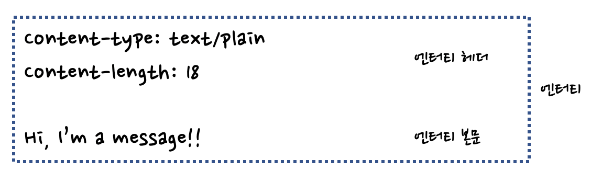

# 15장. 엔터티와 인코딩

 

## 소개

 

HTTP는 다음을 보장한다.

- 브라우저나 다른 클라이언트가 콘텐츠를 바르게 처리할 수 있음

- 올바르게 압축이 풀림

- 항상 최신

- 사용자의 요구를 만족

- 네트워크 사이를 빠르고 효율적으로 이동

- 조작되지 않고 온전하게 도착

이 모든 것을 가능하게 하기 위해서 잘 라벨링된 엔터티를 사용한다.

어떻게 HTTP가 콘텐츠 크기, 타입, 인코딩에 대한 필수적인 값을 제공하는지?

## 15.1 메시지는 컨테이너, 엔터티는 화물

 

 

| 헤더 | 설명 |
|------|---|
| Content-Type | 객체의 종류 |
| Content-Length | 메시지 길이 |
| Content-Language | 대응되는 자연어 |
| Content-Encoding | 압축 등 변형 |
| Content-Location | 객체의 또다른 위치 |
| Content-Range | 엔터티가 전체에서 어느 부분에 해당하는지 |
| Content-MD5 | 본문에 대한 체크섬 |
| Last-Modified | 생성 혹은 수정된 날 |
| Expires | 엔터티가 유효하지 않기 시작하는 시 |
| Allow | 어떤 요청 메서드가 허용되는지 (ex. GET, HEAD) |
| ETag | 인스턴스에 대한 고유 식별 |
| Cache-Control | 캐시되는 방법 |

### 15.1.1 엔터티 본문

- 본문에는 raw 데이터만 담고, 다른 정보는 헤더에 담는다.

- 헤더 필드의 끝을 의미하는 빈 CRLF 줄 바로 다음부터 시작한다.

## 15.2 Content-Length: 엔터티의 길이

- 본문의 크기를 바이트 단위로 나타낸다.

- 청크 인코딩으로 전송하지 않는 이상, 엔터티 본문을 포함한 메시지에서는 필수적이다.

- Content-Length가 없으면 커넥션이 정상적으로 닫힌 것인지, 서버에 문제가 생겨 전송이 끊긴 것인지 구분할 수 없다.

- HTTP/1.1 사용자 에이전트는 잘못된 길이를 받으면 사용자에게 알려주어야 한다.

- 보안, 압축 등 콘텐츠가 인코딩되어 있다면, (원본이 아닌) 인코딩된 본문의 길이를 Content-Length로 정의한다. 

### 엔터티 본문 길이 판별을 위한 규칙

- 본문을 갖는 것이 허용되지 않는 메시지(HEAD 응답)에서는 Content-Length 헤더가 무시된다.
  
- 메시지가 Transfer-Encoding 헤더를 포함하고 있다면 엔터티는 '0바이트 청크'로 끝나야 한다.

- Transfer-Encoding 헤더가 없으면 Content-Length 값은 본문의 길이를 담게 된다.

- 메시지가 multipart/byteranges 타입일 경우, 멀티파트 메시지의 각 부분이 스스로의 크기를 결정한다.
  
- 위의 규칙에 해당되지 않는다면 엔터티는 커넥션이 닫힐 때 끝난다.
  
- 본문을 갖고 있는 HTTP/1.1 요청은 Content-Length 헤더를 갖고 있어야 한다.

## 15.3 엔터티 요약

- 전송 중 변형됐는지를 확인하기 위해 데이터에 대한 체크섬을 생성할 수 있다.

### Content-MD5 

- 응답을 처음 만든 서버가 본문에 MD5 알고리즘을 적용한 결과를 보내기 위해서 사용된다.

- 콘텐츠 인코딩 적용 후, 전송 인코딩 적용 전인 엔터티 본문에 대한 MD5를 담고 있다.
  
- 그다지 자주 전송되지 않는다. 

## 15.4 미디어 타입과 Charset

- Content-Type 헤더 필드는 엔터티 본문의 MIME 타입(전달되는 데이터 매체 형식)을 기술한다.

- 주 미디어 타입 / 부 타입으로 구성된다.

## 15.5 콘텐츠 인코딩

- 때때로 콘텐츠를 보내기 전에 인코딩을 해야 할 때가 있다.

- 전송 시간을 줄이기 위해서 압축, 콘텐츠 암호화 등

### 콘텐츠 인코딩 과정

1. 서버가 Content-Type과 Content-Length 헤더가 있는 원본 응답 메시지를 생성한다.

2. 인코딩 서버(원 서버 or 다음 프락시)가 인코딩된 메시지를 생성한다. Content-Type은 변화하지 않고, Content-Length는 달라진다.

3. 인코딩 서버는 Content-Encoding 헤더를 추가한다.

4. 수신자는 인코딩된 메시지를 디코딩하고 원본을 얻는다.

### 콘텐츠 인코딩 유형

- gzip이 일반적으로 쓰인다.

## 15.6 전송 인코딩과 청크 인코딩

- 콘텐츠 인코딩은 엔터티 부분에만 적용되지만, 전송 인코딩은 메시지가 네트워크를 통해 전송되는 방법만 바꾸며 전체 메시지에 적용된다.

- 청크 인코딩은 메시지를 일정 크기의 청크로 쪼갠다. 메시지를 보내기 전 전체 크기를 알 필요가 없어진다.

### 청크 인코딩의 장점

- 지속 커넥션일지라도 Content-Length 없이 메시지를 보낼 수 있다.
  
- 크기가 0인 청크로 본문이 끝났음을 알리고, 커넥션을 열린 채로 유지한다.

 

### 콘텐츠와 전송 인코딩의 조합

- 콘텐츠 인코딩과 전송 인코딩이 동시에 사용될 수 있다.

 

### 전송 인코딩 규칙

- 전송 인코딩 집합에 반드시 chunked가 포함되어야 한다. (예외: 메시지가 커넥션 종료로 끝나는 경우)

- 청크 전송 인코딩은 전송 인코딩들 중에 가장 마지막으로 적용되어야 한다.

- 청크 전송 인코딩은 메시지 본문에 한 번만 적용되어야 한다.

 

## 15.7 시간에 따라 바뀌는 인스턴스

- 특정한 종류의 요청이나 응답을 다루는 방법. 클라가 자신이 갖고 있는 사본이 서버가 갖고 있는 것과 정확히 같은지 판단하고, 새 인스턴스를 요청해야 한다.

## 15.8 검사기와 신선도

- 클라이언트가 서버에게 자신이 갖고 있는 버전을 말해주고, 검사기로 자신의 버전이 더 이상 유효하지 않을 때만 새로운 사본을 보내달라고 요청하는 것

- 리소스가 바뀐 경우에만 사본을 요청한다. 'If-'로 시작하는 조건부 헤더에 의해 구현된다.

## 15.9 범위 요청

- Range 헤더를 이용해 문서의 일부분이나 특정 범위만 요청한다.

## 15.10 델타 인코딩

- 객체 전체가 아닌, 변경된 부분에 대해서만 통신하는 HTTP 확장 전송량을 최적화하고, 전송 시간을 빠르게 한다.