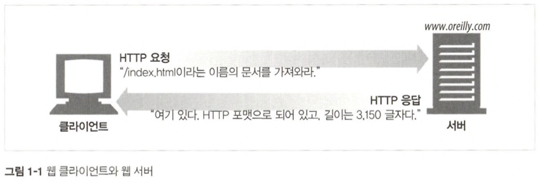
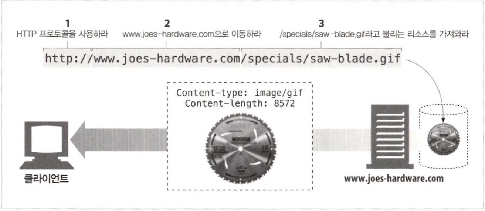
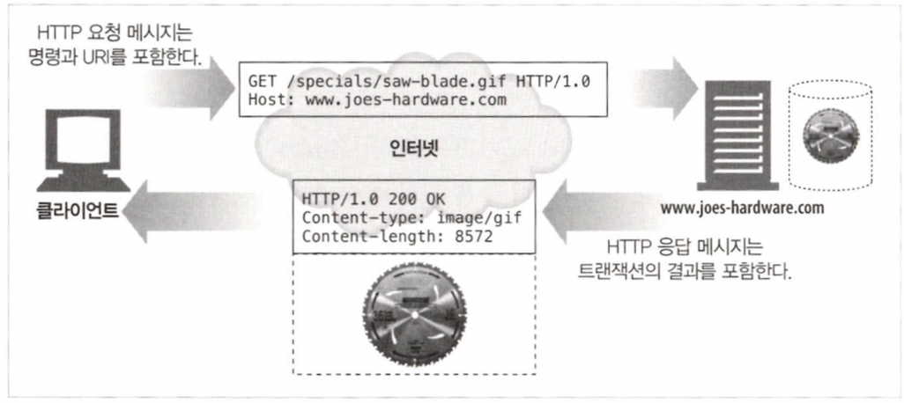
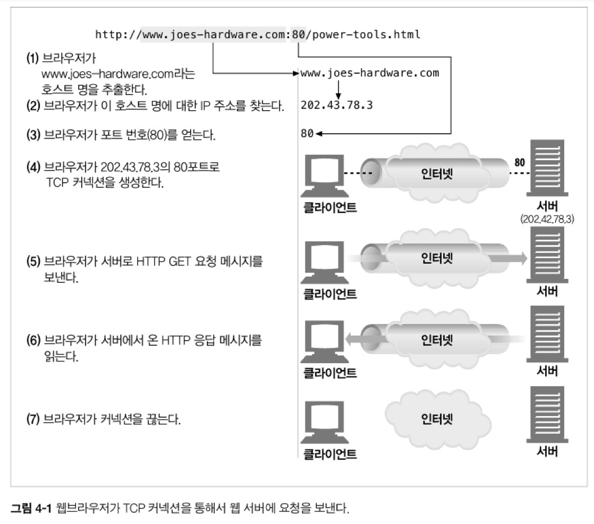
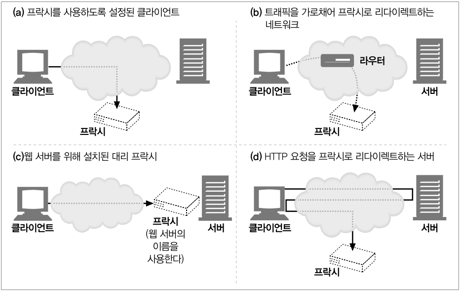
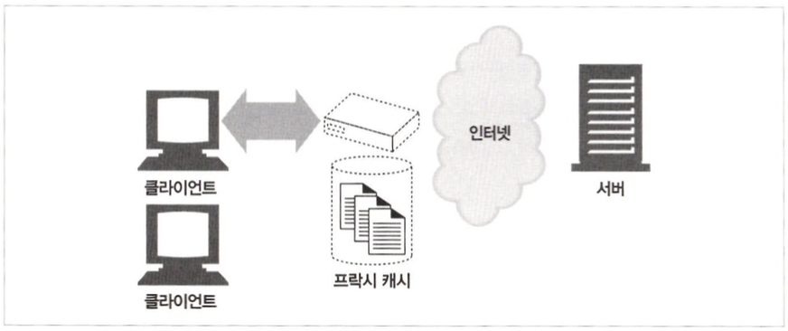
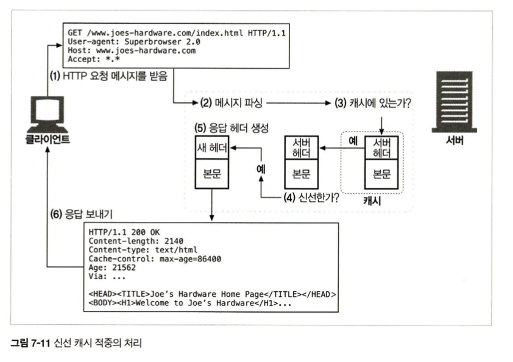
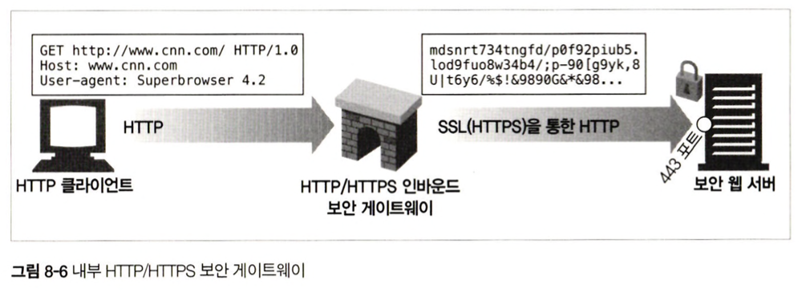
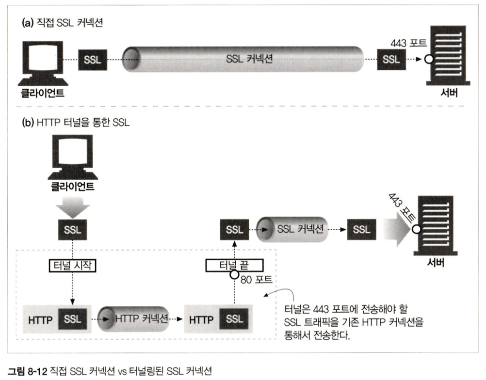
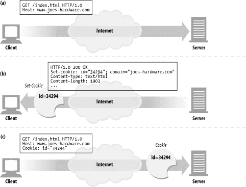

# 22장. 최종 정리

<br>

## 소개

1장인 HTTP 개관을 바탕으로 책의 전체 부분을 최종 정리

<br>

## HTTP란

HTTP는 신뢰성 있는 데이터 전송 프로토콜을 사용

- 전송중 손상 or 꼬임 X

<br>

## 웹 클라이언트와 서버


<br>

<p align="center"></p>

<br>

웹 서버가 하는 일

- 데이터 저장

- 클라이언트가 요청한 데이터 제공

<br>

## 리소스

웹 서버는 웹 리소스를 관리하고 제공

<br>


### 웹 리소스의 종류

- 정적 파일

    - 텍스트 파일

    - 이미지 파일

    - ...

- 동적 콘텐츠

    - 웹 캠

    - 전자상거래

    - ...


<br>

### 미디어 타입


<p align="left"></p>


HTTP는 데이터 포맷 라벨(MIME)을 붙임

- 어떤 미디어 타입인지 알기 위해

<br>


### URI(Uniform Resource Identifier)

URI는 인터넷 우편물 주소와 비슷

URI는 URL, URN의 종합적인 개념이지만 URL을 주로 사용

<br>

<p align="center"></p>

<br>


```
http://www.joes-hardware.com/seasonal/index-fall.html 

스킴://서버위치/경로 구조

스킴
웹 클라이언트가 리소스에 어떻게 접근하는지

서버의 위치
웹 클라이언트가 리소스가 어디에 호스팅 되어 있는지

경로구조
서버에 존재하는 리소스 중 요청받은 리소스가 무엇인지
```
<br>

### URL 문법

URL 문법은 일반적으로 9개 부분으로 나뉨

가장 중요한 3가지는 스킴, 호스트, 경로
```
<스킴>://<사용자 이름>;<비밀번호>@<호스트>:<포트>/<경로>;<파라미터>?<질의>#<프래그먼트>
```

## 트랜잭션

HTTP 트랜잭션은 `요청 명령(클라이언트 -> 서버)과 응답 결과(서버 -> 클라이언트)`로 구성

웹 페이지는 여러 개의 객체로 이루어져 있는 경우가 대부분이기에 각각 별개의 HTTP 트랜잭션이 필요

<br>

<p align="center"></p>

<br>

## HTTP 메시지

HTTP 메시지는 HTTP 애플리케이션 간에 주고받은 데이터의 블록들

모든 HTTP 메시지는 요청 메시지나 응답 메시지로 분류

<br>

### HTTP 메시지의 3가지 구성

- 시작줄은 이것이 어떤 메시지인지

- 헤더 블록은 속성

- 본문은 데이터(없을 수도 있음)

```
요청 메시지

<메서드> <요청 URL> <버전>
<헤더>

<엔터티 본문>
```

```
응답 메시지

<버전> <상태 코드> <사유 구절>
<헤더>

<엔터티 본문>
```

### 메서드

요청의 시작줄은 메서드로 시작하며, 서버에게 무엇을 해야 하는지 말해줌

예를 들어, 'GET /speicals/saw-blade.gif HTTP/1.0'에서 메서드는 GET

| 메서드 | 설명 | 메시지 본문이 있는가? |
| --- | --- | --- |
| GET | 서버에서 어떤 문서를 가져온다. | 없음 |
| HEAD | 서버에서 어떤 문서에 대한 헤더만 가져온다. | 없음 |
| POST | 서버가 처리해야 할 데이터를 보낸다. | 있음 |
| PUT | 서버에 요청 메시지의 본문을 저장한다. | 있음 |
| TRACE | 메시지가 프록시를 거쳐 서버에 도달하는 과정을 추적한다. | 없음 |
| OPTIONS | 서버가 어떤 메서드를 수행할 수 있는지 확인한다. | 없음 |
| DELETE | 서버에서 문서를 제거한다. | 없음 |

<br>

### 상태 코드

클라이언트에게 무엇이 일어났는지 말해줌

| 전체 범위 | 정의된 범위 | 분류 |
| --- | --- | --- |
| 100 ~ 199 | 100 ~ 101 | 정보 |
| 200 ~ 299 | 200 ~ 206 | 성공 |
| 300 ~ 399 | 300 ~ 305 | 리다이렉션 |
| 400 ~ 499 | 400 ~ 415 | 클라이언트 에러 |
| 500 ~ 599 | 500 ~ 505 | 서버 에러 |

<br>

많이 쓰이는 상태 코드들

| 상태 코드 | 사유 구절 | 의미 |
| --- | --- | --- |
| 200 | OK | 성공! 요청한 모든 데이터는 응답 본문에 들어있다. |
| 401 | Unauthorized | 사용자 이름과 비밀번호를 입력해야 한다. |
| 404 | Not Found | 서버는 요청한 URL에 해당하는 리소스를 찾지 못했다. |
| 400 | Bad Request | 사용자의 잘못된 요청 |
| 500 | Internet Sever Error | 서버 내부 에러 |

<br>


### 헤더

HTTP 헤더 필드는 요청과 응답 메시지에 추가 정보를 더함

| 헤더의 예 | 설명 |
| --- | --- | 
| Date: Tue, 3 Oct 2023 | 서버가 응답을 만들어 낸 시각 | 
| Content-length: 15040 | 15,040바이트의 데이터를 포함한 엔터티 본문 | 
| Content-type: image/gif | 엔터티 본문은 GIF 이미지이다. | 
| Accept: image/gif, image/jpeg, text/html | 클라이언트는 GIF, JPEG 이미지와 HTML을 받아들일 수 있다. |

<br>

### 엔터티 본문

엔터티 본문은 이미지, 비디오, HTML 문서 등 여러 종류의 디지털 데이터를 담고 있음

<br>

## TCP 커넥션

클라이언트와 서버가 TCP/IP 커넥션을 맺게 되면 주고받는 메시지들이 손상되거나 순서가 바뀌지 않고 안전하게 전달

<br>

<p align="center"></p>

<br>

1. 호스트 명을 추출
   
2. 호스트 명에 대한 IP 주소 추출
3. 포트 번호 추출
4. 브라우저가 IP 주소와 포트 번호로 TCP 커넥션을 생성
5. 서버로 HTTP GET 요청 메세지
6. 서버에서 온 응답 메세지
7. 커넥션 종료

<br>

### 3 Handshake

<br>

<p align="center"></p>

<br>

`TCP 커넥션이 핸드셰이크 하는 순서`

1. 클라이언트는 'SYN' 플래그가 포함된 TCP 패킷을 서버에게 보낸다.

2. 서버는 커넥션 요청이 받아들여졌음을 의미하는 'SYN'과 'ACK' 플래그를 포함한 TCP 패킷을 클라이언트에게 보낸다.

3. 클라이언트는 확인응답 신호인 'ACK' 플래그를 포함한 TCP 패킷과 데이터를 함께 서버에게 보낸다. 


<br>

## 웹의 구성요소

- 프락시

- 캐시

- 게이트웨이

- 터널


<br>

## 프락시

클라이언트와 서버 사이에 위치하여 그들 사이의 HTTP 메시지를 정리하는 중개인처럼 동작

<br>

<p align="center"></p>

<br>

### 왜 프락시를 사용하는가?

- 보안 개선
  
- 성능 향상 
  
- 비용 절약

<br>

### 어떻게 프락시가 트래픽을 처리하는가?

<br>

<p align="center"></p>

<br>


## 캐시

자주 쓰이는 문서의 사본을 보관하는 HTTP 프락시 서버

<br>

<p align="center"></p>

<br>

### 왜 캐시를 사용하는가?

- 네트워크 요금 인하

- 네트워크 병목 해결

- 원 서버에 대한 요청 감소

- 거리로 인한 지연 해결

<br>

### 캐시 적중과 부적중

캐시 적중(cache hit)

캐시에 요청이 도착했을 때, 그에 대응하는 사본이 있다면 그를 이용해 요청이 처리되는 것

<br>

캐시 부적중(cache miss)

대응하는 사본이 없다면 원 서버로 전달이 되는 것

<br>

### 캐시 처리 과정

<br>

<p align="center"></p>

<br>

## 게이트웨이

리소스와 애플리케이션을 연결하는 역할

HTTP 트래픽을 다른 프로토콜로 자동으로 변환하여 HTTP 클라이언트가 다른 프로토콜을 알 필요없이 서버에 접속할 수 있게 함


<br>

<p align="center"></p>

<br>

### 왜 게이트웨이를 사용하는가?

모든 리소스를 한 개의 애플리케이션으로만 처리할 수 없기 때문

<br>

## 터널

HTTP 커넥션을 통해서 HTTP가 아닌 트래픽을 전송할 수 있고, 다른 프로토콜을 HTTP 위에 올릴 수 있음

<br>

<p align="center"></p>

<br>

### 왜 터널을 사용하는가?


HTTP 프로토콜을 지원하지 않는 애플리케이션에 HTTP 애플리케이션을 사용해 접근하기 위해서


## 쿠키

사용자를 식별하고 세션을 유지하는 방식 중 가장 널리 사용되는 방식

### 왜 쿠키를 사용하는가?

HTTP는 익명이고 사용자를 식별하거나, 연속적인 요청을 추적하기 위해서는 정보가 필요하기 때문


### 쿠키의 동작 방법

쿠키는 서버가 사용자에게 "안녕, 내 이름은..." 라고 적어서 붙이는 스티커

<br>

<p align="center"></p>

<br>

## HTTPS

HTTPS = 효율적 + 좋은 이식성 + 쉬운 관리 + 변화에 대한 적응력

암호화되지 않은 HTTP 메시지를 TCP를 통해 인터넷 곳곳으로 보내는 대신에 HTTPS는 먼저 그것을 암호화하는 보안 계층으로 보냄

<br>

<p align="center"></p>

<br>