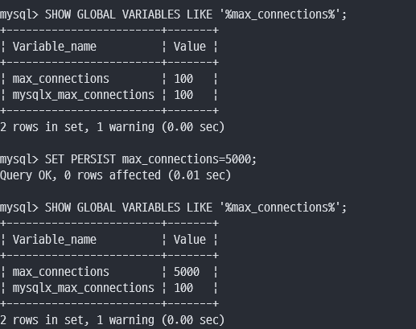
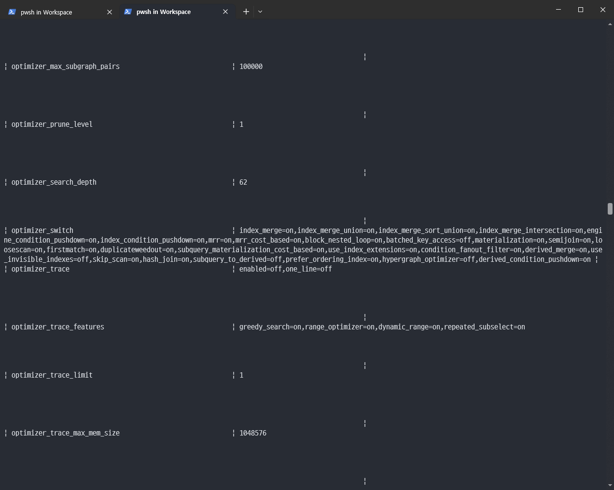
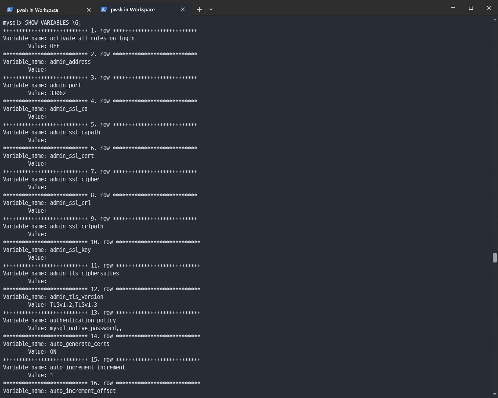

# 2장. 설치와 설정

<br>

## MacOS

```
##MySQL 서버 시작

sudo mysql.server start

brew services start mysql (백그라운드 실행)

##MySQL 서버 종료

sudo mysql.server stop

brew services stop mysql
```

- 설정 파일 위치

    /usr/local/mysql/my.cnf

<br>

## Windows

```
##MySQL 서버 시작
net start mysql

##MySQL 서버 종료
net stop mysql
```

- 설정 파일 위치

    C:\ProgramData\MySQL\MySQL Server 8.0\my.ini

<br>

- MySQL 서버 디렉터리 구조

    - bin : MySQL 서버와 클라이언트 프로그램 그리고 유틸리티를 위한 디렉터리

    - include : C/C++ 헤더 파일들이 저장된 디렉터리

    - lib : 라이브러리 파일들이 저장된 디렉터리

    - share : 다양한 지원 파일들이 저장되어 있으며, 에러 메시지나 샘플 설정 파일(my.ini)이 있는 디렉터리

<br>

## 클린 셧다운
```
## 해당 명령어를 사용하여 커밋된 데이터를 데이터 파일에 적용하고 종료시키는 클린 셧다운을 할 수 있음

## 다시 MySQL 서버가 기동할 때 별도의 트랜잭션 복구 과정을 진행하지 않기에 빠르게 시작할 수 있음

mysql> SET GLOBAL innodb_fast_shutdown=0;
mysql> SHUTDOWN;
```

<br>

## 서버 연결
```
## root 계정으로 mySQL 서버에 로그인

> mysql -uroot -p
```

<br>

## 시스템 변수

MySQL 서버는 설정 파일의 내용을 읽어 메모리나 작동 방식을 초기화하는 값을 별도로 저장하는데 이런 값을 `시스템 변수`라고 함

```
## 해당 명령어로 확인 가능

mysql> SHOW GLOBAL VARIABLES;
```

<br>

## 글로벌 변수와 세션 변수

### 글로벌 변수 

MySQL 서버 전체에 영향을 미치는 시스템 변수

<br>

### 세션 변수

클라이언트가 서버에 접속할 때 기본으로 부여하는 변수

클라이언트의 필요에 따라 개별 커넥션 단위로 다른 값으로 변경이 가능

<br>

## 정적 변수와 동적 변수

### 정적 변수

서버가 기동 중인 상태에서 변경이 `불가능`한 변수

SET PERSIST_ONLY 명령어를 이용하여 정적 변수 값을 영구적으로 변경 가능, 서버 재시작시 적용됨

<br>

### 동적 변수

서버가 기동 중인 상태에서 변경이 `가능`한 변수

SET PERSIST 명령어를 이용하여 변수를 변경함과 동시에 자동으로 설정 파일에 기록되게 할 수 있음

<br>

<p align="center"></p>

<br>

## 실습 중 발생 오류

<br>

<p align="center"></p>


<p align="center"></p>

### mysql 테이블 너비 문제

SHOW GLOBAL VARIABLES를 했을 때, optimizer_switch의 값이 너무 많아서 전체적으로 열이 넓어졌음

끝에 \G를 붙여서 row 기준으로 출력하게 되면 해결
