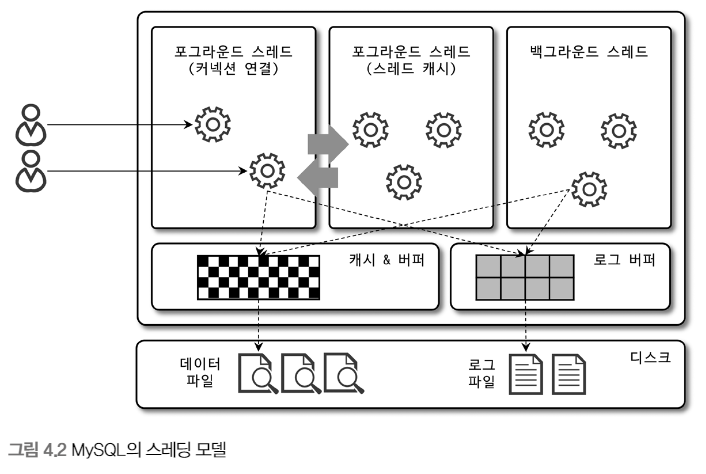
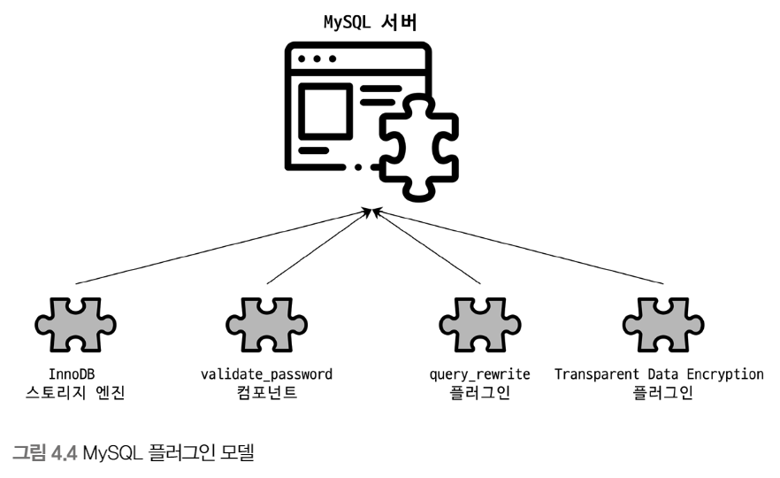
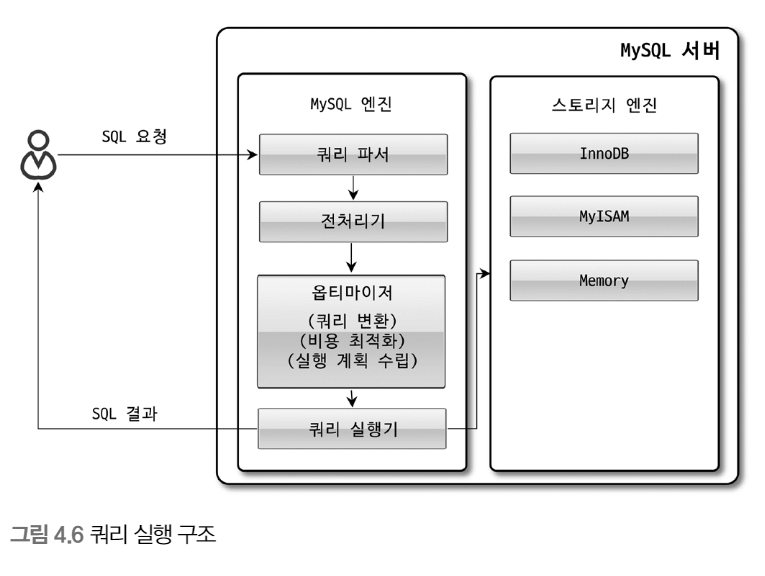
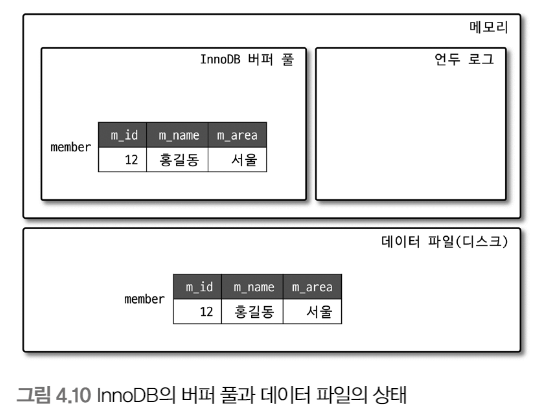
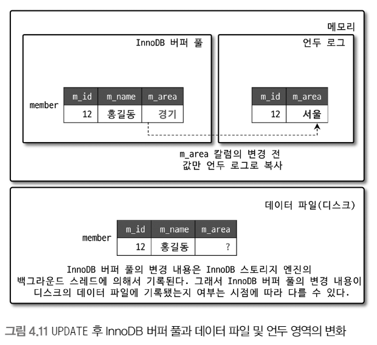
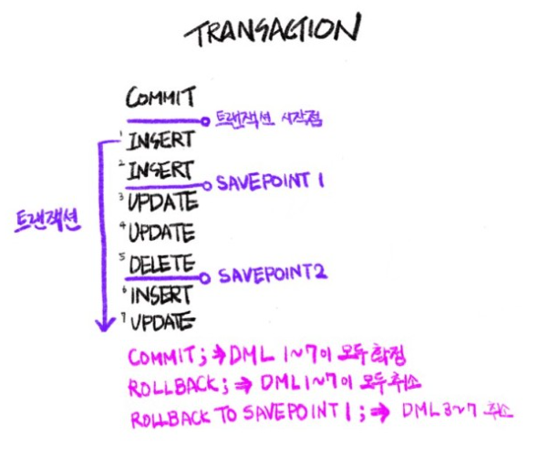
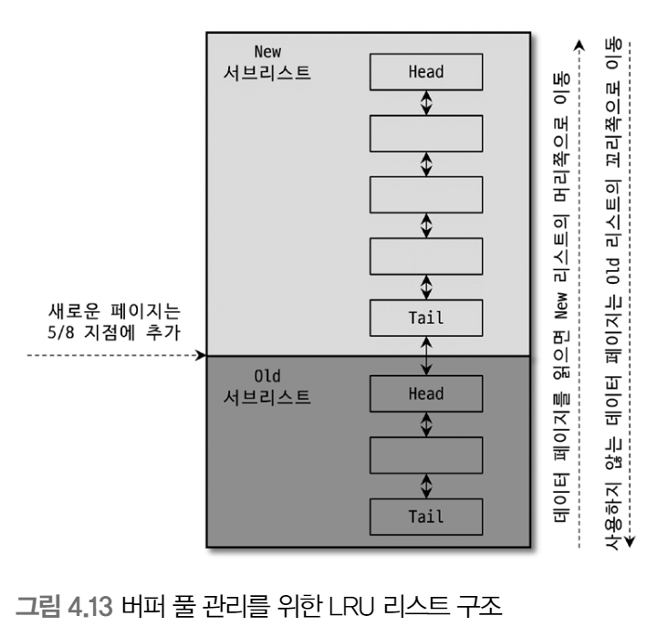

# 4장. 아키텍처


<br>

## MySQL 엔진 아키텍처

<p align="center"></p>


MySQL 서버는 다른 DBMS에 비해 구조가 독특

대부분의 프로그래밍 언어로부터 접근 방법을 지원

MySQL 서버의 구분

- 머리 역할을 담당하는 `MySQL 엔진`

- 손발 역할을 담당하는 `스토리지 엔진`

### MySQL 엔진

- 커넥션 핸들러

    클라이언트로부터의 접속 및 쿼리 요청을 처리

- SQL 파서

- 옵티마이저

    쿼리의 최적화된 실행

<br>

### 스토리지 엔진

실제 데이터를 스토리지에 저장하거나 데이터를 읽어오는 것을 담당

MySQL 서버에서 MySQL 엔진은 하나, 스토리지 엔진은 여러 개를 동시에

<br>

### 핸들러 API

- 핸들러 요청

    쿼리 실행기에서 데이터를 쓰거나 읽어야 할 때 스토리지 엔진에 쓰기 or 읽기를 요청하는 것

<p align="center"></p>

핸들러 API를 통해 얼마나 많은 데이터(레코드) 작업이 있었는지 확인 가능

<br>

### MySQL 스레딩 구조

<p align="center"></p>

MySQL 서버는 프로세스 기반이 아니라 스레드 기반으로 작동


<br>

### 포그라운드 스레드

MySQL 서버에 접속하면 요청을 처리해줄 스레드를 생성해 클라이언트에게 할당 

DBMS 앞단에서 사용자(클라이언트)와 통신하기에 포그라운드 스레드(사용자 스레드)

<br>

데이터를 MySQL의 데이터 버퍼나 캐시로부터 가져오거나, 없는 경우 직접 디스크의 데이터나 인덱스 파일로부터 데이터를 읽어와서 각 클라이언트 사용자가 요청하는 쿼리 문장을 처리

<br>

최소 MySQL 서버에 접속된 클라이언트 수만큼 존재

작업을 마치고 커넥션 종료 -> 커넥션 담당 스레드는 스레드 캐시로

<br>


MyISAM 테이블은 디스크 쓰기까지 포그라운드 스레드가 처리

InnoDB 테이블은 데이터 버퍼나 캐시까지만 포그라운드 스레드가 처리

<br>

### 백그라운드 스레드

InnoDB는 여러 가지 작업이 백그라운드로 처리

- 인서트 버퍼를 병합

- 로그를 디스크로 기록(중요)

- InnoDB 버퍼 풀의 데이터를 디스크에 기록(중요)

- 데이터를 버퍼로 읽어옴

- 잠금이나 데드락을 모니터링

<br>

InnoDB에서 데이터를 읽는 작업은 포그라운드 스레드에서 처리되기 때문에 읽기 스레드는 많이 설정할 필요 X

쓰기 스레드는 아주 많은 작업을 백그라운드로 처리하기 때문에 충분히 설정해야 함

<br>

쓰기 작업은 지연되어 처리될 수 있지만 읽기 작업은 절대 지연될 수 없음

<br>

### 메모리 할당 및 사용 구조

<p align="center"></p>

MySQL에서 사용되는 메모리 공간

- 글로벌 메모리

- 로컬 메모리

### 글로벌 메모리

MySQL 서버가 시작되면서 운영체제로부터 할당

스레드 수와 무관하게 하나의 메모리 공간만 할당

#### 대표적인 글로벌 메모리

- 테이블 캐시

- InnoDB 버퍼 풀

- InnoDB 어댑티브 해시 인덱스

- InnoDB 리두 로그 버퍼

<br>

### 로컬 메모리

클라이언트 스레드가 쿼리를 처리하는 데 사용하는 메모리 영역

각 클라이언트 스레드 별로 독립적으로 할당, 절대 공유되지 않음


#### 대표적인 로컬 메모리

- 정렬 버퍼

- 조인 버퍼

- 바이너리 로그 캐시

- 네트워크 버퍼

<br>

### 플러그인 스토리지 엔진 모델

<p align="center"></p>

MySQL의 독특한 구조 중 대표적인 것이 플러그인 모델

<br>

<p align="center"></p>

쿼리의 실행 과정 중 거의 `대부분의 작업이 MySQL 엔진`에서 처리되고 마지막 `데이터 읽기/쓰기 작업이 스토리지 엔진`에 의해 처리

<br>

MySQL 엔진은 사람 역할 / 스토리지 엔진은 자동차 역할

MySQL 엔진이 스토리지 엔진을 조정하기 위해 `핸들러`를 사용 

<br>

```
하나의 쿼리 작업은 여러 하위 작업으로 나뉘는데, 각 하위 작업이 MySQL 엔진 영역에서 처리되는지 스토리지 엔진 영역에서 처리되는지 알아야 한다.
```

### 스토리지 엔진

<p align="center"></p>

Supprot 컬럼의 값 4가지

- YES : 해당 스토리지 엔진이 포함, 사용 가능 상태로 활성화

- DEFAULT : 필수 스토리지 엔진

- NO : 포함되지 않음, 사용하기 위해서는 서버를 다시 빌드(컴파일)해야 함

- DISABLED : 포함 But, 비활성화

<br>

#### 컴포넌트

플러그인 아키텍처를 대체하기 위해 컴포넌트 아키텍처를 지원

<br>

### 쿼리 실행 구조

<p align="center"></p>

#### 쿼리 파서

사용자 요청으로 들어온 쿼리 문장을 토큰(MySQL이 인식할 수 있는 최소 단위)으로 분리해 트리 형태의 구조로 만들어 내는 작업

#### 전처리기

파서 트리를 기반으로 쿼리 문장에 구조적인 문제점이 있는지 확인

토큰을 테이블, 칼럼 이름 등에 매핑해서 해당 객체의 존재 여부와 접근 권한을 확인하는 과정

#### 옵티마이저

쿼리 문장을 저렴한 비용으로 가장 빠르게 처리할지를 결정하는 역할

DBMS의 두뇌


#### 실행 엔진

실행 엔진과 핸들러는 손과 발

예를 들어, 옵티마이저가 GROUP BY를 처리하기 위해 임시 테이블을 사용하기로 결정했다면

1. 실행 엔진이 핸들러에게 임시 테이블을 만들라고 요청

2. 실행 엔진은 WHERE 절에 일치하는 레코드를 읽어오라고 핸들러에게 요청

3. 읽어온 레코드들을 1번에서 준비한 임시 테이블로 저장하라고 다시 핸들러에게 요청

4. 데이터가 준비된 임시 테이블에서 필요한 방식으로 데이터를 읽어오라고 다시 핸들러에게 요청

5. 최종적으로 실행 엔진은 결과를 사용자나 다른 모듈로 넘김

`즉, 실행 엔진은 계획대로 각 핸들러에게 요청해서 받은 결과를 또 다른 핸들러 요청의 입력으로 연결하는 역할을 수행`

#### 핸들러(스토리지 엔진)

MySQL 실행 엔진의 요청에 따라 데이터를 디스크로 저장하고 디스크로 읽어 오는 역할을 담당

<br>

### 쿼리 캐시

쿼리 캐시는 빠른 응답을 필요로 하는 웹 기반 응용 프로그램에서 중요한 역할

SQL 실행 결과를 메모리에 캐시하고 동일 SQL 쿼리가 실행되면 즉시 결과를 반환

하지만, 테이블의 데이터가 변경되면 모두 삭제해야 하기 때문에 MySQL 8.0으로 올라오면서 기능이 완전 제거

<br>

### 스레드 풀

MySQL 서버의 CPU가 제한된 개수의 스레드 처리에만 집중할 수 있게 해서 서버의 자원 소모를 줄이는 것이 목적

동시에 실행 중인 스레드들을 CPU가 최대한 잘 처리해낼 수 있는 수준으로 줄여서 빨리 처리하게 하는 기능

<BR>

### 트랜잭션 지원 메타 데이터

테이블의 구조 정보와 스토어드 프로그램 등의 정보를 데이터 딕셔너리 또는 메타데이터라고 함

8.0 버전부터는 관련 정보를 InnoDB의 테이블에 저장

## InnoDB 스토리지 엔진 아키텍처

<p align="center"></p>

InnoDB는 MySQL 스토리지 엔진 중 거의 유일하게 레코드 기반 잠금을 제공하며, 높은 동시성 처리와 안정적이며 성능이 뛰어남

<br>

### 프라이머리 키에 의한 클러스터링

InnoDB의 모든 테이블은 기본적으로 프라이머리 키를 기준으로 클러스터링되어 저장

즉, 프라이머리 키 값의 순서대로 디스크에 저장

프라이머리 키가 클러스터링 인덱스이기 때문에 프라이머리 키를 이용한 레인지 스캔은 상당히 빠름

쿼리의 실행 계획에서 프라이머리 키는 다른 보조 인덱스에 비해 비중이 높게 설정

<br>

MyISAM 스토리지 엔진에서는 클러스터링 키를 지원하지 않음

<br>

### 외래 키 지원

외래 키 지원은 InnoDB 스토리지 엔진에서만 지원

부모 테이블과 자식 테이블 모두 해당 칼럼에 인덱스 생성이 필요하고, 변경 시 데이터 체크 작업이 필요하므로 잠금이 여러 테이블로 전파되고 데드락이 발생할 수 있기에 주의

foreign_key_checks 변수로 외래 키 체크 작업을 켜고 끌 수 있음

<br>

### MVCC(Multi Version Concurrency Control)

레코드 레벨의 트랜잭션을 지원하는 DBMS가 제공하는 기능

MVCC의 목적은 잠금을 사용하지 않는 일관된 읽기 제공

InnoDB는 언두 로그를 이용해 이 기능을 구현


<p align="center"></p>


<p align="center"></p>


<p align="center"></p>

UPDATE 문장이 실행되면 커밋 실행 여부와 관계 없이 버퍼 풀은 새로운 값인 경기로 업데이트

디스크의 데이터 파일에는 체크포인트나 InnoDB의 Write 스레드에 의해 새로운 값으로 업데이트되거나 아닐 수도 있음

아직 COMMIT이나 ROLLBACK이 되지 않은 상태에서 다른 사용자가 작업 중인 레코드를 조회한다면 어디에 있는 데이터를 조회할까?

```
mysql> SELECT * FROM member WHERE m_id=12;
```
<p align="center"></p>

```
먼저 COMMIT과 ROLLBACK을 이해하려면 TRANSACTION 진행 과정에 대해서 알아야 함

COMMIT

보류중인 모든 데이터 변경사항을 영구적으로 적용. 현재 트랜잭션 종료

ROLLBACK

보류중인 모든 데이터 변경사항을 폐기. 현재 트랜잭션 종료, 직전 커밋 직후의 단계로 회귀(되돌아가기)

전체 트랜잭션을 롤백함

SAVEPOINT

ROLLBACK 할 포인트 지정(세이브포인트).
```

<br>

다시 위의 질문으로 돌아가 답을 한다면, MySQL 서버의 시스템 변수(transaction_isolation)에 설정된 격리 수준에 따라 다름

격리 수준이 READ_UNCOMMITED인 경우 버퍼 풀이 가지고 있는 변경된 데이터를 읽어서 반환

READ_COMMITED거나 그 이상의 격리 수준인 경우 변경되기 이전의 내용을 보관하고 있는 언두 영역의 데이터를 반환

`해당 과정을 DBMS에서 MVCC라고 표현`

`즉, 하나의 레코드(회원 번호가 12인 레코드)에 대해 2개의 버전이 유지되고, 필요에 따라 어느 데이터가 보여지는지 여러 가지 상황에 따라 달라지는 구조`

<br>

### 잠금 없는 일관된 읽기(Non-Locking Consistent Read)

InnoDB는 MVCC 기술을 이용해 잠금을 걸지 않고 읽기 작업을 수행

```
## 잠금이란?

여러 사용자가 동시에 데이터베이스를 변경할 때 잠금은 충돌을 방지하고 일관된 상태를 유지하는 것
```

특정 사용자가 레코드를 변경하고 아직 커밋을 수행하지 않았다고 하더라도 이 변경 트랜잭션이 다른 사용자의 SELECT 작업을 방해하지 않음

이럴 때 언두 로그를 사용

오랜 시간 동안 활성 상태인 트랜잭션으로 인해 서버가 느려지는 문제가 있는데 이런 일관된 읽기를 위해 언두 로그를 삭제하지 않고 유지해야 되기 때문에 발생하는 문제

```
MVCC가 적합한 경우:

데이터 읽기 작업이 많은 경우: MVCC는 데이터 읽기 작업에 영향을 거의 미치지 않기 때문에 데이터 읽기 작업이 많은 경우에 적합합니다.

데이터 변경 작업이 빈번하지 않은 경우: MVCC는 데이터 변경 작업에 잠금이 필요하지 않지만, 변경 작업이 빈번할 경우 성능 저하를 초래할 수 있습니다.


MVCC가 적합하지 않은 경우:

데이터 변경 작업이 빈번한 경우: MVCC는 데이터 변경 작업에 잠금이 필요하지 않지만, 변경 작업이 빈번할 경우 성능 저하를 초래할 수 있습니다.

저장 공간이 부족한 경우: MVCC는 여러 버전의 데이터를 저장하기 때문에 저장 공간이 부족한 경우 적합하지 않습니다.
```

<br>


### 자동 데드락 감지

Inno DB는 잠금이 교착 상태에 빠지지 않았는지 확인하기 위해 잠금 대기 목록을 그래프 형태로 관리

데드락 감지 스레드가 주기적으로 잠금 대기 그래프를 검사해 교착 상태에 빠진 트랜잭션들을 찾아서 그 중에 하나를 강제 종료

어느 트랜잭션을 먼저 강제 종료할 것인지는 트랜잭션의 언두 로그 양이며, 더 적게 가진 트랜잭션이 롤백의 대상

innodb_table_locks 시스템 변수를 활성화하면 InnoDB 내부 레코드 잠금 뿐 아니라 테이블 레벨의 잠금까지 감지할 수 있음

<br>

동시 처리 스레드가 많아지거나 트랜잭션이 가진 잠금의 개수가 많아지면 데드락 감지 스레드가 느려짐

<br>

### 자동화된 장애 복구

InnoDB에는 손실이나 장애로부터 데이터를 보호하기 위한 여러 가지 메커니즘이 탑재

이런 매커니즘을 이용해 MySQL 서버가 시작될 때 완료되지 못한 트랜잭션이나 일부만 기록된 데이터 페이지 등에 대한 복구 작업이 자동으로 진행

<br>

InnoD 스토리지 엔진은 매우 견고해서 데이터 파일이 손상되거나 MySQL 서버가 시작되는 못하는 경우는 거의 없음

하지만, 디스크나 서버 하드웨어 이슈로 자동 복구를 못하는 경우 복구하기 쉽지 않음

<br>

이때는 innodb_force_recovery 시스템 변수를 설정해서 서버를 시작해야 함

1. InnoDB의 로그 파일이 손상됐다면 6으로 설정하고 MySQL 서버를 가동

2. 테이블의 데이터 파일이 손상됐다면 1로 설정하고 MySQL 서버를 가동

3. 어떤 부분이 문제인지 알 수 없다면 1 ~ 6까지 변경하면서 MySQL을 재시작

<br>

### InnoDB 버퍼 풀

InnoDB 스토리지 엔진에서 가장 핵심적인 부분

디스크의 데이터 파일이나 인덱스 정보를 메모리에 캐시해두는 공간

쓰기 작업을 지연시켜 일괄 작업으로 처리할 수 있게 해주는 버퍼 역할도 같이

<br>

일반적인 애플리케이션에서는 INSERT, UPDATE, DELETE처럼 데이터를 변경하는 쿼리는 데이터 파일의 레코드를 변경하기에 랜덤한 디스크 작업을 발생 시킴

하지만, 버퍼 풀이 이런 변경된 데이터를 모아서 처리하면 랜덤한 디스크 작업의 횟수를 줄일 수 있음

<br>

### 버퍼 풀의 크기 설정

운영체제와 각 클라이언트 스레드가 사용할 메모리를 고려해서 설정

처음으로 MySQL 서버를 준비한다면 다음과 같이 권장

1. 운영체제의 전체 메모리 공간이 8GB 미만이라면 50% 정도만 버퍼풀로 설정

2. 메모리 공간이 그 이상이라면 50% 이상으로 점점 올려가면서 최적점을 찾기

3. 50GB 이상이라면 15GB에서 30GB를 뺀 나머지를 버퍼 풀로 할당

<br>

innodb_buffer_pool_size 시스템 변수로 크기를 설정 가능하며, 동적으로 크기 확장 가능

크리티컬한 변경이기에 서버가 한가한 시점에 하는 것이 좋음

크기를 줄이는 작업은 서비스 영향도가 매우 크므로 가능하면 하지 않는 것이 좋음

<br>

### 버퍼 풀의 구조

버퍼 풀을 페이지 크기(innodb_page_size)의 조각으로 쪼개어 엔진이 데이터를 필요로 할 때 해당 데이터 페이지를 읽어서 각 조각에 저장

페이지 크기 조각을 관리하기 위한 3가지 자료 구조

1. LRU(Least Recently Used) 리스트

2. Flush 리스트

3. Free 리스트

```
## LRU 자료구조란 무엇일까요?

LRU는 "Least Recently Used"의 약자로, 최근에 가장 오랫동안 사용하지 않은 데이터를 제거하는 자료구조입니다. 캐시 메모리와 같은 제한된 공간에서 데이터를 효율적으로 관리할 때 유용하게 사용됩니다.


## LRU 자료구조의 작동 방식

LRU 자료구조는 다음과 같은 방식으로 작동합니다.

데이터 삽입: 새로운 데이터가 LRU 자료구조에 삽입될 때, 가장 최근에 사용된 데이터의 위치 바로 뒤에 추가됩니다.

데이터 접근: 이미 LRU 자료구조에 존재하는 데이터에 접근할 때, 해당 데이터를 가장 최근에 사용된 위치로 이동시킵니다.

데이터 제거: LRU 자료구조에 공간이 부족할 때, 가장 오랫동안 사용되지 않은 데이터가 제거됩니다.


## LRU 자료구조의 구현

LRU 자료구조는 일반적으로 다음과 같은 두 가지 방법으로 구현됩니다.

연결 리스트: 데이터를 연결 리스트로 연결하고, 최근에 사용된 데이터 순서대로 연결 리스트를 유지합니다.

해시 테이블: 데이터를 해시 테이블에 저장하고, 각 데이터의 사용 시간 정보를 함께 저장합니다.
```

<p align="center"></p>

<br>

`InnoDB 스토리지 엔진에서 데이터를 찾는 과정`

1. 필요한 레코드가 저장된 데이터 페이지가 버퍼 풀에 있는지 검사

    1. InnoDB 어댑티브 해시 인덱스를 이용해 페이지를 검색

    2. 해당 테이블의 인덱스(B-Tree)를 이용해 버퍼 풀에서 페이지를 검색

    3. 버퍼 풀에 이미 데이터 페이지가 있었다면 해당 페이지의 포인터를 MRU(Most Recently Used) 방향으로 승급

2. 디스크에서 필요한 데이터 페이지를 버퍼 풀에 적재하고, 적재된 페이지에 대한 포인터를 LRU 헤더 부분에 추가

3. 버퍼 풀의 LRU 헤더 부분에 적재된 데이터 페이지가 실제로 읽히면 MRU 헤더 부분으로 이동

4. 버퍼 풀에 상주하는 데이터 페이지는 사용자 쿼리가 얼마나 최근에 접근했는지에 따라 나이가 부여되며, 오랫동안 사용되지 않으면 나이가 오래되고 해당 페이지는 버퍼 풀에서 제거

5. 필요한 데이터가 자주 접근됐다면 해당 페이지의 인덱스 키를 어댑티브 해시 인덱스에 추가


`즉, 버퍼 풀 내부에서 최근 접근 여부에 따라서 데이터 페이지는 서로 경쟁하면서 MRU, LRU로 이동`

<br>

플러시 리스트는 디스크로 동기화되지 않은 데이터를 가진 데이터 페이지의 변경 시점 기준의 페이지 목록을 관리

데이터 변경이 가해진 데이터 페이지는 플러시 리스트에 관리되고 특정 시점이 되면 디스크로 기록되야 함

데이터가 변경되면 InnoDB는 변경 내용을 리두 로그에 기록하고 버퍼 풀의 데이터 페이지에도 변경 내용을 반영

그래서 리두 로그의 각 엔트리는 특정 데이터 페이지와 연결

<br>

### 버퍼 풀과 리두 로그

버퍼 풀과 리두 로그는 매우 밀접한 관계

버퍼 풀은 DB 서버 성능 향상을 위해 데이터 캐시와 쓰기 버퍼링 두가지 용도

버퍼 풀의 메모리 공간만 단순히 늘리는 것은 데이터 캐시 기능만 향상시키는 것

`쓰기 버퍼링 기능까지 향상시키려면 버퍼 풀과 리두 로그와의 관계를 이해`해야 함

<br>

버퍼 풀은 전혀 변경되지 않은 클린 페이지와 함께 INSERT, UPDATE, DELETE 명령으로 변경된 데이터를 가진 더티 페이지도 가지고 있음

더티 페이지는 디스크와 메모리(버퍼 풀)의 데이터 상태가 다르기에 언젠가는 디스크에 기록되어야 함

하지만 더티 페이지는 버퍼 풀에 무한정 있을 수 없음

InnoDB에서 리두 로그는 1개 이상의 고정 크기 파일을 연결해서 순환 고리처럼 사용

즉, 데이터 변경이 계속 발생하면 리두 로그 파일에 기록됐던 로그 엔트리는 다시 새로운 로그 엔트리로 덮어 쓰임

```
MySQL에서 로그 엔트리란 무엇일까요?

MySQL에서 로그 엔트리는 서버 활동에 대한 기록입니다. 로그 엔트리에는 다음과 같은 정보가 포함됩니다.

날짜 및 시간: 로그 엔트리가 생성된 날짜와 시간
로그 수준: 로그 엔트리의 중요도 수준 (예: 정보, 경고, 오류)
사용자: 로그 엔트리를 생성한 사용자
클라이언트 주소: 로그 엔트리를 생성한 클라이언트의 IP 주소
쿼리: 실행된 SQL 쿼리
메시지: 로그 엔트리의 내용
```

<br>

```
언두 로그와 리두 로그는 똑같지 않습니다. 둘 다 데이터베이스 트랜잭션 관리에 사용되지만 역할과 작동 방식에서 차이점이 있습니다.

1. 역할

언두 로그: 트랜잭션 취소 시 필요한 데이터를 저장합니다.
리두 로그: 트랜잭션 커밋 시 필요한 데이터를 저장합니다.

2. 작동 방식

언두 로그:

트랜잭션 진행 중 변경된 데이터의 이전 값을 저장합니다.
트랜잭션 취소 시 언두 로그를 사용하여 데이터를 이전 상태로 되돌립니다.

리두 로그:

트랜잭션 진행 중 변경된 데이터의 변경 내용을 저장합니다.
트랜잭션 커밋 시 리두 로그를 사용하여 데이터를 영구적으로 저장합니다.
```


InnoDB는 전체 리두 로그 파일에서 재사용 가능한 공간과 재사용 불가능한 공간(활성 리두 로그)을 구분해서 관리

리두 로그 파일의 공간은 계속 순환되어 재사용되지만 매번 기록될 때마다 로그 포지션은 계속 증가된 값을 갖음(Log Sequnece Number : LSN)

<br>

InnoDB는 주기적으로 체크포인트 이벤트를 발생시켜 리두 로그와 버퍼 풀의 더티 페이지를 디스크로 동기화하는데 LSN이 활성 리두 로그 공간의 시작점

마지막 리두 로그 엔트리의 LSN - 가장 최근 체크포인트의 LSN = 체크포인트 에이지

<br>

버퍼 풀의 더티 페이지는 특정 리두 로그 엔트리와의 관계를 가지고, 체크포인트가 발생하면 체크포인트 LSN보다 작은 리두 로그 엔트리와 관련된 더티 페이지는 모두 디스크로 동기화

<br>

간단한 예제

1. 버퍼 풀이 100GB, 리두 로그 파일의 전체 크기가 100MB

2. 버퍼 풀이 100MB, 리두 로그 파일의 전체 크기가 100GB

1번의 경우 체크포인트 에이지가 최대 100MB, 데이터 페이지가 16KB라고 가정하면 허용 가능한 더티 페이지의 크기는 400MB

이 경우 버퍼 풀의 크기는 크지만 실제 쓰기 버퍼링 효과는 거의 미미

2번의 경우 400GB의 더티 페이지를 가질 수 있지만 버퍼 풀의 크기가 100MB이기에 최대 허용 가능 버퍼 페이지는 100MB

<br>

두가지 모두 좋은 설정은 아니며, 특히 2번은 버퍼 풀에 더티 페이지 비율이 너무 높은 상태에서 갑자기 버퍼 풀이 필요한 상황이 오면 매우 많은 더티 페이지를 한번에 기록해야 하는 상황이 있음

일반적으로 리두 로그는 변경 분만 가지고 있고, 버퍼 풀은 데이터 페이지를 통채로 가지기 때문에 리두 로그는 훨씬 작은 공간만 있으면 됨
