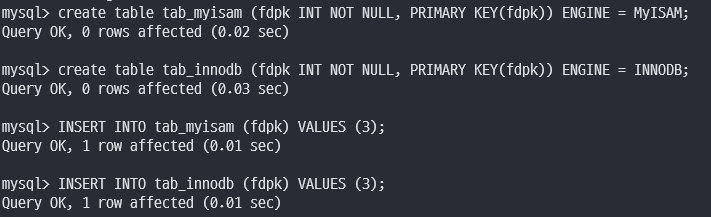
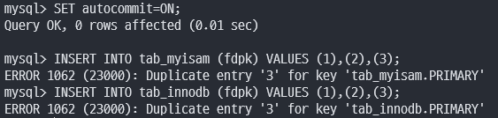

# 5장. 트랜잭션과 잠금

MySQL의 동시성에 영향을 미치는 잠금(Lock)과 트랜잭션, 트랜잭션의 격리 수준(Isolation level)에 대해 알아보자

<br>

`트랜잭션은 작업의 완전성을 보장해주는 것`

작업의 일부만 적용되는 현상이 발생하지 않도록 만들어주는 기능

잠금과 트랜잭션은 비슷한 개념같지만 `잠금은 동시성을 제어하기 위한 기능, 트랜잭션은 데이터의 정합성을 보장하기 위한 기능`

`잠금은 여러 커넥션에서 동시에 동일한 자원(레코드나 테이블)을 요청할 경우 순서대로 한 시점에는 하나의 커넥션만 변경할 수 있게 도와주는 역할`

<br>

`격리 수준은 하나의 트랜잭션 내에서 또는 여러 트랜잭션 간의 작업 내용을 어떻게 공유하고 차단할 것인지를 결정하는 레벨`

<br>

## 트랜잭션

트랜잭션을 지원하지 않는 스토리지 엔진(MyISAM이나 MEMORY)과 트랜잭션을 지원하는 스토리지 엔진(InnoDB)의 차이에 대해 알아보자

###  MySQL에서의 트랜잭션

`트랜잭션은 하나의 논리적인 작업 셋에 쿼리의 개수와 상관없이 작업 셋 자체가 100% 적용되거나(COMMIT) 아무것도 적용되지 않아야(ROLLBACK) 함을 보장하는 것`


간단한 예제로 InnoDB와 MyISAM 차이 알아보기

<br>

<p align="center"></p>

<br>

<p align="center"></p>

<br>

<p align="center"></p>

<br>

두 INSERT 문장 모두 프라이머리 키 중복 오류로 쿼리가 실패했지만 

MyISAM 테이블에는 1,2가 INSERT된 상태를 확인할 수 있음

하지만, InnoDB 테이블에는 쿼리 중 일부라도 오류가 발생하면 전체를 원 상태로 복구하는 트랜잭션의 원칙이 반영

<br>

애플리케이션 개발에서 트랜잭션은 부분 업데이트 문제를 해결할 수 있는 방법이기에 아주 필수적인 DBMS 기능

<br>

### 주의사항

트랜잭션 범위를 최소화하는 것이 좋음

```
## 사용자가 게시판에 게시물을 작성한 후 저장 버튼을 클릭했을 때

1) 처리 시작

    -> 데이터베이스 커넥션 생성
    -> 트랜잭션 시작

2) 사용자의 로그인 여부 확인

3) 사용자의 글쓰기 내용의 오류 여부 확인

4) 첨부로 업로드된 파일 확인 및 저장

5) 사용자의 입력 내용을 DBMS에 저장

6) 첨부 파일 정보를 DBMS에 저장

7) 저장된 내용 또는 기타 정보를 DBMS에서 조회

8) 게시물 등록에 대한 알림 메일 발송

9) 알림 메일 발송 이력을 DBMS에 저장

    -> 트랜잭션 종료(COMMIT)
    -> 데이터베이스 커넥션 반납

10) 처리 완료
```

위의 처리 절차 중에서 DBMS의 트랜잭션 처리에 좋지 않은 영향을 미치는 부분

- 대부분 DB 커넥션을 생성하는 코드를 1번과 2번 사이에 구현하며 동시에 START TRANSACTION 명령으로 트랜잭션을 실행하지만 실제 DBMS에 데이터를 저장하는 작업은 5번부터 시작

    2,3,4번의 절차는 트랜잭션에 포함시킬 필요가 없으며 DB 커넥션의 개수는 제한적이어서 커넥션을 소유하는 시간이 길어질수록 좋지 않음

- 8번 작업과 같이 메일 전송, FTP 팡리 전송, 네트워크를 통한 원격 서버 통신 같은 작업들은 어떻게든 트랜잭션 내에서 제거하는 것이 좋음

- 이 처리 절차에는 작업이 크게 4가지

    5번과 6번은 반드시 하나의 트랜잭션으로 묶어야 하며, 7번 작업은 단순 확인 및 조회이므로 포함할 필요가 없음

    9번 작업은 조금 성격이 다르기에 5,6번 트랜잭션과 묶지 않아도 무방

<br>

위의 처리 절차를 보완하여 설계한다면

```
## 사용자가 게시판에 게시물을 작성한 후 저장 버튼을 클릭했을 때

1) 처리 시작

2) 사용자의 로그인 여부 확인

3) 사용자의 글쓰기 내용의 오류 여부 확인

4) 첨부로 업로드된 파일 확인 및 저장

    -> 데이터베이스 커넥션 생성(또는 커넥션 풀에서 가져오기)
    -> 트랜잭션 시작

5) 사용자의 입력 내용을 DBMS에 저장

6) 첨부 파일 정보를 DBMS에 저장

    -> 트랜잭션 종료(COMMIT)

7) 저장된 내용 또는 기타 정보를 DBMS에서 조회

8) 게시물 등록에 대한 알림 메일 발송

    -> 트랜잭션 시작

9) 알림 메일 발송 이력을 DBMS에 저장

    -> 트랜잭션 종료(COMMIT)
    -> 데이터베이스 커넥션 반납(도는 커넥션 풀에 반납)

10) 처리 완료
```

`DB 커넥션을 가지고 있는 범위와 트랜잭션이 활성화되어 있는 프로그램의 범위를 최소화하는 것에 유의`

`네트워크 작업이 있는 경우 반드시 트랜잭션에서 배제해야 하며 이런 실수로 인해 DBMS 서버가 높은 부하 상태로 빠지거나 위험한 상태로 빠질 수 있음`

<br>

## MySQL 엔진의 잠금

MySQL에서 사용되는 잠금

1. 스토리지 엔진 레벨

2. MySQL 엔진 레벨

<br>

MySQL 엔진 레벨의 잠금은 모든 스토리지 엔진에 영향을 미치지만, 스토리지 엔진 레벨의 잠금은 스토리지 엔진 간 상호 영향을 미치지 않음

<br>

MySQL 엔진 - 테이블 락, 메타데이터 락, 네임드 락 제공

<br>

### 글로벌 락

FLUSH TABLES WITH READ LOCK 명령으로 획득

MySQL에서 제공하는 잠금 가운데 가장 범위가 넓음

`한 세션에서 글로벌 락을 획득하면 다른 세션에서 SELECT를 제외한 대부분의 DDL(CREATE, DROP, ALTER, TRUNCATE), DML(INSERT, DELETE, UPDATE, MERGE)를 실행할 경우 글로벌 락이 해제될 때까지 대기 상태`

MySQL 서버 전체에 영향을 미치며, 테이블이나 DB가 다르더라도 동일하게 영향을 미침

MyISAM or MEMERY 테이블에 대해 mysqldump로 일관된 백업을 받아야 할 때 사용

<br>

FLUSH TABLES WITH READ LOCK 명령은 실행과 동시에 MySQL 서버에 존재하는 모든 테이블을 닫고 잠금

글로벌 락은 모든 테이블에 영향을 미치기에 웹 서비스용 MySQL 서버에서는 가급적 사용 X

<br>

InnoDB가 기본 스토리지 엔진으로 채택되면서 가벼운 글로벌 락의 필요성

Xtrabackup이나 Enterprise Backup 같은 백업 툴들의 안정적 실행을 위해 백업 락이 도입

```
mysql> LOCK INSTANCE FOR BACKUP;
// 백업 실행

mysql> UNLOCK INSTANCE;
```

특정 세션에서 백업 락을 획득하면 해당 정보들을 변경할 수 없음

- DB, 테이블 등 모든 객체 생성 및 변경, 삭제

- REPAIR TABLE과 OPTIMIZE TABLE 명령

- 사용자 관리 및 비밀번호 변경

하지만, 일반적인 테이블의 데이터 변경은 허용

Xtrabackup이나 Enterprise Backup 같은 백업 툴이 실행되는 도중 DDL(스키마 변경)이 실행되면 백업이 실패하기에 이것을 방지하기 위해 백업 락이 도입

<br>

### 테이블 락

개별 테이블 단위로 설정되는 잠금, 명시적 또는 묵시적으로 특정 테이블의 락을 획득 가능

<br>

- 명시적 
  
LOCK TABLES table_name [READ | WRITE] / UNLOCK TABLES (잠금 해제)

하지만 명시적 테이블 락은 글로벌 락과 동일하게 온라인 작업에 큰 영향을 미치기에 사용할 필요가 거의 없음

<br>

- 묵시적

MyISAM이나 MEMORY 테이블에 데이터를 변경하는 쿼리를 실행하면 발생

즉, 쿼리가 실행되는 동안 자동으로 획득됐다가 쿼리가 완료된 후 해제

하지만, InnoDB 테이블의 경우 스토리지 엔진 차원에서 레코드 기반 잠금을 제공하기에 단순 데이터 변경 쿼리로는 묵시적 테이블 락이 설정되지 않음

더 정확히는 테이블 락이 설정되지만 DML 쿼리에서는 무시되고 DDL 쿼리의 경우에만 영향을 미침


<br>

### 네임드 락

GET_LOCK() 함수를 이용해 임의의 문자열에 대한 잠금 설정

`이 잠금의 특징은 대상이 테이블이나 레코드 또는 AUTO_INCREMENT와 같은 데이터베이스 객체가 아니라는 것`

자주 사용되진 않음

```
## "mylock"이라는 문자열에 대해 잠금을 획득
## 이미 잠금을 사용 중이면 2초 동안 대기 (2초 이후 자동 잠금 해제)

mysql> SELECT GET_LOCK('mylock', 2);

## "mylock"이라는 문자열에 대해 잠금이 설정돼 있는지 확인

mysql> SELECT IS_FREE_LOCK('mylock');

## 잠금 해제

mysql> SELECT RELEASE_LOCK('mylock');
```

배치 프로그램처럼 한꺼번에 많은 레코드를 변경하는 쿼리는 데드락의 원인

이런 경우 동일 데이터를 변경하거나 참조하는 프로그램끼리 분류해서 네임드 락을 걸고 쿼리를 실행하면 해결 가능


```
배치 프로그램이란?

배치 프로그램은 사용자와 상호작용 없이 대량의 데이터를 처리하는 일련의 작업들을 묶어 정기적으로 반복 수행하거나 정해진 규칙에 따라 자동으로 수행하는 프로그램입니다. 

쉽게 말하면, 사용자 개입 없이 자동으로 여러 작업을 연속적으로 실행하는 프로그램이라고 생각하면 됩니다.


배치 프로그램의 활용 예시

데이터 백업 및 복구: 정기적으로 데이터를 백업하고 필요에 따라 복구합니다.

데이터 마이닝 및 분석: 대량의 데이터를 분석하여 유용한 정보를 추출합니다.

급여 계산: 직원들의 급여를 계산하고 지급합니다.

시스템 유지 관리: 시스템의 정상적인 작동을 위해 필요한 유지 관리 작업을 수행합니다.

메일 발송: 뉴스레터나 홍보 메일을 발송합니다.
```

<br>

### 메타데이터 락

데이터베이스 객체(대표적으로 테이블이나 뷰 등)의 이름이나 구조를 변경하는 경우에 획득하는 잠금

명시적 X 묵시적 O

RENAME TABLE tab_a TO tab_b 와 같이 테이블의 이름을 변경하는 경우 자동으로 잠금 후 해제


