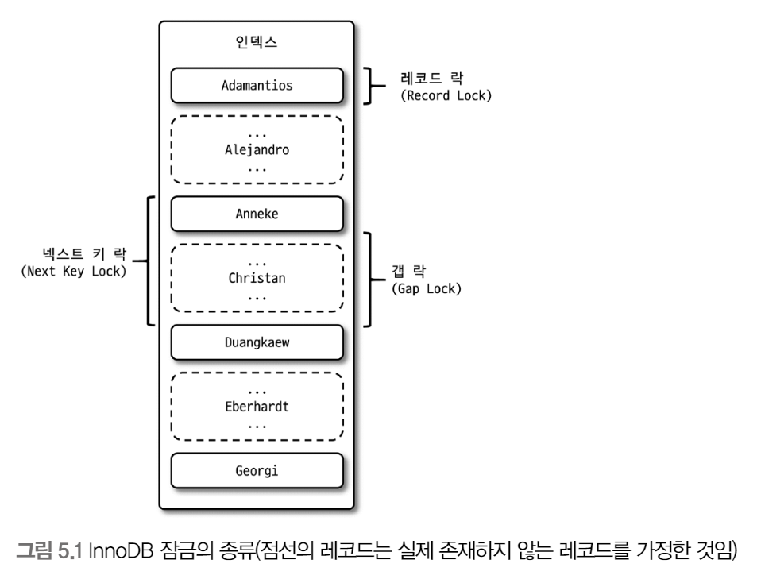
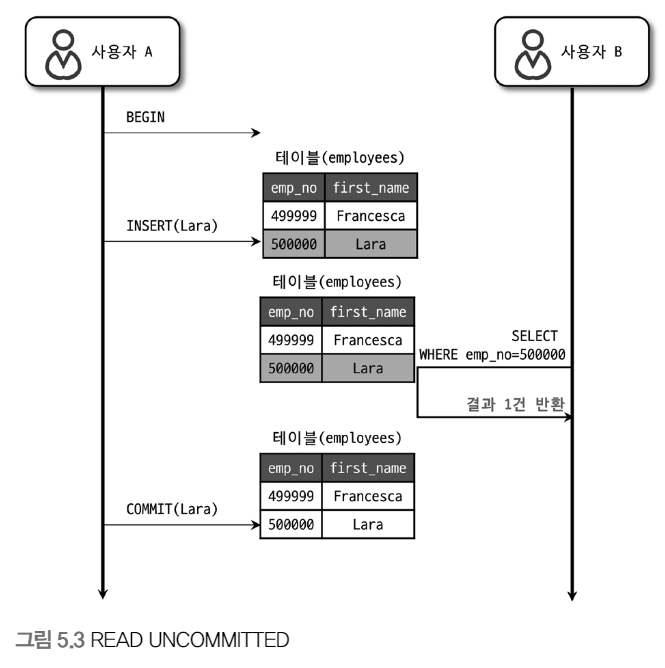
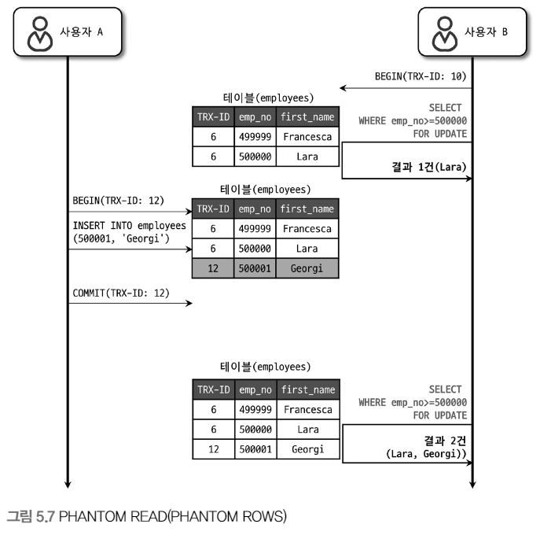

# 5장. 트랜잭션과 잠금

MySQL의 동시성에 영향을 미치는 잠금(Lock)과 트랜잭션, 트랜잭션의 격리 수준(Isolation level)에 대해 알아보자

<br>

`트랜잭션은 작업의 완전성을 보장해주는 것`

작업의 일부만 적용되는 현상이 발생하지 않도록 만들어주는 기능

잠금과 트랜잭션은 비슷한 개념같지만 `잠금은 동시성을 제어하기 위한 기능, 트랜잭션은 데이터의 정합성을 보장하기 위한 기능`

`잠금은 여러 커넥션에서 동시에 동일한 자원(레코드나 테이블)을 요청할 경우 순서대로 한 시점에는 하나의 커넥션만 변경할 수 있게 도와주는 역할`

<br>

`격리 수준은 하나의 트랜잭션 내에서 또는 여러 트랜잭션 간의 작업 내용을 어떻게 공유하고 차단할 것인지를 결정하는 레벨`

<br>

## 트랜잭션

트랜잭션을 지원하지 않는 스토리지 엔진(MyISAM이나 MEMORY)과 트랜잭션을 지원하는 스토리지 엔진(InnoDB)의 차이에 대해 알아보자

###  MySQL에서의 트랜잭션

`트랜잭션은 하나의 논리적인 작업 셋에 쿼리의 개수와 상관없이 작업 셋 자체가 100% 적용되거나(COMMIT) 아무것도 적용되지 않아야(ROLLBACK) 함을 보장하는 것`


간단한 예제로 InnoDB와 MyISAM 차이 알아보기

<br>

<p align="center"></p>

<br>

<p align="center"></p>

<br>

<p align="center"></p>

<br>

두 INSERT 문장 모두 프라이머리 키 중복 오류로 쿼리가 실패했지만 

MyISAM 테이블에는 1,2가 INSERT된 상태를 확인할 수 있음

하지만, InnoDB 테이블에는 쿼리 중 일부라도 오류가 발생하면 전체를 원 상태로 복구하는 트랜잭션의 원칙이 반영

<br>

애플리케이션 개발에서 트랜잭션은 부분 업데이트 문제를 해결할 수 있는 방법이기에 아주 필수적인 DBMS 기능

<br>

### 주의사항

트랜잭션 범위를 최소화하는 것이 좋음

```
## 사용자가 게시판에 게시물을 작성한 후 저장 버튼을 클릭했을 때

1) 처리 시작

    -> 데이터베이스 커넥션 생성
    -> 트랜잭션 시작

2) 사용자의 로그인 여부 확인

3) 사용자의 글쓰기 내용의 오류 여부 확인

4) 첨부로 업로드된 파일 확인 및 저장

5) 사용자의 입력 내용을 DBMS에 저장

6) 첨부 파일 정보를 DBMS에 저장

7) 저장된 내용 또는 기타 정보를 DBMS에서 조회

8) 게시물 등록에 대한 알림 메일 발송

9) 알림 메일 발송 이력을 DBMS에 저장

    -> 트랜잭션 종료(COMMIT)
    -> 데이터베이스 커넥션 반납

10) 처리 완료
```

위의 처리 절차 중에서 DBMS의 트랜잭션 처리에 좋지 않은 영향을 미치는 부분

- 대부분 DB 커넥션을 생성하는 코드를 1번과 2번 사이에 구현하며 동시에 START TRANSACTION 명령으로 트랜잭션을 실행하지만 실제 DBMS에 데이터를 저장하는 작업은 5번부터 시작

    2,3,4번의 절차는 트랜잭션에 포함시킬 필요가 없으며 DB 커넥션의 개수는 제한적이어서 커넥션을 소유하는 시간이 길어질수록 좋지 않음

- 8번 작업과 같이 메일 전송, FTP 팡리 전송, 네트워크를 통한 원격 서버 통신 같은 작업들은 어떻게든 트랜잭션 내에서 제거하는 것이 좋음

- 이 처리 절차에는 작업이 크게 4가지

    5번과 6번은 반드시 하나의 트랜잭션으로 묶어야 하며, 7번 작업은 단순 확인 및 조회이므로 포함할 필요가 없음

    9번 작업은 조금 성격이 다르기에 5,6번 트랜잭션과 묶지 않아도 무방

<br>

위의 처리 절차를 보완하여 설계한다면

```
## 사용자가 게시판에 게시물을 작성한 후 저장 버튼을 클릭했을 때

1) 처리 시작

2) 사용자의 로그인 여부 확인

3) 사용자의 글쓰기 내용의 오류 여부 확인

4) 첨부로 업로드된 파일 확인 및 저장

    -> 데이터베이스 커넥션 생성(또는 커넥션 풀에서 가져오기)
    -> 트랜잭션 시작

5) 사용자의 입력 내용을 DBMS에 저장

6) 첨부 파일 정보를 DBMS에 저장

    -> 트랜잭션 종료(COMMIT)

7) 저장된 내용 또는 기타 정보를 DBMS에서 조회

8) 게시물 등록에 대한 알림 메일 발송

    -> 트랜잭션 시작

9) 알림 메일 발송 이력을 DBMS에 저장

    -> 트랜잭션 종료(COMMIT)
    -> 데이터베이스 커넥션 반납(도는 커넥션 풀에 반납)

10) 처리 완료
```

`DB 커넥션을 가지고 있는 범위와 트랜잭션이 활성화되어 있는 프로그램의 범위를 최소화하는 것에 유의`

`네트워크 작업이 있는 경우 반드시 트랜잭션에서 배제해야 하며 이런 실수로 인해 DBMS 서버가 높은 부하 상태로 빠지거나 위험한 상태로 빠질 수 있음`

<br>

## MySQL 엔진의 잠금

MySQL에서 사용되는 잠금

1. 스토리지 엔진 레벨

2. MySQL 엔진 레벨

<br>

MySQL 엔진 레벨의 잠금은 모든 스토리지 엔진에 영향을 미치지만, 스토리지 엔진 레벨의 잠금은 스토리지 엔진 간 상호 영향을 미치지 않음

<br>

MySQL 엔진 - 테이블 락, 메타데이터 락, 네임드 락 제공

<br>

### 글로벌 락

FLUSH TABLES WITH READ LOCK 명령으로 획득

MySQL에서 제공하는 잠금 가운데 가장 범위가 넓음

`한 세션에서 글로벌 락을 획득하면 다른 세션에서 SELECT를 제외한 대부분의 DDL(CREATE, DROP, ALTER, TRUNCATE), DML(INSERT, DELETE, UPDATE, MERGE)를 실행할 경우 글로벌 락이 해제될 때까지 대기 상태`

MySQL 서버 전체에 영향을 미치며, 테이블이나 DB가 다르더라도 동일하게 영향을 미침

MyISAM or MEMERY 테이블에 대해 mysqldump로 일관된 백업을 받아야 할 때 사용

<br>

FLUSH TABLES WITH READ LOCK 명령은 실행과 동시에 MySQL 서버에 존재하는 모든 테이블을 닫고 잠금

글로벌 락은 모든 테이블에 영향을 미치기에 웹 서비스용 MySQL 서버에서는 가급적 사용 X

<br>

InnoDB가 기본 스토리지 엔진으로 채택되면서 가벼운 글로벌 락의 필요성

Xtrabackup이나 Enterprise Backup 같은 백업 툴들의 안정적 실행을 위해 백업 락이 도입

```
mysql> LOCK INSTANCE FOR BACKUP;
// 백업 실행

mysql> UNLOCK INSTANCE;
```

특정 세션에서 백업 락을 획득하면 해당 정보들을 변경할 수 없음

- DB, 테이블 등 모든 객체 생성 및 변경, 삭제

- REPAIR TABLE과 OPTIMIZE TABLE 명령

- 사용자 관리 및 비밀번호 변경

하지만, 일반적인 테이블의 데이터 변경은 허용

Xtrabackup이나 Enterprise Backup 같은 백업 툴이 실행되는 도중 DDL(스키마 변경)이 실행되면 백업이 실패하기에 이것을 방지하기 위해 백업 락이 도입

<br>

### 테이블 락

개별 테이블 단위로 설정되는 잠금, 명시적 또는 묵시적으로 특정 테이블의 락을 획득 가능

<br>

- 명시적 
  
LOCK TABLES table_name [READ | WRITE] / UNLOCK TABLES (잠금 해제)

하지만 명시적 테이블 락은 글로벌 락과 동일하게 온라인 작업에 큰 영향을 미치기에 사용할 필요가 거의 없음

<br>

- 묵시적

MyISAM이나 MEMORY 테이블에 데이터를 변경하는 쿼리를 실행하면 발생

즉, 쿼리가 실행되는 동안 자동으로 획득됐다가 쿼리가 완료된 후 해제

하지만, InnoDB 테이블의 경우 스토리지 엔진 차원에서 레코드 기반 잠금을 제공하기에 단순 데이터 변경 쿼리로는 묵시적 테이블 락이 설정되지 않음

더 정확히는 테이블 락이 설정되지만 DML 쿼리에서는 무시되고 DDL 쿼리의 경우에만 영향을 미침


<br>

### 네임드 락

GET_LOCK() 함수를 이용해 임의의 문자열에 대한 잠금 설정

`이 잠금의 특징은 대상이 테이블이나 레코드 또는 AUTO_INCREMENT와 같은 데이터베이스 객체가 아니라는 것`

자주 사용되진 않음

```
## "mylock"이라는 문자열에 대해 잠금을 획득
## 이미 잠금을 사용 중이면 2초 동안 대기 (2초 이후 자동 잠금 해제)

mysql> SELECT GET_LOCK('mylock', 2);

## "mylock"이라는 문자열에 대해 잠금이 설정돼 있는지 확인

mysql> SELECT IS_FREE_LOCK('mylock');

## 잠금 해제

mysql> SELECT RELEASE_LOCK('mylock');
```

배치 프로그램처럼 한꺼번에 많은 레코드를 변경하는 쿼리는 데드락의 원인

이런 경우 동일 데이터를 변경하거나 참조하는 프로그램끼리 분류해서 네임드 락을 걸고 쿼리를 실행하면 해결 가능


```
배치 프로그램이란?

배치 프로그램은 사용자와 상호작용 없이 대량의 데이터를 처리하는 일련의 작업들을 묶어 정기적으로 반복 수행하거나 정해진 규칙에 따라 자동으로 수행하는 프로그램입니다. 

쉽게 말하면, 사용자 개입 없이 자동으로 여러 작업을 연속적으로 실행하는 프로그램이라고 생각하면 됩니다.


배치 프로그램의 활용 예시

데이터 백업 및 복구: 정기적으로 데이터를 백업하고 필요에 따라 복구합니다.

데이터 마이닝 및 분석: 대량의 데이터를 분석하여 유용한 정보를 추출합니다.

급여 계산: 직원들의 급여를 계산하고 지급합니다.

시스템 유지 관리: 시스템의 정상적인 작동을 위해 필요한 유지 관리 작업을 수행합니다.

메일 발송: 뉴스레터나 홍보 메일을 발송합니다.
```

<br>

### 메타데이터 락

데이터베이스 객체(대표적으로 테이블이나 뷰 등)의 이름이나 구조를 변경하는 경우에 획득하는 잠금

명시적 X 묵시적 O

RENAME TABLE tab_a TO tab_b 와 같이 테이블의 이름을 변경하는 경우 자동으로 잠금 후 해제


<br>

## InnoDB 스토리지 엔진 잠금

MySQL에서 제공하는 잠금과 별개로 스토리지 엔진 내부에서 레코드 기반의 잠금 방식을 탑재

MyISAM보다 훨씬 뛰어난 동시성 처리를 제공

하지만 MySQL 명령을 이용해 접근하기 까다로움

<br>

MySQL 서버의 information_schema 데이터베이스에 존재하는 INNODB_TRX, INNODB_LOCKS, INNODB_LOCK_WAITS 테이블들을 조인해서 조회하면 해당 기능들을 사용 가능

- 현재 어떤 트랜잭션이 어떤 잠금을 대기하는지

- 해당 잠금을 어떤 트랜잭션이 가지고 있는지

- 장시간 잠금을 가지고 있는 클라이언트 종료

<br>

### InnoDB 스토리지 엔진의 잠금

잠금 정보가 상당히 작은 공간으로 관리되기에 레코드 락이 페이지 락 또는 테이블락으로 레벨업되는 경우는 없음

<p align="center"></p>

<br>

레코드와 레코드 사이의 간격을 잠그는 갭 락도 존재

<br>

### 레코드 락

레코드 자체만을 잠그는 것을 레코드 락이라고 하며 다른 DBMS의 레코드 락과 동일한 역할

중요한 차이는 InnoDB 스토리지 엔진은 레코드 자체가 아니라 인덱스의 레코드를 잠근다는 점

인덱스가 하나도 없는 테이블이더라도 내부적으로 자동 생성된 클러스터 인덱스를 이용해 잠금을 설정

<br>

### 갭 락

갭 락은 레코드 자체가 아니라 레코드와 바로 인접한 레코드 사이의 간격만을 잠그는 것

`갭 락의 역할은 레코드와 레코드 사이의 간격에 새로운 레코드가 생성(INSERT)되는 것을 제어하는 것`

<br>

### 넥스트 키 락

레코드 락과 갭 락을 합쳐놓은 형태의 잠금을 넥스트 키 락이라고 함

STATEMENT 포맷의 바이너리 로그를 사용하는 MySQL 서버에서는 REPEATABLE READ 격리 수준을 사용해야 함

또한 innodb_locks_unsafe_for_binlog 변수가 비활성화되면 변경을 위해 검색하는 레코드에는 넥스트 키 락 방식으로 잠금이 걸림

`갭 락과 넥스트 키 락의 목적은 바이너리 로그에 기록되는 쿼리가 레플리카 서버에서 실행될 때 소스 서버에서 만들어 낸 결과와 동일한 결과를 만들어내도록 보장하는 것`

```
### MySQL 바이너리 로그란 무엇일까요?

MySQL 바이너리 로그, 즉 빈로그(binlog)는 MySQL 서버 인스턴스의 데이터 변경 사항에 대한 정보를 포함하는 로그 파일 세트입니다. 

마치 데이터베이스의 거래 내역을 기록하는 거래일지와 같다고 생각하면 됩니다. 

빈로그는 단순히 변경 사항을 기록하는 뿐만 아니라 다음과 같은 다양한 기능을 제공합니다.


### 빈로그 포맷 종류: STATEMENT vs ROW

빈로그는 데이터 변경 사항을 기록하는 방식에 따라 STATEMENT 포맷과 ROW 포맷으로 나뉩니다.

1. STATEMENT 포맷

STATEMENT 포맷은 데이터 변경에 사용된 SQL 문을 그대로 기록합니다. 마치 요리법을 기록하는 것과 같다고 생각하면 됩니다.

장점:

적은 공간을 차지합니다.

복제 시 속도가 빠릅니다.

단점:

특정 테이블 구조에만 적용 가능합니다.

복잡한 쿼리의 경우 복구가 어려울 수 있습니다.

2. ROW 포맷

ROW 포맷은 변경된 데이터의 각 행(ROW)을 기록합니다. 마치 요리 과정을 단계별로 기록하는 것과 같다고 생각하면 됩니다.

장점:

모든 테이블 구조에 적용 가능합니다.

복잡한 쿼리도 정확하게 복구할 수 있습니다.

단점:

STATEMENT 포맷에 비해 많은 공간을 차지합니다.

복제 시 속도가 느립니다.
```


<br>

### 자동 증가 락

MySQL은 자동 증가하는 숫자 값을 추출하기 위해 AUTO_INCREMENT 라는 칼럼 속성을 제공

AUTO_INCREMENT 칼럼이 사용된 테이블에 동시에 여러 레코드가 INSERT 되는 경우 저장되는 각 레코드는 중복되지 않고 저장된 순서대로 증가하는 일련변호 값을 가져야 함

이를 위해 내부적으로 AUTO_INCREMENT 락이라는 테이블 수준의 잠금을 사용

<br>

INSERT, REPLACE와 같이 새로운 레코드를 저장하는 쿼리에서만 필요하며, UPDATE, DELETE 등의 쿼리에서는 걸리지 않음

<br>

자동 증가 값이 한 번 증가하면 절대 줄어들지 않는 이유가 AUTO_INCREMENT 잠금을 최소화하기 위해서 이며 INSERT 쿼리가 실패했더라도 한 번 증가된 AUTO_INCREMENT 값은 다시 줄어들지 않고 그대로 남음


<br>

### 인덱스와 잠금

InnoDB의 잠금과 인덱스는 상당히 중요한 연관 관계가 있음

InnoDB의 잠금은 레코드를 잠그는 것이 아니라 인덱스를 잠그는 방식으로 처리되기 때문

즉, 변경해야 할 레코드를 찾기 위해 검색한 인덱스의 레코드를 모두 락을 걸어야 함


```
### MySQL 인덱스란 무엇일까요?

MySQL 인덱스는 테이블의 특정 열에 대한 목차와 같은 역할을 하며, 데이터 검색 속도를 크게 향상시키는 데 사용됩니다. 

책의 색인을 통해 원하는 정보를 빠르게 찾을 수 있는 것과 마찬가지로, 인덱스는 테이블에서 특정 데이터를 효율적으로 찾을 수 있도록 도와줍니다.

### MySQL에서 인덱스를 생성하는 SQL 문

MySQL에서 인덱스를 생성하려면 CREATE INDEX 명령어를 사용합니다. 기본적인 문법은 다음과 같습니다.

CREATE [UNIQUE] INDEX [인덱스 이름] ON [테이블 이름] ([컬럼 이름1], [컬럼 이름2], ...);

-- 'employees' 테이블의 'department' 컬럼에 인덱스 생성
CREATE INDEX dept_idx ON employees (department);
```

<p align="center"></p>

<br>

해당 UPDATE 문장의 조건에서 인덱스를 이용할 수 있는 조건은 first_name='Georgi'이며, 해당 레코드인 253건의 레코드가 모두 잠김

<p align="center"></p>

<br>

해당 테이블에서 인덱스가 하나도 없다면, 테이블을 풀 스캔하면서 UPDATE 작업을 하는데 이 과정에서 모든 레코드를 잠그게 됨

그래서 MySQL의 InnoDB에서 인덱스 설계가 중요

<br>

### 레코드 수준의 잠금 확인 및 해제

레코드 수준의 잠금은 레코드 각각에 잠금이 걸리기에 오랜 시간 동안 잠겨진 상태로 남아 있어도 잘 발견되지 않을 수도 있음

<p align="center"></p>

<br>

MySQL 8.0 부터는 performance_schema의 data_locks와 data_lock_waits 테이블에서 메타 정보를 조회할 수 있음

<br>

## MySQL의 격리 수준

`트랜잭션의 격리 수준이란 여러 트랜잭션이 동시에 처리될 때 특정 트랜잭션이 다른 트랜잭션에서 변경하거나 조회하는 데이터를 볼 수 있게 허용할지 말지를 결정하는 것`

크게 4가지로 나뉨

- READ UNCOMMITTED

- READ COMMITTED

- REPEATABLE READ

- SERIALIZABLE

밑으로 갈수록 각 트랜잭션 간의 데이터 격리(고립)이 높아짐

SERIALIZABLE 수준이 아니라면 크게 성능의 개선이나 저하가 발생하지 않음

<br>

<p align="center"></p>

<br>

데이터베이스의 격리 수준을 이야기하면 항상 언급되는 세가지 부정합의 문제

일반적인 온라인 서비스의 용도에서는 READ COMMITTED와 REPEATABLE READ 중 하나 사용

오라클 같은 DBMS에서는 주로 READ COMMITTED

MySQL에서는 REPEATABLE READ를 주로 사용

<br>

### READ UNCOMMITTED

<p align="center"></p>

<br>

각 트랜잭션의 변경 내용이 COMMIT이나 ROLLBACK 여부에 상관없이 다른 트랜잭션에서 보임

`위의 그림처럼 어떤 트랜잭션이 처리한 작업이 완료되지 않았는데도 다른 트랜잭션에서 볼 수 있는 현상을 Dirty read라고 하며 Dirty read가 허용되는 격리 수준이 READ UNCOMMITTED`

개발자와 사용자를 혼란스럽게 만들 수 있으므로 MySQL을 사용한다면 READ COMMITTED 이상 격리 수준을 사용하자

<br>

### READ COMMITTED

<p align="center"></p>

<br>

온라인 서비스에서 가장 많이 선택되는 격리 수준

COMMIT이 완료된 데이터만 다른 트랜잭션에서 조회할 수 있기 때문

<br>

해당 격리 수준에서는 NON-REPEATABLE READ라는 부정합 문제가 발생할 수도 있음

<p align="center"></p>

<br>

`하나의 트랜잭션 내에서는 똑같은 SELECT 쿼리를 실행했을 때 항상 같은 결과를 가져와야 하는 REPEATABLE READ 정합성에 어긋나는 것`

하나의 트랜잭션에서 동일 데이터를 여러 번 읽고 변경하는 작업(금전적 처리)와 연결되면 문제

<br>

### REPEATABLE READ

<p align="center"></p>

<br>

InnoDB 엔진에서 기본으로 사용되는 격리 수준

MVCC(Multi Version Concurrency Control)를 위해 언두 영역에 백업된 이전 데이터를 이용해 동일 트랜잭션 내에서는 동일한 결과를 보여주도록 보장

`READ COMMITTED과 REPEATABLE READ의 차이는 언두 영역에 백업된 레코드의 여러 버전 가운데 몇 번째 버전까지 찾아 들어가느냐에 있음`

<br>

모든 InnoDB의 트랜잭션은 순차적으로 증가하는 고유한 트랜잭션 번호를 가지며, 언두 영역에 백업된 모든 레코드는 트랜잭션 번호가 포함

MVCC를 보장하기 위해 실행 중인 트랜잭션 가운데 가장 오래된 트랜잭션 번호보다 앞선 언두 영역의 데이터는 삭제 불가

<br>

<p align="center"></p>

<br>

PHANTOM READ 부정합이 발생할 수 있음

다른 트랜잭션에서 수행한 변경 작업에 의해 레코드가 보였다 안보였다 하는 현상

<br>

### SERIALIZABLE

가장 단순한 격리 수준이면서 동시에 가장 엄격한 격리 수준

한 트랜잭션에서 읽고 쓰는 레코드를 다른 트랜잭션에서는 절대 접근 불가

