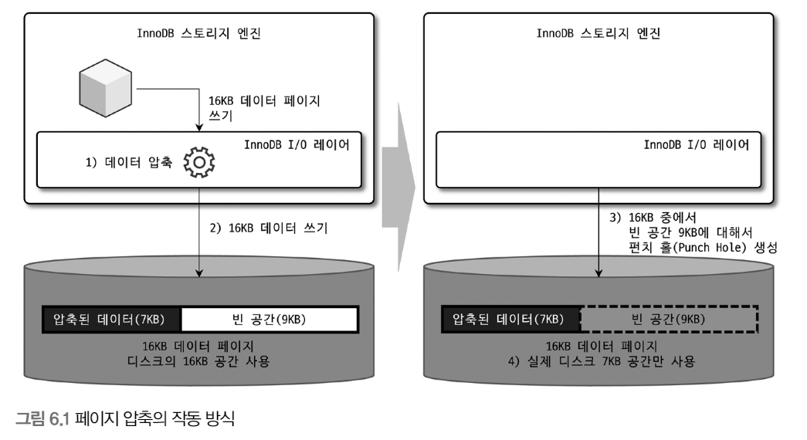
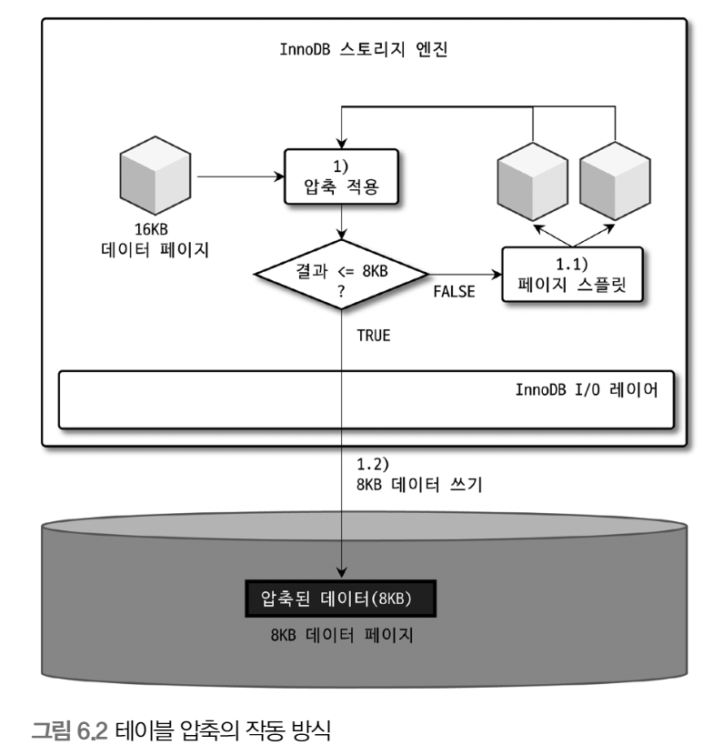
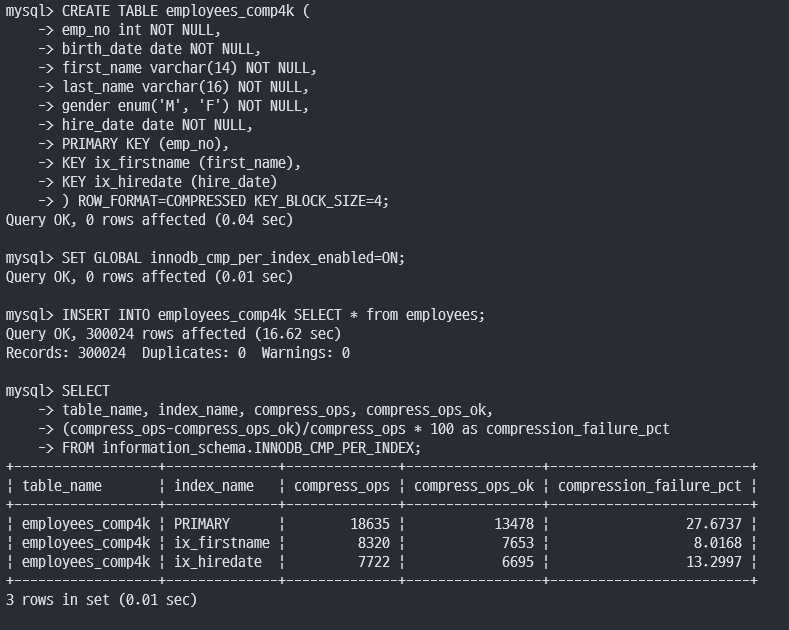

# 6장. 데이터 압축

MySQL 서버에서 디스크에 저장된 데이터 파일의 크기는 일반적으로 쿼리의 처리 성능과도 직결되지만 백업 및 복구 시간과도 밀접한 연관

데이터 파일이 크면 백업 시간이 오래 걸리며, 복구하는 데도 그만큼의 시간이 걸림

이런 문제를 해결하기 위해 데이터 압축 기능 제공

<br>

## 페이지 압축

MySQL 서버가 디스크에 저장하는 시점에 데이터 페이지가 압축되어 저장되고, 반대로 MySQL 서버가 디스크에서 데이터 페이지를 읽어올 떄 압축이 해제

`즉, 버퍼 풀에 데이터 페이지가 한 번 적재되면 InnoDB 스토리지 엔진은 압축이 해제된 상태로만 데이터 페이지를 관리`

하지만 적어도 하나의 테이블은 동일한 크기의 페이지(블록)로 통일돼야 한다는 것

그래서 페이지 압축 기능은 운영체제별 특정 버전의 파일 시스템에서만 지원되는 펀치 홀 기능을 사용

<br>

운영체제의 블록 사이즈가 512바이트인 경우 아래와 같이 작동

<br>

<p align="center"></p>


```
1. 16KB 페이지를 압축 (압축 결과를 7KB로 가정)

2. MySQL 서버는 디스크에 압축된 결과 7KB를 기록
(이 때 MySQL 서버는 압축 데이터 7KB에 9KB의 빈 데이터를 기록)

3. 디스크에 데이터를 기록한 후, 7KB 이후의 공간 9KB에 대해 펀치 홀을 생성

4. 파일 시스템은 7KB만 남기고 나머지 디스크의 9KB 공간은 다시 운영체제로 반납
```

<br>

하지만 펀치 홀 기능은 운영체제뿐만 아니라 하드웨어 자체에서도 해당 기능을 지원해야 사용 가능 + 파일 시스템 관련 명령어가 펀치 홀을 지원 X

이런 이유로 페이지 압축은 많이 사용되지 않는 상태

<br>

## 테이블 압축

운영체제나 하드웨어에 대한 제약 없이 사용할 수 있기 때문에 더 활용도가 높음

테이블 압축의 단점

- 버퍼 풀 공간 활용률이 낮음

- 쿼리 처리 성능이 낮음

- 빈번한 데이터 변경 시 압축률이 떨어짐

<br>

해당 단점들은 내부적으로 어떻게 압축이 실행되어 디스크에 저장되는지, 압축된 데이터 페이지들이 버퍼 풀에 어떻게 적재되어 사용되는지를 이해해야 함

<br>

### 압축 테이블 생성

테이블 압축을 사용하기 위한 전제 조건은 압축을 사용하려는 테이블이 별도의 테이블 스페이스를 사용해야 함

```
mysql> SET GLOBAL innodb_file_per_table=ON;

## ROW_FORMAT 옵션과 KEY_BLOCK_SIZE 옵션을 명시
mysql> CREATE TABLE compressed_table (
        c1 INT PRIMARY KEY
        )
        ROW_FORMAT=COMPRESSED
        KEY_BLOCK_SIZE=8;

## KEY_BLOCK_SIZE 옵션만 명시
mysql> CREATE TABLE compressed_table (
        c1 INT PRIMARY KEY
        )
        KEY_BLOCK_SIZE=8;
```

<br>

압축 적용에 사용되는 KEY_BLOCK_SIZE 옵션은 압축된 페이지가 저장될 페이지의 크기를 지정

예를 들어, 데이터 페이지(블록) 크기가 16KB, KEY_BLOCK_SIZE가 8이라면

데이터 페이지를 압축한 용량이 얼마가 될지 알 수 없는데, 어떻게 KEY_BLOCK_SIZE를 테이블을 생성할 때 설정할 수 있을까?

<br>

InnoDB 스토리지 엔진이 압축을 적용하는 방법

<br>

<p align="center"></p>

```
1. 16KB의 데이터 페이지를 압축
    1.1 압축된 결과가 8KB 이하이면 그대로 디스크에 저장(압축 완료)
    1.2 압축된 결과가 8KB를 초과하면 원본 페이지를 스플릿해서 2개의 페이지에 8KB씩 저장

2. 나뉜 페이지 각각에 대해 1번 단계를 반복 실행
```

`테이블 압축 방식에서 가장 중요한 것은 데이터 페이지의 압축 결과가 목표 크기(KEY_BLOCK_SIZE)보다 작거나 같을 때까지 반복해서 페이지를 스플릿하는 것`

<br>

### KEY_BLOCK_SIZE 결정

압축된 결과가 어느 정도가 될 지를 예측해서 KEY_BLOCK_SIZE를 결정하는 것이 중요

<br>

<p align="center"></p>

```
1. employees 테이블과 동일한 구조로 테이블 압축을 사용하는 예제 테이블 생성

2. 테스트 실행 전 inno_db_cmp_per_index_enabled 시스템 변수를 ON으로 변경해야 인덱스별로 압축 실행 횟수와 성공 횟수가 기록

3. employees 테이블의 데이터를 그대로 압축 테스트 테이블로 저장

4. 인덱스별로 압축 횟수와 성공 횟수, 압축 실패율 조회
```

마지막 부분을 보면 압축된 테이블의 PK는 18635번 압축을 실행했는데 그중 13478번 성공

즉, 5175번 압축했는데 압축의 결과가 4KB를 초과해서 데이터 페이지를 스플릿해서 다시 압축을 실행했다는 의미

<br>

### 압축된 페이지의 버퍼 풀 적재 및 사용

InnoDB 엔진은 압축된 테이블의 데이터 페이지를 버퍼 풀에 적재하면 압축된 상태와 압축이 해제된 상태 2개 버전을 관리

그래서 그대로 상태의 데이터 페이지 목록을 관리하는 LRU와 압축된 페이지들의 압축 해제 버전인 Unzip_LRU 리스트를 별도 관리

<br>

결국 InnoDB는 압축된 테이블에 대해서는 버퍼 풀 공간을 이중을 사용함으로써 메모리를 낭비

또 다른 문제는 압축된 페이지에서 데이터를 읽거나 변경하기 위해서 압축을 해제해야 한다는 것인데 압축은 CPU를 많이 소모하는 작업

<br>

이런 두 가지 단점을 보완하기 위해 Unzip_LRU 리스트를 별도로 관리하고 있다가 요청 패턴에 따라 적절히 처리를 수행

    1. InnoDB 버퍼 풀의 공간이 필요한 경우 LRU 리스트에서 원본 데이터 페이지는 유지, Unzip_LRU 리스트에서 압축 헤제된 버전은 제거

    2. 압축해제된 데이터 페이지가 자주 사용되는 경우에는 Unzip_LRU 리스트에 압축 해제된 페이지를 계속 유지하면서 압축 작업을 최소화

    3. 압축된 데이터가 페이지가 사용되지 않아서 LRU 리스트에서 제거되는 경우 Unzip_LRU 리스트에서도 함께 제거

<br>

InnoDB는 버퍼 풀에서 압축 해제된 버전의 데이터 페이지를 적절한 수준으로 유지하기 위해 다음과 같은 어댑티브 알고리즘 사용

- CPU 사용량이 높은 서버에서는 압축을 피하기 위해 Unzip_LRU 비율을 높여서 유지

- Disk IO 사용량이 높은 서버는 Unzip_LRU 리스트의 비율을 낮춰서 InnoDB 버퍼 풀의 공간을 더 확보