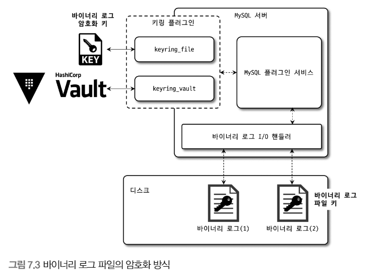

# 7장. 데이터 암호화

데이터 암호화 기능은 처음에는 데이터 파일에 대해서만 암호화 기능이 제공

현재는 리두 로그, 언드 로그, 바이너리 로그 등 모두 암호화 지원


핀테크 서비스처럼 중요한 정보를 저장하는 서비스에서는 응용 프로그램에서 암호화한 데이터를 DB 서버에서 다시 암호화하는 이중 암호화 방법을 선택

## MySQL 서버의 데이터 암호화

<br>

<p align="center"></p>

데이터베이스 서버와 디스크 사이의 데이터 읽고 쓰기 지점에서 암호화 or 복호화를 수행

`즉, MysQL 서버(InnoDB 스토리지 엔진)의 I/O 레이어에서만 암호화 및 복호화가 실행`

<br>

암호화 기능이 있고 없고 동일한 처리 과정을 거치기에 사용자의 쿼리를 처리하는 과정에서 암호화 여부를 확인할 필요가 없음

해당 방식을 TDE(Transparent Data Encryption)라고 함

<br>

### 2단계 키 관리

TDE에서 암호화 키는 키링 플러그인에 의해 관리되며, 커뮤니티 에디션에서는 keyring_file 플러그인을 사용 가능

키링 플러그인은 2단계(2-Tier) 키 관리 방식을 사용

<br>

<p align="center"></p>

MySQL 서버의 데이터 암호화는 마스터 키와 테이블스페이스 키(프라이빗 키) 두가지 키를 가지고 있음

HashiCorp Vault 같은 외부 키 관리 솔루션(KMS, Key Management Service) 또는 디스크의 파일 플러그인에서 마스터 키를 가져오고, 

암호화된 테이블이 생성될 떄마다 해당 테이블을 위한 임의의 테이블스페이스 키를 발급

그리고 마스터 키를 이용해 테이블스페이스 키를 암호화해서 각 테이블의 데이터 파일 헤더에 저장

```
즉, 

마스터 키 -> 테이블 스페이스 키 암호화

암호화된 테이블스페이스 키 -> 테이블의 데이터 파일 헤더
```

테이블스페이스 키는 외부 노출 X

마스터 키는 외부 노출 가능성 -> 주기적으로 변경

마스터 키를 변경하면 테이블스페이스 키를 복호화 후 새로운 마스터 키로 다시 암호화

<br>

TDE에 지원되는 암호화 알고리즘은 AES 256비트

<br>

### 암호화와 성능

TDE 방식이기에 디스크로부터 한 번 읽은 데이터 페이지는 복호화되어 InnoDB의 버퍼 풀에 적재

`그래서 데이터 페이지가 한 번 메모리에 적재되면 암호화되지 않은 테이블과 동일한 성능`

하지만 존재하지 않는 데이터 페이지를 읽거나 변경된 테이블이 디스크로 다시 동기화될 때 등 복호화, 암호화 지연이 발생

<br>

같은 테이블에 대해 암호화와 압축이 동시에 적용되면?

압축 -> 암호화

이유

- 암호화된 결과문은 압축률이 떨어짐

<br>

### 암호화와 복제

레플리카 서버는 소스 서버의 모든 사용자 데이터를 동기화하기 때문에 실제 데이터 파일도 동일할 것이라 생각할 수 있지만, TDE를 이용한 암호화 사용 시 마스터 키와 테이블스페이스 키는 X

`즉, 소스 서버와 레플리카 서버의 마스터 키와 테이블스페이스 키는 다름`

```
MySQL 레플리케이션은 데이터베이스에서 확장성과 가용성을 향상시키기 위해 사용되는 기술입니다. 

이를 이해하기 위해 먼저 소스 서버와 레플리카 서버에 대해 알아보겠습니다.


소스(Source) 서버:

소스 서버는 트래픽을 받아내는 원본 데이터베이스 서버입니다.

데이터 변경 요청(INSERT, UPDATE, DELETE 등)이 소스 서버로 들어옵니다.

소스 서버의 바이너리 로그에 이벤트가 기록됩니다.


레플리카(Replica) 서버:

레플리카 서버는 소스 서버의 데이터를 복제하는 서버입니다.

복제된 데이터는 읽기 성능 개선, 백업, 데이터 분석, 지리적 분산 등 다양한 목적으로 활용됩니다.

레플리카 서버는 소스 서버의 바이너리 로그를 읽어 데이터를 동기화합니다.


레플리카 서버가 필요한 이유:

읽기 성능 향상: 레플리카 서버를 통해 읽기 요청을 분산시킬 수 있습니다.

백업 및 복구: 레플리카 서버는 소스 서버의 데이터를 백업으로 활용할 수 있습니다.

지리적 분산: 레플리카 서버를 다른 지역에 배치하여 가용성을 높일 수 있습니다.
```

<br>

## keyring_file 플러그인 설치

keyring_file 플러그인은 마스터 키를 디스크의 파일로 관리

TDE 플러그인은 서버가 시작되는 단계에서도 가장 빨리 초기화돼야 함

<br>

## 테이블 암호화

키링 플러그인은 마스터 키를 생성하고 관리하는 부분만 담당하기에 어떤 키링 플러그인을 사용하든 암호화된 테이블을 생성하고 활용하는 방법은 동일

<br>

### 응용 프로그램 암호화와의 비교

응용 프로그램에서 암호화해서 MySQL 서버에 저장한는 경우는 칼럼의 값이 이미 암호화된 것인지 인지 불가

그래서 해당 칼럼은 인덱스를 생성하더라도 인덱스의 기능을 100% 활용 X

범위 검색, 상위 10개 값 등 사용 불가

<br>

### 테이블스페이스 이동

Export & Import 기능이 레코드를 덤프했다가 복구하는 방식보다 훨씬 효율적이며 빠름

TDE 적용 테이블이라면 마스터 키까지 고려

<br>

## 언두 로그 및 리두 로그 암호화

테이블의 데이터 파일 이외의 디스크에 기록되는 경우에는 평문으로 저장되기에 리두 로그, 언두 로그, 복제를 위한 바이너리 로그는 평문으로 저장됨

그래서 리두 로그와 언두 로그를 암호화된 상태로 저장할 수 있게 8.0 버전에서 제공

리두 로그와 언두 로그 데이터 모두 테이블스페이스 키로 암호화(두 로그를 위한 프라이빗 키가 따로 존재)

<br>

## 바이너리 로그 암호화

바이너리 로그는 의도적으로 오랜 시간 보관하는 경우가 있기에 암호화가 중요할 때가 있음

<br>

<p align="center"></p>

