# 8장. 인덱스

인덱스는 쿼리의 성능을 언급하면서 뺴놓을 수 없는 부분

각 인덱스의 특성과 차이는 상당히 중요, 물리 수준의 모델링을 할 때에도 중요한 요소


## 디스크 읽기 방식

데이터 저장 매체(디스크)는 컴퓨터에서 가장 느린 부분

DB 성능 튜닝은 어떻게 디스크 I/O를 줄이느냐가 관건

<br>

### 하드 디스크 드라이브(HDD)와 솔리드 스테이트 드라이브(SSD)

CPU나 메모리는 대부분 전자식 장치이지만, HDD는 기계식 장치

그래서 DB 서버에서는 항상 디스크 장치가 병목

HDD를 대체하기 위해 전자식 저장 매체 SSD가 출시

<br>

SSD는 저장용 플래터(원판)을 제거하고 플래시 메모리를 장착하고 있기에 빨리 데이터를 읽을 수 있음

<br>

<p align="center"></p>

<br>

`디스크 헤더를 움직이지 않고 한 번에 많은 데이터를 읽는 순차 I/O에서는 SSD가 HHD보다 조금 빠르거나 거의 비슷하지만, 랜덤 I/O는 훨씬 빠름`

대부분 DB 서버의 작업은 랜덤 I/O이기에 SSD는 DBMS에 최적

<br>

### 랜덤 I/O와 순차 I/O

랜덤 I/O는 HDD의 플래터를 돌려서 읽어야 할 데이터가 저장된 위치로 디스크 헤더를 이동시킨 다음 데이터를 읽는 것

<p align="center"></p>

<br>

해당 그림을 보면 순차 I/O는 1번 시스템 콜을 요청, 랜덤 I/O는 3번 시스템 콜을 요청

`즉, 디스크의 성능은 디스크 헤더의 위치 이동 없이 얼마나 많은 데이터를 한 번에 기록하느냐에 결정`

DB 대부분의 작업은 랜덤 I/O 작업이 빈번하기에 MySQL은 그룹 커밋, 바이너리 로그 버퍼, InnoDB 로그 버퍼 등의 기능이 내장

디스크 원판이 없는 SSD도 랜덤 I/O와 순차 I/O가 차이가 있음

<br>

일반적으로 쿼리를 튜닝하는 것은 랜덤 I/O 자체를 줄여주는 것이 목적

`랜덤 I/O를 줄인다는 것은 쿼리를 처리하는데 꼭 필요한 데이터만 읽도록 쿼리를 개선하는 것을 의미`

인덱스 레인지 스캔은 랜덤 I/O, 풀 테이블 스캔은 순차 I/O

<br>

## 인덱스란?

칼럼의 값과 해당 레코드가 저장된 주소를 키-값 쌍으로 삼아 인덱스를 만듬

그렇기에 중요한 것이 정렬

<br>

인덱스는 SortedList, 데이터 파일은 ArrayList와 비슷

<br>

SortedList의 장단점을 통해 인덱스의 장단점 살펴보기

SortedList 자료 구조는 데이터가 저장될 때마다 값을 항상 정렬해야 하므로 저장하는 과정이 복잡하고 느리지만, 빠르게 원하는 값을 찾아올 수 있음

인덱스도 마찬가지로 INSERT나 UPDATE, DELETE 문장 처리가 느리지만 SELECT는 빠름

`즉, 인덱스는 데이터의 저장(INSERT, UPDATE, DELETE) 성능을 희생하고 읽기 속도를 높이는 기능`

<br>

데이터 저장 방식(알고리즘)으로 분류했을 때 대표적으로 B-Tree 인덱스와 Hash 인덱스로 구분 가능

B-Tree 알고리즘

- 가장 일반적으로 사용되는 인덱스 알고리즘

- 칼럼의 값을 변형하지 않고 원래의 값을 이용해 인덱싱하는 알고리즘

Hash 알고리즘

- 칼럼의 값으로 해시값을 계산해서 인덱싱하는 알고리즘

- 매우 빠른 검색 지원

- 값을 변형해서 인덱싱하므로 전방 일치와 같이 값의 일부만 검색하거나 범위를 탐색할 때는 해시 탐색 불가

- 메모리 기반 데이터 베이스(Redis 등)에서 사용


<br>

데이터 중복 여부로 분류했을 때 유니크 인덱스와 유니크하지 않은 인덱스로 구분 가능

이는 옵티마이저에게 상당히 중요한 문제가 됨

유니크 인덱스에 대해서 동등 조건으로 검색하는 것은 항상 1건의 레코드를 반환하는 것이지만 유니크하지 않은 인덱스는 아님

<br>

## B-Tree 인덱스

B-Tree의 B는 Binary가 아닌 Balanced

대부분의 인덱스는 B-Tree를 사용할 정도로 일반적인 용도에 적합한 알고리즘

<br>

### 구조 및 특성

B-Tree는 트리 구조의 `최상위에 하나의 루트 노드`가 존재하고 하위에 자식 노드가 붙어 있는 형태

가장 `하위에 있는 노드를 리프 노드`라 하고 `중간 노드를 브랜치 노드`라고 함


<p align="center"></p>

<br>

인덱스 키 값은 모두 정렬되어 있지만, 데이터 파일의 레코드는 임의의 순서로 저장되어 있음

많은 사람들이 데이터 파일의 레코드는 INSERT된 순서대로 저장되는 것으로 생각하지만 그렇지 않음

레코드가 삭제되면 그 공간을 채우기 때문에 항상 INSERT된 순서로 저장되는 것은 아님

<br>

<p align="center"></p>

<br>

<p align="center"></p>

<br>

리프 노드는 레코드의 주소를 갖고 있고 그 주소로 데이터 파일에서 원하는 데이터를 찾음

InnoDB는 프라이머리 키가 ROWID 역할을 함

두 스토리지 엔진의 차이는 세컨더리 인덱스의 차이

MyISAM은 세컨더리 인덱스가 물리적 주소

InnoDB는 PK 키를 주소처럼 사용하기에 논리적 주소

<br>

8.6을 봤을 때 프라이머리 키를 저장하고 있는 B-Tree를 다시 한번 검색하게 됨

이것은 성능이 떨어질 것처럼 보이지만 사실은 아님

<br>

### B-Tree 인덱스 키 추가 및 삭제

테이블의 레코드를 저장하거나 변경하는 경우 인덱스 키 추가나 삭제 작업 발생

인덱스 키 추가나 삭제가 어떻게 처리되는지 알아보자

<br>

### 인덱스 키 추가

새로운 키 값이 B-Tree에 저장될 때, 테이블의 스토리지 엔진에 따라 새로운 키 값이 즉시 인덱스에 저장될수도 아닐수도 있음

B-Tree에 저장될 때는 저장될 키 값을 이용해 B-Tree 상의 적절한 위치를 검색

<br>

저장될 위치가 결정되면 레코드의 키 값과 대상 레코드의 주소 정보를 B-Tree의 리프 노드에 저장

리프 노드가 꽉 차서 더는 저장할 수 없을 때는 리프 노드가 분리돼야 하는데, 이는 상위 브랜치 노드까지 처리의 범위가 넓어짐

`이런 작업 순서 탓에 B-Tree는 상대적으로 쓰기 작업에 비용이 많이 듬`

<br>

테이블에 레코드를 추가하는 작업 비용을 1이라고 가정하면,

해당 테이블의 인덱스에 키를 추가하는 작업 비용은 대충 1.5 정도로 예측

<br>

MyISAM이나 MEMORY 스토리지 엔진을 사용하는 테이블에서는 INSERT 문장이 실행되면 즉시 새로운 키 값을 B-Tree 인덱스에 변경

InnoDB는 지연시켜 나중에 처리할 수 있음

But, PK 키나 Unique 인덱스의 경우 중복 체크가 필요하기 때문에 즉시 B-Tree에 추가하거나 삭제

<br>

### 인덱스 키 삭제

해당 키 값이 저장된 B-Tree의 리프 노드를 찾아서 삭제 마킹하면 작업 완료

삭제 마킹된 인덱스 키 공간은 방치하거나 재활용 가능

<br>

### 인덱스 키 변경

인덱스 키 값은 그 값에 따라 저장될 리프 노드의 위치가 결정되므로 B-Tree의 키 값이 변경되는 경우 단순히 인덱스 상의 키 값만 변경하는 것은 불가능

키 값 삭제 -> 다시 새로운 키 값 추가

InnoDB는 체인지 버퍼를 활용해 지연 처리 가능

<br>

### 인덱스 키 검색

`빠른 검색을 위해 추가 비용을 감당하면서 인덱스를 구축`

B-Tree의 루트 노드부터 브랜치 노드, 최종 리프 노드까지 이동하면서 비교 작업을 수행하는 과정을 트리 탐색이라고 함

SELECT 뿐 아니라 UPDATE, DELETE 처리할 때도 사용

<br>

B-Tree 인덱스 검색은 100% 일치 또는 값의 앞부분만 일치하는 경우에도 사용

하지만 뒷부분만 검색하는 용도로는 X

또한 인덱스 키 값의 변형이 생긴 후 비교되는 경우에는 절대로 빠른 검색 기능을 사용할 수 없음

`따라서 함수나 연산을 수행한 결과로 정렬한다거나 검색하는 작업은 B-Tree의 장점을 이용할 수 없음`

<br>

InnoDB 테이블에서 지원하는 레코드 잠금이나 넥스트 키락(갭락)이 검색을 수행한 인덱스를 잠근 후 테이블의 레코드를 잠그는 방식으로 구현

따라서, UPDATE나 DELETE 문장이 실행될 때 적절히 사용할 수 있는 인덱스가 없으면 불필요한 레코드들을 잠금

그만큼 InnoDB에서는 인덱스의 설계가 중요하고 많은 부분에 영향을 미침

<br>

### B-Tree 인덱스 사용에 영향을 미치는 요소

B-Tree 인덱스는 인덱스를 구성하는 칼럼의 크기, 레코드의 건수, 유니크한 인덱스 키 값의 개수 등에 의해 검색이나 변경 작업의 성능이 영향을 받음

<br>

### 인덱스 키 값의 크기

`InnoDB에서 디스크에 데이터를 저장하는 가장 기본 단위는 페이지 or 블록`

디스크의 모든 읽기 및 쓰기 작업의 최소 작업 단위

페이지는 버퍼 풀에서 데이터를 버퍼링하는 기본 단위

인덱스도 페이지 단위로 관리되며, 루트, 브랜치, 리프 노드를 구분한 기준이 페이지 단위

<br>

B-Tree의 B는 Balanced

인덱스 페이지 크기와 키 값 크기에 따라 자식 노드의 갯수가 결정

<p align="center">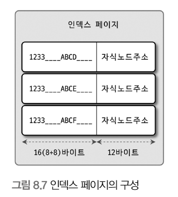</p>

<br>

해당 그림에서 하나의 인덱스 페이지(16KB)에 몇 개 키를 저장할 수 있을까?

키의 값이 16 바이트, 자식 노드 주소가 12 바이트

16 * 1024 / 16 + 12 ( 킬로바이트와 바이트의 단위 변환 때문에 1024를 곱함 ) 

총 585개 저장 가능

자식 노드를 585개 가질 수 있는 B-Tree


<br>

### B-Tree 깊이

인덱스 키 값이 커지면 하나의 인덱스 페이지가 담을 수 있는 인덱스 키 값의 개수가 적어지고

B-Tree 깊이가 깊어져서 디스크로부터 읽어야 하는 횟수가 늘어나고 느려진다는 것을 의미

<br>

### 선택도(기수성(Cardinality))

모든 인덱스 키 값 가운데 유니크한 값의 수를 의미

인덱스 키 값 가운데 중복된 값이 많아지면 기수성은 낮아지고, 선택도 또한 떨어짐

<br>

예를 들어, country 컬럼만 인덱스로 준비되어 있는 tb_city 테이블은 1만 건의 레코드가 있음

국가와 도시가 중복되어 저장되어 있지 않음

```
mysql > SELECT *
        FROM tb_test
        WHERE country = 'KOREA' AND city = 'SEOUL';
```

해당 쿼리를 실행했을 때,

country 컬럼의 유니크 값이 10개일 때와 1000개일 때를 비교해보자

- 10개일 때

    country = 'KOREA'라는 조건으로 인덱스를 검색하면 1000건이 일치하고 1000건 가운데 city = 'SEOUL' 인 레코드는 1건이므로 999건은 불필요하게 읽은 것 


- 1000개일 때

    country = 'KOREA'라는 조건으로 인덱스를 검색하면 10건이 일치하고 10건 가운데 city = 'SEOUL' 인 레코드는 1건이므로 9건은 불필요하게 읽은 것


이처럼 인덱스에서 유니크한 값의 개수는 인덱스나 쿼리의 효율성에 큰 영향

<br>

### 읽어야 하는 레코드의 건수

일반 옵티마이저는 인덱스를 통해 레코드 1건을 읽는 것이 테이블에서 직접 레코드 1건을 읽는 것보다 4 ~ 5배 비용이 더 많이 드는 작업으로 예측


즉, 인덱스를 통해 읽어야 할 레코드의 건수가 전체 테이블 레코드의 20 ~ 25%를 넘어서면 인덱스를 이용하지 않는 것이 효율적

<br>

### B-Tree 인덱스를 통한 데이터 읽기

MySQL이 인덱스를 이용하는 대표적인 방법 세가지

- 인덱스 레인지 스캔

- 인덱스 풀 스캔

- 루스 인덱스 스캔

### 인덱스 레인지 스캔

인덱스 레인지 스캔은 나머지 두 가지 접근 방식보다 빠른 방법

```
mysql > SELECT * FROM employees WHERE first_name BETWEEN 'Ebbe' AND 'Gad';
```

<p align="center">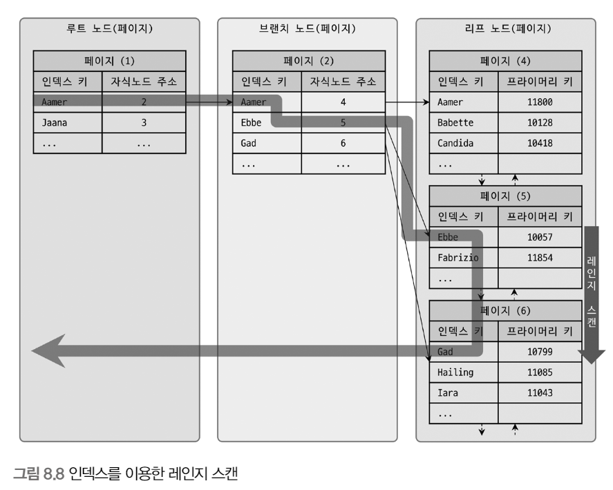</p>

<br>

인덱스 레인지 스캔은 검색해야 할 인덱스의 범위가 결정됐을 때 사용하는 방식

루트 노드 -> 브랜치 노드 -> 리프 노드 까지 가야 필요한 레코드의 시작 지점을 찾을 수 있음

스캔하다가 리프 노드의 끝까지 읽으면 리프 노드 간의 링크를 이용해 다음 리프 노드를 찾아서 다시 스캔

<p align="center">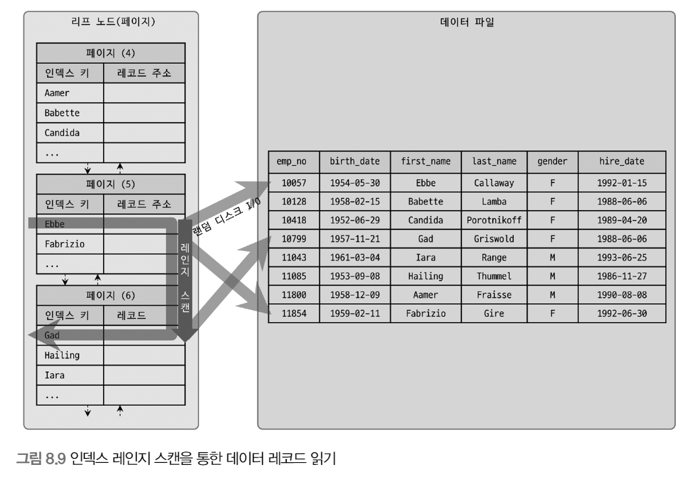</p>

<br>

실제 데이터 파일의 레코드를 읽어오는 과정

루트와 브랜치 노드를 이용해 스캔 시작 위치를 검색하고 그 지점부터 필요한 방향으로 인덱스를 읽어감

중요한 것은 어떤 방식으로 스캔하든 관계없이, 해당 인덱스를 구성하는 칼럼의 정순 또는 역순으로 정렬된 상태로 레코드를 가져옴

별도의 정렬 과정이 수반되는 것이 아니라 인덱스 자체의 정렬 특성 때문에 자동임

<br>

인덱스의 리프 노드에서 검색 조건에 일치하는 건들은 데이터 파일에서 레코드를 읽어오는 과정이 필요

리포 노드에 저장된 레코드 주소로 한 건 단위로 랜덤 I/O가 일어남

`그래서 인덱스를 통해 데이터 레코드를 읽는 작업은 비용이 많이 드는 작업`

<br>

인덱스 레인지 스캔의 3가지 단계

1. 인덱스에서 조건을 만족하는 값이 저장된 위치를 찾음 (인덱스 탐색)

2. 탐색된 위치부터 필요한 만큼 인덱스를 차례대로 읽음 (인덱스 스캔)

3. 2번에서 읽은 인덱스 키와 레코드 주소를 이용해 레코드가 저장된 페이지를 가져오고 최종 레코드를 읽어옴

<br>

### 인덱스 풀 스캔

인덱스 풀 스캔은 인덱스의 처음부터 끝까지 모두 읽는 방식

쿼리의 조건절에 사용된 칼럼이 인덱스의 첫 번째 칼럼이 아닌 경우 인덱스 풀 스캔 방식 사용

예를 들어 인덱스는 A, B, C 칼럼의 순서로 만들어져 있지만 쿼리의 조건절은 B 칼럼이나 C 칼럼으로 검색하는 경우

<br>

일반적으로 인덱스의 크기는 테이블의 크기보다 작으므로 직접 테이블을 처음부터 끝까지 읽는 것보다 인덱스만 읽는 것이 효율적

쿼리가 인덱스에 명시된 칼럼만으로 조건을 처리할 수 있는 경우 사용

<p align="center">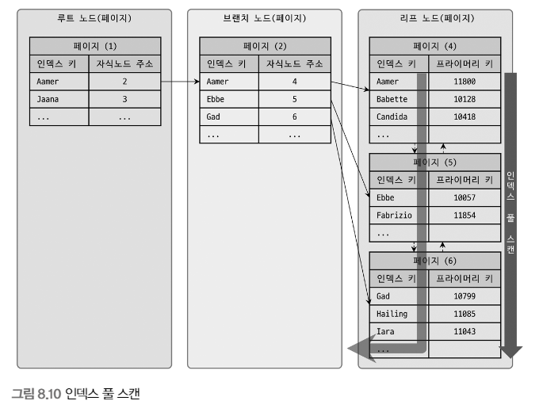</p>

<br>

인덱스 리프 노드의 제일 앞 또는 뒤로 이동후 인덱스의 리프 노드를 연결하는 링크드 리스트를 따라서 처음부터 끝까지 스캔하는 방식

인덱스 레인지 스캔보다 빠르진 않지만 테이블 풀 스캔보다는 효율적

`하지만, 해당 방식으로 인덱스를 사용하는 경우는 인덱스를 효율적으로 사용하지 못하는 것`

<br>

### 루스 인덱스 스캔

듬성듬성하게 인덱스는 읽는 것, 중간에 필요치 않은 인덱스 키 값은 무시하고 다음으로 넘어가는 형태

일반적으로 GROUP BY 또는 MAX, MIN 함수에 대해 최적화를 하는 경우

<p align="center">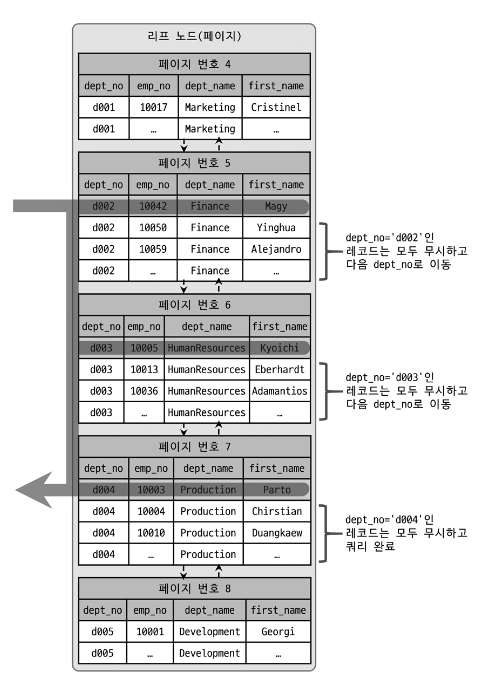</p>

<br>

```
mysql > SELECT dept_no, MIN(emp_no)
        FROM dept_emp
        WHERE dep_no BETWEEN 'd002' AND 'd004'
        GROUP BY dept_no;
```

dept_emp 테이블은 dept_no와 emp_no 두 개의 컬럼으로 인덱스 생성

또한, (dept_no, emp_no) 조합으로 정렬까지 되어 있음

위의 그림과 같이 dept_no 그룹 별로 첫 번째 레코드의 emp_no만 읽으면 됨

즉, 인덱스에서 WEHRE 조건을 만족하는 범위 전체를 다 스캔할 필요가 없다는 것을 옵티마이저는 알고 있기에 조건에 맞지 않으면 SKIP

<br>

### 인덱스 스킵 스캔

인덱스의 핵심은 값이 정렬되어 있다는 것, 이로 인해 인덱스를 구성하는 칼럼의 순서가 매우 중요

```
### 인덱스 생성
mysql > ALTER TABLE employees
        ADD INDEX ix_gender_birthdate (gender, birth_date);
```

```
### 인덱스를 사용하지 못하는 쿼리
mysql > SELECT * FROM employees WHERE birth_date>='1965-02-01';

### 인덱스를 사용할 수 있는 쿼리
mysql > SELECT * FROM employees WHERE gender = 'M' AND birth_date>='1965-02-01';
```

MySQL 8.0부터는 옵티마이저가 gender 칼럼을 건너뛰고 bith_date 칼럼만으로도 인덱스 검색이 가능하게 해주는 인덱스 스킵 스캔 최적화 기능이 도입

<p align="center">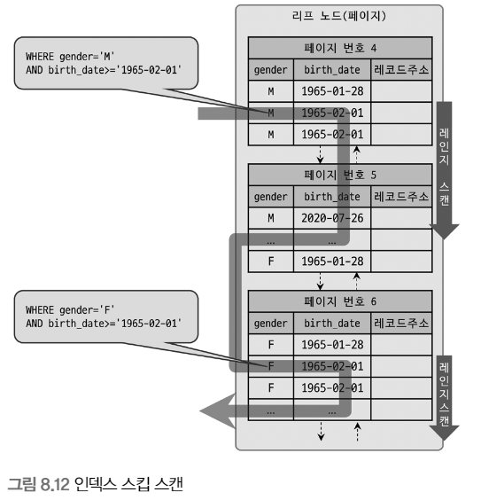</p>

<br>

gender 칼럼에 대해 가능한 값 2개를 구한 다음 birth_date를 찾는 방식으로 

<br>

인덱스 스킵 스캔의 단점

- WHERE 조건절에 조건이 없는 인덱스의 선행 칼럼의 유니크한 값의 개수가 적어야 함

- 쿼리가 인덱스에 존재하는 칼럼만으로 처리 가능해야 함(커버링 인덱스)


<br>

첫 번째 조건은 쿼리 실행 계획의 비용과 관련된 부분

유니크한 값의 개수가 매우 많다면 인덱스에서 스캔해야 할 시작 지점을 검색하는 작업이 많이 필요해짐

그래서 인덱스의 선행 칼럼이 가진 유니크한 값의 개수가 소량일 때만 적용 가능한 최적화

<br>

### 다중 칼럼 인덱스

실제 서비스용 DB에서는 2개 이상의 칼럼을 포함하는 인덱스가 더 많이 사용

<p align="center">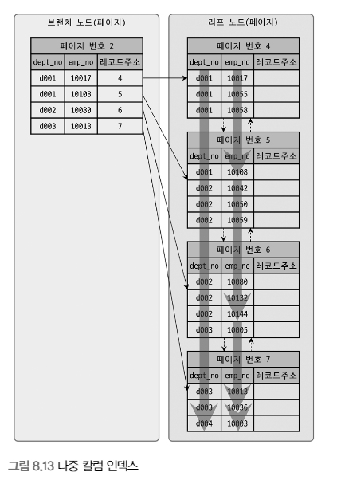</p>

<br>

해당 그림에서 인덱스의 두 번째 칼럼은 첫 번쨰 칼럼에 의존해서 정렬되어 있음

그렇기에 두 번째 칼럼의 정렬 순서가 앞에 있어도 첫 번째 칼럼의 정렬 순서가 뒤에 있으면 하단에 위치

`그래서 다중 칼럼 인덱스에서는 인덱스 내에서 각 칼럼의 순서가 상당히 중요`

<br>

### B-Tree 인덱스의 정렬 및 스캔 방향

인덱스를 어느 방향으로 읽을지는 쿼리에 따라 옵티마이저가 만든 실행 계획에 따라 결정

<br>

### 인덱스 스캔 방향

```
mysql > SELECT *
        FROM employees
        ORDER BY first_name DESC
        LIMIT 1;
```
해당 쿼리를 실행하기 위해 인덱스를 처음부터 오름차순으로 끝까지 읽어 마지막 값을 하나 가져올까?

답은 No

옵티마이저는 인덱스를 역순으로 접근해서 첫 번째 레코드만 읽음

<p align="center">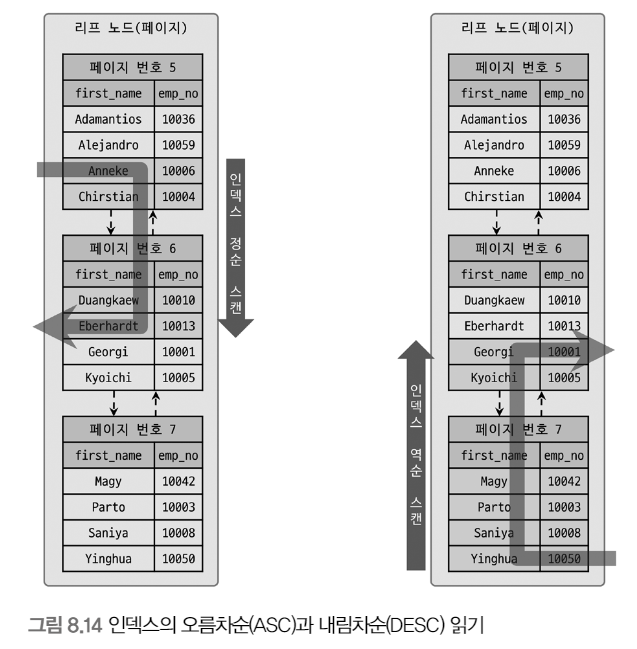</p>

<br>

즉, 인덱스 생성 시점에 오름차순, 내림차순으로 정렬이 결정되지만 사용하는 시점에서 방향을 다시 정함

<br>

### 내림차순 인덱스

2개 이상의 칼럼으로 구성된 복합 인덱스에서 내림차순과 오름차순이 혼합된 경우, 내림차순 인덱스로만 해결 가능

<p align="center">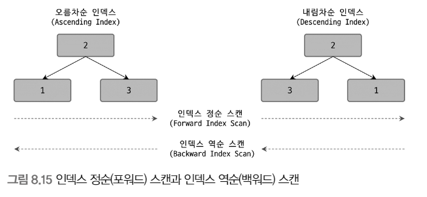</p>

<br>

- 오름차순 인덱스

    작은 값의 인덱스 키가 B-Tree의 왼쪽으로 정렬된 인덱스

- 내림차순 인덱스

    큰 값의 인덱스 키가 B-Tree의 왼쪽으로 정렬된 인덱스

- 인덱스 정순 스캔

    인덱스 키의 크고 작음에 관계 없이 인덱스 리프 노드의 왼쪽 페이지부터 오른쪽으로 스캔

- 오름차순 인덱스

    인덱스 키의 크고 작음에 관계 없이 인덱스 리프 노드의 오른쪽 페이지부터 왼쪽으로 스캔

### 실습

<p align="center">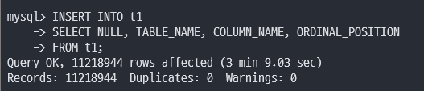</p>

<br>

<p align="center">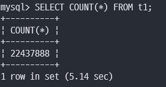</p>

<br>

약 2200만 개의 레코드가 들어 있는 테이블 생성


<p align="center">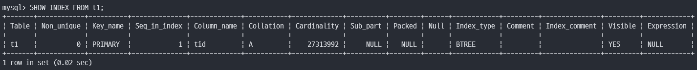</p>

<br>

<p align="center">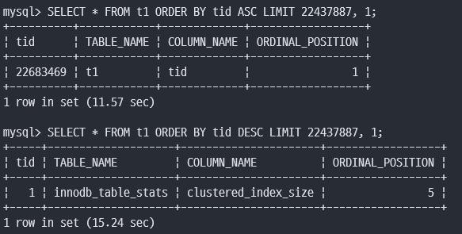</p>

<br>

첫번째 쿼리

- t1 테이블에서 tid 컬럼을 기준으로 오름차순 정렬한 후, 22437887번째 행의 모든 열 값 1개를 반환

- 즉, 22437887번째 값

<br>

두번째 쿼리

- t1 테이블에서 tid 컬럼을 기준으로 내림차순 정렬한 후, 22437887번째 행의 모든 열 값 1개를 반환

- 즉, 첫번째 값

<br>

역순 정렬 쿼리가 정순 정렬 쿼리보다 약 3.7초 더 걸림

정순 스캔과 역순 스캔은 페이지(블록) 간의 Double linked list를 통해 Forward하느냐 Backward하느냐의 차이만 있지만 내부적으로는 차이가 나는 2가지 이유가 있음

1. 페이지 잠금이 인덱스 정순 스캔에 적합한 구조

2. 페이지 내에서 인덱스 레코드가 단방향으로만 연결된 구조

<p align="center">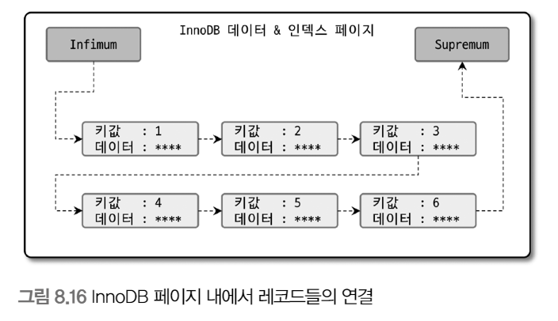</p>

<br>

페이지 내부에서 레코드들이 정렬 순서대로 저장되어 있지 않고, 실제로는 Heap처럼 사용되기에 물리적으로 저장이 순서대로 배치되지는 않음

각 데이터 페이지나 인덱스 페이지의 엔트리(데이터 레코드 또는 인덱스 키)는 키 값과 데이터를 가지는데 

인덱스(프라이머리 키 인덱스와 세컨더리 인덱스 모두)의 루트 노드 또는 브랜치 노드라면 자식 노드의 주소를 가짐

프라이머리 키에서 리프 노드의 데이터는 실제 레코드의 칼럼 값들이며, 세컨더리 인덱스 페이지에서는 프라이머리 키 값을 가짐

<br>

### B-Tree 인덱스의 가용성과 효율성

쿼리의 WHERE 조건이나 GROUP BY, ORDER BY 절이 어떤 경우에 인덱스를 사용할 수 있고 어떤 방식으로 사용할 수 있는지 식별할 수 있어야 함

그래야 쿼리 조건을 최적화하거나, 쿼리에 맞게 인덱스를 최적으로 생성

<br>

### 비교 조건의 종류와 효율성

다중 컬럼 인덱스에서 칼럼의 순서와 조건이 동등인지 >, < 같은 범위 조건인지에 따라 인덱스 칼럼의 활용 형태가 달라짐

```
mysql> SELECT * FROM dept_emp
        WHERE dept_no='d002' AND emp_no >= 10114;
```

이 쿼리를 위해 dept_emp 테이블에 각각 칼럼의 순서만 다른 두 가지 케이스로 인덱스를 생성

- 케이스 A: INDEX (dept_no, emp_no)
- 케이스 B: INDEX (emp_no, dept_no)

<br>

케이스 A

- dept_no='d002' AND emp_no>=10144 인 레코드를 찾고 dept_no='d002'가 아닐 때까지 인덱스를 쭉 읽기만 하면 됨

Why? 인덱스는 순서대로 정렬되어 있기 때문

<br>

케이스 B

-  emp_no>=10144 AND dept_no='d002' 인 레코드를 찾고 이후 모든 레코드에 대해 dept_no='d002'인지 비교해야 됨

<p align="center">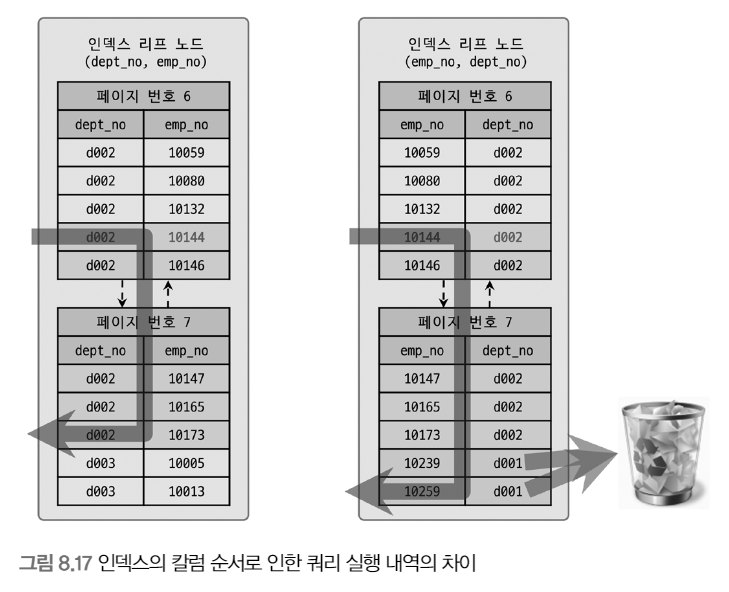</p>

<br>

`인덱스를 통해 읽은 레코드가 나머지 조건에 맞는지 비교하면서 취사선택하는 작업을 필터링`

다중 칼럼 인덱스의 정렬 방식 때문에 A, B의 차이가 있는 것

케이스 A는 2번째 칼럼인 emp_no는 비교 작업의 범위를 좁히는 데 도움을 주지만

케이스 B는 dept_no의 비교 작업 단위를 좁히는데 도움을 주지 못했음

<br>

`작업의 범위를 결정하는 조건을 작업 범위 결정 조건`

`비교 작업의 범위를 줄이지 못하고 단순 거름종이 역할만 하는 조건을 필터링 조건`

<br>

### 인덱스의 가용성

B-Tree 인덱스의 특징은 왼쪽 값에 기준해서 오른쪽 값이 정렬

그래서 LIKE '%mer' 같은 쿼리 처리를 인덱스로 할 수 없음

<br>

### 가용성과 효율성 판단

B-Tree 인덱스는 다음 조건(작업 범위 결정 조건)에서 사용 X

1. NOT-EQUAL로 비교된 경우(<>, NOT IN, NOT BETWEEN, IS NOT NULL)

    ```
    ### 예시

    WHERE column <> 'N'

    WHERE column NOT IN (10, 11, 12)

    WHERE column IS NOT NULL 
    ```

    이유
    
    `인덱스의 연속적인 범위를 활용할 수 없기에 인덱스 전체를 스캔하기 때문`

<br>

2. LIKE '%??' (앞부분이 아닌 뒷부분 일치) 형태로 문자열 패턴이 비교된 경우
   
    ```
    ### 예시

    WHERE column '%승환'

    WHERE column '_승환'

    ```

    이유

    `B-Tree 인덱스의 특징은 왼쪽 값에 기준해서 오른쪽 값이 정렬`

<br>

3. 스토어드 함수나 다른 연산자로 인덱스 칼럼이 변형된 후 비교된 경우
   
    ```
    ### 예시

    WHERE SUBSTRING(column, 1, 1) = 'X'

    WHERE DAYOFMONTH(column) = 1

    ```

    이유

    `인덱스 키 값이 변형되면 원래 인덱스의 정렬 순서가 무너짐`

<br>

4. NON-DETERMINISTIC 속성의 스토어드 함수가 비교 조건에 사용된 경우

    NON-DETERMINISTIC 속성을 가진 스토어드 함수는 `동일한 입력 값에 대해서도 호출될 때마다 다른 결과를 반환할 수 있는 함수`

    난수, 날짜, 시간 등
   
    ```
    ### 예시

    WHERE column = deterministic_function()
    ```

    이유

    `결과 값 예측 불가능`

<br>

5. 데이터 타입이 서로 다른 비교(인덱스 칼럼의 타입을 변환해야 비교가 가능한 경우)
   
    ```
    ### 예시

    WHERE char_column = 10

    ```

    이유

    `숫자와 문자열의 정렬 순서가 다르고, 비교 의미가 모호하기에`

<br>

6. 문자열 데이터 타입의 콜레이션이 다른 경우
   
    ```
    ### 예시

    WHERE utf8_bin_char_column = euckr_bin_char_column

    ```

    이유

    `콜레이션은 문자열을 정렬하는 규칙인데 서로 다른 콜레이션을 사용하면 정렬 순서가 다름`

<br>

다중 컬럼 인덱스는 다음 조건(작업 범위 결정 조건)에서 사용 X

1. 작업 범위 결정 조건으로 인덱스를 사용하지 못하는 경우

    ```
    ### 예시

    column_1 칼럼에 대한 조건이 없는 경우

    column_1 칼럼의 비교 조건이 위의 인덱스 사용 불가 조건 중 하나인 경우

    ```


<br>

2. 작업 범위 결정 조건으로 인덱스를 사용하는 경우
   
    ```
    ### 예시

    column_1 ~ column_(i-1) 칼럼까지 동등 비교 형태로 비교

    column_i 칼럼에 대해 다음 연산자 중 하나로 비교

    - 동등 비교

    - 크다 작다 형태

    - LIKE로 좌측 일치 패턴

    ```

<br>

위의 두가지 조건을 만족하는 쿼리는 column_1부터 column_i까지는 작업 범위 결정 조건으로 사용 가능

i+1 ~ n까지는 체크(필터링) 조건

<br>

예시

```
### 인덱스 사용 X
mysql> WHERE column_1 1 <> 2

### 1, 2 모두 범위 결정 조건으로 사용
mysql> WHERE column_1 = 1 AND column_2 > 10

### 1,2,3 모두 범위 결정 조건으로 사용
mysql> WHERE column_1 = 1 AND column_2 = 2 AND column_3 <= 10

### 1,2,3은 범위 결정 조건, 4는 체크 조건으로 사용
mysql> WHERE column_1 = 1 AND column_2 = 2 AND column_3 IN (10,20,30) AND column_4 <> 100

### 1,2,3,4 모두 범위 결정 조건으로 사용
mysql> WHERE column_1 = 1 AND column_2 IN (2,4) AND column_3 = 300 AND column_4 LIKE '김승%'

```

<br>

## R-Tree 인덱스

공간 인덱스는 R-Tree 인덱스 알고리즘을 이용해 2차원의 데이터를 인덱싱하고 검색하는 목적의 인덱스

기본적인 내부 메커니즘은 B-Tree와 흡사

B-Tree는 인덱스를 구성하는 칼럼의 값이 1차원 스칼라 값이라면, R-Tree는 2차원 공간 개념 값

<br>

MySQL의 공간 확장의 3가지 기능

- 공간 데이터를 저장할 수 있는 데이터 타입

- 공간 데이터의 검색을 위한 공간 인덱스 (R-Tree 알고리즘)

- 공간 데이터의 연산 함수 (거리 또는 포함 관계의 처리)

<br>

### 구조 및 특성

MySQL은 공간 정보의 저장 및 검색을 위해 기하학적 도형 정보를 관리할 수 있는 데이터 타입을 제공

POINT, LINE, POLYGON, GEOMETRY

<br>

MBR이란 Minumum Bounding Rectangle의 약어

해당 도형을 감싸는 최소 크기의 사각형

이 사각형들의 포함 관계를 B-Tree 형태로 구현한 인덱스가 R-Tree 인덱스

<p align="center">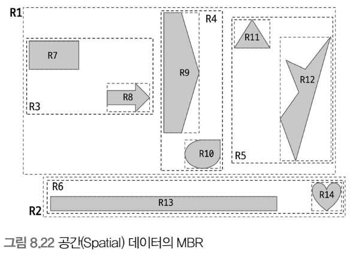</p>

<br>

최상위 레벨 : R1, R2

차상위 레벨 : R3, R4, R5, R6

최하위 레벨 : R7 ~ R14

<br>

최하위 레벨의 MBR은 각 도형 데이터의 MBR

차상위는 중간 크기 MBR(도형 객체 그룹)

최상위 MBR은 R-Tree 루트 노드에 저장

차상위는 브랜치 노드

최하위는 리프 노드

<p align="center">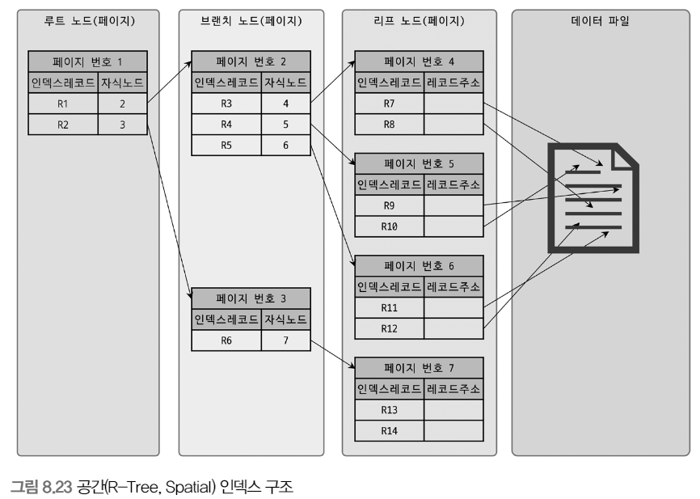</p>

<br>

### R-Tree 인덱스의 용도

