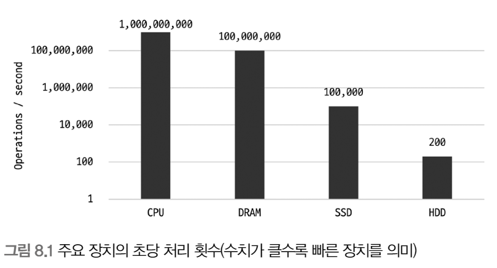
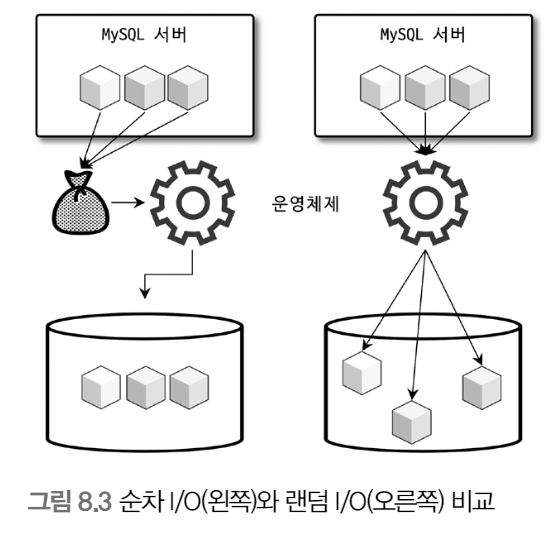
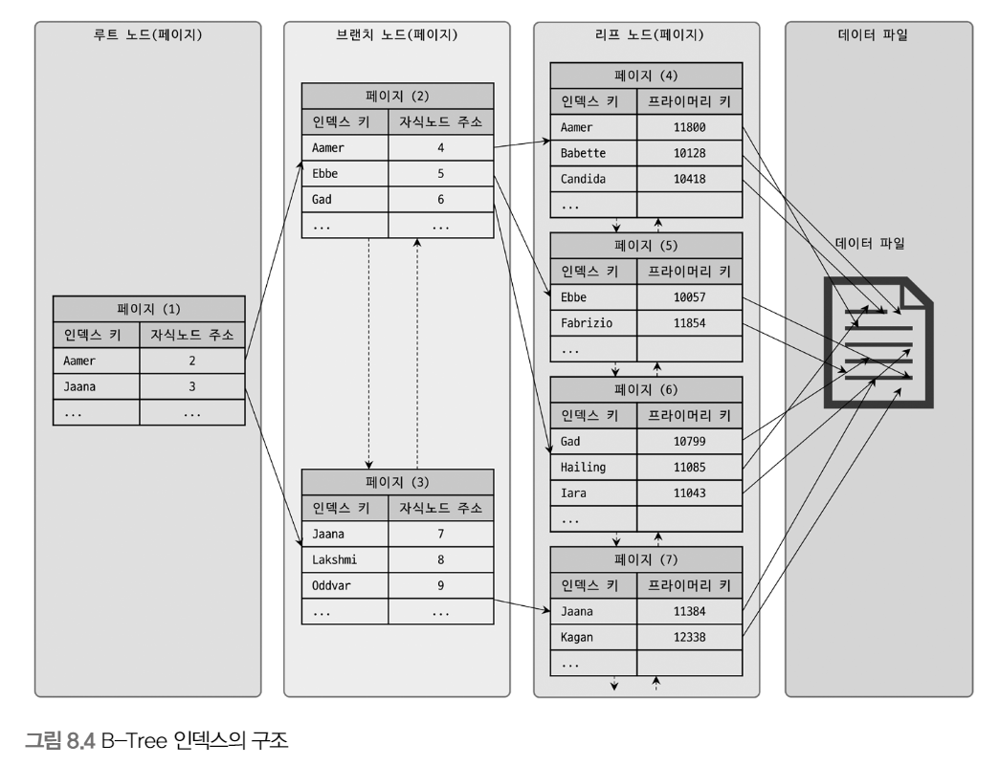
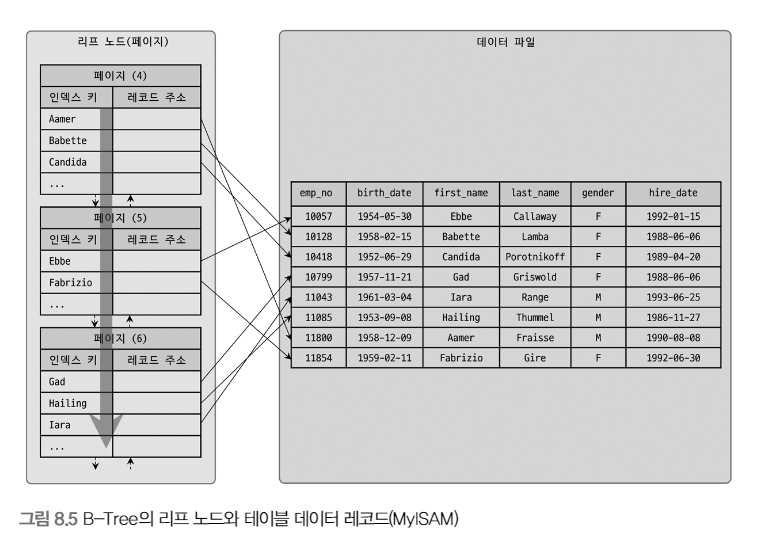
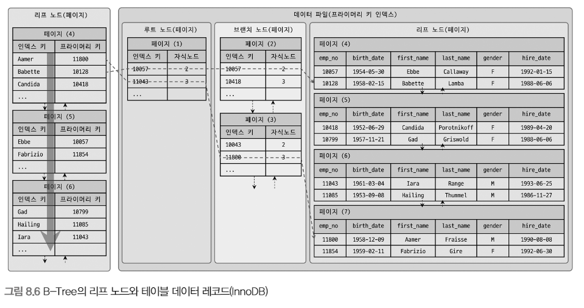

# 8장. 인덱스

인덱스는 쿼리의 성능을 언급하면서 뺴놓을 수 없는 부분

각 인덱스의 특성과 차이는 상당히 중요, 물리 수준의 모델링을 할 때에도 중요한 요소

## 디스크 읽기 방식

데이터 저장 매체(디스크)는 컴퓨터에서 가장 느린 부분

DB 성능 튜닝은 어떻게 디스크 I/O를 줄이느냐가 관건

 

### 하드 디스크 드라이브(HDD)와 솔리드 스테이트 드라이브(SSD)

CPU나 메모리는 대부분 전자식 장치이지만, HDD는 기계식 장치

그래서 DB 서버에서는 항상 디스크 장치가 병목

HDD를 대체하기 위해 전자식 저장 매체 SSD가 출시

 

SSD는 저장용 플래터(원판)을 제거하고 플래시 메모리를 장착하고 있기에 빨리 데이터를 읽을 수 있음

 

 

`디스크 헤더를 움직이지 않고 한 번에 많은 데이터를 읽는 순차 I/O에서는 SSD가 HHD보다 조금 빠르거나 거의 비슷하지만, 랜덤 I/O는 훨씬 빠름`

대부분 DB 서버의 작업은 랜덤 I/O이기에 SSD는 DBMS에 최적

 

### 랜덤 I/O와 순차 I/O

랜덤 I/O는 HDD의 플래터를 돌려서 읽어야 할 데이터가 저장된 위치로 디스크 헤더를 이동시킨 다음 데이터를 읽는 것

 

해당 그림을 보면 순차 I/O는 1번 시스템 콜을 요청, 랜덤 I/O는 3번 시스템 콜을 요청

`즉, 디스크의 성능은 디스크 헤더의 위치 이동 없이 얼마나 많은 데이터를 한 번에 기록하느냐에 결정`

DB 대부분의 작업은 랜덤 I/O 작업이 빈번하기에 MySQL은 그룹 커밋, 바이너리 로그 버퍼, InnoDB 로그 버퍼 등의 기능이 내장

디스크 원판이 없는 SSD도 랜덤 I/O와 순차 I/O가 차이가 있음

 

일반적으로 쿼리를 튜닝하는 것은 랜덤 I/O 자체를 줄여주는 것이 목적

`랜덤 I/O를 줄인다는 것은 쿼리를 처리하는데 꼭 필요한 데이터만 읽도록 쿼리를 개선하는 것을 의미`

인덱스 레인지 스캔은 랜덤 I/O, 풀 테이블 스캔은 순차 I/O

 

## 인덱스란?

칼럼의 값과 해당 레코드가 저장된 주소를 키-값 쌍으로 삼아 인덱스를 만듬

그렇기에 중요한 것이 정렬

 

인덱스는 SortedList, 데이터 파일은 ArrayList와 비슷

 

SortedList의 장단점을 통해 인덱스의 장단점 살펴보기

SortedList 자료 구조는 데이터가 저장될 때마다 값을 항상 정렬해야 하므로 저장하는 과정이 복잡하고 느리지만, 빠르게 원하는 값을 찾아올 수 있음

인덱스도 마찬가지로 INSERT나 UPDATE, DELETE 문장 처리가 느리지만 SELECT는 빠름

`즉, 인덱스는 데이터의 저장(INSERT, UPDATE, DELETE) 성능을 희생하고 읽기 속도를 높이는 기능`

 

데이터 저장 방식(알고리즘)으로 분류했을 때 대표적으로 B-Tree 인덱스와 Hash 인덱스로 구분 가능

B-Tree 알고리즘

- 가장 일반적으로 사용되는 인덱스 알고리즘

- 칼럼의 값을 변형하지 않고 원래의 값을 이용해 인덱싱하는 알고리즘

Hash 알고리즘

- 칼럼의 값으로 해시값을 계산해서 인덱싱하는 알고리즘

- 매우 빠른 검색 지원

- 값을 변형해서 인덱싱하므로 전방 일치와 같이 값의 일부만 검색하거나 범위를 탐색할 때는 해시 탐색 불가

- 메모리 기반 데이터 베이스(Redis 등)에서 사용

 

데이터 중복 여부로 분류했을 때 유니크 인덱스와 유니크하지 않은 인덱스로 구분 가능

이는 옵티마이저에게 상당히 중요한 문제가 됨

유니크 인덱스에 대해서 동등 조건으로 검색하는 것은 항상 1건의 레코드를 반환하는 것이지만 유니크하지 않은 인덱스는 아님

 

## B-Tree 인덱스

B-Tree의 B는 Binary가 아닌 Balanced

대부분의 인덱스는 B-Tree를 사용할 정도로 일반적인 용도에 적합한 알고리즘

 

### 구조 및 특성

B-Tree는 트리 구조의 `최상위에 하나의 루트 노드`가 존재하고 하위에 자식 노드가 붙어 있는 형태

가장 `하위에 있는 노드를 리프 노드`라 하고 `중간 노드를 브랜치 노드`라고 함

 

인덱스 키 값은 모두 정렬되어 있지만, 데이터 파일의 레코드는 임의의 순서로 저장되어 있음

많은 사람들이 데이터 파일의 레코드는 INSERT된 순서대로 저장되는 것으로 생각하지만 그렇지 않음

레코드가 삭제되면 그 공간을 채우기 때문에 항상 INSERT된 순서로 저장되는 것은 아님

 

 

 

리프 노드는 레코드의 주소를 갖고 있고 그 주소로 데이터 파일에서 원하는 데이터를 찾음

InnoDB는 프라이머리 키가 ROWID 역할을 함

두 스토리지 엔진의 차이는 세컨더리 인덱스의 차이

MyISAM은 세컨더리 인덱스가 물리적 주소

InnoDB는 PK 키를 주소처럼 사용하기에 논리적 주소

 

8.6을 봤을 때 프라이머리 키를 저장하고 있는 B-Tree를 다시 한번 검색하게 됨

이것은 성능이 떨어질 것처럼 보이지만 사실은 아님

