# 9장. 옵티마이저와 힌트

MySQL 서버로 요청된 쿼리는 어떤 방법이 최적이고 최소의 비용이 소모될지 결정해야 함

쿼리를 최적으로 실행하기 위해 각 테이블의 데이터가 어떤 분포로 저장되어 있는지 통계 정보를 참조하고, 그런 기본 데이터를 비교해 최적의 실행 계획을 수립하는 작업이 필요

DBMS에서는 옵티마이저가 이러한 기능을 담당

<br>

EXPLAIN 명령어로 쿼리의 실행 계획을 확인 가능한데, 해당 내용을 이해하기 위해서는 옵티마이저가 실행하는 최적화에 대해 어느 정도 알아야 함

<br>

## 개요

어떤 DBMS든지 옵티마이저 + 실행 계획 이해가 가장 복잡한 부분

하지만 실행 계획을 이해해야지만 실행 계획의 불합리한 부분을 찾아내고 더 최적화된 실행 계획을 수립할 수 있도록 유도 가능

<br>

### 쿼리 실행 절차

쿼리 실행 과정

1. 사용자로부터 요청된 SQL 문장을 잘게 쪼개서 MySQL 서버가 이해할 수 있는 수준으로 분리

2. SQL의 파싱 정보를 확인하면서 어떤 테이블부터 읽고 어떤 인덱스를 이용해 테이블을 읽을지 선택

3. 두 번째 단계에서 결정된 테이블의 읽기 순서나 선택된 인덱스를 이용해 스토리지 엔진으로부터 데이터를 가져옴

<br>

첫 번째 단계를 SQL 파싱이라고 하며 SQL 파서라는 모듈로 처리

SQL 문장이 문법적으로 잘못됐다면 이 단계에서 걸러짐

또한 이 단계에서 SQL 파스 트리가 생성

MySQL 서버는 SQL 파스 트리를 이용해 쿼리를 실행

<br>

두 번째 단계는 SQL 파스 트리를 참조하면서 다음을 처리

- 불필요한 조건 제거 및 복잡한 연산 단순화

- 여러 테이블의 조인이 있는 경우 어떤 순서로 테이블을 읽을지 결정

- 각 테이블에 사용된 조건과 인덱스 통계 정보를 이용해 사용할 인덱스를 결정

- 가져온 레코드들을 임시 테이블에 넣고 다시 한번 가공해야 하는지 결정

`이처럼 두 번째 단계는 최적화 및 실행 계획 수립 단계이며, 완료되면 실행 계획이 만들어짐`

<br>

세 번쨰 단계는 실행 계획대로 스토리지 엔진에 레코드를 읽어오도록 요청하고, MySQL 엔진에서는 받은 레코드를 조인하거나 정렬하는 작업을 수행

<br>

### 옵티마이저의 종류

비용 기반 최적화 VS 규칙 기반 최적화

<br>

- 규칙 기반 최적화

    대상 테이블의 레코드 건수나 선택도 등을 고려하지 않고 옵티마이저에 내장된 우선순위에 따라 실행 계획을 수립하는 방식

    통계 정보(테이블의 레코드 건수나 칼럼값의 분포도)를 조사하지 않고 수립하기에 같은 쿼리에 대해서는 같은 실행 방법을 만듦

    요즘 사용 X

<br>

- 비용 기반 최적화

    쿼리를 처리하기 위한 여러 가지 가능한 방법을 만들고, 각 단위 작업의 비용 정보와 대상 테이블의 예측된 통계 정보를 이용해 실행 계획별 비용 산출

    이 중 최소로 소요되는 처리 방식을 선택해 쿼리 실행

<br>

## 기본 데이터 처리

모든 RDBMS는 데이터를 정렬하거나 그루핑 하는 등의 기본 데이터 가공 기능을 가지고 있음

MySQL 서버가 어떤 알고리즘을 사용하는지 알아보자

<br>

### 풀 테이블 스캔과 풀 인덱스 스캔

`풀 테이블 스캔은 인덱스를 사용하지 않고 테이블의 데이터를 처음부터 끝까지 읽어서 요청된 작업을 처리`

다음과 같은 조건일 때 `풀 테이블 스캔을 선택`

1. 테이블의 `레코드 건수가 작아서` 인덱스를 통해 읽는 것보다 풀 테이블 스캔이 더 빠른 경우

    (일반적으로 테이블이 페이지 1개로 구성된 경우)

<br>

2. WHERE 절이나 ON 절에 인덱스를 이용할 수 있는 `적절한 조건이 없는` 경우

<br>

3. 인덱스 레인지 스캔을 사용할 수 있는 쿼리라고 하더라도 옵티마이저가 판단한 조건 일치 `레코드 건수가 너무 많은` 경우(인덱스의 B-Tree를 샘플링해서 조사한 통계 정보 기준)

<br>

일반적으로 테이블 전체 크기는 인덱스보다 크기에 테이블 풀 스캔은 많은 디스크 읽기가 필요

그래서 풀 테이블 스캔을 실행할 때 한 번에 여러 개의 블록(페이지)를 읽어오는 기능이 내장

하지만 `MySQL에서는 풀 테이블 스캔을 실행할 때 몇 개씩 블록을 읽어올지 설정하는 시스템 변수는 X`

<br>

InnoDB는 특정 테이블의 연속된 데이터 페이지가 읽히면 백그라운드 스레드에 의해 리드 어헤드(Read ahead) 작업이 자동으로 시작

`리드 어헤드란 어떤 영역의 데이터가 앞으로 필요해지리라는 것을 예측해서 요청이 오기 전에 미리 디스크에서 읽어 InnoDB 버퍼 풀에 가져다 두는 것`

<br>

풀 테이블 스캔 실행 과정

1. 처음 몇 개의 데이터 페이지는 포그라운드 스레드가 페이지 읽기를 싫애

2. 특정 시점부터는 읽기 작업을 백그라운드 스레드로 넘김

3. 이후부터 한 번에 4개 또는 8개씩 페이지를 읽으면서 계속 그 수를 증가시킴

4. 최대 64개 데이터 페이지까지 읽어서 버퍼 풀에 저장

5. 포그라운드 스레드는 미리 버퍼 풀에 준비된 데이터를 가져다 사용

<br>

innodb_read_ahead_threshold 시스템 변수를 통해 언제 리드 어헤드를 시작할지 임계값 설정 가능

DW 용으로 MySQL을 사용한다면 이 옵션을 디폴트보다 낮춰 빨리 리드 어헤드를 시작되게 유도하는 것도 좋은 방법

<br>

리드 어헤드는 풀 인덱스 스캔에서도 동일하게 사용

```
mysql> SELECT COUNT(*) FROM employees;
```

해당 쿼리는 풀 테이블 스캔을 할 것처럼 보이지만 사실은 풀 인덱스 스캔을 할 가능성이 높음

단순 레코드 건수를 필요로 하는 쿼리는 용량이 작은 인덱스를 선택하는 것이 디스크 읽기 횟수를 줄일 수 있기에

Why?

`인덱스는 테이블의 2 ~ 3개의 칼럼만으로 구성되기 때문에 테이블 자체보다 용량이 작아서 빠르게 처리 가능`

```
mysql> SELECT * FROM employees;
```

해당 쿼리처럼 레코드에만 있는 칼럼이 필요한 경우에는 풀 테이블 스캔

<br>

### 병렬 처리

8.0 버전부터 처음으로 쿼리의 병렬 처리가 가능(용도 한정)

`병렬 처리란 하나의 쿼리를 여러 스레드가 작업을 나누어서 동시에 처리하는 것`

그 전까지는 여러 스레드가 동시에 각각의 쿼리를 처리했었음

<br>

innodb_parallel_read_threads라는 시스템 변수를 이용해 하나의 쿼리를 최대 몇 개의 스레드를 이용해서 처리할지를 변경

아직 병렬로 처리하게 하는 힌트나 옵션은 없음

해당 예제 같이 `아무런 WHERE 조건 없이 단순 테이블의 전체 건수를 가져오는 쿼리만 병렬 처리 가능`

<p align="center">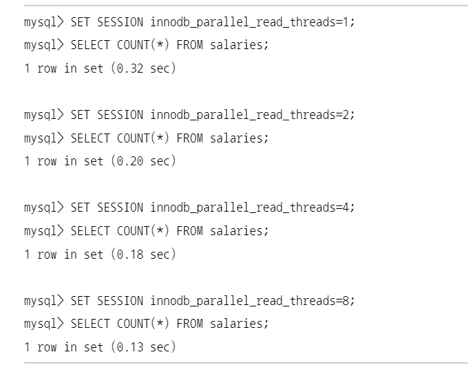</p>

<br>

병렬 처리용 스레드 개수가 늘어날수록 쿼리 처리에 걸리는 시간이 줄어드는 것을 확인 가능

하지만 CPU의 코어 개수를 넘어서는 경우에는 오히려 성능이 떨어질 수도 있으니 주의

<br>

### ORDER BY 처리 (Using filesort)

대부분의 SELECT 쿼리에서 정렬은 필수적으로 사용

DW처럼 대량의 데이터를 조회해서 일괄 처리하는 기능이 아니라면 `레코드 정렬 요건은 대부분 조회 쿼리에 포함돼 있을 것`

정렬을 처리하는 방법

- 인덱스 이용

- 쿼리 실행시 `Filesort` 라는 별도 처리

||장점|단점|
|------|---:|---:|
|인덱스 이용|INSERT, UPDATE, DELETE 쿼리가 실행될 때 <br> 이미 인덱스가 정렬돼 있어서 <br> 순서대로 읽기만 하면 되어 매우 빠름|INSERT, UPDATE, DELETE 작업시 <br> 부가적인 인덱스 추가/삭제 <br> 작업이 필요하므로 느림 <br> <br> 인덱스 때문에 디스크 공간이 더 필요 <br> <br> 인덱스의 개수가 늘어날수록 <br>  InnoDB의 버퍼 풀을 <br> 위한 메모리가 많이 필요 |
|Filesort 이용|인덱스를 생성하지 않아도 되므로 <br> 인덱스 이용 단점이 장점 <br> 정렬해야할 레코드가 많지 않으면 <br> 메모리에서 Filesort가 처리되므로 충분히 빠름|정렬 작업이 쿼리 실행시 처리되므로 <br> 레코드 대상 건수가 많아질수록 <br> 쿼리 응답 속도 하락|

<br>

모든 정렬을 인덱스를 이용하도록 튜닝하기 어려운 이유

- 정렬 기준이 너무 많아서 요건별로 모두 인덱스를 생성하는 것이 불가능한 경우

- GROUP BY의 결과 또는 DISTINCT 같은 처리의 결과를 정렬해야 하는 경우

- UNION의 결과와 같이 임시 테이블의 결과를 다시 정렬해야 하는 경우

- 랜덤하게 결과 레코드를 가져와야 하는 경우

실행 계획의 Extra 칼럼에 Using filesort 메세지가 표시

<br>

MySQL 정렬 특성을 이해해보자

### 소트 버퍼

`소트 버퍼는 MySQL이 정렬을 수행하기 위한 별도의 메모리 공간`

정렬이 필요한 경우에만 할당되며, 최대 사용한 소트 버퍼의 공간은 sort_buffer_size라는 시스템 변수로 설정

소트 버퍼를 위한 메모리 공간은 쿼리의 실행이 완료되면 즉시 시스템으로 반납

<br>

정렬이 왜 문제가 되는지 알아보자

정렬해야 할 레코드의 건수가 소트 버퍼로 할당된 공간보다 크다면?

이를 여러 조각으로 나눠서 처리하는데, 이 과정에서 임시 저장을 위해 디스크를 사용

<br>

메모리의 소트 버퍼에서 정렬 수행 -> 그 결과를 임시로 디스크에 기록 -> 다음 레코드 -> 반복

마지막으로 정렬된 레코드들을 다시 병합(멀티 머지)

수행된 멀티 머지 횟수는 Sort_merge_passes 상태 변수에 누적해서 집계

<br>

이 과정이 모두 디스크 I/O를 유발

sort_buffer_size 변수의 설정값이 무조건 크면 메모리에서 처리되기 빨라질 것으로 예상하지만 실제 결과는 X

일반적으로 56KB ~ 1MB가 적절

<br>

MySQL = 글로벌 메모리 영역 + 세션(로컬) 메모리 영역

소트 버퍼는 세션 메모리 영역

즉, 여러 클라이언트가 공유해서 사용할 수 있는 영역 X

<br>

커넥션이 많으면 많을수록, 정렬 작업이 많으면 많을수록 소트 버퍼로 소비되는 메모리 공간이 커짐

대량 데이터의 정렬이 필요한 경우 해당 세션의 소트 버퍼만 일시적으로 늘려서 쿼리를 실행하고 다시 줄이는 것도 좋은 방법

<br>

### 정렬 알고리즘

- 싱글 패스

    레코드 전체를 소트 버퍼에 담음

- 투 패스

    정렬 기준 칼럼만 소트 버퍼에 담음

<br>

### 싱글 패스 정렬 방식

`소트 버퍼에 SELECT 대상이 되는 칼럼 전부를 담아서 정렬을 수행하는 정렬 방식`

```
mysql> SELECT emp_no, first_name, last_name
        FROM employees
        ORDER BY first_name;
```

<p align="center">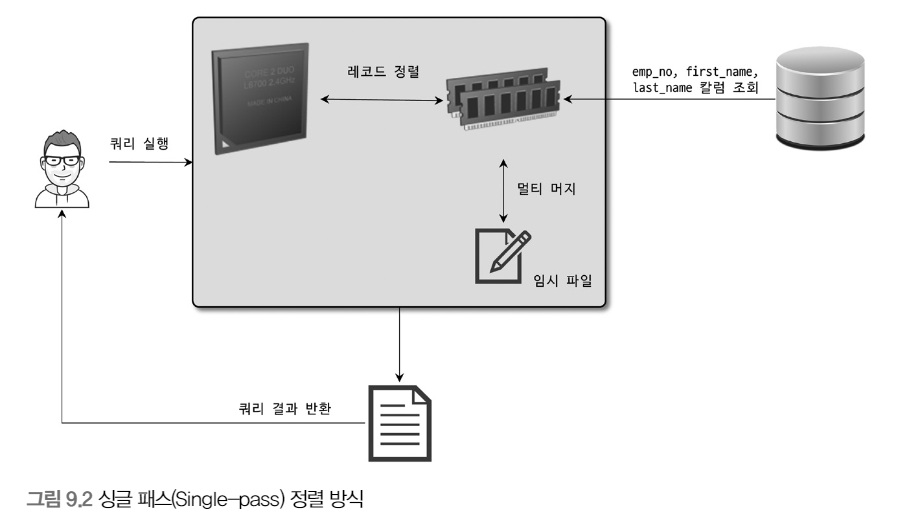</p>

<br>

처음 employees 테이블을 읽을 때 정렬에 필요하지 않은 last_name 칼럼까지 

전부 읽어서 소트 버퍼에 담고 정렬을 수행

<br>


### 투 패스 정렬 방식

`정렬 대상 칼럼과 PK 키 값만 소트 버퍼에 담아서 정렬을 수행하고 정렬된 순서대로 다시 PK 키로 테이블을 읽어서 SELECT할 칼럼을 가져오는 정렬 방식`

```
mysql> SELECT emp_no, first_name, last_name
        FROM employees
        ORDER BY first_name;
```
<p align="center"></p>

<br>

처음 employees 테이블을 읽을 때 정렬에 필요한 first_name 칼럼과 

PK 키인 emp_no만 읽어서 정렬을 수행 후

그 결과 순서대로 employees 테이블을 한 번 더 읽어서 last_name을 가져옴

<br>

투 패스 방식은 테이블을 두 번 읽어야 하지만 적은 소트 버퍼 공간이 필요하며

싱글 패스 방식은 한 번만 읽지만 더 많은 소트 버퍼 공간이 필요

<br>

128KB 정렬 버퍼를 사용한다면 투 패스 방식은 약 7000건의 레코드를 정렬할 수 있지만

싱글 패스 방식은 약 3500건만 가능

<br>

`최신 버전에서는 일반적으로 싱글 패스 방식을 사용하지만 다음의 경우 투 패스 방식을 사용`

- 레코드의 크기가 max_length_for_sort_data 시스템 변수에 설정된 값보다 클 때

- BLOB이나 TEXT 타입의 칼럼이 SELECT 대상에 포함할 때

<br>

싱글 패스 방식은 정렬 대상 레코드의 크기나 건수가 작은 경우 빠르고

투 패스 방식은 크기나 건수가 많은 경우 효율적

<br>

SELECT 쿼리에서 필요 칼럼만 조회하는 것이 아닌 모든 칼럼을 가져오도록 조회하는 것은 비효율적

정렬 버퍼에만 영향을 미치는 것이 아니라 임시 테이블이 필요한 쿼리에도 영향을 미침

<br>

### 정렬 처리 방법

쿼리에 ORDER BY가 사용되면 반드시 3가지 처리 방법 중 하나로 정렬이 처리

1. `인덱스를 사용한 정렬`

2. `조인에서 드라이빙 테이블만 정렬` 
   
    실행 계획의 Extra 칼럼에 Using filesort 표시

3. `조인에서 조인 결과를 임시 테이블로 저장 후 정렬` 
   
   실행 계획의 Extra 칼럼에 Using temporary; Using filesort 표시

<br>

인덱스를 사용할 수 없다면 WHERE 조건에 일치하는 레코드를 검색해 정렬 버퍼에 저장하면서 정렬을 처리(Filesort)

이 때 옵티마이저는?

1. 조인의 드라이빙 테이블만 정렬한 다음 조인을 수행

2. 조인이 끝나고 일치하는 레코드를 모두 가져온 후 정렬을 수행

2가지 방법 중 하나를 선택

일반적으로 조인이 수행되면서 레코드 건수와 레코드 크기는 거의 배수로 늘어나기에 가능하다면 

드라이빙 테이블만 정렬한 다음 조인을 수행하는 것이 효율적


```
### 드라이빙 테이블이란?

MySQL에서 드라이빙 테이블(Driving Table)이란 조인 쿼리에서 결과 집합의 행 수를 결정하는 테이블을 말합니다.

조인 쿼리에서 각 테이블들은 조인 조건에 의해 연결되며, 이때 드라이빙 테이블은 조인의 시작점이 되는 테이블입니다. MySQL 최적화기는 드라이빙 테이블의 각 행에 대해 다른 테이블과 조인하여 결과를 생성합니다.

드라이빙 테이블의 선택은 쿼리 실행 비용에 큰 영향을 미치므로 최적화에 중요한 역할을 합니다. 일반적으로 MySQL은 가장 작은 테이블을 드라이빙 테이블로 선택하려고 합니다. 그러나 경우에 따라서는 인덱스 사용 여부 등 다른 요인도 고려하게 됩니다.

```


### 인덱스를 이용한 정렬

인덱스를 위한 정렬을 위해서는 반드시 ORDER BY에 명시된 칼럼이 

제일 먼저 읽는 테이블(조인이 사용된 경우 드라이빙 테이블)에 속하고,

ORDER BY의 순서대로 생성된 인덱스가 있어야 함

<br>

또한, WHERE 절에 첫 번째로 읽는 테이블의 칼럼에 대한 조건이 있다면 

그 조건과 ORDER BY는 같은 인덱스를 사용할 수 있어야 함

<br>

그리고 B-Tree 계열 인덱스가 아닌 해시, 전문 검색 인덱스는 인덱스를 이용한 정렬 X

여러 테이블이 조인되는 경우 NL 방식의 조인만 사용 가능


```
### NL 조인이란

NL(Nested Loop) 조인은 MySQL에서 사용되는 조인 알고리즘 중 하나입니다. 이 알고리즘은 드라이빙 테이블의 각 행에 대해 내부 루프를 반복하여 다른 테이블과 조인하는 방식으로 동작합니다.


NL 조인 알고리즘의 단계는 다음과 같습니다:

1. 드라이빙 테이블을 선택합니다. 일반적으로 가장 작은 테이블이 선택됩니다.

2. 드라이빙 테이블의 첫 번째 행을 읽습니다.

3. 내부 루프에서 다른 테이블의 모든 행을 읽으면서 조인 조건을 확인합니다.

4. 조인 조건을 만족하는 행들을 결과 집합에 추가합니다.

5. 드라이빙 테이블의 다음 행으로 이동하고 2~4 단계를 반복합니다.


NL 조인은 비교적 단순하고 쉽게 구현할 수 있지만, 성능 문제가 있을 수 있습니다. 특히 드라이빙 테이블이 크거나 조인되는 테이블이 매우 크면 비효율적일 수 있습니다. 왜냐하면 드라이빙 테이블의 각 행에 대해 다른 테이블의 모든 행을 스캔해야 하기 때문입니다.

그럼에도 불구하고 NL 조인은 다음과 같은 경우에 유용할 수 있습니다:

1. 드라이빙 테이블이 작고 조인되는 테이블에 적절한 인덱스가 있을 때

2. 조인 조건이 복잡하여 다른 알고리즘을 사용하기 어려울 때

3. 조인되는 테이블의 행 수가 작을 때
```

인덱스를 이용해 정렬이 처리되는 경우에는 실제 인덱스의 값이 정렬되어 있기에 인덱스 순서로 읽으면 됨

```
mysql> SELECT *
        FROM employees e, salaries s
        WHERE s.emp_no=e.emp_no
        AND e.emp_no BETWEEN 100002 AND 100020
        ORDER BY e.emp_no;

// emp_no 칼럼으로 정렬이 필요한데, 인덱스를 사용하면서 자동으로 정렬이 된다고
// 일부러 ORDER BY emp_no를 제거하는 것은 좋지 않은 선택
// ORDER BY 절을 포함한다고 불필요한 정렬 작업을 수행하지 않기 때문
```

### 조인의 드라이빙 테이블만 정렬

조인이 수행되면 결과 레코드 건수가 몇 배로 불어나고, 레코드 하나하나의 크기도 늘어남

Why?

데이터가 병합되기 때문

그래서 조인을 실행하기 전 첫 번째 테이블(드라이빙 테이블)의 레코드를 먼저 정렬한 다음 조인을 실행하는 것이 차선책

조인에서 첫 번째로 읽히는 테이블(드라이빙 테이블)의 칼럼만으로 ORDER BY 절을 작성

```
mysql> SELECT *
        FROM employees e, salaries s
        WHERE s.emp_no=e.emp_no
        AND e.emp_no BETWEEN 100002 AND 100020
        ORDER BY e.last_name;
```

WHERE 절이 다음 2가지 조건을 갖추고 있어서 옵티마이저는 employees 테이블을 드라이빙 테이블로 선택할 것

1. WHERE 절의 검색 조건은 employees 테이블의 PK 키를 이용해 검색하면 작업량을 줄일 수 있음

2. 드리븐 테이블(salaries)의 조인 칼럼인 emp_no 칼럼에 인덱스가 있음

ORDER BY 절에 명시된 칼럼은 employees 테이블의 PK와 전혀 연관이 없으므로 인덱스를 이용한 정렬은 X

last_name 칼럼이 드라이빙 테이블에 포함된 칼럼이기에 해당 테이블만 정렬을 먼저 수행하고 그 결과를 salaries 테이블과 조인

<p align="center">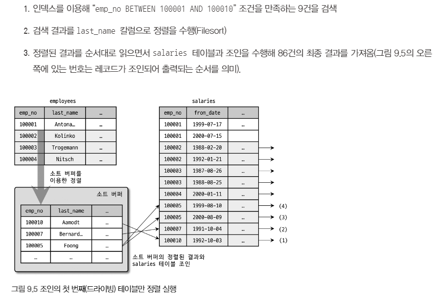</p>

<br>

### 임시 테이블을 이용한 정렬

쿼리가 2개 이상의 테이블을 조인해서 결과를 정렬해야 한다면 임시 테이블이 필요

이 방법은 정렬의 3가지 방법 중 정렬해야할 레코드 건수가 가장 많기에 가장 느림

```
mysql> SELECT *
        FROM employees e, salaries s
        WHERE s.emp_no=e.emp_no
        AND e.emp_no BETWEEN 100002 AND 100020
        ORDER BY s.salary;
```

이번 쿼리는 ORDER BY의 정렬 기준 칼럼이 드리븐 테이블에 있는 칼럼

`즉, 정렬이 수행되기 전에 salaries 테이블을 읽어야 하므로 조인된 데이터를 가지고 정렬할 수 밖에`

<p align="center">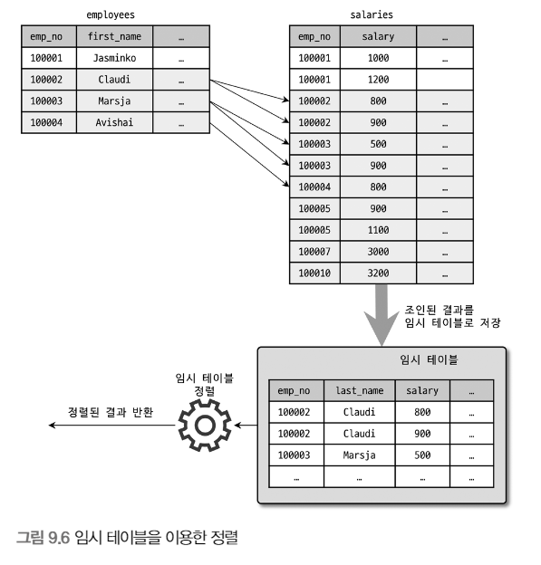</p>

<br>

### 정렬 처리 방법의 성능 비교

ORDER BY와 함께 LIMIT도 거의 필수로 사용되는 경향

LIMIT는 처리 결과의 일부만 가져오기에 작업량을 줄이는 역할

그런데 ORDER BY나 GROUP BY 같은 작업은 WHERE 조건을 만족하는 레코드를 LIMIT 건수만큼 가져와서 처리할 수 X

우선 조건을 만족하는 레코드를 모두 가져와서 ORDER BY, GROUP BY 연산을 하고 LIMIT로 건수를 제한

<br>

쿼리에서 인덱스를 사용하지 못하는 정렬이나 그루핑 작업이 왜 느리게 작동할까?

쿼리 처리 방법

- 스트리밍 처리

- 버퍼링 처리

### 스트리밍 방식

`서버 쪽에서 처리할 데이터가 얼마인지 관계없이 조건에 일치하는 레코드가 검색될 때마다 바로바로 클라이언트로 전송해주는 방식`

스트리밍 방식으로 처리되는 쿼리는 얼마나 많은 레코드를 조회하느냐에 상관없이 빠른 응답 시간 보장

풀 테이블 스캔의 결과가 바로 클라이언트로 스트리밍되고, LIMIT 조건을 추가하면 전체적으로 가져오는 레코드 건수가 줄어들어 마지막 레코드를 가져오기까지 시간을 줄일 수 있음

<br>

### 버퍼링 방식

ORDER BY, GROUP BY 같은 처리는 쿼리의 결과가 스트리밍되는 것이 불가능

Why?

> WHERE 조건에 일치하는 모든 레코드를 가져오고 정렬하거나 그루핑해야 하기 때문

<br>

모든 레코드를 검색하고 정렬 작업을 하는 동안 클라이언트는 기다려야 하기에 응답 속도 느려짐

쿼리 결과를 모아서 일괄 가공해야 하기에 LIMIT 같이 결과 건수 제한 조건은 성능에 별로 영향 X

<br>

ORDER BY의 3가지 처리 방법 중 인덱스를 사용한 정렬만 스트리밍, 나머지 2개는 버퍼링

즉, 인덱스를 사용한 정렬 방식은 LIMIT로 제한된 건수만큼만 읽으면서 바로바로 결과 전송이 가능하지만 나머지 2개는 X

<br>

조인과 함께 ORDER BY 절과 LIMIT 절이 사용될 경우 정렬 처리 방법별로 어떤 차이가 있을까?

```
mysql> SELECT *
        FROM tb_test1 t1, tb_test t2
        WHERE t1.col1=t2.col1
        ORDER BY t1.col2
        LIMIT 10;
```

tb_test1 테이블의 레코드가 100건이고, tb_test2 테이블의 레코드가 1000건인 테이블이 2개 있고

두 테이블의 조인 결과는 전체 1000건

tb_test1이 드라이빙 되는 경우

|정렬 방법|읽어야 할 건수|조인 횟수|정렬해야 할 대상 건수|
|------|---:|---:|---:|
|인덱스 이용|tb_test1: 1건 <br> tb_test2: 10건| 1번 | 0건 |
|조인의 드라이빙 테이블만 정렬|tb_test1: 100건 <br> tb_test2: 10건| 1번 | 100건 <br> tb_test1 테이블의 레코드 건수만큼 정렬 필요 |
|임시 테이블 사용 후 정렬|tb_test1: 100건 <br> tb_test2: 1000건| 100번 <br> tb_test1 테이블의 레코드 건수만큼 조인 발생 | 1000건 <br> 조인된 결과 레코드 건수를 전부 정렬 |

<br>

tb_test2이 드라이빙 되는 경우

|정렬 방법|읽어야 할 건수|조인 횟수|정렬해야 할 대상 건수|
|------|---:|---:|---:|
|인덱스 이용|tb_test2: 10건 <br> tb_test1: 10건| 10번 | 0건 |
|조인의 드라이빙 테이블만 정렬|tb_test2: 1000건 <br> tb_test1: 10건| 10번 | 1000건 <br> tb_test2 테이블의 레코드 건수만큼 정렬 필요 |
|임시 테이블 사용 후 정렬|tb_test2: 1000건 <br> tb_test1: 100건| 1000번 <br> tb_test2 테이블의 레코드 건수만큼 조인 발생 | 1000건 <br> 조인된 결과 레코드 건수를 전부 정렬 |

<br>

`가능하다면 인덱스를 사용한 정렬로 유도하고, 그렇지 못하다면 최소한 드라이빙 테이블만 정렬해도 되는 수준으로 유도하는 것도 좋은 튜닝 방법`

<br>

### 정렬 관련 상태 변수

MySQL 서버는 처리하는 주요 작업에 대해서는 해당 작업의 실행 횟수를 상태 변수로 저장

- `Sort_merge_passes`

    멀티 머지 처리 횟수

- `Sort_range`

    인덱스 레인지 스캔을 통해 검색된 결과에 대한 정렬 작업 횟수

- `Sort_scan`

    풀 테이블 스캔을 통해 검색된 결과에 대한 정렬 작업 횟수

- `Sort_rows`

    지금까지 정렬한 전체 레코드 건수

<br>

### GROUP BY 처리

GROUP BY 또한 쿼리가 스트리밍된 처리를 할 수 없는 것 중 하나

GROUP BY 쿼리는 HAVING 절을 사용할 수 있는데

`HAVING 절은 GROUP BY 결과에 대해 필터링 역할을 수행`

<br>

GROUP BY의 2가지 작업

- 인덱스 사용 O

    - 인덱스 풀 스캔

    - 루스 인덱스 스캔

- 인덱스 사용 X

    - 임시 테이블 사용

<br>

### 인덱스 스캔을 이용하는 GROUP BY (타이트 인덱스 스캔)

조인의 드라이빙 테이블에 속한 칼럼만 이용해 그루핑할 때 GROUP BY 칼럼으로 이미 인덱스가 있다면

그 인덱스를 읽으면서 그루핑을 하고 그 결과로 조인을 처리

GROUP BY가 인덱스를 사용해서 처리된다 하더라도 그룹 함수 등의 그룹 값을 처리해야 해서 임시 테이블이 필요한 경우도 많음

<br>

이미 정렬된 인덱스를 읽을 때는 쿼리 실행 시점에 추가적인 정렬이나 내부 임시 테이블이 필요 X

이런 방식은 실행 계획의 Extra 칼럼에 별도로 GROUP BY 코멘트(Using index for group-by)나 정렬 관련 코멘트(Using temporary, Using filesort) 표시 X

<br>

### 루스 인덱스 스캔을 이용하는 GROUP BY

`루스 인덱스 스캔 방식은 인덱스의 레코드를 건너 뛰면서 필요한 부분만 읽어서 가져오는 것`

루스 인덱스 스캔을 사용할 때는 Extra 칼럼에 Using index for group-by 표시

```
mysql> EXPLAIN
        SELECT emp_no
        FROM salaries
        WHERE from_date='1985-03-01'
        GROUP BY emp_no;
```

salaries 테이블의 인덱스는 (emp_no, from_date)

그러므로 WHERE 조건은 인덱스 레인지 스캔으로 이용할 수 없는 쿼리

Why?

> 인덱스의 첫 번째 열(emp_no)은 사용하지 않고 두 번째 열(from_date)만 사용하므로 인덱스 레인지 스캔을 할 수 없음

`하지만 이 쿼리의 실행 계획을 보면 GROUP BY 처리까지 인덱스를 사용`

<p align="center">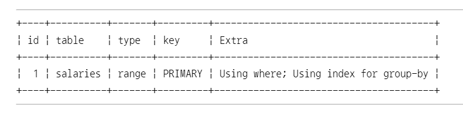</p>

<br>

이 쿼리를 어떻게 실행했을까?

1. (emp_no, form_date) 인덱스를 차례대로 스캔하면서 emp_no의 첫번째 유일 값 10001을 찾아냄

2. (emp_no, form_date) 인덱스에서 emp_no가 10001인 것 중에서 from_date 값이 1985-03-01인 레코드만 가져옴

    > 이 방법은 1번에서 알아낸 10001 값과 WHERE 절에 사용된 조건을 합쳐 emp_no='10001' AND from_date='1985-03-01' 조건으로 (emp_no, form_date) 인덱스를 검색하는 것과 흡사

3. (emp_no, form_date) 인덱스에서 emp_no의 다음 유니크 값을 가져옴

4. 결과가 더 없으면 종료, 결과가 있으면 2번 과정으로 돌아가 반복

<br>

MySQL의 루스 인덱스 스캔 방식은 `단일 테이블에 대해 수행되는 GROUP BY 처리에만 사용 가능`

또한 프리픽스 인덱스는 루스 인덱스 스캔 사용 X

루스 인덱스 스캔은 인덱스의 유니크한 값이 적을수록 성능 향상

<br>

루스 인덱스 스캔이 사용될 수 있을지 없는지 판단하는 것은 어려움

```
### 루스 인덱스 스캔을 사용할 수 있는 쿼리

SELECT col1, col2 FROM tb_test GROUP BY col1, col2;

SELECT DISTINCT col1, col2 FROM tb_test;

SELECT col1, MIN(col2) FROM tb_test GROUP BY col1;

SELECT col1, col2 FROM tb_test WHERE col1 < const GROUP BY col1, col2;

SELECT MAX(col3), MIN(col3), col1, col2 FROM tb_test WHERE col2 > const GROUP BY col1, col2;

SELECT col2 FROM tb_test WHERE col1 < const GROUP BY col1, col2;

SELECT col1, col2 FROM tb_test WHERE col3 const GROUP BY col1, col2;
```

```
### 루스 인덱스 스캔을 사용할 수 없는 쿼리

#### MIN(), MAX() 이외의 집합 함수가 사용됐기 때문에 사용 불가
SELECT col1, SUM(col2) FROM tb_test GROUP BY col1;

#### GROUP BY에 사용된 칼럼이 인덱스 구성 칼럼의 왼쪽부터 일치하지 않기 때문에 사용 불가
SELECT col1, col2 FROM tb_test GROUP BY col2, col3;

#### SELECT 절의 칼럼이 GROUP BY와 일치하지 않기 때문에 사용 불가
SELECT col1, col3 FROM tb_test GROUP BY col1, col2;
```

8.0 버전부터 루스 인덱스 스캔과 동일한 방식으로 작동하는 인덱스 스킵 스캔 최적화도 도입

루스 인덱스 스캔과 마찬가지로 선행 칼럼이 유니크한 값을 많이 가질수록 쿼리 처리 성능 안좋음

<br>

### 임시 테이블을 사용하는 GROUP BY

인덱스를 사용하지 못할 때에는 해당 방식으로 처리

```
mysql> EXPLAIN
        SELECT e.last_name, AVG(s.salary)
        FROM employees e, salaries s
        WHERE s.emp_no=e.emp_no
        GROUP BY e.last_name;
```

해당 쿼리의 실행 계획에서 Extra 칼럼은 Using temporary 메시지 표시

<br>

8.0 버전에서는 GROUP BY가 필요한 경우 내부적으로 GROUP BY 절의 칼럼들로 구성된 유니크 인덱스를 가진 임시 테이블을 생성

그리고 조인의 결과를 한 건씩 가져와서 임시테이블에서 중복 체크를 하면서 INSERT 또는 UPDATE를 실행

즉, 별도의 정렬 작업 없이 GROUP BY가 처리

<br>

```
CREATE TEMPORARY TABLE ... (
    last_name VARCHAR(16),
    salary INT,
    UNIQUE INDEX ux_lastname (last_name)
);
```

<br>

GROUP BY와 ORDER BY가 같이 사용되면 명시적으로 정렬 작업 실행

Extra 칼럼에 Using temporary와 함께 Using filesort 표시

```
mysql> EXPLAIN
        SELECT e.last_name, AVG(s.salary)
        FROM employees e, salaries s
        WHERE s.emp_no=e.emp_no
        GROUP BY e.last_name
        ORDER BY e.last_name;
```

<p align="center">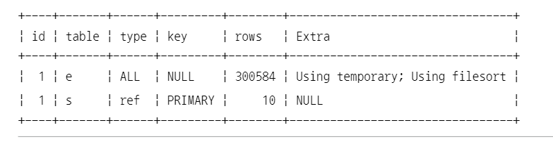</p>

<br>

### DISTINCT 처리

특정 칼럼의 유니크한 값만 조회하려면 SELECT 쿼리에 DISTINCT를 사용

DISTINCT는 MIN, MAX, COUNT 같은 집합 함수와 함께 사용되는 경우와 없는 경우 2가지로 구분

Why?

> 각 경우에 DISTINCT 키워드가 영향을 미치는 범위가 달라지기 때문

<br>

집합 함수 + DISTINCT가 사용되는 쿼리의 실행 계획에서는 DISTINCT가 인덱스를 사용하지 못할 때 항상 임시 테이블이 필요

But, 실행 계획의 Extra 칼럼에는 Using temporary 메시지 X

<br>

### SELECT DISTINCT ...

단순히 SELECT되는 레코드에서 유니크한 레코드만 가져오는 경우

이 경우 GROUP BY와 동일한 방식으로 처리

```
### 해당 두 쿼리는 내부적으로 같은 작업 수행

mysql> SELECT DISTINCT emp_no FROM salaries;

mysql> SELECT emp_no FROM salaries GROUP BY emp_no;
```

<br>

DISTINCT를 사용할 때 자주 실수하는 부분

`DISTINCT는 레코드를 유니크하게 SELECT하는 것이지, 특정 칼럼만 유니크하게 조회하는 것 X`
```
### 즉, 해당 쿼리에서 first_name만 유니크한 것을 가져오는 게 아닌 조합 전체가 유니크한 레코드를 가져옴

mysql> SELECT DISTINCT first_name, last_name FROM employees;

### 이렇게 작성하여도 괄호는 의미가 없음
mysql> SELECT DISTINCT(first_name) ...
```

<br>

### 집합 함수와 함께 사용된 DISTINCT

MIN, MAX, COUNT 같은 집합 함수와 함께 사용되는 경우는 SELECT DISTINCT와 다른 형태로 해석

`집합 함수 내에서 사용된 DISTINCT는 그 집합 함수 인자로 전달된 칼럼값이 유니크한 것들만 가져옴`

```
mysql> EXPLAIN
        SELECT COUNT(DISTINCT s.salary)
        FROM employees e, salaries s
        WHERE s.emp_no=e.emp_no
        AND e.emp_no BETWEEN 100001 AND 100100;
```

해당 쿼리는 COUNT(DISTINCT s.salary)를 처리하기 위해 임시 테이블을 사용

<p align="center">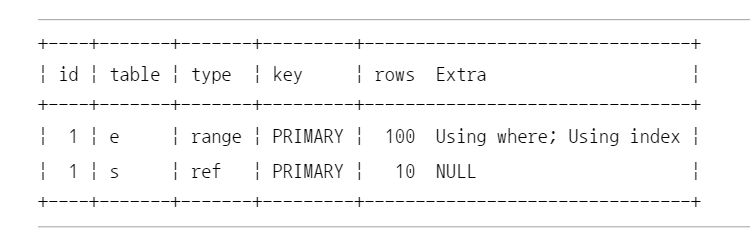</p>

<br>

employees 테이블과 salaries 테이블을 조인한 결과에서 salary 칼럼의 값만 저장하기 위한 임시 테이블을 만들어서 사용

이때 임시 테이블의 salary 칼럼에는 유니크 인덱스가 생성되기에 레코드 건수가 많아지면 느려짐

<br>

```
mysql> EXPLAIN
        SELECT COUNT(DISTINCT s.salary),
                COUNT(DISTINCT e.last_name)
        FROM employees e, salaries s
        WHERE s.emp_no=e.emp_no
        AND e.emp_no BETWEEN 100001 AND 100100;
```

해당 쿼리는 s.salary 칼럼 값을 저장하는 임시 테이블과 e.last_name 칼럼 값을 저장하는 임시 테이블이 필요하므로 총 2개의 임시 테이블 사용

<br>

`DISTINCT가 집합 함수 없이 사용된 경우와 같이 사용된 경우 쿼리의 결과가 달라지기에 차이를 꼭 이해해야 함`

```
### 예시

mysql> SELECT DISTINCT first_name, last_name
        FROM employees
        WHERE emp_no BETWEEN 10001 AND 10200;

mysql> SELECT COUNT(DISTINCT first_name), COUNT(DISTINCT last_name)
        FROM employees
        WHERE emp_no BETWEEN 10001 AND 10200;

mysql> SELECT COUNT(DISTINCT first_name, last_name)
        FROM employees
        WHERE emp_no BETWEEN 10001 AND 10200;
```

<br>

### 내부 임시 테이블 활용

MySQL 엔진이 스토리지 엔진으로부터 받아온 레코드를 정렬하거나 그루핑할 때는 내부적으로 임시 테이블을 사용

`해당 임시 테이블은 CREATE TEMPORARY TABLE 명령으로 만든 임시테이블과 다름`

MySQL 엔진이 사용하는 임시 테이블은 처음에는 메모리에 생성됐다가 테이블의 크기가 커지면 디스크로 옮겨짐

특정 예외 케이스로 바로 디스크에 임시 테이블이 만들어지기도

다른 세션이나 다른 쿼리에서는 볼 수도, 사용도 불가능

쿼리 처리가 완료되면 자동으로 삭제

<br>

### 메모리 임시 테이블과 디스크 임시 테이블

임시 테이블은 원본 스토리지 엔진과 관계없이

8.0 버전부터 메모리는 TempTable이라는 스토리지 엔진을 사용하고, 디스크에 저장되는 임시 테이블은 InnoDB를 사용

TempTable은 가변 길이 타입을 지원하고(VARBINARY, VARCHAR ..)

InnoDB는 트랜잭션 지원

<br>

internal_tmp_mem_storage_engine 시스템 변수를 이용하여 MEMORY(가변 길이 타입 지원 X)와 TempTable 선택 가능

temptable_max_ram 시스템 변수를 이용하여 TempTable이 최대 사용 가능한 메모리 공간 크기를 정할 수 있음

최대 사용 가능 메모리 공간 크기의 기본 값은 1GB이며, 1GB보다 커지는 경우 MySQL 서버는 임시 테이블을 디스크로 기록하게 되는데, 이 때 2가지 디스크 저장 방식 중 하나를 택함

- MMAP 파일로 디스크에 기록

- InnoDB 테이블로 기록

temp_use_mmap 시스템 변수로 설정이 가능, 기본값은 ON

tmpdir 시스템 변수에 정의된 디렉터리에 저장

Why?

> MMAP 파일로 전환하는 것이 InnoDB 테이블로 전환되는 것보다 오버헤드(작업을 수행하기 위해 추가적으로 필요한 리소스나 작업량)가 적기 때문에 

<br>

MySQL 서버는 디스크에 임시 테이블을 생성할 때, 파일 오픈 후 즉시 파일 삭제를 실행

Why?

> 파일이 오픈된 상태에서 삭제되면 OS는 그 파일을 즉시 삭제하지 않고, 파일 참조 프로세스가 모두 없어지면 파일을 삭제함

이렇게 함으로써 다른 스레드 or 외부 사용자가 해당 임시 테이블 파일을 변경 및 삭제를 할 수 없음

<br>

처음부터 디스크에 기록되는 경우는?

interal_tmp_disk_storage_engine 시스템 변수에 설정된 스토리지 엔진 사용, 기본값은 InnoDB

<br>

### 임시 테이블이 필요한 쿼리

대표적으로 내부 임시 테이블을 생성하는 케이스

- ORDER BY와 GROUP BY에 명시된 칼럼이 다른 쿼리

- ORDER BY와 GROUP BY에 명시된 칼럼이 조인의 순서상 첫 번째 테이블이 아닌 쿼리

- DISTINCT와 ORDER BY가 동시에 쿼리에 존재하는 경우 or DISTINCT가 인덱스로 처리되지 못하는 쿼리

- UNION이나 UNION DISTICT가 사용된 쿼리(select_type 칼럼이 UNION RESULT인 경우)
> UNION은 두 개 이상의 SELECT 문의 결과를 하나의 결과 집합으로 결합하는 연산자

- 쿼리의 실행 계획에서 select_type이 DERIVED인 쿼리

<br>

쿼리의 실행 계획에서 임시 테이블을 사용하는지는 Extra 칼럼이 Using temporary라는 메시지 확인

위의 예 중 3가지 경우는 Using temporary가 표시되지 않음에도 임시 테이블을 사용하는 경우

1 ~ 4번째 쿼리 패턴은 유니크 인덱스를 가지는 내부 임시 테이블 생성

마지막 쿼리 패턴은 유니크 인덱스가 없는 내부 임시 테이블 생성

일반적으로 유니크 인덱스가 있는 임시 테이블은 그렇지 않은 쿼리보다 처리 성능이 느림

Why?

> 유니크 확인 처리를 해야 하기 때문

<br>

### 임시 테이블이 디스크에 생성되는 경우

해당 경우 메모리 사용을 하지 않고 바로 디스크에 생성됨

- UNION이나 UNION ALL에서 SELECT되는 칼럼 중에서 길이가 512바이트 이상인 크기의 칼럼이 있는 경우

- GROUP BY나 DISTINCT 칼럼에서 512바이트 이상인 크기의 칼럼이 있는 경우

- 메모리 임시 테이블의 크기가 (MEMORY 스토리지 엔진에서) tmp_table_size 또는 max_heap_table_size 시스템 변수 값보다 크거나 (TempTable 스토리지 엔진에서) temptable_max_ram 시스템 변수 값보다 큰 경우

<br>

### 임시 테이블 관련 상태 변수

실행 계획 상 Using temporary가 표시되면 임시 테이블을 사용했다는 사실을 알 수 있음

하지만 메모리에서 처리됐는지, 디스크에서 처리됐는지 알 수 없음

몇 개의 임시 테이블이 사용됐는지도 알 수 없음

SHOW SESSION STATUS LIKE 'Created_tmp%'; 명령어로 확인 가능

```
### 세션 상태 값 초기화
mysql> FLUSH STATUS;

### SELECT 쿼리 실행
mysql> SELECT first_name, last_name
        FROM employees
        GROUP BY first_name, last_name;

### 상태 조회 명령
mysql> SHOW SESSION STATUS LIKE 'Created_tmp%';
```


<p align="center">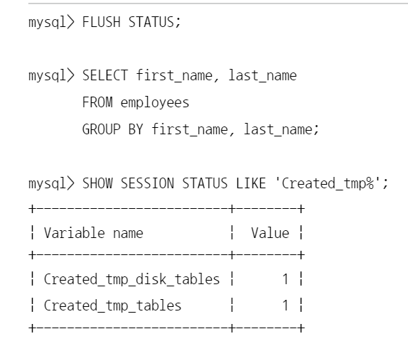</p>

<br>

- Created_tmp_tables

        쿼리의 처리를 위해 만들어진 내부 임시 테이블의 개수를 누적하는 상태 값
        메모리 or 디스크를 구분하지 않고 모두 누적

- Created_tmp_disk_tables

        디스크에 내부 임시 테이블이 만들어진 개수만 누적해서 가지고 있는 상태 값

<br>

## 고급 최적화

MySQL 서버의 옵티마이저가 실행 계획을 수립할 때 통계 정보와 옵티마이저 옵션을 결합해서 최적의 실행 계획을 수립

옵티마이저 옵션은 크게 조인 관련된 옵티마이저 옵션과 옵티마이저 스위치로 구분

옵티마이저 옵션은 조인이 많이 사용되는 서비스에서 중요

옵티마이저 스위치는 MySQL 서버의 고급 최적화 기능들의 활성화를 제어하는 용도

<br>

### 옵티마이저 스위치 옵션

optimizer_switch 시스템 변수를 이용해서 제어


<p align="center">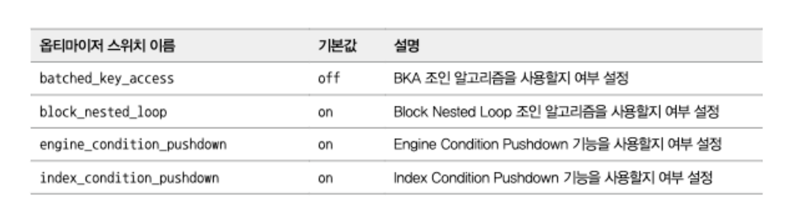</p>
<p align="center">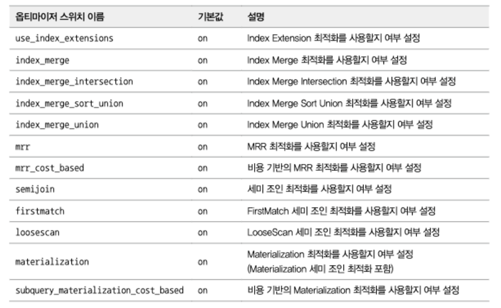</p>

<br>

옵티마이저 스위치 옵션은 글로벌과 세션별 모두 설정할 수 있는 시스템 변수이므로

 MySQL 서버 전체적으로 또는 현재 커넥션에 대해서만 다음과 같이 설정 가능

```
// MySQL 서버 전체적으로 옵티마이저 스위치 설정

mysql> SET GLOBAL optimizer_switch='index_merge=on, index_merge_union=on, ...';


// 현재 커넥션의 옵티마이저 스위치만 설정

mysql> SET SESSION optimizer_switch='index_merge=on, index_merge_union=on, ...';

// SET_VAR 옵티마이저 힌트를 이용해 현재 쿼리에만 적용 가능

mysql> /*+ SET_VAR(optimizer_switch='codition_fanout_filter=off') */
...
FROM ...
```

### MBR과 배치 키 액세스(mrr & batched_key_access)

MRR은 'Multi-Range Read'의 줄임말

MySQL 서버에서 지금까지 지원하던 조인 방식은 드라이빙 테이블(조인에서 제일 먼저 읽는 테이블)의 레코드를 하나하나 읽어서 

드리븐 테이블(조인되는 테이블에서 드라이빙에 아닌 테이블들)의 일치하는 레코드를 찾아서 조인을 수행하는 것 

이것이 NL 조인

조인 처리는 MySQL 엔진이 처리하지만 실제 레코드를 검색하고 읽는 부분은 스토리지 엔진 담당

이 때 드라이빙 테이블의 레코드 건별로 드리븐 테이블의 레코드르 찾으면 레코드를 찾고 읽는 스토리지 엔진에서는 아무런 최적화가 불가

<br>

해당 단점을 보완하기 위해 MySQL 서버는 조인 대상 테이블 중 하나로부터 레코드를 읽어서 조인 버퍼에 버퍼링

즉, 드라이빙 테이블의 레코드를 읽어서 드리븐 테이블과의 조인을 즉시 실행하지 않고 조인 대상을 버퍼링

조인 버퍼에 레코드가 가득 차면 MySQL 엔진은 버퍼링된 레코드를 스토리지 엔진으로 한 번에 요청

이렇게 함으로써 스토리지 엔진은 읽어야 할 레코드들을 데이터 페이지에 정렬된 순서로 접근해서 디스크의 데이터 페이지 읽기를 최소화

데이터 페이지가 메모리(InnoDB 버퍼 풀)에 있다고 하더라도 버퍼 풀의 접근을 최소화한다는 것


```
### 쉽게 설명하자면

1. MySQL 서버는 먼저 드라이빙 테이블(Driving Table)에서 레코드를 읽어옵니다.

2. 읽어온 레코드들은 조인 버퍼(Join Buffer)에 임시로 저장됩니다.

3. 조인 버퍼가 가득 차면, MySQL 엔진은 버퍼링된 레코드들을 스토리지 엔진(Storage Engine)으로 한꺼번에 요청합니다.

4. 스토리지 엔진은 드리븐 테이블(Driven Table)과 조인 버퍼의 레코드들을 조인합니다.

5. 조인된 결과가 조인 결과(Join Result)에 저장됩니다.

이러한 프로세스를 통해 MySQL은 메모리 사용량을 최적화하고, 디스크 I/O를 줄여 조인 성능을 개선합니다. 
조인 버퍼를 사용함으로써 한 번에 많은 레코드를 읽어올 수 있기 때문입니다.
```

해당 읽기 방식을 MRR이라고 하며, 이것을 응요해서 실행되는 조인 방식을 BKA(Batched Key Access) 조인이라고 함

But, BKA 조인 최적화는 기본 설정이 비활성화인데, 부가적인 정렬 작업이 필요해지면서 오히려 성능에 안좋을 수 있기 때문

<br>

### 블록 네스티드 루프 조인(block_nested_loop)

MySQL에서 사용되는 대부분의 조인은 NL 조인인데 조인의 연결 조건이 되는 칼럼에 모두 인덱스가 있는 경우 사용되는 조인 방식

```
// first_name 조건에 일치하는 레코드 1건을 찾아서 salaries 테이블의 일치하는 레코드를 찾는 형태의 조인

mysql> EXPLAIN
        SELECT *
        FROM employees e
        INNER JOIN salaries s ON s.emp_no=e.emp_no
                AND s.from_date<=NOW()
                AND s.to_date>=NOW()
        WHERE e.first_name='Amor';
```

NL 조인과 BNL 조인의 가장 큰 차이는 조인 버퍼가 사용되는지 여부와 조인에서 드라이빙 테이블과 드리븐 테이블이 어떤 순서로 조인되느냐

조인 쿼리의 실행 계획 Extra 칼럼에 "Using Join buffer"라고 표시되면 조인 버퍼를 사용한다는 의미

<br>

조인은 드라이빙 테이블에서 일치하는 레코드의 건수만큼 드리븐 테이블을 검색하면서 처리

즉, 드라이빙 테이블은 한 번에 쭉 읽지만, 드리븐 테이블은 여러 번 읽는다는 것을 의미

예를 들어, 드라이빙 테이블에서 일치하는 레코드가 1000건이었는데

드리븐 테이블의 조인 조건이 인덱스를 이용할 수 없었다면 드리븐 테이블에서 연결되는 레코드를 찾기 위해 1000번의 풀 테이블 스캔을 진행

그래서 옵티마이저는 최대한 드리븐 테이블의 검색이 인덱스를 사용할 수 있게 실행 계획을 수립

<br>

But, 어떤 방식으로도 드리븐 테이블의 풀 테이블 스캔이나 인덱스 풀 스캔을 피할 수 없다면

옵티마이저는 드라이빙 테이블에서 읽은 레코드를 메모리에 캐시한 후 드리븐 테이블과 이 메모리 캐시(조인 버퍼)를 조인하는 형태로 처리

조인이 완료되면 조인 버퍼는 바로 해제

<p align="center">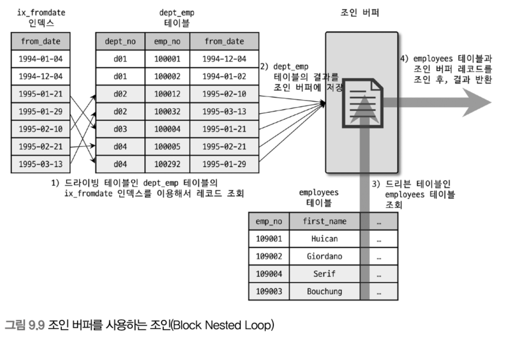</p>

<br>

실제 드라이빙 테이블의 결과는 조인 버퍼에 담아두고, 드리븐 테이블을 먼저 읽고 조인 버퍼에서 일치하는 레코드를 찾는 방식으로 처리

> 8.0.18 버전부터 해시 조인 알고리즘이 도입됐고, 8.0.20 버전부터 BNL 조인이 사용되지 않고 해시 조인 알고리즘으로 대체

<br>

### 인덱스 컨디션 푸시다운(index_condition_pushdown)

(last_name, first_name) 으로 생성된 인덱스가 있다고 가정

optimizer_swtich='index_condition_pushdown=off' 명령어로 인덱스 컨디션 푸시 다운 비활성화

```
SELECT * FROM employees WHERE last_name='Acton' AND first_name LIKE '%sal';
```

해당 쿼리는 인덱스 레인지 스캔으로 검색해야 할 인덱스 범위를 좁힐 수 없음

Why?

%가 앞 쪽에 있기에 인덱스 활용 불가

그래서 데이터를 모두 읽은 후 사용자가 원하는 결과인지 하나씩 비교해보는 조건(필터링 조건)으로만 사용됨

해당 쿼리의 실행 계획은 Using where로 표시

<p align="center">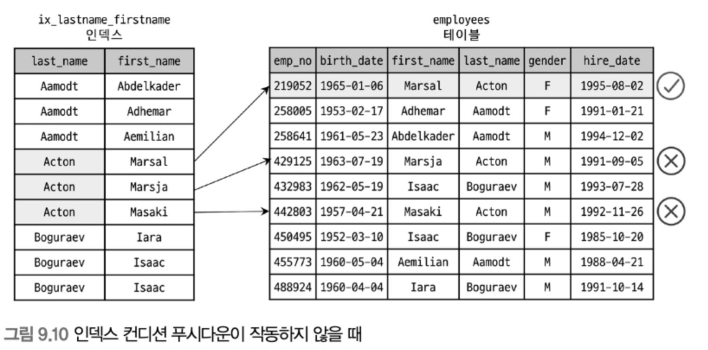</p>

<br>

last_name='Acton' 조건으로 인덱스 레인지 스캔을 하고 테이블의 레코드를 읽은 후 first_name LIKE '%sal' 조건에 부합되는지 여부 비교

만약 last_name='Acton' 조건과 일치하는 레코드가 10만 건인데 그 중 1건만 first_name LIKE '%sal' 조건에 맞는다면 99,999건의 레코드 읽기가 불필요

<br>

한 번만 더 생각해보면 이미 한 번 읽은 인덱스의 first_name 컬럼을 이용하지 않고 왜 다시 테이블의 레코드를 읽어서 처리했을까?

인덱스의 first_name 칼럼을 이용해서 비교했다면 불필요한 2건의 레코드는 테이블에서 읽지 않아도 됐을 텐데

사실 first_name LIKE '%sal' 조건은 어떤 엔진이 처리하느냐에 인덱스에 포함된 first_name 칼럼을 이용할지 또는 테이블의 first_name 칼럼을 이용할지 결정

인덱스 비교는 InnoDB가 맡는 반면, 테이블의 레코드에서 first_name 조건을 비교하는 작업은 MySQL 엔진이 수행하는 작업

<br>

5.6 버전 이후에는 인덱스 범위 제한 조건을 사용하지 못해도 인덱스에 포함된 칼럼의 조건이 있다면 모두 모아 스토리지 엔진으로 전달할 수 있게 핸들러 API가 개선

<p align="center">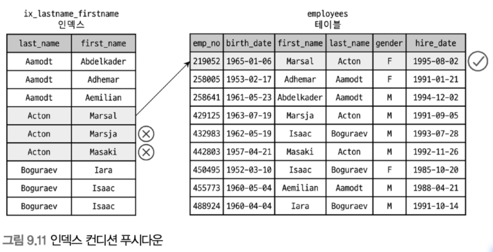</p>

<br>

실행 계획을 살펴보면 Using index condition이 출력

<br>

### 인덱스 확장(use_index_extensions)

InnoDB 스토리지 엔진을 사용하는 테이블에서 세컨더리 인덱스에 자동으로 추가된 PK를 활용할 수 있게 할지를 결정하는 옵션

세컨더리 인덱스에 자동으로 추가된 PK의 의미와 장점은?

`InnoDB는 PK를 클러스터링 키로 생성`

그래서 모든 세컨더리 인덱스는 리프 노드에 PK 값을 가짐

```
mysql> CREATE TABLE dept_emp (
        emp_no INT NOT NULL,
        dept_no CHAR(4) NOT NULL,
        from_date DATE NOT NULL,
        to_date DATE NOT NULL,
        PRIMARY KEY (dept_no, emp_no), // PK 인덱스
        KEY ix_fromdate (from_date) // 세컨더리 인덱스
) ENGINE=InnoDB;
```

세컨더리 인덱스는 데이터 레코드를 찾아가기 위해 PK인 dept_no, emp_no 칼럼을 순서대로 포함

그래서 최종적으로 ix_fromdate 인덱스는 (from_date, dept_no, emp_no) 조합으로 인덱스를 생성한 것과 흡사하게 작동

MySQL 서버가 업그레이드되면서 옵티마이저는 ix_fromdate 인덱스의 마지막에  (dept_no, emp_no) 칼럼이 숨어있다는 것을 인지하고 실행 계획을 수립

<br>

<p align="center">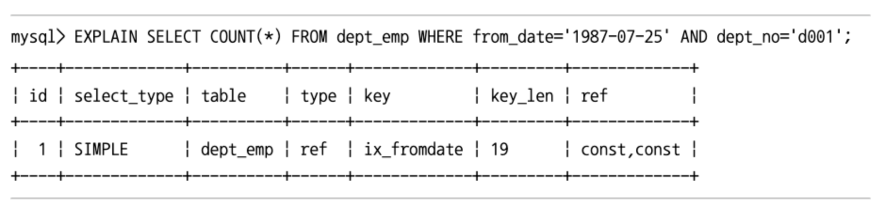</p>

<br>

key_len 칼럼은 이 쿼리가 인덱스를 구성하는 칼럼 중에서 어느 부분(칼럼)까지 활용했는지를 바이트 수로 보여줌

이 예제에서 19바이트가 표시된 것을 보면 from_date 칼럼(3바이트)과 dept_emp 칼럼(16바이트)까지 사용했다는 것을 알 수 있음

<br>

뿐만 아니라, InnoDB의 PK가 세컨더리 인덱스에 포함돼어 있으므로 다음과 같이 정렬 작업도 인덱스를 활용해서 처리되는 장점도 있음

<p align="center">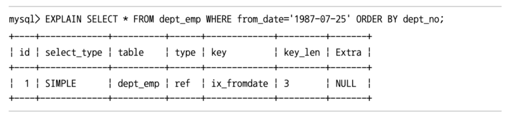</p>

<br>

Using filesort가 표시되지 않았다는 것은 MySQL 서버가 정렬 작업 없이 인덱스 순서대로 레코드를 읽기만 함으로써 ORDER BY 조건을 만족했다는 것을 의미

<br>

### 인덱스 머지(index_merge)

인덱스를 이용해 쿼리를 실행하는 경우, 대부분 옵티마이저는 테이블 별로 하나의 인덱스만 사용하도록 실행 계획을 수립

Why?

쿼리에서 한 테이블에 대한 WHERE 조건이 여러 개 있더라도 하나의 인덱스에 포함된 칼럼에 대한 조건만으로 인덱스를 검색하고

나머지 조건은 읽어온 레코드에 대해서 체크하는 형태로만 사용하는 것이 일반적

작업 범위를 줄일 수 있기 떄문

But,

쿼리에 사용된 각각의 조건이 서로 다른 인덱스를 사용할 수 있고 그 조건을 만족하는 레코드 건수가 많을 것으로 예상될 때 인덱스 머지 실행 계획 선택

<br>

인덱스 머지 실행 계획은 다음과 같이 3개의 세부 실행 계획으로 나뉨

각격의 결과를 어떤 방식으로 병합할지에 따라 구분

- index_merge_intersection

- index_merge_sort_union

- index_merge_union

### 인덱스 머지 - 교집합(index_merge_intersection)

```
mysql>  SELECT *
        FROM employees 
        WHERE first_name='Georgi' AND emp_no BETWEEN 10000 AND 20000;
```

해당 쿼리는 2개의 WHERE 조건

employees 테이블의 first_name 칼럼과 emp_no 칼럼 모두 각각의 인덱스 (ix_firstname, PRIMARY)를 가지고 있음

즉, 2개 중 어떤 조건을 사용하더라도 인덱스를 사용 가능

Extra 칼럼을 보면 Using intersect라고 표시

여러 개의 인덱스를 각각 검색해서 그 결과의 교집합만 반환했다는 것을 의미

<br>

근데 왜 하나만 사용해도 되는데 2개를 모두 사용했을까?

옵티마이저가 각각 조건에 일치하는 레코드 건수를 예측해본 결과 두 조건 모두 별로였기 때문

예를 들어 first_name 조건만 인덱스를 사용했다면 253건을 검색하고 emp_no 칼럼의 조건에 일치하는 레코드들만 반환하는 형태로 처리

emp_no로 했다면 PK를 이용해 10000건을 읽어와서 first_name 조건에 일치하는 레코드를 반환했을 것

그런데 실제 두 조건을 만족하는 레코드 건수는 14건이었기에 두 작업 모두 비효율이 매우 큰 상황이어서 옵티마이저는 intersect를 선택

<br>

### 인덱스 머지 - 합집합(index_merge_union)

Extra 칼럼에 표시되는 Using union은 WHERE 절에 사용된 2개 이상의 조건이 각각의 인덱스를 사용하되 OR 연산자로 연결되는 경우 사용되는 최적화

```
mysql>  SELECT *
        FROM employees 
        WHERE first_name='Matt' OR hire_date='1987-03-31';
```

해당 쿼리는 2개의 조건이 OR로 연결된 쿼리로 각각 인덱스로 준비

이럴 때 Using union 사용

<p align="center">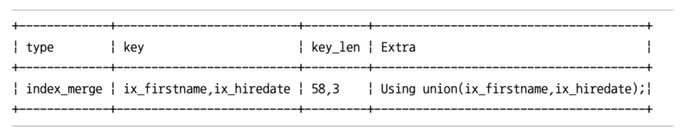</p>

<br>

실행 계획에서 Using union(ix_firstname, ix_hiredate); 라고 표시

이는 두 인덱스의 검색 결과를 Union 알고리즘으로 병합했다는 것을 의미

여기서 병합은 두 집합의 합집합을 가져왔다는 것을 의미

<br>

Union 알고리즘의 비밀

예제 쿼리에서 first_name='Matt' AND hire_date='1987-03-31'인 사원이 있었다면?

양쪽 결과에 포함돼 있을텐데 그 사원의 정보가 2번 출력되지 않음

Why?

중복 레코드를 제거했다는 의미인데 중복 레코드를 제거하기 위해서는 정렬 작업이 필요

근데 실행 계획에서는 Using filesort가 표시 X

How?

<p align="center">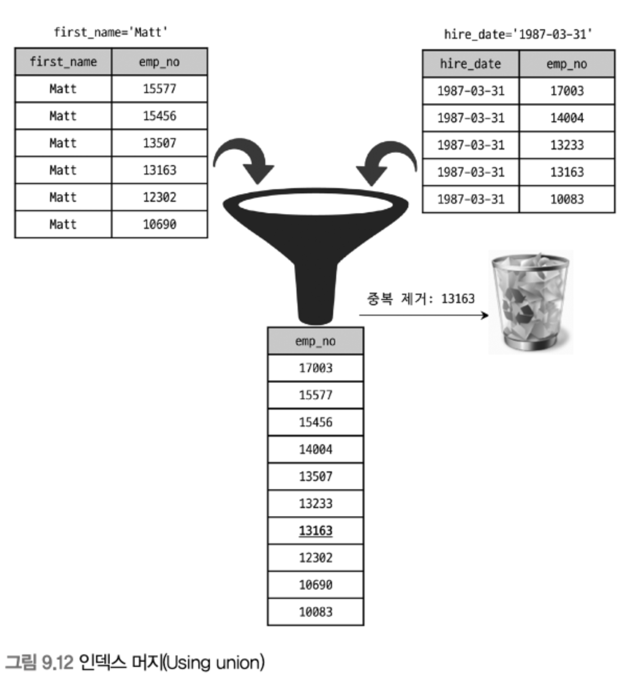</p>

<br>

MySQL은 이미 first_name 검색 결과와 hire_date 검색 결과가 PK로 정렬돼 있다는 것을 알고 있음

그래서 emp_no(PK) 칼럼의 값으로 비교를 하면서 정렬 없이 걸러낼 수 있는 것

이런 알고리즘을 우선순위 큐라고 함

```
### 우선 순위 큐

데이터들이 각각의 우선순위를 가지고 있어 우선순위가 높은 데이터가 먼저 나가게 되는 자료구조입니다. 

일반적인 큐가 FIFO(First-In-First-Out) 방식으로 동작하는 반면, 우선순위 큐는 우선순위가 가장 높은 데이터가 먼저 나오게 됩니다.
```

<br>

### 인덱스 머지 - 정렬 후 합집합(index_merge_sort_union)

인덱스 머지 작업을 하는 도중 결과의 정렬이 필요하다면?

Sort union 알고리즘을 사용

```
mysql>  SELECT *
        FROM employees 
        WHERE first_name='Matt' 
        OR hire_date='1987-03-31' AND '1987-04-30';
```

OR을 기준으로 두 개의 쿼리로 분리

첫 번째 쿼리는 결과가 emp_no로 정렬되어 출력되지만, 두 번쨰 쿼리의 결과는 emp_no 칼럼으로 정렬 X

Why?

BETWEEN A AND B 문장이기 때문에 테이블에 hire_date가 저장된 순서대로 결과가 나올 것임

즉, 해당 쿼리의 결과는 중복을 제거하기 위해 우선순위 큐를 사용하는 것이 불가능

그래서 각 집합을 emp_no로 정렬한 후 중복을 제거

<p align="center">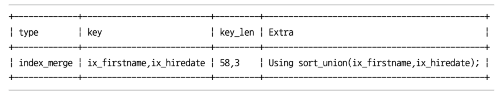</p>

<br>

<br>

### 세미 조인

세미 조인은 다른 테이블과 실제 조인을 수행하지는 않고 조건에 일치하는 레코드가 있는지 없는지만 체크하는 형태의 쿼리

5.7 서버는 세미 조인 형태의 쿼리를 최적화하는 부분이 취약했음

```
mysql> SELECT *
        FROM employees e
        WHERE e.emp_no IN
                (SELECT de.emp_no FROM dept_emp WHERE de.from_date='1995-01-01');
```

세미 조인 최적화가 도입되기 전 어떻게 처리됐을까?

dept_emp 테이블을 조회하는 서브쿼리 부분이 먼저 실행되고 그다음 employees 테이블에서 일치하는 레코드만 검색할 것으로 기대

But, employees 테이블을 풀 스캔하면서 한 건 한 건 서브쿼리의 조건에 일치하는지 비교

매우 비효율적

<br>

세미 조인 형태의 쿼리와 안티 세미 조인 쿼리의 형태는 최적화 방법이 차이가 있음

세미 조인 최적화는 해당 최적화 전략을 모은 것

- Table Pull-out

- Duplicate Weeed-out

- First Match

- Loose Scan

- Materialization

각각 전략들은 테이블과 조인 조건의 특성에 따라 옵티마이저가 선별적으로 사용

table pull-out은 사용 가능하면 항상 세미 조인보다는 좋은 성능이기에 별도 제어 옵션이 없고

나머지 전략들은 옵션으로 켜고 끌 수 있음

```
세미 조인(Semi Join)은 내부 조인과 비슷하지만, 한 쪽 테이블의 행만 반환하는 특징

세미 조인에는 크게 두 가지 형태

1. IN 형태

예시

SELECT e.emp_name, e.salary
FROM employees e
WHERE e.dept_id IN (
SELECT d.dept_id
  FROM departments d
  WHERE d.location = 'New York'
);

이 쿼리는 뉴욕에 있는 부서에 소속된 직원의 이름과 급여를 반환

2. EXISTS 형태

SELECT c.cust_name, c.city
FROM customers c
WHERE EXISTS (
  SELECT 1
  FROM orders o
  WHERE o.cust_id = c.cust_id
    AND o.order_date >= '2023-01-01'
);

이 쿼리는 2023년 1월 1일 이후에 주문한 고객의 이름과 도시를 반환

세미 조인은 내부 조인과 달리 한 쪽 테이블의 행만 반환하므로,
불필요한 중복을 제거하고 성능을 향상
```


### 테이블 풀-아웃 (Table Pull-out)

Table pullout 최적화는 세미 조인에 사용된 테이블을 아우터 쿼리로 끄집어낸 후 쿼리를 조인 쿼리로 재작성하는 형태의 최적화

이는 서브쿼리 최적화가 도입되기 이전에 수동으로 쿼리를 튜닝하던 대표적 방법

```
/// 부서 번호가 d009인 부서에 소속된 모든 사원을 조회하는 쿼리
/// IN 형태의 세미 조인이 가장 빈번하게 사용되는 형태의 쿼리

mysql> EXPLAIN
        SELECT * FROM employees e
        WHERE e.emp_no IN (SELECT de.emp_no FROM dept_emp de WEHRE de.dept_no='d009');

/// dept_emp 테이블에서 부서 번호가 d009인 사원 번호를 조회한 후 해당 레코드들과 일치하는 employees 테이블의 레코드들의 전체 컬럼을 가져와라
```

### 쿼리 실행 계획

가장 중요한 부분은 id 칼럼의 값이 모두 1이라는 것 

> MySQL 쿼리 실행 계획에서 id 컬럼은 각 실행 단계의 순서를 나타냄

이 값이 동일한 값을 가진다는 것은 두 테이블이 서브쿼리 형태가 아니라 조인으로 처리됐음을 의미

<br>

Table pullout 최적화는 Extra 칼럼에 Using table pullout과 같은 문구가 출력되지 않기에

실행 계획에서 해당 테이블들의 id 칼럼 값이 같은지 + Extra 칼럼에 아무것도 출력되지 않는 경우에 Table pullout 최적화가 사용됐다는 것

`"최대한 서브쿼리를 조인으로 풀어서 사용해라"라는 튜닝 가이드는 사실 Table pullout 최적화를 그대로 실행하는 것`

<br>

### 퍼스트 매치(firstmatch)

First Match 최적화 전략은 IN(subquery) 형태의 세미 조인을 EXISTS(subquery) 형태로 튜닝한 것과 비슷한 방법으로 실행

```
/// 이름이 'Matt'인 사원 중에서 1995년 1월 1일부터 30일 사이에 직급이 변경된 적이 있는 사원을 조회하는 쿼리

mysql> EXPLAIN
        SELECT * FROM employees e WHERE e.first_name='Matt'
        AND e.emp_no IN (
        SELECT t.emp_no FROM titles t
        WHERE t.from_date BETWEEN '1995-01-01' AND '1995-01-30'
        );

/// dept_emp 테이블에서 부서 번호가 d009인 사원 번호를 조회한 후 해당 레코드들과 일치하는 employees 테이블의 레코드들의 전체 컬럼을 가져와라
```
<p align="center">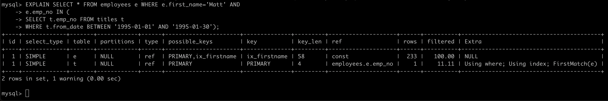</p>

id 칼럼의 값이 1이며, Extra 칼럼에 FirstMatch(e)라는 문구 출력

id 칼럼의 값이 1로 표시된 것으로 봐서는 조인으로 처리됐음을 알 수 있고,

FirstMatch(e) 문구는 e 테이블의 레코드에 대해서 titles 테이블에 일치하는 레코드 1건만 찾으면 더이상의 titles 테이블 검색을 하지 않는다는 것을 의미

의미론적으로 EXISTS(subquery)와 동일하게 처리

<p align="center">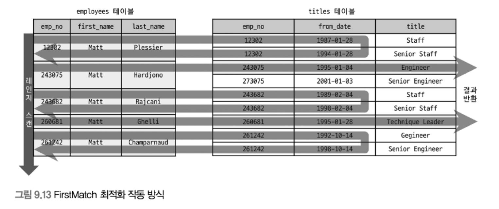</p>

<br>


IN-to-EXISTS 변환과 비슷한 처리 로직을 수행하지만 그에 비해 First Match의 장점은 더 많은 조건이 주어지며 서브쿼리의 모든 테이블에 대해 First Match 최적화를 수행할지, 일부 테이블에서만 수행할지 선택이 가능

FirstMatch 최적화의 몇가지 제한 사항과 특성

- `하나의 레코드만 검색되면 더 이상 검색을 멈추는 단축 실행 경로이기에 그 서브 쿼리가 참조하는 모든 아우터 테이블이 먼저 조회된 이후에 실행`


### 루스 스캔(loosescan)

Using index for group by의 루스 인덱스 스캔과 비슷한 읽기 방식을 사용

dept_emp 테이블에 존재하는 모든 부서 번호에 대해서 부서 정보를 읽어오기 위한 쿼리

<p align="center">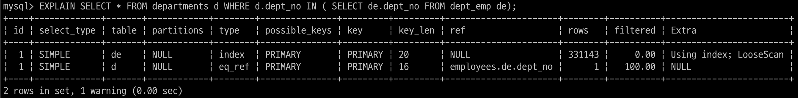</p>

<br>

firstmatch, materialization, duplicateweedout을 끄고 진행하였음

departments 테이블의 레코드 건수는 9건밖에 되지 않지만 dept_emp의 레코드 건수는 약 33만개

dept_emp 테이블에는 (dept_no + emp_no) 조합으로 PK

하지만 dept_no를 기준으로 그루핑해보면 9개밖에 없음

그렇다면 dept_emp 테이블의 PK를 루스 인덱스 스캔으로 유니크한 dept_no만 읽으면 효율적으로 처리 가능

<p align="center">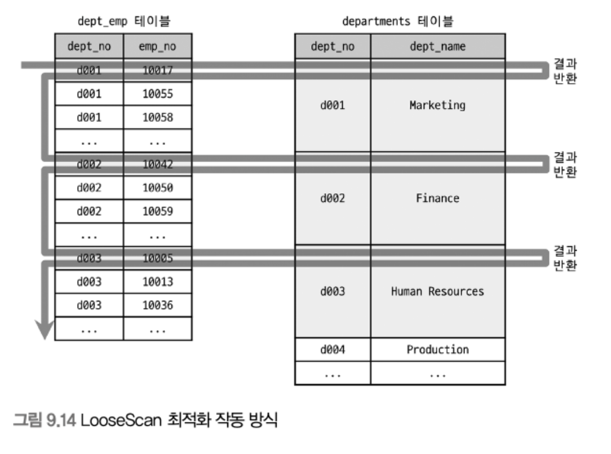</p>

<br>

LooseScan 최적화 특성

- 서브쿼리 테이블을 읽고, 아우터 테이블을 드리븐으로 사용해서 조인 수행

### 구체화(Materialization)

세미 조인에 사용된 서브쿼리를 통째로 구체화해서 쿼리를 최적화한다는 의미

구체화를 쉽게 표현하면 내부 임시 테이블을 생성한다는 의미

<p align="center">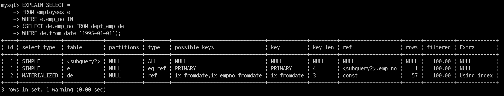</p>

<br>

1995년 1월 1일 조직이 변경된 사원들의 목록을 조회하는 쿼리는 IN (subquery) 포맷의 세미 조인을 사용하는 예제

이 쿼리는 FirstMatch 최적화를 사용하면 employees 테이블에 대한 조건이 서브쿼리 이외에는 아무것도 없기 때문에 employees 테이블을 풀 스캔해서 성능 향상에 도움이 되지 않음

서브 쿼리 구체화 최적화

테이블은 2개인데 3개의 라인이 출력된 것만 봐도 임시 테이블이 생성됐음을 알고 있음

dept_emp 테이블을 읽는 서브 쿼리가 먼저 실행되어 그 결과로 임시테이블(<subquery2>)이 만들어짐

그 테이블과 employees 테이블을 조인해서 결과를 반환

### 중복 제거 (Duplicated Weed out)

세미 조인 서브 쿼리를 일반적인 INNER JOIN 쿼리로 바꿔서 실행하고 마지막에 중복된 레코드를 제거하는 방법으로 처리

<p align="center">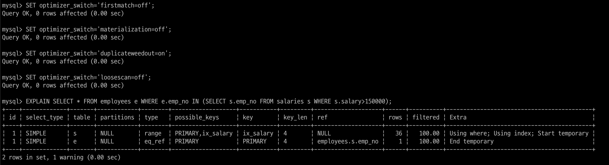</p>

<br>

급여가 150000 이상인 사원들의 정보를 조회하는 쿼리

INNER JOIN + GROUP BY 절로 바꿔서 실행하는 것과 동일한 작업으로 쿼리를 처리

<p align="center">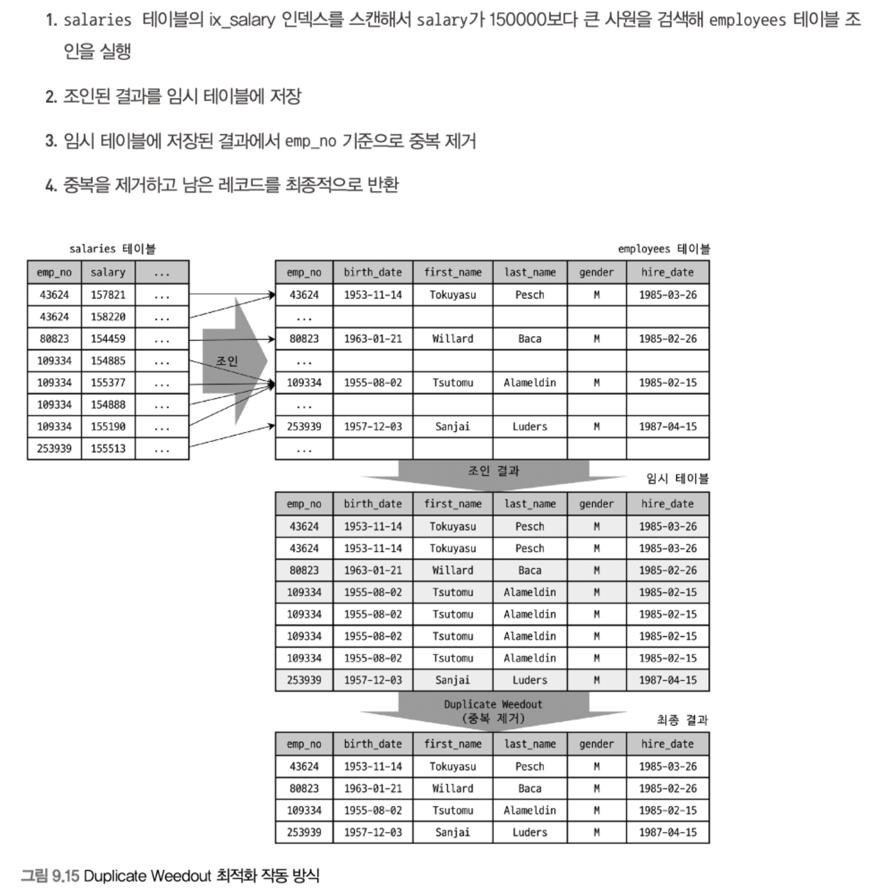</p>

<br>

### 컨디션 팬아웃

조인을 실행할 때 테이블의 순서는 쿼리의 성능에 매우 큰 영향

여러 테이블이 조인되는 경우 가능하다면 일치하는 레코드 건수가 적은 순서대로 조인을 실행

<p align="center">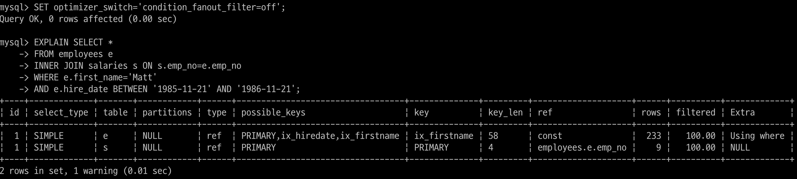</p>

<br>

employees 테이블에서 이름이 Matt이면서 입사 일자가 '1985-11-21'부터 '1986-11-21'사이인 사원을 검색해 해당 사원의 급여를 조회하는 쿼리

해당 쿼리의 절차

1. employees 테이블에서 first_name 인덱스를 사용해서 Matt 이름을 가진 사원 약 233개의 row를 추출

2. 드리븐 테이블로 salaries 테이블이 사용되고 emp_no로 둘이 조인

3. employees 테이블의 레코드 한 건당 salaries 테이블의 레코드가 10건이 일치할 것으로 예상

<p align="center">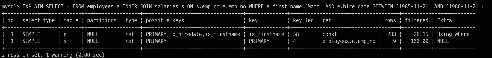</p>

<br>

filtered 칼럼의 값이 100%가 아니라 26.15%로 변경됐음

first_name 칼럼 조건 이외의 나머지 조건 (hire_date 칼럼 조건)에 대해서도 얼마나 조건을 충족할지 고려했다는 뜻

컨디션 팬아웃은 더 정교한 계산을 거쳐서 실행 계획을 수립하지만 더 많은 시간과 컴퓨팅 자원을 사용하게 됨

<br>

### 스킵 스캔

인덱스의 핵심은 값이 정렬되어 있음 그래서 구성하는 칼럼의 순서가 중요

스킵 스캔을 사용하면 후행 칼럼의 조건만으로도 인덱스를 활용 가능

단 조건이 인덱스의 선행 칼럼이 소수의 유니크한 값을 가질 때만!

### 해시 조인

NL 조인보다 해시 조인이 빠르다고 생각하지만

항상 옳지는 않은 이야기

<p align="center">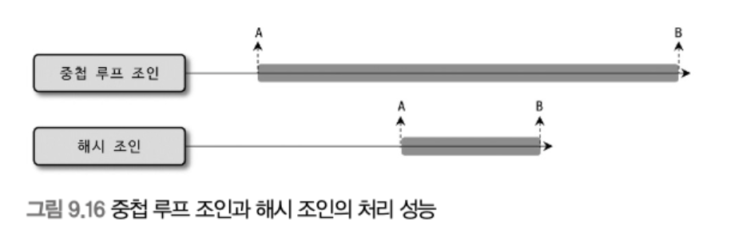</p>

<br>

화살표의 길이는 전체 쿼리의 실행 시간

NL 조인과 해시 조인은 똑같은 시점에 시작했지만 해시 조인이 먼저 끝났음

하지만 처음 레코드를 찾은 것은 NL 조인 

즉, 해시 조인은 최고 스루풋 전략에 적합

NL 조인은 최고 응답 속도 전략에 적합

일반적인 웹서비스는 OLTP 이기에 응답 속도가 더 중요

MySQL의 해시 조인은 NL을 사용하기에 적합하지 않을 때 차선책 같은 기능으로 생각하는 것이 좋음

<p align="center">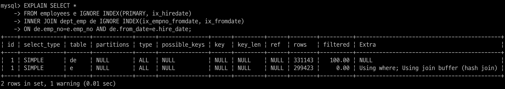</p>

<br>

일반적으로 해시 조인은 빌드 단계(Build phase)와 프로브 단계(Probe phase)로 나뉘어 처리

빌드 단계에서는 조인 대상 테이블 중에서 레코드 건수가 적어서 해시 테이블로 만들기 용이한 테이블을 골라 메모리에 해시 테이블을 생성(빌드)하는 작업을 수행

빌드 단계에서 해시 테이블을 만들 때 사용되는 원본 테이블을 빌드 테이블이라고 함

프로브 단계는 나머지 테이블의 레코드를 읽어서 해시 테이블의 일치 레코드를 찾는 과정을 의미

<p align="center">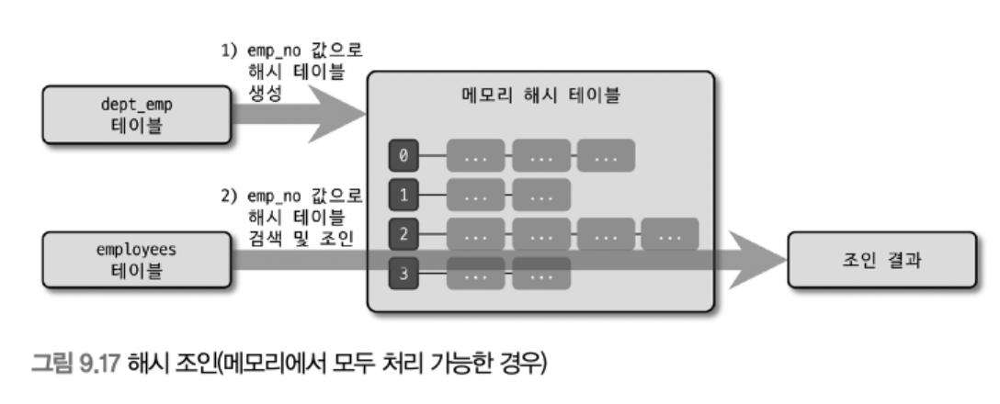</p>

해시 조인을 위해서 빌드 테이블인 dept_emp 테이블의 레코드를 읽어서 메모리에 해시 테이블을 생성

프로브 테이블인 employees 테이블을 스캔하면서 메모리에 생성된 해스 테이블에서 레코드를 찾아서 결과를 사용자에게 반환

<p align="center"></p>

해시 테이블을 메모리에 저장할 때 join_buffer_size 변수 사용

만약 해시 테이블의 레코드 건수가 많아 조인 버퍼의 공간이 부족하다면

빌드 테이블과 프로브 테이블을 적당한 크기(하나의 청크가 조인 버퍼보다 작도록)의 청크로 분리한 다으

위의 방식과 동일 방식으로 처리

근데 만들어질 해시 테이블이 join_buffer_size보다 큰지를 알 수 없기 때문

dept_emp 테이블을 읽으면서 메모리의 해시 테이블을 준비하다가 join_buffer_size를 넘어서면 나머지 레코드를 청크로 구분해서 저장


<p align="center">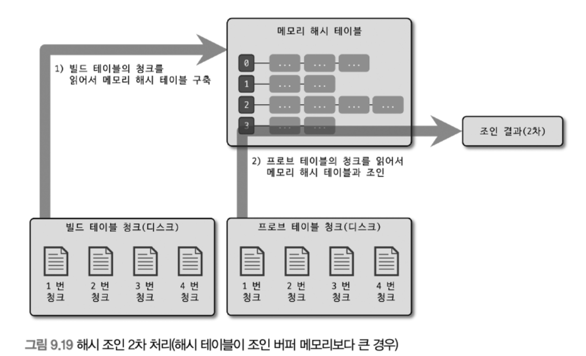</p>

1차 조인이 완료되면 디스크에 저장된 빌드 테이블 청크에서 첫번째 청크를 읽어서 다시 메모리 해시 테이블을 구축

이렇게 청크 단위로 조인을 수행하기 위해 2차 해시 함수를 이용해 빌드 테이블과 프로브 테이블을 동일 개수의 청크로 쪼개어 디스크로 저장

## 조인 최적화 알고리즘

조인 쿼리의 실행 계획 최적화를 위한 2개의 알고리즘

### Exhaustive 검색 알고리즘

<p align="center">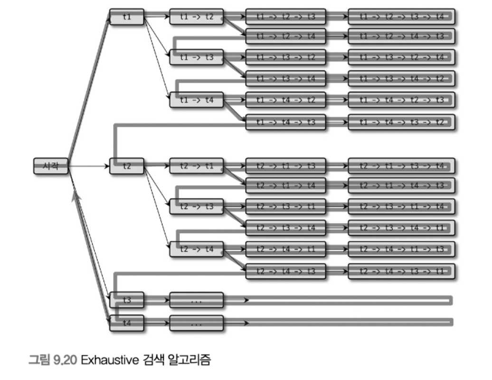</p>

<br>

5버전 이전에서 사용되던 조인 최적화 기법

FROM 절에 명시된 모든 테이블 조합에 대해 실행 계획의 비용을 계산해서 최적의 조합 1개를 찾는 방법

### Greedy 검색 알고리즘


<p align="center">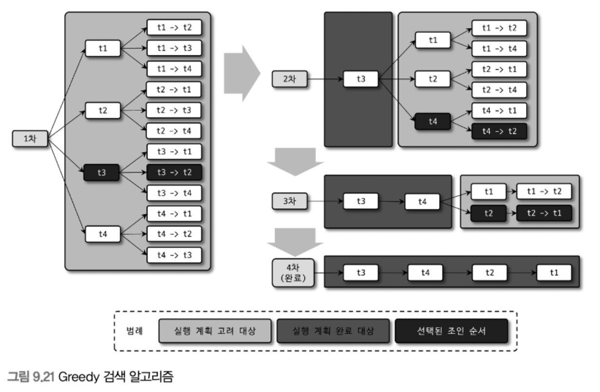</p>

<br>

Exhaustive 검색 알고리즘의 시간 소모적인 문제점을 해결하기 위해 5.0부터 도입된 조인 최적화 기법

<p align="center">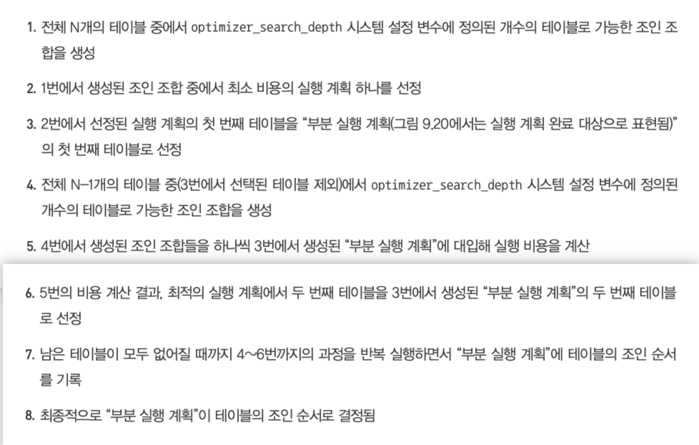</p>


