# 10장. 실행계획

DBMS는 `많은 데이터를 안전하게 저장 및 관리하고 사용자가 원하는 데이터를 빠르게 조회`할 수 있게 해주는 것이 주목적

옵티마이저가 최적으로 처리될 수 있게 하는 쿼리의 실행 계획 수립 중요

But, 옵티마이저가 개입 없이 항상 좋은 실행 계획을 만들어낼 수 있는 것은 X

EXPLAIN 명령으로 실행 계획 확인

<br>

MySQL 서버가 데이터를 처리하는 로직을 이해할 필요

해당 장에서는 통계 정보, 실행 계획 읽는 순서, 출력 키워드, 알고리즘에 대해서 공부

<br>

## 통계 정보

5.7 버전까지는 테이블 칼럼의 값들이 실제 어떻게 분포돼 있는지에 대한 정보가 없어 실행 계획의 정확도가 떨어지는 경우가 다수

8.0 버전 부터는 인덱스되지 않은 칼럼에 대해서도 데이터 분포도의 히스토그램 정보가 도입

<br>

### 테이블 및 인덱스 통계 정보

```
RBO의 경우 예측이 가능하며, 안정적이고 플랜의 제어가 쉬움 
이런 이유 때문에 일부 DBA나 고급 개발자들은 이 방식을 선호

CBO의 경우 예측 불가능하고 플랜의 제어가 쉽지 않음
간혹 잘못된 실행 계획을 제공하는 경우도 존재

첫째, 최적의 인덱스 구성하기
둘째, 올바른 SQL문 작성하기
셋째, 주기적이거나 혹은 최신의 통계정보 갱신하기
넷째, 힌트절 추가해 옵티마이저 제어하기
```

CBO에서 가장 중요한 것은 통계 정보

정확하지 않다면 전혀 엉뚱한 방향으로 쿼리를 실행하기 때문

MySQL 서버에서는 쿼리의 실행 계획을 수립할 때 실제 테이블의 데이터를 일부 분석해서 통계 정보를 보완해서 사용

<p align="center">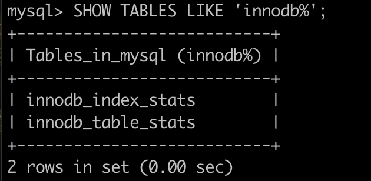</p>

MySQL DB에 존재하는 innodb_index_stats, innodb_table_stats에서 통계 정보를 확인 및 관리 가능

<p align="center">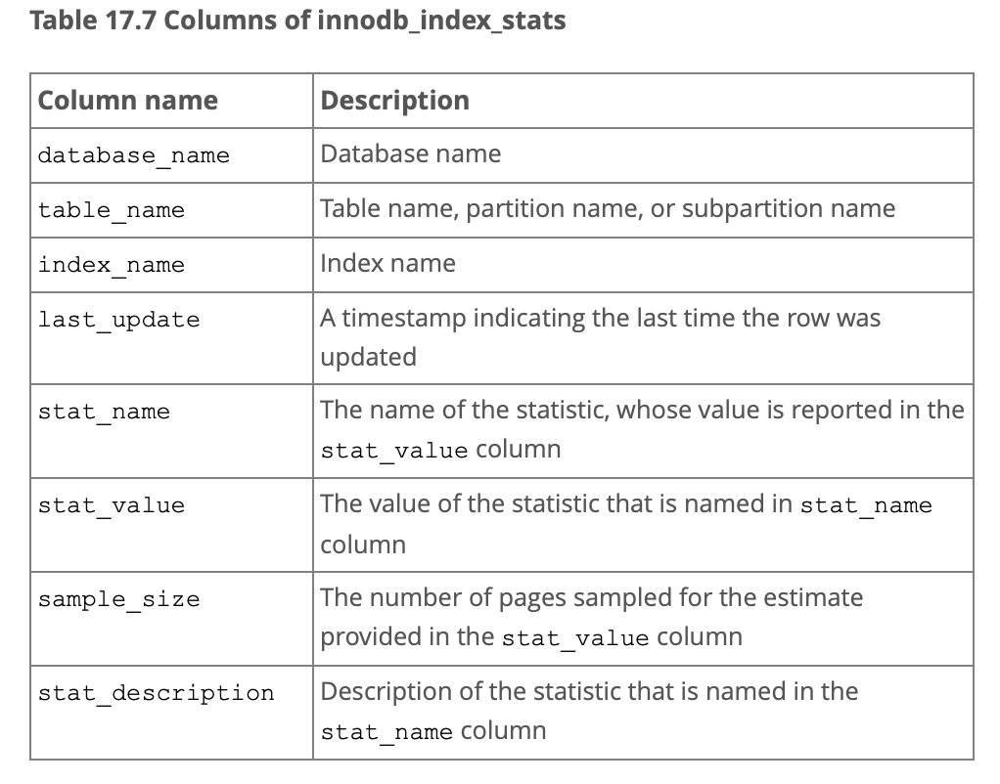</p>

stat_value = 지정된 통계량 값
sample_size = 제공된 견적에 대해 샘플링된 페이지 수

<p align="center">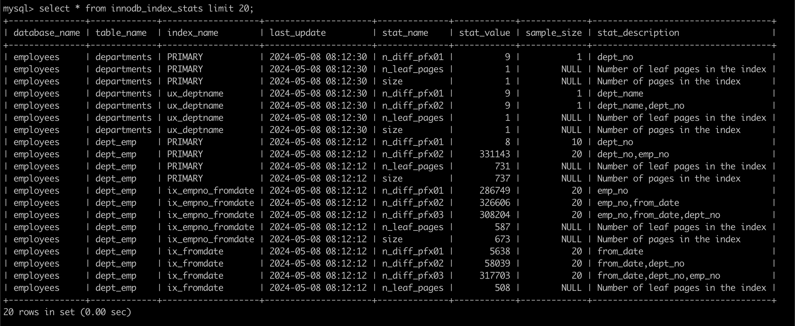</p>

이렇게 테이블로 관리함으로써 MySQL 서버가 재시작돼도 기존의 통계 정보를 유지할 수 있음

<br>

테이블을 생성할 때는 stats_persistent 옵션을 설정할 수 있는데 이 설정 값에 따라 테이블 단위로 영구적인 통계 정보를 보관 결정

<p align="center"></p>

stats_persistent 옵션의 기본값은 ON(1)

<p align="center">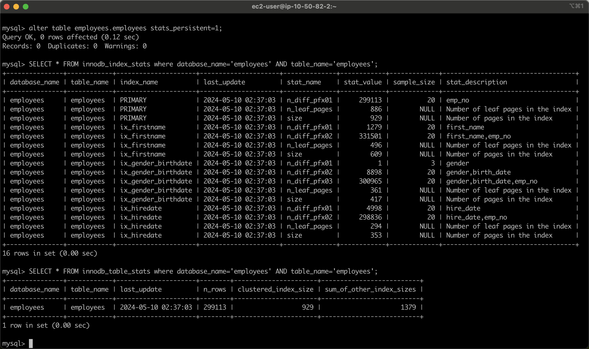</p>

- inndb_index_stats.stat_name='n_diff_pfx%'

    인덱스가 가진 유니크한 값의 개수

- inndb_index_stats.stat_name='n_leaf_pages'

    인덱스의 리프 노드 페이지 개수

- inndb_index_stats.stat_name='size'

    인덱스 트리의 전체 페이지 개수

- innodb_table_stats.n_rows

    테이블의 전체 레코드 건수

- innodb_table_stats.clustered_index_size

    프라이머리 키의 크기(innodb 페이지 개수)

- innodb_table_stats.sum_of_other_index_sizes

    프라이머리 키를 제외한 인덱스의 크기(innodb 페이지 개수)


<br>

#### 질문

innodb_index_stats 테이블을 열어봤을 때, gender로 설명되는 인덱스의 유니크한 값의 개수가 1개로 나와 있는데 실제 테이블을 열어봤을 때 M, F 두 가지의 유니크한 값이 나와 있음 Why?

<p align="center">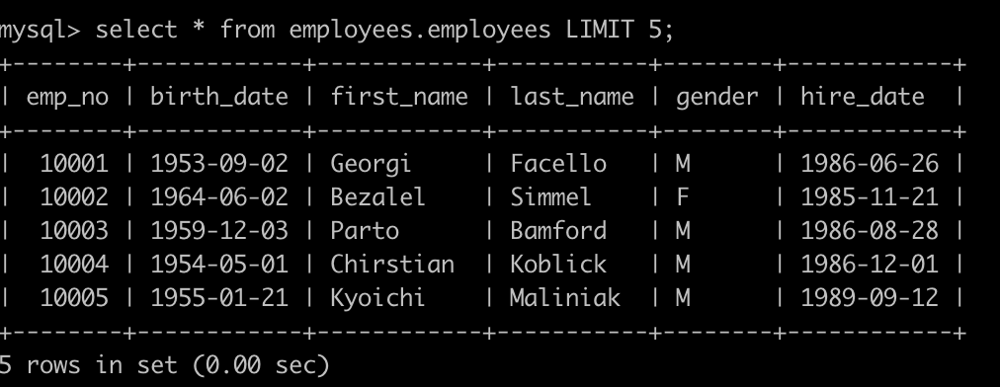</p>

-> Uzi의 답변

    table status로 employees 테이블을 확인해본 결과 Rows는 299113이었지만 실제 count를 해봤을 때 300024로 숫자가 달랐음

    이것은 통계 정보의 오류로, 통계 정보는 틀릴 수 있는 가능성을 항상 가지고 있으며 이것이 CBO의 단점

<p align="center">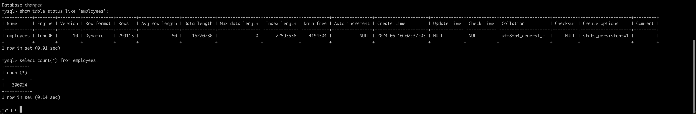</p>


<br>

통계 정보는 해당 이벤트로 자동 갱신

- 테이블이 새로 오픈되는 경우 (테이블이 처음 액세스되는 경우, 즉, 서버가 시작되고 처음 쿼리가 날라왔을 때)

- 테이블의 레코드가 대량으로 변경되는 경우(테이블의 전체 레코드 중에서 1/16 정도의 UPDATE 또는 INSERT나 DELETE가 실행되는 경우)

- ANALYZE TABLE 명령이 실행되는 경우

- SHOW TABLE STATUS 명령이나 SHOW INDEX FROM 명령이 실행되는 경우

- InnoDB 모니터가 활성화되는 경우

- innodb_stats_on_metadata 시스템 설정이 ON인 상태에서 SHOW TABLE STATUS 명령이 실행되는 경우

이렇게 자주 통계 정보가 갱신되면 인덱스 레인지 스캔으로 잘 처리하다가도 갑자기 풀 테이블 스캔이 실행되는 상황이 생길수도

innodb_stats_auto_recalc 시스템 변수를 OFF로 설정하면 자동 갱신을 막을 수 있음

Default 값은 1

0으로 설정시 ANALYZE TABLE 명령으로 실행할 때만 갱신

<br>

- innodb_stats_transient_sample_pages

    기본값은 8로, 자동으로 통계 정보 수집이 실행될 떄 8개의 페이지만 임의로 샘플링해서 분석하고 그 결과를 통계 정보로 활용

    해당 변수를 높게 설정시 더 정확한 통계 정보를 수집할 수 있음
    
    너무 높이면 시간이 길어짐

- innodb_stats_persistent_sample_pages

    기본값은 20이며, ANALYZE TABLE 명령이 실행되면 임의로 20개 페이지만 샘플링해서 분석하고 그 결과를 영구적인 통계 정보 테이블에 저장하고 활용

<br>

### 히스토그램

8.0 버전부터 칼럼의 데이터 분포도를 참조할 수 있는 히스토그램 정보를 활용

<br>

### 히스토그램 정보 수집 및 삭제

히스토그램 정보는 칼럼 단위로 관리되는데 자동 수집으로는 안되고

ANALYZE TABLE ... UPDATE HSTOGRAM 명령으로 수동으로 수집 및 관리

<br>

수집된 히스토그램 정보는 시스템 딕셔너리에 함께 저장되고

MySQL 서버가 시작될 때 딕셔너리의 히스토그램 정보를 information_schema db의 column_statistics 테이블로 로드

그래서 실제 히스토그램 정보를 조회하려면 column_statistics 테이블을 SELECT해서 참조

<br>

### 실습

<p align="center">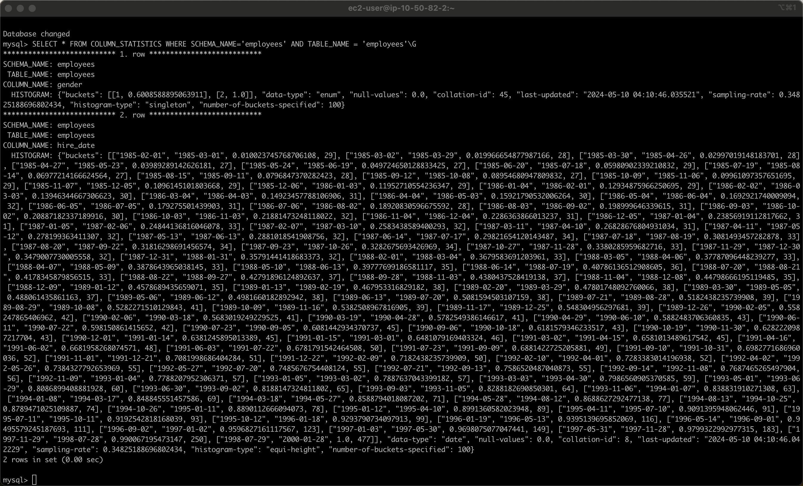</p>

```
### 참고

enum type

데이터 중에는 몇 가지의 한정된 값만 갖는 경우

예를 들어 행정구역, 계절, 성별 ...

성질이 비슷한 상수를 모아놓음
```

2종류의 히스토그램 타입 지원

- Singleton 히스토그램

    칼럼값 개별로 레코드 건수를 관리하는 히스토그램

    = 도수 분포

- Equi-Height 히스토그램

    칼럼값의 범위를 균등한 개수로 구분해서 관리하는 히스토그램

    = Height-Balanced 히스토그램

히스토그램은 Bucket 단위로 구분되어 레코드 건수나 칼럼값의 범위가 관리

싱글톤 히스토그램은 칼럼이 가지는 값별로 버킷이 할당

```
"buckets": [[1, 0.6008588895063911], [2, 1.0]]

이렇게 2개 할당

칼럼의 값과 발생 빈도 비율 2가지의 값
```

높이 균형 히스토그램은 개수가 균등한 칼럼값 범위별로 하나의 버킷이 할당

```
"buckets": [["1985-02-01", "1985-03-01", 0.010023745768706108, 29], ["1985-03-02", "1985-03-29", 0.019966654877987166, 28], ["1985-03-30", "1985-04-26", 0.02997019148183701, 28], ["1985-04-27", "1985-05-23", 0.03989289142626181, 27], ...]

이렇게 균등한 개수를 정하고 칼럼값 범위를 나눠서 할당
## 29, 28.. 는 각 버킷에 포함된 유니크한 값의 개수니까 다른 거임

범위 시작 값, 마지막 값, 발생 빈도율, 버킷에 포함된 유니크한 값의 개수 등 4개의 값
```

히스토그램의 모든 레코드 건수 비율은 누적으로 표시

예를 들어, gender에서 비율이 1이 0.6 2가 1 인데 이것은 2 값이 1 - 0.6인 0.4라는 뜻

높이 균형 히스토그램의 누적 비율이 일정한 것을 보면 각 범위가 비슷한 레코드의 건수를 가진다는 것을 알 수 있음

<br>

나머지 필드의 값

- sampling-rate

    히스토그램 정보를 수집하기 위해 스캔한 페이지의 비율

    histogram_generation_max_mem_size 시스템 변수에 설정된 메모리 크기에 맞게 적절히 샘플링

    default는 20MB

- histogram-type

    히스토그램 종류 저장

- number-of-buckets-specified

    히스토그램을 생성할 때 설정했던 버킷의 개수 저장

    기본으로 100개, 최대 1024개 설정 가능

<br>

생성된 히스토그램 삭제

<p align="center">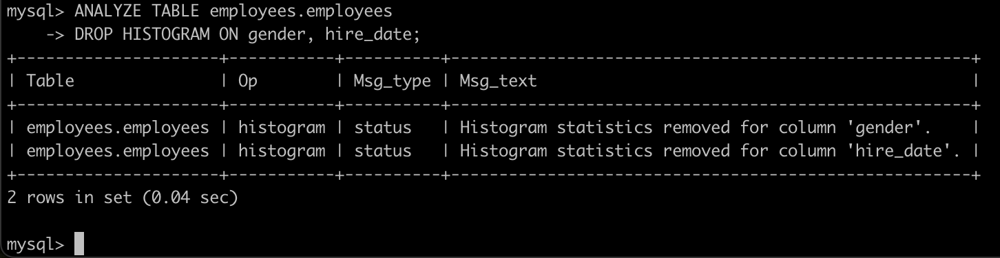</p>

<br>

히스토그램을 사용하지 않으려면

```
mysql> SET GLOBAL optimizer_switch='condition_fanout_filter=off'

// 현재 커넥션에서 실행되는 쿼리만 히스토그램을 사용하지 않게 설정
mysql> SET SESSION optimizer_switch='condition_fanout_filter=off'

// 현재 쿼리만 히스토그램을 사용하지 않게 설정
mysql> SELECT /*+ SET_VAR(optimizer_switch='condition_fanout_filter=off') */ * FROM ...

```

<br>

### 히스토그램의 용도

히스토그램 도입 전에도 테이블과 인덱스에 대한 통계 정보는 존재

But, 기존 통계 정보는 테이블의 전체 레코드 건수와 인덱스된 칼럼이 가지고 있는 유니크한 값의 개수 정도

예를 들어 테이블의 레코드가 1000건, 어떤 칼럼의 유니크한 값 개수가 100건이라면

이 칼럼에 대해 다음과 같은 동등 비교 검색을 하면 대략 10개의 레코드가 일치할 것으로 예측

```
mysql> SELECT * FROM order WHERE user_id='matt.lee';
```

<br>

But, `실제 응용 프로그램의 데이터는 항상 균등한 분포를 갖지 않음`

그래서 기존의 통계 정보는 해당 부분을 고려하지 못했음

이런 단점을 보완하기 위해 히스토그램 도입

히스토그램은 각 범위(버킷)별로 레코드의 건수와 유니크한 값의 개수 정보를 가지기 때문에 더 정확한 예측이 가능

<br>

<p align="center">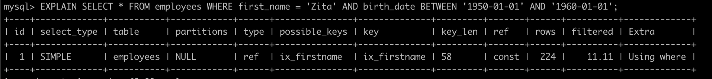</p>

<br>

<p align="center">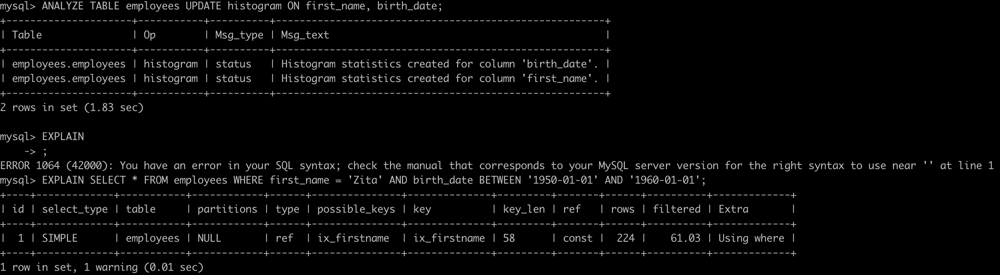</p>

<br>

위의 첫번째 이미지는 옵티마이저는 first_name='Zita' 조건에 일치하는 레코드 224건이 있고, 그 중 대략 11.11%인 24.8명 정도의 birth_date가 1950년대 생으로 예측

두번째 이미지는 히스토그램 정보를 수집하고 동일한 쿼리의 실행 계획을 봤을 때,

대략 61.03%인 136명이 1950년대 생으로 예측

<p align="center"></p>

<br>

실제 데이터를 조회해보면 대략 63.84%인 143명이 1950년대 생이라는 것을 알 수 있음

단순 통계 정보만을 이용한 경우와 히스토그램을 이용한 경우 차이가 매우 큼

<br>

히스토그램이 있으면 특정 범위의 데이터가 많고 적음을 식별할 수 있기에 쿼리의 성능에 상당한 영향을 미침

<p align="center">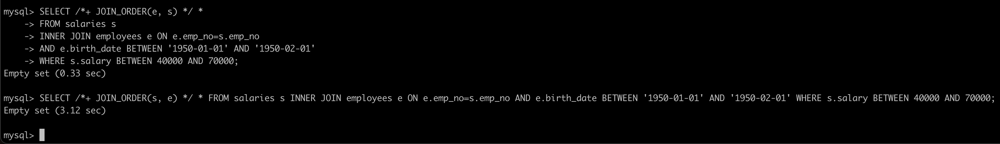</p>

<br>

위의 예제는 2개의 테이블을 조인하는데 옵티마이저 힌트를 통해 강제로 조인의 순서를 바꿔 성능을 살펴봄

첫번째 쿼리는 employees 테이블을 읽고 salaries 테이블을 조인한 예제

두번째 쿼리는 salaries 테이블을 읽고 employees 테이블을 조인한 예제

### 첫번째 쿼리가 더 빠른 이유는?

조인해야 할 건수가 salaries 테이블을 먼저 읽은 경우보다 훨씬 적음

Why?

birth_date 칼럼과 salary 칼럼은 인덱스되지 않은 칼럼이기에 이 칼럼들의 데이터 분포를 전혀 알지 못하고 실행 계획을 수립

<u>내 생각</u>

두 칼럼이 모두 인덱스가 없기에 풀 테이블 스캔은 필수적

Salary 칼럼이 레코드 수가 더 많고 birth_date 칼럼이 레코드 수가 더 적기에

salary 칼럼이 드라이빙되는 것이 조인하는 횟수가 훨씬 적음

<u>검증</u>

<p align="center">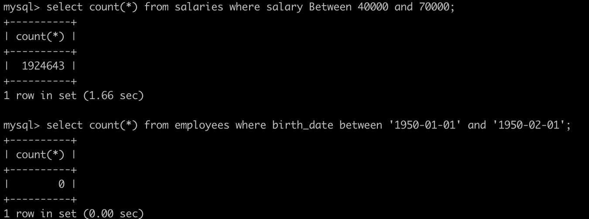</p>

<br>

생각이 맞았고, birth_date가 0개 였기에 empty set이었음

이러한 차이로 쿼리의 성능은 10배 차이를 보일 수 있으며, InnoDB 버퍼 풀에 데이터가 존재하지 않아서 디스크에서 데이터를 읽어야 하는 경우라면 몇 배의 차이 발생

`결국 각 칼럼에 대해 히스토그램 정보가 있으면 어느 테이블을 먼저 읽어야 조인의 횟수를 줄일 수 있을지 옵티마이저가 더 정확하게 판단 가능`

<br>

### 히스토그램과 인덱스

히스토그램과 인덱스는 완전히 다른 객체이기에 서로 비교할 대상은 아니지만,

인덱스는 부족한 통계 정보를 수집하기 위해 사용되는 측면에서 어느 정도 공통점을 가짐

쿼리의 실행 계획을 수립할 때 

<u>사용 가능한 인덱스들로부터 조건절에 일치하는 레코드 건수를 대략 파악하고

최종적으로 가장 나은 실행 계획을 선택</u>

이 때 조건절에 일치하는 레코드 건수를 예측하기 위해 옵티마이저는 실제 인덱스의 B-Tree를 샘플링해서 살펴봄

이 작업을 인덱스 다이브(Index dive)라고 표현

<br>

쿼리의 검색 조건으로 많이 사용되는 컬럼에 대해서는 일반적으로 인덱스를 생성

이렇게 인덱스된 칼럼에 대해 히스토그램 정보를 수집해두는 것이 좋을까?

```
mysql> SELECT *
        FROM employees
        WHERE first_name='Tonny'
        AND birth_date BETWEEN '1954-01-01' AND '1955-01-01';
```

해당 쿼리에서 옵티마이저는 테이블 풀 스캔을 할지, first_name 인덱스를 이용할지 고민

birth_date 칼럼에는 인덱스가 없으므로 해당 칼럼은 실행 계획에 큰 영향을 미치지 않을 것

<br>

<u>first_name 칼럼에 히스토그램이 수집되어 있었다면 옵티마이저는 해당 내용을 이용할까?</u>

사용하지 않음

실제 인덱스 다이브를 통해 직접 수집한 정보를 활용

`이는 실제 검색 조건의 대상 값에 대한 샘플링을 실행하는 것이기에 히스토그램보다 정확한 결과를 기대할 수 있기 때문`

`그래서 8.0 버전에서 히스토그램은 주로 인덱스되지 않은 칼럼에 대한 데이터 분포를 참조하는 용도로 사용`

<br>

### 코스트 모델

MySQL 서버가 쿼리를 처리하려면 다음과 같은 다양한 작업 필요

- 디스크로부터 데이터 페이지 읽기

- 메모리(InnoDB 버퍼 풀)로부터 데이터 페이지 읽기

- 인덱스 키 비교

- 레코드 평가

- 메모리 임시 테이블 작업

- 디스크 임시 테이블 작업

<br>

MySQL 서버는 사용자의 쿼리에 대해 이런 작업들이 얼마나 필요한지 예측하고 전체 작업 비용을 계산한 결과를 바탕으로 최적의 실행 계획을 찾음

이렇게 `전체 쿼리의 비용을 계산하는 데 필요한 단위 작업들의 비용을 코스트 모델(Cost Model)`이라고 함

5.7 버전까지는 이런 비용들을 서버 소스 코드에 상수화해서 사용

근데 해당 비용들은 서버가 사용하는 하드웨어에 따라 달라질 수 있기에 예전 버전처럼 고정된 비용을 적용하는 것은 최적의 실행 계획 수립에 있어서 방해 요소

<br>

해당 단점을 보완하기 위해 5.7 버전부터 상수화돼 있던 각 단위 작업의 비용을 DBMS 관리자가 조정할 수 있도록 개선

하지만 해당 버전에서는 인덱스되지 않은 칼럼의 히스토그램이나 메모리에 상주 중인 페이지의 비율 등 비용 계산과 연관 부분 정보들이 부족한 상태

8.0 버전으로 업그레이드되면서 해당 이슈가 해소되고 옵티마이저 실행 계획 수립에 사용되기 시작

<br>

코스트 모델은 다음 2개 테이블에 저장돼 있는 설정값을 사용하는데, 두 테이블 모두 mysql DB에 존재

- server_cost : 인덱스를 찾고 레코드를 비교하고 임시 테이블 처리에 대한 비용 관리

- engine_cost : 레코드를 가진 데이터 페이지를 가져오는 데 필요한 비용 관리

<br>

두 테이블은 공통으로 5개의 칼럼을 갖고 있음

- cost_name

    코스트 모델의 각 단위 작업

- default_value

    각 단위 작업의 비용 (기본값이며, 이 값은 서버 소스 코드에 설정된 값)

- cost_value

    DBMS 관리자가 설정한 값 (이 값이 NULL이면 MySQL 서버는 default_value 칼럼의 비용 사용)

- last_updated

    단위 작업의 비용이 변경된 시점

    옵티마이저에 영향을 미치는 정보 X, 단순 정보성

- comment

    비용에 대한 추가 설명

    옵티마이저에 영향을 미치는 정보 X, 단순 정보성

<br>

engine_cost는 2개의 칼럼을 더 가지고 있음

- engine_name

    비용이 적용된 스토리지 엔진

- device_type

    디스크 타입

<br>

코스트 모델에서 지원하는 단위 작업은 다음과 같음

|             | cost_name                    | default_value | 설명 |
|-------------|------------------------------|---------------|---|
| engine_cost | io_block_read_cost           |          1.00 | 디스크 데이터 페이지 읽기 |
|             | memory_block_read_cost       |          0.25 | 메모리 데이터 페이지 읽기 |
| server_cost | disk_temptable_create_cost   |         20.00 | 디스크 임시 테이블 생성  |
|             | disk_temptable_row_cost      |          0.50 | 디스크 임시 테이블의 레코드 읽기  |
|             | key_compare_cost             |          0.05 | 인덱스 키 비교 |
|             | memory_temptable_create_cost |          1.00 | 메모리 임시 테이블 생성  |
|             | memory_temptable_row_cost    |          0.10 | 메모리 임시 테이블의 레코드 읽기 |
|             | row_evaluate_cost            |          0.10 | 레코드 비교 |


```
### 디스크 임시 테이블 생성을 하는 이유

MySQL에서 임시 테이블을 생성하는 실행 계획이 나오는 이유는 다양합니다. 가장 일반적인 이유는 다음과 같습니다:


임시 테이블 필요성: 쿼리 실행 중에 중간 결과를 저장하거나 정렬된 데이터를 임시로 보관해야 할 때 임시 테이블이 필요할 수 있습니다.

예를 들어, 대용량의 데이터를 정렬하거나 복잡한 조인을 수행하는 경우 임시 테이블을 사용하여 중간 결과를 저장할 수 있습니다.


메모리 부족: 쿼리 실행 중에 메모리가 부족한 경우 MySQL은 디스크에 임시 테이블을 생성하여 데이터를 저장할 수 있습니다.

 이는 일시적으로 메모리 부족 상태를 해결하고 쿼리를 완료할 수 있도록 합니다.


임시 테이블 크기 제한: MySQL은 메모리에서 관리되는 임시 테이블의 크기에 제한을 둘 수 있습니다.

이 제한을 초과하는 경우 MySQL은 디스크에 임시 테이블을 생성하여 추가적인 데이터를 저장합니다.


정렬 및 그룹화: 정렬이나 그룹화된 결과를 생성하는 경우, MySQL은 임시 테이블을 사용하여 중간 결과를 저장하고 처리할 수 있습니다.
```

`row_evaluate_cost는 스토리지 엔진이 반환한 레코드가 쿼리의 조건에 일치하는지를 평가`하는 단위 작업

해당 값이 증가할수록 풀 테이블 스캔과 같이 많은 레코드를 처리하는 쿼리의 비용이 높아지고 

반대로 레인지 스캔과 같이 상대적으로 적은 수의 레코드를 처리하는 쿼리의 비용이 낮아짐

<br>

key_compare_cost는 키 값의 비교 작업에 필요한 비용을 의미하는데

해당 값이 증가할수록 레코드 정렬과 같이 키 값 비교 처리가 많은 경우 쿼리의 비용이 높아짐

<br>

<p align="center">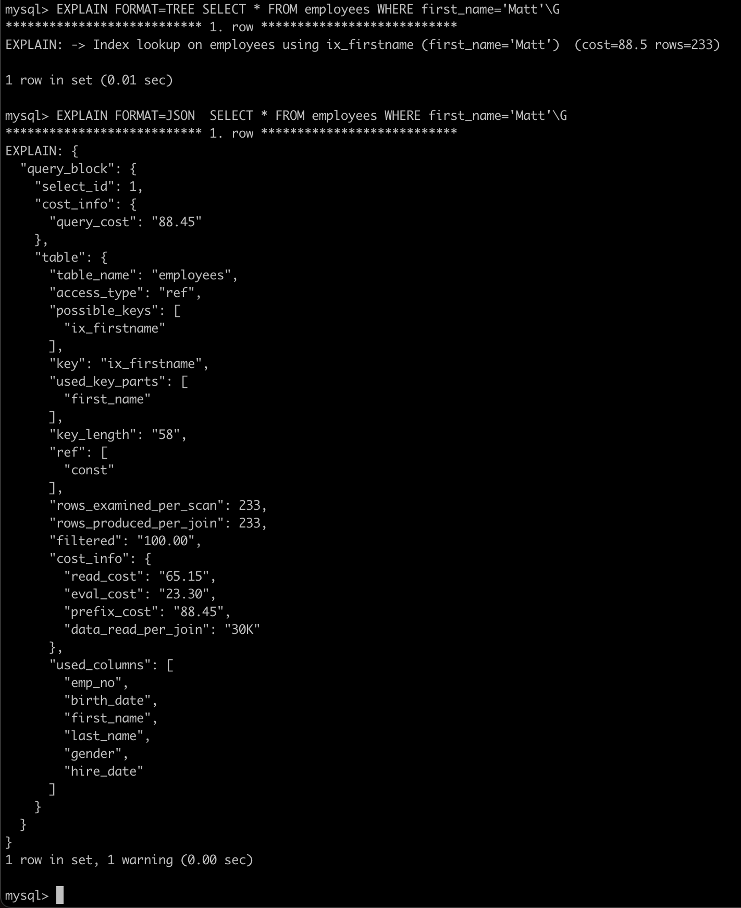</p>

<br>

옵티마이저는 

인덱스의 B-Tree 깊이, 

인덱스 키 검색을 위해 읽어야 하는 페이지 개수,

디스크와 메모리에서 데이터 페이지를 각각 몇 개씩 읽어야 하는지,

레코드 정렬 작업에서 사용되는 알고리즘별로 키 값 비교 작업이 몇 번 필요한지,

등을 통해 쿼리의 비용이 계산되기에 직접 계산하는 것은 상당히 어려움

<br>

`코스트 모델에서 중요한 것은 각 단위 작업에 설정되는 비용 값이 커지면 어떤 실행 계획들이 고비용으로 바뀌고 어떤 실행 계획들이 저비용으로 바뀌는지를 파악하는 것`

대표적으로 각 단위 작업의 비용이 변경되면 예상할 수 있는 결과들은 다음과 같음

(이것이 영향의 전부는 아니지만 코스트 모델을 이해하고 비용 조절을 연습해볼 수 있는 기준은 될 것)

- key_compare_cost(인덱스 키 비교) 비용을 높이면 MySQL 서버 옵티마이저가 가능하면 정렬을 수행하지 않는 방향의 실행 계획을 선택할 가능성이 높아짐

- row_evaluate_cost(레코드 비교) 비용을 높이면 풀 스캔을 실행하는 쿼리들의 비용이 높아지고, MySQL 서버 옵티마이저가 가능하면 인덱스 레인지 스캔을 사용하는 실행 계획을 선택할 가능성이 높아짐

- disk_temptable_create_cost(디스크 임시 테이블 생성)와 disk_temptable_row_cost(디스크 임시 테이블의 레코드 읽기) 비용을 높이면 옵티마이저는 디스크에 임시 테이블을 만들지 않는 방향의 실행 계획을 선택할 가능성이 높아짐

- io_block_read_cost(디스크 데이터 페이지 읽기) 비용이 높아지면 옵티마이저는 가능하면 InnoDB 버퍼 풀에 데이터 페이지가 많이 적재돼 있는 인덱스를 사용하는 실행 계획을 선택할 가능성이 높아짐

- memory_block_read_cost(메모리 데이터 페이지 읽기) 비용이 높아지면 InnoDB 버퍼 풀에 적재된 데이터 페이지가 상대적으로 적다고 하더라도 그 인덱스를 선택할 가능성이 높아짐

<br>

## 10.2 실행 계획 확인

MySQL 서버의 실행 계획은 DESC or EXPLAIN 명령으로 확인

8.0 버전부터는 EXPLAIN 명령에 사용할 수 있는 새로운 옵션 추가

<br>

### 실행 계획 출력 포맷

8.0 버전부터 FORMAT 옵션을 사용해 실행 계획의 표시 방법을 JSON, TREE, 단순 테이블 형태로 선택 가능

- 테이블 포맷

    <p align="center">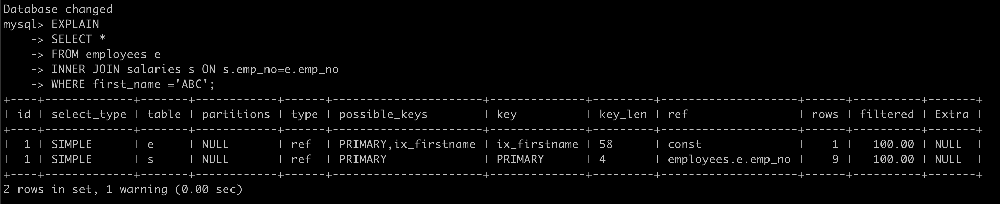</p>

<br>

- 트리 포맷

    <p align="center">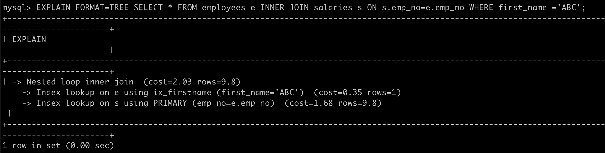</p>

<br>

- JSON 포맷

    <p align="center">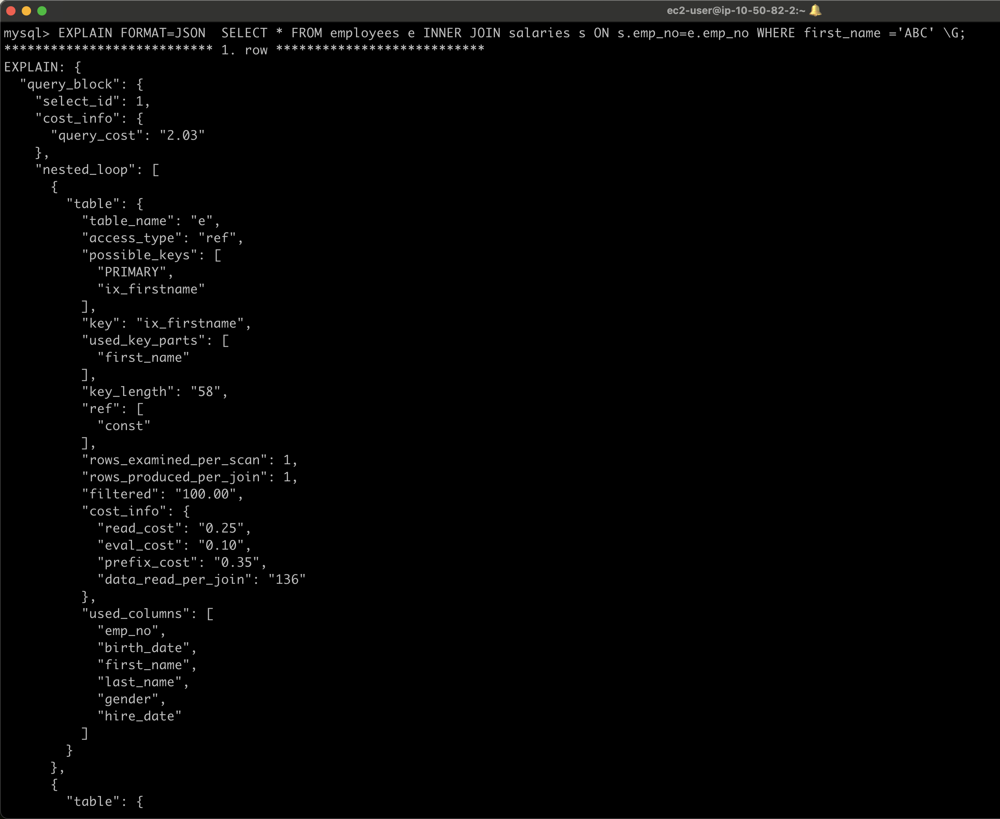</p>

<br>

포맷별 개인 선호도나 표시되는 정보의 차이는 있지만 옵티마이저가 수립한 실행 계획의 큰 흐름을 보여주는 데는 큰 차이가 없음

<br>

### 쿼리의 실행 시간 확인

8.0.18 버전부터 쿼리의 실행 계획과 단계별 소요된 시간 정보를 확인할 수 있는 EXPLAIN ANALYZE 기능 추가

EXPLAIN ANALYZE 명령은 항상 TREE 포맷

<p align="center">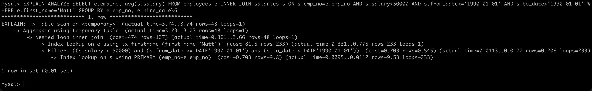</p>

<br>

질문

`실행계획을 살펴보면 Index lookup on s using PRIMARY가 가장 안쪽으로 들여써져 있는데 왜 이 문장이 먼저 해석이 안되는지?`

--> 알아냄 안쪽으로 들어가 있는 기준이 아니고 딸려있는 라인이 Filter라인인데 이 라인보다 위에 있는 라인이기 때문에 

### 들여쓰기와 실행 순서의 관계

실행 계획에서 들여쓰기는 각 단계의 작업이 다른 단계와 어떻게 연결되어 있는지를 나타내며, 반드시 위에서 아래로의 순서대로 실행되는 것을 의미하지는 않음

대신, MySQL 옵티마이저는 각 단계의 상호 작용을 설명

### 실행 계획 순서

`EXPLAIN ANALYZE`의 결과를 살펴보면:

```sql
EXPLAIN ANALYZE SELECT e.emp_no, avg(s.salary)
FROM employees e
INNER JOIN salaries s ON s.emp_no = e.emp_no
AND s.salary > 50000
AND s.from_date <= '1990-01-01'
AND s.to_date > '1990-01-01'
WHERE e.first_name = 'Matt'
GROUP BY e.emp_no, e.hire_date \G
```

### 실행 계획의 각 단계

1. **Index lookup on e using ix_first_name (first_name='Matt')**
   - `employees` 테이블에서 `first_name`이 'Matt'인 행을 찾습니다. 이는 `ix_first_name` 인덱스를 사용합니다.
   - 이 단계는 첫 번째로 수행됩니다. 왜냐하면 조인 조건에서 `e.emp_no`를 기반으로 `salaries` 테이블과 조인하기 전에 `employees` 테이블에서 적합한 행을 찾는 작업이 필요하기 때문입니다.

2. **Index lookup on s using PRIMARY (emp_no=e.emp_no)**
   - `salaries` 테이블에서 `emp_no`가 `employees` 테이블의 `emp_no`와 일치하는 행을 찾습니다. 이는 `PRIMARY` 키 인덱스를 사용합니다.
   - 이 단계는 `employees` 테이블에서 찾은 각 행에 대해 수행됩니다. 즉, 첫 번째 단계에서 찾은 `e.emp_no` 값을 기반으로 `salaries` 테이블을 검색합니다.

3. **Filter: ((s.salary > 50000) and (s.from_date <= DATE '1990-01-01') and (s.to_date > DATE '1990-01-01'))**
   - `salaries` 테이블에서 추가적인 조건(`salary`, `from_date`, `to_date`)을 만족하는 행을 필터링합니다.
   - 이 단계는 두 번째 단계에서 찾은 행들에 대해 적용됩니다.

4. **Nested loop inner join**
   - `employees` 테이블과 `salaries` 테이블을 중첩 루프 방식으로 조인합니다.
   - 이 단계는 첫 번째와 두 번째 단계의 결과를 조합합니다.

5. **Aggregate using temporary table**
   - 임시 테이블을 사용하여 집계 연산을 수행합니다.
   - 조인된 결과를 기반으로 집계를 수행합니다.

6. **Table scan on <temporary>**
   - 임시 테이블에서 테이블 스캔을 수행하여 최종 결과를 반환합니다.

### 왜 Index lookup on s using PRIMARY가 먼저 해석되지 않는가?
실제 실행 순서는 쿼리의 논리적 순서와 맞물려 있습니다. 

`employees` 테이블에서 먼저 필터링하고, 그 결과를 `salaries` 테이블과 조인하여 추가 조건을 적용합니다.

비록 `Index lookup on s using PRIMARY`가 들여쓰기로 인해 안쪽에 위치해 있지만, 이는 `employees` 테이블에서 필터링된 결과를 바탕으로 수행되는 하위 단계임을 나타냅니다. 

다시 말해, `employees` 테이블에서 `first_name='Matt'`인 행을 찾는 것이 첫 번째 단계이며, 그 후에 이 행을 기반으로 `salaries` 테이블을 검색하고 필터 조건을 적용하는 것이 논리적 순서입니다. 

들여쓰기는 이러한 관계를 시각적으로 표현하기 위한 것이며, 실제 실행 순서는 옵티마이저가 결정한 논리적 순서대로 진행됩니다.

<br>

실행 계획애 나열된 필드들의 의미

- actual time

    쿼리 실행의 각 단계에서 소요된 실제 시간 (해당 단계가 시작되기까지 걸린 시간, 완료될 때까지의 시간)

<br>

- rows

    해당 단계에서 처리된 행(row)의 수

<br>

- loops

    해당 단계가 몇 번 반복되었는지

<br>

<p align="center"></p>

<br>

1. employees 테이블을 index firstname으로 1회 반복하면서 스캔했고 233개 행을 찾았음 첫번째 레코드를 찾는 데에 0.331초가 걸렸으며 마지막 레코드를 찾는 데에는 총 0.775초가 걸렸음

2. 그 찾은 233개의 행에서 1행씩 꺼내와서 emp_no를 salaries 테이블의 emp_no와 매칭한 레코드들을 평균 9.53개 가져왔고 총 233개 행이니까 233회 반복 

    <br>

    <p align="center">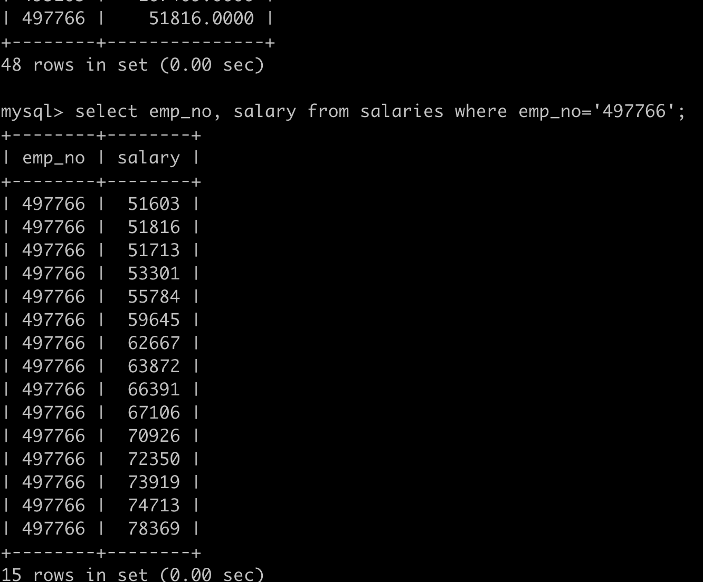</p>

    <br>

    emp_no가 497766인 값의 레코드들을 추출했을 때 15개가 나왔음
    
    이런 식으로 emp_no가 일치하는 레코드들의 평균 값이 9.53개라는 뜻

3. 동시에 filter(salary>50000, from_date가 90년 1월 1일 전부터 to_date가 90년 1월 1일 이후까지)까지 하면 평균 1 loop에 0.206 행이 추출

4. 이렇게 두 개의 테이블에서 찾은 레코드들을 NL 조인, 총 48행이 추출

5. AVG 함수 때문에 임시 테이블을 생성하고 

6. 임시 테이블을 테이블 스캔하여 결과 반환

<br>

## 실행 계획 분석

실행 계획이 어떤 접근 방식을 사용해서 어떤 최적화를 수행하는지, 그리고 어떤 인덱스를 사용하는지 등을 이해하는 것이 중요

<p align="center"></p>

<br>

표의 각 레코드는 `쿼리 문장에서 사용된 테이블(서브쿼리로 임시 테이블을 생성한 경우 임시 테이블까지 포함)의 개수만큼 출력`

실행 순서는 위에서 아래로 순서대로 표시(UNION이나 상관 서브쿼리와 같은 경우 순서대로 표시 안될수도)

위쪽에 출력된 결과일수록(id 칼럼 값이 작을수록) 쿼리의 바깥 부분이거나 먼저 접근한 테이블

아래쪽에 출력된 결과일수록(id 칼럼 값이 클수록) 쿼리의 안쪽 부분이거나 나중에 접근한 테이블

<br>

### id 칼럼

하나의 SELECT 문장은 다시 1개 이상의 하위 SELECT 문장을 포함할 수 있음

```sql
SELECT ...
FROM (SELECT ... FROM tb_test1) tb1, tb_test2 tb2
WHERE tb1.id=tb2.id;
```

해당 쿼리에 있는 각 SELECT를 분리해서 생각해보자

SELECT 키워드 단위로 구분한 것을 단위(SELECT) 쿼리라고 함

```sql
SELECT ... FROM tb_test1;
SELECT ... tb1, tb2 WHERE tb1.id=tb2.id;
```

실행 계획에서 가장 왼쪽에 표시되는 `id 칼럼은 단위 SELECT 쿼리별로 부여되는 식별자 값`

위의 쿼리의 경우 실행 계획에서 최소 2개의 id 값이 표시

또한,

`하나의 SELECT 문장 안에서 여러 개의 테이블을 조인하면 조인되는 테이블의 개수만큼 실행 계획 코드가 출력되지만 같은 id 값이 부여`

<p align="center">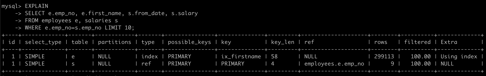</p>

<br>

각기 다른 id 값의 예제

<p align="center">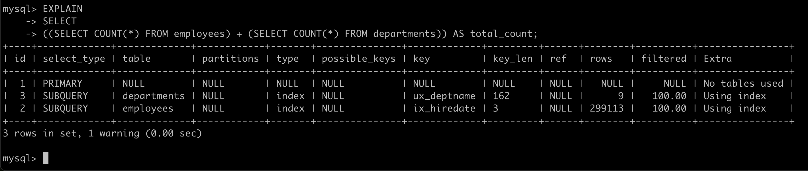</p>

<br>

`id 칼럼이 테이블의 접근 순서를 의미하지는 않음`

<p align="center">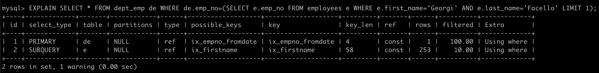</p>

<p align="center">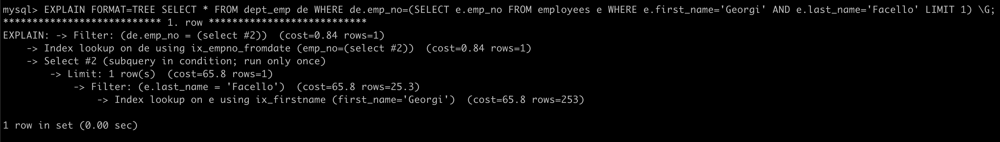</p>

<br>

위의 실행 계획을 살펴보면 dept_emp 테이블의 id가 1이고, employees 테이블의 id가 2지만

실제 쿼리의 실행 순서는 employees 테이블을 먼저 읽고 그 결과를 이용해 dept_emp 테이블을 읽는 순서로 실행

FORMAT=TREE 명령으로 확인해보면 순서를 정확히 알 수 있음

<p align="center">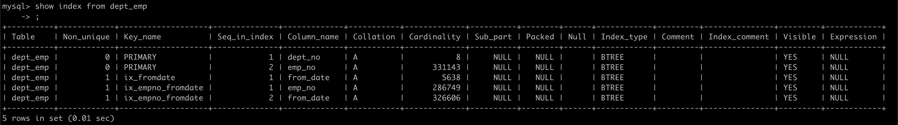</p>

<br>

### select_type 칼럼

각 단위 SELECT 쿼리가 어떤 타입의 쿼리인지 표시되는 칼럼

### SIMPLE

UNION이나 서브 쿼리를 사용하지 않는 단순 SELECT 쿼리인 경우 SIMPLE로 표시(쿼리에 조인이 포함된 경우도 마찬가지)

쿼리 문장이 아무리 복잡하더라도 SIMPLE인 단위 쿼리는 하나만 존재

일반적으로 제일 바깥 SELECT 쿼리가 SIMPLE로 표시

<br>

### PRIMARY

UNION이나 서브쿼리를 가지는 SELECT 쿼리의 실행 계획에서 가장 바깥쪽에 잇는 단위 쿼리는 PRIMARY로 표시

<br>

### UNION

UNION으로 결합하는 단위 SELECT 쿼리 가운데 첫 번째를 제외한 두 번째 이후 단위 SELECT 쿼리의 select_type은 UNION으로 표시

UNION의 첫 번째 단위 SELECT는 select_type이 UNION이 아니라 UNION되는 쿼리 결과들을 모아서 저장하는 임시 테이블(DERIVED)이 select_type으로 표시

<p align="center">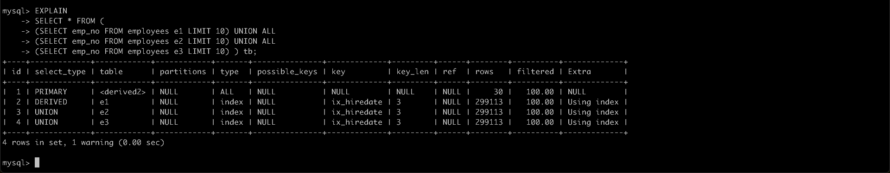</p>

<br>

UNION이 되는 단위 SELECT 쿼리 3개 중에서 첫 번째(e1 테이블)만 UNION이 아니고, 나머지 2개는 모두 UNION으로 표시돼 있음

대신 UNION의 첫 번째 쿼리는 전체 UNION의 결과를 대표하는 select_type으로 설정

세 개의 서브쿼리로 조회된 결과를 UNION ALL로 결합해 임시 테이블을 만들어서 사용하고 있으므로 UNION ALL의 첫 번째 쿼리는 DERIVED라는 select_type을 가짐

<br>

### DEPENDENT UNION * 어려움

DEPENDENT UNION 또한 UNION select_type과 같이 UNION이나 UNION ALL로 집합을 결합하는 쿼리에서 표시

여기서 DEPENDENT는 UNION이나 UNION ALL로 결합된 단위 쿼리가 외부 쿼리에 의해 영향을 받는 것을 의미

<br>

다음 예제 쿼리를 보면 두 개의 SELECT 쿼리가 UNION으로 결합됐으므로 select_type에 UNION이 표시된 것을 알 수 있음

IN 이하 서브 쿼리에서는 두 개의 쿼리가 UNION으로 연결된 것을 확인할 수 있음

예제 쿼리의 경우 옵티마이저가 IN 내부의 서브 쿼리를 먼저 처리하지 않고, 외부의 employees 테이블을 먼저 읽은 다음 서브 쿼리를 실행하는데 이때 employees 테이블의 칼럼값이 서브쿼리에 영향을 줌

이렇게 내부 쿼리가 외부의 값을 참조해서 처리될 때 DEPENDENT 키워드가 표시

<p align="center">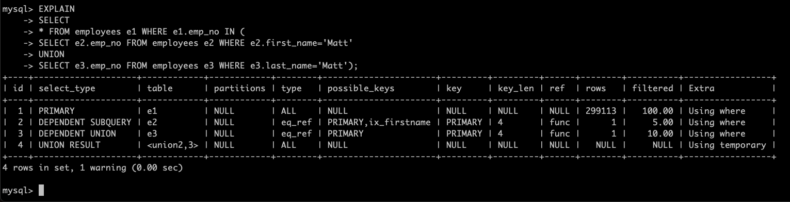</p>

<br>

결국 내부적으로 UNION에 사용된 SELECT 쿼리의 WHERE 조건에 e2.emp_no=e1.emp_no와 e3.emp_no=e1.emp_no라는 조건이 자동으로 추가되어 실행

외부에 정의된 employees 테이블의 emp_no 칼럼이 서브쿼리에 사용되기 때문에 DEPENDENT UNION이 표시

<br>

### UNION RESULT

UNION RESULT는 UNION 결과를 담아두는 테이블을 의미

8.0 이전 버전에서는 UNION ALL이나 UNION 쿼리는 모두 UNION의 결과르 임시 테이블로 생성했는데

8.0 버전부터는 UNION ALL의 경우 임시 테이블을 사용하지 않도록 기능이 개선

하지만 UNION은 8.0 버전에서도 여전히 임시 테이블에 결과를 버퍼링

```
### UNION과 UNION ALL의 차이

SQL에서 두 개 이상의 결과 집합을 결합할 때 사용하는 연산자 두 연산자 모두 행을 결합

UNION은 중복을 제거하기에 추가적인 정렬과 비교 작업이 필요

UNION ALL은 중복이 허용되기에 UNION보다 성능이 좋음
```

실행 계획상에서 임시 테이블을 가리키는 것이 UNION RESULT

UNION RESULT는 실제 쿼리에서 단위 쿼리가 아니기에 별도의 id 값은 부여되지 않음

<p align="center">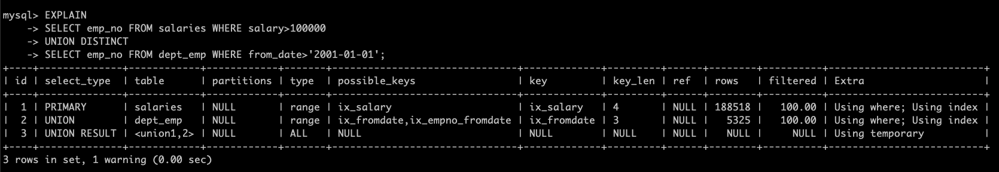</p>

<br>

마지막 값의 경우 table 칼럼이 <union 1,2>로 표시되어 있는데 이것은 id 값이 1인 단위 쿼리의 조회 결과와 2인 조회 결과를 UNION했다는 것을 의미

<p align="center">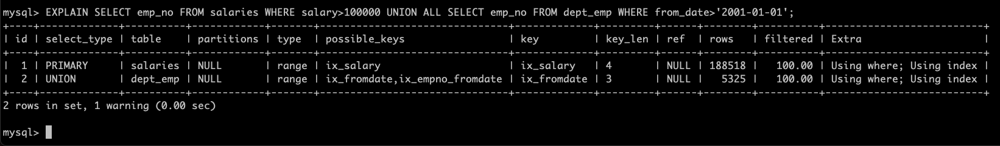</p>

<br>

UNION ALL을 사용하면 임시 테이블에 버퍼링하지 않기에 UNION RESULT가 없어진 것을 확인 가능

<br>

### SUBQUERY

select_type의 SUBQUERY는 FROM 절 이외에서 사용되는 서브쿼리만을 의미

<p align="center">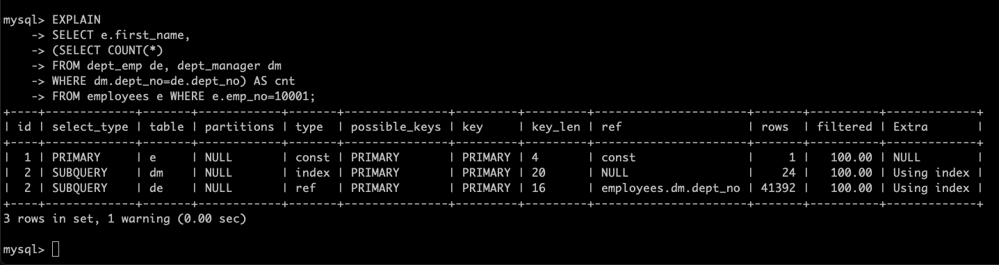</p>

<br>

FROM 절에 사용된 서브쿼리는 DERIVED라고 표시되고 그 밖의 위치에서 사용된 서브 쿼리는 전부 SUBQUERY라고 표시

<br>

쿼리 해석

emp_no=10001인 레코드의 first_name을 적고, 서브쿼리의 결과 값을 적으면 됨

각자 별개의 쿼리로 동작하는 것

<p align="center">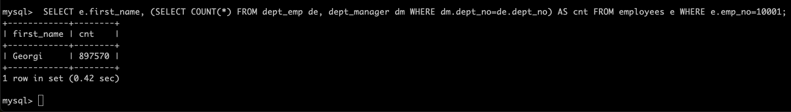</p>

<br>

### DEPENDENT SUBQUERY

서브쿼리가 바깥쪽 SELECT 쿼리에서 정의된 칼럼을 사용하는 경우, select_type에 DEPENDENT SUBQUERY라고 표시

<p align="center">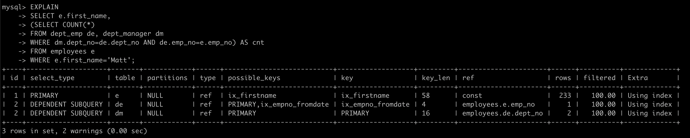</p>

<br>

employees 테이블에서 first_name가 Matt인 레코드의 first_name을 select
dept_manager, dept_emp 테이블에서 dept_no가 같고, dept_emp, employees 테이블의 emp_no가 같은 레코드들을 추출해서 다 전부 count

서브쿼리에서 dept_manager와 dept_emp 테이블을 결합하여 dept_no를 기준으로 de.emp_no가 e.emp_no와 같은 행을 찾고 카운트를 계산

<br>

안쪽의 서브쿼리 결과가 바깥쪽 SELECT 쿼리의 칼럼에 의존적이기 때문에 DEPENDENT라는 키워드가 붙음

또한, 외부 쿼리가 먼저 수행된 후 내부 쿼리(서브 쿼리)가 실행되야 하므로 일반 서브 쿼리보다는 처리 속도가 느릴 때가 많음

<br>

### DERIVED

5.5 버전까지는 서브쿼리가 FROM 절에 사용된 경우 항상 DERIVED인 실행 계획을 만듦

5.6 버전부터는 옵티마이저 옵션(optimizer_switch)에 따라 FROM 절의 서브쿼리를 외부 쿼리와 통합하는 형태의 최적화가 수행

DERIVED는 단위 SELECT 쿼리의 실행 결과로 메모리나 디스크에 임시 테이블(파생 테이블)을 생성하는 것을 의미

5.6 버전부터는 옵티마이저 옵션에 따라 쿼리의 특성에 맞게 임시 테이블에도 인덱스를 추가해서 만들 수 있게 최적화됨

<p align="center">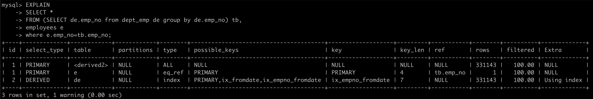</p>

<br>

FROM 절의 서브쿼리를 임시 테이블로 만들어 처리

8.0 버전부터 FROM 절의 서브쿼리에 대한 최적화도 많이 개선되어 가능하다면 불필요한 서브 쿼리는 조인으로 쿼리를 재작성해서 처리

`쿼리를 튜닝하기 위해 실행 계획을 확인할 때 가장 먼저 select_type 칼럼 값이 DERIVED인 것이 있는지 확인`

서브쿼리를 조인으로 해결할 수 있는 경우라면 서브 쿼리보다는 조인을 사용

<br>

### DEPENDENT DERIVED 

8.0 이전 버전에서는 FROM 절의 서브쿼리는 외부 칼럼을 사용할 수가 없었는데 

8.0 버전부터는 래터럴 조인 기능이 추가되면서 FROM 절의 서브쿼리에서도 외부 칼럼을 참조할 수 있게 됨

다음 쿼리는 래터럴 조인의 대표적인 예제로 employees 테이블의 레코드 1건당 salaries 테이블의 레코드를 최근 순서대로 최대 2건까지만 가져와서 조인을 실행

<p align="center">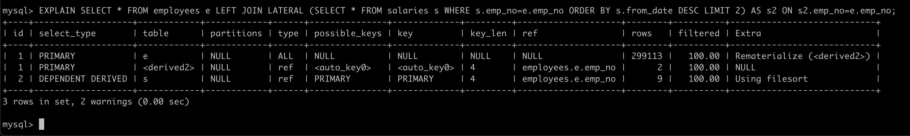</p>

<br>

### UNCACHEABLE SUBQUERY

하나의 쿼리 문장에 서브쿼리가 하나만 있더라도 실제 그 서브쿼리가 한 번만 실행되는 것은 아님

그런데 조건이 똑같은 서브쿼리가 실행될 때는 내부적인 캐시 공간에 담아둠

### UNCACHEABLE UNION

<br>

### MATERIALIZED

<br>

### table 칼럼

MySQL 서버의 실행 계획은 단위 SELECT 쿼리 기준이 아니라 테이블 기준으로 표시

table 칼럼에 <derived N> or <union M,N>과 같이 `<> 로 둘러싸인 이름이 명시되는 경우가 많은데, 이 테이블은 임시 테이블을 의미`

<p align="center">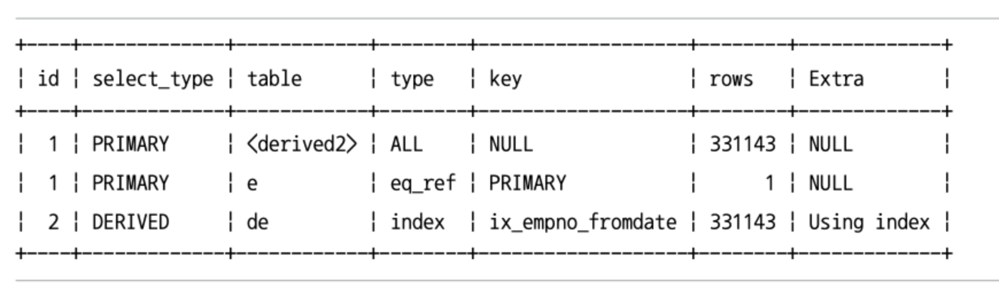</p>

<br>

위의 실행 계획에서 첫 번째 라인의 table 칼럼의 값이 <derived2>인데 이것은 단위 SELECT 쿼리의 id 값이 2인 실행 계획으로부터 만들어진 파생 테이블을 가르킴

dept_emp 테이블로부터 SELECT된 결과가 저장된 파생 테이블

실행 계획의 table 칼럼에 표시된 정보를 해석하는 방법

<p align="center">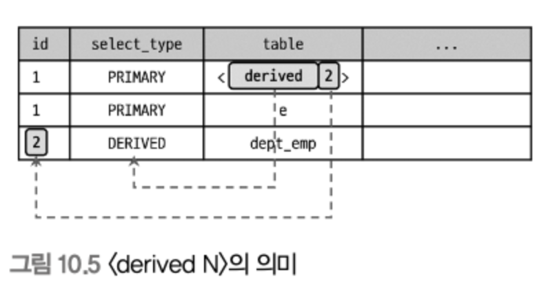</p>

<br>

`id, select_type, table 칼럼은 실행 계획의 각 라인에 명시된 테이블이 어떤 순서로 실행되는지를 판단하는 근거`

위의 실행 계획을 이 세 칼럼으로 분석해보자

1. 첫 번째 라인의 테이블이 <derived 2>라는 것을 보아 이 라인보다 id 값이 2인 라인이 먼저 실행되고 그 결과가 파생 테이블로 준비돼야 한다는 것을 알 수 있음

2. 세 번째 라인(id 값이 2인 라인)을 보면 select_type 칼럼의 값이 DERIVED로 표시 

    즉, 이 라인은 table 칼럼에 표시된 dept_emp 테이블을 읽어서 파생 테이블을 생성하는 것을 알 수 있음

3. 세 번째 라인 분석이 끝났으므로 다시 실행 계획 첫 번째로

4. 첫 번째 라인과 두 번째 라인은 같은 id를 가지고 있는 것으로 봐서 2개 테이블(첫 번째 라인의 <derived 2>와 두 번째 라인의 e 테이블)이 조인되는 쿼리라는 사실을 알 수 있음

    그런데 <derived2> 테이블이 e 테이블보다 먼저(윗라인에) 표시됐기 때문에 <derived2>가 드라이빙 테이블이 되고, e 테이블이 드리븐 테이블이 된다는 것을 알 수 있음

    즉, <derived2> 테이블을 먼저 읽어서 e 테이블로 조인을 실행했다는 것을 알 수 있음

<br>

### partitions 칼럼

5.7 버전까지는 옵티마이저가 사용하는 파티션들의 목록은 EXPLAIN PARTITION 명령을 이용해 확인 가능

8.0 버전부터는 EXPLAIN 명령으로 파티션 관련 실행 계획까지 모두 확인 가능

우선 파티션 관련 실행 계획을 확인하기 전에 간단한 파티션 테이블을 생성하고, employees 테이블의 모든 레코드를 복사

employees_2 테이블은 hire_date 칼럼 값을 기준으로 5년 단위로 나뉘어진 파티션을 가짐

But, 파티션 생성 시 제약 사항(파티션 키로 사용되는 칼럼은 PK를 포함한 모든 Unique Index의 일부여야 함)으로 인해 

PK에 emp_no 칼럼과 함께 hire_date 칼럼을 추가해서 테이블 생성

<p align="center">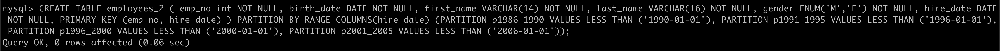</p>

<p align="center">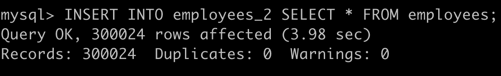</p>

<br>

<p align="center">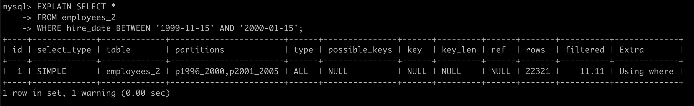</p>

<br>

hire_date 칼럼의 값이 1999.11.15 ~ 2000.01.15 사이인 레코드를 검색

partitions를 살펴보면 p1996_2000과 p2001_2005 파티션에 저장돼 있음을 알 수 있음

이처럼 파티션이 여러 개인 테이블에서 불필요한 파티션을 빼고 쿼리를 수행하기 위해 접근해야 할 것으로 판단되는 테이블만 골라내는 과정을 파티션 프루닝(partition pruning(가지치기))이라고 함

그래서 쿼리의 실행 계획을 통해서 어느 파티션을 읽는지 확인 할 수 있어야 쿼리의 튜닝이 가능할 것

그래서 옵티마이저가 쿼리 처리를 위해 필요한 파티션들의 목록만 모아서 실행 계획의 partitions 칼럼에 표시

<br>

재밌는 점은 type 칼럼이 ALL이라는 것인데

이는 풀테이블 스캔으로 쿼리가 처리된다는 것

어떻게 풀 테이블 스캔으로 테이블의 일부만 읽을 수 있을까??

-> MySQL을 포함한 대부분의 RDBMS에서 지원하는 파티션은 물리적으로 개별 테이블처럼 별도의 저장 공간을 갖기 때문

이 쿼리에서는 p1996_2000 파티션과 p2001_2005 파티션만 풀 스캔


```
### 파티셔닝과 파티션 키에 대해서

파티셔닝은 DBMS에서 큰 테이블을 관리하기 쉽게 더 작게 나누는 방법

주요 목적은

성능 향상(전체 테이블을 탐색하지 않고도 필요한 데이터가 포함된 파티션만 검색할 수 있도록)

관리 용이성(더 작은 단위로 데이터를 나눔으로써 백업, 복구, 삭제 작업 용이)

가용성 및 유지 보수


파티션 키

파티션을 나누는 기준이 되는 칼럼

파티션 키를 기준으로 데이터가 어느 파티션에 저장될지 결정

```

여기서 질문

파티션 키 말고 다른 컬럼으로 검색하면 어떤 실행 계획이 나올까?

<p align="center">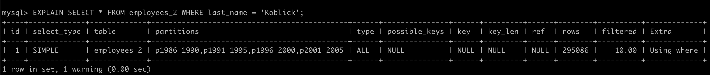</p>

<br>

모든 파티션을 다 검색

<br>

### type 칼럼

쿼리의 실행 계획에서 type 이후 칼럼은 서버가 각 테이블의 레코드를 어떤 방식으로 읽었는지를 나타냄 

여기서 방식이라 함은 인덱스를 사용해 레코드를 읽었는지, 풀 테이블 스캔으로 읽었는지

일반적으로 쿼리를 튜닝할 때는 인덱스를 효율적으로 사용하는지 확인하는 것이 중요

<br>

`type 칼럼의 값은 각 테이블의 접근 방법으로 해석`

`12개의 접근 방법 중 ALL을 제외한 나머지는 모두 인덱스를 사용`

ALL은 풀 테이블 스캔

<br>

하나의 단위 SELECT 쿼리는 12개의 접근 방법 중 단 하나만 사용

또한 index_merge를 제외한 나머지 접근 방법은 하나의 인덱스만 사용

그러므로, 실행 계획의 각 라인에 접근 방법이 2개 이상 표시되지 않으며, index_merge 이외의 type에서는 인덱스 항목에도 단 하나의 인덱스 이름만 표시

성능이 빠른 순서대로 설명 진행

<br>

### system

레코드가 1건만 존재하는 테이블 or 한 건도 존재하지 않는 테이블을 참조하는 형태의 접근 방법

InnoDB에서는 나타나지 않고 MyISAM or MEMORY 테이블에서만 사용되는 접근 방법

<p align="center">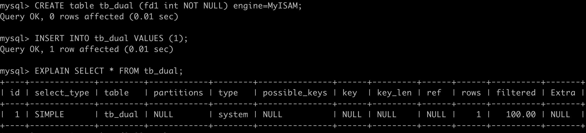</p>

<br>

InnoDB로 변환하면?

<p align="center">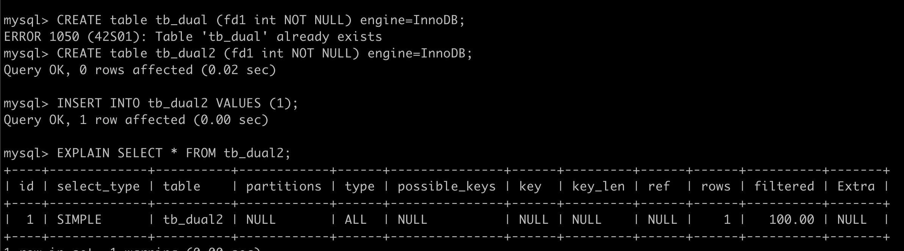</p>

<br>

ALL로 출력

레코드가 1건 이하인 경우에만 사용

<br>

### const

테이블의 레코드 건수와 관계없이 쿼리가 PK나 UNIQUE KEY 칼럼을 이용하는 WHERE 조건절을 가지고 있으며, `반드시 1건을 반환하는 쿼리의 처리 방식`

다른 DBMS에서는 이를 유니크 인덱스 스캔이라고 표현

<p align="center">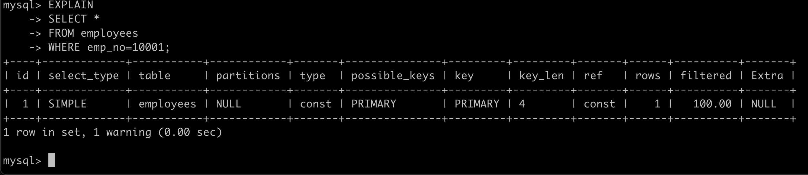</p>

<br>

다중 칼럼으로 구성된 PK나 UNIQUE KEY 중에서 인덱스의 일부 칼럼만 조건으로 사용할 때는 const 타입 접근 방법 X

<p align="center">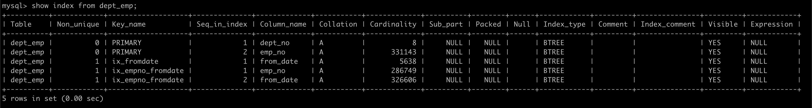</p>

<p align="center">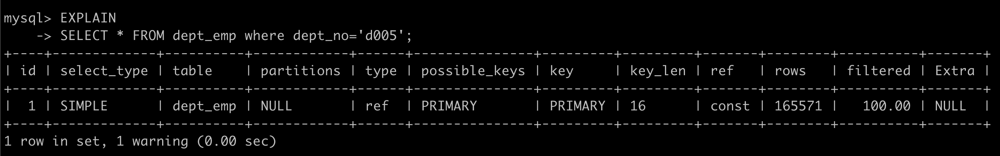</p>

<br>

인덱스를 확인해봤을 때 dept_no, emp_no가 멀티 컬럼으로 PK 키가 설정

이럴 때는 const 타입 X, ref로 표시

이 경우에는 실제 레코드가 1건만 저장되어 있더라도, MySQL 엔진이 데이터를 읽어보지 않고서는 1건이라고 확실할 수 없기 때문

<br>

PK나 UNIQUE 인덱스의 모든 칼럼을 동등 조건으로 WHERE 절에 명시하면 다음 예제와 같이 const 접근 사용

<br>

### eq_ref

eq_ref는 여러 테이블이 조인되는 쿼리의 실행 계획에서만 표시

조인에서 처음 읽은 테이블의 칼럼 값을, 그 다음에 읽어야 할 테이블의 PK나 UNIQUE 키 칼럼의 검색 조건에 사용할 때를 가리켜 eq_ref라고 함

이 때, `두 번째 이후에 읽는 테이블의 type 칼럼에 eq_ref가 표시`

또한, 두 번째 이후에 읽히는 테이블을 유니크 키로 검색할 때 그 유니크 인덱스는 NOT NULL이어야 하며, 

다중 컬럼으로 만들어진 PK나 UNIQUE INDEX라면 인덱스의 모든 칼럼이 비교 조건에 사용돼야만 eq_ref 접근 방법이 사용될 수 있음

즉, 조인에서 두 번째 이후에 읽은 테이블에서 반드시 1건만 존재한다는 보장이 있어야 함

<p align="center">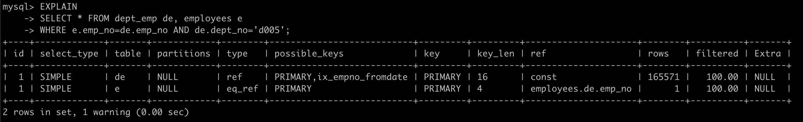</p>

<br>

예제 쿼리의 실행 계획을 살펴보면,

첫 번째 라인과 두 번째 라인의 id 값이 1로 같으므로 두 개의 테이블이 조인으로 실행

dept_emp 테이블을 먼저 읽고 e.emp_no=de.emp_no 조건을 이용해 employees 테이블을 검색

`employees 테이블의 emp_no는 PK라서 반드시 1건만 존재한다는 보장이 있기에 eq_ref 표시`

<br>

### ref

조인의 순서와 관계없이 사용, PK나 UNIQUE 키 등의 제약 조건 X

인덱스의 종류와 관계없이 동등(Equal) 조건으로 검색할 때는 ref 조건 사용

반환되는 레코드가 1건이라는 보장이 없기에 const나 eq_ref보다는 느림

<p align="center">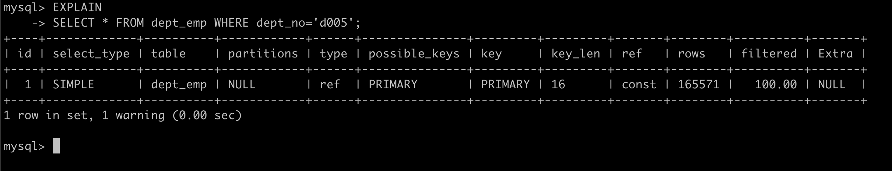</p>

<br>

dept_emp 테이블의 PK를 구성하는 칼럼(dept_no, emp_no) 중에서 일부만 동등 조건으로 WHERE 절에 명시됐기 때문에 조건에 일치하는 레코드가 1건이라는 보장이 없음

그래서 const가 아닌 ref 접근 방법

ref 칼럼값에는 const가 명시

이 const는 접근 방법이 아니라, ref 접근 방법에서 값 비교에 사용된 입력값이 상수였음을 의미


<br>

정리하자면

- const

    조인의 순서와 관계없이 PK나 UNIQUE KEY의 모든 칼럼에 대해 동등 조건으로 검색

    (반드시 1건의 레코드만 반환)

- eq_ref

    조인에서 첫 번째 읽은 테이블의 칼럼을 이용해 두 번째 테이블을 PK나 UNIQUE KEY로 동등 조건 검색

    (두 번쨰 테이블은 반드시 1건의 레코드만 반환)

- ref

    조인의 순서와 인덱스의 종류에 관계없이 동등 조건으로 검색

    (1건의 레코드만 반환된다는 보장이 없어도 됨)

3가지 모두 매우 좋은 접근 방법이며 성능상의 문제를 일으키지 않는 접근 방법

<br>

### fulltext

MySQL 서버의 전문 검색(Full-text Search) 인덱스를 사용해 레코드를 읽는 접근 방법

전문 검색 인덱스는 통계 정보가 관리되지 않으며, 사용하기 위해서는 다른 SQL 문법을 사용해야 함

<br>

MySQL 서버에서 전문 검색 조건은 우선순위가 상당히 높음

전문 검색은 MATCH (...) AGAINST (...) 구문을 사용해서 실행하는데 반드시 해당 테이블에 전문 검색용 인덱스가 준비돼 있어야 함

<p align="center">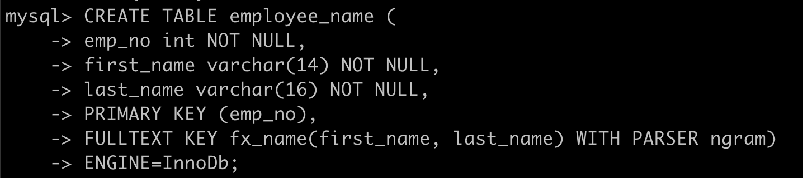</p>

<p align="center">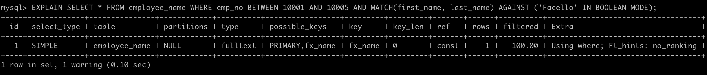</p>

<br>


### ref_or_null

ref 접근 방법과 같은데, NULL 비교가 추가된 형태

접근 방법의 이름 그대로 ref 방식 또는 NULL 비교(IS NULL) 접근 방법

실제 업무에서는 많이 활용되지는 않음

<p align="center">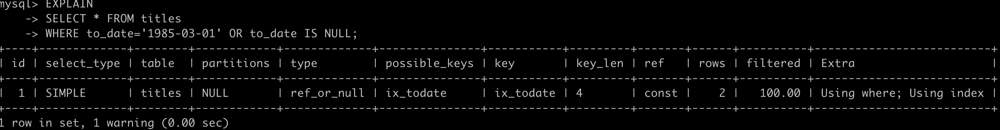</p>

<br>

### unique_subquery

WHERE 조건절에서 사용될 수 있는 IN(subquery) 형태의 쿼리를 위한 접근법

서브쿼리에서 중복되지 않는 유니크한 값만 반환할 때 사용

<p align="center">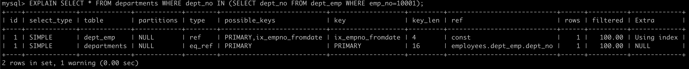</p>

<p align="center">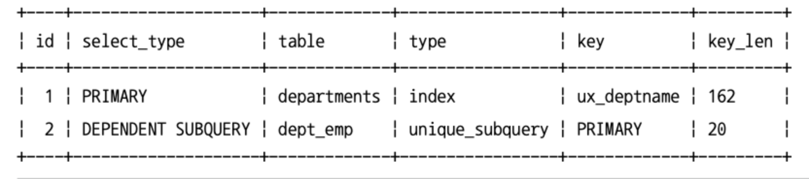</p>

<br>

책에서는 type이 unique_subquery로 나왔지만

실제 쿼리 실행 결과 ref, eq_ref가 나옴

show create table dept_emp;을 봤을 때, emp_no가 PK가 아니고 dept_no,emp_no가 PK
근데 책에서는 emp_no가 PK 처리가 되었음
예제 스키마가 잘못된 듯 

<p align="center">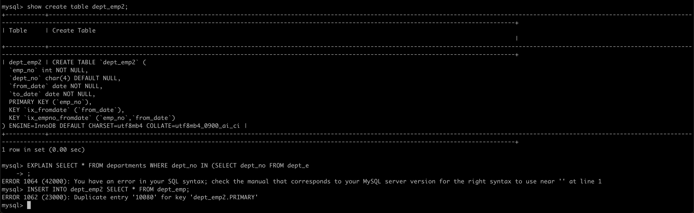</p>

<p align="center">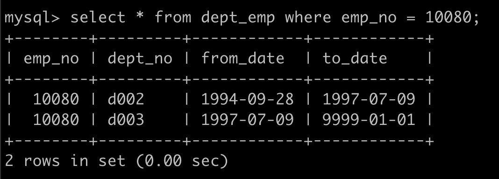</p>


<br>

dept_emp2를 만들어서 emp_no만 PK 값을 잡아서 해결하려고 했는데 부서 이동한 10080 같은 케이스 때문에 안됨

빈 스키마를 만들어서 해결하라고 하셨는데 잘 모르겠음...

<br>

<p align="center">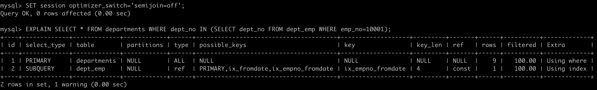</p>


<br>

semijoin을 끈 실행 계획이라는데 꺼도 unique_subquery는 볼 수 없었음

<br>

### index_subquery

IN 연산자의 특성상 IN(subquery) 또는 IN(상수 나열) 형태의 조건은 괄호 안에 있는 값의 목록 중에서 중복된 값이 먼저 제거

unique_subquery 접근 방법은 IN(subquery) 조건의 subquery가 중복된 값을 만들어내지 않는다는 보장이 있으므로 별도의 중복을 제거할 필요가 없음

하지만 업무 특성상 IN(subquery)에서 subquery가 중복된 값을 반환할수도

이떄 서브쿼리 결과의 중복된 값을 인덱스를 이용해서 제거할 수 있을 때 index_subquery

- unique_subquery

    IN (subquery) 형태의 조건에서 subquery의 반환 값에는 중복이 없으므로 별도의 중복 제거 작업이 필요하지 않음

- index_subquery

    IN (subquery) 형태의 조건에서 subquery의 반환 값에는 중복된 값이 있을 수 있지만 인덱스를 이용해 중복된 값을 제거할 수 있음

<br>

### range

인덱스 레인지 스캔의 접근 방법

range는 인덱스를 하나의 값이 아니라 범위로 검색하는 경우를 의미

`<, >, IS NULL, BETWEEN, IN, LIKE 등의 연산자를 이용해 인덱스를 검색할 때 사용`

일반적으로 애플리케이션의 쿼리가 가장 많이 사용하는 접근 방법

얼마나 많은 레코드를 필요로 하느냐에 따라 차이는 있겠지만 range 접근 방법도 상당히 빠름

<br>

<p align="center">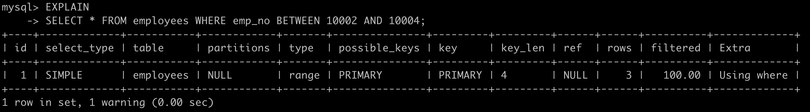</p>

인덱스 레인지 스캔이라고 하면 const, ref, range라는 세 가지 접근 방법을 모두 묶어서 지칭

<br>

### index_merge

지금까지 설명한 다른 접근 방법과는 달리 index_merge는 2개 이상의 인덱스를 이용해 각각의 검색 결과를 만들어낸 후, 그 결과를 병합해서 처리

특징

- 여러 인덱스를 읽어야 하므로 range 접근 방법보다 효율성이 떨어짐

- 전문 검색 인덱스를 사용하는 쿼리에서는 index_merge X

- index_merge 방법으로 처리된 결과는 항상 2개 이상의 집합이 되기 때문에 그 두 집합의 교집합이나 합집합 또는 중복 제거와 같은 부가 작업이 더 필요

<br>

다음은 두 개의 조건이 OR로 연결된 쿼리

그런데 OR로 연결된 두 개 조건이 모두 각각 다른 인덱스를 최적으로 사용할 수 있는 조건

<p align="center">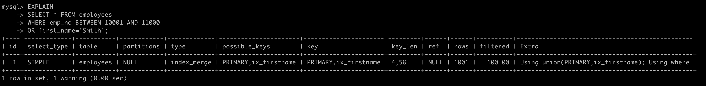</p>

<br>

emp_no BETWEEN 10001 AND 11000 조건은 employees 테이블의 PK를 이용해 조회하고

first_name=Smith 조건은 ix_firstname 인덱스를 이용해 조회한 후 두 결과를 병합하는 실행 계획

<br>

### index

인덱스를 처음부터 끝까지 읽는 풀 스캔을 의미

효율적으로 인덱스의 필요한 부분을 읽는 것이 아님

`풀 테이블 스캔 방식과 읽는 레코드 건수는 같지만 인덱스는 데이터 파일 전체보다 크기가 작기 떄문에 풀 테이블 스캔보다 빠르게 처리되며 쿼리의 내용에 따라 정렬된 인덱스의 장점을 이용할 수 있음`

- range나 const, ref 같은 접근 방법으로 인덱스를 사용하지 못하는 경우

- 인덱스에 포함된 칼럼만으로 처리할 수 있는 쿼리인 경우(데이터 파일을 읽지 않아도 되는 경우)

- 인덱스를 이용해 정렬이나 그루핑 작업이 가능한 경우(별도의 정렬 작업을 피할 수 있는 경우)

첫번째 + 두번째 or 첫번째 + 세번째

<br>

### ALL

풀 테이블 스캔을 의미하는 접근 방법

테이블을 처음부터 끝까지 전부 읽어서 불필요한 레코드를 제거(체크 조건이 존재할 때)하고 반환

가장 마지막에 선택하는 비효율적인 방법

<br>

InnoDB에서 리드 어헤드란

풀 테이블 스캔이나 인덱스 풀 스캔과 같은 대량의 디스크 I/O를 유발하는 작업을 위해 `한꺼번에 많은 페이지를 읽어들이는 기능`

`index와 ALL 접근 방법은 빠른 응답을 사용자에게 보내야 하는 웹 서비스 같은 온라인 트랜잭션 처리 환경에는 적합하지 않음`

<br>

리드 어헤드가 동작하면

인접한 페이지가 연속해서 몇 번 읽히는 읽기 스레드가 최대 64개의 페이지씩 한꺼번에 디스크로부터 읽어들임

innodb_read_ahead_threshold, innodb_random_read_ahead 시스템 변수 이용

<br>

### possible_keys 칼럼

possible_keys 칼럼에 있는 내용은 옵티마이저가 최적의 실행 계획을 만들기 위해 후보로 선정했던 접근 방법에서 사용되는 인덱스의 목록일 뿐

모든 인덱스가 목록에 포함되어 나오는 경우가 허다하기에 튜닝하는 데 크게 도움이 되지 않음

<br>

### key 칼럼

key 칼럼에 표시되는 인덱스는 최종 선택된 실행 계획에서 사용하는 인덱스

key 칼럼에 의도했던 인덱스가 표시되는지 확인하는 것이 중요

PRIMARY는 PK를 사용한다는 의미이며, 그 이외의 값은 테이블이나 인덱스를 생성할 때 부여했던 고유 이름

<br>

실행 계획의 type 칼럼이 index_merge가 아닌 경우에는 반드시 테이블 하나당 하나의 인덱스만 사용

type 칼럼이 ALL인 경우 인덱스를 사용하지 못하는 것이므로 NULL로 표시

<br>

### key_len 칼럼

실제 업무에서 사용하는 테이블은 단일 칼럼 인덱스보다 멀티 칼럼 인덱스가 더 많음

key_len는 `인덱스의 각 레코드에서 몇 바이트까지 사용했는지 알려주는 값`

<br>

<p align="center">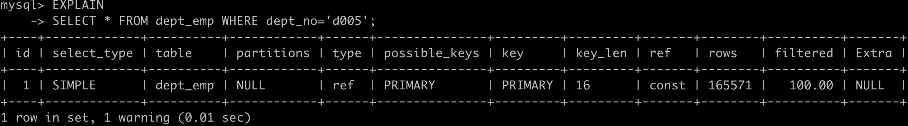</p>

해당 예제는 (dept_no, emp_no)로 구성된 PK를 가지는 dept_emp 테이블을 조회하는 쿼리

이 쿼리는 PK 중에서 dept_no만 비교에 사용

즉, dept_no 칼럼의 타입이 CHAR(4)이기에 PK에서 앞쪽 16바이트만 유효하게 사용했다는 의미

dept_no 칼럼은 utf8mb4 문자 집합을 사용하는데 실제 utf8mb4 문자 집합에서는 문자 하나가 차지하는 공간이 1바이트 ~ 4바이트까지 가변적

하지만 MySQL 서버는 utf8mb4 문자를 위해 메모리를 할당해야 할 때는 문자와 관계없이 고정적으로 4바이트로 계산 

즉, dept_no 칼럼의 문자 전체를 사용했다는 것

<br>

<p align="center">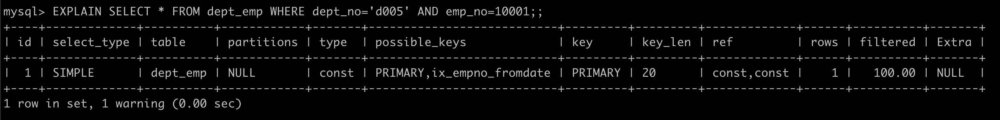</p>

해당 쿼리는 dept_no, emp_no를 모두 사용한 케이스

emp_no의 칼럼 타입은 INTEGER이며 4바이트를 차지

그래서 16 + 4

<br>

<p align="center">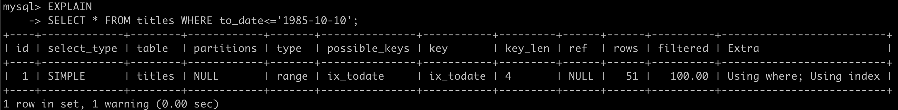</p>

다음 내용은 key_len은 4로 표시됐는데, ix_todate 인덱스는 DATE 타입 칼럼인 to_date라는 칼럼 하나만 가지고 있는 인덱스

MySQL에서 DATE 타입은 3바이트를 사용하므로 key_len는 3이라고 출력돼야 하는데, 왜 4가 출력됐을까?

<br>
DATE 타입을 사용하면서 NULL이 저장될 수 있는(NULLABLE) 칼럼으로 정리됐기 때문

MySQL에서는 NOT NULL이 아닌 칼럼에서는 칼럼의 값이 NULL인지 아닌지 저장하기 위해 1바이트를 추가로 더 사용

<br>

### ref 칼럼

접근 방법이 ref면 참조 조건(equal 비교 조건)으로 어떤 값이 제공됐는지 보여줌

```SQL
ex)

select 이름 from 주민 where 이름 = '이형길';
```


<br>

<p align="center">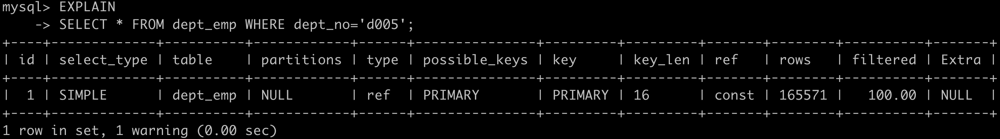</p>


상수값을 지정했다면 ref 칼럼 값은 const로 표시되고 다른 테이블의 칼럼 값이면 그 테이블 명과 칼럼 명이 표시

<br>

가끔 쿼리의 실행 계획에서 ref 칼럼의 값이 func로 표시될 때가 있음

참조용으로 사용되는 값을 그대로 사용한 것이 아니라 콜레이션 변환이나 값 자체의 연산을 거쳐서 참조됐다는 것을 의미


<br>

<p align="center">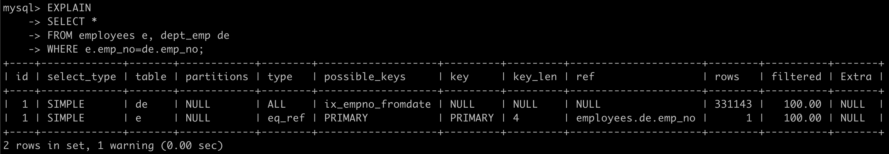</p>

해당 쿼리의 실행 계획읜 ref 칼럼에 조인 대상 칼럼의 이름이 그대로 표시

<br>

<p align="center">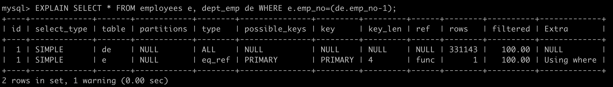</p>

이렇게 사용자가 명시적으로 값을 변환할 때 func가 표시

또한

MySQL 서버가 내부적으로 값을 변환해야 할 때도 ref 칼럼에는 func가 실행

문자 집합이 일치하지 않는 두 문자열 칼럼을 조인한다거나 숫자 타입의 칼럼과 문자열 타입의 칼럼으로 조인할 때가 대표적 예

가능하면 이런 변환을 하지 않아도 될 수 있도록 조인 칼럼의 타입은 일치시키는 편이 좋음

<br>

### rows 칼럼

MySQL 옵티마이저는 대상 테이블에 얼마나 많은 레코드가 포함돼 있는지 또는 각 인덱스 값의 분포도가 어떤지를 통계 정보를 기준으로 조사해서 예측

<br>

rows 칼럼 값은 실행 계획의 효율성 판단을 위해 예측했던 레코드 건수를 보여줌

`반환하는 레코드의 예측치가 아니라 쿼리를 처리하기 위해 얼마나 많은 레코드를 읽고 체크해야 하는지를 의미`

그래서 실행 계획의 rows 칼럼에 출력되는 값과 실제 쿼리 결과 반환된 레코드 건수는 일치하지 않는 경우가 많음

<br>

<p align="center">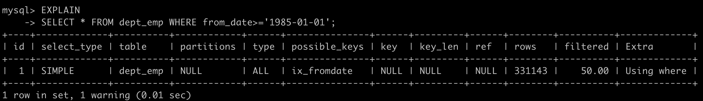</p>

dept_emp 테이블에서 from_date가 1985-01-01보다 크거나 같은 레코드를 조회하는 쿼리

possible keys를 봤을 때 ix_fromdate 인덱스를 사용하지 않고 type ALL을 봤을 때 풀 테이블 스캔을 한 것을 확인 가능

옵티마이저가 이 쿼리를 처리하기 위해 331,143건의 레코드를 읽어야 할 것으로 예측했고 

dept_emp 레코드가 331,143건이기에 테이블의 모든 레코드를 비교했음을 알 수 있음

<br>

<p align="center">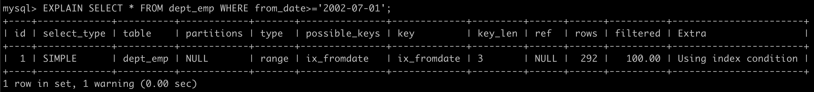</p>

범위를 줄인 쿼리를 봤을 때

대략 292건의 레코드만 읽고 체크해보면 원하는 결과를 얻을 수 있을 것으로 예측

그래서 range 스캔을 하기로 결

292건은 전체 테이블 건수와 비교했을 떄 8.8% 밖에 되지 않음

<br>

### filtered 칼럼

옵티마이저는 각 테이블에서 일치하는 레코드 개수를 가능하면 정확히 파악해야 좀 더 효율적인 실행 계획을 수립할 수 있음

하지만 대부분의 쿼리에서 WHERE 절에 사용되는 조건이 모두 인덱스를 사용할 수 있는 것은 X

특히 JOIN이 사용되는 경우에는 WHERE 절에서 인덱스를 사용할 수 있는 조건도 중요 

하지만 인덱스를 사용하지 못하는 조건에 일치하는 레코드 건수를 파악하는 것도 매우 중요

<br>

<p align="center">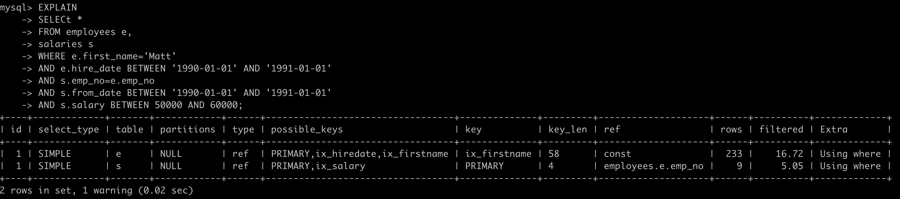</p>

employees 테이블과 salaries 테이블을 조인하고

employees 테이블의 e.first_name='Matt' 조건은 인덱스를 사용할 수 있으며

salarise 테이블은 s.salary BETWEEN 50000 AND 60000 조건이 인덱스를 사용할 수 있음

`이 경우 employees 테이블과 salaries 테이블 중 나머지 조건들까지 합쳐서 최종적으로 일치하는 레코드 건수가 적은 테이블이 드라이빙 테이블이 선정될 가능성이 높음`

실행 계획을 봤을 때

employees 테이블에서 인덱스 조건에만 일치하는 레코드는 대략 233건

이 중에서 16.72%만 인덱스를 사용하지 못하는 e.hire_date BETWEEN '1990-01-01' AND '1991-01-01' 조건에 일치한다는 것을 알 수 있음


filtered 칼럼 값은 필터링되어 버려지는 레코드의 비율이 아니라 `필터링되고 남은 레코드의 비율`

그래서 employees 테이블에서 salaries 테이블로 조인을 수행한 레코드 건수는 대략 39 (233 *)건 정도

테이블의 조인 순서가 반대가 되면?

<br>

<p align="center">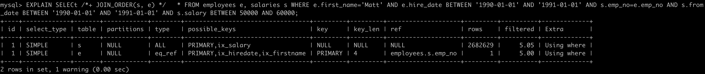</p>

왜 책과 내용이 다를까?

ix_salary를 선택하지 않고 Fulltablescan 하였음 
5%만 선택되었음

<br>

<p align="center">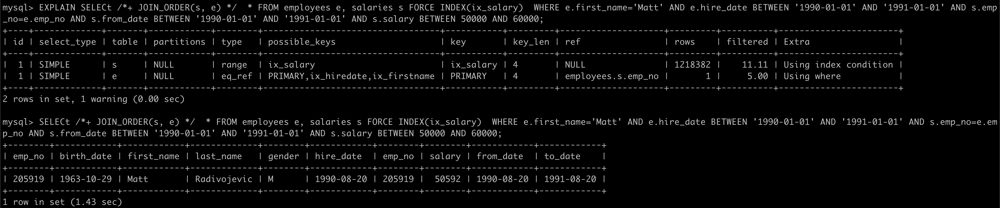</p>

<p align="center">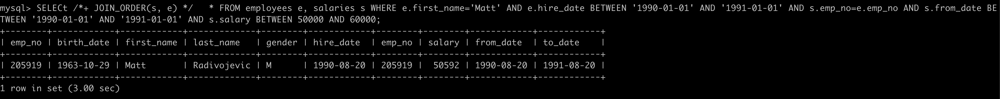</p>

강제로 인덱스를 타게 하고 실행 시간을 확인해보니 인덱스를 안탄 쿼리보다 빨랐음

왜 옵티마이저는 더 느린 것을 선택했는지?

완벽하지 않아서?

<br>

### Extra 칼럼

쿼리의 실행 계획에서 성능에 관련된 중요한 내용이 Extra 칼럼에 자주 표시

해당 칼럼에는 고정된 몇 개의 문장이 표시되는데, 일반적으로 2~3개씩 함께 표시

주로 내부적인 처리 알고리즘에 대해 더 깊이 있는 내용을 보여주는 경우가 많음

<br>

### const row not found

쿼리의 실행 계획에서 const 접근으로 읽었는데 실제로 해당 테이블에 레코드가 1건도 존재하지 않으면 Extra 칼럼에 이 내용이 표시

테이블에 적절히 테스트용 데이터를 저장하고 다시 한번 쿼리의 실행 계획을 확인

<br>

### Deleting all rows

MyISAM 스토리지 엔진과 같이 스토리지 엔진의 핸들러 차원에서 테이블의 모든 레코드를 삭제하는 기능을 제공하는 스토리지 엔진 테이블인 경우 Extra 칼럼에 Deleting all rows 문구 표시

WHERE 조건절이 없는 DELETE 문장의 실행 계획에서 자주 표시되며, 이 문구는 테이블의 모든 레코드를 삭제하는 핸들러 기능(API)을 한 번 호출함으로써 처리됐다는 것을 의미

기존에는 테이블의 레코드를 삭제하기 위해 각 스토리지 엔진의 핸들러 함수를 레코드 건수만큼 호출해서 삭제해야 했는데

Deleting all rows 처리 방식은 한 번의 핸들러 함수 호출로 아주 간단하고 빠르게 처리할 수 있음

> 8.0 버전에서는 InnoDB 스토리지 엔진과 MyISAM 엔진 모두 더 이상 Deleting all rows는 표시되지 않음
<br> <br> 테이블의 모든 레코드를 삭제하고자 한다면, WHERE 조건절이 없는 DELETE보다는 TRUNCATE TABLE 명령 사용


<br>

### Distinct

<br>

<p align="center">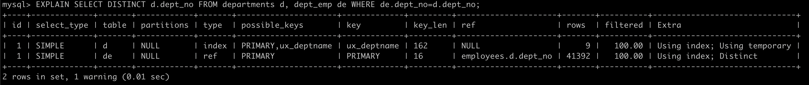</p>

위 쿼리에서 실제 조회하려는 값은 dept_no인데,

departments 테이블과 dept_emp 테이블에 모두 존재하는 dept_no만 중복 없이 유니크하게 가져오기 위한 쿼리

그래서 두 테이블을 조인해서 그 결과에 다시 DISTINCT 처리를 한 것

<br>

<p align="center">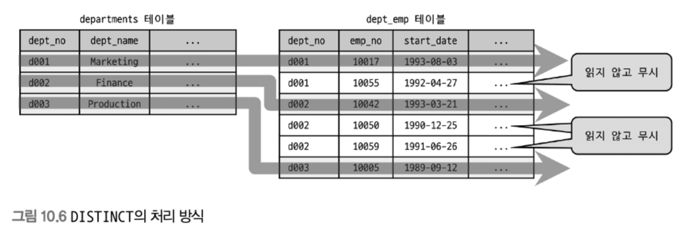</p>

Extra 칼럼에 Distinct가 표시되는 경우 어떻게 처리되는지 확인

조인하지 않아도 되는 항목은 모두 무시하고 꼭 필요한 것만 조인했으며, dept_emp 테이블에서는 꼭 필요한 레코드만 읽었다는 것을 표현

> 궁금한 점
<br><br>
Distinct를 처리하면 늦는 이유가 읽지 않고 무시 과정에서 중복인지 아닌지 확인하는 과정이 있기 때문? 그럼 인덱스가 없는 칼럼이 포함되어 있는 DISTINCT라면 오래 걸리겠
<br><br>
Real MySQL 8.0 1권 9.2.5 DISTINCT 참고
<br><br>
DISTINCT 키워드는 조회되는 모든 칼럼에 영향을 미침
<br><br>
절대로 SELECT하는 여러 칼럼 중에서 일부 칼럼만 유니크하게 조회하는 것이 아님
<br><br>
SELECT DISTINCT first_name, last_name FROM employees;
<br><br>
에서도 first_name, last_name 두 가지 모두 UNIQUE 해야 함
<br><br>
아마도 레코드의 칼럼들의 UNIQUE를 비교하는 것에서 시간이 오래걸리지 않을까?

<br>

### FirstMatch

세미 조인의 여러 최적화 중 FirstMatch 전략이 사용되면 MySQL 옵티마이저는 Extra 칼럼에 FirstMatch(table_name) 메시지를 출력

<br>

<p align="center">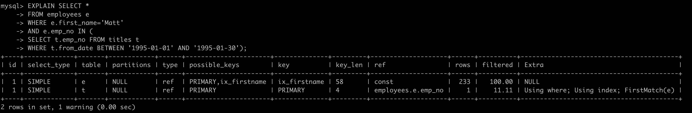</p>

FirstMatch 메시지와 함께 표시되는 테이블명은 기준 테이블을 의미하는데, 위 실행 계획의 경우 employees 테이블을 기준으로 titles 테이블에서 첫 번째로 일치하는 한 건만 검색한다는 것을 의미


### Full scan on NULL KEY

이 처리는 "col1 IN (SELECT col2 FROM ...)"과 같은 조건을 가진 쿼리에서 자주 발생할 수 있는데, col1의 값이 NULL이 된다면 

결과적으로 조건은 "NULL IN (SELECT col2 FROM ...)과 같이 바뀜

SQL 표준에서는 NULL을 알 수 없는 값으로 정의하고 있으며, NULL에 대한 연산의 규칙까지 정의

- SELECT col2 FROM ...(서브 쿼리)가 1건이라도 결과 레코드를 가진다면 최종 비교 결과는 NULL

    Why? NULL과의 비교는 NULL이니까

- SELECT col2 FROM ...(서브 쿼리)가 1건도 결과 레코드를 가지지 않는다면 FALSE

이 비교 과정에서 col1이 NULL이면 서브쿼리에 사용된 테이블에 대해서 풀 테이블 스캔(FULL scan)을 해야만 결과를 알아낼 수 있음

Why?

NULL일지 FALSE일지 모르기 때문

Full scan을 해야만 결과를 알아낼 수 있음

Full scan ON NULL key는 쿼리를 실행하는 중 col1이 NULL을 만나면 차선책으로 서브쿼리에 테이블에 대해서 풀 테이블 스캔을 사용할 것이라는 사실을 알려주는 키워드

"col1 IN (SELECT col1 FROM ...) 조건에서 col1이 NOT NULL로 정의된 칼럼이라면 안나옴

<br>

칼럼이 NOT NULL로 정의되진 않았지만 이런 NULL 비교 규칙을 무시해도 된다면 col1이 절대 NULL은 될 수 없다는 것을 MySQL에게 알려줘라

col1 IS NOT NULL이라는 조건을 지정하는 것

그러면 col1이 NULL이면 col1 IS NOT NULL은 FALSE가 되기에 col1 IN ~ 는 실행하지 않음

<br>

Full scan on NULL key 코멘트가 Extra 칼럼에 표시됐다고 하더라도 IN이나 NOT IN 연산자의 왼쪽에 있는 값이 실제로 NULL이 없다면 풀 테이블 스캔은 발생하지 않음

하지만, IN, NOT IN 연산자의 왼쪽 값이 NULL인 레코드가 있고 서브쿼리에 개별적으로 WHERE 조건이 지정돼 있다면 상당한 성능 문제가 있을 것

<br>

### Impossible HAVING

쿼리에 사용된 HAVING 절의 조건을 만족하는 레코드가 없을 때 Impossible HAVING 키워드 표시

<br>

<p align="center">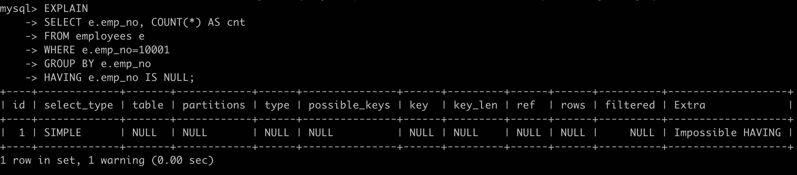</p>

emp_no가 PK이고 NOT NULL 타입의 칼럼이므로 HAVING 절은 무조건 FALSE임

해당 메시지가 표시된다면 쿼리가 제대로 작성되지 못한 경우가 대부분이므로 쿼리의 내용을 점검하자

<br>

### Impossible WHERE

WHERE 조건이 항상 FALSE가 될 수밖에 없는 경우 Impossible WHERE가 표시

<br>

<p align="center">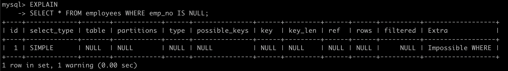</p>

WHERE emp_no IS NULL은 항상 FALSE

<br>

### LooseScan

세미 조인 최적화 중에서 LooseScan 최적화 전략이 사용되면 실행 계획의 Extra 칼럼에는 LooseScan 문구가 표시

<br>

<p align="center">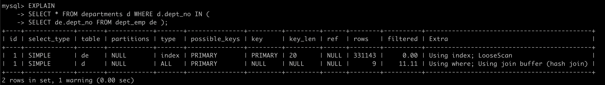</p>

9.3.1.12 loose scan을 참고하자

<br>

### No matching min/max row

MIN이나 MAX같은 집합 함수가 있는 쿼리의 조건절에 일치하는 레코드가 한 건도 없을 때 해당 메시지 출력

MIN이나 MAX의 결과로 NULL이 반환

<br>

No Matching ~ 이나 Impossible WHERE 등의 메시지는 잘못 생각하면 쿼리 자체가 오류인 것처럼 오해하기 쉬움

하지만 Extra 칼럼에 출력되는 내용은 단지 쿼리의 실행 계획을 산출하기 위한 기초 자료가 없음을 표현하는 것

실제 쿼리가 문법적으로 오류가 있는 것은 아님

쿼리 처리를 위한 데이터가 없다는 의미

<br>

### no matching row in const table

<br>

<p align="center">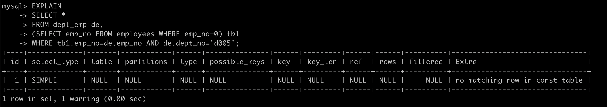</p>

조인에 사용된 테이블에서 const 방법으로 접근할 때 일치하는 레코드가 없으면 해당 메시지 표시

Impossible ... 과 같은 종류로 실행 계획을 만들기 위한 기초 자료가 없음을 의미

<br>

### No matching rows after partition pruning

해당 메시지는 파티션된 테이블에 대한 UPDATE or DELETE 명령의 실행 계획에서 표시될 수 있는데, 해당 파티션에서 UPDATE하거나 DELETE할 대상 레코드가 없을 때 표시

<br>

<p align="center">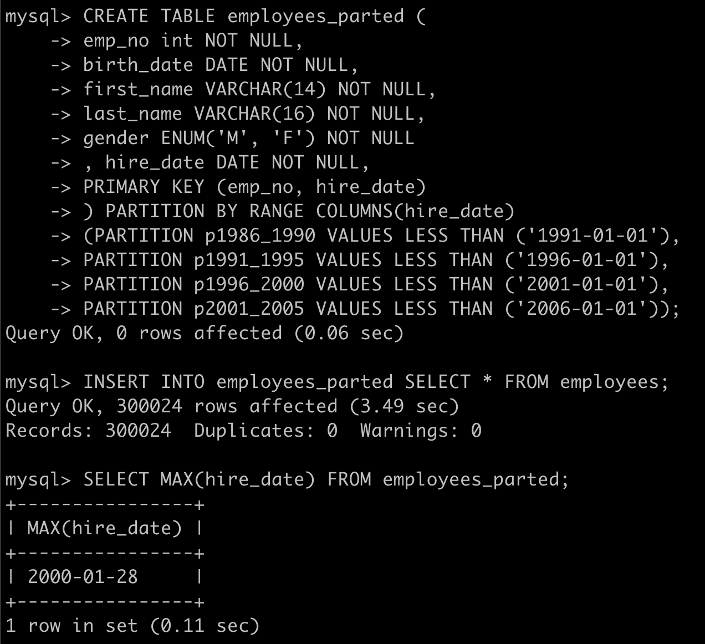</p>

해당 예제의 employees_parted 테이블은 hire_date 칼럼을 기준으로 5년 단위 파티션으로 구성되어 있음

employees 테이블의 모든 레코드를 employees_parted 테이블에 복사하고

employees_parted 테이블의 최댓값은 2000-01-28이라는 것도 확인

<br>

<p align="center">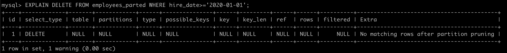</p>

hire_date 칼럼의 값이 2020년보다 큰 경우만 삭제하는 쿼리에 대해서 실행 계획을 확인해보자

hire_date 칼럼 값이 2006년 1월 1일 이전까짐나 파티션이 정의되어 있음 그래서 2020년 1월 1일보다 큰 값을 삭제하는 DELETE 문장의 실행 계획에서 partitions 칼럼이 비어있음

이런 경우 No matching rows after partition pruning 메시지 출력

단순히 삭제할 레코드가 없음을 의미한느 것이 아니라 대상 파티션이 없다는 것을 의미

<br>

<p align="center">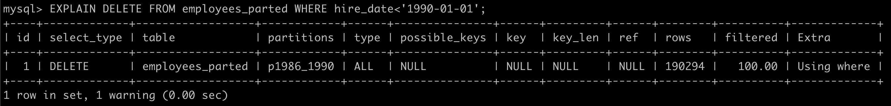</p>

다음 예제를 살펴보면 실제 삭제할 레코드는 없지만 대상 파티션은 있기에 실행 계획에서 partitions 칼럼은 비어있지 않으며, Extra칼럼에도 해당 메시지가 표시되지 않음

<br>

### No tables used

FROM 절이 없는 쿼리 문장이나 FROM DUAL 형태의 쿼리 실행 계획에서는 해당 메시지가 표시

> FROM DUAL에서 DUAL은 펑션이나 계산식을 테이블 생성없이 수행해보기 위한 용도로 사용되는 dummy 테이블

다른 DBMS와 달리 MySQL 서버는 FROM 절리 없는 쿼리도 허용


