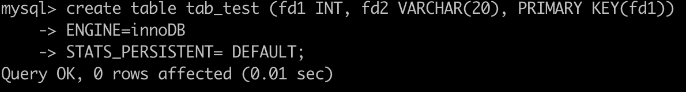
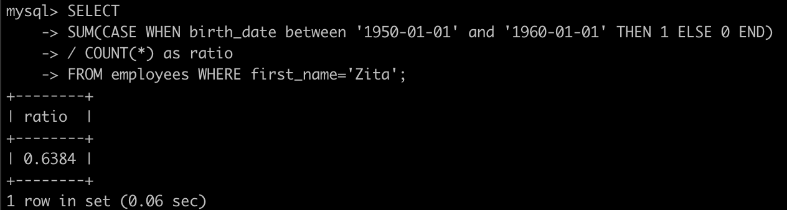

# 10장. 실행계획

DBMS는 `많은 데이터를 안전하게 저장 및 관리하고 사용자가 원하는 데이터를 빠르게 조회`할 수 있게 해주는 것이 주목적

옵티마이저가 최적으로 처리될 수 있게 하는 쿼리의 실행 계획 수립 중요

But, 옵티마이저가 개입 없이 항상 좋은 실행 계획을 만들어낼 수 있는 것은 X

EXPALIN 명령으로 실행 계획 확인

<br>

MySQL 서버가 데이터를 처리하는 로직을 이해할 필요

해당 장에서는 통계 정보, 실행 계획 읽는 순서, 출력 키워드, 알고리즘에 대해서 공부

<br>

## 통계 정보

5.7 버전까지는 테이블 칼럼의 값들이 실제 어떻게 분포돼 있는지에 대한 정보가 없어 실행 계획의 정확도가 떨어지는 경우가 다수

8.0 버전 부터는 인덱스되지 않은 칼럼에 대해서도 데이터 분포도의 히스토그램 정보가 도입

<br>

### 테이블 및 인덱스 통계 정보

```
RBO의 경우 예측이 가능하며, 안정적이고 플랜의 제어가 쉬움 
이런 이유 때문에 일부 DBA나 고급 개발자들은 이 방식을 선호

CBO의 경우 예측 불가능하고 플랜의 제어가 쉽지 않음
간혹 잘못된 실행 계획을 제공하는 경우도 존재

첫째, 최적의 인덱스 구성하기
둘째, 올바른 SQL문 작성하기
셋째, 주기적이거나 혹은 최신의 통계정보 갱신하기
넷째, 힌트절 추가해 옵티마이저 제어하기
```

CBO에서 가장 중요한 것은 통계 정보

정확하지 않다면 전혀 엉뚱한 방향으로 쿼리를 실행하기 때문

MySQL 서버에서는 쿼리의 실행 계획을 수립할 때 실제 테이블의 데이터를 일부 분석해서 통계 정보를 보완해서 사용

<p align="center"></p>

MySQL DB에 존재하는 innodb_index_stats, innodb_table_stats에서 통계 정보를 확인 및 관리 가능

<p align="center"></p>

stat_value = 지정된 통계량 값
sample_size = 제공된 견적에 대해 샘플링된 페이지 수

<p align="center"></p>

이렇게 테이블로 관리함으로써 MySQL 서버가 재시작돼도 기존의 통계 정보를 유지할 수 있음

<br>

테이블을 생성할 때는 stats_persistent 옵션을 설정할 수 있는데 이 설정 값에 따라 테이블 단위로 영구적인 통계 정보를 보관 결정

<p align="center"></p>

stats_persistent 옵션의 기본값은 ON(1)

<p align="center"></p>

- inndb_index_stats.stat_name='n_diff_pfx%'

    인덱스가 가진 유니크한 값의 개수

- inndb_index_stats.stat_name='n_leaf_pages'

    인덱스의 리프 노드 페이지 개수

- inndb_index_stats.stat_name='size'

    인덱스 트리의 전체 페이지 개수

- innodb_table_stats.n_rows

    테이블의 전체 레코드 건수

- innodb_table_stats.clustered_index_size

    프라이머리 키의 크기(innodb 페이지 개수)

- innodb_table_stats.sum_of_other_index_sizes

    프라이머리 키를 제외한 인덱스의 크기(innodb 페이지 개수)


<br>

#### 질문

innodb_index_stats 테이블을 열어봤을 때, gender로 설명되는 인덱스의 유니크한 값의 개수가 1개로 나와 있는데 실제 테이블을 열어봤을 때 M, F 두 가지의 유니크한 값이 나와 있음 Why?

<p align="center"></p>

-> Uzi의 답변

    table status로 employees 테이블을 확인해본 결과 Rows는 299113이었지만 실제 count를 해봤을 때 300024로 숫자가 달랐음

    이것은 통계 정보의 오류로, 통계 정보는 틀릴 수 있는 가능성을 항상 가지고 있으며 이것이 CBO의 단점

<p align="center"></p>


<br>

통계 정보는 해당 이벤트로 자동 갱신

- 테이블이 새로 오픈되는 경우

- 테이블의 레코드가 대량으로 변경되는 경우(테이블의 전체 레코드 중에서 1/16 정도의 UPDATE 또는 INSERT나 DELETE가 실행되는 경우)

- ANALYZE TABLE 명령이 실행되는 경우

- SHOW TABLE STATUS 명령이나 SHOW INDEX FROM 명령이 실행되는 경우

- InnoDB 모니터가 활성화되는 겨웅

- innodb_stats_on_metadata 시스템 설정이 ON인 상태에서 SHOW TABLE STATUS 명령이 실행되는 경우

이렇게 자주 통계 정보가 갱신되면 인덱스 레인지 스캔으로 잘 처리하다가도 갑자기 풀 테이블 스캔이 실행되는 상황이 생길수도

innodb_stats_auto_recalc 시스템 변수를 OFF로 설정하면 자동 갱신을 막을 수 있음

Default 값은 1

0으로 설정시 ANALYZE TABLE 명령으로 실행할 때만 갱신

<br>

- innodb_stats_transient_sample_pages

    기본값은 8로, 자동으로 통계 정보 수집이 실행될 떄 8개의 페이지만 임의로 샘플링해서 분석하고 그 결과를 통계 정보로 활용

    해당 변수를 높게 설정시 더 정확한 통계 정보를 수집할 수 있음
    
    너무 높이면 시간이 길어짐

- innodb_stats_persistent_sample_pages

    기본값은 20이며, ANALYZE TABLE 명령이 실행되면 임의로 20개 페이지만 샘플링해서 분석하고 그 결과를 영구적인 통계 정보 테이블에 저장하고 활용

<br>

### 히스토그램

8.0 버전부터 칼럼의 데이터 분포도를 참조할 수 있는 히스토그램 정보를 활용

<br>

### 히스토그램 정보 수집 및 삭제

히스토그램 정보는 칼럼 단위로 관리되는데 자동 수집으로는 안되고

ANALYZE TABLE ... UPDATE HSTOGRAM 명령으로 수동으로 수집 및 관리

<br>

수집된 히스토그램 정보는 시스템 딕셔너리에 함께 저장되고

MySQL 서버가 시작될 때 딕셔너리의 히스토그램 정보를 information_schema db의 column_statistics 테이블로 로드

그래서 실제 히스토그램 정보를 조회하려면 column_statistics 테이블을 SELECT해서 참조

<br>

### 실습

<p align="center"></p>

```
### 참고

enum type

데이터 중에는 몇 가지의 한정된 값만 갖는 경우

예를 들어 행정구역, 계절, 성별 ...

성질이 비슷한 상수를 모아놓음
```

2종류의 히스토그램 타입 지원

- Singleton 히스토그램

    칼럼값 개별로 레코드 건수를 관리하는 히스토그램

    = 도수 분포

- Equi-Height 히스토그램

    칼럼값의 범위를 균등한 개수로 구분해서 관리하는 히스토그램

    = Height-Balanced 히스토그램

히스토그램은 Bucket 단위로 구분되어 레코드 건수나 칼럼값의 범위가 관리

싱글톤 히스토그램은 칼럼이 가지는 값별로 버킷이 할당

```
"buckets": [[1, 0.6008588895063911], [2, 1.0]]

이렇게 2개 할당

칼럼의 값과 발생 빈도 비율 2가지의 값
```

높이 균형 히스토그램은 개수가 균등한 칼럼값 범위별로 하나의 버킷이 할당

```
"buckets": [["1985-02-01", "1985-03-01", 0.010023745768706108, 29], ["1985-03-02", "1985-03-29", 0.019966654877987166, 28], ["1985-03-30", "1985-04-26", 0.02997019148183701, 28], ["1985-04-27", "1985-05-23", 0.03989289142626181, 27], ...]

이렇게 균등한 개수를 정하고 칼럼값 범위를 나눠서 할당
## 29, 28.. 는 각 버킷에 포함된 유니크한 값의 개수니까 다른 거임

범위 시작 값, 마지막 값, 발생 빈도율, 버킷에 포함된 유니크한 값의 개수 등 4개의 값
```

히스토그램의 모든 레코드 건수 비율은 누적으로 표시

예를 들어, gender에서 비율이 1이 0.6 2가 1 인데 이것은 2 값이 1 - 0.6인 0.4라는 뜻

높이 균형 히스토그램의 누적 비율이 일정한 것을 보면 각 범위가 비슷한 레코드의 건수를 가진다는 것을 알 수 있음

<br>

나머지 필드의 값

- sampling-rate

    히스토그램 정보를 수집하기 위해 스캔한 페이지의 비율

    histogram_generation_max_mem_size 시스템 변수에 설정된 메모리 크기에 맞게 적절히 샘플링

    default는 20MB

- histogram-type

    히스토그램 종류 저장

- number-of-buckets-specified

    히스토그램을 생성할 때 설정했던 버킷의 개수 저장

    기본으로 100개, 최대 1024개 설정 가능

<br>

생성된 히스토그램 삭제

<p align="center"></p>

<br>

히스토그램을 사용하지 않으려면

```
mysql> SET GLOBAL optimizer_switch='condition_fanout_filter=off'

// 현재 커넥션에서 실행되는 쿼리만 히스토그램을 사용하지 않게 설정
mysql> SET SESSION optimizer_switch='condition_fanout_filter=off'

// 현재 쿼리만 히스토그램을 사용하지 않게 설정
mysql> SELECT /*+ SET_VAR(optimizer_switch='condition_fanout_filter=off') */ * FROM ...

```

<br>

### 히스토그램의 용도

히스토그램 도입 전에도 테이블과 인덱스에 대한 통계 정보는 존재

But, 기존 통계 정보는 테이블의 전체 레코드 건수와 인덱스된 칼럼이 가지고 있는 유니크한 값의 개수 정도

예를 들어 테이블의 레코드가 1000건, 어떤 칼럼의 유니크한 값 개수가 100건이라면

이 칼럼에 대해 다음과 같은 동등 비교 검색을 하면 대략 10개의 레코드가 일치할 것으로 예측

```
mysql> SELECT * FROM order WHERE user_id='matt.lee';
```

<br>

But, `실제 응용 프로그램의 데이터는 항상 균등한 분포를 갖지 않음`

그래서 기존의 통계 정보는 해당 부분을 고려하지 못했음

이런 단점을 보완하기 위해 히스토그램 도입

히스토그램은 각 범위(버킷)별로 레코드의 건수와 유니크한 값의 개수 정보를 가지기 때문에 더 정확한 예측이 가능

<br>

<p align="center"></p>

<br>

<p align="center"></p>

<br>

위의 첫번째 이미지는 옵티마이저는 first_name='Zita' 조건에 일치하는 레코드 224건이 있고, 그 중 대략 11.11%인 24.8명 정도의 birth_date가 1950년대 생으로 예측

두번째 이미지는 히스토그램 정보를 수집하고 동일한 쿼리의 실행 계획을 봤을 때,

대략 61.03%인 136명이 1950년대 생으로 예측

<p align="center"></p>

<br>

실제 데이터를 조회해보면 대략 63.84%인 143명이 1950년대 생이라는 것을 알 수 있음

단순 통계 정보만을 이용한 경우와 히스토그램을 이용한 경우 차이가 매우 큼

<br>

히스토그램이 있으면 특정 범위의 데이터가 많고 적음을 식별할 수 있기에 쿼리의 성능에 상당한 영향을 미침

<p align="center"></p>

<br>

위의 예제는 2개의 테이블을 조인하는데 옵티마이저 힌트를 통해 강제로 조인의 순서를 바꿔 성능을 살펴봄

첫번째 쿼리는 employees 테이블을 읽고 salaries 테이블을 조인한 예제

두번째 쿼리는 salaries 테이블을 읽고 employees 테이블을 조인한 예제

### 첫번째 쿼리가 더 빠른 이유는?

조인해야 할 건수가 salaries 테이블을 먼저 읽은 경우보다 훨씬 적음

Why?

birth_date 칼럼과 salary 칼럼은 인덱스되지 않은 칼럼이기에 이 칼럼들의 데이터 분포를 전혀 알지 못하고 실행 계획을 수립

<u>내 생각</u>

두 칼럼이 모두 인덱스가 없기에 풀 테이블 스캔은 필수적

Salary 칼럼이 레코드 수가 더 많고 birth_date 칼럼이 레코드 수가 더 적기에

salary 칼럼이 드라이빙되는 것이 조인하는 횟수가 훨씬 적음

<u>검증</u>

<p align="center"></p>

<br>

생각이 맞았고, birth_date가 0개 였기에 empty set이었음

이러한 차이로 쿼리의 성능은 10배 차이를 보일 수 있으며, InnoDB 버퍼 풀에 데이터가 존재하지 않아서 디스크에서 데이터를 읽어야 하는 경우라면 몇 배의 차이 발생

`결국 각 칼럼에 대해 히스토그램 정보가 있으면 어느 테이블을 먼저 읽어야 조인의 횟수를 줄일 수 있을지 옵티마이저가 더 정확하게 판단 가능`

<br>

### 히스토그램과 인덱스

히스토그램과 인덱스는 완전히 다른 객체이기에 서로 비교할 대상은 아니지만,

인덱스는 부족한 통계 정보를 수집하기 위해 사용되는 측면에서 어느 정도 공통점을 가짐

쿼리의 실행 계획을 수립할 때 

<u>사용 가능한 인덱스들로부터 조건절에 일치하는 레코드 건수를 대략 파악하고

최종적으로 가장 나은 실행 계획을 선택</u>

이 때 조건절에 일치하는 레코드 건수를 예측하기 위해 옵티마이저는 실제 인덱스의 B-Tree를 샘플링해서 살펴봄

이 작업을 인덱스 다이브(Index dive)라고 표현

<br>

쿼리의 검색 조건으로 많이 사용되는 컬럼에 대해서는 일반적으로 인덱스를 생성

이렇게 인덱스된 칼럼에 대해 히스토그램 정보를 수집해두는 것이 좋을까?

```
mysql> SELECT *
        FROM employees
        WHERE first_name='Tonny'
        AND birth_date BETWEEN '1954-01-01' AND '1955-01-01';
```

해당 쿼리에서 옵티마이저는 테이블 풀 스캔을 할지, first_name 인덱스를 이용할지 고민

birth_date 칼럼에는 인덱스가 없으므로 해당 칼럼은 실행 계획에 큰 영향을 미치지 않을 것

<br>

<u>first_name 칼럼에 히스토그램이 수집되어 있었다면 옵티마이저는 해당 내용을 이용할까?</u>

사용하지 않음

실제 인덱스 다이브를 통해 직접 수집한 정보를 활용

`이는 실제 검색 조건의 대상 값에 대한 샘플링을 실행하는 것이기에 히스토그램보다 정확한 결과를 기대할 수 있기 때문`

`그래서 8.0 버전에서 히스토그램은 주로 인덱스되지 않은 칼럼에 대한 데이터 분포를 참조하는 용도로 사용`

<br>

### 코스트 모델

MySQL 서버가 쿼리를 처리하려면 다음과 같은 다양한 작업 필요

- 디스크로부터 데이터 페이지 읽기

- 메모리(InnoDB 버퍼 풀)로부터 데이터 페이지 읽기

- 인덱스 키 비교

- 레코드 평가

- 메모리 임시 테이블 작업

- 디스크 임시 테이블 작업

<br>

MySQL 서버는 사용자의 쿼리에 대해 이런 작업들이 얼마나 필요한지 예측하고 전체 작업 비용을 계산한 결과를 바탕으로 최적의 실행 계획을 찾음

이렇게 `전체 쿼리의 비용을 계산하는 데 필요한 단위 작업들의 비용을 코스트 모델(Cost Model)`이라고 함

5.7 버전까지는 이런 비용들을 서버 소스 코드에 상수화해서 사용

근데 해당 비용들은 서버가 사용하는 하드웨어에 따라 달라질 수 있기에 예전 버전처럼 고정된 비용을 적용하는 것은 최적의 실행 계획 수립에 있어서 방해 요소

<br>

해당 단점을 보완하기 위해 5.7 버전부터 상수화돼 있던 각 단위 작업의 비용을 DBMS 관리자가 조정할 수 있도록 개선

하지만 해당 버전에서는 인덱스되지 않은 칼럼의 히스토그램이나 메모리에 상주 중인 페이지의 비율 등 비용 계산과 연관 부분 정보들이 부족한 상태

8.0 버전으로 업그레이드되면서 해당 이슈가 해소되고 옵티마이저 실행 계획 수립에 사용되기 시작

<br>

코스트 모델은 다음 2개 테이블에 저장돼 있는 설정값을 사용하는데, 두 테이블 모두 mysql DB에 존재

- server_cost : 인덱스를 찾고 레코드를 비교하고 임시 테이블 처리에 대한 비용 관리

- engine_cost : 레코드를 가진 데이터 페이지를 가져오는 데 필요한 비용 관리

<br>

두 테이블은 공통으로 5개의 칼럼을 갖고 있음

- cost_name

    코스트 모델의 각 단위 작업

- default_value

    각 단위 작업의 비용 (기본값이며, 이 값은 서버 소스 코드에 설정된 값)

- cost_value

    DBMS 관리자가 설정한 값 (이 값이 NULL이면 MySQL 서버는 default_value 칼럼의 비용 사용)

- last_updated

    단위 작업의 비용이 변경된 시점

    옵티마이저에 영향을 미치는 정보 X, 단순 정보성

- comment

    비용에 대한 추가 설명

    옵티마이저에 영향을 미치는 정보 X, 단순 정보성

<br>

engine_cost는 2개의 칼럼을 더 가지고 있음

- engine_name

    비용이 적용된 스토리지 엔진

- device_type

    디스크 타입

<br>

코스트 모델에서 지원하는 단위 작업은 다음과 같음

|             | cost_name                    | default_value | 설명 |
|-------------|------------------------------|---------------|---|
| engine_cost | io_block_read_cost           |          1.00 | 디스크 데이터 페이지 읽기 |
|             | memory_block_read_cost       |          0.25 | 메모리 데이터 페이지 읽기 |
| server_cost | disk_temptable_create_cost   |         20.00 | 디스크 임시 테이블 생성  |
|             | disk_temptable_row_cost      |          0.50 | 디스크 임시 테이블의 레코드 읽기  |
|             | key_compare_cost             |          0.05 | 인덱스 키 비교 |
|             | memory_temptable_create_cost |          1.00 | 메모리 임시 테이블 생성  |
|             | memory_temptable_row_cost    |          0.10 | 메모리 임시 테이블의 레코드 읽기 |
|             | row_evaluate_cost            |          0.10 | 레코드 비교 |


```
### 디스크 임시 테이블 생성을 하는 이유

MySQL에서 임시 테이블을 생성하는 실행 계획이 나오는 이유는 다양합니다. 가장 일반적인 이유는 다음과 같습니다:

임시 테이블 필요성: 쿼리 실행 중에 중간 결과를 저장하거나 정렬된 데이터를 임시로 보관해야 할 때 임시 테이블이 필요할 수 있습니다. 예를 들어, 대용량의 데이터를 정렬하거나 복잡한 조인을 수행하는 경우 임시 테이블을 사용하여 중간 결과를 저장할 수 있습니다.
메모리 부족: 쿼리 실행 중에 메모리가 부족한 경우 MySQL은 디스크에 임시 테이블을 생성하여 데이터를 저장할 수 있습니다. 이는 일시적으로 메모리 부족 상태를 해결하고 쿼리를 완료할 수 있도록 합니다.
임시 테이블 크기 제한: MySQL은 메모리에서 관리되는 임시 테이블의 크기에 제한을 둘 수 있습니다. 이 제한을 초과하는 경우 MySQL은 디스크에 임시 테이블을 생성하여 추가적인 데이터를 저장합니다.
정렬 및 그룹화: 정렬이나 그룹화된 결과를 생성하는 경우, MySQL은 임시 테이블을 사용하여 중간 결과를 저장하고 처리할 수 있습니다.
```

`row_evaluate_cost는 스토리지 엔진이 반환한 레코드가 쿼리의 조건에 일치하는지를 평가`하는 단위 작업

해당 값이 증가할수록 풀 테이블 스캔과 같이 많은 레코드를 처리하는 쿼리의 비용이 높아지고 

반대로 레인지 스캔과 같이 상대적으로 적은 수의 레코드를 처리하는 쿼리의 비용이 낮아짐

<br>

key_compare_cost는 키 값의 비교 작업에 필요한 비용을 의미하는데

해당 값이 증가할수록 레코드 정렬과 같이 키 값 비교 처리가 많은 경우 쿼리의 비용이 높아짐

<br>

<p align="center"></p>

<br>

옵티마이저는 

인덱스의 B-Tree 깊이, 

인덱스 키 검색을 위해 읽어야 하는 페이지 개수,

디스크와 메모리에서 데이터 페이지를 각각 몇 개씩 읽어야 하는지,

레코드 정렬 작업에서 사용되는 알고리즘별로 키 값 비교 작업이 몇 번 필요한지,

등을 통해 쿼리의 비용이 계산되기에 직접 계산하는 것은 상당히 어려움

<br>

`코스트 모델에서 중요한 것은 각 단위 작업에 설정되는 비용 값이 커지면 어떤 실행 계획들이 고비용으로 바뀌고 어떤 실행 계획들이 저비용으로 바뀌는지를 파악하는 것`

대표적으로 각 단위 작업의 비용이 변경되면 예상할 수 있는 결과들은 다음과 같음

(이것이 영향의 전부는 아니지만 코스트 모델을 이해하고 비용 조절을 연습해볼 수 있는 기준은 될 것)

- key_compare_cost(인덱스 키 비교) 비용을 높이면 MySQL 서버 옵티마이저가 가능하면 정렬을 수행하지 않는 방향의 실행 계획을 선택할 가능성이 높아짐

- row_evaluate_cost(레코드 비교) 비용을 높이면 풀 스캔을 실행하는 쿼리들의 비용이 높아지고, MySQL 서버 옵티마이저가 가능하면 인덱스 레인지 스캔을 사용하는 실행 계획을 선택할 가능성이 높아짐

- disk_temptable_create_cost(디스크 임시 테이블 생성)와 disk_temptable_row_cost(디스크 임시 테이블의 레코드 읽기) 비용을 높이면 옵티마이저는 디스크에 임시 테이블을 만들지 않는 방향의 실행 계획을 선택할 가능성이 높아짐

- io_block_read_cost(디스크 데이터 페이지 읽기) 비용이 높아지면 옵티마이저는 가능하면 InnoDB 버퍼 풀에 데이터 페이지가 많이 적재돼 있는 인덱스를 사용하는 실행 계획을 선택할 가능성이 높아짐

- memory_block_read_cost(메모리 데이터 페이지 읽기) 비용이 높아지면 InnoDB 버퍼 풀에 적재된 데이터 페이지가 상대적으로 적다고 하더라도 그 인덱스를 선택할 가능성이 높아짐

