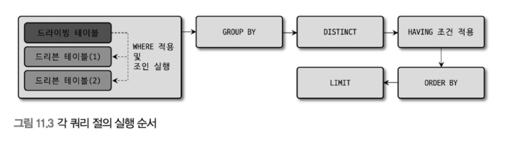
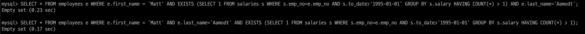
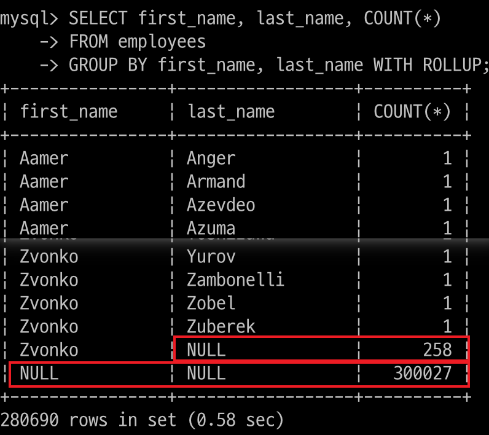

# 11장. 쿼리 작성 및 최적화

DDL

DB나 테이블의 구조를 변경하기 위한 문장

DML

테이블의 데이터를 조작(읽고, 쓰기)하기 위한 문장

## 쿼리 작성과 연관된 시스템 변수

### SQL 모드

8.0 서버의 sql_mode 기본값

- ONLY_FULL_GROUP_BY

- STRICT_TRANS_TABLES

- NO_ZERO_DATE

- ERROR_FOR_DIVISION_BY_ZERO

- NO_ENGINE_SUBSTITUTION

<br>

- STRICT_ALL_TABLES & STRICT_TRANS_TABLES

    INSERT, UPDATE 문장을 사용할 때 칼럼의 타입과 저장되는 타입이 다를 때 자동으로 타입 변경을 실행하는데

    타입이 적절히 변환되기 어렵거나 칼럼에 저장될 값이 없거나 값의 길이가 칼럼의 최대 길이보다 큰 경우 
    
    문장을 계속 실행할지, 에러를 발생시킬지 결정

    <br>

    STRICT TRANS TABLES는 InnoDB 같은 트랜잭션 지원 스토리지 엔진에만 엄격한 모드를 적용

    STRICT ALL TABLES는 모든 스토리지 엔진에 엄격한 모드 적용

<br>

- ONLY_FULL_GROUP_BY

    GROUP BY 절에 포함된 칼럼만 SELECT, HAVING 절에 사용 가능

<br>

- PIPE_AS_CONCAT

    오라클과 같이 문자열 연결 연산자(CONCAT) 사용 가능

<br>

- PAD_CHAR_TO_FULL_LENGTH

    MySQL은 CHAR 타입이더라도 VARCHAR같이 유효 문자열 뒤 공백 문자는 제거되어 반환

    해당 옵션을 추가하면 뒤쪽의 공백이 제거되지 않고 반환

<br>

- NO_BACKSLASH_ESCAPES

    역슬래시를 문자 이스케이프 용도로 사용 X

<br>

- IGNORE_SPACE

    MySQL에서는 스토어드 프로시저나 함수명과 괄호 사이에 있는 공백까도 스토어드 프로시저나 함수 이름으로 간주

    해당 옵션을 추가하면 공백 무시

<br>

- REAL_AS_FLOAT

    REAL 타입을 DOUBLE 타입의 동의어에서 FLOAT 타입의 동의어로 변경

<br>

- NO_ZERO_IN_DATE & NO_ZERO_DATE

    DATE 또는 DATETIME 타입의 칼럼에 2020-00-00, 0000-00-00과 같은 잘못된 날짜 저장 불가능

<br>

- ANSI

    최대한 SQL 표준에 맞게 동작하게 만들어줌

    REAL_AS_FLOAT, PIPES_AS_CONCAT, ANSI_QUOTES, IGNORE_SPACE, ONLY_FULL_GROUP_BY 로 이루어짐

<br>

- TRADITIONAL

    좀 더 엄격한 방법으로 SQL 작동 제어

<br>

### 영문 대소문자 구분

운영체제와 관계없이 대소문자 구분의 영향을 받지 않게 하려면 lower_case_table_names 시스템 변수 설정

기본값은 0(구분함)

이러한 설정을 떠나 가능하면 대문자 또는 소문자만으로 통일해서 사용하는 것이 좋음

<br>

### MySQL 예약어

예약어인지 아닌지 알아보기 위해 역따옴표(`)를 테이블명이나 칼럼명에 둘러싸지 않고 테이블을 생성해보고 에러를 확인해보자

<br>

## 매뉴얼의 SQL 문법 표기를 읽는 방법

<p align="center"></p>

<br>

대괄호("[]")는 해당 키워드나 표현식 자체가 선택 사항

파이프는 ("|")는 앞과 뒤의 키워드나 표현식 중에서 단 하나만 선택해서 사용할 수 있음

중괄호는 ("{}") 괄호 내 아이템 중에서 반드시 하나를 사용

... 표기는 명시된 키워드나 표현식의 조합이 반복될 수 있음

<br>

## MySQL 연산자와 내장 함수

SQL 가독성을 높이기 위해 ANSI 표준 형태의 연산자를 사용하기를 권장

### 리럴 표기법 문자열

#### 문자열

문자열은 항상 홑따옴표(')

#### 숫자열

숫자 값을 상수로 SQL에 사용할 때는 따옴표 없이 숫자 값을 입력

따옴표를 사용해도 비교 대상이 숫자 값이거나 숫자 타입의 칼럼이면 문자열 값을 숫자 값으로 자동 변환

#### 날짜

정해진 형태의 날짜 포맷을 표기하면 자동으로 DATE나 DATETIME 값으로 변환

#### 불리언

<p align="center"></p>

<br>

TRUE FALSE로 비교했지면 실제 값을 조회해보면 0 또는 1이 조회

즉, TRUE 또는 FALSE 같은 불리언 값을 정수로 매핑해서 사용하는 것

<p align="center"></p>

<br>

숫자 값이 저장된 칼럼을 TRUE나 FALSE로 조회하면 0이나 1 이외의 숫자 값은 조회되지 않음

<br>

### MySQL 연산자

#### 동등(Equal) 비교 (=, <=>)

= , <=> 기호를 사용해 비교 수행

<=> 기호는 = 연산자와 같고 부가적으로 NULL 값에 대한 비교까지 수행 (NULL-Safe 비교 연산자)

<p align="center"></p>

<br>

<=> 연산자는 NULL을 하나의 값으로 인식하고 비교하는 방법

<br>

#### 부정(Not-Equal) 비교(<>, !=)

<> 와 != 모두 사용 가능

#### NOT 연산자(!)

NOT과 ! 모두 사용 가능

#### AND(&&)와 OR(||) 연산자

AND, OR, &&, || 사용 가능

SQL 가독성을 높이기 위해 &&와 || 연산자는 사용을 자제하는 것이 좋음

#### 나누기(/, DIV)와 나머지(%, MOD) 연산자

/와 몫의 정수 부분만 가져오는 DIV, 나머지를 가져오는 연산자는 %, MOD 사용 가능

#### REGEXP 연산자

문자열 값이 어떤 패턴을 만족하는지 확인하는 연산자

RLIKE와 REGEXP는 같음

RLIKE는 오른쪽 일치용 LIKE가 아니라 Regular Expression(정규 표현식)을 비교하는 연산자

<p align="center"></p>

<br>

abc 문자열 값이 x, y, z 문자로 시작하는지 검증하는 표현식

<br>

REGEXP 연산자는 POSIX 표준으로 구현되어 있음

대표적으로 많이 사용하는 심벌은 

- ^

    문자열의 시작을 표시

- $

    문자열의 끝을 표시

- [ ]

    문자 그룹을 표시 [x-z]는 x, y, z 문자 중 하나인지 확인하는 것

- ()

    문자열 그룹을 표시 (xyz)라고 표현하면 반드시 xyz 모두 있는지 확인하는 것

- |

    어떤 문자든지 1개의 문자를 표시

    abc|xyz 라고 하면 abc이거나 xyz이거나 확인

- .

    ... 이라고 하면 3개의 문자로 구성된 문자열을 찾는 것

- *

    이 기호 앞에 표시된 정규 표현식이 0 또는 1번 이상 반복될 수 있다는 표시

- +

    이 기호 앞에 표시된 정규 표현식이 1번 이상 반복될 수 있다는 표시

- ?

    이 기호 앞에 표시된 정규 표현식이 0 또는 1번만 올 수 있다는 표시

<br>

[0-9]* 

0 ~ 9까지의 숫자만 0 또는 1번 이상 반복되는 문자열을 위한 정규 표현

[a-z]*

a ~ z까지의 소문자 알파벳만 0 또는 1번 이상 반복되는 문자열을 위한 정규 표현

[a-zA-Z]*

a ~ z, A ~ Z까지 대소문자 알파벳만 0 또는 1번 이상 반복되는 문자열을 위한 정규 표현

^Tear

Tear 문자열로 시작하는 정규 표현

Tear$

Tear 문자열로 끝나는 정규 표현

^Tear$

T로 시작하고 연속해서 ear이 나타나야 하며 그 뒤에 아무런 문자가 없어야 함

즉, Tear와 같은 문자열

<br>

#### LIKE 연산자

REGEXP 연산자는 인덱스를 전혀 사용하지 못한다는 단점이 있지만 LIKE는 인덱스 사용 가능

어떤 상수 문자열이 있는지 없는지 정도를 판단하는 연산자

와일드카드 문자(%, _)이 검색어의 앞쪽에 있다면 인덱스 레인지 스캔을 사용할 수 없음

<br>

#### BETWEEN 연산자

BETWEEN은 범위를 읽어야 하는 연산자여서 뒤에 나오는 조건이 check 조건이 될 수 밖에 없음

그래서 비교 범위를 줄이는 역할을 하지 못함

IN은 동등 비교 연산자와 처리가 비슷해서 BETWEEN과는 다름

#### IN 연산자

여러 개 값이 비교되지만 범위 검색이 아니고 여러 번의 동등 비교로 실행하기에 빠르게 처리됨

두 가지를 구분해서 생각해보면

- 상수가 사용된 경우 - IN (?, ?, ?)

- 서브쿼리가 사용된 경우 - IN (SELECT ... FROM ...)

<br>

IN (subquery) 같은 세미 조인 최적화 (9.3 고급 최적화 참조)

NOT IN 은 부정형 비교여서 인덱스를 이용해 처리 범위를 줄이는 조건으로는 사용할 수 없음

<br>

### MySQL 내장 함수

내장 함수와 사용자 정의 함수로 구분

스토어드 프로그램으로 작성되는 프로시저나 스토어드 함수와는 다름

<br>

##### NULL 값 비교 및 대체(IFNULL, ISNULL)

IFNULL은 칼럼이나 표현식의 값이 NULL인지 비교하고 NULL이면 다른 값으로 대체하는 용도

IS NULL은 표현식이나 칼럼의 값이 NULL인지 아닌지 비교하는 함수

<br>

#### 현재 시각 조회(NOW, SYSDATE)

두 함수 모두 현재의 시간을 반환하는 함수

하나의 SQL에서 NOW()는 모두 같은 값을 가지지만 SYSDATE()는 호출되는 시점에 따라 결과 값이 달라짐

이런 특성 탓에 2가지 문제

- 레플리카 서버에서 안정적으로 복제되지 못함

- SYSDATE() 함수와 비교되는 칼럼은 인덱스를 효율적으로 사용하지 못함


<p align="center"></p>

<p align="center"></p>

<br>

첫번째 쿼리는 PK인 (emp_no, from_date)를 모두 적절히 사용했기에 7바이트를 모두 사용(INT 4바이트 + DATE 3바이트)

두번째 쿼리는 emp_no만 사용했기에 4바이트 + rows가 emp_no = 10001 인 레코드들의 수

일반적인 웹 서비스에서는 SYSDATE()를 사용할 이유가 없음

<br>

#### 날짜와 시간의 포맷(DATE_FORMAT, STR_TO_DATE)

DATETIME 타입의 칼럼이나 값을 원하는 형태의 문자열로 변환해야 할 때는 DATE_FORMAT()  함수

<p align="center"></p>

<br>

DATETIME으로 자동 변환이 불가능한 형태는 STR_TO_DATE로 변환

<br>

#### 날짜와 시간의 연산(DATE_ADD, DATE_SUB)

특정 날짜에서 연도나 월일, 시간을 더하거나 뺄 때 DATE_ADD나 DATE_SUB

두번째 인자는 INTERVAL n [YEAR, MONTH, DAY ...]

#### 타임 스탬프 연산(UNIX_TIMESTAMP, FROM_UNIXTIME)

UNIX_TIMESTAMP() 함수는 1970-01-01 00:00:00 으로부터 경과한 초의 수를 반환하는 함수

FROM_UNIXTIME() 함수는 타임스탬프 값을 DATETIME 타입으로 변환하는 함수

#### 문자열 처리(RPAD, LPAD / RTRIM, LTRIM, TRIM)

RPAD, LPAD는 문자열의 좌측 또는 우측에 문자를 덧붙여서 지정된 길이의 문자열로 만드는 함수

인자로는 문자열, 최대 길이, 어떤 문자 순으로 주어짐

RTRIM, LTRIM 함수는 우측 또는 좌측에 연속된 공백 문자를 제거하는 함수

TRIM 함수는 이를 동시에 수행

#### 문자열 결합(CONCAT)

여러 개의 문자열을 연결해서 하나의 문자열로 반환하는 함수

#### GROUP BY 문자열 결합(GROUP_CONCAT)

COUNT(), MAX(), MIN(), AVG() 등과 같은 그룹 함수 중 하나

GROUP_CONCAT() 함수는 값을 먼저 정렬한 후 연결하거나 각 값의 구분자 설정, 중복 제거 후 연결도 가능

<p align="center"></p>

<br>

#### 값의 비교와 대체(CASE WHEN ... THEN ... END)

SWITCH 구문과 같은 역할을 함

CASE WHEN 절이 일치하는 경우에만 THEN 이하의 표현식이 실행된다는 점

<p align="center"></p>

<p align="center"></p>

<br>

d001 부서에 소속된 여성 사원의 최근 급여를 조회하는 쿼리에서

CASE WHEN 을 사용하여 남성일 경우 아예 테이블 조회를 하지 않으면 서브 쿼리 실행 횟수를 줄일 수 있음

1.11 sec -> 0.31 sec

<br>

#### 타입의 변환(CAST, CONVERT)

명시적으로 타입 변환이 필요하면 CAST() 함수

CONVERT() 함수도 거의 비슷하며 함수의 인자 사용 규칙만 조금 다름

#### 암호화 및 해시 함수(MD5, SHA, SHA2)

MD5와 SHA 모두 비대칭형 암호화 알고리즘인데, 인자로 전달한 문자열을 각각 지정된 비트 수의 해시 값을 만들어내는 함수

SHA() 함수는 SHA-1 알고리즘, 결과로 160비트 해시 값을 반환

SHA2() 함수는 224비트부터 512비트 암호화 알고리즘을 사용해 생성된 해시 값을 반환

MD5() 함수는 메시지 다이제스트 알고리즘을 사용해 128 비트 해시 값을 반환

<br>

비밀번호와 같은 암호화가 필요한 정보를 인코딩하는 데 사용

특히 MD5() 함수는 문자열(Message)의 길이를 줄이는(Digest) 용도로 사용

SHA와 MD5 두 함수의 출력 값은 16진수 문자열 형태

<p align="center"></p>

<br>

해당 결과 값의 저장 공간을 줄이고 싶다면 BINARY 또는 VARBINARY 형태의 타입에 저장

UNHEX() 함수 (16진수를 이진 타입으로 변환)로 이진 값으로 변환해서 저장

16진수 문자열로 돌리고 싶을 때는 HEX()

이 함수들의 결과값은 중복 가능성이 매우 낮기 때문에 길이가 긴 데이터의 크기를 줄여서 인덱싱(해시)하는 용도로 사용

예를 들어, URL같은 값을 MD5()로 단축해서 16바이트로 저장하고 인덱스를 생성하면 효율적

<p align="center"></p>

<br>

데이터 조회를 평문으로 검색하면 결과가 없고, MD5 해시 값으로 검색하면 원하는 결과가 출력됨

#### 처리 대기(SLEEP)

sleep 기능은 SQL 개발이나 디버깅 용도로 잠깐 대기하거나 쿼리의 실행을 오랜 시간 유지하고자 할 때 유용

#### 벤치마크(BENCHMARK)

디버깅이나 간단한 함수의 성능 테스트용으로 유용한 함수

동일 기능을 상대로 비교 분석하는 용도로 사용할 것을 권장

#### IP 주소 변환(INET_ATON, INET_NTOA)

IP 주소는 4바이트의 Unsigned Integer

대부분의 DBMS에서는 VARCHAR(15) 타입에 '.'으로 구분해서 저장

MySQL에서는 INET_ATON() 함수와 INET_NTOA() 함수를 이용해 IPv4 주소를 부호 없는 정수 타입으로 저장할 수 있게 제공

ATON은 문자열을 정수형으로 

NTOA는 정수형을 .으로 구분된 문자열로 변환

#### JSON 포맷(JSON_PRETTY)

JSON 칼럼의 값을 읽기 쉬운 포맷으로 변환

#### JSON 필드 크기(JSON_STORAGE_SIZE)

JOSN 데이터를 실제 디스크에 저장할 때 BSON(Binary JSON) 포맷을 사용

하지만 저장 공간의 크기가 얼마나 될지 예측하기 어려움 이를 위해 JSON_STORAGE_SIZE 함수를 제공

<br>

#### JSON 필드 추출(JSON_EXTRACT)

JSON 도큐먼트에서 특정 필드의 값을 가져오는 방법 중 가장 일반적인 방법은 JSON_EXTRACT() 함수

JSON_EXTRACT와 JSON_UNQUOTE(따옴표 없이 값만 가져오는) 함수는 아주 기본적인 처리이기에

JSON 연산자를 제공

doc->"$.first_name"에서 ->는 EXTRACT만 이고

doc->>"$.first_name"는 EXTRACT와 UNQUOTE를 조합한 것

#### JSON 오브젝트 포함 여부 확인(JSON_CONTAINS)

JSON 필드를 가지고 있는지를 확인하는 함수

<p align="center"></p>

<br>


#### JSON 오브젝트 생성(JSON_OBJECT)

RDBMS 칼럼 값을 이용해 JSON 오브젝트를 생성하는 함수

#### JSON 칼럼으로 집계(JSON_OBJECTAGG & JSON_ARRAYAGG)

GROUP BY 절과 함께 사용되는 집계 함수로서 RDBMS 칼럼의 값들을 모아 

JSON 배열 또는 도큐먼트를 생성하는 함수

<p align="center"></p>

<br>

key - value 쌍으로 만들어 JSON 도큐먼트로 반환

#### JSON 데이터를 테이블로 변환(JSON_TABLE)

JSON 데이터의 값들을 모아서 RDBMS 테이블을 만들어 반환

<p align="center"></p>

<br>

항상 내부 임시 테이블을 이용하기 때문에 임시 테이블에 레코드가 많이 저장되지 않게 주의

<br>

## SELECT

웹 서비스 같이 일반적인 트랜잭션 처리 환경에선 여러 테이블에서 데이터를 조합해서 빠르게 가져오는 것이 중요

### SELECT 절의 처리 순서

<p align="center"></p>

<p align="center"></p>

<br>

해당 실행 순서를 벗어나는 쿼리가 필요하다면 서브쿼리로 작성된 인라인 뷰를 사용

LIMIT를 먼저 적용하고 ORDER BY를 실행하고자 한다면

<p align="center"></p>

<br>

인라인 뷰가 사용되면 임시 테이블이 사용되기에 주의

`LIMIT는 오라클의 ROWNUM과는 달라서 항상 모든 처리 결과에 대해 레코드 건수를 제한하는 형태로 사용`

### WHERE 절과 GROUP BY 절, ORDER BY 절의 인덱스 사용

#### 인덱스를 사용하기 위한 기본 규칙

WHERE 절, ORDER BY, GROUP BY가 인덱스를 사용하려면 인덱스된 칼럼의 값 자체를 변환하지 않고 그대로 사용한다는 조건을 만족해야 함

복잡한 연산을 수행하거나 MD5 함수 같이 해시 값을 만들어서 비교하는 경우라면 가상 칼럼을 추가하고 그 칼럼에 인덱스를 생성하거나 함수 기반의 인덱스를 사용하면 됨

<br>

데이터 타입에 맞게 비교 조건을 줘서 사용해야 함

#### WHERE 절의 인덱스 사용

WHRE 조건이 인덱스를 사용하는 방법

- 작업 범위 결정 조건

- 체크 조건

<p align="center"></p>

<br>

WHERE 조건 절에 나열된 순서가 인덱스와 다르더라도 옵티마이저는 인덱스를 사용할 수 있는 조건들을 뽑아서 최적화를 수행

WHERE 절의 조건이 인덱스에 명시된 칼럼의 순서대로 나열되든 안되든 상관이 없음

<br>

OR 연산자의 경우 읽어서 비교해야 할 레코드가 늘어나기에 주의

#### GROUP BY 절의 인덱스 사용

GROUP BY의 각 칼럼은 비교 연산자를 가지지 않으므로 작업 범위 결정 조건이나 체크 조건 같이 구분해서 생각할 필요 X

사용 조건

- GROUP BY 절에 명시된 칼럼이 인덱스 칼럼의 순서와 위치까지 같아야 함

- 인덱스를 구성하는 칼럼 중에서 뒤쪽에 있는 칼럼은 GROUP BY 절에 명시되지 않아도 인덱스를 사용할 수 있지만 앞쪽에 있는 칼럼이 명시되지 않으면 사용 불가

- GROUP BY 절에 명시된 칼럼이 하나라도 인덱스에 없으면 GROUP BY 절은 전혀 인덱스를 이용하지 못함

<p align="center"></p>

<br>

GROUP BY COL2, COL1

GROUP BY COL1, COL3

이런 식이면 인덱스 사용 X

대신

WHERE COL_1 = '상수' GROUP BY COL2, COL3 이런 식이면 인덱스 사용 가능

<br>

#### ORDER BY 절의 인덱스 사용

GROUP BY의 요건과 매우 흡사하고 1개의 조건 추가

ASC, DESC 옵션이 인덱스와 같거나 정반대인 경우에만 사용 가능

<p align="center"></p>

<br>

#### WHERE 조건과 ORDER BY(or GROUP BY) 절의 인덱스 사용

WHERE 절과 ORDER BY 절이 같이 사용된 하나의 쿼리 문장은 3가지 중 한 가지 방법으로만 인덱스를 이용

- WHERE 절과 ORDER BY 절이 동시에 같은 인덱스 이용

    가능하면 이 방식으로 처리할 수 있게 쿼리를 튜닝하거나 인덱스를 생성하는 것이 좋음

- WHERE 절만 인덱스 이용

    인덱스를 이용한 검색 결과를 Using Filesort를 거쳐 정렬을 수행

    WHERE 절의 조건에 일치하는 레코드의 건수가 많지 않을 때 효율적인 방식 -> filesort할 것이 줄어듬

- ORDER BY 절만 인덱스 사용

    ORDER BY 절의 순서대로 인덱스를 읽으면서 레코드 한 건씩 WHERE 절의 조건에 일치하는지 비교하고 일치하지 않으면 버리는 형태로 처리

    주로 아주 많은 레코드를 조회해서 정렬해야 할 때는 이런 형태로 튜닝


<p align="center"></p>

<br>

#### GROUP BY 절과 ORDER BY 절의 인덱스 사용

두 개가 동시에 사용된 쿼리에서 모두 하나의 인덱스를 사용해서 처리되려면 둘에 명시된 칼럼의 순서와 내용이 모두 같아야 함

`둘 중 하나라도 인덱스를 이용할 수 없을 때는 둘 다 인덱스를 사용하지 못함`

#### WHERE 조건과 ORDER BY 절, GROUP BY 절의 인덱스 사용

<br>

<p align="center"></p>

<br>

### WHERE 절의 비교 조건 사용 시 주의사항

#### NULL 비교

MySQL에서는 NULL 값이 포함된 레코드도 인덱스로 관리

`이는 인덱스에서 NULL을 하나의 값으로 인정해서 관리한다는 것을 의미`

NULL의 정의는 비교할 수 없는 값

두 값 모두 NULL이더라도 동등한지 비교하는 것은 불가능

<p align="center"></p>

<br>

to_date 칼럼이 NULL인 레코드를 조회하는 쿼리지만 to_date 칼럼에 생성된 ix_todate 인덱스를 ref 방식으로 이용하고 있음을 확인 가능

-> 조건절이 NULL임에도 인덱스 탐색을 했다는 의미

#### 문자열이나 숫자 비교

반드시 데이터 타입에 맞는 상수값을 사용하자

#### 날짜 비교

날짜만 저장하는 DATE, 시간을 함께 저장하는 DATETIME과 TIMESTAMP

##### DATE 또는 DATETIME과 문자열 비교

DATE 또는 DATETIME 타입의 값과 문자열을 비교할 때는 문자열 값을 자동으로 DATETIME 타입의 값으로 변환해서 비교를 수행

<p align="center"></p>

<br>

위 아래는 결과적으로 같은 쿼리이고 MySQL은 STR_TO_DATE를 입력하지 않아도 내부적으로 변환을 수행

##### DATE와 DATETIME의 비교

DATETIME과 DATE 타입의 비교에서 타입 변환은 인덱스의 사용 여부에 영향을 미치지 않기에 성능보다는 쿼리의 결과에 주의

##### DATETIME과 TIMESTAMP의 비교

칼럼이 DATETIME 타입이라면 FROM_UNIXTIME() 함수를 이용해 TIMESTAMP 값을 DATETIME으로 만들어서 비교

TIMESTAMP라면 UNIX_TIMESTAMP() 함수를 이용해 DATETIME을 TIMESTAMP로 변환해서 비교

#### Short-Circuit Evaluation

여러 개의 표현식이 AND, OR 논리 연산자로 연결된 경우 선행 표현식의 결과에 따라 후행 표현식을 평가할지 말지 결정하는 최적화

<p align="center"></p>

<br>

이 둘의 쿼리를 AND 연산으로 묶으면 결국 0건이 나올텐데 둘의 조건의 순서가 영향을 어떻게 미치는지 알아보자

<p align="center"></p>

<br>

조건 순서만 바꿨을 뿐인데 시간 차이 발생

1번 조건의 경우

전체 레코드에 대해 CONVERT_TZ 함수를 실행하고 그 결과에 대해서 to_date 칼럼의 비교 작업

2번 조건의 경우

to_date < ~ 를 만족하는 레코드가 0건이기에 to_date 비교작업만 실행하고 CONVERT_TZ는 한번도 호출되지 않음

<br>

MySQL 서버는 쿼리의 WHERE 절에 나열된 조건을 순서대로 Short-circuit Evaluation 방식으로 평가해서 해당 레코드를 반환할지 말지를 결정

그런데 WHERE 조건 중에 인덱스를 사용할 수 있는 조건이 있다면 Short-circuit Evaluation과는 무관하게 그 조건을 가장 최우선으로 사용

<p align="center"></p>

<br>

해당 쿼리의 EXIST (subquery) 부분은 GROUP BY ... HAVING ... 절을 가지고 있기에 세미 조인 최적화를 활용할 수 없는 형태

<details>
<summary>왜 세미 조인 최적화를 사용할 수 없는지</summary>
세미 조인(semi-join) 최적화는 SQL 쿼리에서 서브쿼리를 포함한 조인을 최적화하기 위한 방법 중 하나입니다. 그러나, `GROUP BY`와 `HAVING` 절이 포함된 쿼리는 세미 조인 최적화를 적용하기 어렵습니다. 그 이유는 다음과 같습니다:

### 세미 조인 최적화란?

세미 조인 최적화는 서브쿼리를 사용하는 쿼리에서 불필요한 중복을 줄이고, 효율적으로 데이터베이스를 탐색하기 위해 사용됩니다. 보통 다음과 같은 형태의 쿼리에 적용됩니다:

```sql
SELECT column1
FROM table1
WHERE column1 IN (SELECT column2 FROM table2);
```

이와 같은 쿼리는 `table2`에서 중복된 `column2` 값들을 제거하고, `table1`에서 해당 값들만 선택하도록 최적화할 수 있습니다.

### `GROUP BY`와 `HAVING` 절이 포함된 쿼리의 문제점

`GROUP BY`와 `HAVING` 절은 집계와 필터링을 수행합니다. 이 과정에서 데이터의 그룹화와 조건 기반 필터링이 이루어지므로, 세미 조인 최적화를 적용하는 데 어려움이 있습니다. 예를 들어, 다음과 같은 쿼리를 고려해 봅시다:

```sql
SELECT dept_no, COUNT(*)
FROM dept_emp
GROUP BY dept_no
HAVING COUNT(*) > 10;
```

이 쿼리는 각 `dept_no`에 대해 직원 수를 집계하고, 직원 수가 10명 이상인 부서만 선택합니다.

### 최적화가 어려운 이유

1. **집계 작업**:
   - `GROUP BY`는 데이터의 여러 행을 하나의 그룹으로 묶어 집계 연산을 수행합니다. 이 과정에서 각 그룹의 데이터가 모두 필요하므로, 부분적으로 데이터만 가져오는 세미 조인 최적화가 적용되기 어렵습니다.

2. **필터링 조건**:
   - `HAVING` 절은 집계 결과에 조건을 적용하여 필터링합니다. 이 조건은 그룹화 이후의 결과에 적용되므로, 집계 전에 필터링할 수 없습니다.

3. **중간 결과의 의존성**:
   - 세미 조인 최적화는 중복 제거 및 불필요한 데이터 읽기를 줄이기 위한 것입니다. 그러나, `GROUP BY`와 `HAVING`는 그룹화 및 집계 결과에 의존하기 때문에 중간 결과를 필요로 합니다. 이 중간 결과는 세미 조인 최적화 과정에서 효율적으로 처리하기 어렵습니다.

### 예시로 설명

만약 다음과 같은 쿼리를 생각해 봅시다:

```sql
SELECT dept_no
FROM dept_emp
WHERE dept_no IN (
    SELECT dept_no
    FROM dept_emp
    GROUP BY dept_no
    HAVING COUNT(emp_no) > 10
);
```

- 내부 쿼리: `SELECT dept_no FROM dept_emp GROUP BY dept_no HAVING COUNT(emp_no) > 10`
  - 이 쿼리는 직원 수가 10명 이상인 부서 번호를 반환합니다.
- 외부 쿼리: `SELECT dept_no FROM dept_emp WHERE dept_no IN (...)`
  - 외부 쿼리는 내부 쿼리에서 반환된 부서 번호를 이용해 `dept_emp` 테이블에서 해당 부서 번호를 가진 행을 선택합니다.

이 경우, 내부 쿼리는 이미 집계와 필터링을 포함하고 있으므로 세미 조인 최적화의 이점을 활용하기 어렵습니다. 내부 쿼리가 실행되고 그 결과가 외부 쿼리에 사용되기 때문에, 내부 쿼리 자체를 세미 조인 최적화로 단순화하는 것은 불가능합니다.

### 요약

`GROUP BY`와 `HAVING` 절이 포함된 쿼리는 세미 조인 최적화를 활용하기 어렵습니다. 그 이유는 집계와 필터링 작업이 완료된 후에야 조건이 적용되기 때문에, 세미 조인 최적화가 제공하는 중복 제거 및 효율적인 데이터 접근 방법을 활용할 수 없기 때문입니다. 이러한 쿼리는 중간 결과에 대한 의존성이 크기 때문에, 세미 조인 최적화의 대상이 되기 어렵습니다.

</div>
</details>
<br>

해당 예제 쿼리에서는 first_name 칼럼의 조건은 인덱스를 사용할 수 있으므로 최우선으로 ix_firstname (first_name) 인덱스를 사용할 것

그리고 그 결과에서 last_name='Aamodt'과 서브 쿼리 조건을 만족하는 레코드만 걸러서 결과를 반환할텐데

이때 서브쿼리 조건이 먼저 나열됐기에 서브 쿼리 조건 먼저 평가할 것

순서를 바꿔보면 시간 차이가 나는 것을 확인할 수 있음

가능하면 복잡한 연산 또는 다른 테이블의 레코드를 읽어야 하는 서브쿼리 조건 등은 WHERE 절의 뒤쪽으로 배치하자

### DISTINCT

9.2.5 DISTINCT 처리 참고

### LIMIT n

LIMIT는 쿼리 결과에 지정된 순서에 위치한 레코드만 가져오고자 할 때 사용

<p align="center"></p>

<br>

처리 순서

1. employees 테이블에서 WHERE 절의 검색 조건에 일치하는 레코드를 전부 읽어옴

2. 1번에서 읽어온 레코드를 first_name 칼럼 값에 따라 정렬

3. 정렬된 결과에서 상위 5건만 사용자에게 반환

<br>

LIMIT의 중요한 특성은 LIMIT에서 필요한 레코드 건수만 준비되면 즉시 쿼리를 종료

즉, 모든 레코드의 정렬이 완료되지 않아도 상위 5건까지만 정렬되면 작업을 멈춤

<br>

SELECT * FROM employees LIMIT 0, 10;

해당 쿼리는 풀테이블 스캔을 할텐데 스토리지 엔진으로부터 10개를 읽어드리는 순간 읽기를 멈춤

또한

ORDER BY, GROUP BY, DISTINCT가 인덱스를 이용해 처리될 수 있다며 LIMIT 절은 꼭 필요한 만큼의 레코드만 읽게 만들어 주기에 쿼리의 작업량을 상당히 줄여줌

<br>

많은 응용 프로그램에서 테이블의 데이터를 SELECT할 때 조금씩 잘라서(페이징) 가져가게 되는데

SELECT * FROM salaries ORDER BY salary LIMIT n, m;

이런 식으로 가져가는 경우가 많음

<p align="center"></p>

<br>

이런 경우에 쿼리 실행에 상당히 오랜 시간이 걸림

LIMIT 조건의 페이징이 몇 개의 페이지 조회로 끝나지 않을 가능성이 높다면 

<p align="center"></p>

<br>

이런 식으로 조회했던 레코드들 중 가장 마지막 레코드를 참고하여 해당 레코드들은 조회하지 않도록 해서 쿼리를 사용하자

### COUNT()

COUNT에서 사용하는 `*`은 SELECT 절에 사용될 때처럼 모든 칼럼을 가져오라는 의미가 아니라 그냥 레코드 자체를 의미

`테이블이 가진 대략적인 레코드 건수로 충분하다면 SELECT COUNT(*)보다는 SHOW TABLE STATUS 명령으로 통계 정보를 참조하자`

COUNT(*) 쿼리에서 ORDER BY는 어떤 경우에도 필요하지 않음

COUNT(col_1)이 SELECT 쿼리에 사용되면 NULL이 아닌 레코드의 건수를 가져오기에 고려하자

### JOIN

#### JOIN의 순서와 인덱스

인덱스 레인지 스캔은 인덱스를 탐색하는 단계와 인덱스를 스캔하는 과정으로 구분

특정 인덱스 키를 찾는 인덱스 탐색 작업은 상대적으로 부하가 높음

<br>

드리븐 테이블은 인덱스 탐색, 스캔 작업을 드라이빙 테이블에서 읽은 레코드 건수만큼 반복

드리븐 테이블을 읽는 것이 훨씬 더 큰 부하를 차지

옵티마이저는 항상 드리븐 테이블을 최적으로 읽을 수 있게 실행 계획을 수립

<p align="center"></p>

<br>

employees 테이블의 emp_no 칼럼과 dept_emp 테이블의 emp_no 칼럼에 각각 인덱스가 있을 때와 없을 때 조인 순서가 어떻게 달라지는지 알아보자

- 두 칼럼 모두 각각 인덱스가 있는 경우

    어느 테이블을 드라이빙으로 선택하든 인덱스를 이용해 드리븐 테이블의 검색 작업을 빠르게 처리

- employees.emp_no에만 인덱스가 있는 경우

    dept_emp.emp_no가 드리븐이 되면

    employees의 레코드 건수만큼 dept_emp를 풀스캔

    그래서 dept_emp를 드라이빙하고 employees를 드리븐으로

- dept_emp.emp_no에만 인덱스가 있는 경우

    위와 반대

- 모두 인덱스가 없는 경우

    레코드가 적은 테이블을 드라이빙으로 하는 것이 효율적

    해시 조인으로 처리

#### JOIN 칼럼의 데이터 타입

조인 칼럼과의 비교에서 데이터 타입이 일치하지 않으면 인덱스를 효율적으로 이용 불가

다음의 비교 패턴은 문제가 될 가능성이 높음

- CHAR 타입과 INT 타입의 비교와 같이 데이터 타입의 종류가 완전히 다른 경우

- 같은 CHAR 타입이더라도 문자 집합과 콜레이션이 다른 경우

- 같은 INT 타입이더라도 부호(Sign)의 존재 여부가 다른 경우

#### OUTER JOIN의 성능과 주의사항

테이블의 데이터가 일관되지 않은 경우에만 아우터 조인이 필요

옵티마이저는 절대 아우터로 조인되는 테이블을 드라이빙 테이블로 선택하지 못하기 때문에 풀스캔이 필요한 employees 테이블을 드라이빙 테이블로 선택

이너 조인으로 사용해도 되는 쿼리를 아우터 조인으로 작성하면

옵티마이저가 조인 순서를 변경하면서 수행할 수 있는 최적화의 기회를 빼앗아버리는 결과

#### JOIN과 외래키(FOREIGN KEY)

외래키는 조인과 아무런 연관이 없음

외래키를 생성하는 주목적은 데이터의 무결성을 보장하기 위해

외래키와 연관된 무결성을 참조 무결성이라고 표현

#### 지연된 조인

조인 사용 데이터 조회 쿼리에서 GROUP BY , ORDER BY를 사용할 때 각 처리 방법에서 인덱스를 사용하지 못한다면 모든 조인을 실행하고 나서 GROUP BY나 ORDER BY를 처리

지연된 조인이란 조인이 실행되기 이전에 GROUP BY나 ORDER BY를 처리하는 방식

LIMIT와 함께 사용된 쿼리에서 더 큰 효과

<p align="center"></p>

<br>

이해 다시 


#### 래터럴 조인

8.0 버전부터 래터럴 조인 기능을 이용해서 특정 그룹별로 서브쿼리를 실행해서 그 결과와 조인하는 것이 가능

<p align="center"></p>

<br>

employees 테이블에서 이름이 Matt인 사원에 대해 사원별로 가장 최근 급여 변경 내역을 최대 2건씩만 반환

가장 중요한 부분은 FROM 절에 사용된 서브쿼리(Derived Table)에서 외부 쿼리의 FROM 절에 정의된 테이블의 칼럼을 참조할 수 있다는 것

예제에서는 서브 쿼리에 있는 salaries 테이블을 읽는 서브쿼리에서 employees 테이블의 emp_no를 참조

즉, FROM 절에 사용된 서브 쿼리가 외부 쿼리의 칼럼을 참조하기 위해서는 LATERAL 키워드가 명시

<br>

#### 실행 계획으로 인한 정렬 흐트러짐

해시 조인은 쿼리 결과의 레코드 정렬 순서가 달라짐

해시 조인이 사용되는 쿼리에서 결과가 어떤 순서로 출력되는지 살펴보자

<p align="center"></p>

<br>

책과 다름 책에서는 emp_no가 10001 10002 ... 순으로 계속 반복된다고 했는데 아님

정렬된 결과가 필요한 경우라면 드라이빙 테이블의 순서에 의존하지 말고 ORDER BY 절을 명시적으로 사용하는 것이 좋음

### GROUP BY

특정 칼럼의 값으로 레코드를 그루핑하고 그룹별로 집계된 결과를 하나의 레코드로 조회할 때 사용

#### WITH ROLLUP

그루핑된 그룹별로 소계를 가져올 수 있는 롤업 기능을 사용할 수 있음

<p align="center"></p>

<br>

엑셀의 피벗 테이블과 거의 동일한 기능이며

소계 레코드의 칼럼값은 항상 NULL로 표시된다는 점에 주의

<p align="center"></p>

<br>

First_name 그룹별로 소계 레코드가 출력되고(last_name의 개수)

마지막 총계는 두 칼럼 모두 NULL로 표시되고 출력

#### 레코드를 칼럼으로 변환해서 조회

하나의 레코드를 여러 개의 칼럼으로 나누어서 변환하는 SQL 문법은 없지만

SUM(), COUNT() 같은 집합 함수나 CASE WHEN ... END 구문을 이용해서 2개 이상의 칼럼으로 변환하는 것은 가능

##### 레코드를 칼럼으로 변환

<p align="center"></p>

<br>

이런 식으로 레코드를 칼럼으로 변환해서 사용해야 하는 경우가 생기는데

<p align="center"></p>

<br>

##### 하나의 칼럼을 여러 칼럼으로 분리

전체 사원 수와 함께 입사 연도별 사원 수를 구하는 쿼리

<p align="center"></p>

<br>

dept_emp 테이블로는 입사일자를 알 수 없기 때문에 employees 테이블을 조인하였고 조인된 결과를 가지고 dept_no 별로 GROUP BY

### ORDER BY

ORDER BY가 없으면 쿼리는 어떤 식으로 정렬?

- 인덱스 사용 SELECT의 경우 인덱스에 정렬된 순서대로

- 풀테이블 스캔을 하더라도 InnoDB의 경우에는 PK로 클러스터링 되어 있으므로 PK 순서대로 레코드를 가져옴

- SELECT 쿼리가 임시 테이블을 거쳐서 처리되면 레코드의 순서를 예측하기는 어려움

ORDER BY 절이 명시되지 않으면 어떠한 정렬도 보장하지 않음

<br>

ORDER BY에서 인덱스를 사용하지 못하는 경우 추가 정렬 작업(Using filesort) 수행

서버가 명시적으로 정렬 알고리즘을 수행했다는 의미

`정렬된 결과를 임시로 디스크나 메모리에 저장해두는데`

<p align="center"></p>

<br>

상태 값으로 메모리만 이용했는지 디스크의 파일을 이용했는지 확인이 가능

Sort_merge_passes는 메모리 버퍼와 디스크에 저장된 레코드를 몇 번이나 병합했는지 나타내는 값인데

0보다 크다는 얘기는 정렬해야 할 데이터가 정렬용 버퍼보다 커서 디스크를 이용했다는 얘기

#### ORDER BY 사용법 및 주의 사항

정렬 순서를 칼럼별로 다르게 명시 가능

#### 여러 방향으로 동시 정렬

8.0 버전부터 오름차순과 내림차순을 혼용해서 인덱스 생성 가능

### 서브쿼리

단위 처리별로 쿼리를 독립적으로 작성할 수 있으며 가독성이 높아짐

대표적으로 SELECT, FROM, WHERE 절에 사용될 수 있음

#### SELECT 절에 사용된 서브쿼리

내부적으로 임시 테이블을 만들거나 쿼리를 비효율적으로 실행하게 만들지는 않기에 크게 주의할 사항은 없음

일반적으로 SELECT 절에 사용된 서브 쿼리는 칼럼과 레코드가 1개인 결과를 반환해야 함

그 값이 NULL이든 아니든 1건이 존재해야 한다는 것

<p align="center"></p>

<p align="center"></p>

<p align="center"></p>

<br>

첫번째 쿼리에서 사용된 서브쿼리는 없는 부서를 조건으로 걸었기 때문에 결과가 0건

그래서 에러를 발생하지 않고 NULL로 채워져서 반환

두번째 쿼리는 서브쿼리가 2건 이상 레코드를 반환하는 경우여서 에러

세번째 쿼리는 SELECT 절에 사용된 서브쿼리가 2개 이상의 칼럼을 가져오려고 하기에 에러

즉, SELECT 절의 서브쿼리에는 ROW 서브쿼리를 사용할 수 없고 오로지 Scalar 서브 쿼리만 사용 가능

> 스칼라 서브쿼리는 레코드의 칼럼이 각각 하나의 결과를 만들어내는 것, 로우는 그보다 많은

#### FROM 절에 사용된 서브쿼리

<p align="center"></p>

<p align="center"></p>


FROM 절에 사용된 서브쿼리를 어떻게 병합했는지, 병합된 쿼리의 실행 계획이 어떻게 표시되는지

EXPLAIN 명령을 실행하고 SHOW WARNINGS 명령을 실행하면 서브쿼리를 병합해서 재작성한 쿼리의 내용을 확인 가능

employees의 모든 칼럼을 병합해서 전체 컬럼을 출력하는 쿼리

<br>

모든 서브쿼리를 외부 쿼리로 병합하지는 못함

- 집합 함수 사용

- DISTINCT

- GROUP BY or HAVING

- LIMIT

- UNION

- SELECT 절에 서브쿼리

<br>

#### WHERE 절에 사용된 서브쿼리

SELECT 절이나 FROM 절보다는 다양한 형태(연산자)로 사용될 수 있음

3가지 형태

- 동등 또는 크다 작다 비교

- IN 비교

- NOT IN 비교


##### 동등 또는 크다 작다 비교

<p align="center"></p>

<br>

해당 쿼리는 서브쿼리를 먼저 실행해서 상수로 변환

일단 실행 계획을 보면 employees 테이블의 ix_firstname 인덱스로 서브쿼리를 처리한 후

그 결과를 이용해서 ix_empno_fromdate 인덱스를 검색해서 쿼리가 완료

<br>

###### IN 비교 ( IN(subquery) )

WHERE 절에 사용된 IN(subquery) 형태의 조건을 세미 조인이라고 봄

> 세미 조인이란 테이블의 레코드가 다른 테이블의 레코드를 이용한 표현식과 일치하는지를 체크하는 형태

<p align="center"></p>

<br>

### CTE(Commmon Table Expression)

CTE는 이름을 가지는 임시 테이블

SQL 문장 내에서 한 번 이상 사용될 수 있으며, SQL 문장이 종료되면 자동으로 CTE 임시 테이블은 삭제

#### 비 재귀적 CTE

<p align="center"></p>

<br>

CTE 쿼리는 WITH 절로 정의하고 CTE 쿼리로 생성되는 임시 테이블의 이름은 WITH 바로 뒤에 정의

임시 테이블이 여러번 사용되는 쿼리

<p align="center"></p>

<br>

처음에는 어차피 같은 내용을 왜 두번 사용했지 했는데 예제로써 사용하기 위해서 2번 사용한 듯함

<br>

CTE로 생성된 임시 테이블은 다른 CTE 쿼리에서 참조할 수 있다는 장점

<p align="center"></p>

<br>

cte1 임시테이블

임금이 50000 ~ 51000 사이에 속해 있는 사원의 emp_no와 해당 임금의 시작 날짜 

cte2 임시테이블

cte1의 emp_no와 dept_emp의 emp_no를 조인해서 그 임금을 받았을 때의 emp_no와 부서의 시작 날짜

쿼리

cte1과 cte2와 employees를 조인을 하고 모든 칼럼을 출력

위 예제는 2개의 cte가 정의되었는데 ct2 테이블은 직전에 정의된 cte1 테이블을 이용해서 조인하도록 정의

비재귀적 CTE 테이블의 장점

- 재사용 가능하므로 FROM 절의 서브쿼리보다 효율적

- 다른 CTE 쿼리에서 참조 가능

- 생성 부분과 사용 부분의 코드를 분리할 수 있으므로 가독성이 높음

<br>

#### 재귀적 CTE(Recursive CTE)

 <p align="center"></p>

<br>

재귀적 CTE는 비 재귀적 쿼리 파트와 재귀적 파트로 구분되며

UNION(UNION DISTINCT) 또는 UNION ALL로 연결하는 형태로 반드시 작성

UNION ALL 위쪽인 SELECT 1이 비 재귀적 파트

아래쪽인 SELECT (no + 1) FROM cte WHERE no < 5이 재귀적 파트

-> 비 재귀적 파트는 처음 한번만 실행되지만 재귀적 파트는 쿼리 결과가 없을 때까지 반복 실행

<br>

해당 쿼리가 작동하는 방법

1. CTE 쿼리의 비 재귀적 파트의 쿼리를 실행 (SELECT 1의 결과 값은 1이 출력)

2. 1번의 결과를 이용해서 cte라는 이름의 임시 테이블 생성

3. 1번의 결과를 cte라는 임시 테이블에 저장

4. 1번 결과를 입력으로 사용해서 CTE 쿼리의 재귀적 파트의 쿼리를 실행

5. 4번 결과를 cte 임시 테이블에 저장 (이럴 때 UNION(UNION DISTINCT)의 경우 중복 제거 실행 )

6. 전 단계의 결과를 입력으로 사용해서 재귀적 파트 쿼리 실행

7. 6번 단계에서 쿼리 결과가 없으면 CTE 쿼리 종료

8. 6번 결과를 cte라는 임시 테이블에 저장

9. 6번으로 돌아가서 반복 실행

1번 과정에서 CTE 임시 테이블 구조가 결정되는데 비재귀적 쿼리 파트의 결과로 결정

재귀적 쿼리 파트는 데이터를 생성하는 쪽

<br>

cte 임시 테이블이 실제 가진 레코드

<p align="center"></p>

<br>

재귀 쿼리가 반복은 멈추는 조건은 재귀 파트 쿼리의 결과가 0건일 때까지

실제 응용 프로그램의 쿼리에서 사용하는 데이터는 몇 단계까지 재귀적으로 실행돼야 할지 알 수 없는 경우가 많기에 그럴 때 사용

<br>

데이터의 오류나 작성자의 실수로 무한 루프를 돌게 되면 

cte_max_recursion_depth 시스템 변수를 이용해 최대 반복 실행 횟수를 제한할 수 있음

#### 재귀적 CTE 활용

<p align="center"></p>

<br>

manager id는 id의 외래키로써 같이 연동됨

조직이라고 생각했을 때 부장 -> 과장 -> 대리 -> 사원 이런 형식으로 묶여있는 것

해당 경우에 재귀적 CTE을 활용

<p align="center"></p>

<br>

Adil(id=123)의 상위 조직장을 찾는 쿼리

비재귀적 쿼리 -> id가 123인 사원의 id, name, manager_id와 alias lv을 1로 주고

재귀적 쿼리 -> lv이 1씩 증가하면서 employees 테이블의 id와 cte 임시 테이블의 manager_id를 기준으로 조인해서 manager_id가 NULL이 아닐 때까지 반복

이렇게 만들어진 managers 임시 테이블을 lv를 기준으로 역순 출력 

<br>

<p align="center"></p>

<br>

비재귀적 쿼리 
-> employees 테이블에서 manager_id가 NULL인(자신이 최상위 담당자인 경우) 전체 칼럼 선택, manager_path 이름으로 id 값을 문자열로 변환, lv 이름으로 1

재귀적 쿼리
-> employees 테이블의 manager_id와 managers CTE 테이블의 id 값을 기준으로 조인을 해서 employees 테이블 id -> manager_path를 concat, lv + 1

쿼리
lv를 기준으로 정렬한 managers CTE 테이블 출력

<br>

1부터 단조 증가하는 값을 가지는 임시 테이블이나 일 단위 증가 임시 테이블

조직도 조회, BOM(Bill Of Material) 쿼리 등에 활용 가능

<br>

### 윈도우 함수

조회하는 현재 레코드를 기준으로 연관된 레코드 집합의 연산을 수행

조건에 일치하는 레코드 건수는 변하지 않고 그대로 유지

일반적인 SQL 문장에서 하나의 레코드를 연산할 때 다른 레코드의 값을 참조할 수 없는데

예외적으로 GROUP BY 또는 집계 함수를 이용하면 다른 레코드의 칼럼값을 참조할 수 있음

근데 결과 집합의 모양이 바뀌는데

윈도우 함수는 결과 집합을 유지하면서 하나의 레코드 연산에 다른 레코드의 칼럼값을 참조 가능

#### 쿼리 각 절의 실행 순서


<p align="center"></p>

<br>


윈도우 함수를 사용하는 쿼리의 

결과에 보여지는 레코드는

FROM 절, WHERE 절, GROUP BY와 HAVING 절에 의해 결정되고 그 이후에 윈도우 함수 실행


윈도우 함수를 GROUP BY 칼럼으로 사용하거나 WHERE 절에 사용할 수 없고, LIMIT를 먼저 실행한 다음에 윈도우 함수를 적용할 수 없다는 것을 알 수 있음


#### 윈도우 함수 기본 사용법

<p align="center"></p>

<br>

용도별로 다양한 함수들을 사용

집계 함수와는 달리 함수 뒤에 OVER 절을 이용해 연산 대상을 파티션하기 위한 옵션을 명시 가능

이렇게 OVER 절에 의해 만들어진 그룹을 파티션 또는 윈도우라고 함

<p align="center"></p>

<br>

소그룹을 별도로 구분하지 않고 전체 결과 집합에서 e.hire_date 칼럼으로 정렬한 후 순위(RANK() 함수)를 매기게 함


<p align="center"></p>


부서별로 입사 순위를 매기고자 한다면 부서 코드로 파티션을 하면 됨

<p align="center"></p>

<br>

salaries 테이블에서 emp_no가 10001인 사원의 급여 이력과 평균 급여를 조회하는 쿼리

해당 사원의 모든 급여 변경 이력의 평균을 조회하기 위해 OVER 절 내용에 PARTITION 키워드 생략

그리고 평균을 계산하는 것이므로 별도 정렬도 생략 그리고 모든 레코드가 동일한 평균 값 표시

<br>

윈도우 함수의 각 파티션 안에서도 연산 대상 레코드별로 연산을 수행할 소그룹이 사용되는데 이를 프레임이라고 함

<p align="center"></p>

<br>

min_1

from_date를 기준으로 1년 전부터 지금까지 가장 적은 급여

max_1

from_date를 기준으로 1년 전부터 2년 후까지 가장 많은 급여

avg_1

from_date 칼럼으로 정렬 후 첫번째 레코드부터 현재 레코드까지의 평균

avg_2

from_date 칼럼으로 정렬 후 현재 레코드를 기준으로 이전 건부터 이후 건까지의 평균

#### 윈도우 함수

집계 함수와 비 집계 함수를 모두 사용할 수 있음

GROUP BY 절과 함께 사용할 수 있는 함수들을 의미

집계 함수는 OVER 절 없이 단독으로도 사용할 수 있고 OVER 절을 가진 윈도우 함수로도 사용 가능

비 집계 함수는 반드시 OVER 절을 가지고 있어야 하며 윈도우 함수로만 사용될 수 있음

##### DENSE_RANK()와 RANK(), ROW_NUMBER()

DENSE_RANK() 함수와 RANK() 함수는 모두 ORDER BY 기준으로 매겨진 순위를 반환

RANK() 함수는 동점인 레코드가 두 건 이상인 경우 그 다음 레코드를 동점인 레코드 수만큼 증가시킨 순위를 반환

DENSE_RANK()는 동점인 레코드를 1건으로 간주하고 순위를 매기기에 연속된 순위

ROW_NUMBER()는 동점에 대한 고려 없이 정렬된 순서대로 레코드 번호를 부여

##### LAG()와 LEAD()

LAG 함수는 파티션 내에서 현재 레코드를 기준으로 n 번째 이전 레코드를 반환

LEAD 함수는 반대로 n 번째 이후 레코드를 반환

#### 윈도우 함수와 성능

윈도우 함수에 너무 의존하지 말고

온라인 트랜잭션 처리에서 많은 레코드에 대해 윈도우 함수를 적용하는 것은 가능하면 피하기

### 잠금을 사용하는 SELECT

innodb 잠금 없는 읽기

하지만 select 쿼리로 읽은 레코드의 칼럼 값을 애플리케이션에서 가공해서 다시 업데이트하고자 할 때 

SELECT가 실행된 후 다른 트랜잭션에서 수정하지 못하도록 해야 함

#### NOWAIT & SKIP LOCKED

누군가가 레코드를 잠그고 있다면 다른 트랜잭션은 그 잠금이 해제될 때까지 기다려야 했는데

이런 방식은 휴대폰 화면을 보면서 응답을 기다리고 있을 사용자를 생각했을 때는 적절한 작동 방식이 아닐 것

<p align="center"></p>

<p align="center"></p>

<br>

하나의 트랜잭션이 쓰기 잠금을 획득하고 있을 때 다른 트랜잭션에서 NOWAIT를 하면 commit이 될 때까지 기다리지 않고 바로 에러를 반환하면서 쿼리가 종료

<br>

<p align="center"></p>

<p align="center"></p>

<br>

SKIP LOCKED은 SELECT 하려는 레코드가 다른 트랜잭션에 의해 이미 잠겨져 있다면 에러를 반환하지 않고 해당 레코드를 무시하고 잠금이 걸리지 않은 레코드만 가져옴

<br>

NOWAIT나 SKIP LOCKED 기능은 큐(Queue)와 같은 기능을 구현할 때 매우 유용

예를 들어 간단한 요건을 가지는 쿠폰 발급 기능을 생각해보면

- 하나의 쿠폰은 한 사용자만 사용 가능

- 쿠폰의 개수는 1000개 제한이며 선착순으로 요청한 사용자에게 발급

<p align="center"></p>

<br>

간략하게 생각하자면

응용 프로그램 코드에서는 아직 주인이 없는 (owned_user_id=0) 쿠폰을 검색해서 하나를 가져옴

이 때 다른 트랜잭션에서 해당 쿠폰을 가져가지 못하게 FOR UPDATE 절을 사용

<p align="center"></p>

<br>

동시에 1000명의 사용자가 쿠폰을 요청하면 그 요청만큼 프로세스를 생성해서

위의 트랜잭션을 동시에 사용할 것

하나의 레코드에 집중해서 잠금 획득을 하려고 할텐데

그러면 처음 잠금 획득을 한 트랜잭션 이외의 트랜잭션들은 대기를 할 것

8.0 이전 버전에서는 이런 문제를 해결하기 위해서 Redis나 Memcached 같은 캐시 솔루션을 별도로 구축해서 쿠폰 발급 기능을 구현

8.0 버전부터는 FOR UPDATE SKIP LOCKED 절을 사용한다면

실제 MySQL 서버에서는 1000개의 트랜잭션을 동시에 처리하게 되는 효과를 얻을 수도 있음

<p align="center"></p>

<p align="center"></p>

<br>

SKIP LOCKED를 사용한 경우와 그렇지 않은 경우의 동시 처리 스루풋 비교

<br>

## INSERT

INSERT와 SELECT 성능을 어느 정도 타협하면서 테이블 구조를 설계

### 고급 옵션

INSERT IGNORE 옵션과 INSERT ... ON DUPLICATE KEY UPDATE 옵션

유니크 인덱스나 프라이머리 키에 대해 중복 레코드를 어떻게 처리할지를 결정

#### INSERT IGNORE

저장하는 레코드의 프라이머리 키나 유니크 인덱스 칼럼의 값이 이미 테이블에 존재하는 레코드와 중복되는 경우, 저장하는 레코드의 칼럼이 테이블의 칼럼과 호환되지 않는 경우 모두 무시하고 다음 레코드를 처리

주로 여러 레코드를 하나의 INSERT 문장으로 처리하는 경우 유용

IGNORE 옵션이 있는 경우 에러를 경고 수준의 메시지로 바꾸고 나머지 레코드의 INSERT를 계속 진행

#### INSERT ... ON DUPLICATE KEY UPDATE

프라이머리 키나 유니크 인덱스의 중복이 발생하면 UPDATE 문장의 역할을 수행

<p align="center"></p>

<br>

pk가 (target_date, stat_name)으로 이루어져 있기에 일별로 stat_name은 하나씩만 존재 가능

특정 날짜의 stat_name이 최초로 저장되는 경우에는 INSERT 문장이 실행

하지만 이미 레코드가 존재한다면 ON DUPLICATE KEY UPDATE 문장이 실행

만약 겹친다면 기존 레코드의 stat_value 칼럼 값에 +1을 한 값을 UPDATE

### LOAD DATA 명령 주의 사항

RDBMS에서 데이터를 빠르게 적재할 수 있는 방법으로 LOAD DATA 명령이 자주 소개

MySQL도 MySQL 엔진과 스토리지 엔진의 호출 횟수를 최소화하고 스토리지 엔진이 직접 데이터를 적재하기에 일반적인 INSERT보다 빠름

단점

- 단일 스레드로 실행

- 단일 트랜잭션으로 실행

데이터가 매우 클 경우 다른 온라인 트랜잭션의 쿼리들이 영향을 받음

이유

테이블에 레코드를 INSERT 하면 할수록 테이블과 인덱스의 크기가 커짐

그러면 INSERT할 때마다 속도가 느려짐

또한

하나의 트랜잭션으로 처리되기에 LOAD DATA 문장이 시작된 시점부터 언두 로그가 쌓임

-> 커밋이 되어야 flush 되기 때문

가능하다면 LOAD DATA 문장으로 적재할 데이터 파일을 여러 개로 나누어서 실행

### 성능을 위한 테이블 구조

INSERT 문장의 성능은 테이블의 구조에 의해 많이 결정

실제 쿼리 튜닝할 때도 소량의 레코드를 INSERT하는 문장 자체는 무시하는 경우가 많음

#### 대량 INSERT 성능

하나의 INSERT 문장으로 수백 건, 수천 건의 레코드를 INSERT한다면 INSERT될 레코드들을 PK 기준으로 미리 정렬해서 INSERT 문장을 구성하는 것이 성능에 도움

LOAD DATA 문장이 레코드를 INSERT 할 때마다 PK를 검색해서 레코드가 저장될 위치를 찾음

why?

pk 기반 클러스터링 인덱스이기에

<br>

PK로 정렬된 데이터 파일을 적재할 때는 다음 INSERT 레코드는 직전 INSERT 값보다 항상 크기에 메모리에는 PK의 마지막 페이지만 메모리에 올라와 있으면 레코드 저장 위치를 찾을 수 있음

세컨더리 인덱스가 많을수록 INSERT 성능이 떨어짐

why?

해당 인덱스를 타서 PK 값을 얻은 다음에 클러스터링 인덱스를 타고 INSERT 해야 하기 때문

#### PK 선정 

PK의 선정은 INSERT 성능과 SELECT 성능 중 하나를 선택해야 함을 의미

주로 로그를 저장하는 테이블은 PK를 단조 증가 OR 단조 감소하는 패턴 값을 선택

Auto_increment?

SELECT는 많지 않고 INSERT가 많은 테이블은 인덱스의 개수를 최소화

반대인 경우 쿼리에 맞게 인덱스를 추가해도 영향도 크지 않음

#### Auto-Increment 칼럼

SELECT보다는 INSERT에 최적화된 테이블을 생성하기 위해서는 두 가지 요소를 갖춰 테이블을 준비

- 단조 증가 or 단조 감소되는 값으로 PK 선정

- 세컨더리 인덱스 최소화

Auto Increment 칼럼을 이용하자

자동 증가 값으로 테이블 생성은 가장 빠른 INSERT 제공

자동 증가 값의 새로운 번호를 받기 위해 AUTO-INC 잠금이 필요한데

AUTO-INC 잠금은 테이블 수준의 잠금

해당 잠금 사용 방식을 변경하기 위해 innodb_autoinc_lock_mode를 사용

<br>

- innodb_autoinc_lock_mode = 0

    항상 AUTO_INC 잠금을 걸고 한 번에 1씩만 증가된 값을 가져옴

    서비스용 MySQL 서버에서는 이 방식을 사용할 필요가 없음

- innodb_autoinc_lock_mode = 1

    단순히 레코드를 한 건씩 INSERT하는 쿼리에서는 AUTO_INC 잠금을 사용하지 않고 뮤텍스를 이용해 더 가볍고 빠르게 처리

    하나의 INSERT 문장으로 여러 레코드를 INSERT하거나 LOAD DATA 명령으로 INSERT하는 쿼리에서는 AUTO-INC 잠금을 걸고 필요한 만큼 자동 증가 값을 한꺼번에 가져와서 사용

    INSERT 순서대로 새로운 번호를 받은 자동 증가 값은 일관되고 자동 증가 값은 연속된 번호를 갖게 됨

- innodb_autoinc_lock_mode = 2

    default 값

    LOAD DATA나 벌크 INSERT를 포함한 INSERT 계열의 문장을 실행할 때 AUTO-INC 잠금을 사용하지 않음

    자동 증가 값을 적당히 미리 할당 받아서 처리

    쿼리 기반 복제를 사용하는 MySQL에서는 소스 서버와 레플리카 서버의 자동 증가 값이 동기화되지 못할 수도 있음

<details>
<summary>자동 증가 값 할당 처리의 궁금점</summary>
`innodb_autoinc_lock_mode` 설정은 InnoDB 테이블에서 자동 증가(auto-increment) 값을 생성하는 방식에 영향을 줍니다. 이 설정의 기본 값은 2(일명 "interleaved")이며, 이 모드에서는 자동 증가 값을 생성할 때 잠금을 최소화하고 성능을 향상시키기 위해 특별한 알고리즘을 사용합니다.

### `innodb_autoinc_lock_mode` 값 설명

1. **Mode 0 (Traditional)**
    - 전통적인 방법으로, 하나의 테이블에 대해 동시에 하나의 쓰기 작업만이 자동 증가 값을 생성할 수 있도록 보장합니다.
    - 이는 높은 일관성을 제공하지만, 성능이 낮습니다.

2. **Mode 1 (Consecutive)**
    - 여러 개의 쓰기 작업이 동시에 진행될 때에도 연속적인 자동 증가 값을 할당할 수 있도록 합니다.
    - 테이블의 마지막 자동 증가 값을 기준으로 순차적으로 증가합니다.
    - 성능이 향상되지만, 잠금을 일부 사용합니다.

3. **Mode 2 (Interleaved)**
    - 기본 값으로, 더 이상 auto-inc 잠금을 사용하지 않고, 대신 임시 메모리 공간(자동 증가 캐시)을 사용합니다.
    - 여러 쓰기 작업이 동시에 진행될 때 성능을 최적화합니다.
    - 여러 쓰기 작업이 각기 다른 자동 증가 값 범위를 할당받아 충돌 없이 독립적으로 수행됩니다.

### Mode 2 (Interleaved) 작동 방식

Mode 2에서 자동 증가 값을 할당 받는 방식은 다음과 같습니다:

1. **자동 증가 캐시**
    - InnoDB는 특정 크기의 자동 증가 값 범위를 메모리에 할당합니다. 이는 잠금을 사용하지 않고도 빠르게 값을 할당할 수 있도록 합니다.
    - 예를 들어, 쓰기 작업 A는 1~100, 작업 B는 101~200의 범위를 할당받을 수 있습니다.

2. **각 쓰기 작업이 독립적으로 처리**
    - 각 쓰기 작업은 자신에게 할당된 범위 내에서 자동 증가 값을 독립적으로 사용합니다.
    - 이렇게 하면 동시성(concurrency)이 높아지고, 여러 쓰기 작업이 동시에 진행될 때 성능이 향상됩니다.

3. **범위 소진 시 새로운 범위 할당**
    - 한 쓰기 작업이 자신의 범위를 모두 사용하면, 새로운 범위를 할당받습니다.
    - 이는 다시 메모리에서 처리되며, 데이터베이스는 여전히 높은 성능을 유지할 수 있습니다.

### 예제

예를 들어, `innodb_autoinc_lock_mode`를 2로 설정한 상황에서 여러 INSERT 작업이 동시에 발생한다고 가정합니다:

1. **초기 상태**: 테이블의 자동 증가 값이 0입니다.
2. **INSERT 작업 A**: 1~100 범위를 할당받습니다.
3. **INSERT 작업 B**: 101~200 범위를 할당받습니다.
4. **작업 A와 B가 동시에 진행**: A는 1부터, B는 101부터 각각 값을 할당합니다.
5. **A가 범위를 소진한 경우**: A는 201~300 범위를 새로 할당받아 계속 진행합니다.

이 방식은 동시성을 극대화하고 성능을 최적화하는 데 매우 효과적입니다. 잠금을 사용하지 않기 때문에 더 많은 쓰기 작업을 병렬로 처리할 수 있습니다.

### 요약

`innodb_autoinc_lock_mode`의 기본 값인 2(interleaved) 모드는 자동 증가 값을 미리 할당받아 사용하는 방식으로, 동시성 문제를 줄이고 성능을 높입니다. 각 쓰기 작업은 독립적인 자동 증가 값 범위를 할당받아 충돌 없이 작업을 수행하며, 이는 전체 데이터베이스 성능을 향상시키는 데 기여합니다.

</div>
</details>
<br>

자동 증가 값이 반드시 연속일리는 없음

## UPDATE와 DELETE

일반적인 온라인 트랜잭션 환경에서 UPDATE와 DELETE 문장은 주로 하나의 테이블에 대해 한 건 또는 여러 건의 레코드를 변경 또는 삭제하기 위해 사용

여러 테이블을 조인해서 한 개 이상의 테이블을 조인해서 한 개 이상 테이블의 레코드를 변경한다거나 삭제하는 기능도 제공

### UPDATE ... ORDER BY ... LIMIT n

UPDATE, DELETE 문장에 ORDER BY 절과 LIMIT 절을 동시에 사용해 특정 칼럼으로 정렬해서 상위 몇 건만 변경 및 삭제 가능

하지만 바이너리 로그 포맷이 STATEMENT에다가 레플리카 서버에서 해당 명령을 실행하면 `ORDER BY에 의해 정렬되더라도 중복된 값의 순서는 달라질 수도 있다`는 경고 메시지가 뜸

### JOIN UPDATE

두 개 이상의 테이블을 조인해 조인된 결과 레코드를 변경 및 삭제하는 쿼리

다른 테이블의 칼럼 값을 참조하지 않더라도 조인되는 양쪽 테이블에 공통으로 존재하는 레코드만 찾아서 업데이트하는 용도로도 사용

배치 프로그램이나 통계용 UPDATE 문장에서는 유용하게 사용

<p align="center"></p>

<br>

임시로 생성한 tb_test1 테이블과 employees 테이블을 사원 번호(emp_no)로 조인한 다음

employees 테이블의 first_name 칼럼의 값을 tb_test1 테이블의 first_name 칼럼으로 복사하는 JOIN UPDATE 문장

근데 JOIN UPDATE 쿼리도 2개 이상의 테이블을 먼저 조인해야 하므로 조인 순서에 따라 UPDATE 문장의 성능이 달라질 수 있음

그래서 JOIN UPDATE 문장 사용 전에 실행 계획을 확인하자

### 여러 레코드 UPDATE

하나의 UPDATE 문장으로 여러 개의 레코드를 업데이트하는 경우 모든 레코드를 동일한 값으로만 업데이트할 수 있었음

8.0 버전부터 레코드 생성(Row Constructor) 문법을 이용해 레코드별로 서로 다른 값을 업데이트할 수 있게 됨

<p align="center"></p>

<br>

VALUES ROW (...) ROW (...) 문법은 SQL 문장 내에서 임시 테이블을 생성하는 효과를 낼 수 있음

2건의 레코드 (1,1) (2,4)를 가지는 임시 테이블 new_user_level을 생성하고 이 테이블과 user_level 테이블을 조인해서 업데이트를 수행하는 JOIN UPDATE 효과를 낼 수 있음

## 스키마 조작(DDL)

DBMS 서버의 모든 오브젝트를 생성하거나 변경하는 쿼리를 DDL

스토어드 프로시저나 함수, DB나 테이블 등을 생성하거나 변경하는 대부분의 명령이 DDL

### 온라인 DDL

8.0 버전부터 대부분 스키마 변경 작업은 내장 온라인 DDL 기능으로 처리

#### 온라인 DDL 알고리즘

온라인 DDL은 스키마를 변경하는 작업 도중 다른 커넥션에서 해당 테이블의 데이터를 변경하거나 조회하는 작업이 가능

ALTER TABLE 명령을 실행하면 다음 순서로 스키마 변경에 적합한 알고리즘을 찾음

1. ALGORITHM=INSTANT로 스키마 변경이 가능한지 확인 후 선택

2. ALGORITHM=INPLACE

3. ALGORITHM=COPY 알고리즘 선택

스키마 변경 알고리즘의 우선순위가 낮을수록 더 큰 잠금과 많은 작업을 필요로 하고 서버의 부하도 많이 발생시킴

- INSTANT

    테이블의 데이터는 전혀 변경하지 않고 메타데이터만 변경하고 작업 완료

    테이블이 가진 레코드 건수와 무관하게 작업 시간이 짧음

- INPLACE

    임시 테이블로 데이터를 복사하지 않고 스키마 변경 실행

    테이블의 모든 레코드를 리빌드해야 하기에 테이블의 크기에 따라 많은 시간 소요

    INPLACE 알고리즘으로 스키마가 변경되는 경우 최초 시작 시점과 마지막 종료 시점에는 테이블의 읽고 쓰기가 불가능하지만 매우 짧기에 다른 커넥션에게의 영향은 높지 않음

- COPY

    변경된 스키마를 적용한 임시 테이블을 생성하고 레코드들을 임시 테이블로 옮기고 임시 테이블을 RENAME

    테이블 읽기만 가능하고 INSERT, UPDATE, DELETE는 실행할 수 없음


ALGORITHM과 LOCK 옵션이 명시되지 않으면 서버가 적절한 수준의 알고리즘과 잠금 수준을 선택하게 됨

INSTANT 옵션은 테이블의 메타데이터만 변경하기 때문에 매우 짧은 시간 동안의 잠금만 필요하기에 LOCk 옵션은 명시할 수 없고

INPLACE, COPY 알고리즘만 3가지 중 하나를 명시할 수 있음

NONE : 아무런 잠금을 걸지 않음

SHARED : 읽기 잠금

EXCLUSIVE : 쓰기 잠금

<br>

INPLACE 알고리즘을 사용하더라도 내부적으로는 테이블의 리빌드가 필요

대표적으로 PK를 추가하는 작업은 데이터 파일에서 저장 위치가 바뀌어야 하기에 테이블의 리빌드가 필요한 반면, 칼럼 이름 변경은 필요 없음

#### 온라인 처리 가능한 스키마 변경

모든 스키마 변경이 온라인으로 가능한 것이 아니기에 확인해보자

#### INPLACE 알고리즘 

INPLACE 알고리즘은 임시 테이블로 레코드를 복사하지는 않더라도 내부적으로 테이블의 모든 레코드를 리빌드해야 하는 경우가 많음

1. INPLACE 스키마 변경이 지원되는 스토리지 엔진의 테이블인지 확인

2. INPLACE 스키마 변경 준비

    -> 스키마 변경에 대한 정보를 준비해서 온라인 DDL 작업동안 변경되는 데이터를 추적할 준비

3. 테이블 스키마 변경 및 새로운 DML 로깅

    -> 이 작업은 실제 스키마 변경을 수행하는 과정으로, 이 작업이 수행되는 동안은 다른 커넥션의 DML 작업이 대기하지 않음

    이렇게 스키마를 온라인으로 변경함과 동시에 다른 스레드에서는 사용자에 의해서 발생한 DML들에 대해서 별도의 로그로 기록

4. 로그 적용

    온라인 DDL 작업동안 수집된 DML 로그를 테이블에 적용

5. INPLACE 스키마 변경 완료 (COMMIT)

2, 4 과정에서 잠깐의 쓰기 잠금이 필요하며, 이 시점에 다른 커넥션들의 DML들이 잠깐 대기

3번 과정에서 온라인 스키마 변경이 진행되는 동안 새로 유입된 DML 쿼리들에 의해 변경되는 데이터를 

`온라인 변경 로그라는 메모리 공간에 쌓아 두었다가 온라인 스키마 변경이 완료되면 로그의 내용을 일괄 적용하게 됨`

온라인 변경 로그는 메모리에만 생성되며 innodb_online_alter_log_max_size에 의해서 결정

#### 온라인 DDL의 실패 케이스

INPLACE 알고리즘은 중간 과정에서 실패할 가능성이 상대적으로 높음

실패 케이스를 살펴보고 최대한 온라인 DDL이 실패할 가능성을 낮추는 것이 좋음

- ALTER TABLE 명령이 장시간 실행되고 동시에 다른 커넥션에서 DML이 많이 실행되는 경우이거나 온라인 변경 로그 공간이 부족한 경우

- ALTER TABLE 이후의 테이블 구조에는 적합하지 않은 레코드가 INSERT, UPDATE됐다면 마지막 과정에서 실패

- 필요한 잠금 수준보다 낮은 잠금 옵션이 사용된 경우

- 온라인 스키마 변경은 LOCK=NONE으로 실행된다고 하더라도 변경 작업의 처음과 마지막 과정에서 잠금이 필요한데 이 잠금을 획득하지 못하고 타임 아웃이 발생하면 실패

#### 온라인 DDL 진행 상황 모니터링

performance_schema를 통해 진행 상황을 모니터링 할 수 있음

### 데이터베이스 변경 

하나의 인스턴스는 1개 이상의 DB를 가질 수 있음

`MySQL에서는 스키마와 데이터베이스는 동격 개념`

### 테이블 스페이스 변경

MySQL 8.0 버전이 되면서 MySQL 서버에서도 사용자 테이블을 제너럴 테이블스페이스로 저장하는 기능이 추가되고 테이블 스페이스를 관리하는 DDL 명령들이 추가

제너럴 테이블스페이스 제약 사항

- 파티션 테이블은 제너럴 테이블스페이스를 사용하지 못함

- 복제 소스와 레플리카 서버가 동일 호스트에서 실행되는 경우 ADD DATAFILE 문장은 사용 불가

- 테이블 암호화(TDE)는 테이블스페이스 단위로 설정됨

- 테이블 압축 가능 여부는 테이블스페이스의 블록 사이즈와 InnoDB 페이지 사이즈에 의해 결정

- 특정 테이블을 삭제(DROP TABLE)해도 디스크 공간이 운영체제로 반납되지 않음

<br>

제너럴 테이블스페이스 장점

- 제너럴 테이블스페이스를 사용하면 파일 핸들러(Open file descriptor)를 최소화

- 테이블 스페이스 관리에 필요한 메모리 공간을 최소화

<br>

개별 테이블스페이스를 사용할지 제너럴 테이블스페이스를 사용할지

innodb_file_per_table 시스템 변수로 제어

기본값은 ON으로 개별 테이블스페이스를 사용

### 테이블 변경

테이블은 사용자 데이터를 가지는 주체

#### 테이블 구조 조회

SHOW CREATE TABLE, DESC 명령으로 가능

사용자가 실행한 내용이 아닌 테이블의 메타 정보를 읽어서 재작성해서 보여줌

<p align="center"></p>

<br>

DESC는 인덱스 칼럼의 순서, 외래키, 자체 속성을 보여주지는 않기에 전체 구조를 한번에 확인하기는 어렵

#### 테이블 명 변경

RENAME TALBE 명령

다른 데이터베이스로 테이블을 이동할 때도 사용할 수 있음

```
RENAME TABLE batch TO batch_old,
             batch_new To batch;
```
명령으로 교체하는 동안 일시적으로 테이블이 없어지는 시점을 예방할 수 있음

#### 테이블 상태 조회

SHOW TABLE STATUS ... 명령으로 가능

테이블의 크기가 너무 커서 전체 레코드 건수가 궁금한 경우에도 유용하게 사용 가능

#### 테이블 구조 복사

CREATE TABLE ... AS SELECT ... LIMIT 0는 인덱스가 생성되지 않는다는 단점

그래서 CREATE TABLE ~ LIKE ~;로 구조가 같은 테이블을 손쉽게 생성 가능

INSERT INTO ~ SELECT * FROM ~; 명령을 실행 하면 칼럼과 인덱스까지도 복사 가능

#### 테이블 삭제

파일의 크기가 너무 크고 파일 조각들이 너무 분산되어 저장돼 있다면 많은 읽고 쓰기 작업이 필요

테이블 삭제에서 주의해야 하는 것은 InnoDB의 어댑티브 해시 인덱스

어댑티브 해시 인덱스 삭제 작업으로 인해 서버의 부하가 높아지고 간접적으로 다른 쿼리 처리에 영향을 미칠 수 있음

### 칼럼 변경

#### 칼럼 추가

칼럼을 테이블의 제일 마지막 칼럼으로 추가하는 것은 INSTANT 알고리즘으로 즉시 추가

<p align="center"></p>

<br>

중간에 추가하는 것은 테이블 리빌드가 필요

INPLACE 알고리즘으로 처리해야 함

#### 칼럼 삭제

칼럼을 삭제하는 작업은 항상 테이블의 리빌드를 필요로 하기 때문에 INSTANT 알고리즘을 사용할 수 없음

#### 칼럼 타입 변경

INT 타입을 VARCHAR 타입으로 변경
ALTER TABLE salaries MODIFY salary VARCHAR(20), ALGORITHM=COPY, LOCK=SHARED;

칼럼의 데이터 타입이 변경되는 경우 COPY 알고리즘이 필요하며 온라인 DDL이 실행돼도 스키마 변경 도중에는 테이블의 쓰기 작업은 불가


VARCHAR 타입의 길이 확장
ALTER TABLE employees MODIFY last_name VARCHAR(30) NOT NULL, ALGORITHM=INPLACE, LOCK=NONE;


VARCHAR 타입의 길이 축소
ALTER TABLE employees MODIFY last_name VARCHAR(10) NOT NULL,
ALGORITHM=COPY, LOCK=SHARED;


칼럼의 타입을 변경하는 경우 중 가장 빈번한 경우가 VARCHAR나 VARBINARY 타입의 길이를 확장하는 것

최대 허용 사이즈는 메타 데이터에 저장되지만

실제 칼럼이 가지는 값의 길이는 데이터 레코드의 칼럼 헤더에 저장

근데 값의 길이를 위해서 사용하는 공간의 크기는 VARCHAR 칼럼이 가질 수 있는 바이트 수만큼 필요

예를 들어 VARCHAR(10)은 칼럼 헤더의 1바이트만 차지 하지만 VARCHAR(1000)은 2바이트를 차지할 것

이런 경우에는 테이블의 레코드 전체를 리빌드 해야 함

### 인덱스 변경

대부분의 인덱스 변경 작업이 온라인 DDL로 처리 가능하도록 개선

#### 인덱스 추가

ALTER TABLE .. ADD INDEX


#### 인덱스 가시성 변경

인덱스 삭제 작업은 ALTER TABLE DROP INDEX 명령으로 즉시 완료

근데 한번 삭제된 인덱스를 새로 생성하는 것은 매우 많은 시간이 소요

그래서 가시성을 제어할 수 있는 기능이 도입

ALTER TABLE ALTER INDEX INVISIBLE;

다시 사용할 수 있게 하려면

ALTER TABLE ALTER INDEX VISIBLE;

### 테이블 변경 묶음 실행

하나의 테이블에 대해서 여러 가지 스키마 변경을 해야 하는 경우

개별 실행보다는 묶어서 실행하는 것이 효율적

### 프로세스 조회 및 강제 종료

SHOW PROCESSLIST 명령

## 쿼리 성능 테스트

### 쿼리의 성능에 영향을 미치는 요소

쿼리를 실행해보고 성능을 판단할 때 가장 큰 변수는 여러 종류의 버퍼나 캐시일 것

#### 운영체제의 캐시

MySQL 서버는 운영체제의 파일 시스템 관련 기능(시스템 콜)을 이용해 데이터 파일을 가져옴

일반적으로 한번 읽은 데이터는 운영체제가 관리하는 별도의 캐시 영역에 보관해뒀다가 해당 데이터가 다시 요청되면 

캐시 내용을 바로 MySQL 서버로 반환

<br>

InnoDB 엔진은 일반적으로 파일 시스템의 캐시나 버퍼를 거치지 않는 Direct I/O를 사용하므로 

운영체제의 캐시가 그다지 큰 영향을 미치지 않음

리눅스 캐시 제거 방법

캐시나 버퍼의 내용을 디스크와 동기화
linux> sync

운영체제에 포함된 캐시의 내용을 초기화
linux> echo 3 > /proc/sys/vm/drop_caches

#### MySQL 서버의 버퍼풀

InnoDB 버퍼 풀은 MySQL 서버가 종료될 때 자동으로 덤프됐다가 다시 시작될 때 자동으로 적재

innodb_buffer_pool_load_at_startup = OFF로 하고

재시작하면 자동 적재 안함

