# 13장. 파티션

파티션 기능은 논리적으로 하나의 테이블이지만 물리적으로는 여러 개의 테이블로 분리해서 관리할 수 있게 해줌

주로 대용량 테이블을 물리적으로 여러 개 소규모 테이블로 분산하는 목적으로 사용

하지만 무조건 성능이 빨라지는 만병 통치약이 아님

## 개요

파티션이 적용된 테이블에서 INSERT, SELECT 등과 같은 쿼리가 어떻게 실행되는지 이해한다면 파티션을 어떻게 사용하는 것이 가장 최적일지 쉽게 이해 가능

파티션이 SQL 문장을 수행하는 데 어떻게 영향을 미치는지, 파티션으로 기대할 수 있는 장점으로는 무엇이 있는지

### 파티션을 사용하는 이유

하나의 테이블이 너무 커서 `인덱스의 크기가 물리적인 메모리보다 훨씬 크거나` 데이터 특성상 `주기적인 삭제 작업이 필요한 경우` 등이 파티션이 필요한 대표적인 예

<br>

#### 단일 INSERT와 단일 또는 범위 SELECT의 빠른 처리

인덱스는 일반적으로 SELECT를 위한 것으로 보이지만 UPDATE나 DELETE 쿼리를 위해 필요한 때도 많음

물론 `레코드를 변경하는 쿼리를 실행하면 인덱스의 변경을 위한 부가적인 작업이 발생하지만 UPDATE나 DELETE 처리를 위해 대상 레코드를 검색하려면 인덱스가 필수적`

하지만 인덱스가 커지면 커질수록 SELECT는 말할 것도 없고, INSERT, UPDATE, DELETE 작업도 함께 느려지는 단점

Why?

탐색 범위가 커져서?

<br>

특히 한 테이블의 인덱스 크기가 물리적으로 MySQL이 사용가능한 메모리 공간보다 크다면 그 영향은 더 심각

테이블의 데이터는 실질적으로 물리 메모리보다 큰 것이 일반적이겠지만 인덱스의 워킹 셋이 실질적인 물리 메모리보다 크다면 쿼리 처리가 상당히 느려질 것

<p align="center">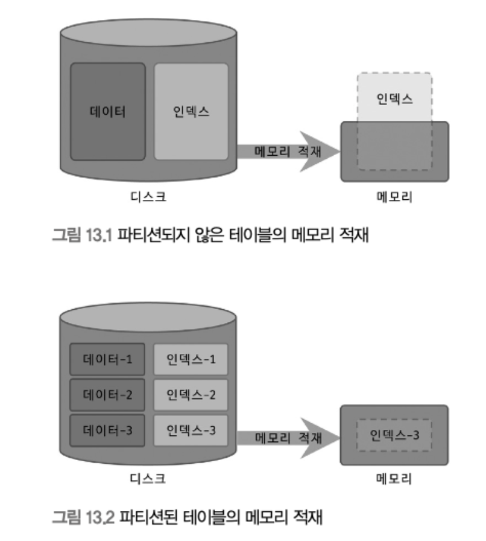</p>

<br>

해당 이미지는 큰 테이블을 파티션하지 않고 그냥 사용할 때와 작은 파티션으로 나눠서 워킹 셋의 크기를 줄였을 때 인덱스의 워킹 셋이 물리적인 메모리를 어떻게 사용하는지를 보여줌

```
데이터가 10GB, 인덱스가 3GB라고 가정한다면 13GB 전체를 사용하는 것이 아니라

일정 부분만 활발하게 사용할 것

대부분의 테이블 데이터가 이런 형태로 사용된다고 볼 수 있는데 이런 데이터를 Working Set이라고 표현

테이블 데이터를 활발하게 사용되는 워킹 셋과 그렇지 않은 부분을 나눠서 파티션할 수 있다면 효과적으로 성능을 개선할 수 있을 것
```

#### 데이터의 물리적인 저장소를 분리

데이터나 인덱스 파일이 파일 시스템에서 차지하는 공간이 크다면 백업이나 관리가 어려움

테이블의 데이터나 인덱스를 파일 단위로 관리하는 MySQL에서 더 치명적인 문제

이런 문제는 파티션을 통해 파일 크기를 조절하거나 파티션 별 파일이 저장될 위치나 디스크를 구분해서 지정

But, MySQL에서는 테이블의 파티션 단위로 인덱스를 생성하거나 파티션별로 다른 인덱스를 가지는 형태는 지원하지 않음

<br>

#### 이력 데이터의 효율적인 관리

<p align="center">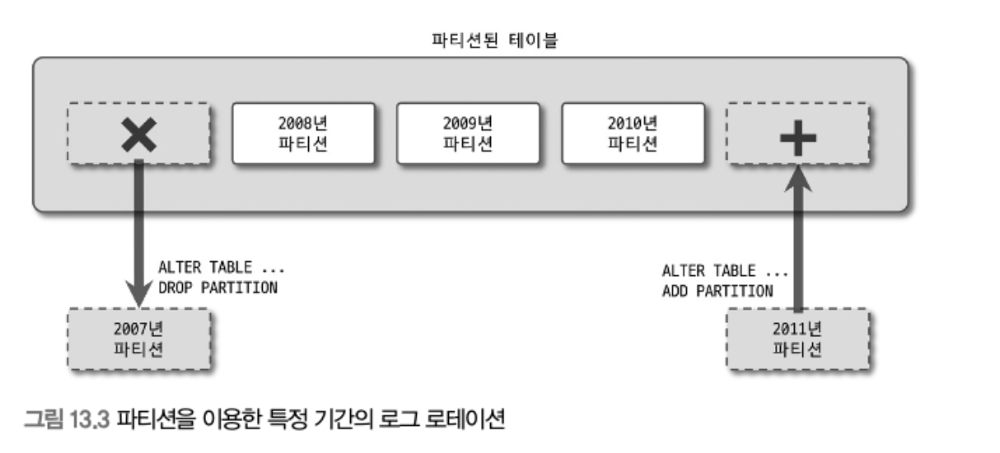</p>

<br>

애플리케이션은 로그라는 이력 데이터를 가지고 있는데

이것은 단기간에 대량으로 누적, 동시에 일정 기간이 지나면 쓸모 없어짐

로그 데이터는 결국 시간이 지나면 별도로 아카이빙하거나 백업한 후 삭제해버리는 것이 일반적이며 특히 `다른 데이터에 비해 라이프 사이클이 짧은 것이 특징`

로그 테이블에서 불필요해진 데이터를 백업하거나 삭제하는 작업은 일반 테이블에서는 상당히 고부하의 작업

로그 테이블을 파티션 테이블로 관리한다면 위의 그림과 같이 불필요한 데이터 삭제 작업은 단순히 파티션을 추가하거나 삭제하는 방식으로 간단하고 빠르게 해결할 수 있음

<br>

대량의 데이터가 저장된 로그 테이블을 기간 단위로 삭제한다면 부하 뿐만 아니라 로그 테이블 자체의 동시성 영향

파티션으로 해당 문제 대폭 감소 가능

<br>

### MySQL 파티션의 내부 처리

<p align="center">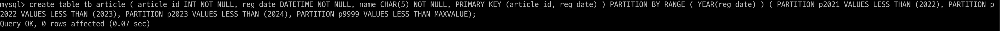</p>

<br>

여기서 게시물의 등록 일자(reg_date)에서 연도 부분은 파티션 키로서 해당 레코드가 어느 파티션에 저장될지를 결정하는 중요한 역할

INSERT, UPDATE, SELECT 같은 쿼리가 어떻게 처리되는지 알아보자

#### 파티션 테이블의 레코드 INSERT

<p align="center">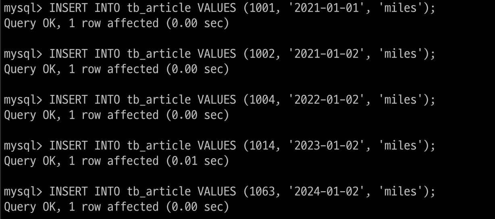</p>

<br>

INSERT 쿼리가 실행되면 파티션 키인 reg_date 칼럼의 값을 이용해 파티션 표현식을 평가하고,

그 결과를 이용해 레코드가 저장될 파티션을 결정

파티션이 결정되면 나머지 과정은 파티션되지 않은 일반 테이블과 동일하게 처리

<p align="center">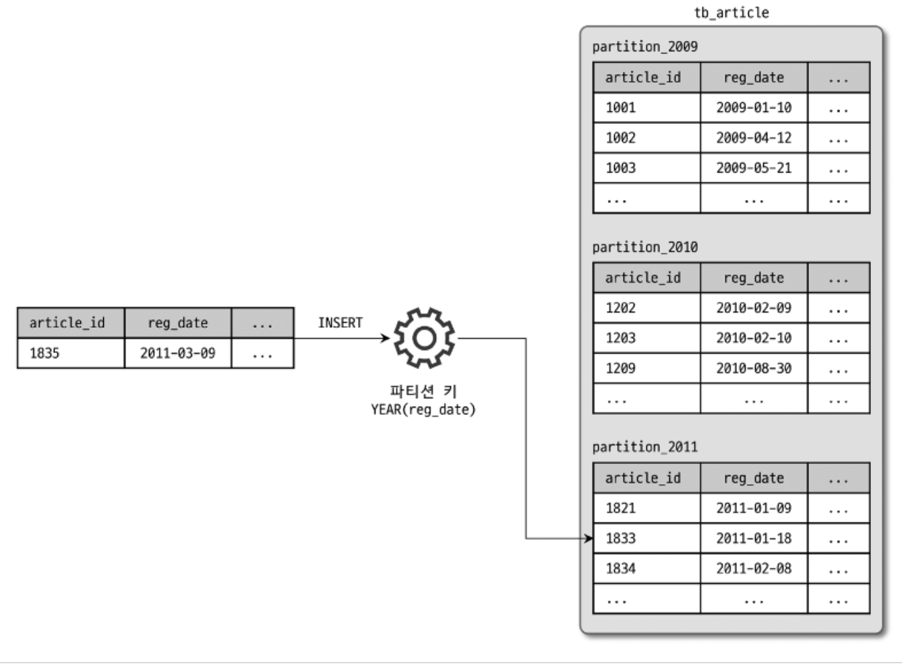</p>

<br>


#### 파티션 테이블의 UPDATE

<p align="center">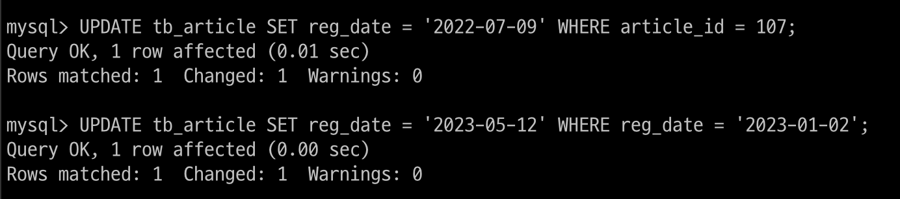</p>

<br>

UPDATE 쿼리를 실행하려면 변경 대상 레코드가 어느 파티션에 저장되어 있는지 확인

이 때 WHERE 조건에 파티션 키 칼럼이 조건으로 존재한다면 그 값을 이용해 레코드가 저장된 파티션에서 대상 레코드를 검색

WHERE 조건에 파티션 키 칼럼이 없다면 테이블의 모든 파티션을 검색해야 함

그리고 실제 레코드를 변경하는 작업의 절차는 UPDATE 쿼리가 어떤 칼럼의 값을 변경하느냐에 따라 큰 차이

<p align="center">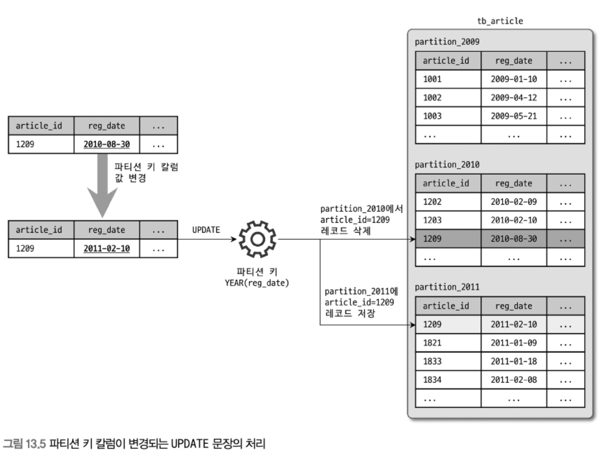</p>

<br>

파티션 키 이외의 칼럼만 변경할 때는 일반 테이블과 마찬가지로 칼럼 값만 변경

파티션 키 칼럼이 변경될 떄는 기존의 레코드가 저장된 파티션에서 해당 레코드를 삭제하고,

변경되는 파티션 키 칼럼의 표현식을 평가하고 레코드를 이동시킬 새로운 파티션을 결정해서 레코드를 새로 저장

질문

같은 파티션에 존재를 해도 삭제 후 저장이 되는 것인지?

<br>

#### 파티션 테이블의 검색

파티션 테이블을 검색할 때 성능에 크게 영향을 미치는 조건은?

- `WHERE 절의 조건으로 검색해야 할 파티션을 선택할 수 있는가?`

- WHERE 절의 조건이 인덱스를 효율적으로 사용(인덱스 레인지 스캔)할 수 있는가?

파티션 테이블에서는 첫번째 선택사항의 결과에 의해 두 번째 선택사항의 작업 내용이 달라질 수 있음

두가지 선택 사항의 각 조합이 어떻게 실행되는지 살펴보자

- `파티션 선택 가능 + 인덱스 효율적 사용 가능`

    해당 과정이 가장 효율적으로 처리됨

    파티션 개수와 상관없이 검색을 위해 꼭 필요한 파티션 인덱스만 레인지 스캔

- `파티션 선택 불가 + 인덱스 효율적 사용 가능`

    WHERE 조건에 일치하는 레코드가 저장한 파티션을 걸러낼 수 없기 때문에 우선 테이블의 모든 파티션을 대상으로 검색해야 함

    하지만 각 파티션에 대해서는 인덱스 레인지 스캔이 가능하기에 테이블에 존재하는 모든 파티션의 개수만큼 인덱스 레인지 스캔을 수행

    즉, 파티션의 개수만큼 인덱스 레인지 스캔을 한 다음에 결과 병합

- `파티션 선택 가능 + 인덱스 효율적 사용 불가`

    저장된 파티션을 선별할 수 있기 때문에 필요한 파티션만 읽음

    근데 인덱스는 이용할 수가 없기 때문에 해당 파티션에 대해서 풀 테이블 스캔

- `파티션 선택 불가 + 인덱스 효율적 사용 불가`

    풅 테이블 스캔


3, 4번째는 피하고

2번째 조합 또한 하나의 테이블에 파티션 개수가 많을 때는 서버 부하도 높아지고 처리 시간이 많이 느려짐

결국에는 파티션을 사용할 때는 WHERE 절의 조건으로 파티션을 정해줘야 훨씬 효율적

<br>

#### 파티션 테이블의 인덱스 스캔과 정렬


파티션 테이블에서 인덱스는 전부 로컬 인덱스에 해당

모든 인덱스는 파티션 단위로 생성되며

( 개별 파티션에 속한 인덱스가 모든 파티션에 대해서 공통적으로 생성된다는 의미이며, 

개별 파티션 단위로 인덱스를 서로 다른 인덱스를 생성할 수 있다는 의미가 X )

파티션과 관계없이 테이블 전체 단위로 글로벌하게 하나의 통합된 인덱스는 지원하지 않는다는 것을 의미

(이러한 인덱스를 글로벌 인덱스, 개별 파티션에 속한 인덱스를 로컬 인덱스)
 
<p align="center">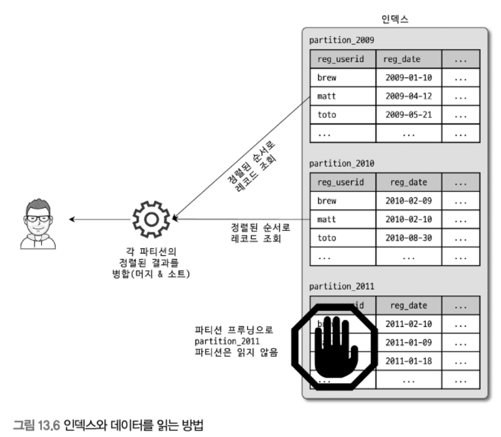</p>

<br>

reg_userid로 생성된 인덱스, 인덱스도 tb_article 테이블과 같이 연도별로 파티션되어 저장됐다는 것을 확인 가능

파티션되지 않은 테이블에서는 인덱스를 순서대로 읽으면 그 칼럼의 정렬된 결과를 바로 얻을 수 있지만 파티션된 테이블에서는 그렇지 않음

<p align="center">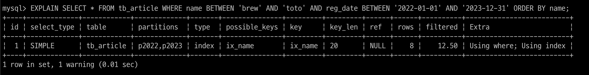</p>

<br>


인덱스 레인지 스캔을 수행하는 쿼리가 여러 개의 파티션을 읽어야 할 때 그 결과는 인덱스 칼럼으로 정렬이 될 지?

위 실행 계획을 살펴보면 Extra 칼럼에 Using filesort가 뜨지 않았음

-> 이 의미는 마지막에 임시 테이블을 사용해서 정렬을 하지 않았다는 얘기인데

생각해보면 PARTITION 2022랑 2023으로부터 WHERE 조건에 일치하는 레코드를 가져온 후

각 파티션의 결과를 병합해서 name으로 정렬해야 할 것처럼 생각되는데 실행 계획에는 별도 정렬 수행 메시지가 표시되지 않음

<br>

MySQL 서버는 여러 파티션에 대해서 인덱스 스캔을 수행할 때 각 파티션으로부터 조건에 일치하는 레코드를 정렬된 순서대로 읽으면서 우선순위 큐에 임시로 저장

```
우선 순위 큐란

큐는 FIFO형 자료 구조이고

우선 순위 큐는 우선 순위를 고려해서 우선 순위가 높은 데이터부터 먼저 빠져나갈 수 있게끔 

```

우선순위 큐에서 다시 필요한 순서(인덱스의 정렬 순서)대로 데이터를 가져가는 것
-> 인덱스의 정렬 순서가 우선 순위로 부여됨

이는 각 파티션에서 읽은 데이터가 이미 정렬돼 있는 상태라서 가능한 방법

결론적으로 파티션 테이블에서 인덱스 스캔을 통해 레코드를 읽을 때 MySQL 서버가 별도의 정렬 작업을 수행하지 않음

하지만 일반 테이블의 인덱스 스캔처럼 결과를 바로 반환하는 것이 아니고 내부적으로 큐 처리가 한번 필요한 것

그림 13.6의 머지 & 소트 부분이 우선순위 큐 처리 작업을 의미

<br>

#### 파티션 프루닝

13.6처럼 옵티마이저에 의해 3개의 파티션 중 2개만 읽어도 된다고 판단되면 불필요한 파티션에는 전혀 접근 X

불필요한 것들은 실행 계획에서 배제하는 것을 파티션 프루닝(partition pruning)이라고 함

실행 계획 partitions 칼럼을 보면 어떤 파티션만 조회하는지 확인 가능

<p align="center"></p>

<br>

p2022랑 p2023만 조회됐고 p2021은 프루닝

<br>

## 주의사항

여기서 살펴볼 제약 사항들은 대부분 파티션의 태생적인 한계이기 때문에 서버가 아무리 업그레이드된다고 해도 여전히 있을 수 있는 제약사항들

<br>

### 파티션의 제약 사항

<p align="center">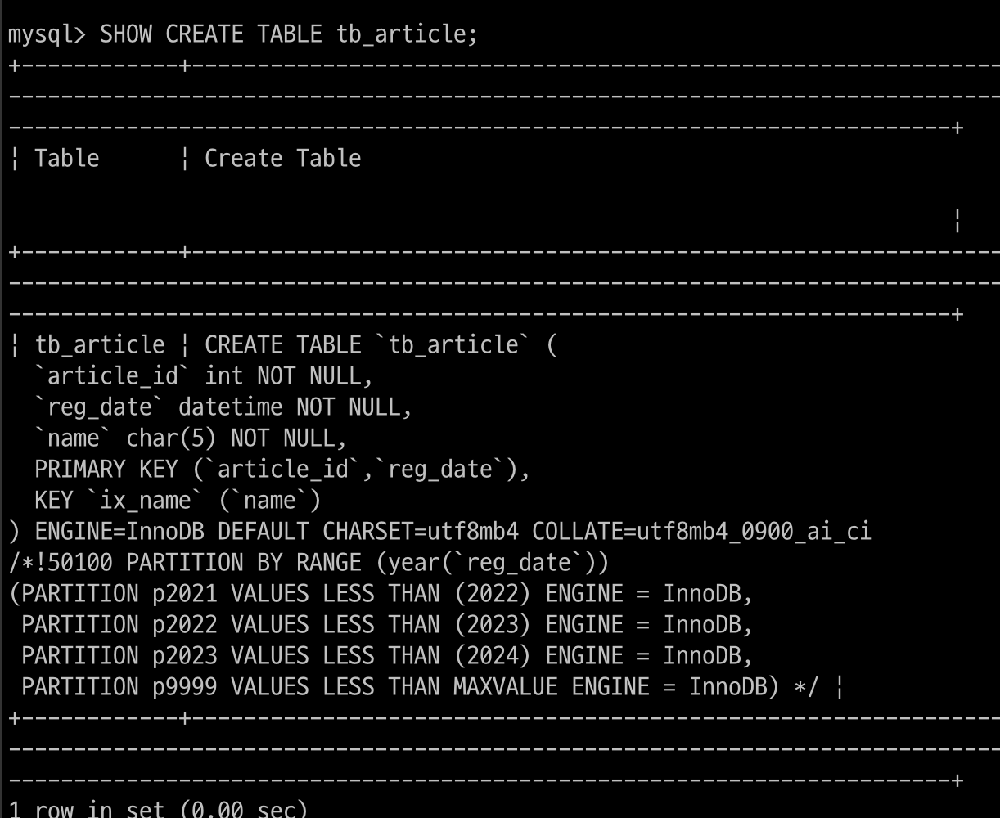</p>

<br>

PARTITION BY RANGE 절은 이 테이블이 레인지 파티션을 사용한다는 것을 의미

그리고 파티션 칼럼은 reg_date이며, 파티션 표현식으로는 YEAR(reg_date)가 사용

tb_article 테이블은 reg_date 칼럼에서 YEAR() 함수를 이용해서

연도만 추출하고 그 연도를 이용해 테이블을 연도 범위별로 파티션

<br>

MySQL 서버의 파티션이 가지는 제약 사항

- 스토어드 루틴이나 UDF, 사용자 변수 등을 파티션 표현식에 사용 X

- 파티션 표현식은 일반적으로 칼럼 그 자체 또는 MySQL 내장 함수를 사용할 수 있는데, 일부 함수들은 파티션 생성은 가능하지만 파티션 프루닝을 지원하지 않을수도

- `PK를 포함해서 테이블의 모든 유니크 인덱스는 칼럼을 포함해야 함`

    -> 파티션 칼럼은 무조건 인덱스 활용이 가능

- 파티션된 테이블의 인덱스는 모두 로컬 인덱스이며, 동일 테이블에 소속된 모든 파티션은 같은 구조의 인덱스만 가질 수 있음 또한, 파티션 개별로 인덱스를 변경하거나 추가할 수 없음

- 동일 테이블에 속한 모든 파티션은 동일 스토리지 엔진만 가질 수 있음

- 최대(서브 파티션까지 포함) 8192개의 파티션을 가질 수 있음

- 파티션 생성 이후 MySQL 서버의 sql_mode 시스템 변수 변경은 데이터 파티션의 일관성을 깨뜨릴 수 있음

- 파티션 테이블에서는 외래키 사용 불가

- 파티션 테이블은 전문 검색 인덱스 생성이나 전문 검색 쿼리 사용 불가

- 공간 데이터를 저장하는 칼럼 타입(POINT, GEOMETRY ... )은 파티션 테이블에서 사용할 수 없음

- 임시 테이블은 파티션 기능 사용 불가

<br>

일반적으로 파티션 테이블을 생성할 때 가장 크게 영향을 미치는 제약 사항은 모든 유니크 인덱스에 파티션 키 칼럼이 포함되어야 한다는 것

`tb_article 테이블에서 (article_id, reg_date) 칼럼 조합으로 PK를 선정`

`이것은 파티션 키로 사용되는 칼럼은 반드시 PK의 일부로 참여해야 한다는 제약 사항 때문`

article_id 만으로 유니크한 값을 가지기 때문에 reg_date 칼럼을 PK 마지막에 추가하는 것은 아무런 의미가 없지만 reg_date 칼럼으로 파티션을 적용하기 위해서는 해당 방법 뿐

<br>

파티션 표현식에서는 기본적인 산술 연산자인 +, -, * 같은 연산자와

ABS(), CEILING(), EXTRACT(), FLOOR(), MOD(),

DATEDIFF(), DAY(), DAYOFMONTH(), DAYOFWEEK(), DAYOFYEAR(), HOUR(), 

MICROSECOND(), MINUTE(), MONTH(), QUARTER(), SECOND(), TIME_TO_SEC(),

TO_DAYS(), TO_SECONDS(), UNIX_TIMESTAMP(), WEEKDAY(), YEAR(), YEARWEEK()

와 같은 내장 함수를 사용할 수 있음

해당 함수들이 모두 파티션 프루닝 기능을 지원하는 것은 아니어서 프루닝 기능이 정상적으로 

작동하는지 확인한 후 응용 프로그램에 적용하는 것을 권장

<br>

### 파티션 사용 시 주의 사항

파티션 테이블의 경우 PK를 포함한 유니크 키에 대해서는 어려운 제약 사항이 존재

`파티션의 목적이 작업의 범위를 좁히는 것`인데

유니크 인덱스는 중복 레코드에 대한 체크 작업 때문에 범위가 좁혀지지 않는다는 점
-> ??

MySQL 파티션은 일반 테이블과 같이 별도의 파일로 관리

이와 관련해서 MySQL 서버가 조작할 수 있는 파일의 개수와 연관된 제약도 있음

<br>

#### 파티션과 유니크 키(PK 포함)

종류와 관계없이 테이블에 유니크 인덱스(PK 포함)가 있으면 파티션 키는 모든 유니크 인덱스의 일부 또는 모든 칼럼을 포함해야 함

<p align="center">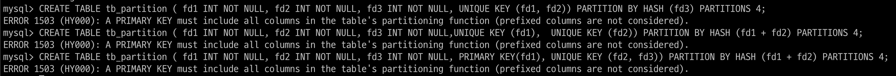</p>

<br>

해당 예제는 모두 잘못된 테이블 파티션 생성 방법

유니크 키에 대해 파티션 키가 제대로 설정됐는지 간단히 확인하려면 각 유니크 키에 대해 값이 주어졌을 때 해당 레코드가 어느 파티션에 저장돼 있는지 계산할 수 있어야 함

무엇이 잘못됐냐면

1. 유니크 키와 파티션 키가 전혀 연관이 없음

2. 첫 번째 유니크 키 칼럼인 fd1만으로 파티션 결정이 되지 않음 (fd2 칼럼값도 같이 있어야 파티션의 위치 판단 가능), 두번째 유니크 키 또한 첫 번째와 같은 이유

-> 파티션 키인 fd1, fd2가 하나로 묶여있지 않고 따로따로여서

3. 세 번째 쿼리 또한 두 번째 쿼리와 같이 PK 칼럼인 fd1 값만으로는 파티션 판단이 되지 않으며, 유니크 키인 fd2와 fd3로도 파티션 위치를 결정할 수 없음

<p align="center">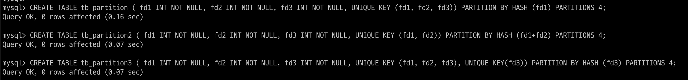</p>

<br>

해당 쿼리들은 파티션 키로 사용 가능한 예제들

<br>

#### 파티션과 open_files_limit 시스템 변수 설정

MySQL에서는 일반적으로 테이블을 파일 단위로 관리하기 때문에 MySQL 서버에서 동시에 오픈된 파일의 개수가 상당히 많아질 수 있음

이를 제한하기 위해 open_files_limit 시스템 변수로 동시 오픈 파일 수를 설정 가능

파티션되지 않은 일반 테이블은 테이블 1개당 오픈된 파일의 수가 2 ~ 3개 수준이지만 `파티션 테이블에서는 (파티션의 개수 * 2 ~ 3개)`

-> 파티션별 파일이 별도로 존재해서 파일 오픈 개수가 파티션 개수만큼 증가

예를 들어, 파티션이 1024개 포함된 테이블을 생각하면

쿼리가 파티션 프루닝으로 최적화되어 1024개 파티션 가운데 2개의 파티션만 접근해도 된다고 하더라도 `일단 동시에 모든 파티션의 데이터를 오픈해야 함`

그래서 파티션을 많이 사용하는 경우에는 open_files_limit를 적절히 높은 값으로 설정하자

<br>

## MySQL 파티션의 종류

다른 DBMS와 마찬가지로 MySQL에서도 4가지 기본 파티션 기법 제공

해시와 키 파티션에 대해서는 리니어 파티션과 같은 추가적인 기법도 제공

- 레인지 파티션

- 리스트 파티션

- 해시 파티션

- 키 파티션

<br>

### 레인지 파티션 (PARTITION BY RANGE)

파티션 키의 연속된 범위로 파티션을 정의하는 방법

가장 일반적으로 사용되는 파티션 방법 중 하나

다른 파티션 방법과 달리 `MAXVALUE라는 키워드를 이용해 명시되지 않은 범위의 키 값이 담긴 레코드를 저장하는 파티션을 정의 할 수 있음`

<br>

#### 레인지 파티션의 용도

해당 성격을 가진 테이블에서는 레인지 파티션을 이용하는 것이 좋음

- `날짜를 기반으로 데이터가 누적되고 연도나 월 또는 일 단위로 분석하고 삭제해야 할 때`

    -> 비마이프렌즈

- `범위 기반으로 데이터를 여러 파티션에 균등하게 나눌 수 있을 때`

- `파티션 키 위주로 검색이 자주 실행될 때`

    (모든 파티션에 일반적으로 적용되는 내용이지만 레이지나 리스트 파티션에 더 필요한 요건)

<br>

DB에서 파티션의 장점은 다음 2가지

- 큰 테이블을 작은 크기의 파티션으로 분리

- `필요한 파티션만 접근(쓰기와 읽기 모두)`

첫 번째보다 두 번째 장점의 효과가 매우 큰 편

문제는 파티션을 적용하면서 두 번째 장점은 취하지 못하고 첫 번째 장점에만 집중하다보니 소탐대실의 결과로..

결과적으로 파티션 때문에 오히려 MySQL 서버의 성능을 떨어뜨리게 되는 것

실제 파티션에서는 이 두가지 장점을 모두 취하기는 매우 어렵지만

이력을 저장하는 테이블에서 레인지 파티션은 두 가지 장점을 모두 어렵지 않게 취득 가능

저자가 경험했던 많은 응용 프로그램에서 사용했던 파티션은 대부분 이력을 저장하는 로그 테이블에 레인지 파티션을 적용한 경우

<br>

#### 레인지 파티션 테이블 생성

<p align="center">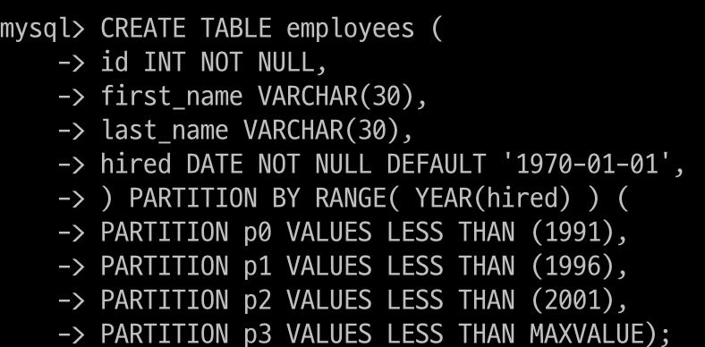</p>

<br>

레인지 파티션을 이용해서 사원의 입사 연도별 파티션 테이블을 만들고

사용된 각 절에 대해 하나씩 살펴보자면

- PARTITION BY RANGE 키워드로 레인지 파티션을 정의

- PARTITION BY RANGE 뒤에 칼럼 또는 내장 함수를 이용해서 파티션 키를 명시

    여기서는 사원의 입사일자에서 연도만을 파티션 키로

- VALUES LESS THAN으로 명시된 값보다 작은 값만 해당 파티션에 저장하게 설정

    단, `LESS THAN 절에 명시된 값은 포함 XXXX` ( 미만이라는 뜻 )

- VALUES LESS THAN MAXVALUE로 명시되지 않은 레코드를 저장할 파티션을 지정

    여기서는 2001년부터 9999년 사이에 입사한 사원의 정보는 p3 파티션

    근데 또 파티션을 나누고 싶을 때는 어떻게 하지?

- VALUES LESS THAN MAXVALUE가 정의되지 않으면 hired 칼럼의 값이 '2011-02-30'인 레코드가 INSERT될 때 에러가 발생하면서 "Table has "no partition for value 2011"이라는 메시지가 표시될 것

- 테이블과 각 파티션은 같은 스토리지 엔진으로 정의할 수 있고 8.0부터는 InnoDB가 기본 스톨지 엔진이므로 별도 명시하지 않아도 InnoDB 테이블로 생성

<br>

파티션된 테이블에 레코드가 INSERT될 떄는 다음과 같이 입사 일자에 따라 각각 다른 파티션에 저장됨

p0 : 입사 일자 1990년 이하

p1 : 입사 일자 1991 ~ 1995년 이하

p2 : 입사 일자 1996 ~ 2000년 이하

p3 : 입사 일자 2001년 ~ 

<br>

#### 레인지 파티션의 분리와 병합

##### 단순 파티션의 추가

다음은 employees 테이블에 입사 일자가 2001년부터 2010년 이하인 레코드를 저장하기 위한 새로운 파티션 p4를 추가하는 ALTER TABLE 명령

<p align="center">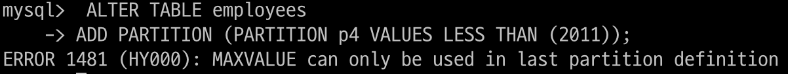</p>

<br>

현재 employees 테이블에는 LESS THAN MAXVALUES 파티션을 이미 가지고 있음

그래서 해당 에러 발생

<br>

이미 MAXVALUE 파티션이 2001년 이후 모든 레코드를 가지고 있는 상태에서 2011년 파티션이 추가되면 2011년 레코드는 2개의 파티션으로 나뉘어 저장되는 결과를 만들어냄

이는 하나의 레코드는 반드시 하나의 파티션에만 저장되어야 한다는 기본 조건을 벗어나는 것

<br>

<p align="center">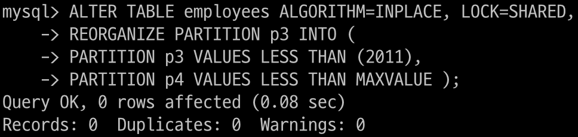</p>

<br>

이 경우에는 ALTER TABLE ... REORGANIZE PARTITION 명령 사용

해당 명령은 p3 파티션의 레코드를 모두 새로운 두 개의 파티션으로 복사하는 작업을 필요로 함

p3 파티션 레코드가 매우 많다면 이 작업은 매우 오랜 시간이 걸릴 것
-> 복사하는 작업이 필요해서

<br>

레인지 파티션에서 일반적으로 LESS THAN MAXVALUE 절을 사용하는 파티션은 추가하지 않고, 

미래에 사용될 파티션을 미리 2~3개 정도 더 만들어두는 형태로 테이블을 생성하기도 함

그리고 배치 스크립트를 이용해 주기적으로 파티션 테이블의 여유 기간을 판단해서 파티션을 자동으로 추가하는 방법을 사용

하지만 이렇게 필요한 파티션을 배치 스크립트에 의존하는 경우 배치 스크립트의 오류로 파티션의 

자동으로 추가되지 못할 수도 있어서 INSERT를 실행하지 못하는 치명적인 문제가 발생할수도

-> 근데 배치 스크립트를 안쓰고 무조건 수동?? uzi의 생각이 궁금

<br>

MAXVALUE 파티션을 추가할지 말지는 INSERT되는 데이터의 특성이나 배치 스크립트의 안정성에 따라 적절히 판단하면 됨

<br>

##### 파티션 삭제

레인지 파티션을 사용하는 테이블에서 파티션을 삭제하려면 다음과 같이 DROP PARTITION 키워드에 삭제하려는 파티션의 이름을 지정하면 됨

레인지나 리스트 파티션 테이블에서 특정 파티션을 삭제하는 작업은 아주 빠르게 처리되므로 날짜 단위로 파티션된 테이블에서 오래된 데이터를 삭제하는 용도로 자주 사용

<p align="center">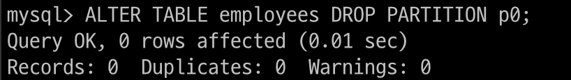</p>

<br>

`레인지 파티션을 사용하는 테이블에서 이렇게 파티션을 삭제하는 경우에는 항상 가장 오래된 파티션 순서로만 삭제가 가능`

중간에 있는 파티션을 먼저 삭제 불가

레인지 파티션을 사용하는 테이블은 가장 마지막 파티션만 새로 추가할 수 있고,

가장 오래된 파티션만 삭제 가능


<br>


##### 기존 파티션의 분리

하나의 파티션을 두 개 이상의 파티션으로 분리하고자 할 때 REORGANIZE PARTITION 명령 수행

<p align="center"></p>

<br>

MAX VALUE 파티션인 p3를 두 개의 파티션으로 나누는 명령

2001 ~ 2011년까지 입사한 사원들을 위한 p3 파티션과

2012년 이후 입사한 사원을 위한 MAXVALUE (p4) 파티션을 추가

이렇게 파티션을 분리하면 기존에 MAXVALUE 파티션에 저장돼 있던 데이터는 적절히 재배치

<br>

기존 파티션의 레코드가 많다면 온라인 DDL로 실행할 수 있도록 ALGORITHM과 LOCK 절을 사용

하지만 파티션 재구성 명령은 INPLACE는 가능하지만 최소한 읽기 잠금(SHARED)이 필요

즉, 파티션이 재구성되는 동안은 테이블 쓰기가 불가능

-> 서비스 점검 시간대나 쿼리 처리가 많지 않은 시간대에 진행

<br>

##### 기존 파티션의 병합

병합 작업도 REORGANIZE PARTITION 명령으로 처리

<p align="center">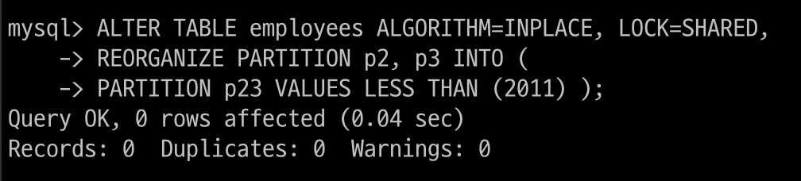</p>

<br>


employees 테이블의 p2 파티션과 p3 파티션을 p23으로 병합하는 예제

이 작업은 테이블에 대해서 읽기 잠금이 필요하다는 것에 주의

<br>

### 리스트 파티션 (PARTITION BY LIST)

리스트 파티션은 레인지 파티션과 많은 부분 흡사하게 동작

둘의 가장 큰 차이는 레인지 파티션은 키 값의 범위로 파티션을 구성할 수 있지만

리스트 파티션은 파티션 키 값 하나하나를 리스트로 나열해야 한다는 점

MAXVALUE XX

<br>

#### 리스트 파티션의 용도

해당 특성을 가지면 리스트 파티션을 사용하자

- 파티션 키 값이 코드 값이나 카테고리와 같이 고정적일 때

- 키 값이 연속되지 않고 정렬 순서와 관계없이 파티션을 해야 할 때

- 파티션 키 값을 기준으로 레코드 건수가 균일하고 검색 조건에 파티션 키가 자주 사용될 때

    (모든 파티션에 일반적으로 적용되는 내용이지만 레이지나 리스트 파티션에 더 필요한 요건)

<br>

#### 리스트 파티션 테이블 생성

<p align="center">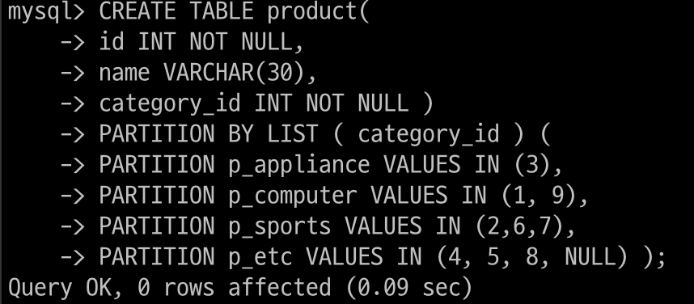</p>

<br>

해당 쿼리에서 중요 부분을 살펴보자면

- PARTITION BY LIST 키워드로 생성할 파티션이 리스트 파티션이라는 것을 명시

- PARTITION BY LIST 키워드 뒤에 파티션 키를 정의

    해당 예제에서는 INT 타입의 category_id 칼럼값을 그대로 파티션 키로 사용

- VALUES IN (...) 을 사용해 파티션 별로 저장할 파티션 키 값 목록을 나열

- 마지막 파티션과 같이 파티션 키 값 중에 NULL 명시 가능

- MAXVALUE X


<p align="center">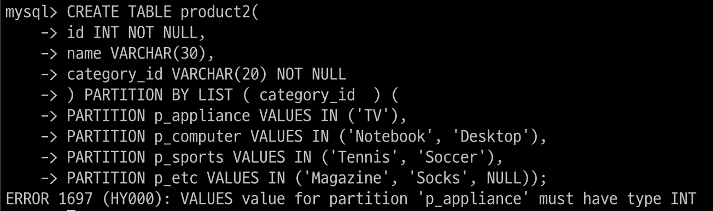</p>

<p align="center">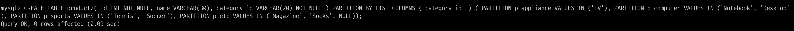</p>

<br>


INT형 데이터 넣으라고 해서 docs를 찾아보니

>https://dev.mysql.com/doc/refman/8.4/en/partitioning-columns-list.html

8.4 버전 이후에는 string data type을 넣을 때는 PARTITION BY LIST COLUMNS()로 해야 한다고 함

<br>

#### 리스트 파티션의 분리와 병합

VALUES LESS THAN이 아닌 VALUES IN을 사용한다는 것 외에는 레인지 파티션과 모두 같음

<br>

#### 리스트 파티션 주의사항

다른 파티션 방법에 비해 리스트 파티션은 다음과 같은 제약 사항이 있음

- 명시되지 않은 나머지 값을 저장하는 `MAXVALUE 파티션을 정의할 수 없음`

- 레인지 파티션과는 달리 `NULL을 저장하는 파티션을 별도로 생성할 수 있음`

<br>

### 해시 파티션

MySQL이 정의한 해시 함수에 의해 레코드가 저장될 파티션을 결정하는 방법

MySQL에서 정의한 해시 함수는 파티션 표현식의 결괏값을 파티션의 개수로 나눈 나머지로 저장될 파티션을 결정하는 방식

해시 파티션의 파티션 키는 항상 정수 타입의 칼럼이거나 정수를 반환하는 표현식만 가능

해시 파티션에서 파티션의 개수는 레코드를 각 파티션에 할당하는 것과 연관되기에 파티션을 추가하거나 삭제하는 작업에는 테이블 전체적으로 레코드를 재분배하는 작업이 따름

<br>

#### 해시 파티션의 용도

해시 파티션이 적합한 테이블

- 레인지 파티션이나 리스트 파티션으로 데이터를 균등하게 나누는 것이 어려울 떄

- 테이블의 모든 레코드가 비슷한 사용 빈도를 보이지만 테이블이 너무 커서 파티션을 적용해야 할 때

`대표적인 용도로는 회원 테이블`

`회원 정보는 가입 일자가 오래돼서 사용되지 않거나 최신이어서 더 빈번하게 사용되거나 하지 않음`

회원의 지역이나 취미 같은 정보 또한 사용 빈도에 미치는 영향이 거의 없음

이처럼 테이블의 데이터가 특정 칼럼의 값에 영향을 받지 않고 전체적으로 비슷한 사용 빈도를 보일 때 적합한 파티션 방법

<br>

#### 해시 파티션 테이블 생성

<p align="center">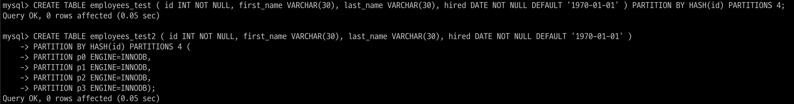</p>

<br>

위의 예제를 살펴보자

- PARTITION BY HASH 키워드로 파티션 종류를 해시 파티션으로 지정

- PARTITION BY HASH 키워드 뒤에 파티션 키 명시

- `해시 파티션의 파티션 키 또는 파티션 표현식은 반드시 정수 타입의 값으로 반환`

- PARTITIONS n 으로 몇 개의 파티션으로 생성할 것인지 명시

- 파티션 개수뿐만 아니라 각 파티션의 이름을 명시하려면 두번쨰 예제처럼

<br>

#### 해시 파티션의 분리와 병합

리스트 파티션이나 레인지 파티션과는 달리 대상 테이블의 모든 파티션에 저장된 레코드를 재분배하는 작업이 필요

파티션 분리나 병합으로 인해 파티션의 개수가 변경된다는 것은 해시 함수 알고리즘을 변경하는 것이므로 전체 파티션이 영향을 받는 것은 피할 수 없음

<br>

##### 해시 파티션 추가

해시 파티션은 특정 파티션 키 값을 테이블의 파티션 개수로 MOD 연산한 결과 값에 의해 각 레코드가 저장될 파티션을 결정

즉, 해시 파티션은 테이블에 존재하는 파티션의 개수에 의해 파티션 알고리즘이 변하는 것

따라서 새로운 파티션이 추가되면 기존의 각 파티션에 저장된 모든 레코드가 재배치되어야 함

<p align="center">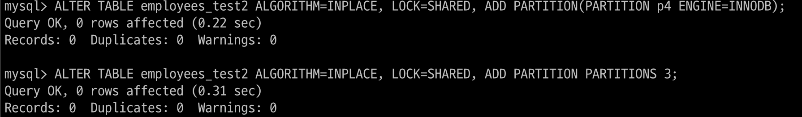</p>

<br>

해시 파티션을 새로 추가할 때는 별도의 영역이나 범위는 명시하지 않고 몇 개의 파티션을 더 추가할 것만 지정

<p align="center">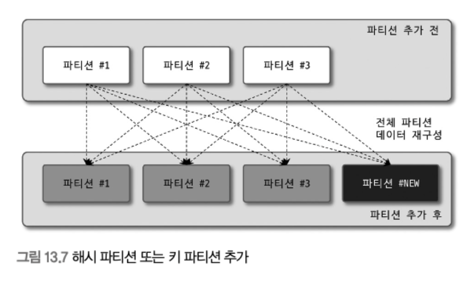</p>

<br>


새로운 파티션을 추가하면 기존의 모든 파티션에 저장돼 있던 레코드를 새로운 파티션으로 재분배하는 작업 발생

해시 파티션에서 파티션을 추가하는 작업은 INPLACE 알고리즘으로 실행된다고 하더라도 레코드 리빌드 작업이 필요하며 테이블에 대한 읽기 잠금이 필요

그래서 해시 파티션에서 파티션을 추가하거나 생성하는 작업은 많은 부하를 발생시키며

다른 트랜잭션에서 동일 테이블에 데이터를 변경하는 작업은 허용 XX

<br>

##### 해시 파티션 삭제

해시나 키 파티션은 파티션 단위로 레코드를 삭제하는 방법이 없음

<p align="center">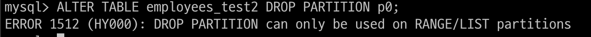</p>

<br>

파티션 키 값을 가공해서 데이터를 각 파티션으로 분산한 것이므로 각 파티션에 저장된 레코드가 어떤 부류의 데이터인지 사용자 예측 불가

해시, 키 파티션을 파티션 단위로 삭제하는 작업은 의미도 없으며 해서는 안될 작업

<br>

##### 해시 파티션 분할

특정 파티션을 두 개 이상의 파티션으로 분할하는 기능은 없으며, 테이블 전체적으로 파티션의 개수를 늘리는 것만 가능

<br>

##### 해시 파티션 병합

해시나 키 파티션은 2개 이상의 파티션을 하나의 파티션으로 통합하는 기능을 제공 X

파티션의 개수를 줄이는 것은 가능

COALESCE PARTITION 명령을 사용

<p align="center">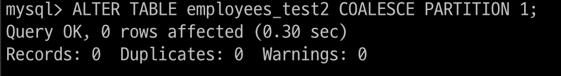</p>


<p align="center">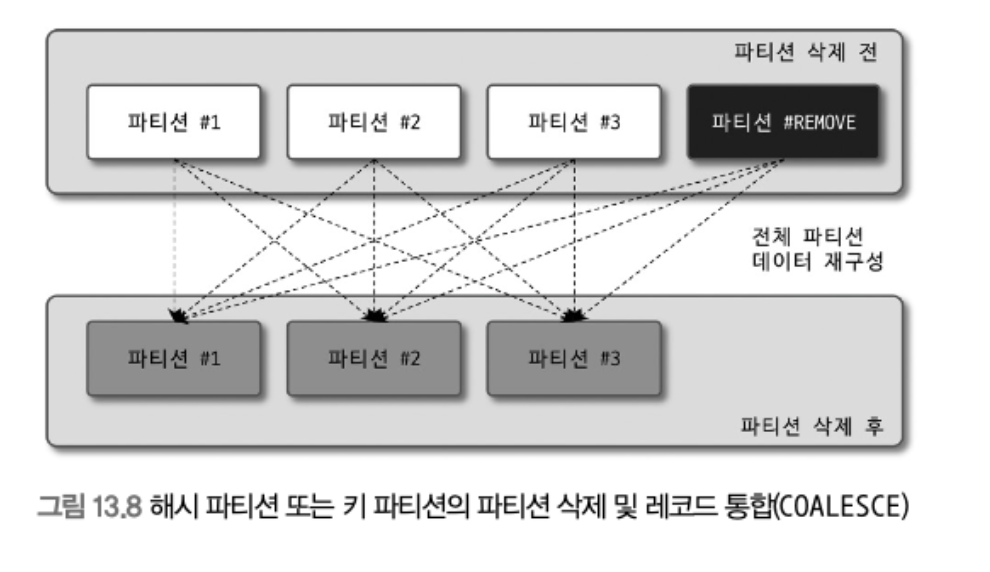</p>

<br>

명령어 자체만 보면 파티션을 통합하는 것처럼 보이지만 n개로 구성된 테이블에 다음 명령어가 실행되면 n-1개의 파티션을 가진 테이블로 다시 재구성하는 작업이 수행

<br>

##### 해시 파티션 주의사항

- 특정 파티션만 삭제하는 것은 불가능

- 새로운 파티션을 추가하는 작업은 기존 모든 데이터의 재배치 작업이 필요

- 해시 파티션은 레인지 파티션이나 리스트 파티션과는 상당히 다른 방식으로 관리하기 때문에 용도가 적합한지 확인 필요

- 일반적으로 사용자들에게 익숙한 파티션 조작이나 특성은 대부분 레인지나 리스트

    해시나 키 파티션을 사용할 때는 주의 필요

<br>

### 키 파티션

키 파티션은 해시 파티션과 특성의 거의 같음

키 파티션은 해시 값의 계산도 MySQL 서버가 수행

정수 타입이나 정숫값을 반환하는 표현식뿐만 아니라 대부분의 데이터 타입에 대해서 파티션 키 적용 가능

선정된 파티션 키 값을 MD5 함수를 이용해 해시 값을 계산하고 그 값을 MOD 연산해서 데이터를 각 파티션에 분배

이것이 해시와 키의 차이점

<p align="center">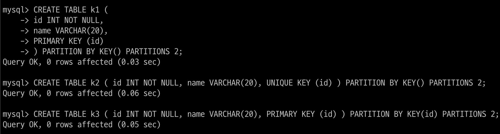</p>

<br>

PK가 있는 경우 자동으로 PK가 파티션 키로 사용

KEY() 괄호 내용을 비워두면 자동으로 PK의 모든 칼럼이 파티션 키가 됨

그렇지 않고 PK 일부만 명시 가능

PK가 없는 경우 UNIQUE KEY가 존재한다면 파티션 키로 사용

파티션 키를 명시적으로 설정도 가능

<br>

PARTITION BY KEY 키워드로 키 파티션을 정의

KEY 키워드 뒤에 파티션 키 칼럼을 명시 , 아무 칼럼도 명시하지 않으면 PK나 UK의 모든 칼럼을 선택

PK나 UK를 구성하는 칼럼 중 일부만 파티션 키로 명시도 가능

PARTITIONS 키워드로 생성할 파티션 개수를 지정

<br>

##### 키 파티션의 주의사항 및 특이사항

키 파티션은 MD5 함수를 이용해 파티션하기 때문에 반드시 정수 타입이 아니어도 됨

-> 해시 파티션으로 파티션이 어렵다면 키 파티션 적용 고려

PK나 UK를 구성하는 칼럼 중 일부만 파티션 가능

UK를 파티션 키로 사용할 때 반드시 NOT NULL

해시 파티션에 비해 더 균등하게 분할할 수 있기에 키 파티션이 더 효율적

