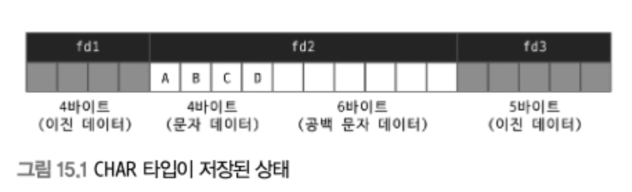
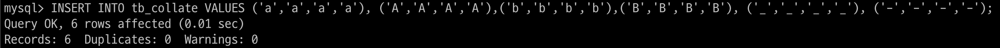
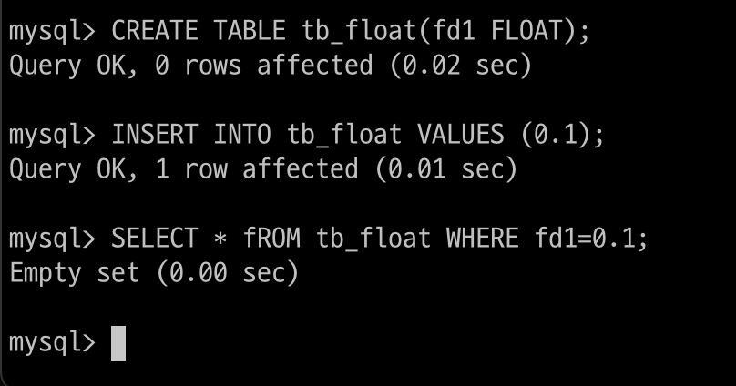
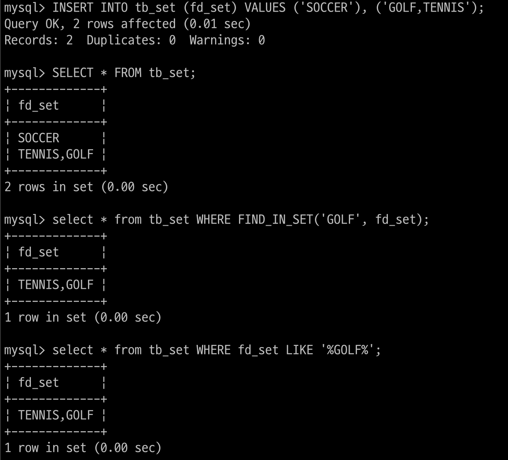
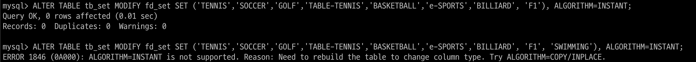

# 15장. 데이터 타입

칼럼의 데이터 타입을 선정하는 작업은 물리 모델링에서 빼놓을 수 없는 작업

칼럼의 `데이터 타입과 길이를 선정할 때` 가장 주의할 사항

- 저장되는 값의 성격에 맞는 최적의 타입을 선정

- 가변 길이 칼럼(ex. VARCHAR)은 최적의 길이를 지정

- 조인 조건으로 사용되는 칼럼은 똑같은 데이터 타입으로 선정

<br>

칼럼의 데이터 타입을 선정할 때 실제 저장되는 `값의 특성을 고려하지 않고 가능한 최대 길이 값을 기준으로 칼럼의 길이를 선택하는 것이 일반적`

하지만 무분별하게 칼럼의 길이가 크게 선정되면 디스크의 공간은 물론 메모리나 CPU의 자원도 함께 낭비

<br>

## 문자열(CHAR와 VARCHAR)

문자열 칼럼을 사용할 때는 우선 CHAR 타입과 VARCHAR 타입 중 어떤 타입을 사용할지 결정

`CHAR와 VARCHAR 타입의 차이가 무엇이고 어떤 타입을 사용하는 것이 좋은가에 관한 질문`

지금까지 모든 DBMS가 CHAR나 VARCHAR `타입을 구분해서 제공하는 것을 보면 그만큼의 장단점이 있을 것`

### 저장 공간

CHAR와 VARCHAR의 공통점은 문자열을 저장할 수 있는 데이터 타입이라는 점

`가장 큰 차이는 고정 길이냐 가변 길이냐`

- 고정 길이는 실제 입력되는 칼럼값의 길이에 따라 사용하는 저장 공간의 크기가 변하지 않음

    CHAR 타입은 이미 저장 공간 크기가 고정적, 실제 저장된 값의 유효 크기가 얼마인지 별도로 저장할 필요가 없음

- 가변 길이는 최대로 저장할 수 있는 값의 길이는 제한돼 있지만, 그 이하 크기의 값이 저장되면 그만큼 저장 공간이 줄어듬

    하지만 `저장된 유효 크기가 얼마인지 별도로 저장해 둬야 하므로 1~2 바이트의 저장 공간이 추가로 더 필요`

<br>

하나의 글자를 저장하기 위해 CHAR(1)과 VARCHAR(1) 타입을 사용할 때 실제 사용되는 저장 공간의 크기를 살펴보자

`두 문자열 타입 모두 한 글자를 저장할 떄 사용하는 문자 집합에 따라 실제 저장 공간을 1 ~ 4 바이트까지 사용`

여기에다가 VARCHAR 타입은 문자열의 길이를 관리하기 위한 1 ~ 2 바이트의 공간을 추가로 더 사용

VARCHAR 타입의 길이가 255바이트 이하이면 1바이트만 사용하고, 256바이트 이상으로 설정되면 2바이트를 사용

VARCHAR 타입의 최대 길이는 2바이트로 표현할 수 있는 이상은 사용할 수 없음

무슨 소리냐 즉, VARCHAR 타입의 최대 길이는 65,536 바이트 이상으로 설정할 수 없음

> 65536의 의미는 64KB, 2의 15제곱, 16진수의 ffff가 66535, 16자리의 bit가 표현될 수 있는 가지 수가 65536

> 만약 인코딩이 cp949, euc-kr이라면 한글 바이트는 2바이트이기에 띄어쓰기,엔터,특수문자 없이 순수 한글만 32768개 사용 가능

<br>

    MySQL에서는 하나의 레코드에서 TEXT와 BLOB 타입을 제외한 칼럼의 전체 크기가 64KB를 초과할 수 없음

    테이블에 VARCHAR 타입의 칼럼 하나만 있다면 최대 64KB, 다른 칼럼에서 40KB를 사용하고 있다면 VARCHAR는 24KB 사용 가능

    24KB를 초과하는 크기의 VARCHAR 타입을 생성하려고 하면 에러가 발생하거나 자동으로 TEXT 타입으로 대체

    그래서 칼럼을 새로 추가할 때는 TEXT 타입으로 자동으로 변환되지 않았는지 확인해 보는 것이 좋음

    
    
    1문자는 문자 집합에 따라서 1 ~ 4 바이트까지 공간을 사용할 수 있기 때문에 1문자와 1바이트를 구분해서 사용


<br>

왜 길이가 고정적일 때 CHAR를 사용하면 좋을까?

VARCHAR 타입을 선택해도 기껏 1 ~ 2바이트만 더 사용할 뿐인데 이렇게 고민해가면서 시간을 투자할 가치가 있는 것일까?

실제 문자열 값의 길이가 정적이냐 가변적이냐만으로 CHAR와 VARCHAR 타입을 결정하는 것은 적절치 않음

CHAR 타입과 VARCHAR 타입을 결정할 때 중요한 판단 기준

- 저장되는 문자열의 길이가 대개 비슷한가?

- 칼럼의 값이 자주 변경되는가?

`즉, CHAR과 VARCHAR 타입의 선택 기준은 값의 길이도 중요하지만, 해당 칼럼의 값이 얼마나 자주 변경되는냐가 기준이 돼야 함`

<br>

<p align="center"></p>

<p align="center"></p>

<br>

tb_test 테이블에 레코드 1건을 저장하면 내부적으로 디스크에는 15.1과 같이 저장

fd1 칼럼은 INTEGER 타입이므로 고정 길이로 4바이트를 사용

fd3 또한 DATETIME이므로 고정 길이로 8바이트를 사용

<br>

`fd2 칼럼은 정확히 10바이트를 사용하면서 앞쪽의 4바이트만 유효한 값으로 채워졌고 나머지는 공백 문자로 채워져 있음`

만약 fd2 칼럼만 VARCHAR(10)으로 변경해서 똑같은 데이터를 저장했을 때 디스크에 어떻게 저장되는지 살펴보자

<p align="center"></p>

<br>

5바이트의 공간을 차지하는데, 첫번째 바이트에는 저장된 칼럼의 유효한 바이트 수인 숫자 4(문자 '4' 아님)가 저장되고 두번째 바이트부터 다섯번째 바이트까지 실제 칼럼값이 저장

`중요한 것은 레코드 한 건이 저장된 상태가 아니라 fd2 칼럼의 값이 변경될 때 어떤 현상이 발생하느냐`

fd2 칼럼의 값을 "ABCDE"로 UPDATE했다고 가정

- CHAR(10) 타입을 사용할 때는 fd2 칼럼을 위해 공간이 10바이트 준비돼 있으므로 그냥 변경되는 칼럼 값을 업데이트만 하면 됨

- VARCHAR(10) 타입을 사용할 때는 fd2 칼럼에 4바이트밖에 저장할 수 없는 구조로 만들어져 있음

    그래서 `"ABCDE"와 같이 길이가 더 큰 값으로 변경될 때는 레코드 자체를 다른 공간으로 옮겨서(Row migration) 저장`해야 함

<br>

주민등록번호처럼 `항상 값의 길이가 고정적일 때는 당연히 CHAR 타입`을 사용

또한, `값이 2 ~ 3 바이트씩 차이가 나더라도 자주 변경될 수 있는 부서 번호나 게시물의 상태 값 등은 CHAR 타입`을 사용하는 것이 좋음

자주 변경돼도 레코드가 물리적으로 다른 위치로 이동하거나 분리되지 않아도 되기 때문

`레코드 이동이나 분리는 CHAR 타입으로 인해 발생하는 2 ~ 3 바이트 공간 낭비보다 더 큰 공간이나 자원을 낭비하게 만듦`


<br>

CHAR나 VARCHAR 키워드 뒤에 인자로 전달하는 숫자 값의 의미를 알아야 함

`다른 DBMS와 다르게 MySQL에서 CHAR나 VARCHAR 뒤에 지정하는 숫자는 그 칼럼의 바이트 수가 아니라 문자의 수를 의미`

그래서 CHAR(10) 타입을 사용하더라도 이 칼럼이 실제로 디스크나 메모리에서 사용하는 공간은 각각 달라짐

- 일반적으로 영어를 포함한 서구권 언어는 각 문자가 1바이트씩 사용하므로 10바이트를 사용

- 한국어나 일본어 같은 아시아권 언어는 각 문자가 최대 2바이트를 사용하므로 20바이트를 사용

- UTF8과 같은 유니코드는 최대 4바이트까지 사용하므로 40바이트까지 사용


#### 참고

<p align="center"></p>

<br>

     UTF8은 한 글자당 최대 3바이트인데 UTF8mb4는 최대 4바이트

     테이블 생성시 기본 설정이 utf8mb4

     5.5 이전 버전에서 주로 사용되던 UTF8

     SMP(Supplementary Multillingual Plane) & SIP(Supplementary Ideographic Plane)... 들이 4바이트 저장 공간을 사용하는데

     이모티콘도 4바이트를 사용

     이모티콘의 발전으로 저장의 필요성이 생겼고 UTF8mb4가 출현

<br>

### 저장 공간과 스키마 변경(Online DDL)

데이터가 변경되는 도중에도 스키마 변경을 할 수 있도록 Online DDL 기능을 제공


> Online DDL은 테이블의 구조를 변경(스키마 변경)을 실행하는 도중에도, INSERT나 UPDATE와 같은 DML들을 실행할 수 있도록 해주는 기능


하지만 모든 스키마 변경이 온라인으로 가능한 것은 아니며, 

변경 작업의 특성에 따라 SELECT나 UPDATE 같은 데이터 변경은 허용되지 않을 수 있음

VARCHAR 데이터 타입을 사용하는 칼럼의 길이를 늘리는 작업은 길이에 따라 매우 빠르게 처리될 수 있지만 

어떤 경우에는 테이블에 대해 읽기 잠금을 걸고 레코드를 복사하는 작업이 필요할 수도 있음

<br>

<p align="center"></p>

<br>

길이가 60으로 정의된 VARCHAR 타입의 칼럼을 가진 테이블에서 확장하는 길이에 따른 ALTER TABLE 명령의 결과를 보면

길이를 63으로 늘리는 경우는 잠금 없이(LOCK=NONE) 매우 빠르게 변경된 것을 확인

길이를 64로 늘리는 경우는 INPLACE 알고리즘으로 스키마 변경이 허용되지 않는다는 것을 알 수 있음

```
제자리(in-place) 알고리즘은 자료 구조를 추가로 사용하지 않고 입력을 변환하는 알고리즘
 
그러나 보통 추가적인 변수를 위해 약간의 추가 저장 공간은 허용
 
n 길이의 리스트가 있고, 이 리스트를 정렬할 때 추가적으로 메모리 공간을 할당하지 않아도 정렬이 이뤄진다면 inplace 알고리즘
```

VARCHAR(64)로 변경하는 경우에는 COPY 알고리즘으로 스키마 변경을 실행했으며, 스키마 변경 시간도 상당히 많이 걸리게 됨

INPLACE 알고리즘의 스키마 변경은 잠금 없이 실행되지만, COPY 알고리즘의 스키마 변경은 읽기 잠금(LOCK=SHARED)까지 필요

즉, 스키마 변경을 하는 동안 test 테이블에는 INSERT, UPDATE, DELETE를 실행할 수 없음

<p align="center"></p>

<br>

이런 차이가 발생하는 이유는 VARCHAR 타입의 칼럼이 가지는 길이 저장 공간의 크기 때문

VARCHAR(60)은 utf8mb4 문자 집합을 사용하는 VARCHAR(60) 칼럼은 최대 길이가 240(60 * 4)바이트이기 때문에 문자열 값의 길이를 저장하는 공간은 1바이트면 ok
(256보다 낮기 때문)

근데 VARCHAR(64)는 저장할 수 있는 문자열의 크기가 최대 256바이트까지 가능하기 때문에 문자열 길이를 저장하는 공간의 코기가 2바이트로 바뀌어야 함

이처럼 문자열 길이를 저장하는 공간의 크기가 바뀌게 되면 MySQL은 스키마 변경을 하는 동안 읽기 잠금을 걸어서 아무도 데이터를 변경하지 못하도록 막고 테이블의 레코드를 복사하는 방식으로 처리

이러한 이유로 `문자열 타입의 칼럼을 설계할 때는 요건이 바뀌어서 VARCHAR 타입의 길이가 크게 변경될 것으로 예상된다면 길이 저장 공간의 크기가 바뀌지 않도록 미리 조금 크게 설계하자`

스키마 변경할 때마다 서비스를 점검 모드로 바꿔야 할 수도 있으므로 이는 서비스의 가용성을 훼손하게 만듦

<br>

### 문자 집합(캐릭터 셋)

`MySQL에서 각 테이블의 칼럼은 모두 서로 다른 문자 집합을 사용해 문자열 값을 저장할 수 있음`

문자 집합은 문자열을 저장하는 CHAR, VARCHAR, TEXT 타입의 칼럼에만 설정 가능

최종적으로는 칼럼 단위로 문자 집합을 관리하지만 관리의 편의를 위해 서버, DB, 테이블 단위로 기본 문자 집합을 설정할 수 있는 기능을 제공

<br>

테이블의 문자 집합을 UTF-8로 설정하면 칼럼의 문자 집합을 별도로 지정하지 않아도 해당 테이블에 속한 칼럼은 UTF-8 문자 집합을 사용

물론 테이블 기본 문자 집합이 있더라도 칼럼별 별도 지정도 가능

<br>

한글 기반의 서비스에서는 euckr or utf8mb4

일본어인 경우에는 cp932 or utf8mb4

한글 윈도우에서 기본적으로 사용되는 MS949 문자 집합은 EUC-KR보다 조금 더 확장된 형태의 문자 집합

유닉스 계열은 CP949

MySQL은 CP949는 지원하지 않고 EUC-KR만 지원

CP949가 EUC-KR보다 더 많은 문자를 표현할 수 있는 문자 집합

하지만 5.5 버전부터 EUC-KR 집합이 보완되어 CP949가 표현하는 모든 문자 집합을 지원하므로 아무런 문제가 없음

<br>

최근의 웹 서비스, 스마트폰 어플리케이션은 여러 나라의 언어를 동시에 지원하기 위해 기본적으로 UTF-8 문자 집합(utf8mb4)을 사용하는 추세

ANSI(미국 표준 협회)에서는 하나의 문자 집합만 기본으로 사용할 수 있는 DB에서 다국어를 지원할 수 있게끔 NCHAR or NATIONAL CHAR와 같은칼럼 타입을 정의

<br>

MySQL 서버에서 사용 가능한 문자 집합은 SHOW CHARACTER SET 명령으로 확인 가능

<p align="center"></p>

<br>

latin 계열의 문자 집합은 알파벳이나 숫자, 키보드의 특수 문자로만 구성된 문자열만 저장해도 될 때 

euckr은 한국어 전용으로 사용되는 문자 집합, 모든 글자는 1 ~ 2바이트 사용

<br>

<p align="center"></p>

<br>

#### 클라이언트로부터 쿼리를 요청했을 때의 문자 집합 변환

서버는 클라이언트로부터 받은 메시지(SQL 문장과 변수값)가 character_set_client에 지정된 문자 집합으로 인코딩돼 있다고 판단하고 

받은 문자열 데이터를 character_set_connection에 정의된 문자 집합으로 변환

```
mysql> SELECT emp_no, first_name FROM employees WHERE first_name = 'Matt';

myslql> SELECT emp_no, first_name FROM employees WHERE first_name = _latin1'Matt';

```

이렇게 SQL 문장에 별도의 문자 집합이 지정된 리터럴(문자열)은 변환 대상에 포함 X

`별도 문자 집합을 설정하는 지정자를 인트로듀서라고 하며 문자열 리터럴 앞에 언더스코어 기호 ( _ )와 문자 집합의 이름을 붙여서 표현`

<br>

#### 처리 결과를 클라이언트로 전송할 때의 문자 집합 변환

character_set_connection에 정의된 문자 집합으로 변환해 SQL을 실행한 다음, 

서버는 쿼리의 결과(결과 set이나 에러 메시지)를 character_set_results 변수에 저장된 문자 집합으로 변환해 클라이언트로 전송

이때 결과 셋에 포함된 칼럼의 값이나 칼럼명과 같은 메타데이터도 모두 character_set_results로 인코딩되어 클라이언트로 전송

<br>

character_set_client, character_set_result, character_set_connection이라는 3개의 시스템 설정 변수에 대해서는 클라이언트 프로그램, 클라이언트 GUI 도구에서 마음대로 변경할 수 있음

이 세가지 변수는 모두 세션 변수이면서 동적 변수

```
mysql> SET character_set_client = 'utf8mb4';
mysql> SET character_set_results = 'utf8mb4';
mysql> SET character_set_connection = 'utf8mb4';

mysql> SET NAMES utf8mb4; // 현재 접속된 커넥션에서만 유효
mysql> CHARSET utf8mb4; // 재시작되지 않은 상태에서 재접속할 때도 문자 집합 설정이 유효하게 만듦
```

<br>

### 콜레이션(Collation)

`콜레이션은 문자열 칼럼의 값에 대한 비교나 정렬 순서를 위한 규칙`

즉, 비교나 정렬 작업에서 영문 대소문자를 같은 것으로 처리할지, 아니면 더 크거나 작은 것으로 판단할지에 대한 규칙을 정의

<br>

MySQL의 모든 문자열 타입의 칼럼은 독립적인 문자 집합과 콜레이션을 가짐

각 칼럼에 대해 독립적으로 문자 집합이나 콜레이션을 지정하든 그렇지 않든 독립적인 문자 집합과 콜레이션을 가지는 것

콜레이션은 문자열 칼럼의 값을 비교하거나 정렬하는 기준이 되기에

각 문자열 칼럼의 값을 비교하거나 정렬할 때는 항상 문자 집합뿐 아니라 콜레이션의 일치 여부에 따라 결과가 달라지며, 쿼리의 성능 또한 상당한 영향을 받음

<br>

#### 콜레이션 이해

문자 집합은 2개 이상의 콜레이션을 가지고 있는데, 하나의 문자 집합에 속한 콜레이션은 다른 문자 집합과 공유해서 사용할 수 X

또한 테이블이나 문자 집합만 지정하면 해당 문자 집합의 디폴트 콜레이션이 해당 칼럼의 콜레이션으로 지정

반대로 콜레이션만 지정하면 해당 콜레이션이 소속된 문자 집합이 묵시적으로 그 칼럼의 문자 집합으로 사용

<p align="center"></p>

<br>

일반적으로 콜레이션의 이름은 2개 또는 3개의 파트로 구분돼 있으며 다음과 같은 의미가 있음

- 3개의 파트로 구성된 콜레이션 이름

    - 첫번째 파트는 문자 집합의 이름

    - 두번째 파트는 해당 문자 집합의 하위 분류

    - 세번째 파트는 대문자나 소문자의 구분 여부
    
        - ci이면 대소문자를 구분하지 않는 콜레이션

        - cs이면 대소문자를 구분하는 콜레이션

<br>

- 2개의 파트로 구성된 콜레이션 이름

    - 첫번째 파트는 문자 집합의 이름

    - 두번째 파트는 bin이라는 키워드 사용

        여기서 bin은 이진 데이터를 의미하는데 이진 데이터로 관리되는 문자열 칼럼은 별도의 콜레이션을 가지지 않음

        콜레이션이 xxx_bin 이라면 비교 및 정렬은 실제 문자 데이터의 바이트 값을 기준으로 수행

<br>

디폴트 문자 집합인 utf8mb4 문자 집합의 콜레이션 중에서 utf8mb4_0900 으로 시작하는 콜레이션에서 "0900"은 UCA(Unicode Collation Algorithm)의 버전을 의미

UCA는 문자 비교 규칙이라고 이해

<br>

utf8mb4 문자 집합에서는 액센트 문자의 구분 여부가 콜레이션의 이름에 포함

이는 ai(액센트를 가지지 않은 문자), as(액센트를 가진 문자)로 나뉘어지고 이걸 가지고 정렬 순서상 동일 문자로 판단할지 여부를 나타냄

<p align="center"></p>

<br>

ai 라면 해당 5개의 글자는 정렬 순서상 동일하게 취급

`여기서 주의할 점은 콜레이션이 정렬 순서에만 영향을 미치는 것이 아니라 동일 문자인지 아닌지의 검색 결과에도 영향을 미친다는 점`

MySQL 서버는 인코딩된 상태로 저장된 문자열을 가져와 각 인코딩된 바이트 값에 해당하는 콜레이션 값으로 매칭시킨 다음 비교를 수행하게 됨

즉, 저장된 문자열의 바이트 값은 직접적인 비교 대상이 아님

<br>

일반적으로 각 국가의 언어는 그 나라 국민에게 익숙한 순서대로 문자 코드 값이 부여돼 있으므로 대소문자를 구분할 때는 _bin 계열의 콜레이션을 적용해도 특별히 문제되진 않음


<br>

문자열 칼럼의 정렬이나 비교는 항상 해당 문자열 칼럼의 콜레이션에 의해 판단하므로 문자열 칼럼에서는 CHAR나 VARCHAR 같은 타입의 이름과 길이만 같다고 해서 똑같은 타입이라고 판단해서는 안됨

타입의 이름 = 문자열의 길이 = 문자 집합 = 콜레이션까지 일치해야 똑같은 타입

`조인을 수행하는 양쪽 테이블의 칼럼이 문자 집합이나 콜레이션이 다르면 비교 작업에서 콜레이션의 변환이 필요하기에 인덱스를 효율적으로 이용하지 못할 때가 많으니 주의`

<br>

<p align="center"></p>

<br>

테이블을 생성할 때 문자 집합이나 콜레이션을 적용하는 방법

문자 집합이나 콜레이션은 DB 수준에서 설정할 수도 있고, 테이블 수준으로 설정할 수도 있고, 칼럼 수준으로 설정할 수 있음

<br>

- tb_member 테이블을 생성하면서 member_id 칼럼의 콜레이션을 latin1_general_cs로 설정

    그래서 member_id 칼럼은 숫자나 영문 알파벳, 키보드의 특수 문자 위주로만 저장할 수 있고, _cs 계열의 콜레이션이므로 대소문자 구분을 하는 정렬이나 비교를 수행

    -> 그러면 id 컬럼을 만들 때는 latin1_general_cs가 더 좋을 듯

- member_name 칼럼은 콜레이션이 utf8_bin으로 설정됐으므로 한글이나 다른 나라의 언어를 사용할 수 있지만 _bin이 사용됐으므로 대소문자를 구분하는 정렬과 비교를 수행

- member_email 칼럼은 아무런 문자 집합이나 콜레이션을 정의하지 않았으므로 DEFAULT 설정

<br>


대표적으로 latin 계열의 문자 집합에 대해서 _ci, _cs, _bin 콜레이션의 정렬 규칙을 테스트해 보기 위해 tb_collate 테이블에 여러 종류의 콜레이션을 섞어서 테이블을 생성

<p align="center"></p>

<p align="center"></p>

<br>

<p align="center"></p>

<br>

<p align="center"></p>

<br>

<p align="center"></p>

<br>

<p align="center"></p>

<br>

첫번째 예제는 latin1_general_ci 콜레이션으로 정렬한 예제로 출력된 순서가 a와 A 중 소문자가 먼저인 것처럼 보이지만 대소문자 구분이 없이 정렬

두번째 예제는 latin1_general_cs 콜레이션으로 정렬한 예제로 출력된 순서가 대문자가 소문자보다 먼저 정렬

세번째 예제는 latin1_bin 콜레이션으로 정렬한 예제로 대문자만 먼저 정렬되고 그 다음에 소문자가 정렬

네번째 예제는 조금 다른 성격의 정렬인데, 특수문자를 먼저 정렬하고 그다음에 알파벳으로 정렬

<br>

때로 WHERE 조건의 검색은 대소문자를 구분하지 않고 실행하되 정렬은 대소문자를 구분해서 해야 할 때도 있는데

이럴 때는 검색과 정렬 작업 중 하나는 인덱스를 이용하는 것을 포기할 수밖에 없음
 
Why? 콜레이션을 하나로 정해서 인덱스를 정렬할텐데 고를 수가 없기 때문

주로 이 때는 콜레이션을 _ci(대소문자 구분 X)로 만들어 검색은 인덱스를 충분히 이용할 수 있게 하고, 

정렬은 Using filesort 형태로 처리하는 것이 일반적

<br>

모두 인덱스를 이용하고 싶으면 정렬을 위한 콜레이션을 사용하는 칼럼을 하나 더 추가하고 검색은 원본 칼럼, 정렬은 복사된 칼럼을 이용하는 방법도 있으니

데이터의 양이나 업무의 중요도를 적절히 반영해 방법을 선택

<br>

<p align="center"></p>

<br>

각 칼럼의 문자 집합이나 콜레이션을 정확히 확인하려면 information_schema DB의 columns 뷰를 확인해보면 됨

#### utf8mb4 문자 집합의 콜레이션

실제 응용 프로그램에서는 latin 계열 문자 집합은 아주 특별한 경우 이외에는 거의 사용되지 않음

최근에는 응용 프로그램의 다국어 지원이 필수적이어서 대부분 utf8mb4 문자 집합을 사용할 것

<p align="center"></p>

<br>

다음 4개의 콜레이션은 utf8(utf8mb3) or utf8mb4 문자 집합의 콜레이션 중 하나

콜레이션 이름의 숫자 값은 콜레이션의 비교 알고리즘 버전

별도 숫자 값이 명시돼 있지 않은 콜레이션은 UCA 버전 4.0.0을 의미

<p align="center"></p>

<br>

콜레이션 이름에 로캘(Locale)이 포함돼 있는지 여부로 언어에 종속적인 콜레이션과 비종속적인 콜레이션으로 구분

utf8mb4_0900_ai_ci와 같이 언어 비종속적인 콜레이션은 문자 셋의 기본 정렬 순서에 의해 정렬 및 비교가 수행

언어 종속적인 콜레이션은 해당 언어에서 정의한 정렬 순서에 의해 정렬 및 비교가 수행

<br>

UCA 9.0.0 버전은 그 이전 버전의 콜레이션보다 빠르다고 MySQL 매뉴얼에서 소개되고 있음

하지만 간단한 테스트만 해봐도 그렇지 않다는 것을 확인할 수 있었음

9.0.0 버전은 모두 NO PAD 옵션으로 문자열 비교 작업이 처리되기 때문에 더 빠르게 작동한다고 소개돼 있지만 크게 성능 영향은 없는 것으로 보임

<p align="center"></p>

<br>

다음 테스트 결과를 보면 오히려 일반적으로 많이 사용되는 2개의 콜레이션 기준으로 볼 때 이전 버전이 더 빠른 것을 확인 가능

위의 테스트 결과를 보고 단순히 성능 때문에 utf8mb4_general_ci 콜레이션을 선택하지는 말자

비교 횟수가 많아서 큰 차이를 보이는 것 같지만 실제로는 문자열 비교 한 번에 대략 0.1 마이크로 차이니까 콜레이션의 필요에 따라 결정해야 할 부분이지 성능을 기준으로 콜레이션을 선택하지는 않도록 하자

<br>

`utf8mb4_0900 콜레이션은 NO PAD 옵션으로 인해 문자열 뒤에 존재하는 공백도 유효 문자로 취급되어 비교되고, 이로 인해 기존과는 다른 비교 결과를 보일 수도 있으므로 주의`

<p align="center"></p>

<p align="center"></p>

<br>

이렇게 기본 콜레이션이 변경되면 5.7 버전부터 존재하던 테이블은 이미 utf8mb4_general_ci 콜레이션을 사용하고 있기 떄문에 이 두 테이블을 조인할 때 에러가 발생하거나 성능이 심각하게 떨어짐

이러한 문제를 해결할 수 있게 MySQL 서버는 default_collation_for_utf8mb4 시스템 변수를 제공

default_collation_for_utf8mb4 시스템 변수에 utf8mb4_general_ci를 설정하면 문자 집합이 utf8mb4로 설정될 경우 콜레이션들도 utf8mb4_general_ci로 초기화

하지만 default_collation_for_utf8mb4 시스템 변수는 일시적으로 제공되는 기능이므로 영구적으로 사용하기엔 불안

<br>

당분간 utf8mb4_0900_ai_ci로 콜레이션을 변경할 예정이 없다면 MySQL 서버의 설정 파일(my.cnf)에 콜레이션 관련 시스템 변수를 utf8mb4_general_ci로 고정해두는 것이 좋음

### 비교 방식

문자열 칼럼을 비교하는 방식은 CHAR와 VARCHAR와 거의 같음

CHAR 타입의 칼럼에 SELECT를 실행했을 때 다른 DBMS처럼 사용되지 않는 공간에 공백 문자가 채워져서 나오지 않음

MySQL 서버에서 지원하는 대부분의 문자 집합과 콜레이션에서 CHAR 타입이나 VARCHAR 타입을 비교할 때

공백 문자를 뒤에 뿥여서 두 문자열의 길이를 동일하게 만든 후 비교를 수행

<p align="center"></p>

<p align="center"></p>

<br>

책에서는 첫번째 예제가 1 트루로 나왔는데 왜지?

-> 문자열 집합 체크

<p align="center"></p>

utf8mb4가 맞음

-> 콜레이션 확인

<p align="center"></p>

<p align="center"></p>

utf8mb4_0900_ai_ci는 뒤에 NO PAD인 것을 확인

그러면 문자열 뒤의 길이를 공백 문자로 채워서 비교하지 않는다는 건데 왜 같다고 나온거지?

-> PAD SPACE로 나온 utf8mb4_bin으로 수정

<p align="center"></p>

결론

`default collation으로 설정되어 있는 utf8mb4_0900_ai_ci는 pad_attribute가 no pad이므로 'ABC'와 'ABC    '는 같지 않음`

pad_attribute가 pad space인 collation으로 바꿔야 'ABC'는 'ABC    '와 같음

<br>

두번째 예제는 ABC 앞쪽에 위치한 공백 문자는 유효한 문자로 비교

<br>

UTF8MB4 문자 집합이 9.0.0을 지원하면서 문자열 뒤에 붙어있는 공백 문자들의 비교 방식이 달라짐

<p align="center"></p>

<br>

utf8mb4_bin 콜레이션을 사용하는 경우 문자열 뒤에 붙어 있는 공백은 비교에 영향을 미치지 않지만

utf8mb4_0900_bin 콜레이션을 사용하는 경우 문자열 뒤의 공백이 영향을 미침

문자열 뒤의 공백이 비교 결과에 영향을 미치는지 아닌지는 information_schema.COLLATIONS 뷰에서 PAD_ATTRIBUTE 칼럼으로 판단 가능

<p align="center"></p>

<br>

PAD SPACE는 비교 대상 문자열의 길이가 같아지도록 문자열 뒤에 공백을 추가해서 비교를 수행

NO PAD는 별도로 문자열의 길이를 일치시키지 않고 그대로 비교를 수행

MySQL에서 지원하는 대부분의 콜레이션은 PAD SPACE이며 utf8mb4_0900으로 시작하는 콜레이션만 NO PAD

이 같은 이유로 utf8mb4_0900로 시작하는 콜레이션은 비교 대상 문자열의 길이가 많이 차이나는 경우 더 빠른 비교 성능

<br>

문자열 비교의 경우 예외적으로 LIKE를 사용한 문자열 패턴 비교에서는 공백 문자가 유효 문자로 취급

<p align="center"></p>

<br>

LIKE 조건으로 비교하는 예제를 살펴보자

첫번째, 두번째 쿼리에서 문자열의 앞뒤에 있는 공백이 모두 유효한 문자 값으로 인식됐음을 알 수 있음

그리고 실제 이런 값을 비교하려면 세번째 쿼리와 같이 검색어 앞뒤로 와일드 카드 문자를 사용해야 한다는 것을 알 수 있음

MySQL의 독특한 문자열 비교 방식은 회원의 아이디나 닉네임과 같이 다른 DBMS를 연동해야 하는 서비스에서 문제가 되곤 하므로 주의

> MySQL의 독특한 문자열 비교 방식이란, 공백 문자를 인정, LIKE에서도


<br>

### 문자열 이스케이프 처리

SQL 문장에서 사용하는 문자열은 프로그래밍 언어처럼 '\' 를 이용해 이스케이프 처리를 하는 것이 가능

즉, \t, \n 으로 탭이나 개행문자를 표시할 수 있음

<p align="center"></p>

<p align="center"></p>

<br>

마지막 \%나 \_은 LIKE를 사용하는 패턴 검색 쿼리의 검색어에서만 사용할 수 있음

LIKE 패턴 검색에서는 %와 _ 를 와일드 카드로 표현하기 위한 패턴 문자로 사용하므로 실제 % 문자나 _를 검색하려면 \를 이용해 이스케이프 처리

<br>

홑따옴표와 쌍따옴표의 경우 홑따옴표나 쌍따옴표를 두 번 연속으로 표기해서 이스케이프 처리할 수도 있음

<p align="center"></p>

<br>

이렇게 ''를 두 번 표기하거나 ""를 표기하거나 해서 홑따옴표, 쌍따옴표를 문자로 사용

같은 따옴표를 사용하거나 \따옴표를 사용하거나

<br>

## 숫자

숫자를 저장하는 타입은 `값의 정확도에 따라 크게 참값(Exact value)과 근삿값 타입으로 나눌 수 있음`

- 참값은 소수점 이하 값의 유무와 관계없이 정확히 그 값을 그대로 유지하는 것을 의미

    참값을 관리하는 데이터 타입으로는 INTEGER를 포함해 INT로 끝나는 타입과 DECIMAL

- 근삿값은 부동 소수점이라고 불리는 값을 의미

    처음 칼럼에 저장한 값과 조회된 값이 정확하게 일치하지 않고 최대한 비슷한 값으로 관리하는 것을 의미

    근삿값을 관리하는 타입으로는 FLOAT와 DOUBLE

<br>

`값이 저장되는 포맷에 따라 십진 표기법과 이진 표기법`

- 이진 표기법이란 프로그래밍 언어에서 사용하는 정수나 실수 타입

    한 바이트로 한자리 또는 두자리 숫자만 저장하는 것이 아니라 256까지의 숫자(양수만 저장한다고 가정할 경우)를 표현할 수 있기 때문에 숫자 값을 적은 메모리나 디스크 공간에 저장할 수 있음

    MySQL의 INTEGER나 BIGINT 등 대부분 숫자 타입은 모두 이진 표기법

- 십진 표기법(DECIMAL)이란 숫자 값의 각 자릿값을 표현하기 위해 4비트나 1바이트(8비트)를 사용해서 표기하는 방법

    우리가 흔히 얘기하는 십진수가 아니라 디스크나 메모리에 십진 표기법으로 저장된다는 것을 의미

    MySQL의 십진 표기법을 사용하는 타입은 DECIMAL 뿐

    DECIMAL 타입은 금액처럼 정확하게 소수점까지 관리돼야 하는 값을 저장할 때 사용

    또한 DECIMAL 타입은 65자리 숫자까지 표현할 수 있으므로 BIGINT로도 저장할 수 없는 값을 저장할 떄 사용

`DBMS에서는 근삿값은 저장할 때와 조회할 때의 값이 정확히 일치하지 않고, 유효 자릿수를 넘어서는 소수점 이하의 값은 계속 바뀔 수 있음`

특히 STATEMENT 포맷을 사용하는 복제에서는 소스 서버와 레플리카 서버 간 데이터 차이가 발생할 수도 있음(UUID 같은)

> Statement 방식의 경우 실행된 SQL 문을 그대로 바이너리 로그에 저장하는 방식<br><br> 다수의 데이터가 수정된 경우에도 단순히 쿼리만 기록되기에 적은 용량의 로그파일을 관리할 수 있다는 장점

MySQL에서 FLOAT나 DOUBLE과 같은 부동 소수점 타입은 잘 사용하지 않음

또한 십진 표기법으로 사용하는 DECIMAL 타입은 이진 표기법을 사용하는 타입보다 저장 공간을 2배 이상 필요로 함

Why?

매우 큰 숫자 값이나 고정 소수점을 저장해야 하는 것이 아니라면 일반적으로 INTEGER나 BIGINT 타입을 자주 사용 

<br>

### 정수

DECIMAL 타입을 제외하고 정수를 저장하는 데 사용할 수 있는 데이터 타입으로는 5가지가 있음

이것들은 저장 가능한 숫자 값의 범위만 다를 뿐 다른 차이는 거의 없음

입력 가능한 수의 범위 내에서 최대한 저장 공간을 저게 사용하는 타입을 선택하면 됨

<p align="center"></p>

<br>

정수 타입은 UNSIGNED라는 칼럼 옵션을 사용

정수 칼럼을 생성할 때 UNSIGNED 옵션을 명시하지 않으면 기본적으로 음수와 양수를 동시에 저장할 수 있는 숫자 타입(SIGNED)이 됨

하지만 UNSIGNED 옵션이 설정된 정수 칼럼에서는 0과 0보다 큰 양의 정수만 저장할 수 있게 됨

<br>

물론 정수 타입에서 UNSIGNED 옵션은 조인할 때 인덱스의 사용 여부까지 영향을 미치지는 않음

즉, UNSIGNED 정수 칼럼과 SIGNED 정수 칼럼을 조인할 때 인덱스를 이용하지 못한다거나 하는 문제는 발생하지 X

하지만 서로 저장되는 값의 범위가 다르므로 외래 키로 사용하는 칼럼이나 조인의 조건이 되는 칼럼은 SIGNED나 UNSIGNED 옵션을 일치시키는 것이 좋음

### 부동 소수점

MySQL에서는 부동 소수점을 저장하기 위해 FLOAT와 DOUBLE 타입을 사용할 수 있음

`부동 소수점이라는 이름에서 부동(Floating point)은 소수점의 위치가 고정적이지 않다는 의미`

숫자 값의 길이에 따라 유효 범위의 소수점 자릿수가 바뀜

그래서 부동 소수점을 사용하면 정확한 유효 소수점 값을 식별하기 어렵고 그 값을 따져서 크다 작다 비교를 하기가 쉽지 않은 편

<p align="center"></p>

<br>

부동소수점은 부호, 지수(소수점의 위치), 가수(유효 숫자)로 총 32비트로 표현

부동 소수점은 근삿값을 저장하는 방식이어라서 동등 비교는 사용할 수 없음

<br>

FLOAT는 일반적으로 정밀도를 명시하지 않으면 4바이트를 사용해 유효자릿수를 8개까지 유지하며 정밀도가 명시된 경우에는 최대 8바이트까지 저장 공간을 사용할 수 있음

DOUBLE의 경우 8바이트의 저장 공간을 필요로 하며 최대 유효 자릿수를 16개까지 유지할 수 있음

<p align="center"></p>

<br>

복제에 참여하는 MySQL 서버에서 부동 소수점을 사용할 때는 특별히 주의해야 함

부동 소수점 타입의 데이터는 MySQL 서버의 바이너리 로그 포맷이 STATEMENT 타입인 경우 복제에서 소스 서버와 레플리카 서버 간의 데이터가 달라질 수 있음

유효 정수부나 소수부는 달라지지 않겠지만 눈으로 판별하기 쉽지 않음

부동 소수점 값을 저장해야 한다면 유효 소수점의 자릿수만큼 10을 곱해서 정수로 만들어 그 값을 정수 타입의 칼럼에 저장하는 방법도 생각해볼 수 있음

예를 들어, 소수점 4자리까지 유효한 GPS 정보를 저장한다고 했을 때 10000을 곱해서 저장 

조회할 때는 10000으로 나눈 결과를 사용하는 방법도 생각할 수 있음

> GPS 좌표 정보를 이용해 공간 검색 기능을 사용한다면 GEOMETRY나 POINT 타입을 사용하므로 이런 고민을 할 필요는 없음, 해당 방법은 단순히 GPS의 정보를 기록만 해두는 경우를 예로 든 것

<br>

### DECIMAL

부동 소수점에서 유효 범위 의외의 값은 가변적이므로 정확한 값을 보장할 수 없음

즉, 금액이나 대출 이자 등과 같이 고정된 소수점까지 정확하게 관리해야 할 때 FLOAT나 DOUBLE 타입을 사용해서는 안됨

그래서 소수점의 위치가 가변적이지 않은 고정 소수점 타입을 위해 DECIMAL 타입을 제공

<br>

MySQL에서 소수점 이하의 값까지 정확하게 관리하려면 DECIMAL을 이용

DECIMAL 타입은 숫자 하나를 저장하는데 1/2 바이트가 필요하므로 한 자리나 두 자릿수를 저장하는 데 1바이트가 필요하고 세 자리나 네 자리 숫자를 저장하는 데는 2바이트가 필요함

즉, DECIMAL로 저장하는 (숫자의 자릿수)/2의 결괏값을 올림 처리한 만큼의 바이트 수가 필요

그리고 DECIMAL 타입과 BIGINT 타입의 값을 곱하는 연산을 간단히 테스트해보면 아주 미세한 차이지만 DECIMAL보다는 BIGINT 타입이 더 빠르다는 사실을 알 수 있음

<br>

결론적으로 소수가 아닌 정숫값을 관리하기 위해 DECIMAL 타입을 사용하는 것은 성능상으로나 공간 사용면에서 좋지 않음

단순 정수 관리는 INTEGER나 BIGINT를 사용하는 것이 좋음

<br>

### 정수 타입의 칼럼을 생성할 때의 주의사항

부동 소수점이나 DECIMAL 타입을 이용해 칼럼을 정의할 때는 타입의 이름 뒤에 괄호로 정밀도를 표시하는 것이 일반적

예를 들어, DECIMAL(20, 5)라고 정의하면 정수부를 15(20-5)자리까지 그리고 소수부를 5자리까지 저장할 수 있는 타입의 칼럼을 생성

FLOAT나 DOUBLE 타입은 저장 공간의 크기가 고정이므로 정밀도를 조절한다고 해서 저장 공간의 크기가 바뀌는 것은 아님

하지만 `DECIMAL 타입은 저장 공간의 크기가 가변적인 데이터 타입`이어서 DECIMAL 타입에 사용하는 정밀도는 저장 가능한 자릿수를 결정함과 동시에 저장 공간의 크기까지 제한

<br>

모든 정수 타입(BIGINT, INTEGER, SMALLINT, TINYINT 등)은 이미 고정형 데이터 타입이며, 정수 타입 뒤에 명시되는 괄호는 화면에 표시할 자릿수를 의미할 뿐 저장 가능한 값을 제한하는 용도가 아님

8.0 버전부터는 정수 타입에 화면 표시 자릿수를 사용하는 기능은 제거

<br>

### 자동 증가(AUTO_INCREMENT) 옵션 사용

테이블의 PK를 구성하는 칼럼의 크기가 너무 크거나(내용이 너무 많거나) PK로 사용할 만한 칼럼이 없을 때는 숫자 타입의 칼럼에 자동 증가 옵션을 사용해 인조키를 생성

autio_increment_increment와 auto_increment_offset 시스템 설정을 이용해 AUTO_INCREMENT 칼럼의 자동 증가 값이 얼마가 될지 변경 가능

<br>

AUTO_INCREMENT 옵션을 사용한 칼럼은 반드시 그 테이블에서 PK나 UK의 일부로 정의해야 함

InnoDB에서는 AUTO_INCREMENT 칼럼으로 시작되는 인덱스(PK나 일반)를 생성

즉, InnoDB 테이블에서 AUTO_INCREMENT 칼럼을 PK의 뒤쪽에 배치하면 오류 발생

<p align="center"></p>

<br>

AUTO_INCREMENT 칼럼은 테이블 당 하나만 사용 가능

AUTO_INCREMENT 칼럼의 현재 증가 값은 테이블의 메타 정보에 저장되어 있는데, 다음 증가 값이 얼마인지는 SHOW CREATE TABLE로 조회 가능

AUTO_INCREMENT 값은 계속해서 증가하므로 개발용 MySQL 서버에서 서비스용 MySQL로 스키마를 복사할 때는 초기 값에 주의

<br>

## 날짜와 시간

MySQL에서는 날짜만 저장하거나 시간만 따로 저장도 가능하고, 날짜와 시간을 합쳐서 저장도 가능

DATE와 DATETIME 타입이 많이 사용

<p align="center"></p>

<p align="center"></p>

<br>

5.6 버전부터 TIME 타입과 DATETIME, TIMESTAMP 타입은 밀리초 단위의 데이터를 저장할 수 있게 됐음

그래서 칼럼의 저장 공간 크기는 밀리초 단위를 몇 자리까지 저장하느냐

밀리초 단위는 2자리당 1바이트씩 공간이 더 필요

그래서 8.0에서는 마이크로초까지 저장 가능한 DATETIME(6) 타입은 8바이트(5바이트+3바이트)를 사용

밀리초 단위로 데이터를 저장하기 위해서는 DATETIME, TIME, TIMESTAMP 타입 뒤에 괄호와 함께 숫자를 표기

괄호 안의 내용은 밀리초의 자릿수

NOW를 이용해서 현재 시간을 가져올 때도 NOW(6), NOW(3)과 같이 가져올 밀리초의 자릿수를 명시

NOW()로 현재 시간을 가져오면 자동으로 NOW(0)이 실행되어 밀리초 단위는 0으로 반환

<p align="center"></p>

<br>

DATETIME과 6자리 밀리초로 테이블 생성

현재 시간 값 삽입

현재 시간 값 + 6자리 밀리초 삽입

<br>

MySQL의 날짜 타입은 칼럼 자체에 타임존 정보가 저장되지 않으므로 DATETIME이나 DATE 타입은 현재 DBMS 커넥션의 타임 존과 관계없이 클라이언트로부터 입력된 값을 그대로 저장하고 조회할 때도 변환없이 그대로 출력

근데 TIMESTMAP는 항상 UTC 타임존으로 저장되므로 타임존이 달라져도 값이 자동으로 보정

<p align="center"></p>

<br>

해당 예제에서 TIMESTAMP 칼럼의 값은 현재 클라이언트(커넥션)의 타임존에 맞게 변환됐지만 DATETIME에 저장된 날짜와 시간 정보는 커넥션의 타임존이 한국에서 미국의 LA로 변경돼도 전혀 차이가 없음

이는 DATETIME 칼럼은 타임존에 대해 아무런 타임존 변환 처리가 수행되지 않음을 의미

<br>

이미 데이터를 가지고 있는 MySQL 서버의 타임존을 변경해야 한다면 타임존 설정뿐만 아니라 테이블의 DATETIME 타입의 칼럼이 가지고 있는 값도 COVERT_TZ() 같은 함수를 이용해 변환

하지만 TIMESTAMP 타입의 값은 MySQL 서버의 타임존에 의존적이지 않고 항상 UTC로 저장되므로 MySQL 서버의 타임존을 변경한다고 해서 별도의 변환 작업이 필요 X

<br>

<p align="center"></p>

<br>

system_time_zone 시스템 변수는 MySQL 서버의 타임존을 의미하며, 일반적으로 이 값은 운영체제의 타임존을 그대로 상속받음

시스템 타임존은 MySQL을 기동하는 운영체제 계정의 환경 변수(일반적으로 운영체제 계정의 타임존 환경 변수의 이름은 "TZ")를 변경하거나 mysqld_safe를 시작할 때 "--timezone" 옵션을 이용해 변경할 수 있음

time_zone 시스템 변수는 MySQL 서버로 연결하는 모든 클라이언트 커넥션의 기본 타임존을 의미

커넥션의 타임존은 응용 프로그램 코드에 의해 다른 값으로 언제든지 변경 가능

time_zone 시스템 변수에 아무것도 설정하지 않으면 SYSTEM으로 자동 설정

<br>

system_time_zone과 time_zone 시스템 변수는 MySQL 서버를 시작할 때 --timezone과 --default-time_zone 명령행 옵션으로 변경 가능

system time zone이 더 중요하고 큰 영향을 미칠 것처럼 보이지만 실제 MySQL 서버에 접속된 커넥션에서 시간 관련 처리를 할 때는 time_zone 시스템 변수의 영향만 받음

<br>

### 자동 업데이트

5.6 이전 버전까지는 TIMESTAMP 타입의 칼럼은 레코드의 다른 칼럼 데이터가 변경될 떄마다 시간이 자동 업데이트되고, DATETIME은 그렇지 않은 차이를 가지고 있었음

하지만 5.6 버전부터 TIMESTAMP, DATETIME 칼럼 모두 INSERT, UPDATE 문장이 실행될 때마다 해당 시점으로 자동 업데이트되게 하려면 테이블을 생성할 때 칼럼 정의 뒤에 다음 옵션을 정의해야 함

<p align="center"></p>

<p align="center"></p>

<p align="center"></p>

<p align="center"></p>

<p align="center"></p>

<br>

TIMESTAMP와 DATETIME 각각에 대해 비교해보기 위해 데이터 타입별로 created_at과 updated_at 칼럼을 중복으로 추가

DEFAULT CURRENT_TIMESTAMP 옵션은 `레코드가 INSERT될 때의 시점을 자동으로` 업데이트

ON UPDATE CURRENT_TIMESTAMP 옵션은 해당 `레코드가 UPDAT될 떄의 시점을 자동으로` 업데이트

<br>

테스트 결과를 보면 TIMESTAMP와 DATETIME 타입의 칼럼 모두 동일하게 INSERT 시점으로 초기화

UPDATE 문장으로 title 칼럼의 값만 변경했는데 ON UPDATE CURRENT_TIMESTAMP 옵션을 가진 칼럼 2개에 대해서는 타입과 관계없이 자동으로 UPDATE 시점으로 변경된 것을 확인 가능

<br>

당연한 것 아닌가 생각할 수 있지만 예전 버전의 MySQL에서는 TIMESTAMP만 이런 자동 업데이트 가능했음

<br>

## ENUM과 SET

`ENUM과 SET 모두 문자열 값을 MySQL 내부적으로 숫자 값으로 매핑해서 관리하는 타입`

일반적으로 DB를 사용하다보면 타입이나 상태 등과 같이 수많은 코드 형태의 칼럼을 사용하게 되는데 실제 DB에는 이미 인코딩된 알파벳이나 숫자 값만 저장되므로 그 의미를 바로 파악하기 쉽지 않음

<br>

### ENUM

ENUM 타입은 테이블의 구조(메타 데이터)에 나열된 목록 중 하나의 값을 가질 수 있음

`ENUM 타입의 가장 큰 용도는 코드화된 값을 관리하는 것`

<p align="center"></p>

<br>

ENUM 타입의 특성을 살펴보자

ENUM 타입의 fd_enum 칼럼을 가지는 테이블을 생성하고, 예제로 2건의 레코드를 INSERT

fd_enum 칼럼은 값으로 PROCESSING, FAILURE, SUCCESS

ENUM 타입은 INSERT, UPDATE, SELECT 등의 쿼리에서 CHAR, VARCHAR 타입과 같이 문자열처럼 비교하거나 저장할 수 있음

하지만 서버가 `실제로 값을 디스크나 메모리에 저장할 떄는 사용자로부터 요청된 문자열이 아니라 그 값에 매핑된 정숫값을 사용`

ENUM 타입에 사용할 수 있는 최대 아이템의 개수는 65535개

아이템의 개수가 255개 미만이면 1바이트를 사용

`Why? 1비트가 표현할 수 있는 개수는 2개, 8비트가 1바이트 , 8비트가 표현할 수 있는 개수는 256개`

그 이상인 경우에는 2바이트까지 사용

<br>

ENUM 타입을 사용할 때 일반적으로 특정 문자열 값이 어떤 정숫값으로 매핑됐는지는 알 필요가 없음

프로그램 성격에 따라 다르겠지만 MySQL을 사용하는 프로그램에서는 별도의 코드 테이블을 사용하지 않을 때가 많음

이러한 단점을 보완할 수 있는 유용한 타입

ENUM 타입은 저장해야 하는 아이템 값(문자열)이 길면 길수록 저장 공간을 더 많이 절약 가능

Why?

ENUM은 그 값에 매핑된 정수값이 저장되니까

<br>

ENUM 타입의 가장 큰 단점은 칼럼에 저장되는 문자열 값이 테이블의 구조(메타 정보)가 되면서 기존 ENUM 타입에 새로운 값을 추가해야 한다면(예를 들어 REFUND를 추가해야 하는 경우) 테이블의 구조를 변경해야 한다는 점

5.6 버전부터는 새로 추가하는 아이템이 ENUM 타입의 제일 마지막에 추가되는 형태라면 테이블의 구조 변경만으로도 즉시 완료

<br>

ENUM 타입은 일반적으로 사용하는 상태나 카테고리와 같이 코드화된 칼럼을 MySQL이 자체적으로 제공하는 기능

그래서 ENUM 타입의 칼럼으로 정렬을 수행하면 매핑되기 전의 문자열 값 기준으로 정렬되는 것이 아니라 매핑된 코드 값으로 정렬이 수행

문자열처럼 보이지만 사실은 정수형 타입

ENUM 타입의 칼럼에 대해서 정렬을 수행하지 않는 것이 가장 좋겠지만 ENUM 타입을 매핑된 정수 말고 문자열로 정렬하고 싶으면 테이블을 생성할 때 필요한 정렬 기준으로 문자열을 나열

이미 만들어진 테이블의 ENUM 타입의 문자열을 강제 정렬해야 된다면 CAST 함수로 문자열 타입으로 변환해 정렬

<p align="center"></p>

<br>

ENUM 타입은 테이블 구조에 정의된 코드 값만 사용할 수 있게 강제한다는 장점도 있고 디스크 저장 공간의 크기를 줄여준다는 장점이 존재

레코드가 억 단위로 넘어간다면 10~20글자를 넘어서는 문자열 칼럼보다 ENUM 타입을 사용하여 1 ~ 2GB의 저장 공간을 줄일 수 있음

이 칼럼이 여러 개의 인덱스에 사용된다면 용량을 몇 배나 줄일 수 있음

<br>

디스크의 데이터는 InnoDB 버퍼 풀로 적재돼야 쿼리에서 사용 가능

디스크의 데이터가 크다는 것은 메모리도 그만큼 많이 필요해진다는 얘기

<br>

### SET

SET 타입도 테이블의 구조에 정의된 아이템을 정숫값으로 매핑해서 저장하는 방식은 같음

ENUM과의 가장 큰 차이는 SET은 하나의 칼럼에 1개 이상의 값을 저장할 수 있다는 점

MySQL 서버는 `BIT-OR 연산을 거쳐 1개 이상의 선택된 값을 저장`

<p align="center"></p>

<br>

즉, SET 타입의 칼럼은 여러 개의 값을 저장할 수는 있지만 실제 여러 개의 값을 저장하는 공간을 가지게 되는 것은 X

그래서 각 아이템 값에 매핑되는 정수값은 1씩 증가하는 정수값이 아니라 2n의 값을 가지게 됨

SET 타입은 아이템 값의 멤버 수가 8개 이하면 1바이트의 저장 공간을 사용하며, 9 ~ 16개 이하면 2바이트를 사용하고 똑같은 방식으로 최대 8바이트까지 저장 공간을 사용

<p align="center"></p>

<p align="center"></p>

<br>

첫 번째 INSERT 문장은 SOCCER라는 하나의 값만 저장하거나 GOLF, TENNIS라는 두 개의 값을 하나의 칼럼에 저장하는 방법을 보여줌

여러 개의 값을 하나의 SET 타입 칼럼에 저장할 때는 ,로 구분해서 문자열 값을 나열해서 입력 (공백 XXXX)

그리고 SELECT 쿼리의 결과에서도 똑같이 ","를 구분자로 해서 연결된 문자열을 반환

SET 타입의 칼럼에서 GOLF라는 문자열 멤버를 가진 레코드를 검색해야 할 때는 두 번째나 세 번째의 SELECT 쿼리에서와 같이 FIND_IN_SET() 함수나 LIKE 검색을 이용할 수 있음


<p align="center"></p>

<br>

SET 타입의 컬럼에 대해 동등 비교를 수행하려면 칼럼에 저장된 순서대로 문자열을 나열해야만 검색 가능

<p align="center"></p>

<br>

동시에 여러 개의 값을 갖는 SET 타입의 칼럼에 대해 하나의 특정 값을 포함하고 있는지는 다음과 같이 FIND_IN_SET() 함수를 사용

하지만 FIND_IN_SET() 함수의 사용은 인덱스가 있어도 효율적으로 인덱스를 이용할 수 없음

이런 형태의 검색이 빈번히 사용된다면 SET 타입의 칼럼을 정규화해서 별도로 인덱스를 가진 자식 테이블을 생성하는 게 좋음

<br>

<p align="center"></p>

<br>

ENUM과 마찬가지로 SET 타입 또한 기존 SET 타입에 정의된 아이템 중간에 새로운 아이템을 추가하는 경우 테이블의 읽기 잠금과 리빌드 작업이 필요


<p align="center"></p>

<br>

아이템 개수가 8개 이하면 INSTANT 알고리즘으로 메타 정보만 변경하고 즉시 완료되어야 하는데 왜 안됨..?
`


