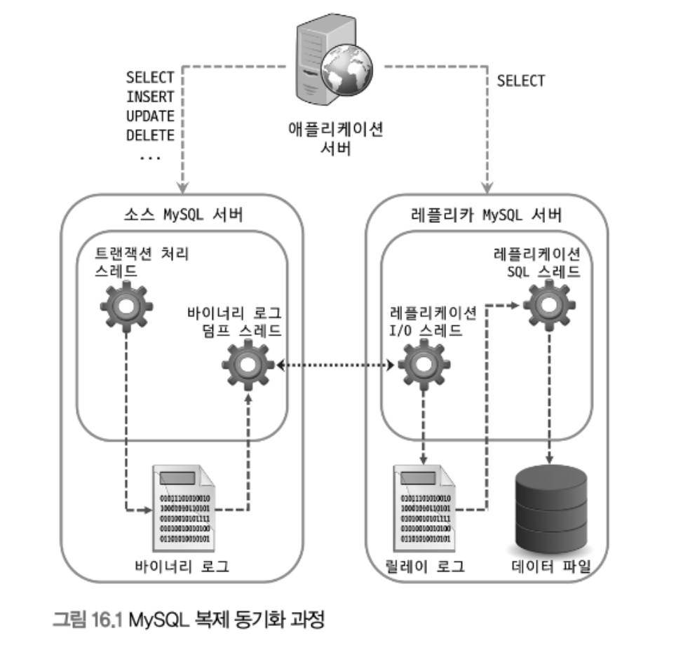

# 16장. 복제

DB를 사용하고 운영할 때 가장 중요한 2가지 요소

- 확장성 (Scalability)

- 가용성 (Availability)

이 두 요소를 위해 가장 일반적으로 사용되는 기술이 바로 복제(Replication)

## 개요

복제는 한 서버에서 다른 서버로 데이터가 동기화되는 것

소스 서버 - 원본 데이터를 가진 서버 

레플리카 서버 - 복제된 데이터를 가진 서버

 

소스 서버에서 데이터 및 스키마에 대한 변경이 최초로 발생

 

레플리카 서버에서는 이러한 변경 내역을 소스 서버로부터 전달받아 

자신이 가지고 있는 데이터에 반영함으로써 소스 서버에 저장된 데이터와 동기화

 

일반적으로 서비스에 사용될 DB 서버를 구축할 때는 메인으로 사용될 소스 서버 한 대와 레플리카 서버를 한 대 이상 함께 구축

레플리카 서버를 구축하는 목적

1. 스케일 아웃(Scale-out)

    스케일 업 - 서버의 사양을 업그레이드

    해당 방법은 Application 단에서 큰 변화 없이 늘어난 트래픽을 처리 가능

    그러나 일시적이라는 단점

    한 대에서 처리할 수 있는 양에는 한계가 있기 때문

    동일 DB를 한 대 이상 더 사용할 수 있다면 쿼리를 분산시킬 수 있을 것

    이런 방법을 Scale out

    스케일 아웃은 갑자기 늘어나는 트래픽을 대응하는 데 훨씬 더 유연한 구조

    `복제를 사용해서 DB 서버를 스케일 아웃할 수 있으며, 이를 통해 서비스를 더 안정적으로 운영 가능`

 

2. 데이터 백업

    다양한 종류의 데이터가 저장되는데, 실수로 데이터가 삭제되면 서비스 운영에 치명적인 영향을 줄 수 있음

    그래서 주기적인 백업이 필수적

    데이터가 저장되어 있는 DB 서버에서 백업 프로그램이 실행되어 백업 진행

    동일한 서버에서 백업이 실행되는 경우 백업 프로그램과 DBMS가 서버의 자원을 공유해서 사용하기 때문에 백업으로 인해 쿼리들이 영향을 받을 수 있음

    이런 문제를 방지하기 위해 복제를 사용해 레플리카 서버를 구축하고 데이터 백업은 레플리카 서버에서 실행

    이런 백업용 레플리카 서버는 소스 서버가 문제가 생겼을 때 대체 서버 역할

 

3. 데이터의 분석

    DB 서버에서는 기본적 쿼리말고도 서비스를 발전시킬 수 있는 인사이트를 얻기 위한 분석용 쿼리들을 실행하기도 함

    이런 쿼리들은 대량의 데이터를 조회하는 경우가 많고, 집계 연산을 하는 등 쿼리가 복잡하고 무거운 경우가 대부분이어서 쿼리를 실행할 때 서버의 리소스를 많이 사용하게 됨

 

4. 데이터의 지리적 분산

    서비스에서 사용되는 애플리케이션 서버와 DB 서버가 떨어져 있는 경우

    두 서버 간의 통신 시간은 떨어진 거리만큼 비례해서 늘어남

    사용자에게 빠른 응답 속도를 제공하려면 이 둘이 가깝게 위치하는 것이 좋음

    만약 어렵다면, 복제를 사용해 애플리케이션 서버가 위치한 곳에 레플리카 서버를 구축해서 응답 속도를 개선할 수 있음

 

## 복제 아키텍처

`MySQL 서버에서 발생하는 모든 변경 사항은 별도 로그 파일에 순서대로 기록되는데 이것을 Binary log라고 함`

데이터 변경 내역뿐만 아니라 데이터베이스나 테이블의 구조 변경, 계정이나 권한의 변경 정보까지 모두 포함

이런 정보들을 이벤트(Event)라고 함

소스 서버에서 생성된 바이너리 로그가 레플리카 서버로 전송되고

레플리카 서버에서 해당 로컬 디스크에 저장한 뒤 자신이 가진 데이터에 반영함으로써 서버간 동기화가 이루어짐

레플리카 서버가 소스 서버의 바이너리 로그를 읽어서 로컬 디스크에 저장해둔 파일을 릴레이 로그(Relay Log)

 

복제 동기화가 처리되는 과정

 

MySQL의 복제는 세 개의 스레드에 의해 작동하는데

이 세 스레드 중 하나는 소스 서버에 존재

나머지 2개의 스레드는 레플리카 서버에 존재

 

각 스레드의 역할

- 바이너리 로그 덤프 스레드(Binary Log Dump Thread)

    레플리카 서버는 데이터 동기화를 위해 소스 서버에 접속해 바이너리 로그 정보를 요청

    `소스 서버에서는 레플리카 서버가 연결될 떄 내부적으로 바이너리 로그 덤프 스레드를 생성해서 바이너리 로그의 내용을 레플리카 서버로 전송`

    레플리카로 보낼 각 이벤트를 읽을 때 일시적으로 바이너리 로그에 잠금을 수행하며, 이벤트를 읽고난 후에는 바로 잠금 해제

    소스 서버에서 SHOW PROCESSLIST 명령을 통해 확인 가능

 

- 레플리케이션 I/O 스레드(Replication I/O Thread)

    복제가 시작(START REPLICA 또는 START SLAVE)되면 레플리카 서버는 I/O 스레드를 생성하고, 복제가 멈추면(STOP REPLICA 또는 STOP SLAVE) I/O 스레드는 종료

    I/O 스레드는 소스 서버의 바이너리 로그 덤프 스레드로부터 바이너리 로그 이벤트를 가져와 로켈 서버의 파일(릴레이 로그)로 저장하는 역할을 담당

    `소스 서버의 바이너리 로그를 읽어서 파일로 쓰는 역할만 하기에 I/O 스레드라고 명명`

    이 스레드의 상태는 MySQL의 복제 현황을 보여주는 SHOW REPLICA STATUS(SHOW SLAVE STATUS) 명령의 결과에서 
    
    Replica_IO_Running(또는 Slave_IO_running) 칼럼에 표시된 값을 통해 확인

 

- 레플리케이션 SQL 스레드(Replication SQL Thread)

    레플리케이션 I/O 스레드가 소스 서버로부터 가져온 바이너리 로그 이벤트들을 로컬 파일로 기록하는 역할이라면

    레플리케이션 SQL 스레드는 I/O 스레드에 의해 작성된 릴레이 로그 파일의 이벤트들을 읽고 실행

    스레드의 상태는 MySQL의 복제 현황을 보여주는 SHOW REPLICA STATUS(SHOW SLAVE STATUS) 명령의 결과에서 
    
    Replica_SQL_Running(또는 Slave_SQL_running) 칼럼에 표시된 값을 통해 확인

 

레플리카 서버에서 레플리케이션 I/O 스레드와 SQL 스레드는 서로 독립적으로 동작

그러므로 만약 SQL 스레드에서 이벤트를 적용하는 게 느리더라도 I/O 스레드는 정상적으로 소스 서버로부터 이벤트를 읽어올 수 있음

레플리카 서버에 문제가 생기더라도 소스 서버는 전혀 영향을 받지 않음

하지만 소스 서버에 문제가 생기면 레플리카 서버의 I/O 스레드가 정상적으로 동작하지 않게 되면 복제는 에러를 발생시키고 바로 중단

 

복제가 시작되면 레플리카 서버는 릴레이 로그를 비롯해서 총 3가지 유형의 복제 관련 데이터를 생성하고 관리

