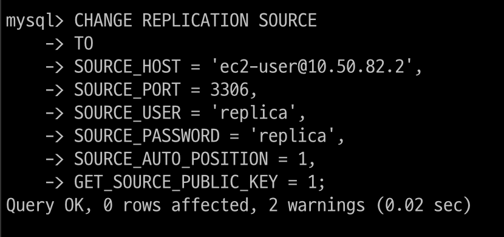
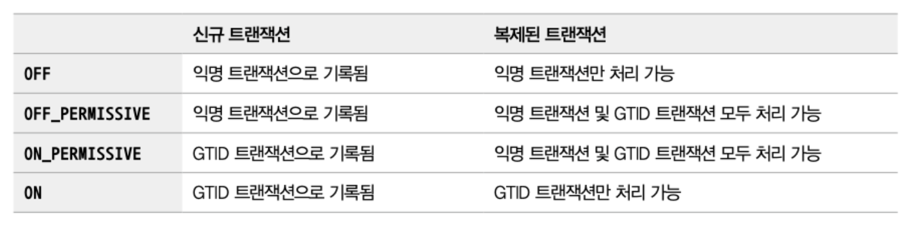

# 16장. 복제

DB를 사용하고 운영할 때 가장 중요한 2가지 요소

- 확장성 (Scalability)

- 가용성 (Availability)

이 두 요소를 위해 가장 일반적으로 사용되는 기술이 바로 복제(Replication)

## 개요

복제는 한 서버에서 다른 서버로 데이터가 동기화되는 것

소스 서버 - 원본 데이터를 가진 서버 

레플리카 서버 - 복제된 데이터를 가진 서버

<br>

소스 서버에서 데이터 및 스키마에 대한 변경이 최초로 발생

<br>

레플리카 서버에서는 이러한 변경 내역을 소스 서버로부터 전달받아 

자신이 가지고 있는 데이터에 반영함으로써 소스 서버에 저장된 데이터와 동기화

<br>

일반적으로 서비스에 사용될 DB 서버를 구축할 때는 메인으로 사용될 소스 서버 한 대와 레플리카 서버를 한 대 이상 함께 구축

레플리카 서버를 구축하는 목적

1. 스케일 아웃(Scale-out)

    스케일 업 - 서버의 사양을 업그레이드

    해당 방법은 Application 단에서 큰 변화 없이 늘어난 트래픽을 처리 가능

    그러나 일시적이라는 단점

    한 대에서 처리할 수 있는 양에는 한계가 있기 때문

    동일 DB를 한 대 이상 더 사용할 수 있다면 쿼리를 분산시킬 수 있을 것

    이런 방법을 Scale out

    스케일 아웃은 갑자기 늘어나는 트래픽을 대응하는 데 훨씬 더 유연한 구조

    `복제를 사용해서 DB 서버를 스케일 아웃할 수 있으며, 이를 통해 서비스를 더 안정적으로 운영 가능`

<br>

2. 데이터 백업

    다양한 종류의 데이터가 저장되는데, 실수로 데이터가 삭제되면 서비스 운영에 치명적인 영향을 줄 수 있음

    그래서 주기적인 백업이 필수적

    데이터가 저장되어 있는 DB 서버에서 백업 프로그램이 실행되어 백업 진행

    동일한 서버에서 백업이 실행되는 경우 백업 프로그램과 DBMS가 서버의 자원을 공유해서 사용하기 때문에 백업으로 인해 쿼리들이 영향을 받을 수 있음

    이런 문제를 방지하기 위해 복제를 사용해 레플리카 서버를 구축하고 데이터 백업은 레플리카 서버에서 실행

    이런 백업용 레플리카 서버는 소스 서버가 문제가 생겼을 때 대체 서버 역할

<br>

3. 데이터의 분석

    DB 서버에서는 기본적 쿼리말고도 서비스를 발전시킬 수 있는 인사이트를 얻기 위한 분석용 쿼리들을 실행하기도 함

    이런 쿼리들은 대량의 데이터를 조회하는 경우가 많고, 집계 연산을 하는 등 쿼리가 복잡하고 무거운 경우가 대부분이어서 쿼리를 실행할 때 서버의 리소스를 많이 사용하게 됨

<br>

4. 데이터의 지리적 분산

    서비스에서 사용되는 애플리케이션 서버와 DB 서버가 떨어져 있는 경우

    두 서버 간의 통신 시간은 떨어진 거리만큼 비례해서 늘어남

    사용자에게 빠른 응답 속도를 제공하려면 이 둘이 가깝게 위치하는 것이 좋음

    만약 어렵다면, 복제를 사용해 애플리케이션 서버가 위치한 곳에 레플리카 서버를 구축해서 응답 속도를 개선할 수 있음


<br>

## 복제 아키텍처

`MySQL 서버에서 발생하는 모든 변경 사항은 별도 로그 파일에 순서대로 기록되는데 이것을 Binary log라고 함`

데이터 변경 내역뿐만 아니라 데이터베이스나 테이블의 구조 변경, 계정이나 권한의 변경 정보까지 모두 포함

이런 정보들을 이벤트(Event)라고 함

소스 서버에서 생성된 바이너리 로그가 레플리카 서버로 전송되고

레플리카 서버에서 해당 로컬 디스크에 저장한 뒤 자신이 가진 데이터에 반영함으로써 서버간 동기화가 이루어짐

레플리카 서버가 소스 서버의 바이너리 로그를 읽어서 로컬 디스크에 저장해둔 파일을 릴레이 로그(Relay Log)

<br>

복제 동기화가 처리되는 과정

<p align="center"></p>

<br>

MySQL의 복제는 세 개의 스레드에 의해 작동하는데

이 세 스레드 중 하나는 소스 서버에 존재

나머지 2개의 스레드는 레플리카 서버에 존재

<br>

각 스레드의 역할

- 바이너리 로그 덤프 스레드(Binary Log Dump Thread)

    레플리카 서버는 데이터 동기화를 위해 소스 서버에 접속해 바이너리 로그 정보를 요청

    `소스 서버에서는 레플리카 서버가 연결될 때 내부적으로 바이너리 로그 덤프 스레드를 생성해서 바이너리 로그의 내용을 레플리카 서버로 전송`

    레플리카로 보낼 각 이벤트를 읽을 때 일시적으로 바이너리 로그에 잠금을 수행하며, 이벤트를 읽고난 후에는 바로 잠금 해제

    소스 서버에서 SHOW PROCESSLIST 명령을 통해 확인 가능

<br>

- 레플리케이션 I/O 스레드(Replication I/O Thread)

    복제가 시작(START REPLICA 또는 START SLAVE)되면 레플리카 서버는 I/O 스레드를 생성하고, 복제가 멈추면(STOP REPLICA 또는 STOP SLAVE) I/O 스레드는 종료

    I/O 스레드는 소스 서버의 바이너리 로그 덤프 스레드로부터 바이너리 로그 이벤트를 가져와 로켈 서버의 파일(릴레이 로그)로 저장하는 역할을 담당

    `소스 서버의 바이너리 로그를 읽어서 파일로 쓰는 역할만 하기에 I/O 스레드라고 명명`

    이 스레드의 상태는 MySQL의 복제 현황을 보여주는 SHOW REPLICA STATUS(SHOW SLAVE STATUS) 명령의 결과에서 
    
    Replica_IO_Running(또는 Slave_IO_running) 칼럼에 표시된 값을 통해 확인

<br>

- 레플리케이션 SQL 스레드(Replication SQL Thread)

    레플리케이션 I/O 스레드가 소스 서버로부터 가져온 바이너리 로그 이벤트들을 로컬 파일로 기록하는 역할이라면

    레플리케이션 SQL 스레드는 I/O 스레드에 의해 작성된 릴레이 로그 파일의 이벤트들을 읽고 실행

    스레드의 상태는 MySQL의 복제 현황을 보여주는 SHOW REPLICA STATUS(SHOW SLAVE STATUS) 명령의 결과에서 
    
    Replica_SQL_Running(또는 Slave_SQL_running) 칼럼에 표시된 값을 통해 확인


<br>

레플리카 서버에서 레플리케이션 I/O 스레드와 SQL 스레드는 서로 독립적으로 동작

그러므로 만약 SQL 스레드에서 이벤트를 적용하는 게 느리더라도 I/O 스레드는 정상적으로 소스 서버로부터 이벤트를 읽어올 수 있음

레플리카 서버에 문제가 생기더라도 소스 서버는 전혀 영향을 받지 않음

하지만 소스 서버에 문제가 생기면 레플리카 서버의 I/O 스레드가 정상적으로 동작하지 않게 되면 복제는 에러를 발생시키고 바로 중단

<br>

복제가 시작되면 레플리카 서버는 릴레이 로그를 비롯해서 총 3가지 유형의 복제 관련 데이터를 생성하고 관리

- 릴레이 로그(Relay Log)

    `레플리케이션 I/O 스레드에 의해 작성되는 파일로, 소스 서버의 바이너리 로그에서 읽어온 이벤트(트랜잭션) 정보가 저장`

    릴레이 로그는 바이너리 로그와 마찬가지로 현재 존재하는 릴레이 로그 파일의 목록이 담긴 인덱스 파일과 실제 이벤트 정보가 저장돼 있는 로그 파일들로 구성

    릴레이 로그에 저장된 트랜잭션 이벤트들은 레플리케이션 SQL 스레드에 의해 레플리카 서버에 적용

<br>

- 커넥션 메타데이터(Connection Metadata)

    레플리케이션 I/O 스레드에서 `소스 서버로 연결할 때 사용하는 DB 계정 정보 및 현재 읽고 있는 소스 서버의 바이너리 파일명과 파일 내 위치 값` 등이 담겨져 있으며
    
    mysql.slave_master_info 테이블에 저장

<br>

- 어플라이어 메타데이터(Applier Metadata)

    `레플리케이션 SQL 스레드에서 릴레이 로그로 저장된 소스 서버의 이벤트들을 레플리카 서버에 적용(Replay)하는 컴포넌트를 어플라이어(Applier)`라고 함

    어플라이어 메타데이터는 최근 적용된 이벤트에 대해 해당 이벤트가 저장돼 있는 릴레이 로그 파일명과 파일 내 위치 정보 등을 담고 있고
    
    레플리케이션 SQL 스레드는 이 정보들을 바탕으로 레플리카 서버에 나머지 이벤트들을 적용

    mysql.slave_relay_log_info 테이블에 저장

<br>

커넥션과 어플라이어 메타데이터는 MySQL의 시스템 변수인 master_info_repository와 relay_log_info_repository를 통해 어떤 형태로 데이터를 관리할지 설정할 수 있는데

설정 가능한 값으로는 FILE과 TABLE의 두 가지가 존재

FILE로 설정하면 커넥션 메타데이터와 어플라이어 메타데이터는 각각 MySQL의 데이터 디렉터리에서 master.info와 relay-log.info라는 파일로 관리되며

두 파일의 경로는 --master-info-file 옵션과 relay_log_info_file 시스템 변수를 이용해 사용자가 원하는 경로의 파일로 지정할 수 있음

<br>

TABLE로 설정하면 `mysql db 내 slave_master_info와 slave_relay_log_info 테이블에 각각의 데이터가 저장`

<br>

이 두 시스템 변수들은 MySQL 8.0.2 버전부터 `기본 값이 TABLE로 변경`됐으며,

FILE 타입은 향후 버전에서 제거될 예정

FILE로 설정하는 경우 레플리케이션 I/O 스레드와 SQL 스레드가 동작할 때 이 두 파일의 내용이 동기화되지 않는 경우가 빈번하게 발생

예를 들어, 레플리카 서버가 비정상 종료가 되면 실제 적용된 바이너리 로그 위치와 파일에 저장된 위치가 일치하지 않거나 파일 자체가 손상되어 복제가 재시작되지 못하는 경우가 발생하곤 했음

<br>

TABLE로 설정하면 두 정보들이 모두 InnoDB 스토리지 엔진 기반의 테이블로 관리되고

특히 `레플리케이션 SQL 스레드가 트랜잭션을 적용할 때 slave_relay_log_info 테이블의 데이터도 같은 시점에 아토믹하게 업데이트되므로 MySQL이 갑자기 종료됐다고 하더라도 다시 구동했을 때 문제없이 복제 진행 가능`

이를 크래시 세이프 복제(crash-safe replication)이라고 함

<br>

## 복제 타입

소스 서버의 바이너리 로그에 기록된 변경 내역(바이너리 로그 이벤트)들을 식별하는 방식에 따라 바이너리 로그 파일 위치 기반 복제(Binary Log File Position Based Replication)와 글로벌 트랜잭션 ID 기반 복제(Global Transaction Identifiers Based Replication)로 나뉨

<br>

### 바이너리 로그 파일 위치 기반 복제

바이너리 로그 파일 위치 기반 복제는 MySQL에 복제 기능이 처음 도입됐을 때부터 제공된 방식으로

레플리카 서버에서 소스 서버의 바이너리 로그 파일명과 파일 내에서의 위치(Offset 또는 Position)로 개별 바이너리 로그 이벤트를 식별해서 복제가 진행되는 형태를 말함

<br>

`복제를 처음 구축할 때 레플리카 서버에 소스 서버의 어떤 이벤트부터 동기화를 수행할 것인가에 대한 정보를 설정해야 함`

또한, 복제가 설정된 레플리카 서버는 소스 서버의 어느 이벤트까지 로컬 디스크로 가져왔고 또 적용했는지에 대한 정보를 관리하며, 소스 서버에 해당 정보를 전달해 그 이후의 바이너리 로그 이벤트들을 가져옴

따라서 소스 서버에서 발생한 각 이벤트에 대한 식별이 반드시 필요

<br>

`바이너리 로그 파일 위치 기반 복제에서는 이런 이벤트 하나하나를 소스 서버의 바이너리 로그 파일명과 파일 내에서의 위치 값(File Offset)의 조합으로 식별`

레플리카 서버에서는 이처럼 각 이벤트들을 식별하고 자신의 적용 내역을 추적함으로써 복제를 일시적으로 중단할 수 있으며 재개할 때도 자신이 마지막으로 적용했던 이벤트 이후의 이벤트들을 다시 읽어올 수 있음

<br>

복제에 참여한 MySQL 서버들이 모두 고유한 server_id 값을 가지고 있어야 한다는 것도 중요한 부분

바이너리 로그에는 각 이벤트별로 이 이벤트가 최초로 발생한 MySQL 서버를 식별하기 위해 server_id 값도 저장됨

server_id는 MySQL 서버의 시스템 변수 중 하나로 사용자가 MySQL 서버마다 원하는 값으로 설정할 수 있고 기본값은 1

<br>

`바이너리 로그 파일에 기록된 이벤트가 레플리카 서버에 설정된 server_id 값과 동일한 server_id 값을 가지는 경우 레플리카 서버에서는 해당 이벤트를 적용하지 않고 무시하게 됨`

자신의 서버에서 발생한 이벤트로 간주해서 적용하지 않기 때문

이러한 부분을 제대로 인지하고 사용하지 않으면 복제가 의도한 방향과는 다르게 동작할 수 있음

바이너리 로그 파일 위치 기반으로 복제를 구축할 때 이 점을 반드시 숙지해서 고유한 server_id 값을 갖도록 설정해야 함

> server_id를 바꿔야겠네?

<br>

#### 바이너리 로그 파일 위치 기반의 복제 구축

복제를 설정할 때는 각 서버에 데이터가 이미 존재하는지 여부와 복제를 어떻게 활용할 것인지 등에 따라 복제 설정 과정과 구축 방법이 달라짐

1대로 구성해서 사용하던 MySQL 서버에 새로운 레플리카 서버를 바이너리 로그 파일 위치 기반의 복제로 연결하는 과정을 살펴보자

<br>

##### 설정 준비

소스 서버에서 반드시 바이너리 로그가 활성화돼 있어야 하며,

바이너리 로그 파일 위치 기반 복제 설정을 위해서는 복제 구성원이 되는 각 서버가 고유한 server_id를 가져야 함

바이너리 로그는 기본적으로 활성화되어 있으며 데이터 디렉터리 밑에 binlog 라는 이름으로 바이너리 로그 파일이 자동으로 생성

server_id는 기본적으로 1로 설정되는데, 각각 고유한 값을 가져야 하기에 기본 값이 아닌 다른 값으로 설정하는 것이 좋음

추가적으로 필요에 따라 바이너리 로그 동기화 방식, 바이너리 로그를 캐시하기 위한 메모리 크기, 바이너리 로그 파일 크기, 보관 주기 등을 지정 가능

<p align="center"></p>

<br>

현재 사용되고 있는 바이너리 로그 파일의 이름은 "binlog.000007"이며 위치는 22449라는 것을 알 수 있음

위치는 실제 파일의 바이트 수를 의미하며 그냥 위치 값이라고 생각하면 됨

MySQL 서버가 트랜잭션을 계속 처리하고 있는 중이라면 이 값은 계속 증가할 것


<br>

레플리카 서버도 고유한 server_id만 설정해도 됨

복제를 위해 생성하는 릴레이 로그 파일도 복제 설정시 기본적으로 데이터 디렉터리 밑에 자동 생성

relay_log 시스템 변수로 파일 위치나 파일명을 따로 설정 가능

릴레이 로그에 기록된 이벤트가 적용되면 레플리카 서버가 자동으로 삭제

relay_log_purge 시스템 변수로 자동 삭제가 아닌 유지도 가능

레플리카 서버는 읽기 전용으로 read_only 설정도 함께 사용하는 편이 좋고

소스 서버 장애로 레플리카 서버가 소스 서버로 승격될 수 있음을 고려하면 log_slave_updates 시스템 변수도 명시하는 것이 좋음

복제에 의한 데이터 변경 사항은 자신의 바이너리 로그에 기록하지 않는데 log_slave_updates 시스템 변수로 기록 가능하게 변경 가능

<br>

##### 복제 계정 준비

레플리카 서버가 사용할 계정을 복제용 계정

새로운 계정을 만들 필요 없이 기존 사용 중인 계정에 복제 관련 권한을 추가로 부여해도 되지만

복제에서 사용되는 계정의 비밀번호는 커넥션 메타데이터에 평문으로 저장되므로

보안 측면을 고려해서 복제에 사용되는 권한만 주어진 별도의 계정을 생성해 사용하는 것이 좋음

<br>

복제용 계정은 복제를 시작하기 전 소스 서버에 미리 준비돼 있어야 하며 반드시 REPLICATION SLAVE 권한을 가지고 있어야 함

<p align="center"></p>

<br>

##### 데이터 복사

이제 소스 서버의 데이터를 레플리카 서버로 가져와서 적재해야 하는데

mysqldump 같은 툴을 이용해 소스 서버에서 데이터를 내려받아 레플리카 서버로 복사하면 됨

<br>

mysqldump로 소스 서버 데이터를 덤프할 때는 --single-transaction과 --master-data라는 두 옵션을 반드시 사용

`--single-transaction` 옵션은 데이터를 덤프할 때 하나의 트랜잭션을 사용해 덤프가 진행되게 해서 

mysqldump가 테이블이나 레코드에 잠금을 걸지 않고 InnoDB 테이블들에 대해 일관된 데이터를 덤프받을 수 있게 함

<br>

`--master-data` 옵션은 덤프 시작 시점의 소스를 서버의 바이너리 로그 파일명과 위치 정보를 포함하는 복제 설정 구문(CHANGE REPLICATION SOURCE TO 또는 CHANGE MASTER TO)이 덤프 파일 헤더에 기록될 수 있게 하는 옵션으로 ,복제 연결을 위해 반드시 필요한 옵션

<br>

--master-data 옵션을 사용할 때 mysqldump는 MySQL 서버에서 FLUSH TABLES WITH READ LOCK 명령을 실행해 글로벌 락을 거는데 이는 바이너리 로그의 위치(사이즈)를 순간적으로 고정시키기 위함


옵션을 1 또는 2로 설정할 수 있으며,

1로 설정되면 덤프 파일 내의 복제 설정 구문(CHANGE REPLICATION SOURCE TO 또는 CHANGE MASTER TO)이 실제 실행 가능한 형태로 기록

2로 설정되면 해당 구문이 주석으로 처리되어 참조만 할 수 있는 형태로 기록

<p align="center"></p>

파일명 앞에 주소를 넣으면 해당 주소로 저장이 되며 파일명만 적으면 현재 위치에 파일이 저장됨

<details>
<summary>각 명령어에 대한 의미</summary>

#### `--opt`

`--opt` 옵션은 다음의 여러 옵션을 결합한 것입니다. 이는 기본적으로 데이터베이스 덤프의 속도를 높이고, 백업 및 복원의 효율성을 향상시키기 위해 사용됩니다. 

`--opt`는 기본적으로 `mysqldump`에 포함되어 있습니다. `--opt`는 다음 옵션들을 포함합니다:

- `--add-drop-table`: 각 테이블 덤프 전에 `DROP TABLE` 문을 추가합니다.
- `--add-locks`: 덤프하는 동안 각 테이블에 `LOCK TABLES` 문을 추가합니다.
- `--create-options`: 테이블 생성 시 추가적인 옵션을 포함합니다.
- `--disable-keys`: 데이터가 삽입되는 동안 외래 키 검사를 비활성화합니다.
- `--extended-insert`: 여러 행을 포함하는 INSERT 문을 사용하여 덤프 파일의 크기를 줄이고, 덤프 및 로드 속도를 높입니다.
- `--quick`: `SELECT` 문을 실행할 때, 서버가 데이터를 하나씩 클라이언트로 보내도록 합니다.
- `--lock-tables`: 덤프를 생성하는 동안 테이블을 잠급니다.
- `--set-charset`: 덤프 파일에 캐릭터 세트를 설정합니다.

`--opt`를 사용하면 위의 옵션들이 모두 활성화되어 덤프 과정이 최적화됩니다.

#### `--routines`

`--routines` 옵션은 데이터베이스 내의 저장 프로시저 및 함수를 포함합니다. 이를 사용하지 않으면, 덤프 파일에 이러한 객체들이 포함되지 않습니다.

- **사용 예시**: 데이터베이스에 저장 프로시저와 함수가 많이 사용될 경우, 백업 및 복원 시 이 옵션을 사용하여 해당 객체들을 포함할 수 있습니다.

#### `--triggers`

`--triggers` 옵션은 테이블에 정의된 트리거를 포함합니다. 기본적으로 `mysqldump`는 트리거를 덤프하지 않으므로, 이 옵션을 명시적으로 지정해야 합니다.

- **사용 예시**: 데이터베이스에 트리거가 정의되어 있는 경우, 백업 및 복원 시 이 옵션을 사용하여 해당 트리거를 포함할 수 있습니다.

#### `--hex-blob`

`--hex-blob` 옵션은 BLOB 및 BINARY 데이터를 16진수 형식으로 덤프합니다. 이는 BLOB 데이터를 보다 안전하게 덤프하고 복원하기 위해 사용됩니다.

- **사용 예시**: BLOB 또는 BINARY 데이터를 포함한 테이블을 백업할 때, 이 옵션을 사용하여 데이터를 안전하게 저장할 수 있습니다. 16진수 형식은 데이터 손실 없이 BLOB 데이터를 정확히 복원하는 데 유리합니다.

#### 요약

- `--opt`: 백업 및 복원 효율성을 높이기 위해 여러 최적화 옵션을 포함합니다.
- `--routines`: 저장 프로시저 및 함수를 덤프 파일에 포함합니다.
- `--triggers`: 테이블에 정의된 트리거를 덤프 파일에 포함합니다.
- `--hex-blob`: BLOB 및 BINARY 데이터를 16진수 형식으로 덤프하여 데이터 손실을 방지합니다.

</div>
</details>

<br>

데이터 덤프가 완료되면 source_data.sql 파일을 레플리카 서버로 옮겨 데이터 적재를 진행

<details>
<summary>옮기는 법</summary>

가장 일반적인 방법은 scp (Secure Copy) 명령어를 사용하는 것

#### EC2에서 로컬
```linux
scp -i /path/to/your-ssh-key.pem ec2-user@ec2-public-ip:/path/to/source/mydatabase_dump.sql /local/path/to/destination/
```

인데 내 ip는 퍼블릭이 아닌 프라이빗이어서 데이터를 로컬로 보내기 어려움
</div>
</details>
<br>


** 데이터 적재 명령어 입력하기 **


--master-data 옵션으로 소스 서버에 FLUSH TABLES WITH READ LOCK 명령이 실행되기 전에 MySQL 서버에서 이미 장시간 동안 실행 중인 쿼리가 있다면

글로벌 락 명령어가 실행 중인 쿼리에서 참조하고 있는 테이블들에 대한 잠금을 얻을 수 없어서 완료되지 못하고 대기하게 됨

글로벌 락 명령어가 대기하고 있는 상황이라면 뒤로 유입되는 다른 쿼리들도 대기할수 있으므로

mysqldump를 실행하기 전에 장시간 실행 중인 쿼리가 있는지 미리 확인하는 것이 좋음

그리고 mysqldump를 실행한 후에도 같은 대기현상이 발생하고 있지는 않는지 한번 더 확인하는 것이 좋음

<br>

##### 복제 시작

<p align="center"></p>

<br>

소스 서버와 레플리카 서버의 데이터 상태가 어떤지, 복제를 시작하면 어떻게 동기화가 진행되는지 살펴보자

예를 들어, 10시 30분에 mysqldump를 이용해 소스 서버의 데이터를 백업받아 11시 20분 쯤에 레플리카 서버에 모두 적재

의미

-> 10시 30분까지 있었던 소스 서버의 데이터들을 백업해서 레플리카 서버로 이동시킴

<br>

소스 서버와 레플리카 서버 간의 복제를 설정해보자

복제를 설정하는 명령은 CHANGE REPLICATION SOURCE TO(or CHANGE MASTER TO) 명령으로, mysqldump로 백업 받은 파일의 헤더 부분에서 해당 명령어를 참조할 수 있음

백업받은 파일은 크기가 크기 때문에 vi 같은 텍스트 편집기 보다는 less 같은 페이지 단위 뷰어를 이용해서 파일을 열자

대략 24번째 줄에 있는 CHANGE MASTER로 시작하는 줄만 텍스트 편집기에 복사해두자


** 복제 설정 명령 ** 


<br>

SOURCE_HOST는 레플리카 서버에서 복제 연결할 소스 서버를 의미, 소스 서버의 IP 혹은 도메인 정보를 넣으면 됨

SOURCE_PORT에는 소스 서버에서 구동 중인 MySQL 서버의 포트 번호를 넣어야 함

SOURCE_USER 및 SOURCE_PASSWORD 에는 복제용 계정 정보

SOURCE_LOG_FILE,SOURCE_LOG_POS 에는 복제를 시작하고자 하는 바이너리 로그 파일명과 위치 값

GET_SOURCE_PUBLIC_KEY는 RSA 키 기반 비밀번호 교환 방식의 통신을 위해 공개 키를 소스 서버에 요청할 것인지 여부를 나타냄

<details>
<summary>RSA 키 기반 비밀번호 교환 방식</summary>

RSA 암호화를 사용하면 사용자는 공개적으로 공유할 수 있는 공개 키라는 코드로 메시지를 암호화할 수 있습니다. 

특정 RSA 알고리즘의 수학적 특성으로 인해, 사용자가 공개 키를 사용하여 메시지를 암호화하고 나면 개인 키로만 이를 복호화할 수 있습니다.

사용자는 공개 키와 개인 키를 한 쌍씩 가지고 있으며, 후자는 비밀로 유지됩니다.

</div>
</details>
<br>


복제 설정에 보안된 연결과 관련 옵션들을 명시하지 않아 레플리카와 소스 서버가 암호화되지 않는 통신 방식으로 연결되는 경우 해당 에러 발생

** 에러문 사진 **

<br>

이 명령을 그대로 레플리카 서버의 MySQL에 로그인 해서 실행한 뒤

SHOW REPLICA STATUS 명령을 실행해보면

복제 관련 정보가 레플리카 서버 MySQL에 등록돼 있는 것을 확인할 수 있음

하지만 Replica_IO_Running과 Replica_SQL_Running 칼럼 값이 No로 되어 있는데

이것은 복제 관련 정보가 등록만 된 것이지 동기화가 시작되지는 않았음을 의미

이 상태에서 START REPLICA 명령을 실행 (START REPLICA 명령이 11:45에 실행된 것)

Replica_IO_Running과 Replica_SQL_Running 칼럼 값이 Yes로 바뀌면서

레플리카 서버는 10:30 ~ 11:45까지의 데이터 변경 사항들을 소스 서버로부터 가져와 적용하게 됨

<br>

SHOW REPLICA STATUS의 Seconds_Behind_Source의 값이 0이되면 소스 서버와 레플리카 서버의 데이터가 완전히 동기화됐음을 의미
<br>

#### 바이너리 로그 파일 위치 기반의 복제에서 트랜잭션 건너뛰기

레플리카 서버에서 소스 서버로부터 넘어온 트랜잭션이 제대로 실행되지 못하고 에러가 발생해 복제가 멈추는 현상이 발생하기도

대부분은 사용자의 실수로 인해 발생

<p align="center"></p>

<br>

대표적인 에러가 중복 키 에러

심각한 문제인 경우, 레플리카 서버의 데이터를 모두 버리고 다시 구축한 뒤 복제를 재구성해야 할 수도 잇지만 문제되는 소스 서버의 트랜잭션을 무시하고 넘어가도록 처리해도 괜찮을수도

후자의 경우 sql_slave_skip_counter 시스템 변수로 문제되는 트랜잭션을 건너 뛸 수 있음

레플리카 서버에서 다음과 같이 중복된 키로 인해 INSERT 쿼리가 실패한 상태로 복제가 멈춰있다고 가정

<p align="center"></p>

<br>

해당 에러는 PK에 87이라는 값이 중복되어서 들어온 쿼리 때문에 발생

다음과 같이 복제를 중단한 후 sql_slave_skip_counter 변수의 값을 1로 지정해 레플리케이션 SQL 스레드를 재시작하면 레플리카 서버는 에러가 발생한 INSERT 쿼리를 건너뛰고 정상적으로 복제를 재개하게 됨

<p align="center"></p>

<br>

sql_slave_skip_counter 시스템 변수에는 적용하지 않고 건너뛸 바이너리 로그 이벤트 그룹 수를 지정

즉, sql_slave_skip_counter 시스템 변수가 1로 설정되면 실제로 DML 쿼리 문장 하나를 가진 바이너리 로그 이벤트 1개를 무시하는 것이 아니라 현재 이벤트를 포함한 이벤트 그룹을 무시하는 것

`이벤트 그룹은 트랜잭션을 지원하는 테이블의 경우에는 트랜잭션이 하나의 이벤트 그룹이 되며,`

`트랜잭션을 지원하지 않는 테이블에서는 DML 문장 하나하나가 이벤트 그룹이 됨`

만약 위의 예제에서 에러가 발생한 INSERT 문이 하나의 이벤트 그룹이었다면 INSERT 문 하나만 무시됐을 것이며, 

여러 DML 쿼리가 함께 포함된 이벤트 그룹이었다면 같은 이벤트 그룹에 속한 DML 쿼리들이 모두 무시됐을 것

<br>

실행되는 DML 쿼리들이 단순하게 하나의 트랜잭션에 DML 쿼리가 하나만 실행되는 형태라면 

sql_slave_skip_counter 시스템 변수에 지정한 개수가 곧 쿼리의 개수이므로

레플리카 서버에서 적용이 무시되는 쿼리의 개수를 알 수 있으며 특정 쿼리만 무시하게도 할 수 있을 것

<br>

하나의 트랜잭션에 여러 개의 DML 쿼리들이 포함되는 경우가 존재한다면 다른 쿼리들이 함께 무시될 수 있으므로 주의하자

<br>

### 글로벌 트랜잭션 아이디(GTID) 기반 복제

5.5 버전까지는 복제를 설정할 때 바이너리 로그 파일 위치 기반 복제만 가능했음

즉, 복제에서 각각의 이벤트(쿼리들)들이 바이너리 로그 파일명과 파일 내 위치 값의 조합으로 식별되는 것인데

문제는 이 같은 식별이 바이너리 로그 파일이 저장돼 있는 소스 서버에서만 유효하다는 것

<br>

동일한 이벤트가 레플리카 서버에서도 동일한 파일명의 동일한 위치에 저장된다는 보장이 없음

복제에 투입된 서버들마다 동일한 이벤트에 대해 서로 다른 식별 값을 갖게 되는 것

<br>

복제를 구성하는 서버들이 서로 호환되지 않는 정보를 이용해 복제를 진행함으로써 복제의 토폴로지를 변경하는 작업은 때로 거의 불가능할 때도 많았음

> 토폴로지 <br> 소스 서버와 복제 서버의 구성

복제 토폴로지의 변경은 주로 복제에 참여한 서버들 중 일부 서버에 장애가 발생했을 때 필요한데 토폴로지 변경이 어렵다는 것은 복제를 이용한 Failover(복구)가 어렵다는 의미

MHA나 MMM 그리고 Orchestrator같은 MySQL HA(고가용성) 솔루션들은 내부적으로 복잡한 바이너리 로그 파일 위치 계산을 수행하거나 때로는 포기해버리는 형태로 처리되기도 함

<br>

만약 소스 서버에서 발생한 각 이벤트들이 복제에 참여한 모든 MySQL 서버들에서 동일한 고유 식별 값을 가진다면 어떨까

장애가 발생해도 손쉽게 복제 토폴로지를 변경할 수 있으며, 장애 복구에 소요되는 시간도 줄 것

이처럼 소스 서버에서만 유효한 고유 식별 값이 아닌 복제에 참여한 서버들에게 고유하도록 각 이벤트에 부여된 식별값을 GTID라고 하며, 이를 기반으로 복제가 진행되는 형태를 GTID 기반 복제라고 함

<br>

#### GTID의 필요성

아마도 복제 구성이나 장애에 대한 복구 대책을 고민해본 사용자라면

바이너리 로그 파일 위치 기반 복제 방식의 문제점을 알고 있을 것

<br>

<p align="center"></p>

<br>


우리가 자주 사용하는 복제 토폴로지를 예로 들면

하나의 소스 서버에 2개의 레플리카 서버가 연결돼 있는 복제 토폴로지

주로 레플리카 서버를 읽기 부하 분산 및 통계나 배치용으로 구성할 때 많이 사용

<br>

예시 그림에서 소스 서버 A의 바이너리 로그 위치는 binary-log.000002:320이며 

레플리카 서버 B는 완전히 동기화되어 똑같이 binary-log.000002:320 바이너리 로그 이벤트까지 완전히 실행 완료된 상태

B 서버는 SELECT 쿼리 분산용으로, C 서버는 배치나 통계용으로 사용

레플리카 서버 C는 조금 지연이 발생해서 소스 서버의 binary-log.000002:120 위치까지만 복제가 동기화된 상태

<p align="center"></p>

<br>

그런데 소스 서버인 A에서 장애가 발생하면서 서버가 비정상적으로 종료됐다고 가정해보자

레플리카 서버 B와 C 중에서 하나를 소스 서버로 승격(Promotion)하고, A 서버로 연결돼 있던 클라이언트 커넥션을 새로 승격된 소스 서버로 교체하고자 할 것

A 서버로 연결돼 있던 클라이언트 커넥션을 새로 승격된 소스 서버로 교체하고자 할 것

복제는 모두 끊어지고 B 서버로 사용자 트래픽이 유입되고 있음

그러나 여전히 동기화되지 않은 상태여서 서비스에서 SELECT 용도로 사용할 수 없는 상태

B 서버가 새로운 소스 서버로 승격되면서 클라이언트의 쿼리 요청이 B 서버로 들어오기 시작하는데 

B 서버는 SELECT 쿼리의 부하 분산용이었기에 분산 SELECT 쿼리 처리와 더불어 기존 소스 서버의 역할까지 겹치면서 과부하가 될 것

그렇다면 B 서버가 처리했던 SELECT 쿼리를 C 서버로 옮겨서 실행하면 될 것

하지만 C 서버는 동기화가 되지 않은 상태에서 A 서버가 종료됐으므로 복제를 최종 시점까지 동기화할 방법이 없음

<br>

서버 B의 릴레이 로그가 지워지지 않고 남았다면

(릴레이 로그에는 소스 서버의 바이너리 로그 위치가 함께 기록돼있으므로) 

B 서버의 릴레이 로그를 가져와서 필요한 부분만 실행하면 복구가 가능

하지만 릴레이 로그는 불필요한 시점에 자동으로 삭제되기에 상당히 제한적인 방법

수동으로 직접 확인하는 방법은 간단한 문제가 아닐 뿐더러 자동화는 더 어려움

<p align="center"></p>

<br>

GTID로 복제가 되는 상황을 생각해보자

소스 서버와 서버 B는 완전히 동기화가 된 상태이며

C는 :98 GTID까지만 동기화가 된 상태

<p align="center"></p>

<br>

이 상태에서 A가 장애가 발생하면 B 서버를 C 서버의 소스 서버가 되도록 C 서버에서 

CHANGE REPLICATION SOURCE TO SOURCE_HOST='B', SOURCE_PORT=3306; 

명령을 실행하면 B 서버의 바이너리 로그 파일 명이 무엇인지 어느 위치부터 이벤트를 가져와야 하는지 입력할 필요 X

GTID의 뒤의 숫자만 다르고 모두 같기에 :98 이후의 바이너리 로그 이벤트를 가져와서 동기화하면 되기에 편함

<br>

트랜잭션의 ID를 글로벌하게 확장함에 따라 토폴로지 변경 시 동기화에 대한 문제가 간단하게 해결되었음

레플리카 확장, 축소, 통합과 같은 과정에서도 사용하면 문제를 해결할 수 있을 것

<br>

#### 글로벌 트랜잭션 아이디

GTID는 논리적인 의미로 물리적인 파일의 이름이나 위치와는 무관하게 생성됨

mySQL의 GTID는 서버에서 커밋된 각 트랜잭션과 연결된 고유 식별자로 해당 트랜잭션이 발생한 서버에서 고유할 뿐 아니라 그 서버에 속한 복제 토폴로지 내 모든 서버에서 고유함

커밋되어서 바이너리 로그에 기록된 트랜잭션에 한해서만 할당

단순 SELECT 쿼리나 sql_log_bin 설정이 비활성화되어 있는 상태에서 발생한 트랜잭션은 기록되지 않으므로 GTID가 할당되지 않음

<br>

소스 아이디와 트랜잭션 아이디 값의 조합으로 생성되는데 두 값은 :(콜론 문자)로 구분되어 표시

GTID = [source_id]:[transaction_id]

소스 아이디는 소스 서버를 식별하기 위한 값으로 MySQL 서버의 server_uuid 시스템 변수 값을 사용

트랜잭션 아이디는 서버에서 커밋된 트랜잭션 순서대로 부여되는 값으로 1부터 1씩 단조 증가하는 형태로 발급

<br>

server_uuid는 사용자가 별도로 설정하는 것이 아니라 MySQL 서버가 시작되면서 자동으로 부여되며 데이터 디렉터리에 auto.cnf라는 파일이 생성되는데 그 안에 server_uuid 값이 저장돼 있음

<p align="center"></p>

<br>

auto.cnf 파일은 삭제되더라도 서버를 재시작할 때 자동으로 다시 생성되며 이미 생성돼 있는 auto.cnf 파일을 가져다가 사용할 수도 있음

> Xtrabackup을 이용해서 백업해둔 소스 서버의 데이터 파일을 새로운 레플리카 서버 구축에 그대로 사용한다면 실수로 auto.cnf 파일까지 사용할 수 있음 <br><br> 이 경우 복제를 멈추고 MySQL을 종료한 뒤 auto.cnf 파일을 삭제한 후 다시 MySQL을 시작하면 새로운 UUID 값이 생성되므로 복제 재개 시 문제없이 다시 연결 가능

> auto.cnf는 리눅스에서 /var/lib/mysql 에 위치하고 있음


<br>

현재 사용되고 있는 GTID 값을 확인하려면 mysql DB 내의 gtid_executed 테이블을 조회하거나 gtid_executed 시스템 변수를 통해 확인 가능 

<details>
<summary>gtid_executed 삽질 과정</summary>

<p align="center"></p>

왜 gtid_executed 안나오지..?

<p align="center"></p>

gtid_mode가 꺼져 있었음

<p align="center"></p>

<p align="center"></p>

default가 OFF였음

<p align="center"></p>

성공!

</div>
</details>
<br>

<p align="center"></p>

<p align="center"></p>

<p align="center"></p>

<p align="center"></p>

<p align="center"></p>

<br>

하나 이상의 GTID 값으로 구성돼 있는 것을 GTID 셋이라고 하며 동일한 서버에서 생성된 연속하는 GITD 값은 축소시켜 범위로 보여지며

범위 값과 단일 값이 하나의 표현식으로 나타날 수도 있음

또한 서로 다른 UUID를 가지는 GTID 값들도 포함될 수 있는데, 기존과 달느 값으로 변경됐거나 여러 서버에서 데이터를 복제해오는 경우에 해당

<br>

앞서 언급했던 mysql.gtid_executed 테이블은 단순히 현재 실행된 GTID 값을 저장하는 것 이외에 내부적으로 중요한 역할을 하는데 

레플리카 서버에서 바이너리 로그가 비활성화돼 있는 상태에서 GTID 기반 복제를 사용할 수 있게 하고 

바이너리 로그가 손실되는 상황에서도 GTID 값은 보존될 수 있게 함

<br>

mysql.gtid_executed 테이블은 InnoDB 스토리지 엔진으로 설정

8.0.17 이상 버전을 사용할 경우(현재 아마존 리눅스의 경우 8.0.37 ver) 매 트랜잭션이 커밋될 때마다 

mysql.gtid_executed 테이블에도 GTID 값이 바로 저장

8.0.17 미만이거나 InnoDB가 아닌 스토리지 엔진을 사용하는 경우 GTID 값은 바이너리 로그 파일이 로테이션되거나 MySQL 서버가 종료될 때만 mysql.gtid_executed 테이블에 저장

<br>

<p align="center"></p>

<br>

mysql.gtid_executed 테이블에는 실행된 모든 트랜잭션들에 대해 GTID 값이 저장되므로 시간이 지남에 따라 많은 데이터가 쌓일 수 있음

그동안 실행됐던 GTID들은 보존할 필요가 없기도 하고 불필요한 디스크 공간을 차지하므로 주기적으로 mysql.gtid_executed 테이블에 쌓여있는 전체 데이터를 하나의 데이터로 압축

여기서 압축은 interval_start와 interval_end를 연속된 것끼리 모아서 1건으로 만드는 것을 의미

<br>

mysql.gtid_executed 테이블에 대한 압축은 바이너리 로그 활성화 여부에 따라 압축을 수행하는 조건이 달라지는데

바이너리 로그가 활성화돼 있는 경우 바이너리 로그 파일이 로테이션 될 때 자동으로 압축이 수행

<details>
<summary>바이너리 로그 파일 로테이션</summary>

<p align="center"></p>

<p align="center"></p>

바이너리 로그 파일 로테이션은 max_binlog에 설정된 값에 도달하거나 서버가 재시작되거나 FLUSH 될 떄 

새로운 로그 파일이 생성되는 것과는 다르지만 binlog_expire_logs_seconds 시스템 변수로 설정된 초가 지나면 삭제되는 것도 있었음 기본 설정은 30일

</div>
</details>
<br>

바이너리 로그가 활성화되어 있지 않은 경우 thread/sql/compress_gtid_table이라는 별도의 포그라운드 스레드에 의해 수행되는데

 MySQL 서버에서 실행된 트랜잭션 수가 gtid_executed_compression_period 시스템 변수에 수까지 도달하면 스레드에서 압축을 수행하고 슬립 모드로 돌아감

 <p align="center"></p>

<br>

기본 값은 0이며 0으로 설정되면 계속 슬립 모드 상태를 유지하고 압축을 수행하지 않으며 필요에 따라 자동으로 실행

<br>

#### 글로벌 트랜잭션 아이디 기반의 복제 구축

GTID를 활성하는 것과 GTID 기반의 복제를 사용하는 것은 별개이며

GTID 활성화는 GTID 복제를 위한 하나의 조건

<br>

GTID는 활성화되어 있더라도 복제는 바이너리 로그 파일 위치 기반 복제를 사용할 수 있음

그래서 소스 서버에 GTID가 활성화가 안되어 있다면 활성화해서 GTID 기반 복제를 적용할 수 있음

<br>

##### 설정 준비

복제에 참여하는 모든 서버들이 gtid가 활성화돼 있어야 하며 각 서버의 server_id 및 server_uuid가 복제 그룹내에서 고유해야 함

<p align="center"></p>

<p align="center"></p>

<br>

<details>
<summary>각 설정의 의미</summary>

이미지에서 제공된 `my.cnf` 설정 파일 내용은 MySQL에서 GTID(Global Transaction ID) 기반 복제를 구성하기 위한 슬레이브(레플리카) 서버 설정입니다. 각각의 설정 항목이 어떤 의미를 갖는지 설명해 드리겠습니다.

```ini
gtid_mode=ON
enforce_gtid_consistency=ON
server_id=2222
relay_log=/var/lib/mysql/relay_log
relay_log_purge=ON
read_only
log_slave_updates
```

### 설정 항목 설명

1. **`gtid_mode=ON`**:
   - **설명**: GTID 기반 복제를 활성화합니다. 이 설정을 통해 MySQL은 각 트랜잭션에 고유한 GTID를 부여하고, 이를 사용하여 복제를 관리합니다.
   - **필요성**: GTID 기반 복제는 더 간편한 복제 설정, 자동 페일오버, 일관된 트랜잭션 관리 등을 가능하게 합니다.

2. **`enforce_gtid_consistency=ON`**:
   - **설명**: GTID 일관성을 강제합니다. 이는 GTID 기반 복제에서 안전하지 않은 트랜잭션이 실행되지 않도록 합니다.
   - **필요성**: GTID 일관성을 보장하여 데이터의 무결성을 유지하고, GTID 복제 환경에서 일관성을 유지할 수 있습니다.

3. **`server_id=2222`**:
   - **설명**: 이 서버에 고유한 ID를 할당합니다. 복제 환경에서 각 서버는 고유한 `server_id`를 가져야 합니다.
   - **필요성**: `server_id`는 복제 환경에서 마스터와 슬레이브 서버를 구분하고, 복제 로그에서 트랜잭션의 출처를 식별하는 데 사용됩니다.

4. **`relay_log=/var/lib/mysql/relay_log`**:
   - **설명**: 슬레이브 서버에서 릴레이 로그 파일의 경로를 지정합니다. 릴레이 로그는 슬레이브 서버가 마스터 서버로부터 받은 바이너리 로그를 저장하는 파일입니다.
   - **필요성**: 릴레이 로그 파일 경로를 지정함으로써, 복제된 데이터가 저장되는 위치를 명확히 합니다.

5. **`relay_log_purge=ON`**:
   - **설명**: 사용되지 않는 릴레이 로그 파일을 자동으로 삭제합니다.
   - **필요성**: 오래된 릴레이 로그 파일이 디스크 공간을 차지하지 않도록 관리하여 저장 공간을 절약하고 성능을 유지합니다.

6. **`read_only`**:
   - **설명**: 서버를 읽기 전용 모드로 설정합니다. 슬레이브 서버는 데이터를 수정하지 않고 읽기만 할 수 있습니다.
   - **필요성**: 슬레이브 서버에서 데이터 수정이 발생하지 않도록 보장하여 데이터 일관성을 유지합니다. 관리자 계정은 예외적으로 쓰기 권한을 가질 수 있습니다.

7. **`log_slave_updates`**:
   - **설명**: 슬레이브 서버에서 받은 업데이트를 자체 바이너리 로그에 기록합니다.
   - **필요성**: 슬레이브 서버가 다른 슬레이브 서버의 마스터로 작동할 때 필요합니다. 이는 체인 복제(다중 슬레이브 복제) 설정에 유용합니다.

### 요약

- **GTID 모드와 일관성**: `gtid_mode=ON`, `enforce_gtid_consistency=ON` 설정을 통해 GTID 기반 복제를 활성화하고 일관성을 유지합니다.
- **서버 식별**: `server_id=2222`는 복제 환경에서 서버를 고유하게 식별합니다.
- **릴레이 로그 관리**: `relay_log`와 `relay_log_purge=ON`을 통해 릴레이 로그 파일의 경로를 설정하고, 자동 삭제를 관리합니다.
- **읽기 전용 모드**: `read_only` 설정을 통해 슬레이브 서버를 읽기 전용으로 설정하여 데이터 일관성을 유지합니다.
- **슬레이브 업데이트 로깅**: `log_slave_updates`를 통해 슬레이브 서버의 업데이트를 자체 바이너리 로그에 기록하여 체인 복제를 지원합니다.

이 설정들을 통해 슬레이브 서버가 효율적이고 일관된 복제 환경을 유지할 수 있습니다.

</div>
</details>
<br>

<p align="center"></p>

<br>

enforce_gtid_consistency=ON 가 명시되지 않으면 해당 에러 발생

enforce_gtid_consistency=ON 설정은 GTID 기반 복제에서 안전하지 않은 트랜잭션이 실행되지 않도록 하는 시스템 변수

```markdown
참고

DBA가 사용하는 대부분의 DB 관리자 계정은 모든 권한이 할당된 경우가 많으며 때문에 CONNECTION_ADMIN 권한(기존의 SUPER)도 계정에 부여돼 있을 가능성이 높음

해당 권한 계정은 read_only더라도 DDL, DML이 가능

그런데 실수로 복제 환경에서 DDL, DML을 실행하면 레플리카 서버 server_uuid로 구성된 새로운 GTID 셋이 추가되서 소스 서버와 레플리카 서버간의 GTID 셋이 달라져 역할을 스위치할 때 문제가 발생할 것

그래서 read_only 이외의 super_read_only 옵션도 넣자

```

<br>

##### 복제 계정 준비

<p align="center"></p>

<br>

<br>


##### 데이터 복사

<p align="center"></p>

<br>

MySQL 서버는 GTID 복제와 관련해서 대표적으로 2개의 시스템 변수를 가짐

GTID가 활성화된 소스 서버에서 mysqldump로 데이터를 덤프받아 레플리카 서버를 구축하려는 경우

덤프가 시작된 시점의 소스 서버 GTID 값을 레플리카 서버에서 다음 2개의 시스템 변수에 설정해야 복제를 시작할 수 있음

- gtid_excuted

    MySQL 서버에서 실행되어 바이너리 로그 파일에 기록된 모든 트랜잭션들의 GTID 셋

- gtid_purged

    현재 MySQL 서버의 바이너리 로그 파일에 존재하지 않는 모든 트랜잭션들의 GTID 셋

GTID 기반 복제에서 레플리카 서버는 gtid_executed 값을 기반으로 다음 복제 이벤트를 소스 서버로부터 가져옴

gtid_executed는 읽기 전용 변수로 사용자가 변경할 수 없으며, 사용자는 gtid_purged 변수 값만 수정할 수 있음

MySQL을 설치하고 처음 구동시키면 위 두 값은 비어있는데, 이 때 사용자가 gtid_purged에 값을 설정하면

gtid_executed에도 자동으로 동일한 값이 설정

<br>

따라서 복제를 시작하기 위해서는 소스 서버에서 데이터 덤프가 시작된 시점의 소스 서버의 GTID 값을 

레플리카 서버의 gtid_purged 시스템 변수에 지정해 gtid_executed 시스템 변수에도 그 값이 설정되게 해야 함

<br>

이를 위해 mysqldump에서는 --set-gtid-purged 옵션을 제공하며 이 옵션이 활성화되면 덤프가 시작된 시점의 GTID가 덤프 파일에 기록

또한 `sql_log_bin 시스템 변수를 비활성화하는 구문`도 함께 기록되는데 

`덤프 파일을 실행할 때 적용되는 트랜잭션들이 레플리카 서버에서 새로운 GTID를 발급받는 것을 방지`

`즉, 레플리카 서버에서 덤프 파일을 적재하는 작업이 바이너리 로그에 기록되지 않으므로 GTID가 생성되지 않는 것`

<br>

--set-gtid-purged 옵션에 넣을 수 있는 값들

명시적으로 해당 옵션을 적지 않더라도 AUTO로 설정되어 동작

<p align="center"></p>

<br>

위의 mysqldump 명령에 주어진 --set-gtid-purged=ON 옵션으로 인해 덤프된 파일의 최상단에는 이런 내용이 기록됨

만약 레플리카 서버 구축을 위해서가 아니라 단순히 다른 DB 서버로의 데이터 마이그레이션을 위해 

mysqldump를 사용하는 경우에는 mysqldump 실행시 --set-gtid-purged = OFF 옵션을 명시하여

sql_log_bin 시스템 변수를 비활성화하는 구문이 덤프 파일에 기록되지 않도록 해야 함

그렇지 않으면 데이터를 마이그레이션(이사)할 DB 서버에서 덤프 파일 적용시 적재한 데이터가 바이너리 로그에 기록되지 않아 해당 DB 서버와 연결된 레플리카 서버에 데이터가 복제되지 않을 수 있기 때문

<br>

<p align="center"></p>

<br>

—set-gtid-purged = ON 옵션을 했을 때 SQL_LOG_BIN은 0

PURGED 명령에서 +는 현재 설정돼 있는 값에 새로운 값을 덧붙이는 것을 의미

mysqldump로 백업받은 데이터 파일을 레플리카 서버로 옮겨 적재하면 레플리카 서버에서 gtid_executed와 gtid_purged 시스템 변수 값이 다음과 같이 자동으로 설정

<details>
<summary>소스 서버에서 레플리카 서버로 데이터 복사 방법</summary>

<p align="center"></p>

해당 코드는 허가 거부

<p align="center"></p>

/etc/ssh/sshd_config 파일에서 PasswordAuthentication no를 yes로 변경

<p align="center"></p>

그런데 나는 private key로 접속한 것이어서 초기 비밀번호를 설정하지 않았음

<p align="center"></p>

root 계정 비밀번호를 설정 root로

<p align="center"></p>

내가 접속한 ec2-user 계정의 비밀번호도 설정 0000으로

<p align="center"></p>

복사 성공!

</div>
</details>
<br>

<p align="center"></p>

<p align="center"></p>

<br>

최초 gtid_executed, gtid_purged가 비어있다가 적재 후 자동으로 설정된 것을 확인 가능

<br>

<p align="center"></p>

<br>

소스 서버에서 XtraBackup 툴을 사용해 데이터를 백업받아서 레플리카 서버에 복구하는 경우 데이터 디렉터리에 xtrabackup_binlog_info라는 파일이 생성

이 파일에는 다음과 같이 백업이 완료된 시점의 바이너리 로그 파일명과 위치, GTID 값이 함께 기록되어 있음

XtraBackup이나 MySQL 엔터프라이즈 백업 도구를 이용해 백업하거나 복구할 때는 mysql.gtid_executed 테이블과 데이터까지 복구됨

백업 복구가 완료되어 MySQL 서버가 시작되면 자동으로 mysql.gtid_executed 테이블의 GTID 값을 바탕으로 gtid_executed와 gtid_purged 시스템 변수를 초기화함

mysql.gtid_executed 테이블의 GTID 값은 xtrabackup_binlog_info 파일에 표시되는 값과 동일한 GTID 값을 가짐

<br>

##### 복제 시작

레플리카 서버의 초기 데이터는 모두 준비 완료

`레플리카 서버에 복구된 데이터는 소스 서버에서 백업을 실행했던 과거 시점의 데이터이며, 백업 시점 이후에 새롭게 변경되는 데이터는 레플리카 서버에 적용돼 있지 않은 상태이고, 실시간으로 변경되는 데이터도 레플리카 서버로 복제되지 않음`

<p align="center"></p>

<br>

해당 명령을 실행하면 레플리카 서버는 소스 서버에서 백업 시점부터 지금까지 변경된 데이터와 이후 변경될 데이터를 실시간으로 가져와서 적용

SOURCE_AUTO_POSITION 옵션은 레플리카 서버가 자신의 gtid_executed 값을 참조해 해당 시점부터 소스 서버와 복제를 연결해서 데이터를 동기화

<p align="center"></p>

<br>

#### 글로벌 트랜잭션 아이디 기반 복제에서 트랜잭션 건너뛰기

<p align="center"></p>

<br>


<p align="center"></p>

<br>

재시작안해서 server id가 같은 상황이었는데 그걸 모르고 소스 서버에서 2개의 트랜잭션 실행

그 후 확인해보니 server_id 변경이 적용이 안돼서(재시작을 안해서) 동기화가 안되고 있는 상태

그래서 소스 서버에서 해당 테이블의 내용을 삭제하는 쿼리를 사용하였는데

레플리카 서버의 에러 로그를 보니 해당 레코드를 찾을수가 없는데 삭제하는 이벤트가 일어났다라는 오류를 보여줌

<p align="center"></p>

<br>

복제 중단 → gtid_next 기본 값 확인 → 오류나는 트랜잭션을 빈 트랜잭션으로 만들어서 바이너리 로그 스트림에 밀어넣음 → 복제 시작

이와 같은 방법으로 7,8 트랜잭션을 해결

<p align="center"></p>

<br>

<p align="center"></p>

<br>

여기에서 Retrieved_Gtid_Set은 복제를 통해 소스 서버로부터 가져온 GTID 셋이고

실행한 GTID 셋(Executed Gtid Set)은 1~9로 표시

즉, 1~6 GTID set은 백업받은 파일을 복구하면서 적용된 것

#### Non-GTID 기반 복제에서 GTID 기반 복제로 온라인 변경

8.0 버전에서는 서비스가 현재 동작하고 있는 상태에서 MySQL 서버가 GTID를 사용하도록 or 사용하지 않도록 GTID 모드를 온라인으로 전환할 수 있는 기능을 제공

5.7.6 버전부터 온라인 전환이 가능해졌는데 그 이전 버전에서는 반드시 소스 서버와 레플리카 서버에서 MySQL을 재시작해야만 GTID 모드를 활성화하거나 비활성화할 수 있었음

<br>

GTID 모드 전환 작업은 두 시스템 변수만 순차적으로 변경하면 됨

- enforce_gtid_consistency

- gtid_mode

enforce_gtid_consistency는 GTID 기반의 복제에서 소스 서버와 레플리카 서버 간의 데이터 일관성을 해칠 수 있는 쿼리들이 MySQL 서버에서 실행되는 것을 허용할지를 제어하는 변수

<br>

GTID를 사용하는 복제 환경에서는 이런 쿼리들은 안전하지 않음

- 트랜잭션을 지원하는 테이블과 지원하지 않는 테이블을 함께 변경하는 쿼리 or 트랜잭션

- CREATE TABLE ... SELECT ... 구문

- 트랜잭션 내에서 CREATE TEMPORARY TABLE, DROP TEMPORARY TABLE 구문 사용

<br>

소스 서버에서 레플리카 서버로 복제되어 적용될 때 단일 트랜잭션으로 처리되지 않을 수도 있다는 점이 공통점

이러한 점이 문제가 되는 이유는 GTID가 트랜잭션 단위로 올바르게 할당되어야 복제가 정상적으로 동작하기 때문

<br>

만약 소스 서버에서 단일 트랜잭션으로 처리된 쿼리들이 바이너리 로그에 기록되고 레플리카 서버로 복제되는 과정에서 

하나의 트랜잭션이 아닌 개별적인 이벤트로 분류되고 각각에 대해 GTID가 할당되면 레플리카 서버에서 해당 트랜잭션이 원자적으로 처리되지 못할 수도 있음

이 같은 가능성으로 인해 GTID 기반 복제에서는 위 같은 패턴들이 문제가 될 수 있으며, 

사용자는 enforce_gtid_consistency 설정을 통해 이러한 쿼리들의 실행 가능 여부를 제어할 수 있음

```
8.0에서는 GTID를 사용하는 복제 환경에서 안전하지 않았던 일부 쿼리들이 안전하게 처리되도록 개선

8.0.13 버전부터는 바이너리 로그 포맷이 ROW 또는 MIXED로 설정된 경우 트랜잭션 내에서 CREATE TEMPORARY TABLE 및 DROP TEMPORARY TABLE 구문을 사용할 수 있음

8.0.21 버전부터는 Atomic DDL 기능을 지원하는 InnoDB 스토리지 엔진 테이블에 한해 CREATE TABLE ... SELECT 구문을 사용할 수 있게 되었음
```

<br>

enforce_gtid_consistency에 지정할 수 있는 값의 내용

<p align="center"></p>

<br>

GTID가 활성화된 경우에는 반드시 ON으로 설정

<br>

gtid_mode를 살펴보자면

`gtid_mode는 바이너리 로그에 트랜잭션들이 GTID 기반으로 로깅될 수 있는지 여부와 트랜잭션 유형별로 MySQL 서버에서의 처리 가능 여부를 제어`

바이너리 로그에 기록되는 트랜잭션 유형에는 익명(Anonymous) 트랜잭션과 GTID 트랜잭션이 있는데,

익명 트랜잭션은 GTID가 부여되지 않은 트랜잭션으로 바이너리 로그 파일명과 위치로 식별되며,

GTID 트랜잭션은 고유한 식별값인 GTID가 부여된 트랜잭션을 지칭

<br>

gtid_mode에 지정할 수 있는 값의 내용

<p align="center"></p>

<br>

gtid_mode는 위 표에 적혀진 값 순서를 기준으로 한 번에 한 단계씩만 변경 가능

복제 그룹 내에서 소스 서버와 레플리카 서버의 gtid_mode를 변경하는 경우

최초에는 소스 서버와 레플리카 서버가 동일한 gtid_mode 값을 가지고 있더라도

변경 작업을 진행할 때 기존 설정 값으로 동작하는 서버와 새로운 설정 값으로 동작하는 서버가 동시점으로 존재할 수 있음

<p align="center"></p>

<br>

복제 그룹 내 MySQL 서버들의 GTID 모드를 변경하는 과정을 살펴보자

먼저 Non-GTID 기반으로 복제가 구성돼 있는 소스 서버와 레플리카 서버가 있고

이 서버들의 GTID를 활성화한 뒤 GTID 기반의 복제를 변경한다고 가정해보자

두 서버는 5.7.6 이상의 버전을 사용하고 있음

전환 작업은 다음과 같은 순서로 진행

1. 각 서버에서 enforce_gtid_consistency를 WARN으로 변경

<p align="center"></p>

<br>

2. 각 서버에서 enforce_gtid_consistency 시스템 변수 값을 ON으로 변경

<p align="center"></p>

<br>

3. 각 서버에서 gtid_mode 시스템 변수 값을 OFF_PERMISSIVE로 변경

<p align="center"></p>

<br>

4. 각 서버에서 gtid_mode 시스템 변수 값을 ON_PERMISSIVE로 변경

<p align="center"></p>

<br>


5. 잔여 익명 트랜잭션 확인

<p align="center"></p>

<br>

6. 각 서버에서 gtid_mode 시스템 변수 값을 ON으로 변경

```SQL
mysql> SET GLOBAL gtid_mode = ON;
```

7. my.cnf 파일 변경

<p align="center"></p>

<br>

8. GTID 기반 복제를 사용하도록 복제 설정을 변경

<p align="center"></p>

<br>

GTID를 비활성화하는 작업은 위에서 순차적으로 진행한 작업들을 다시 역순으로

<br>

#### GTID 기반 복제 제약 사항

- GTID가 활성화된 MySQL 서버에서는 enforce_gtid_consistency=ON 옵션으로 인해 GITD 일관성을 해칠 수 있는 일부 유형의 쿼리들은 실행할 수 없음

- GTID 기반 복제가 설정된 레플리카 서버에서는 sql_slave_skip_counter 시스템 변수를 사용해 복제된 트랜잭션을 건너뛸 수 없음

- GTID 기반 복제에서 CHANGE REPLICATION SOURCE TO 구문의 IGNORE_SERVER_IDS 옵션은 더 이상 사용되지 않음 

    해당 옵션은 순환 복제 구조에서 한 서버가 장애로 인해 복제 토폴리지에서 제외됐을 때 장애 서버에서 발생한 이벤트가 중복으로 적용되지 않게 할 때 유용하게 사용할 수 있는데

    GTID는 이미 적용된 트랜잭션을 식별할 수 있고 자동으로 무시하므로 해당 옵션이 필요하지 않음


