# 16장. 복제

DB를 사용하고 운영할 때 가장 중요한 2가지 요소

- 확장성 (Scalability)

- 가용성 (Availability)

이 두 요소를 위해 가장 일반적으로 사용되는 기술이 바로 복제(Replication)

## 개요

복제는 한 서버에서 다른 서버로 데이터가 동기화되는 것

소스 서버 - 원본 데이터를 가진 서버 

레플리카 서버 - 복제된 데이터를 가진 서버

<br>

소스 서버에서 데이터 및 스키마에 대한 변경이 최초로 발생

<br>

레플리카 서버에서는 이러한 변경 내역을 소스 서버로부터 전달받아 

자신이 가지고 있는 데이터에 반영함으로써 소스 서버에 저장된 데이터와 동기화

<br>

일반적으로 서비스에 사용될 DB 서버를 구축할 때는 메인으로 사용될 소스 서버 한 대와 레플리카 서버를 한 대 이상 함께 구축

레플리카 서버를 구축하는 목적

1. 스케일 아웃(Scale-out)

    스케일 업 - 서버의 사양을 업그레이드

    해당 방법은 Application 단에서 큰 변화 없이 늘어난 트래픽을 처리 가능

    그러나 일시적이라는 단점

    한 대에서 처리할 수 있는 양에는 한계가 있기 때문

    동일 DB를 한 대 이상 더 사용할 수 있다면 쿼리를 분산시킬 수 있을 것

    이런 방법을 Scale out

    스케일 아웃은 갑자기 늘어나는 트래픽을 대응하는 데 훨씬 더 유연한 구조

    `복제를 사용해서 DB 서버를 스케일 아웃할 수 있으며, 이를 통해 서비스를 더 안정적으로 운영 가능`

<br>

2. 데이터 백업

    다양한 종류의 데이터가 저장되는데, 실수로 데이터가 삭제되면 서비스 운영에 치명적인 영향을 줄 수 있음

    그래서 주기적인 백업이 필수적

    데이터가 저장되어 있는 DB 서버에서 백업 프로그램이 실행되어 백업 진행

    동일한 서버에서 백업이 실행되는 경우 백업 프로그램과 DBMS가 서버의 자원을 공유해서 사용하기 때문에 백업으로 인해 쿼리들이 영향을 받을 수 있음

    이런 문제를 방지하기 위해 복제를 사용해 레플리카 서버를 구축하고 데이터 백업은 레플리카 서버에서 실행

    이런 백업용 레플리카 서버는 소스 서버가 문제가 생겼을 때 대체 서버 역할

<br>

3. 데이터의 분석

    DB 서버에서는 기본적 쿼리말고도 서비스를 발전시킬 수 있는 인사이트를 얻기 위한 분석용 쿼리들을 실행하기도 함

    이런 쿼리들은 대량의 데이터를 조회하는 경우가 많고, 집계 연산을 하는 등 쿼리가 복잡하고 무거운 경우가 대부분이어서 쿼리를 실행할 때 서버의 리소스를 많이 사용하게 됨

<br>

4. 데이터의 지리적 분산

    서비스에서 사용되는 애플리케이션 서버와 DB 서버가 떨어져 있는 경우

    두 서버 간의 통신 시간은 떨어진 거리만큼 비례해서 늘어남

    사용자에게 빠른 응답 속도를 제공하려면 이 둘이 가깝게 위치하는 것이 좋음

    만약 어렵다면, 복제를 사용해 애플리케이션 서버가 위치한 곳에 레플리카 서버를 구축해서 응답 속도를 개선할 수 있음


<br>

## 복제 아키텍처

`MySQL 서버에서 발생하는 모든 변경 사항은 별도 로그 파일에 순서대로 기록되는데 이것을 Binary log라고 함`

데이터 변경 내역뿐만 아니라 데이터베이스나 테이블의 구조 변경, 계정이나 권한의 변경 정보까지 모두 포함

이런 정보들을 이벤트(Event)라고 함

소스 서버에서 생성된 바이너리 로그가 레플리카 서버로 전송되고

레플리카 서버에서 해당 로컬 디스크에 저장한 뒤 자신이 가진 데이터에 반영함으로써 서버간 동기화가 이루어짐

레플리카 서버가 소스 서버의 바이너리 로그를 읽어서 로컬 디스크에 저장해둔 파일을 릴레이 로그(Relay Log)

<br>

복제 동기화가 처리되는 과정

<p align="center"></p>

<br>

MySQL의 복제는 세 개의 스레드에 의해 작동하는데

이 세 스레드 중 하나는 소스 서버에 존재

나머지 2개의 스레드는 레플리카 서버에 존재

<br>

각 스레드의 역할

- 바이너리 로그 덤프 스레드(Binary Log Dump Thread)

    레플리카 서버는 데이터 동기화를 위해 소스 서버에 접속해 바이너리 로그 정보를 요청

    `소스 서버에서는 레플리카 서버가 연결될 때 내부적으로 바이너리 로그 덤프 스레드를 생성해서 바이너리 로그의 내용을 레플리카 서버로 전송`

    레플리카로 보낼 각 이벤트를 읽을 때 일시적으로 바이너리 로그에 잠금을 수행하며, 이벤트를 읽고난 후에는 바로 잠금 해제

    소스 서버에서 SHOW PROCESSLIST 명령을 통해 확인 가능

<br>

- 레플리케이션 I/O 스레드(Replication I/O Thread)

    복제가 시작(START REPLICA 또는 START SLAVE)되면 레플리카 서버는 I/O 스레드를 생성하고, 복제가 멈추면(STOP REPLICA 또는 STOP SLAVE) I/O 스레드는 종료

    I/O 스레드는 소스 서버의 바이너리 로그 덤프 스레드로부터 바이너리 로그 이벤트를 가져와 로켈 서버의 파일(릴레이 로그)로 저장하는 역할을 담당

    `소스 서버의 바이너리 로그를 읽어서 파일로 쓰는 역할만 하기에 I/O 스레드라고 명명`

    이 스레드의 상태는 MySQL의 복제 현황을 보여주는 SHOW REPLICA STATUS(SHOW SLAVE STATUS) 명령의 결과에서 
    
    Replica_IO_Running(또는 Slave_IO_running) 칼럼에 표시된 값을 통해 확인

<br>

- 레플리케이션 SQL 스레드(Replication SQL Thread)

    레플리케이션 I/O 스레드가 소스 서버로부터 가져온 바이너리 로그 이벤트들을 로컬 파일로 기록하는 역할이라면

    레플리케이션 SQL 스레드는 I/O 스레드에 의해 작성된 릴레이 로그 파일의 이벤트들을 읽고 실행

    스레드의 상태는 MySQL의 복제 현황을 보여주는 SHOW REPLICA STATUS(SHOW SLAVE STATUS) 명령의 결과에서 
    
    Replica_SQL_Running(또는 Slave_SQL_running) 칼럼에 표시된 값을 통해 확인


<br>

레플리카 서버에서 레플리케이션 I/O 스레드와 SQL 스레드는 서로 독립적으로 동작

그러므로 만약 SQL 스레드에서 이벤트를 적용하는 게 느리더라도 I/O 스레드는 정상적으로 소스 서버로부터 이벤트를 읽어올 수 있음

레플리카 서버에 문제가 생기더라도 소스 서버는 전혀 영향을 받지 않음

하지만 소스 서버에 문제가 생기면 레플리카 서버의 I/O 스레드가 정상적으로 동작하지 않게 되면 복제는 에러를 발생시키고 바로 중단

<br>

복제가 시작되면 레플리카 서버는 릴레이 로그를 비롯해서 총 3가지 유형의 복제 관련 데이터를 생성하고 관리

- 릴레이 로그(Relay Log)

    `레플리케이션 I/O 스레드에 의해 작성되는 파일로, 소스 서버의 바이너리 로그에서 읽어온 이벤트(트랜잭션) 정보가 저장`

    릴레이 로그는 바이너리 로그와 마찬가지로 현재 존재하는 릴레이 로그 파일의 목록이 담긴 인덱스 파일과 실제 이벤트 정보가 저장돼 있는 로그 파일들로 구성

    릴레이 로그에 저장된 트랜잭션 이벤트들은 레플리케이션 SQL 스레드에 의해 레플리카 서버에 적용

<br>

- 커넥션 메타데이터(Connection Metadata)

    레플리케이션 I/O 스레드에서 `소스 서버로 연결할 때 사용하는 DB 계정 정보 및 현재 읽고 있는 소스 서버의 바이너리 파일명과 파일 내 위치 값` 등이 담겨져 있으며
    
    mysql.slave_master_info 테이블에 저장

<br>

- 어플라이어 메타데이터(Applier Metadata)

    `레플리케이션 SQL 스레드에서 릴레이 로그로 저장된 소스 서버의 이벤트들을 레플리카 서버에 적용(Replay)하는 컴포넌트를 어플라이어(Applier)`라고 함

    어플라이어 메타데이터는 최근 적용된 이벤트에 대해 해당 이벤트가 저장돼 있는 릴레이 로그 파일명과 파일 내 위치 정보 등을 담고 있고
    
    레플리케이션 SQL 스레드는 이 정보들을 바탕으로 레플리카 서버에 나머지 이벤트들을 적용

    mysql.slave_relay_log_info 테이블에 저장

<br>

커넥션과 어플라이어 메타데이터는 MySQL의 시스템 변수인 master_info_repository와 relay_log_info_repository를 통해 어떤 형태로 데이터를 관리할지 설정할 수 있는데

설정 가능한 값으로는 FILE과 TABLE의 두 가지가 존재

FILE로 설정하면 커넥션 메타데이터와 어플라이어 메타데이터는 각각 MySQL의 데이터 디렉터리에서 master.info와 relay-log.info라는 파일로 관리되며

두 파일의 경로는 --master-info-file 옵션과 relay_log_info_file 시스템 변수를 이용해 사용자가 원하는 경로의 파일로 지정할 수 있음

<br>

TABLE로 설정하면 `mysql db 내 slave_master_info와 slave_relay_log_info 테이블에 각각의 데이터가 저장`

<br>

이 두 시스템 변수들은 MySQL 8.0.2 버전부터 `기본 값이 TABLE로 변경`됐으며,

FILE 타입은 향후 버전에서 제거될 예정

FILE로 설정하는 경우 레플리케이션 I/O 스레드와 SQL 스레드가 동작할 때 이 두 파일의 내용이 동기화되지 않는 경우가 빈번하게 발생

예를 들어, 레플리카 서버가 비정상 종료가 되면 실제 적용된 바이너리 로그 위치와 파일에 저장된 위치가 일치하지 않거나 파일 자체가 손상되어 복제가 재시작되지 못하는 경우가 발생하곤 했음

<br>

TABLE로 설정하면 두 정보들이 모두 InnoDB 스토리지 엔진 기반의 테이블로 관리되고

특히 `레플리케이션 SQL 스레드가 트랜잭션을 적용할 때 slave_relay_log_info 테이블의 데이터도 같은 시점에 아토믹하게 업데이트되므로 MySQL이 갑자기 종료됐다고 하더라도 다시 구동했을 때 문제없이 복제 진행 가능`

이를 크래시 세이프 복제(crash-safe replication)이라고 함

<br>

## 복제 타입

소스 서버의 바이너리 로그에 기록된 변경 내역(바이너리 로그 이벤트)들을 식별하는 방식에 따라 바이너리 로그 파일 위치 기반 복제(Binary Log File Position Based Replication)와 글로벌 트랜잭션 ID 기반 복제(Global Transaction Identifiers Based Replication)로 나뉨

<br>

### 바이너리 로그 파일 위치 기반 복제

바이너리 로그 파일 위치 기반 복제는 MySQL에 복제 기능이 처음 도입됐을 때부터 제공된 방식으로

레플리카 서버에서 소스 서버의 바이너리 로그 파일명과 파일 내에서의 위치(Offset 또는 Position)로 개별 바이너리 로그 이벤트를 식별해서 복제가 진행되는 형태를 말함

<br>

`복제를 처음 구축할 때 레플리카 서버에 소스 서버의 어떤 이벤트부터 동기화를 수행할 것인가에 대한 정보를 설정해야 함`

또한, 복제가 설정된 레플리카 서버는 소스 서버의 어느 이벤트까지 로컬 디스크로 가져왔고 또 적용했는지에 대한 정보를 관리하며, 소스 서버에 해당 정보를 전달해 그 이후의 바이너리 로그 이벤트들을 가져옴

따라서 소스 서버에서 발생한 각 이벤트에 대한 식별이 반드시 필요

<br>

`바이너리 로그 파일 위치 기반 복제에서는 이런 이벤트 하나하나를 소스 서버의 바이너리 로그 파일명과 파일 내에서의 위치 값(File Offset)의 조합으로 식별`

레플리카 서버에서는 이처럼 각 이벤트들을 식별하고 자신의 적용 내역을 추적함으로써 복제를 일시적으로 중단할 수 있으며 재개할 때도 자신이 마지막으로 적용했던 이벤트 이후의 이벤트들을 다시 읽어올 수 있음

<br>

복제에 참여한 MySQL 서버들이 모두 고유한 server_id 값을 가지고 있어야 한다는 것도 중요한 부분

바이너리 로그에는 각 이벤트별로 이 이벤트가 최초로 발생한 MySQL 서버를 식별하기 위해 server_id 값도 저장됨

server_id는 MySQL 서버의 시스템 변수 중 하나로 사용자가 MySQL 서버마다 원하는 값으로 설정할 수 있고 기본값은 1

<br>

`바이너리 로그 파일에 기록된 이벤트가 레플리카 서버에 설정된 server_id 값과 동일한 server_id 값을 가지는 경우 레플리카 서버에서는 해당 이벤트를 적용하지 않고 무시하게 됨`

자신의 서버에서 발생한 이벤트로 간주해서 적용하지 않기 때문

이러한 부분을 제대로 인지하고 사용하지 않으면 복제가 의도한 방향과는 다르게 동작할 수 있음

바이너리 로그 파일 위치 기반으로 복제를 구축할 때 이 점을 반드시 숙지해서 고유한 server_id 값을 갖도록 설정해야 함

> server_id를 바꿔야겠네?

<br>

#### 바이너리 로그 파일 위치 기반의 복제 구축

복제를 설정할 때는 각 서버에 데이터가 이미 존재하는지 여부와 복제를 어떻게 활용할 것인지 등에 따라 복제 설정 과정과 구축 방법이 달라짐

1대로 구성해서 사용하던 MySQL 서버에 새로운 레플리카 서버를 바이너리 로그 파일 위치 기반의 복제로 연결하는 과정을 살펴보자

<br>

##### 설정 준비

소스 서버에서 반드시 바이너리 로그가 활성화돼 있어야 하며,

바이너리 로그 파일 위치 기반 복제 설정을 위해서는 복제 구성원이 되는 각 서버가 고유한 server_id를 가져야 함

바이너리 로그는 기본적으로 활성화되어 있으며 데이터 디렉터리 밑에 binlog 라는 이름으로 바이너리 로그 파일이 자동으로 생성

server_id는 기본적으로 1로 설정되는데, 각각 고유한 값을 가져야 하기에 기본 값이 아닌 다른 값으로 설정하는 것이 좋음

추가적으로 필요에 따라 바이너리 로그 동기화 방식, 바이너리 로그를 캐시하기 위한 메모리 크기, 바이너리 로그 파일 크기, 보관 주기 등을 지정 가능

<p align="center"></p>

<br>

현재 사용되고 있는 바이너리 로그 파일의 이름은 "binlog.000007"이며 위치는 22449라는 것을 알 수 있음

위치는 실제 파일의 바이트 수를 의미하며 그냥 위치 값이라고 생각하면 됨

MySQL 서버가 트랜잭션을 계속 처리하고 있는 중이라면 이 값은 계속 증가할 것


<br>

레플리카 서버도 고유한 server_id만 설정해도 됨

복제를 위해 생성하는 릴레이 로그 파일도 복제 설정시 기본적으로 데이터 디렉터리 밑에 자동 생성

relay_log 시스템 변수로 파일 위치나 파일명을 따로 설정 가능

릴레이 로그에 기록된 이벤트가 적용되면 레플리카 서버가 자동으로 삭제

relay_log_purge 시스템 변수로 자동 삭제가 아닌 유지도 가능

레플리카 서버는 읽기 전용으로 read_only 설정도 함께 사용하는 편이 좋고

소스 서버 장애로 레플리카 서버가 소스 서버로 승격될 수 있음을 고려하면 log_slave_updates 시스템 변수도 명시하는 것이 좋음

복제에 의한 데이터 변경 사항은 자신의 바이너리 로그에 기록하지 않는데 log_slave_updates 시스템 변수로 기록 가능하게 변경 가능

<br>

##### 복제 계정 준비

레플리카 서버가 사용할 계정을 복제용 계정

새로운 계정을 만들 필요 없이 기존 사용 중인 계정에 복제 관련 권한을 추가로 부여해도 되지만

복제에서 사용되는 계정의 비밀번호는 커넥션 메타데이터에 평문으로 저장되므로

보안 측면을 고려해서 복제에 사용되는 권한만 주어진 별도의 계정을 생성해 사용하는 것이 좋음

<br>

복제용 계정은 복제를 시작하기 전 소스 서버에 미리 준비돼 있어야 하며 반드시 REPLICATION SLAVE 권한을 가지고 있어야 함

<p align="center">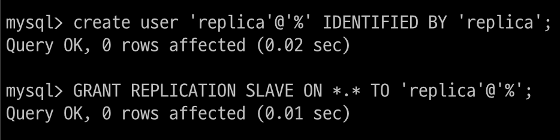</p>

<br>

##### 데이터 복사

이제 소스 서버의 데이터를 레플리카 서버로 가져와서 적재해야 하는데

mysqldump 같은 툴을 이용해 소스 서버에서 데이터를 내려받아 레플리카 서버로 복사하면 됨

<br>

mysqldump로 소스 서버 데이터를 덤프할 때는 --single-transaction과 --master-data라는 두 옵션을 반드시 사용

`--single-transaction` 옵션은 데이터를 덤프할 때 하나의 트랜잭션을 사용해 덤프가 진행되게 해서 

mysqldump가 테이블이나 레코드에 잠금을 걸지 않고 InnoDB 테이블들에 대해 일관된 데이터를 덤프받을 수 있게 함

<br>

`--master-data` 옵션은 덤프 시작 시점의 소스를 서버의 바이너리 로그 파일명과 위치 정보를 포함하는 복제 설정 구문(CHANGE REPLICATION SOURCE TO 또는 CHANGE MASTER TO)이 덤프 파일 헤더에 기록될 수 있게 하는 옵션으로 ,복제 연결을 위해 반드시 필요한 옵션

<br>

--master-data 옵션을 사용할 때 mysqldump는 MySQL 서버에서 FLUSH TABLES WITH READ LOCK 명령을 실행해 글로벌 락을 거는데 이는 바이너리 로그의 위치(사이즈)를 순간적으로 고정시키기 위함


옵션을 1 또는 2로 설정할 수 있으며,

1로 설정되면 덤프 파일 내의 복제 설정 구문(CHANGE REPLICATION SOURCE TO 또는 CHANGE MASTER TO)이 실제 실행 가능한 형태로 기록

2로 설정되면 해당 구문이 주석으로 처리되어 참조만 할 수 있는 형태로 기록

<p align="center"></p>

파일명 앞에 주소를 넣으면 해당 주소로 저장이 되며 파일명만 적으면 현재 위치에 파일이 저장됨

<details>
<summary>각 명령어에 대한 의미</summary>

#### `--opt`

`--opt` 옵션은 다음의 여러 옵션을 결합한 것입니다. 이는 기본적으로 데이터베이스 덤프의 속도를 높이고, 백업 및 복원의 효율성을 향상시키기 위해 사용됩니다. 

`--opt`는 기본적으로 `mysqldump`에 포함되어 있습니다. `--opt`는 다음 옵션들을 포함합니다:

- `--add-drop-table`: 각 테이블 덤프 전에 `DROP TABLE` 문을 추가합니다.
- `--add-locks`: 덤프하는 동안 각 테이블에 `LOCK TABLES` 문을 추가합니다.
- `--create-options`: 테이블 생성 시 추가적인 옵션을 포함합니다.
- `--disable-keys`: 데이터가 삽입되는 동안 외래 키 검사를 비활성화합니다.
- `--extended-insert`: 여러 행을 포함하는 INSERT 문을 사용하여 덤프 파일의 크기를 줄이고, 덤프 및 로드 속도를 높입니다.
- `--quick`: `SELECT` 문을 실행할 때, 서버가 데이터를 하나씩 클라이언트로 보내도록 합니다.
- `--lock-tables`: 덤프를 생성하는 동안 테이블을 잠급니다.
- `--set-charset`: 덤프 파일에 캐릭터 세트를 설정합니다.

`--opt`를 사용하면 위의 옵션들이 모두 활성화되어 덤프 과정이 최적화됩니다.

#### `--routines`

`--routines` 옵션은 데이터베이스 내의 저장 프로시저 및 함수를 포함합니다. 이를 사용하지 않으면, 덤프 파일에 이러한 객체들이 포함되지 않습니다.

- **사용 예시**: 데이터베이스에 저장 프로시저와 함수가 많이 사용될 경우, 백업 및 복원 시 이 옵션을 사용하여 해당 객체들을 포함할 수 있습니다.

#### `--triggers`

`--triggers` 옵션은 테이블에 정의된 트리거를 포함합니다. 기본적으로 `mysqldump`는 트리거를 덤프하지 않으므로, 이 옵션을 명시적으로 지정해야 합니다.

- **사용 예시**: 데이터베이스에 트리거가 정의되어 있는 경우, 백업 및 복원 시 이 옵션을 사용하여 해당 트리거를 포함할 수 있습니다.

#### `--hex-blob`

`--hex-blob` 옵션은 BLOB 및 BINARY 데이터를 16진수 형식으로 덤프합니다. 이는 BLOB 데이터를 보다 안전하게 덤프하고 복원하기 위해 사용됩니다.

- **사용 예시**: BLOB 또는 BINARY 데이터를 포함한 테이블을 백업할 때, 이 옵션을 사용하여 데이터를 안전하게 저장할 수 있습니다. 16진수 형식은 데이터 손실 없이 BLOB 데이터를 정확히 복원하는 데 유리합니다.

#### 요약

- `--opt`: 백업 및 복원 효율성을 높이기 위해 여러 최적화 옵션을 포함합니다.
- `--routines`: 저장 프로시저 및 함수를 덤프 파일에 포함합니다.
- `--triggers`: 테이블에 정의된 트리거를 덤프 파일에 포함합니다.
- `--hex-blob`: BLOB 및 BINARY 데이터를 16진수 형식으로 덤프하여 데이터 손실을 방지합니다.

</div>
</details>

<br>

데이터 덤프가 완료되면 source_data.sql 파일을 레플리카 서버로 옮겨 데이터 적재를 진행

<details>
<summary>옮기는 법</summary>

가장 일반적인 방법은 scp (Secure Copy) 명령어를 사용하는 것

#### EC2에서 로컬
```linux
scp -i /path/to/your-ssh-key.pem ec2-user@ec2-public-ip:/path/to/source/mydatabase_dump.sql /local/path/to/destination/
```

인데 내 ip는 퍼블릭이 아닌 프라이빗이어서 데이터를 로컬로 보내기 어려움
</div>
</details>
<br>


** 데이터 적재 명령어 입력하기 **


--master-data 옵션으로 소스 서버에 FLUSH TABLES WITH READ LOCK 명령이 실행되기 전에 MySQL 서버에서 이미 장시간 동안 실행 중인 쿼리가 있다면

글로벌 락 명령어가 실행 중인 쿼리에서 참조하고 있는 테이블들에 대한 잠금을 얻을 수 없어서 완료되지 못하고 대기하게 됨

글로벌 락 명령어가 대기하고 있는 상황이라면 뒤로 유입되는 다른 쿼리들도 대기할수 있으므로

mysqldump를 실행하기 전에 장시간 실행 중인 쿼리가 있는지 미리 확인하는 것이 좋음

그리고 mysqldump를 실행한 후에도 같은 대기현상이 발생하고 있지는 않는지 한번 더 확인하는 것이 좋음

<br>

##### 복제 시작

<p align="center"></p>

<br>

소스 서버와 레플리카 서버의 데이터 상태가 어떤지, 복제를 시작하면 어떻게 동기화가 진행되는지 살펴보자

예를 들어, 10시 30분에 mysqldump를 이용해 소스 서버의 데이터를 백업받아 11시 20분 쯤에 레플리카 서버에 모두 적재

의미

-> 10시 30분까지 있었던 소스 서버의 데이터들을 백업해서 레플리카 서버로 이동시킴

<br>

소스 서버와 레플리카 서버 간의 복제를 설정해보자

복제를 설정하는 명령은 CHANGE REPLICATION SOURCE TO(or CHANGE MASTER TO) 명령으로, mysqldump로 백업 받은 파일의 헤더 부분에서 해당 명령어를 참조할 수 있음

백업받은 파일은 크기가 크기 때문에 vi 같은 텍스트 편집기 보다는 less 같은 페이지 단위 뷰어를 이용해서 파일을 열자

대략 24번째 줄에 있는 CHANGE MASTER로 시작하는 줄만 텍스트 편집기에 복사해두자


** 복제 설정 명령 ** 


<br>

SOURCE_HOST는 레플리카 서버에서 복제 연결할 소스 서버를 의미, 소스 서버의 IP 혹은 도메인 정보를 넣으면 됨

SOURCE_PORT에는 소스 서버에서 구동 중인 MySQL 서버의 포트 번호를 넣어야 함

SOURCE_USER 및 SOURCE_PASSWORD 에는 복제용 계정 정보

SOURCE_LOG_FILE,SOURCE_LOG_POS 에는 복제를 시작하고자 하는 바이너리 로그 파일명과 위치 값

GET_SOURCE_PUBLIC_KEY는 RSA 키 기반 비밀번호 교환 방식의 통신을 위해 공개 키를 소스 서버에 요청할 것인지 여부를 나타냄

<details>
<summary>RSA 키 기반 비밀번호 교환 방식</summary>

RSA 암호화를 사용하면 사용자는 공개적으로 공유할 수 있는 공개 키라는 코드로 메시지를 암호화할 수 있습니다. 

특정 RSA 알고리즘의 수학적 특성으로 인해, 사용자가 공개 키를 사용하여 메시지를 암호화하고 나면 개인 키로만 이를 복호화할 수 있습니다.

사용자는 공개 키와 개인 키를 한 쌍씩 가지고 있으며, 후자는 비밀로 유지됩니다.

</div>
</details>
<br>


복제 설정에 보안된 연결과 관련 옵션들을 명시하지 않아 레플리카와 소스 서버가 암호화되지 않는 통신 방식으로 연결되는 경우 해당 에러 발생

** 에러문 사진 **

<br>

이 명령을 그대로 레플리카 서버의 MySQL에 로그인 해서 실행한 뒤

SHOW REPLICA STATUS 명령을 실행해보면

복제 관련 정보가 레플리카 서버 MySQL에 등록돼 있는 것을 확인할 수 있음

하지만 Replica_IO_Running과 Replica_SQL_Running 칼럼 값이 No로 되어 있는데

이것은 복제 관련 정보가 등록만 된 것이지 동기화가 시작되지는 않았음을 의미

이 상태에서 START REPLICA 명령을 실행 (START REPLICA 명령이 11:45에 실행된 것)

Replica_IO_Running과 Replica_SQL_Running 칼럼 값이 Yes로 바뀌면서

레플리카 서버는 10:30 ~ 11:45까지의 데이터 변경 사항들을 소스 서버로부터 가져와 적용하게 됨

<br>

SHOW REPLICA STATUS의 Seconds_Behind_Source의 값이 0이되면 소스 서버와 레플리카 서버의 데이터가 완전히 동기화됐음을 의미
<br>

#### 바이너리 로그 파일 위치 기반의 복제에서 트랜잭션 건너뛰기

레플리카 서버에서 소스 서버로부터 넘어온 트랜잭션이 제대로 실행되지 못하고 에러가 발생해 복제가 멈추는 현상이 발생하기도

대부분은 사용자의 실수로 인해 발생

<p align="center"></p>

<br>

대표적인 에러가 중복 키 에러

심각한 문제인 경우, 레플리카 서버의 데이터를 모두 버리고 다시 구축한 뒤 복제를 재구성해야 할 수도 잇지만 문제되는 소스 서버의 트랜잭션을 무시하고 넘어가도록 처리해도 괜찮을수도

후자의 경우 sql_slave_skip_counter 시스템 변수로 문제되는 트랜잭션을 건너 뛸 수 있음

레플리카 서버에서 다음과 같이 중복된 키로 인해 INSERT 쿼리가 실패한 상태로 복제가 멈춰있다고 가정

<p align="center"></p>

<br>

해당 에러는 PK에 87이라는 값이 중복되어서 들어온 쿼리 때문에 발생

다음과 같이 복제를 중단한 후 sql_slave_skip_counter 변수의 값을 1로 지정해 레플리케이션 SQL 스레드를 재시작하면 레플리카 서버는 에러가 발생한 INSERT 쿼리를 건너뛰고 정상적으로 복제를 재개하게 됨

<p align="center"></p>

<br>

sql_slave_skip_counter 시스템 변수에는 적용하지 않고 건너뛸 바이너리 로그 이벤트 그룹 수를 지정

즉, sql_slave_skip_counter 시스템 변수가 1로 설정되면 실제로 DML 쿼리 문장 하나를 가진 바이너리 로그 이벤트 1개를 무시하는 것이 아니라 현재 이벤트를 포함한 이벤트 그룹을 무시하는 것

`이벤트 그룹은 트랜잭션을 지원하는 테이블의 경우에는 트랜잭션이 하나의 이벤트 그룹이 되며,`

`트랜잭션을 지원하지 않는 테이블에서는 DML 문장 하나하나가 이벤트 그룹이 됨`

만약 위의 예제에서 에러가 발생한 INSERT 문이 하나의 이벤트 그룹이었다면 INSERT 문 하나만 무시됐을 것이며, 

여러 DML 쿼리가 함께 포함된 이벤트 그룹이었다면 같은 이벤트 그룹에 속한 DML 쿼리들이 모두 무시됐을 것

<br>

실행되는 DML 쿼리들이 단순하게 하나의 트랜잭션에 DML 쿼리가 하나만 실행되는 형태라면 

sql_slave_skip_counter 시스템 변수에 지정한 개수가 곧 쿼리의 개수이므로

레플리카 서버에서 적용이 무시되는 쿼리의 개수를 알 수 있으며 특정 쿼리만 무시하게도 할 수 있을 것

<br>

하나의 트랜잭션에 여러 개의 DML 쿼리들이 포함되는 경우가 존재한다면 다른 쿼리들이 함께 무시될 수 있으므로 주의하자

<br>

### 글로벌 트랜잭션 아이디(GTID) 기반 복제

5.5 버전까지는 복제를 설정할 때 바이너리 로그 파일 위치 기반 복제만 가능했음

즉, 복제에서 각각의 이벤트(쿼리들)들이 바이너리 로그 파일명과 파일 내 위치 값의 조합으로 식별되는 것인데

문제는 이 같은 식별이 바이너리 로그 파일이 저장돼 있는 소스 서버에서만 유효하다는 것

<br>

동일한 이벤트가 레플리카 서버에서도 동일한 파일명의 동일한 위치에 저장된다는 보장이 없음

복제에 투입된 서버들마다 동일한 이벤트에 대해 서로 다른 식별 값을 갖게 되는 것

<br>

복제를 구성하는 서버들이 서로 호환되지 않는 정보를 이용해 복제를 진행함으로써 복제의 토폴로지를 변경하는 작업은 때로 거의 불가능할 때도 많았음

> 토폴로지 <br> 소스 서버와 복제 서버의 구성

복제 토폴로지의 변경은 주로 복제에 참여한 서버들 중 일부 서버에 장애가 발생했을 때 필요한데 토폴로지 변경이 어렵다는 것은 복제를 이용한 Failover(복구)가 어렵다는 의미

MHA나 MMM 그리고 Orchestrator같은 MySQL HA(고가용성) 솔루션들은 내부적으로 복잡한 바이너리 로그 파일 위치 계산을 수행하거나 때로는 포기해버리는 형태로 처리되기도 함

<br>

만약 소스 서버에서 발생한 각 이벤트들이 복제에 참여한 모든 MySQL 서버들에서 동일한 고유 식별 값을 가진다면 어떨까

장애가 발생해도 손쉽게 복제 토폴로지를 변경할 수 있으며, 장애 복구에 소요되는 시간도 줄 것

이처럼 소스 서버에서만 유효한 고유 식별 값이 아닌 복제에 참여한 서버들에게 고유하도록 각 이벤트에 부여된 식별값을 GTID라고 하며, 이를 기반으로 복제가 진행되는 형태를 GTID 기반 복제라고 함

<br>

#### GTID의 필요성

아마도 복제 구성이나 장애에 대한 복구 대책을 고민해본 사용자라면

바이너리 로그 파일 위치 기반 복제 방식의 문제점을 알고 있을 것

<br>

<p align="center"></p>

<br>


우리가 자주 사용하는 복제 토폴로지를 예로 들면

하나의 소스 서버에 2개의 레플리카 서버가 연결돼 있는 복제 토폴로지

주로 레플리카 서버를 읽기 부하 분산 및 통계나 배치용으로 구성할 때 많이 사용

<br>

예시 그림에서 소스 서버 A의 바이너리 로그 위치는 binary-log.000002:320이며 

레플리카 서버 B는 완전히 동기화되어 똑같이 binary-log.000002:320 바이너리 로그 이벤트까지 완전히 실행 완료된 상태

B 서버는 SELECT 쿼리 분산용으로, C 서버는 배치나 통계용으로 사용

레플리카 서버 C는 조금 지연이 발생해서 소스 서버의 binary-log.000002:120 위치까지만 복제가 동기화된 상태

<p align="center"></p>

<br>

그런데 소스 서버인 A에서 장애가 발생하면서 서버가 비정상적으로 종료됐다고 가정해보자

레플리카 서버 B와 C 중에서 하나를 소스 서버로 승격(Promotion)하고, A 서버로 연결돼 있던 클라이언트 커넥션을 새로 승격된 소스 서버로 교체하고자 할 것

A 서버로 연결돼 있던 클라이언트 커넥션을 새로 승격된 소스 서버로 교체하고자 할 것

복제는 모두 끊어지고 B 서버로 사용자 트래픽이 유입되고 있음

그러나 여전히 동기화되지 않은 상태여서 서비스에서 SELECT 용도로 사용할 수 없는 상태

B 서버가 새로운 소스 서버로 승격되면서 클라이언트의 쿼리 요청이 B 서버로 들어오기 시작하는데 

B 서버는 SELECT 쿼리의 부하 분산용이었기에 분산 SELECT 쿼리 처리와 더불어 기존 소스 서버의 역할까지 겹치면서 과부하가 될 것

그렇다면 B 서버가 처리했던 SELECT 쿼리를 C 서버로 옮겨서 실행하면 될 것

하지만 C 서버는 동기화가 되지 않은 상태에서 A 서버가 종료됐으므로 복제를 최종 시점까지 동기화할 방법이 없음

<br>

서버 B의 릴레이 로그가 지워지지 않고 남았다면

(릴레이 로그에는 소스 서버의 바이너리 로그 위치가 함께 기록돼있으므로) 

B 서버의 릴레이 로그를 가져와서 필요한 부분만 실행하면 복구가 가능

하지만 릴레이 로그는 불필요한 시점에 자동으로 삭제되기에 상당히 제한적인 방법

수동으로 직접 확인하는 방법은 간단한 문제가 아닐 뿐더러 자동화는 더 어려움

<p align="center"></p>

<br>

GTID로 복제가 되는 상황을 생각해보자

소스 서버와 서버 B는 완전히 동기화가 된 상태이며

C는 :98 GTID까지만 동기화가 된 상태

<p align="center"></p>

<br>

이 상태에서 A가 장애가 발생하면 B 서버를 C 서버의 소스 서버가 되도록 C 서버에서 

CHANGE REPLICATION SOURCE TO SOURCE_HOST='B', SOURCE_PORT=3306; 

명령을 실행하면 B 서버의 바이너리 로그 파일 명이 무엇인지 어느 위치부터 이벤트를 가져와야 하는지 입력할 필요 X

GTID의 뒤의 숫자만 다르고 모두 같기에 :98 이후의 바이너리 로그 이벤트를 가져와서 동기화하면 되기에 편함

<br>

트랜잭션의 ID를 글로벌하게 확장함에 따라 토폴로지 변경 시 동기화에 대한 문제가 간단하게 해결되었음

레플리카 확장, 축소, 통합과 같은 과정에서도 사용하면 문제를 해결할 수 있을 것

<br>

#### 글로벌 트랜잭션 아이디

GTID는 논리적인 의미로 물리적인 파일의 이름이나 위치와는 무관하게 생성됨

mySQL의 GTID는 서버에서 커밋된 각 트랜잭션과 연결된 고유 식별자로 해당 트랜잭션이 발생한 서버에서 고유할 뿐 아니라 그 서버에 속한 복제 토폴로지 내 모든 서버에서 고유함

커밋되어서 바이너리 로그에 기록된 트랜잭션에 한해서만 할당

단순 SELECT 쿼리나 sql_log_bin 설정이 비활성화되어 있는 상태에서 발생한 트랜잭션은 기록되지 않으므로 GTID가 할당되지 않음

<br>

소스 아이디와 트랜잭션 아이디 값의 조합으로 생성되는데 두 값은 :(콜론 문자)로 구분되어 표시

GTID = [source_id]:[transaction_id]

소스 아이디는 소스 서버를 식별하기 위한 값으로 MySQL 서버의 server_uuid 시스템 변수 값을 사용

트랜잭션 아이디는 서버에서 커밋된 트랜잭션 순서대로 부여되는 값으로 1부터 1씩 단조 증가하는 형태로 발급

<br>

server_uuid는 사용자가 별도로 설정하는 것이 아니라 MySQL 서버가 시작되면서 자동으로 부여되며 데이터 디렉터리에 auto.cnf라는 파일이 생성되는데 그 안에 server_uuid 값이 저장돼 있음

<p align="center"></p>

<br>

auto.cnf 파일은 삭제되더라도 서버를 재시작할 때 자동으로 다시 생성되며 이미 생성돼 있는 auto.cnf 파일을 가져다가 사용할 수도 있음

> Xtrabackup을 이용해서 백업해둔 소스 서버의 데이터 파일을 새로운 레플리카 서버 구축에 그대로 사용한다면 실수로 auto.cnf 파일까지 사용할 수 있음 <br><br> 이 경우 복제를 멈추고 MySQL을 종료한 뒤 auto.cnf 파일을 삭제한 후 다시 MySQL을 시작하면 새로운 UUID 값이 생성되므로 복제 재개 시 문제없이 다시 연결 가능

> auto.cnf는 리눅스에서 /var/lib/mysql 에 위치하고 있음


<br>

현재 사용되고 있는 GTID 값을 확인하려면 mysql DB 내의 gtid_executed 테이블을 조회하거나 gtid_executed 시스템 변수를 통해 확인 가능 

<details>
<summary>gtid_executed 삽질 과정</summary>

<p align="center"></p>

왜 gtid_executed 안나오지..?

<p align="center"></p>

gtid_mode가 꺼져 있었음

<p align="center"></p>

<p align="center"></p>

default가 OFF였음

<p align="center"></p>

성공!

</div>
</details>
<br>

<p align="center"></p>

<p align="center"></p>

<p align="center"></p>

<p align="center"></p>

<p align="center"></p>

<br>

하나 이상의 GTID 값으로 구성돼 있는 것을 GTID 셋이라고 하며 동일한 서버에서 생성된 연속하는 GITD 값은 축소시켜 범위로 보여지며

범위 값과 단일 값이 하나의 표현식으로 나타날 수도 있음

또한 서로 다른 UUID를 가지는 GTID 값들도 포함될 수 있는데, 기존과 달느 값으로 변경됐거나 여러 서버에서 데이터를 복제해오는 경우에 해당

<br>

앞서 언급했던 mysql.gtid_executed 테이블은 단순히 현재 실행된 GTID 값을 저장하는 것 이외에 내부적으로 중요한 역할을 하는데 

레플리카 서버에서 바이너리 로그가 비활성화돼 있는 상태에서 GTID 기반 복제를 사용할 수 있게 하고 

바이너리 로그가 손실되는 상황에서도 GTID 값은 보존될 수 있게 함

<br>

mysql.gtid_executed 테이블은 InnoDB 스토리지 엔진으로 설정

8.0.17 이상 버전을 사용할 경우(현재 아마존 리눅스의 경우 8.0.37 ver) 매 트랜잭션이 커밋될 때마다 

mysql.gtid_executed 테이블에도 GTID 값이 바로 저장

8.0.17 미만이거나 InnoDB가 아닌 스토리지 엔진을 사용하는 경우 GTID 값은 바이너리 로그 파일이 로테이션되거나 MySQL 서버가 종료될 때만 mysql.gtid_executed 테이블에 저장

<br>

<p align="center"></p>

<br>

mysql.gtid_executed 테이블에는 실행된 모든 트랜잭션들에 대해 GTID 값이 저장되므로 시간이 지남에 따라 많은 데이터가 쌓일 수 있음

그동안 실행됐던 GTID들은 보존할 필요가 없기도 하고 불필요한 디스크 공간을 차지하므로 주기적으로 mysql.gtid_executed 테이블에 쌓여있는 전체 데이터를 하나의 데이터로 압축

여기서 압축은 interval_start와 interval_end를 연속된 것끼리 모아서 1건으로 만드는 것을 의미

<br>

mysql.gtid_executed 테이블에 대한 압축은 바이너리 로그 활성화 여부에 따라 압축을 수행하는 조건이 달라지는데

바이너리 로그가 활성화돼 있는 경우 바이너리 로그 파일이 로테이션 될 때 자동으로 압축이 수행

<details>
<summary>바이너리 로그 파일 로테이션</summary>

<p align="center"></p>

<p align="center"></p>

바이너리 로그 파일 로테이션은 max_binlog에 설정된 값에 도달하거나 서버가 재시작되거나 FLUSH 될 때 

새로운 로그 파일이 생성되는 것과는 다르지만 binlog_expire_logs_seconds 시스템 변수로 설정된 초가 지나면 삭제되는 것도 있었음 기본 설정은 30일

</div>
</details>
<br>

바이너리 로그가 활성화되어 있지 않은 경우 thread/sql/compress_gtid_table이라는 별도의 포그라운드 스레드에 의해 수행되는데

 MySQL 서버에서 실행된 트랜잭션 수가 gtid_executed_compression_period 시스템 변수에 수까지 도달하면 스레드에서 압축을 수행하고 슬립 모드로 돌아감

 <p align="center"></p>

<br>

기본 값은 0이며 0으로 설정되면 계속 슬립 모드 상태를 유지하고 압축을 수행하지 않으며 필요에 따라 자동으로 실행

<br>

#### 글로벌 트랜잭션 아이디 기반의 복제 구축

GTID를 활성하는 것과 GTID 기반의 복제를 사용하는 것은 별개이며

GTID 활성화는 GTID 복제를 위한 하나의 조건

<br>

GTID는 활성화되어 있더라도 복제는 바이너리 로그 파일 위치 기반 복제를 사용할 수 있음

그래서 소스 서버에 GTID가 활성화가 안되어 있다면 활성화해서 GTID 기반 복제를 적용할 수 있음

<br>

##### 설정 준비

복제에 참여하는 모든 서버들이 gtid가 활성화돼 있어야 하며 각 서버의 server_id 및 server_uuid가 복제 그룹내에서 고유해야 함

<p align="center"></p>

<p align="center"></p>

<br>

<details>
<summary>각 설정의 의미</summary>

이미지에서 제공된 `my.cnf` 설정 파일 내용은 MySQL에서 GTID(Global Transaction ID) 기반 복제를 구성하기 위한 슬레이브(레플리카) 서버 설정입니다. 각각의 설정 항목이 어떤 의미를 갖는지 설명해 드리겠습니다.

```ini
gtid_mode=ON
enforce_gtid_consistency=ON
server_id=2222
relay_log=/var/lib/mysql/relay_log
relay_log_purge=ON
read_only
log_slave_updates
```

### 설정 항목 설명

1. **`gtid_mode=ON`**:
   - **설명**: GTID 기반 복제를 활성화합니다. 이 설정을 통해 MySQL은 각 트랜잭션에 고유한 GTID를 부여하고, 이를 사용하여 복제를 관리합니다.
   - **필요성**: GTID 기반 복제는 더 간편한 복제 설정, 자동 페일오버, 일관된 트랜잭션 관리 등을 가능하게 합니다.

2. **`enforce_gtid_consistency=ON`**:
   - **설명**: GTID 일관성을 강제합니다. 이는 GTID 기반 복제에서 안전하지 않은 트랜잭션이 실행되지 않도록 합니다.
   - **필요성**: GTID 일관성을 보장하여 데이터의 무결성을 유지하고, GTID 복제 환경에서 일관성을 유지할 수 있습니다.

3. **`server_id=2222`**:
   - **설명**: 이 서버에 고유한 ID를 할당합니다. 복제 환경에서 각 서버는 고유한 `server_id`를 가져야 합니다.
   - **필요성**: `server_id`는 복제 환경에서 마스터와 슬레이브 서버를 구분하고, 복제 로그에서 트랜잭션의 출처를 식별하는 데 사용됩니다.

4. **`relay_log=/var/lib/mysql/relay_log`**:
   - **설명**: 슬레이브 서버에서 릴레이 로그 파일의 경로를 지정합니다. 릴레이 로그는 슬레이브 서버가 마스터 서버로부터 받은 바이너리 로그를 저장하는 파일입니다.
   - **필요성**: 릴레이 로그 파일 경로를 지정함으로써, 복제된 데이터가 저장되는 위치를 명확히 합니다.

5. **`relay_log_purge=ON`**:
   - **설명**: 사용되지 않는 릴레이 로그 파일을 자동으로 삭제합니다.
   - **필요성**: 오래된 릴레이 로그 파일이 디스크 공간을 차지하지 않도록 관리하여 저장 공간을 절약하고 성능을 유지합니다.

6. **`read_only`**:
   - **설명**: 서버를 읽기 전용 모드로 설정합니다. 슬레이브 서버는 데이터를 수정하지 않고 읽기만 할 수 있습니다.
   - **필요성**: 슬레이브 서버에서 데이터 수정이 발생하지 않도록 보장하여 데이터 일관성을 유지합니다. 관리자 계정은 예외적으로 쓰기 권한을 가질 수 있습니다.

7. **`log_slave_updates`**:
   - **설명**: 슬레이브 서버에서 받은 업데이트를 자체 바이너리 로그에 기록합니다.
   - **필요성**: 슬레이브 서버가 다른 슬레이브 서버의 마스터로 작동할 때 필요합니다. 이는 체인 복제(다중 슬레이브 복제) 설정에 유용합니다.

### 요약

- **GTID 모드와 일관성**: `gtid_mode=ON`, `enforce_gtid_consistency=ON` 설정을 통해 GTID 기반 복제를 활성화하고 일관성을 유지합니다.
- **서버 식별**: `server_id=2222`는 복제 환경에서 서버를 고유하게 식별합니다.
- **릴레이 로그 관리**: `relay_log`와 `relay_log_purge=ON`을 통해 릴레이 로그 파일의 경로를 설정하고, 자동 삭제를 관리합니다.
- **읽기 전용 모드**: `read_only` 설정을 통해 슬레이브 서버를 읽기 전용으로 설정하여 데이터 일관성을 유지합니다.
- **슬레이브 업데이트 로깅**: `log_slave_updates`를 통해 슬레이브 서버의 업데이트를 자체 바이너리 로그에 기록하여 체인 복제를 지원합니다.

이 설정들을 통해 슬레이브 서버가 효율적이고 일관된 복제 환경을 유지할 수 있습니다.

</div>
</details>
<br>

<p align="center"></p>

<br>

enforce_gtid_consistency=ON 가 명시되지 않으면 해당 에러 발생

enforce_gtid_consistency=ON 설정은 GTID 기반 복제에서 안전하지 않은 트랜잭션이 실행되지 않도록 하는 시스템 변수

```markdown
참고

DBA가 사용하는 대부분의 DB 관리자 계정은 모든 권한이 할당된 경우가 많으며 때문에 CONNECTION_ADMIN 권한(기존의 SUPER)도 계정에 부여돼 있을 가능성이 높음

해당 권한 계정은 read_only더라도 DDL, DML이 가능

그런데 실수로 복제 환경에서 DDL, DML을 실행하면 레플리카 서버 server_uuid로 구성된 새로운 GTID 셋이 추가되서 소스 서버와 레플리카 서버간의 GTID 셋이 달라져 역할을 스위치할 때 문제가 발생할 것

그래서 read_only 이외의 super_read_only 옵션도 넣자

```

<br>

##### 복제 계정 준비

<p align="center"></p>

<br>

<br>


##### 데이터 복사

<p align="center"></p>

<br>

MySQL 서버는 GTID 복제와 관련해서 대표적으로 2개의 시스템 변수를 가짐

GTID가 활성화된 소스 서버에서 mysqldump로 데이터를 덤프받아 레플리카 서버를 구축하려는 경우

덤프가 시작된 시점의 소스 서버 GTID 값을 레플리카 서버에서 다음 2개의 시스템 변수에 설정해야 복제를 시작할 수 있음

- gtid_excuted

    MySQL 서버에서 실행되어 바이너리 로그 파일에 기록된 모든 트랜잭션들의 GTID 셋

- gtid_purged

    현재 MySQL 서버의 바이너리 로그 파일에 존재하지 않는 모든 트랜잭션들의 GTID 셋

GTID 기반 복제에서 레플리카 서버는 gtid_executed 값을 기반으로 다음 복제 이벤트를 소스 서버로부터 가져옴

gtid_executed는 읽기 전용 변수로 사용자가 변경할 수 없으며, 사용자는 gtid_purged 변수 값만 수정할 수 있음

MySQL을 설치하고 처음 구동시키면 위 두 값은 비어있는데, 이 때 사용자가 gtid_purged에 값을 설정하면

gtid_executed에도 자동으로 동일한 값이 설정

<br>

따라서 복제를 시작하기 위해서는 소스 서버에서 데이터 덤프가 시작된 시점의 소스 서버의 GTID 값을 

레플리카 서버의 gtid_purged 시스템 변수에 지정해 gtid_executed 시스템 변수에도 그 값이 설정되게 해야 함

<br>

이를 위해 mysqldump에서는 --set-gtid-purged 옵션을 제공하며 이 옵션이 활성화되면 덤프가 시작된 시점의 GTID가 덤프 파일에 기록

또한 `sql_log_bin 시스템 변수를 비활성화하는 구문`도 함께 기록되는데 

`덤프 파일을 실행할 때 적용되는 트랜잭션들이 레플리카 서버에서 새로운 GTID를 발급받는 것을 방지`

`즉, 레플리카 서버에서 덤프 파일을 적재하는 작업이 바이너리 로그에 기록되지 않으므로 GTID가 생성되지 않는 것`

<br>

--set-gtid-purged 옵션에 넣을 수 있는 값들

명시적으로 해당 옵션을 적지 않더라도 AUTO로 설정되어 동작

<p align="center"></p>

<br>

위의 mysqldump 명령에 주어진 --set-gtid-purged=ON 옵션으로 인해 덤프된 파일의 최상단에는 이런 내용이 기록됨

만약 레플리카 서버 구축을 위해서가 아니라 단순히 다른 DB 서버로의 데이터 마이그레이션을 위해 

mysqldump를 사용하는 경우에는 mysqldump 실행시 --set-gtid-purged = OFF 옵션을 명시하여

sql_log_bin 시스템 변수를 비활성화하는 구문이 덤프 파일에 기록되지 않도록 해야 함

그렇지 않으면 데이터를 마이그레이션(이사)할 DB 서버에서 덤프 파일 적용시 적재한 데이터가 바이너리 로그에 기록되지 않아 해당 DB 서버와 연결된 레플리카 서버에 데이터가 복제되지 않을 수 있기 때문

<br>

<p align="center"></p>

<br>

—set-gtid-purged = ON 옵션을 했을 때 SQL_LOG_BIN은 0

PURGED 명령에서 +는 현재 설정돼 있는 값에 새로운 값을 덧붙이는 것을 의미

mysqldump로 백업받은 데이터 파일을 레플리카 서버로 옮겨 적재하면 레플리카 서버에서 gtid_executed와 gtid_purged 시스템 변수 값이 다음과 같이 자동으로 설정

<details>
<summary>소스 서버에서 레플리카 서버로 데이터 복사 방법</summary>

<p align="center"></p>

해당 코드는 허가 거부

<p align="center"></p>

/etc/ssh/sshd_config 파일에서 PasswordAuthentication no를 yes로 변경

<p align="center"></p>

그런데 나는 private key로 접속한 것이어서 초기 비밀번호를 설정하지 않았음

<p align="center"></p>

root 계정 비밀번호를 설정 root로

<p align="center"></p>

내가 접속한 ec2-user 계정의 비밀번호도 설정 0000으로

<p align="center"></p>

복사 성공!

</div>
</details>
<br>

<p align="center"></p>

<p align="center">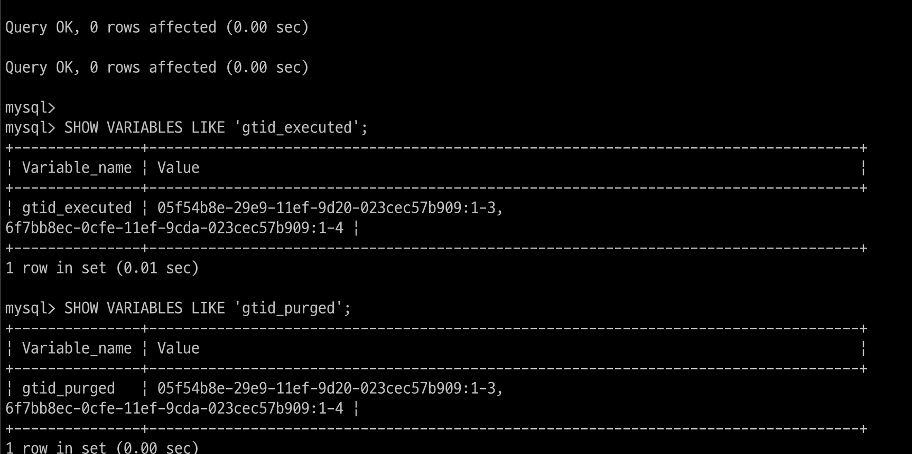</p>

<br>

최초 gtid_executed, gtid_purged가 비어있다가 적재 후 자동으로 설정된 것을 확인 가능

<br>

<p align="center"></p>

<br>

소스 서버에서 XtraBackup 툴을 사용해 데이터를 백업받아서 레플리카 서버에 복구하는 경우 데이터 디렉터리에 xtrabackup_binlog_info라는 파일이 생성

이 파일에는 다음과 같이 백업이 완료된 시점의 바이너리 로그 파일명과 위치, GTID 값이 함께 기록되어 있음

XtraBackup이나 MySQL 엔터프라이즈 백업 도구를 이용해 백업하거나 복구할 때는 mysql.gtid_executed 테이블과 데이터까지 복구됨

백업 복구가 완료되어 MySQL 서버가 시작되면 자동으로 mysql.gtid_executed 테이블의 GTID 값을 바탕으로 gtid_executed와 gtid_purged 시스템 변수를 초기화함

mysql.gtid_executed 테이블의 GTID 값은 xtrabackup_binlog_info 파일에 표시되는 값과 동일한 GTID 값을 가짐

<br>

##### 복제 시작

레플리카 서버의 초기 데이터는 모두 준비 완료

`레플리카 서버에 복구된 데이터는 소스 서버에서 백업을 실행했던 과거 시점의 데이터이며, 백업 시점 이후에 새롭게 변경되는 데이터는 레플리카 서버에 적용돼 있지 않은 상태이고, 실시간으로 변경되는 데이터도 레플리카 서버로 복제되지 않음`

<p align="center"></p>

<br>

해당 명령을 실행하면 레플리카 서버는 소스 서버에서 백업 시점부터 지금까지 변경된 데이터와 이후 변경될 데이터를 실시간으로 가져와서 적용

SOURCE_AUTO_POSITION 옵션은 레플리카 서버가 자신의 gtid_executed 값을 참조해 해당 시점부터 소스 서버와 복제를 연결해서 데이터를 동기화

<p align="center"></p>

<br>

#### 글로벌 트랜잭션 아이디 기반 복제에서 트랜잭션 건너뛰기

<p align="center"></p>

<br>


<p align="center"></p>

<br>

재시작안해서 server id가 같은 상황이었는데 그걸 모르고 소스 서버에서 2개의 트랜잭션 실행

그 후 확인해보니 server_id 변경이 적용이 안돼서(재시작을 안해서) 동기화가 안되고 있는 상태

그래서 소스 서버에서 해당 테이블의 내용을 삭제하는 쿼리를 사용하였는데

레플리카 서버의 에러 로그를 보니 해당 레코드를 찾을수가 없는데 삭제하는 이벤트가 일어났다라는 오류를 보여줌

<p align="center"></p>

<br>

복제 중단 → gtid_next 기본 값 확인 → 오류나는 트랜잭션을 빈 트랜잭션으로 만들어서 바이너리 로그 스트림에 밀어넣음 → 복제 시작

이와 같은 방법으로 7,8 트랜잭션을 해결

<p align="center">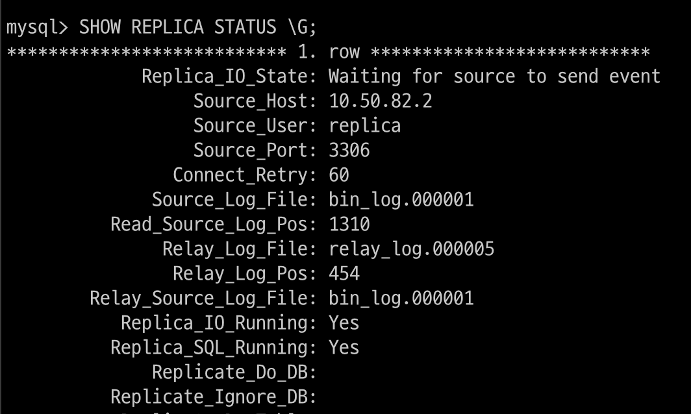</p>

<br>

<p align="center"></p>

<br>

여기에서 Retrieved_Gtid_Set은 복제를 통해 소스 서버로부터 가져온 GTID 셋이고

실행한 GTID 셋(Executed Gtid Set)은 1~9로 표시

즉, 1~6 GTID set은 백업받은 파일을 복구하면서 적용된 것

#### Non-GTID 기반 복제에서 GTID 기반 복제로 온라인 변경

8.0 버전에서는 서비스가 현재 동작하고 있는 상태에서 MySQL 서버가 GTID를 사용하도록 or 사용하지 않도록 GTID 모드를 온라인으로 전환할 수 있는 기능을 제공

5.7.6 버전부터 온라인 전환이 가능해졌는데 그 이전 버전에서는 반드시 소스 서버와 레플리카 서버에서 MySQL을 재시작해야만 GTID 모드를 활성화하거나 비활성화할 수 있었음

<br>

GTID 모드 전환 작업은 두 시스템 변수만 순차적으로 변경하면 됨

- enforce_gtid_consistency

- gtid_mode

enforce_gtid_consistency는 GTID 기반의 복제에서 소스 서버와 레플리카 서버 간의 데이터 일관성을 해칠 수 있는 쿼리들이 MySQL 서버에서 실행되는 것을 허용할지를 제어하는 변수

<br>

GTID를 사용하는 복제 환경에서는 이런 쿼리들은 안전하지 않음

- 트랜잭션을 지원하는 테이블과 지원하지 않는 테이블을 함께 변경하는 쿼리 or 트랜잭션

- CREATE TABLE ... SELECT ... 구문

- 트랜잭션 내에서 CREATE TEMPORARY TABLE, DROP TEMPORARY TABLE 구문 사용

<br>

소스 서버에서 레플리카 서버로 복제되어 적용될 때 단일 트랜잭션으로 처리되지 않을 수도 있다는 점이 공통점

이러한 점이 문제가 되는 이유는 GTID가 트랜잭션 단위로 올바르게 할당되어야 복제가 정상적으로 동작하기 때문

<br>

만약 소스 서버에서 단일 트랜잭션으로 처리된 쿼리들이 바이너리 로그에 기록되고 레플리카 서버로 복제되는 과정에서 

하나의 트랜잭션이 아닌 개별적인 이벤트로 분류되고 각각에 대해 GTID가 할당되면 레플리카 서버에서 해당 트랜잭션이 원자적으로 처리되지 못할 수도 있음

이 같은 가능성으로 인해 GTID 기반 복제에서는 위 같은 패턴들이 문제가 될 수 있으며, 

사용자는 enforce_gtid_consistency 설정을 통해 이러한 쿼리들의 실행 가능 여부를 제어할 수 있음

```
8.0에서는 GTID를 사용하는 복제 환경에서 안전하지 않았던 일부 쿼리들이 안전하게 처리되도록 개선

8.0.13 버전부터는 바이너리 로그 포맷이 ROW 또는 MIXED로 설정된 경우 트랜잭션 내에서 CREATE TEMPORARY TABLE 및 DROP TEMPORARY TABLE 구문을 사용할 수 있음

8.0.21 버전부터는 Atomic DDL 기능을 지원하는 InnoDB 스토리지 엔진 테이블에 한해 CREATE TABLE ... SELECT 구문을 사용할 수 있게 되었음
```

<br>

enforce_gtid_consistency에 지정할 수 있는 값의 내용

<p align="center"></p>

<br>

GTID가 활성화된 경우에는 반드시 ON으로 설정

<br>

gtid_mode를 살펴보자면

`gtid_mode는 바이너리 로그에 트랜잭션들이 GTID 기반으로 로깅될 수 있는지 여부와 트랜잭션 유형별로 MySQL 서버에서의 처리 가능 여부를 제어`

바이너리 로그에 기록되는 트랜잭션 유형에는 익명(Anonymous) 트랜잭션과 GTID 트랜잭션이 있는데,

익명 트랜잭션은 GTID가 부여되지 않은 트랜잭션으로 바이너리 로그 파일명과 위치로 식별되며,

GTID 트랜잭션은 고유한 식별값인 GTID가 부여된 트랜잭션을 지칭

<br>

gtid_mode에 지정할 수 있는 값의 내용

<p align="center"></p>

<br>

gtid_mode는 위 표에 적혀진 값 순서를 기준으로 한 번에 한 단계씩만 변경 가능

복제 그룹 내에서 소스 서버와 레플리카 서버의 gtid_mode를 변경하는 경우

최초에는 소스 서버와 레플리카 서버가 동일한 gtid_mode 값을 가지고 있더라도

변경 작업을 진행할 때 기존 설정 값으로 동작하는 서버와 새로운 설정 값으로 동작하는 서버가 동시점으로 존재할 수 있음

<p align="center"></p>

<br>

복제 그룹 내 MySQL 서버들의 GTID 모드를 변경하는 과정을 살펴보자

먼저 Non-GTID 기반으로 복제가 구성돼 있는 소스 서버와 레플리카 서버가 있고

이 서버들의 GTID를 활성화한 뒤 GTID 기반의 복제를 변경한다고 가정해보자

두 서버는 5.7.6 이상의 버전을 사용하고 있음

전환 작업은 다음과 같은 순서로 진행

1. 각 서버에서 enforce_gtid_consistency를 WARN으로 변경

<p align="center"></p>

<br>

2. 각 서버에서 enforce_gtid_consistency 시스템 변수 값을 ON으로 변경

<p align="center"></p>

<br>

3. 각 서버에서 gtid_mode 시스템 변수 값을 OFF_PERMISSIVE로 변경

<p align="center"></p>

<br>

4. 각 서버에서 gtid_mode 시스템 변수 값을 ON_PERMISSIVE로 변경

<p align="center"></p>

<br>


5. 잔여 익명 트랜잭션 확인

<p align="center"></p>

<br>

6. 각 서버에서 gtid_mode 시스템 변수 값을 ON으로 변경

```SQL
mysql> SET GLOBAL gtid_mode = ON;
```

7. my.cnf 파일 변경

<p align="center"></p>

<br>

8. GTID 기반 복제를 사용하도록 복제 설정을 변경

<p align="center"></p>

<br>

GTID를 비활성화하는 작업은 위에서 순차적으로 진행한 작업들을 다시 역순으로

<br>

#### GTID 기반 복제 제약 사항

- GTID가 활성화된 MySQL 서버에서는 enforce_gtid_consistency=ON 옵션으로 인해 GITD 일관성을 해칠 수 있는 일부 유형의 쿼리들은 실행할 수 없음

- GTID 기반 복제가 설정된 레플리카 서버에서는 sql_slave_skip_counter 시스템 변수를 사용해 복제된 트랜잭션을 건너뛸 수 없음

- GTID 기반 복제에서 CHANGE REPLICATION SOURCE TO 구문의 IGNORE_SERVER_IDS 옵션은 더 이상 사용되지 않음 

    해당 옵션은 순환 복제 구조에서 한 서버가 장애로 인해 복제 토폴리지에서 제외됐을 때 장애 서버에서 발생한 이벤트가 중복으로 적용되지 않게 할 때 유용하게 사용할 수 있는데

    GTID는 이미 적용된 트랜잭션을 식별할 수 있고 자동으로 무시하므로 해당 옵션이 필요하지 않음


<br>

## 복제 데이터 포맷

변경 이벤트들이 바이너리 로그에 어떤 형태로 저장되는지를 나타내는 바이너리 로그 로깅 포맷 타입에 대해 알아보자

바이너리 로그에 이벤트가 어떤 포맷으로 기록되는지는 복제가 처리되는 과정에도 영향

`레플리카 서버가 소스 서버의 바이너리 로그 이벤트를 내부적으로 가공하지 않고 가져온 그대로 실행해 자신의 데이터에 적용`하므로 복제에서 어떤 바이너리 로그 포맷을 사용하느냐는 중요한 부분

실행된 SQL문을 바이너리 로그에 기록하는 Statement 방식

변경된 데이터 자체를 기록하는 Row 방식

binlog_format 시스템 변수로 이 두가지 중 하나로 설정하거나 혼합된 형태를 사용 가능

<br>

### Statement 기반 바이너리 로그 포맷

바이너리 로그가 처음 도입됐을 때부터 존재하던 포맷

실행된 SQL문을 바이너리 로그에 기록하는 방식

<p align="center"></p>

<br>

로그 내용을 살펴보면 실행된 SQL 문이 그대로 바이너리 로그에 저장돼 있는 것을 확인할 수 있음

하나의 SQL 문은 여러 개의 데이터를 수정할 수 있는데 

Statement 포맷에서는 바이너리 로그에 SQL문 하나만 기록됨

이런 경우 바이너리 로그 파일의 용량이 작아지므로 사용자 입장에서는 저장 공간에 대한 부담을 덜 수 있으며 

원격으로 바이너리 로그를 백업하거나 원격에 위치한 레플리카 서버와 복제할 때도 좀 더 빠르게 처리될 수 있음

<br>

대표적인 단점은 비확정적(Non-Deterministic)으로 처리될 수 있는 쿼리가 실행된 경우

복제 시 소스 서버와 레플리카 서버 간에 데이터가 달라질 수 있다는 점

비확정적 쿼리의 몇 가지 예시

- DELETE/UPDATE 쿼리에서 ORDER BY 절 없이 LIMIT 사용

    ```
    예를 들어 DELETE FROM tb_test LIMIT 10;과 같은 쿼리는 어떤 레코드가 삭제될지 모름
    ```

- SELECT ... FOR UPDATE 및 SELECT ... FOR SHARE 쿼리에서 NOWAIT이나 SKIP LOCKED 옵션 사용

- UUID(), USER(), RAND(), VERSION() 등과 같은 함수를 사용하는 쿼리

- 동일한 파라미터 값을 입력하더라도 결괏값이 달라질 수 있는 사용자 정의 함수나 스토어드 프로시저를 사용하는 쿼리

<br>

또 다른 단점은 Row 포맷으로 복제될 때보다 데이터에 락을 더 많이 건다는 점

대표적인 예로 INSERT INTO ... SELECT 구문

<br>

한 가지 제한사항

트랜잭션 격리 수준이 REPEATABLE READ 이상

이 이하 방식에서는 하나의 트랜잭션 내에서도 쿼리가 실행되는 시점마다 데이터 스냅숏이 달라질 수 있는데 이로 인해 소스 서버와 레플리카 서버의 데이터가 달라질 수 있음

<br>

### ROW 기반 바이너리 포맷

5.1 버전부터 도입된 것으로 데이터 변경이 발생했을 때 변경된 값 자체가 바이너리 로그에 기록되는 방식

`어떤 형태의 쿼리가 실행됐든 데이터를 일관되게 하는 가장 안전한 방식`

다음과 같은 쿼리가 실행되면 락이 최소화되어서 처리

- INSERT ... SELECT

- INSERT with AUTO_INCREMENT

- 적절한 인덱스가 없어 풀스캔으로 처리되는 UPDATE/DELETE

<br>

굉장히 많은 데이터를 변경한 경우 바이너리 로그 파일 크기가 단시간에 매우 커질 수 있음

<p align="center"></p>

<br>

<p align="center"></p>

<p align="center"></p>

<p align="center"></p>

<p align="center"></p>

mysqlbinlog에서 -v 옵션을 줬을 때 유사 SQL 형태로 변환해서 보여줌

ROW 포맷은 모든 트랜잭션 격리 수준에서 사용 가능하며 DDL 문은 전부 STATEMENT 포맷 형태로 바이너리 로그에 기록됨

<br>

### MIXED 포맷

MIXED 포맷으로 설정되면 기본적으로는 Statement 포맷을 사용하며, 필요시 자동으로 ROW 포맷으로 전환해서 로그에 기록

대부분 STATEMENT 포맷으로 기록될 가능성이 높고 문제가 될 것 같은 쿼리들은 ROW 포맷으로 변환

<br>

### ROW 포맷의 용량 최적화

ROW 기반 포맷의 단점은 바이너리 로그 파일의 용량이 STATEMENT 포맷을 사용할 때보다 많이 커질 수 있다는 점

바이너리 로그 파일의 용량을 줄이기 위해 2가지 방법을 제공

#### 바이너리 로그 ROW 이미지

ROW 포맷은 STATEMENT 포맷보다 더 많은 저장 공간과 네트워크 트래픽을 유발할 가능성이 있음

binlog_row_image 시스템 변수는 변경 데이터의 칼럼 구성을 제어하는 것

ROW 포맷을 사용할 경우 변경 전 레코드와 변경 후 레코드가 함께 저장되는데 

binlog_row_image는 각 변경 전후 레코드들에 대해 테이블의 어떤 칼럼들을 기록할 것인지 결정

binlog_row_image의 3가지 옵션

- full(Default)

    특정 칼럼에서만의 변경 여부와 관계없이 변경이 발생한 레코드의 모든 칼럼들의 값을 바이너리 로그에 기록하는 방식

    INSERT 문장의 경우 새롭게 INSERT된 레코드의 모든 칼럼들만 바이너리 로그 파일에 기록되며 
    
    UPDATE의 경우 변경 전, 변경 후의 레코드 모두 전체 칼럼들의 셋으로 바이너리 로그에 기록

    DELETE의 경우 변경 전의 레코드의 전체 칼럼들만 기록

<br>

- minimal

    변경 데이터에 대해 꼭 필요한 칼럼들의 값만 바이너리 로그에 기록

<br>

- noblob

    full 옵션을 설정한 것과 동일하게 작동하지만 레코드의 BLOB이나 TEXT 칼럼에 대해 변경이 발생하지 않은 경우 해당 칼럼들은 바이너리 로그 파일에 기록하지 않음

<br>

#### 바이너리 로그 트랜잭션 압축

바이너리 로그는 안정적인 복제를 위해 일정 기간 동안 보관되도록 설정

시점 복구(Point-In-Time Recovery)를 고려하는 경우에는 원격 스토리지 서버에 바이너리 로그를 백업해두기도

<br>

Row 포맷을 사용중인 상태에서 Row 이미지를 조정했다고 하더라도 유입되는 DML 쿼리의 양이 많은 MySQL 서버에서는 바이너리 로그 파일의 크기가 커질 수 밖에 없음

<br>

8.0.20 버전부터 ROW 포맷으로 기록되는 트랜잭션에 대해 트랜잭션에서 변경한 데이터를 압축해서 바이너리 로그에 기록할 수 있게 하는 기능이 도입

따라서 기존과 동일한 바이너리 로그 보관 주기를 유지하면서 이전보다 디스크 공간을 절약할 수 있게 됐으며 복제로 인해 소비되는 네트워크 대역폭 사용량도 줄일 수 있게 됨

<br>

<p align="center"></p>

<br>

바이너리 로그 트랜잭션 압축 기능 활성화돼 있으면 트랜잭션에서 변경한 데이터들을 zstd 알고리즘을 사용해 압축한 뒤 Transaction_payload_event라는 하나의 이벤트로 바이너리 로그에 기록 

레플리카로 복제, 릴레이 로그에 기록될 때 모두 압축된 상태로 기록

주의해야 할 점은 레플리카 서버도 8.0.20 이상 버전을 유지해야 한다는 것

<br>

사용자는 binlog_transaction_compresssion 변수로 압축 기능을 활성화할 수 있으며

binlog_transaction_compression_level_zstd 변수로 사용될 zstd 알고리즘 레벨을 설정할 수 있음

- binlog_transaction_compression

    1 또는 0으로 설정 가능하며 기본값은 0(OFF)

- binlog_transaction_compression_level_zstd

    압축 레벨을 1 ~ 22까지 지정가능하며 기본값은 3

    압축 레벨이 높을수록 압축률이 증가해 디스크 공간이나 네트워크 대역폭을 더 절약할 수 있다는 장점이 있지만 CPU와 메모리 사용량이 늘어나고 처리 시간이 증가할 수도

<br>

대표적으로 다음과 같은 이벤트 타입은 압축 기능이 활성화돼 있어도 압축되지 않은 상태로 기록

- GTID 설정 관련 이벤트

- 그룹 복제에서 발생하는 View Change 이벤트 또는 소스서버가 레플리카 서버에 살아있음을 알리는 Heartbeat 이벤트

-  복제 실패 및 소스 서버와 레플리카 서버 간 데이터 불일치를 발생시킬 수 있는 Incident 타입의 이벤트

- Statement 포맷으로 기록되는 트랜잭션 이벤트

<br>

압축된 트랜잭션 데이터는 개별 이벤트들의 내용이 어떤 것인지 실제로 확인이 필요할 때 압축이 해제되는데 다음과 같은 경우가 여기에 해당

- 레플리카 서버에서 레플리케이션 SQL 스레드에 의해 복제된 트랜잭션이 적용될 때

- mysqlbinlog를 사용해 트랜잭션을 재실행할 때

- SHOW binlog event 혹은 SHOW RELAYLOG EVENTS 구문이 사용될 때

<br>

레플리카 서버에서 performance_schema의 binary_log_compression_stats를 조회한 결과

<p align="center"></p>

<br>

## 복제 동기화 방식

소스 서버와 레플리카 서버 간의 복제 동기화에 대해 두 가지 방식을 제공

- 비동기 복제(Asynchronous replication)

- 반동기 복제(Semi-synchronous replication)

각 동기화 방식이 어떻게 동작하고 각 방식을 사용했을 때의 장단점은 무엇인지?

<br>

### 비동기 복제(Asynchronous replication)

MySQL의 복제는 기본적으로 비동기 방식으로 동작

비동기 방식이란 자신과 복제 연결된 레플리카 서버에서 변경 이벤트가 정상적으로 전달되어 적용됐는지를 확인하지 않는 방식

<p align="center"></p>

<br>

소스에서 커밋된 트랜잭션은 바이너리 로그에 기록

레플리카 서버는 주기적으로 신규 트랜잭션에 대한 바이너리 로그를 소스 서버에 요청

비동기 복제 방식에서 소스 서버는 레플리카 서버로 변경 이벤트가 잘 전달됐는지, 실제로 적용됐는지 알지 못하여 이에 대한 어떠한 보장도 하지 않음

이로 인해 소스 서버에 문제가 생기면 레플리카 서버로 전송되지 않을 수 있음

<br>

장애로 인해 레플리카 서버를 소스 서버로 승격시키는 경우 사용자는 레플리카 서버가 소스 서버로부터 전달받지 못한 트랜잭션이 있는지 확인하며 필요시 수동으로 다시 적용해야 함

레플리카 서버로 전송되는 부분을 고려하지 않기 때문에 트랜잭션 처리에 있어서도 좀 더 빠른 성능을 보이고 레플리카 서버에 문제가 생겨도 소스 서버는 영향을 받지 않는다는 장점

레플리카 서버를 여러 대 연결한다 해도 큰 성능 저하가 없기에 레플리카 서버를 확장해서 읽기 트래픽을 분산하는 용도로 제격

<br>

### 반동기 복제(Semi-synchronous replication)

반동기 복제는 좀 더 향상된 데이터 무결성을 제공하는 복제 동기화

소스 서버는 레플리카 서버가 소스 서버로부터 전달받은 변경 이벤트를 릴레이 로그에 기록 후 응답(ACK)을 보내면 그때 트랜잭션을 완전히 커밋시키고 클라이언트에 결과를 반환

따라서 반동기 복제에서는 소스 서버에서 커밋되어 정상적으로 결과가 반환된 모든 트랜잭션들에 대해 적어도 하나의 레플리카 서버에는 해당 트랜잭션들이 전송됐음을 보장

하지만 전송됐음을 보장하는 것이지 적용되는 것까지 보장한다는 것은 아님

그래서 이름이 반동기(일정 부분까지의 동기화만 보장)

<br>

소스 서버가 트랜잭션 처리 중 어느 지점에서 레플리카 서버의 응답을 기다리느냐에 따라 소스 서버에서 장애가 발생했을 때 사용자가 겪을 수 있는 문제 상황이 조금 다를 수 있음

rpl_semi_sync_master_wait_point 시스템 변수를 통해 소스 서버가 레플리카 서버의 응답을 기다리는 지점을 제어할 수 있음 (AFTER_SYNC or AFTER_COMMIT)

<p align="center"></p>

<br>

AFTER_SYNC로 설정된 경우 소스 서버에서는 각 트랜잭션을 바이너리 로그에 기록하고 난 후 스토리지 엔진에 커밋하기 전 단계에서 레플리카 서버의 응답을 기다림

정상 응답을 받으면 소스 서버는 그 때 스토리지 엔진을 커밋해서 트랜잭션에 대한 처리를 완전히 종료하고 트랜잭션을 실행한 클라이언트에 그 처리 결과를 반환

<br>

<p align="center"></p>

<br>

AUTO_COMMIT으로 설정된 경우에는 소스 서버에서 트랜잭션을 바이너리 로그에 기록하고 스토리지 엔진에서의 커밋도 진행하고 나서 최종적으로 클라이언트에 결과를 반환하기 전에 레플리카 서버의 응답을 기다림

<br>

처음 반동기 복제가 도입됐을 때는 스토리지 엔진 커밋까지 완료 후 대기하는 AFTER_COMMIT 방식으로만 동작했었음

5.7 버전에서 AFTER_SYNC 방식이 새로 도입됐으며 8.0 이후로는 default가 AFTER_SYNC

AFTER_SYNC 방식은 AFTER_COMMIT 방식과 비교해서 해당 장점 존재

- 소스 서버에 장애가 발생했을 때 팬텀 리드가 발생하지 않음

- 장애가 발생한 소스 서버에 대해 좀 더 수월하게 복구 처리 가능

<br>

AFTER_COMMIT에서는 트랜잭션이 스토리지 엔진 커밋까지 처리된 후 레플리카 서버의 응답을 기다리는데

이처럼 스토리지 엔진 커밋까지 완료된 데이터는 다른 세션에서도 조회 가능한데

이로 인해 스토리지 엔진 커밋 후 레플리카 서버로부터 아직 응답을 기다리고 있는 상황에서 소스 서버에 장애가 발생한 경우

사용자는 이후 새로운 소스 서버로 승격된 래플리카 서버에서 데이터를 조회할 때 자신이 이전 소스 서버에서 조회했던 데이터를 보지 못할 수도 있음

<br>

AFTER_SYNC에서는 스토리지 엔진 커밋 전에 레플리카 서버의 응답을 기다리므로 팬텀 리드는 발생하지 않음

이처럼 소스 서버에서 커밋됐으나 레플리카로는 복제가 안된 상황에서 장애가 발생한 소스 서버를 재사용하는 경우

AFTER_COMMIT 방식에서는 사용자가 수동으로 그런 트랜잭션들을 롤백시켜야 했음

그러나 AFTER_SYNC는 롤백 처리할 필요 X

그래서 AFTER_SYNC가 AFTER_COMMIT보다 좀 더 데이터 무결성이 강화된 방식

<br>

반동기 복제는 트랜잭션 처리 중에 레플리카 서버의 응답을 기다리므로 비동기 방식과 비교했을 때 트랜잭션 처리 속도가 더 느릴 수 있음

최소 소스 서버와 레플리카 서버의 네트워크 왕복 시간만큼 더 걸린다고 할 수 있음

하지만 소스 서버의 타임 아웃 시간을 설정할 수 있으며, 여러 대의 레플리카 서버가 복제 연결돼 있을 때 반드시 연결된 전체 레플리카 서버의 응답을 기다려야 하는 것은 아님 이것도 설정 가능

<br>

#### 반동기 복제 설정 방법

플러그인 형태로 구현돼 있음

현재 구동 중인 MySQL 서버에서 동적으로 설치가 가능하며 소스 서버와 레플리카 서버 모두 설치

<p align="center"></p>

<p align="center">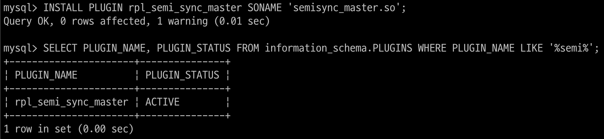</p>

<br>

플러그인이 설치됐다고 해서 자동으로 반동기 복제가 활성화되는 것은 아님

사용자는 반동기 복제 사용을 위해 관련 시스템 변수를 적절히 설정해줘야 할 필요가 있음

<p align="center">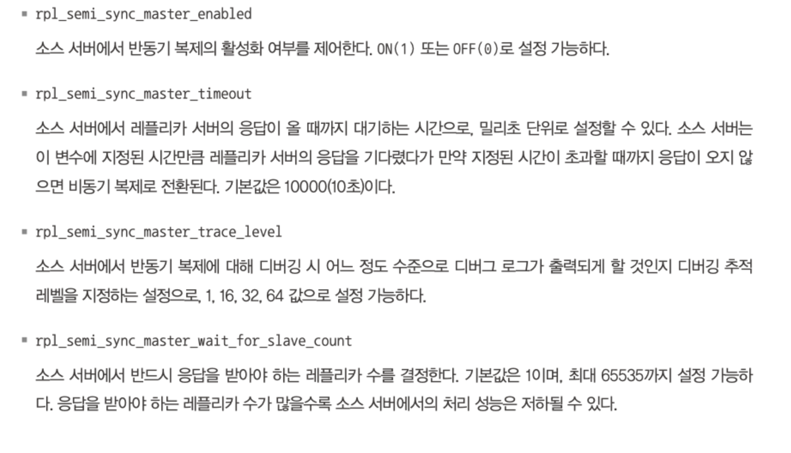</p>

<p align="center">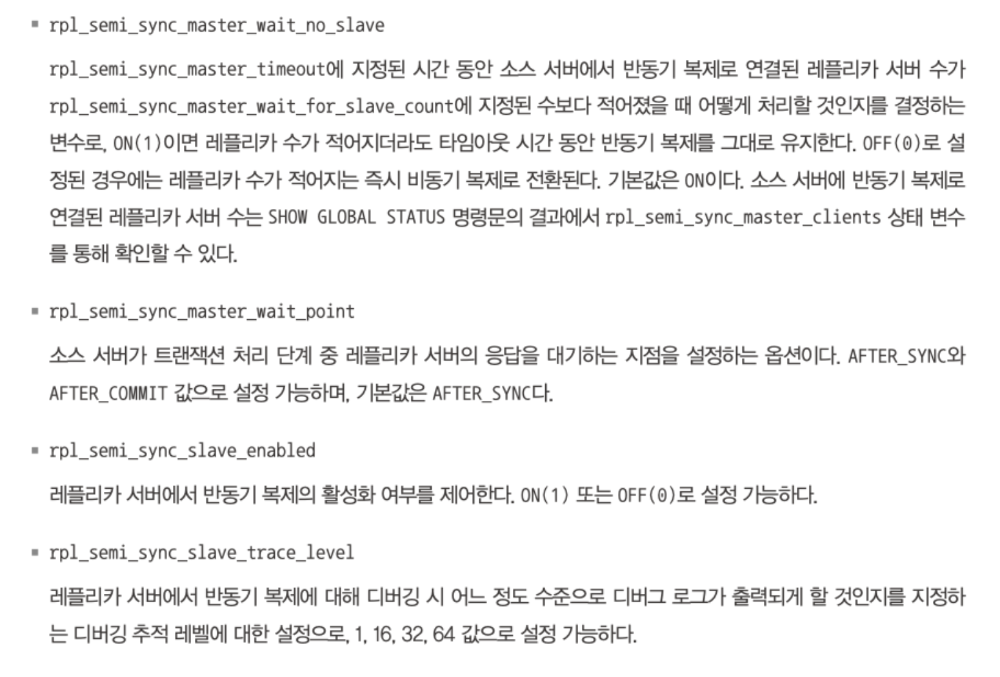</p>

<br>

<p align="center"></p>

<p align="center"></p>

<br>

<p align="center">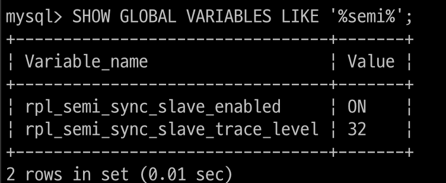</p>

<p align="center">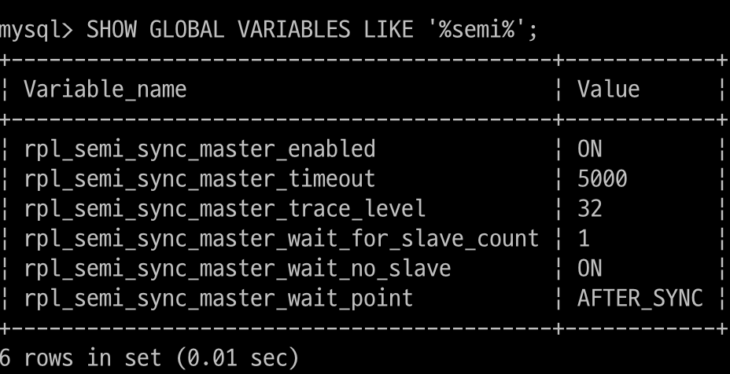</p>

<br>

`소스 서버와 레플리카 서버가 기존에 복제가 실행 중이었다면 레플리케이션 I/O 스레드를 재시작해야 함`

그렇지 않으면 반동기 복제 설정을 활성화했어도 계속 비동기 복제를 유지

## 복제 토폴로지

5.7 버전부터 멀티 소스 복제 기능이 도입되면서 하나의 레플리카 서버는 여러 개의 소스 서버를 가질 수 있게 됨

<br>

### 싱글 레플리카 복제 구성

<p align="center"></p>

<br>

하나의 소스 서버에 하나의 레플리카 서버만 연결돼 있는 복제 형태

가장 기본적인 형태로 제일 많이 사용되는 형태

레플리카 서버는 소스 서버에 장애가 발생했을 때 사용될 수 있는 에비 서버 및 데이터 백업 수행을 위한 용도로 많이 사용

이렇게 1대1 구성된 형태에서는 레플리카 서버를 정말 예비용 서버로만 사용하는 것이 제일 적합

서비스와 연관이 없는 배치 작업이나 어드민 툴에서 사용되는 쿼리들은 레플리카 서버에서 실행되도도록 구현해도 무방

### 멀티 레플리카 복제 구성

<p align="center"></p>

<br>

하나의 소스 서버에 2개 이상의 레플리카 서버를 연결한 복제 형태

새로 오픈될 서비스에서 사용할 MySQL 서버를 설정할 때는 보통 싱글 레플리카 복제 구성으로 구축

오픈 초기에는 DB 서버로 유입되는 쿼리 요청이 매우 적기 때문

이후 트래픽이 증가하면 소스 서버 한 대에서만 쿼리 요청을 처리하기에는 벅찰 수 있는데, 

읽기 요청용 레플리카 서버를 만들어 읽기 요청 처리를 분산시킬 수 있음

<br>

레플리카 서버로 읽기 요청이 들어오는 경우 해당 레플리카 서버는 소스 서버만큼 중요해짐

그래서 장애 대비용 예비용 서버를 두고 소스 서버의 대체 서버 겸 다른 레플리카 서버의 대체 서버로도 사용할 수 있음

<br>

### 체인 복제 구성

멀티 레플리카 복제 구성에서 레플리카 서버가 너무 많아 소스 서버의 성능에 악영향이 예상된다면 1:M:M 구조의 체인 복제 구성을 고려해볼 수 있음

<p align="center"></p>

<br>

소스 서버는 레플리카 서버가 요청할 때마다 바이너리 로그를 읽어서 전달해야 함

만약 하나의 소스 서버에 연결된 레플리카 서버 수가 많다면 바이너리 로그를 읽고 전달하는 작업 자체가 부하가 될 것

레플리카 서버 1-3 처럼 바이너리 로그 배포 역할을 새로운 서버로 넘길 수 있음

1차 복제 그룹은 OLTP 서비스 용도로 사용하고, 2차 복제 그룹은 통계나 배치, 백업 용도로 구분해서 사용

<br>

또한 해당 복제 형태는 서버를 업그레이드 하거나 장비를 일괄 교체할 때도 많이 사용

기존 장비의 MySQL은 그대로 두고, 새로운 장비에 업그레이드한 MySQL을 설치하고 데이터를 신규 장비로 옮기는 형태의 업그레이드는 해당 복제 구조로 서비스의 멈춤 없이 진행 할 수 있음

<br>

<p align="center"></p>

<br>

<p align="center"></p>

<br>


소스 서버 1대와 레플리카 서버 2대로 서비스를 운영하고 있었다고 하자

이 상태에서 MySQL 서버의 버전이나 하드웨어를 업그레이드하고자 함

위와 같은 구조로 기존의 복제에 투입해서 복제가 동기화되게 하자

<p align="center"></p>

<br>

복제가 준비되면 웹 서버나 애플리케이션 서버에서 기존 MySQL 서버에 접속할 때 사용하던 도메인 네임이나 IP 주소를 새로운 MySQL 서버들을 바라보게끔 변경하고

웹 서버나 애플리케이션 서버를 한 대씩 돌아가면서 재시작하면 됨


<p align="center"></p>

<br>

기존 MySQL 서버 3대는 모두 복제 그룹에서 제외시키기만 하면 됨

최종적으로 업그레이드된 서버만으로 서비스를 운영

<br>

이처럼 체인 형태의 복제를 구성하려면 중간 계층에서 레플리카 서버이면서 동시에 소스 서버 역할을 하는 서버(레플리카 서버 1-3 같은)에서 

바이너리 로그와 log_slave_updates 시스템 변수가 반드시 활성화되어 있어야 함

그래야 소스 서버 1에서 실행된 트랜잭션이 르펠리카 서버 2-1과 레플리카 서버 2-2로 전달될 수 있기 때문

### 듀얼 소스 복제 구성


<p align="center"></p>

<br>

듀얼 소스 복제 구성은 두 개의 MySQL 서버가 서로 소스 서버이자 레플리카 서버로 구성돼 있는 형태

두 서버 모두 쓰기가 가능하다는 것이 제일 큰 특징이며, 

각 서버에서 변경한 데이터는 복제를 통해 다시 각 서버에 적용되므로 양쪽에서 쓰기가 발생하지만 두 서버는 서로 동일한 데이터를 갖게 됨

목적에 따라 ACTIVE-PASSIVE 또는 ACTIVE-ACTIVE 형태로 사용할 수 있음

<br>

ACTIVE-PASSIVE는 하나의 MySQL 서버에서만 쓰기 작업이 수행되는 형태인데

싱글 레플리카 복제 구성과 동일하다고 생각할 수 있지만 

예비 서비가 바로 쓰기 작업이 가능한 상태이기에 문제 발생시 별도의 설정 변경 없이

바로 예비용 서버로 쓰기 작업을 전환할 수 있다는 점이 다름

따라서 ACTIVE-PASSIVE 형태는 한 서버에서 다른 서버로 바로 쓰기가 전환될 수 있는 환경이 필요한 경우 사용

<br>

ACTIVE-ACTIVE 형태는 두 서버에 모두 쓰기 작업을 수행하는 형태

지리적으로 매우 떨어진 위치에서 유입되는 쓰기 요청도 원활하게 처리하기 위해 주로 사용

서로 다른 지역에 MySQL 서버를 두고 각 지역에서 발생하는 쓰기 요청은

해당 지역에 위치한 MySQL 서버로 수행되게끔 구현하면 클라이언트 단에서는 좀 더 빠르게 쓰기 처리를 완료할 수 있음

하지만 서로의 트랜잭션이 전달 완료되어 적용되기 전까지 두 서버는 서로 일관되지 않은 데이터를 가질 수 있음을 유의

<br>

주의할 점

- 동일한 데이터를 각 서버에서 변경

- 테이블에서 AUTO-Increment 키 사용


<br>


동일한 데이터에 대한 변경 트랜잭션이 동시에 유입되는 경우 시점상 나중에 처리된 트랜잭션의 내용이 최종적으로 반영되는데 이러면 사용자가 예상하지 못한 방향으로 데이터가 처리될 수도

예를 들어

상품의 재고 수를 업데이트하는 쿼리가 있다면

비슷한 시점에 동일한 상품에 대해 재고 수 변경이 발생하는 경우 각 MySQL 서버에서 처리되는 속도에 따라 실제로 쿼리가 유입된 순서와는 다른 순서가 최종적으로 업데이트될 수 있음

<br>

Auto-Increment의 경우도 동시에 접근하면 같은 Auto-Increment 값을 갖게 될 수 있으며 이로 인해 복제에서 중복 키 에러가 날 수도 있음

`따라서 ACTIVE-ACTIVE 형태에서는 동시점에 동일한 데이터를 변경하는 트랜잭션이 있어서는 안되며 Auto-increment 사용을 지양하고 애플리케이션 단에서 글로벌하게 값을 생성해서 사용하는 것이 좋음`

```
멀티 소스 복제 구성이 쓰기 처리량 향상에 도움이될 것으로 생각하지만 다른 소스의 변경 내용들을 복제해서 자신에게도 똑같이 실행해야 하기에 쓰기 확장 효과는 크지 않음

오히려 트랜잭션 충돌로 인한 롤백이나 복제 멈춤 현상 등 역효과가 많은 편

그래서 쓰기 성능의 확장이 필요하다면 샤딩하는 방법을 권장
```

<br>

### 멀티 소스 복제 구성

하나의 레플리카 서버가 둘 이상의 소스 서버를 갖는 형태

목적

- 여러 MySQL 서버에 존재하는 각기 다른 데이터를 하나의 MySQL 서버로 통합

- 여러 MySQL 서버에 샤딩돼 있는 테이블 데이터를 하나의 테이블로 통합

- 여러 MySQL 서버의 데이터들을 하나로 모아 하나의 MySQL 서버에서 백업을 수행

분석에 필요한 데이터들이 여러 곳으로 나누어져 있어 이를 한 곳으로 모아 좀 더 빠르고 편리하게 분석을 수행하고자 할 때 효율적

또한,

늘어날 서비스 트래픽에 대비해 사전에 샤딩을 해뒀지만 예상보다 트래픽이 적을 경우 해당 테이블들을 통합(Consolidation)해서 MySQL 서버 수를 줄일 수도 있음

<br>

각 소스 서버로부터 유입되는 변경 이벤트들이 레플리카로 왔을 때 충돌을 일으킬 부분은 없는지 충분한 검토가 필요

<br>

#### 멀티 소스 복제 동작

<p align="center"></p>

<br>


멀티 소스 복제에서 레플리카 서버는 자신과 연결된 소스 서버들의 변경 이벤트들을 동시점에 병렬로 동기화

이것은 각 소스 서버들에 대한 복제가 독립적으로 처리되는 것을 의미하며

각각의 독립된 복제 처리를 채널(Channel)이라고 함

각 복제 채널은 개별적인 레플리케이션 I/O 스레드, 릴레이 로그, 레플리케이션 SQL 스레드를 가지며 채널의 이름은 어느 소스 서버와의 복제 연결인지를 구별할 수 있는 식별자 역할

최대 256개의 복제 채널을 생성 가능

<br>

사용자는 복제를 설정하는 CHANGE REPLICATION SOURCE TO 명령에서 FOR CHANNEL 구문을 사용해 복제 채널명을 지정할 수 있음

<p align="center"></p>

다음의 명령은 FOR CHANNEL을 명시하지 않면 전체 복제 채널에 대해 명령이 수행

<p align="center"></p>

<br>

멀티 소스 복제에서도 단일 소스 복제와 동일하게 GTID 설정이나 반동기 복제 방식 설정 등이 모두 가능

<br>

#### 멀티 소스 복제 구축

멀티 소스 복제로 연결한 서버들에서 mysql 데이터베이스와 같이 공통으로 가지고 있는 데이터베이스와 InnoDB 시스템 테이블 스페이스의 충돌과 병합을 고려해야 함

<p align="center"></p>

<br>

여러 소스 데이터를 가져와 레플리카 서버의 초기 데이터로 적재할 때는 mysqldump와 XtraBackup을 혼합해서 사용하는 것이 가장 쉬운 방법


<details>
<summary>mysqldump와 XtraBackup의 차이</summary>

`mysqldump`와 `Xtrabackup`는 MySQL 데이터베이스의 백업을 위해 사용되는 두 가지 도구입니다. 그러나 이 두 도구는 사용 목적, 기능, 성능 등 여러 측면에서 차이가 있습니다. 아래는 `mysqldump`와 `Xtrabackup`의 주요 차이점입니다.

### 1. 백업 방식

#### `mysqldump`

- **로직 백업(logical backup)**: `mysqldump`는 데이터베이스의 구조와 데이터를 SQL 문으로 덤프합니다. 즉, 데이터베이스의 테이블 구조와 데이터를 `CREATE TABLE`, `INSERT INTO` 등의 SQL 문으로 변환하여 백업 파일로 저장합니다.
- **텍스트 파일**: 백업 결과는 텍스트 파일 형식으로 저장됩니다.
- **호환성**: SQL 문으로 저장되기 때문에 다양한 MySQL 버전 간의 호환성이 좋습니다.

#### `Xtrabackup`

- **물리적 백업(physical backup)**: `Xtrabackup`은 데이터 파일을 그대로 복사하여 백업합니다. InnoDB 테이블스페이스 파일, 로그 파일 등 실제 데이터베이스 파일을 백업합니다.
- **바이너리 파일**: 백업 결과는 바이너리 파일 형식으로 저장됩니다.
- **빠른 복원**: 물리적 파일 복사이므로 복원 속도가 빠릅니다.

### 2. 백업 중 서비스 중단

#### `mysqldump`

- **잠금 필요**: `mysqldump`는 기본적으로 테이블을 잠금(Locking) 상태에서 백업합니다. 이는 데이터 일관성을 보장하지만, 백업 중에 쓰기 작업이 차단될 수 있습니다.
- **--single-transaction 옵션**: InnoDB 테이블의 경우 `--single-transaction` 옵션을 사용하여 트랜잭션 격리 수준을 높이고 백업 중에도 읽기/쓰기 작업을 허용할 수 있습니다.

#### `Xtrabackup`

- **비차단 백업(non-blocking)**: `Xtrabackup`은 백업 중에도 데이터베이스 쓰기 작업을 차단하지 않습니다. 백업이 진행되는 동안 데이터베이스는 정상적으로 동작합니다.
- **변경 사항 적용**: 백업 도중 변경된 내용을 별도의 로그 파일에 기록하고, 백업이 끝난 후 적용합니다.

### 3. 복원 속도 및 편리성

#### `mysqldump`

- **느린 복원**: `mysqldump`로 생성한 백업 파일은 SQL 문을 하나씩 실행하여 데이터를 복원하므로 대용량 데이터베이스의 경우 복원 속도가 느립니다.
- **명령어 복원**: SQL 파일을 MySQL 서버에 적용하여 복원합니다.

```sh
mysql -u username -p database_name < backup.sql
```

#### `Xtrabackup`

- **빠른 복원**: 데이터 파일을 직접 복사하여 복원하므로 대용량 데이터베이스에서도 복원 속도가 빠릅니다.
- **복원 절차**: 백업 파일을 데이터 디렉토리에 복사하고 MySQL 서버를 시작하면 됩니다.

```sh
xtrabackup --prepare --target-dir=/path/to/backup
xtrabackup --copy-back --target-dir=/path/to/backup
chown -R mysql:mysql /path/to/datadir
```

### 4. 추가 기능

#### `mysqldump`

- **단순성**: 기본적인 백업과 복원 기능을 제공하며, 특정 테이블이나 데이터베이스를 선택하여 백업할 수 있습니다.
- **호환성**: 다양한 MySQL 및 MariaDB 버전과 호환됩니다.

#### `Xtrabackup`

- **증분 백업**: 변경된 데이터만 백업하는 증분 백업을 지원하여 백업 시간과 저장 공간을 절약할 수 있습니다.
- **복제 지원**: MySQL 복제 설정을 백업하고 복원하는 데 유용합니다.
- **여러 스토리지 엔진 지원**: InnoDB와 XtraDB에 최적화되어 있으며, MyISAM 등의 다른 스토리지 엔진도 지원합니다.

### 5. 설치 및 사용

#### `mysqldump`

- **기본 도구**: MySQL 서버와 함께 기본적으로 제공되며, 추가 설치가 필요 없습니다.
- **사용법**: 간단한 명령어로 사용 가능합니다.

```sh
mysqldump -u username -p database_name > backup.sql
```

#### `Xtrabackup`

- **추가 설치 필요**: Percona XtraBackup 패키지를 별도로 설치해야 합니다.
- **사용법**: 백업과 복원 과정이 상대적으로 복잡할 수 있습니다.

```sh
xtrabackup --backup --target-dir=/path/to/backup
```

### 요약

- `mysqldump`는 로직 백업 도구로, 백업 중 서비스 중단이 있을 수 있으며, 복원이 느릴 수 있지만 설치와 사용이 간단합니다.
- `Xtrabackup`은 물리적 백업 도구로, 백업 중 서비스 중단이 없고, 복원이 빠르며, 증분 백업을 지원하지만 추가 설치와 복잡한 사용법이 필요할 수 있습니다.

이 두 도구를 선택할 때는 데이터베이스의 크기, 가용 시간, 복원 속도, 사용 편의성 등을 고려하여 적합한 도구를 선택하는 것이 중요합니다.


</div>
</details>
<br>

<p align="center"></p>

<br>

두 소스 서버 A와 B의 데이터를 모두 레플리카 서버 C로 가져왔다고 가정하고 A 서버와 B 서버의 데이터가 백업된 시점을 바탕으로 멀티 소스 복제를 구성해보자

레플리카 서버에서 복제 동작과 관련된 master_info_repository, relay_log_info_repository 시스템 변수들의 값이 반드시 TABLE로 설정돼 있어야 함

##### 바이너리 로그 위치 기반 멀티 소스 복제

<p align="center"></p>

<p align="center">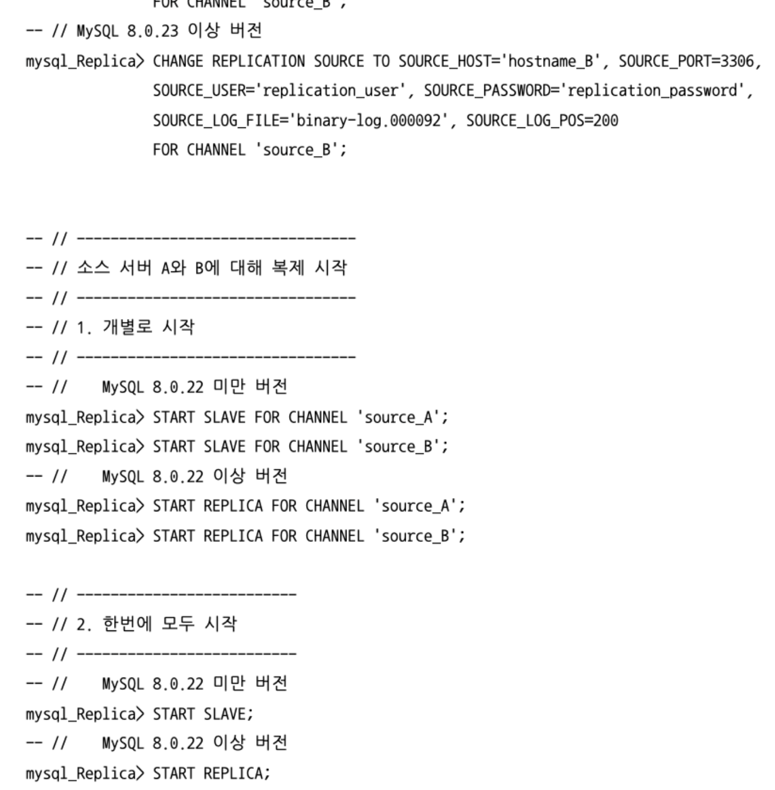</p>

<p align="center"></p>

<br>

##### GTID 기반 멀티 소스 복제

<p align="center"></p>

<p align="center"></p>

<p align="center"></p>

<p align="center"></p>


<br>


## 복제 고급 설정

기본적인 동작 원리와 구성 상태를 넘어 유용한 기능과 설정 방식을 살펴보자

### 지연된 복제(Delayed Replication)

복제는 최대한 빠르게 동기화해서 소스 서버와 레플리카 서버 간의 데이터를 동일한 상태로 만드는 것이 원래 목적

소스 서보와 레플리카 서버 간의 데이터 동기화 지연이 없으면 없을수록 레플리카 서버를 이용한 장애 복구가 용이해지며,

이러한 부분은 레플리카 서버를 서비스 읽기 요청 처리 용도로 사용할 때도 매우 용이

<br>

하지만 의도적으로 복제를 지연시켜야 할 때도 있음

예를 들어 소스 서버에서 실수로 중요한 테이블이나 데이터를 삭제했다고 가정하자면

레플리카 서버도 삭제 쿼리가 실행되어 버렸을 것

그러면 어쩔 수 없이 서비스를 멈추고 백업된 데이터를 사용해 삭제된 테이블이나 데이터를 복구해야 함

<br>

이런 문제를 유연하게 대처할 수 있도록 지연된 복제 기능을 제공

같은 상황이 발생해도 지연된 복제본을 사용해 바로 데이터 복구가 가능

서버 부하가 심할 때 쿼리 처리 지연 상황 발생을 테스트 하고 싶을 때 지연된 복제본을 사용하면 굳이 부하를 생성할 필요없이 시뮬레이션이 가능

<br>

CHANGE REPLICATION SOURCE TO 구문에 SOURCE_DELAY 라는 옵션을 사용해 레플리카 서버를 소스 서버로부터 얼마나 지연시킬 것인지를 지정할 수 있음

<p align="center"></p>

<br>

해당 옵션은 레플리카 서버가 소스 서버보다 트랜잭션이 하루 지연돼서 반영되게 함

8.0 버전부터 바이너리 로그에 original_commit_timestamp(OCT)와 immediate_commit_timestamp(ICT) 라는 타임스탬프가 추가됐는데

- original_commit_timestamp(OCT)

    트랜잭션이 원본 소스 서버에서 커밋된 시각으로 밀리초 단위 유닉스 타임스탬프 값으로 저장

- immediate_commit_timestamp(ICT)

    트랜잭션이 직계 소스 서버에서 커밋된 시각으로 밀리초 단위 유닉스 타임스탬프 값으로 저장

<br>

레플리카 서버가 바이너리 로그를 사용하고 log_slave_updates 옵션이 활성화돼 있는 경우

ICT는 레플리카 서버에서 복제된 트랜잭션이 커밋된 시점으로 값이 저장

<br>

<p align="center"></p>

<p align="center"></p>

<p align="center"></p>

<br>

지연 시간을 60초로 설정하고 master 에서 트랜잭션을 커밋했을 때 show replica status 명령으로 딜레이가 58초 남았다는 것을 확인 가능

이처럼 지연 복제를 사용해도 소스 서버의 바이너리 로그는 즉시 릴레이 로그 파일로 복사됨

단지 SQL 스레드가 복제된 이벤트에 대한 실행을 지연시키는 것일 뿐

<br>

### 멀티 스레드 복제(Multi-threaded Replication)

레플리카 서버에서 소스 서버로부터 복제된 트랜잭션들을 하나의 스레드가 아닌 여러 스레드로 처리할 수 있게 하는 멀티 스레드 복제 기능을 제공

소스 서버에서는 여러 세션에서 실행된 DML 쿼리들이 동시에 처리되는데 

짧은 시간 동안 다량의 DML 쿼리가 실행되는 경우 레플리카 서버는 하나의 스레드가 모든 트랜잭션을 처리하므로 복제 동기화에 제한이 발생

<p align="center"></p>

<br>

`기존의 단일 스레드 복제에서는 레플리케이션 SQL 스레드가 릴레이 로그 파일을 읽어서 바로 트랜잭션에 적용하는 형태였다면`

`멀티 스레드 복제에서는 SQL 스레드를 코디네이터 스레드(coordinatior thread(협업 스레드))라고 부름`

`실제로 이벤트를 실행하는 스레드인 워커 스레드(Worker Thread)와 협업해서 동기화를 진행`

<br>

코디네이터 스레드는 릴레이 로그 파일에서 이벤트들을 읽은 뒤 설정된 방식에 따라 스케줄링해서 워커 스레드에 각 이벤트를 할당

각 이벤트는 워크 스레드들의 큐에 적재되며 워커 스레드는 큐에서 이벤트들을 꺼내 레플리카 서버에 적용

<br>

멀티 스레드 복제는 소스 서버로부터 복제된 트랜잭션들을 어떻게 병렬로 처리할 것인가 에 따라 데이터베이스 기반과 LOGICAL CLOCK 기반 처리 방식으로 나눔

slave_parallel_type 변수로 선택 가능하며

slave_parallel_workers 변수로 워커 스레드의 개수를 정할 수 있음

slave_pending_jobs_size_max 변수로 워커 스레드의 큐에 할당할 수 있는 최대 메모리 크기를 설정 가능

<br>

기본적으로 데이터베이스 기반 방식으로 설정되며 slave_parallel_workers는 0 ~ 1024까지 설정 가능

만약 1인 경우

멀티 스레드 복제를 위한 코드 블록(코디네이션 작업, 워커 스레드 간 동기화)이 실행되면서 실제로는 단일 스레드와 같은 형태로 수행이지만 

0인 경우 

그런 부가적인 작업을 거치지 않으며 기존 단일 스레드 복제 동기화와 동일한 로직으로 수행

slave_pending_jobs_size_max의 기본값은 128MB로 작은 이벤트들이 빈번하게 실행되는 OLTP 환경에서는 기본값 그대로도 좋음

만약 소스 서버로부터 전달받은 이벤트 하나의 크기가 설정 크기보다 크면 모든 워커 스레드들의 큐가 비워질 때까지 대기 후 해당 이벤트가 처리

<p align="center"></p>

<br>

85번이 레플리케이션 I/O 스레드

91번이 코디네이터 스레드

92 ~ 95까지가 워커 스레드

<br>

#### 데이터베이스 기반 멀티 스레드 복제

MySQL 내의 데이터베이스 단위로 병렬 처리를 수행하는 형태

서버에 여러 개의 DB가 있다면 레플리카 서버에서는 그 개수 만큼 워커 스레드 수를 설정하는 것이 좋음

<p align="center"></p>

<br>

코디네이터 스레드는 릴레이 로그 파일에서 이벤트를 읽어 DB 단위로 분리하고 각 워커 스레드들에게 이벤트들을 할당

코디네이터는 단순히 DB 단위로 바이너리 로그 이벤트를 워커 스레드별로 분산하는 역할만 하는 것은 아님

<p align="center"></p>

<br>

예를 들어 워커 스레드가 3개이며 DB도 3개라면

다음과 같은 바이너리 로그를 처리한다고 하자

세번째 트랜잭션이 db3을 변경하고 다시 db1을 변경하는 쿼리라면

세번째 트랜잭션의 UPDATE db1은 첫번째 스레드의 작업을 완료할 때까지 기다림

데이터베이스 기반 멀티 스레드 복제는 데이터베이스가 동일한지 아닌지만 비교해서 병렬 처리를 수행

<br>

각 데이터베이스에 유입되는 DML이 서로 독립적이면서 양적으로 균등하게 실행되는 환경이라면 단일 스레드 복제보다 월등한 처리량을 보이므로 사용 가치가 있는 방식

#### LOGICAL CLOCK 기반 멀티 스레드 복제

하지만 위의 방식이 아니라면 쉽게 복제 지연이 발생하는 것이 아쉬운 점

또한 하나의 데이터베이스만 존재하는 경우 멀티 스레드로 처리될 수 없다는 점도 존재

<br>

5.7 버전부터 소스 서버로부터 넘어온 전체 트랜잭션들을 데이터베이스에 종속되지 않고 멀티 스레드로 처리하는 LOGICAL CLOCK 방식이 도입됨에 따라 앞선 단점들이 해소

`LOGICAL CLOCK 방식은 소스 서버에서 트랜잭션들이 바이너리 로그로 기록될 때 각 트랜잭션별로 논리적인 순번 값을 부여해` 

`레플리카 서버에서 트랜잭션 순번 값을 바탕으로 정해진 기준에 따라 병렬로 실행할 수 있게 하는 방식`

<br>

LOGICAL CLOCK의 3가지 처리 방식

- Commit-parent 기반

- 잠금(Lock) 기반

- WriteSet 기반

<br>

##### 바이너리 로그 그룹 커밋

<p align="center"></p>

<br>

5.5 버전까지의 트랜잭션 커밋 처리과정을 보면

클라이언트로부터 커밋 요청이 들어오면 MySQL 서버에서는 Prepare와 Commit의 두 단계를 거쳐 커밋을 처리하는데 이를 분산 트랜잭션(XA, Two-Phase Commit)이라 함

분산 트랜잭션은 트랜잭션을 커밋할 때 스토리지 엔진에 적용된 내용과 바이너리 로그에 기록된 내용 간 일관성을 유지하기 위해 사용

<br>

`커밋을 처리하는 과정에서 바이너리 로그에 기록한 내용을 디스크와 동기화하는 fsync` 작업은

sync_binlog 변수에 설정된 값에 따라 실행 여부와 실행 빈도수가 결정

<details>
<summary>리두 로그와 바이너리 로그의 flush와 sync</summary>

MySQL에서 트랜잭션이 시작되고 커밋될 때까지 리두 로그(redo log)와 바이너리 로그(binary log)에 발생하는 작업을 플러시와 동기화를 기준으로 자세히 설명하겠습니다. 이를 위해 트랜잭션의 주요 단계와 각 단계에서 발생하는 작업을 나누어 설명합니다.

### 트랜잭션 시작

1. **트랜잭션 시작 (BEGIN/START TRANSACTION)**:
   - 트랜잭션이 시작되면 MySQL은 메모리에 트랜잭션 상태를 저장합니다.
   - 이 단계에서는 리두 로그와 바이너리 로그에 특별한 작업이 발생하지 않습니다.

### 트랜잭션 중

2. **데이터 수정 (INSERT/UPDATE/DELETE)**:
   - **리두 로그 (InnoDB)**
     - 데이터 변경 작업이 발생하면 InnoDB는 변경된 데이터를 메모리의 버퍼 풀(buffer pool)에 기록합니다.
     - 변경 내용은 리두 로그 버퍼(redo log buffer)에도 기록됩니다. 리두 로그 버퍼는 디스크의 리두 로그 파일에 비해 빠르게 접근할 수 있는 메모리 영역입니다.
     - 변경 내용은 리두 로그 버퍼에 기록된 후, 트랜잭션이 커밋되기 전에 디스크의 리두 로그 파일에 플러시(flush)됩니다.
   
   - **바이너리 로그 (MySQL Server)**
     - 바이너리 로그는 MySQL 서버 수준에서 트랜잭션이 커밋될 때 기록됩니다.
     - 데이터 변경 작업이 발생하면, 변경 내용은 바이너리 로그 버퍼에 기록됩니다. 바이너리 로그 버퍼는 트랜잭션 커밋 시 디스크의 바이너리 로그 파일에 플러시됩니다.

### 트랜잭션 커밋

3. **트랜잭션 커밋 (COMMIT)**:
   - 트랜잭션이 커밋되면 다음과 같은 작업이 발생합니다.

   - **리두 로그 (InnoDB)**
     - InnoDB는 리두 로그 버퍼에 기록된 내용을 디스크의 리두 로그 파일에 플러시합니다.
     - 플러시 작업이 완료되면, 리두 로그 파일은 디스크에 안전하게 기록된 상태가 됩니다.
     - 이 단계에서 리두 로그의 동기화(sync) 작업은 설정에 따라 다르게 수행될 수 있습니다. `innodb_flush_log_at_trx_commit` 설정 값에 따라 플러시와 동기화 방식이 결정됩니다:
       - `innodb_flush_log_at_trx_commit = 0`: 리두 로그 버퍼가 디스크로 플러시되지 않습니다. 데이터 일관성이 떨어지지만 성능이 향상됩니다.
       - `innodb_flush_log_at_trx_commit = 1`: 리두 로그 버퍼가 디스크로 플러시되고, 동기화됩니다. 가장 안전한 방식입니다.
       - `innodb_flush_log_at_trx_commit = 2`: 리두 로그 버퍼가 디스크로 플러시되지만, 동기화는 하지 않습니다. 중간 정도의 안전성과 성능을 제공합니다.

   - **바이너리 로그 (MySQL Server)**
     - MySQL 서버는 바이너리 로그 버퍼에 기록된 내용을 디스크의 바이너리 로그 파일에 플러시합니다.
     - `sync_binlog` 설정 값에 따라 바이너리 로그 파일의 플러시와 동기화 방식이 결정됩니다:
       - `sync_binlog = 0`: 바이너리 로그 버퍼가 디스크로 플러시되지 않습니다. 성능이 향상되지만 데이터 일관성이 떨어집니다.
       - `sync_binlog = 1`: 바이너리 로그 버퍼가 디스크로 플러시되고, 동기화됩니다. 가장 안전한 방식입니다.
       - `sync_binlog > 1`: 지정된 커밋 횟수마다 바이너리 로그 버퍼가 디스크로 플러시됩니다. 중간 정도의 안전성과 성능을 제공합니다.

### 플러시와 동기화

- **플러시 (flush)**:
  - 메모리 버퍼에 있는 데이터를 디스크에 기록하는 작업입니다. 리두 로그 버퍼와 바이너리 로그 버퍼의 내용을 디스크의 로그 파일에 기록합니다.

- **동기화 (sync)**:
  - 플러시된 데이터를 디스크의 물리적 저장 장치에 실제로 기록하는 작업입니다. 이는 운영 체제의 파일 시스템 캐시에서 디스크로 데이터를 강제 기록하여 디스크 장애 시 데이터 손실을 방지합니다.

### 요약

1. **트랜잭션 시작**: 메모리에 트랜잭션 상태 저장.
2. **데이터 수정**:
   - 리두 로그: 변경 내용을 리두 로그 버퍼에 기록.
   - 바이너리 로그: 변경 내용을 바이너리 로그 버퍼에 기록.
3. **트랜잭션 커밋**:
   - 리두 로그: 리두 로그 버퍼를 디스크의 리두 로그 파일에 플러시 및 동기화.
   - 바이너리 로그: 바이너리 로그 버퍼를 디스크의 바이너리 로그 파일에 플러시 및 동기화.

각 로그 파일의 플러시와 동기화 동작은 `innodb_flush_log_at_trx_commit`와 `sync_binlog` 설정 값에 따라 달라집니다. 이를 통해 성능과 데이터 일관성 사이의 균형을 조절할 수 있습니다.

</div>
</details>
<br>

sync_binlog 옵션이 1이면 매 트랜잭션이 커밋될 때마다 디스크 동기화가 수행

빈번하게 수행되는 디스크 동기화 작업은 서버에 부하를 주고, 트랜잭션 처리량까지 저하되기도 함

그래서 여러 트랜잭션에 대한 커밋을 동시에 진행할 수 있도록 바뀌었고 바이너리 로그 단의 처리 또한 여러 트랜잭션을 함께 처리할 수 있도록 바이너리 로그 그룹 커밋 기능이 도입

<br>

<p align="center"></p>

<br>

바이너리 로그 그룹 커밋에서 트랜잭션들은 커밋 처리 과정 중 Prepare 이후 바이너리 로그 관련 처리를 진행할 때 세 단계를 거치면서 최종적으로 그룹 커밋

각 단계마다 대기 큐가 존재하며 트랜잭션은 순서대로 대기 큐에 등록

비어있는 대기 큐에 첫번째로 등록된 트랜잭션을 리더(Leader)

이후 등록된 다른 트랜잭션들은 팔로워(Follower)

<br>

각 단계에서 트랜잭션들은 다음과 같이 처리

- Flush

    대기 큐에 등록된 각 트랜잭션들을 순서대로 바이너리 로그에 기록

- Sync

    앞서 기록된 바이너리 로그 내용들을 디스크와 동기화하는 fsync() 시스템 콜이 수행

- Commit

    대기 큐에 등록된 트랜잭션들에 대해 스토리지 엔진 커밋을 진행

<br>

Sync 단계의 실행을 지연시키는 시스템 변수

<p align="center"></p>

<br>

Commit 단계에서 트랜잭션들이 커밋되는 순서를 제어하는 시스템 변수

<p align="center"></p>

<br>

##### Commit-parent 기반 LOGICAL CLOCK 방식

해당 방식은 멀티 스레드 복제 동기화가 처음 도입됐던 5.7.2 ~ 5.7.5 버전까지 적용된 방식

동일 시점에 커밋된 트랜잭션들을 레플리카 서버에서 병렬로 실행될 수 있게 함

MySQL 서버는 같은 시점에 커밋 처리된 트랜잭션들을 식별할 수 있도록 바이너리 로그에 트랜잭션을 기록할 때 commit_seq_no라는 값을 함께 기록

commit_seq_no에는 해당 트랜잭션이 커밋될 당시 가장 최근에 커밋된 트랜잭션의 순번 값이 저장되는데 이런 순번 값은 commit clock이라는 64 비트 정숫값을 기반으로 함

commit_seq는 각 트랜잭션이 커밋을 위해 Prepare 단게에 진입했을 때 설정되며 그 당시의 commit clock 값이 저장

commit clock은 최종적으로 스토리지 엔진에 커밋되기 전에 값이 증가

따라서 같은 시점에 커밋 처리가 시작된 트랜잭션들은 동일한 commit_seq_no 값을 가지고

해당 값을 바탕으로 병렬로 처리하게 됨

이런 방식을 commit-parent 방식

<br>

<p align="center"></p>

<br>

가로축은 트랜잭션들이 커밋됨에 따라 증가하는 논리적인 값인 ommit clock 값

화살표는 각 트랜잭션의 커밋 처리의 시작과 종료

C는 앞서 언급한 commit_seq_no 값을 의미

<p align="center">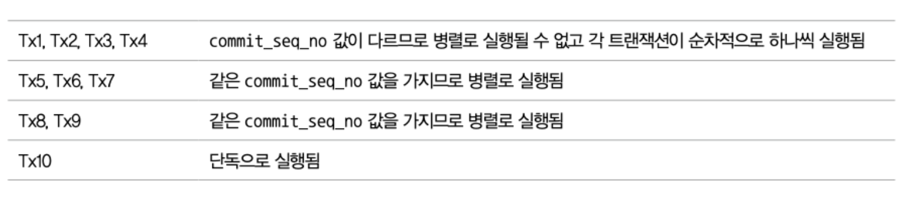</p>

<br>


##### 잠금 기반 LOGICAL CLOCK 방식

5.7.6 버전부터는 잠금 기반 LOGICAL CLOCK 방식의 멀티 스레드 복제를 사용

선행 트랜잭션의 순번 값이 동일하지 않더라도 커밋 처리 시점이 겹친다면 그 트랜잭션들은 레플리카 서버에서 병렬로 처리될 수 있음

그래서 트랜잭션을 바이너리 로그에 기록할 때 sequence_number와 last_committed 값을 함께 기록

다음과 같은 조건을 기준으로 트랜잭션의 실행 가능 여부를 판단

```
실행하려는 트랜잭션의 last_committed 값 < 현재 실행 중인 트랜잭션들이 가지는 가장 작은 sequence_number 값
```

<p align="center"></p>

<p align="center">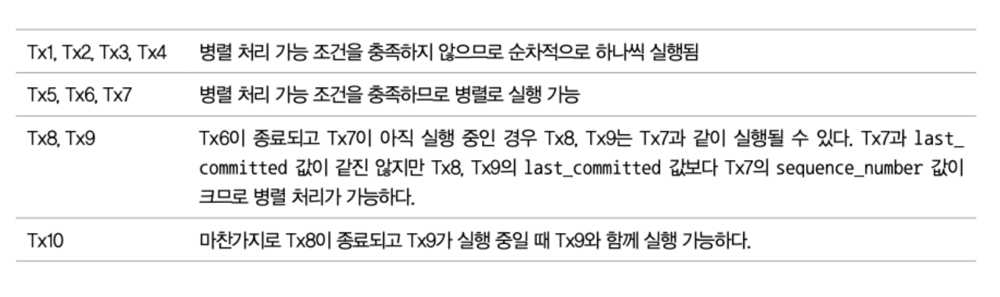</p>

<br>

잠금 기반 LOGICAL CLOCK 방식은 소스 서버에서 커밋 처리 시점이 겹치는 트랜잭션의 수가 많을수록 레플리카 서버에서 최대한 병렬로 처리

<br>

##### WriteSet 기반 LOGICAL CLOCK 방식

8.0.1 버전에서 도입된 방식

트랜잭션의 커밋 처리 시점이 아닌 트랜잭션이 변경한 데이터를 기준으로 병렬 처리 가능 여부를 결정

<p align="center"></p>

<br>

기존의 잠금 방식에서는 커밋 처리 시점이 전혀 겹치지 않는 두 트랜잭션은 병렬로 실행될 수 없었음

하지만 이 두 트랜잭션이 서로 다른 데이터를 변경하는 것이라면 WriteSet 기반 방식의 경우에는 병렬 실행 가능

즉, 동일한 데이터를 변경하지 않는 트랜잭션들은 레플리카 서버에서 모두 병렬로 실행될 수 있는 것

<br>

WriteSet 기반 방식에서는 각 트랜잭션에서 변경한 데이터를 기준으로 병렬 처리를 위한 트랜잭션들의 종속 관계를 정의하므로

이를 위해 내부적으로 트랜잭션에 의해 변경된 데이터들의 목록을 관리

이 변경된 데이터들은 전부 해시값으로 표현되는데 이 해싱된 변경 데이터를 WriteSet이라고 함

다음과 같은 값들의 조합으로 생성

<p align="center"></p>

<br>

WriteSet은 테이블에 존재하는 유니크한 키의 개수만큼 만들어지고 하나의 변경 데이터는 여러 개의 WriteSet을 가질 수 있음

<p align="center"></p>

<br>


예를 들어 다음과 같은 테이블이 있다면

INSERT INTO db1.t1 VALUES (1, 'abc', 1, 10)을 실행했을 때

<p align="center"></p>

<br>

유니크 키가 2개니까 2개의 WriteSet이 생성

<br>

WriteSet을 생성할 때 사용되는 해시 알고리즘으로는

transaction_write_set_extraction 시스템 변수에 지정된 알고리즘이 사용

OFF, MURMUR32, XXHASH64 3가지 값으로 설정 가능하며 default는 XXHASH64

binlog_transaction_dependency_tracking 시스템 변수가 

WRITESET, WRITESET_SESSION으로 설정됐을 때는 

transaction_write_set_extraction 시스템 변수를 OFF로 설정할 수 없음

<br>

트랜잭션들의 WriteSet은 MySQL 서버 메모리에서 해시맵 테이블로 히스토리가 관리되는데

이 히스토리 테이블에는 변경된 데이터의 해시값인 WriteSet과

해당 데이터를 변경한 트랜잭션의 sequence_number 값이 Key-Value 형태로 저장

<br>

사용자는 binlog_transaction_dependency_history_size 시스템 변수를 통해 히스토리 테이블이 최대로 가질 수 있는 해싱 데이터(WriteSet) 개수를 정할 수 있으며, 기본 값은 25000

저장된 데이터 수가 지정된 최대 개수만큼 도달하면 히스토리 테이블은 다시 초기화되고 DDL 쿼리가 실행된 경우에도 초기화

<br>

WriteSet 기반 방식에서도 트랜잭션이 커밋되면 바이너리 로그에 트랜잭션 정보와 함께 last_committed 값과 sequence_number 값이 기록되며 레플리카 서버에서는 이를 바탕으로 병렬 처리를 수행

WRITESET과 WRITESET_SESSION 타입 모두 트랜잭션 커밋을 처리할 때 트랜잭션의 last_committed 값을 1차적으로 COMMIT_ORDER 타입 기반으로 설정하며

이후 WriteSet 히스토리 테이블 데이터를 조회해서 트랜잭션의 WriteSet과 충돌하는 WriteSet이 존재하는지 확인한 후 이를 바탕으로 다시 last_committed 값을 설정하게 됨


<p align="center"></p>

<br>

WriteSet 기반에서 트랜잭션의 last_committed 값이 결정되는 과정을 살펴보자면

총 4개의 WriteSet을 가지는 한 트랜잭션과 현재 WriteSet 히스토리 테이블에 담긴 해시 데이터들을 보여줌

트랜잭션은 WriteSet 히스토리 테이블 데이터를 조회하면서 다음 과정을 거침

<p align="center"></p>

<br>

이 과정이 끝나면

<p align="center"></p>

<br>

즉, 트랜잭션에서 WriteSet 히스토리 테이블에 자신의 

