# InnoDB 클러스터

<br>

소스 서버에서 장애가 발생했을 때 레플리카 서버가 자동으로 기존 소스 서버를 대체하는 것이 아님

서버 자체적으로 Failover를 처리하는 기능을 제공하지 않으므로 사용자는 장애가 발생했을 때 레플리카 서버가 새로운 소스 서버가 될 수 있도록 작업 필요

1. 레플리카 서버에 설정된 읽기 모드를 해제
2. 스플릿 브레인 현상을 방지하기 위해 장애가 발생한 소스 서버에서 데이터 변경을 못하게
3. 애플리케이션 서버는 새로운 소스 서버를 바라보도록 커넥션 설정

<details>
<summary>스플릿 브레인</summary>

스플릿 브레인 (Split Brain)은 클러스터로 구성된 두 시스템간의 네트워크가 일시적으로 동시에 단절되거나 기타 시스템상의 이유로,

클러스터 상의 모든 노드들이 각자 자신이 Primary라고 인식하게 되는 상황

</div>
</details>
<br>

이같은 전환 작업을 수동으로 처리하기보다 자동화를 고려

빌트인 HA 솔루션인 InnoDB 클러스터 도입


### InnoDB 클러스터 아키텍처

MySQL의 고가용성 실현을 위해 만들어진 여러 구성 요소들의 집합체

그룹 복제, MySQL 라우터, MySQL 셸

<p align="center">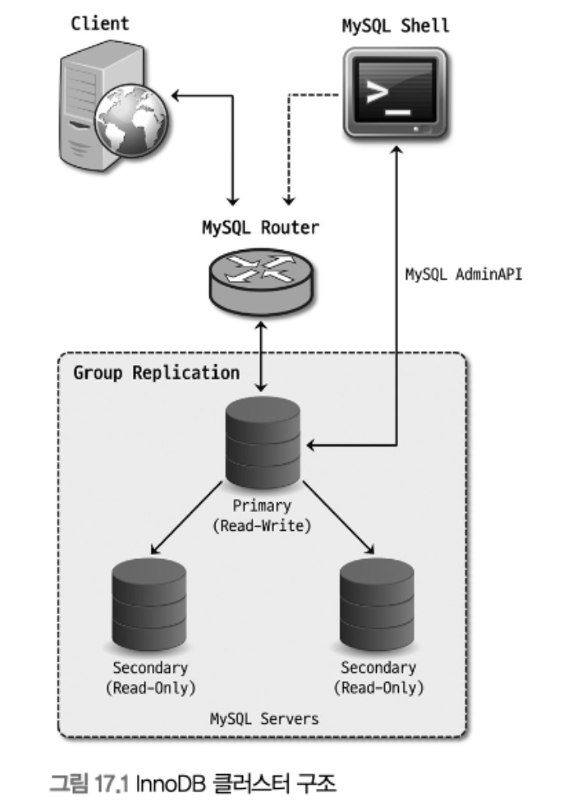</p>

<br>

InnoDB 클러스터에서 데이터가 저장되는 MySQL 서버들은 그룹 복제 형태로 복제가 구성되며 각 서버는 Read/Write가 모두 가능한 프라이머리 혹은 Read만 가능한 세컨더리 중 하나의 역할로 동작

여기서 프라이머리는 기존 MySQL 복제에서의 소스 서버

세컨더리는 레플리카 서버

<br>

그룹복제에서는 InnoDB 스토리지 엔진만 사용 가능

그룹 복제를 구성할 때 고가용성을 위해 최소 3대 이상 구성

3대로 구성했을 때부터 MySQL 서버 한 대에 장애가 발생하더라도 복제 그룹이 정상적으로 작동

InnoDB 클러스터를 사용하는 환경에서 클라이언트는 MySQL 서버로 직접 접근해서 쿼리를 실행하는 것이 아니라 MySQL 라우터에 연결해서 쿼리를 실행 

<br>

라우터는 사용하는 이유는?

라우터가 MySQL 서버에 대한 메타데이터 정보를 가지고 있고, 이것을 바탕으로 쿼리들을 적절한 서버로 전달함

그래서 클라이언트는 어떤 서버로 구성돼 있는지 알고 있을 필요가 없고 커넥션 정보에 라우터 서버만 설정해두면 됨

MySQL 셸은 사용자가 손쉽게 InnoDB 클러스터를 생성하고 관리할 수 있도록 API를 제공

`InnoDB 클러스터에서는 MySQL 서버에 장애가 생기면 그룹 복제가 이를 먼저 감지해서 자동으로 해당 서버를 복제 그룹에서 제외`

`MySQL 라우터는 변경된 토폴로지를 인지하고 메타 데이터를 갱신해서 쿼리를 정상 작동하는 MySQL 서버로만 전달될 수 있도록`

서버 고가용성을 위해 InnoDB 클러스터만 사용하면 됨

<br>

### 그룹 복제

기존 MySQL 복제 프레임워크를 기반으로 구현 Row 포맷의 바이너리 로그(변경된 데이터 자체를 기록)

릴레이 로그(레플리카 서버가 소스 서버의 바이너리 로그를 복사)

GTID(글로벌 트랜잭션 ID)

<br>

**기존 복제와의 다른점**

소스-레플리카 형태로 구성되어 단방향 복제가 이뤄지는 반면

그룹 복제는 복제에 참여하는 서버들이 하나의 복제 그룹으로 묶인 클러스터 형태를 가짐

서로 통신하며 양방향 복제 처리

<br>

**즉, 하나의 복제 그룹 내에서 쓰기를 처리하는 서버가 여러 대 존재할 수 있음**

소스 → 프라이머리

레플리카 → 세컨더리(읽기 전용 동작)

<p align="center">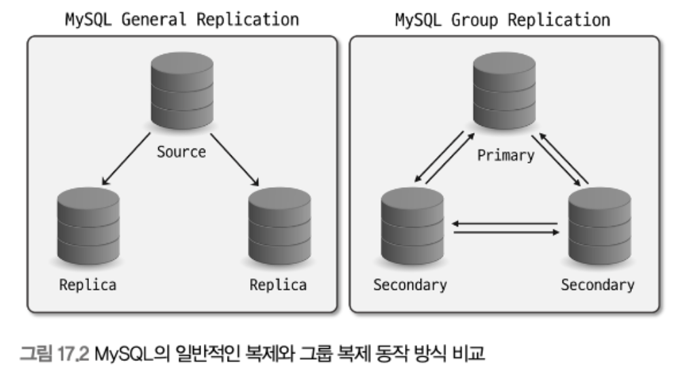</p>

<p align="center">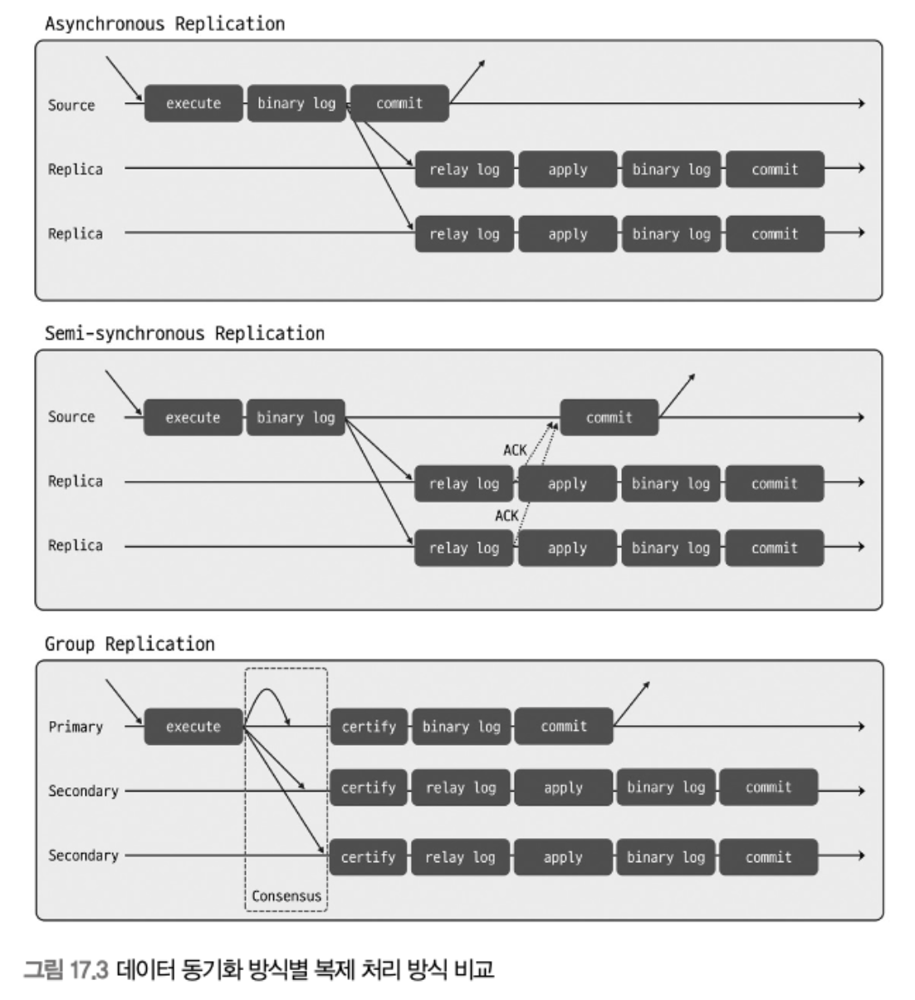</p>

<br>

그룹 복제는 반동기 방식

그렇다고 해서 기존 반동기와 동일한 방식으로 처리되지 않음

그룹 복제는 한 서버에서 트랜잭션이 커밋될 준비가 되면 트랜잭션 정보를 그룹의 다른 멤버들에 전송하고

과반수 이상의 멤버로부터 응답을 전달받으면 해당 트랜잭션을 인증(certify)하고 최종 커밋 처리 완료

그룹 내 멤버들의 응답에 따라 트랜잭션 적용 여부가 결정

→ 이 과정을 합의라고 하고 매 트랜잭션을 처리할 때(데이터 변경 작업)마다 이 과정을 반드시 거침

단, 데이터를 읽기만 하는 트랜잭션에 대해서는 합의 과정이 필요하지 않음

그룹 복제는 InnoDB 클러스터의 핵심 구성 요소로 반드시 이해

### 그룹 복제 아키텍처

그룹 복제는 별도 플러그인으로 구현

<details>
<summary>MySQL이 플러그인 구조인 이유</summary>

<br>

    
MySQL이 플러그인식으로 작동하는 이유는 확장성과 유연성을 높이기 위해서입니다. 플러그인 구조를 사용하면 새로운 기능이나 서비스들을 추가할 때 MySQL 서버의 핵심 코드를 수정할 필요 없이 간단히 플러그인만 설치하면 됩니다. 이를 통해 사용자와 개발자는 특정 요구에 맞는 기능을 쉽게 구현하고, MySQL 서버의 안정성과 성능을 유지할 수 있습니다. 아래는 이 개념을 쉽게 이해할 수 있도록 설명하겠습니다.

### 1. 플러그인 구조란?

플러그인 구조는 소프트웨어가 다양한 기능을 독립적으로 추가하거나 제거할 수 있도록 설계된 시스템입니다. 이를 통해 소프트웨어는 기본 기능 외에 다양한 확장 기능을 제공할 수 있습니다. 플러그인은 소프트웨어의 핵심 코드와 별도로 작동하며, 필요할 때 로드되고 사용되지 않을 때는 시스템 자원을 소모하지 않습니다.

### 2. MySQL의 플러그인 구조

MySQL의 플러그인 구조는 다음과 같은 이유로 설계되었습니다:

1. **확장성**:
    - 사용자는 기본 MySQL 서버에 없는 기능을 플러그인으로 추가할 수 있습니다. 예를 들어, 인증 메커니즘, 스토리지 엔진, 프로토콜, 사용자 정의 함수 등이 플러그인으로 제공됩니다.
    - 새로운 요구사항이 발생해도 MySQL 서버를 완전히 재설계할 필요 없이 플러그인만 개발하면 됩니다.
2. **유연성**:
    - 다양한 사용자 요구를 충족시킬 수 있습니다. MySQL을 사용하는 기업이나 개발자는 각자의 필요에 따라 다양한 플러그인을 설치하여 기능을 확장할 수 있습니다.
    - 예를 들어, 특정 보안 요구사항이 있는 경우 이를 충족시키는 플러그인을 추가할 수 있습니다.
3. **모듈화**:
    - MySQL 서버의 각 기능이 독립된 모듈로 관리되므로, 특정 모듈에 문제가 발생해도 다른 모듈에 영향을 미치지 않습니다.
    - 문제 발생 시 해당 플러그인을 업데이트하거나 교체하는 것만으로 문제를 해결할 수 있습니다.
4. **성능 최적화**:
    - 불필요한 기능을 로드하지 않음으로써 서버 성능을 최적화할 수 있습니다. 필요한 플러그인만 로드하여 사용하면 메모리와 CPU 자원을 효율적으로 사용할 수 있습니다.

### 3. 플러그인의 예

MySQL에서는 여러 유형의 플러그인이 사용됩니다. 주요 예는 다음과 같습니다:

1. **스토리지 엔진 플러그인**:
    - InnoDB, MyISAM, Memory 등 다양한 스토리지 엔진이 플러그인 형태로 제공됩니다. 사용자는 데이터 저장 방식과 성능 요구사항에 따라 적절한 스토리지 엔진을 선택할 수 있습니다.
    
    ```sql
    INSTALL PLUGIN my_plugin SONAME 'ha_my_plugin.so';
    
    ```
    
2. **인증 플러그인**:
    - MySQL은 기본적인 사용자 인증 외에도 플러그인을 통해 다양한 인증 방식을 지원합니다. LDAP, PAM, Kerberos 등을 플러그인으로 추가할 수 있습니다.
    
    ```sql
    INSTALL PLUGIN authentication_ldap_simple SONAME 'auth_ldap_simple.so';
    
    ```
    
3. **로그 플러그인**:
    - MySQL 서버의 활동을 모니터링하고 로그를 분석하기 위한 플러그인입니다. 예를 들어, 일반 쿼리 로그, 슬로우 쿼리 로그 등이 플러그인 형태로 제공될 수 있습니다.

### 4. 플러그인 설치와 관리

플러그인 설치와 관리는 간단합니다. 사용자는 필요한 플러그인을 설치하고, 설정 파일에 플러그인을 로드하도록 지정하면 됩니다. MySQL 서버는 플러그인 디렉토리에서 플러그인을 로드하고, 이를 통해 기능을 확장합니다.

```sql
-- 플러그인 설치 예시
INSTALL PLUGIN my_plugin SONAME 'my_plugin.so';

-- 플러그인 제거 예시
UNINSTALL PLUGIN my_plugin;

```

또한, MySQL 설정 파일(my.cnf 또는 my.ini)에서 플러그인을 로드하도록 설정할 수 있습니다:

```
[mysqld]
plugin-load-add=my_plugin=my_plugin.so

```

### 5. 결론

MySQL이 플러그인식으로 작동하는 이유는 다음과 같습니다:

- **확장성**: 새로운 기능을 쉽게 추가할 수 있음.
- **유연성**: 다양한 사용자 요구를 충족시킬 수 있음.
- **모듈화**: 시스템 안정성을 유지하면서 문제를 쉽게 해결할 수 있음.
- **성능 최적화**: 필요한 기능만 로드하여 시스템 자원을 효율적으로 사용함.

이러한 플러그인 구조를 통해 MySQL은 다양한 환경에서 효과적으로 사용될 수 있으며, 사용자 요구에 맞춰 쉽게 확장할 수 있는 유연한 데이터베이스 시스템으로 자리 잡았습니다.

</div>
</details>
<br>

<p align="center">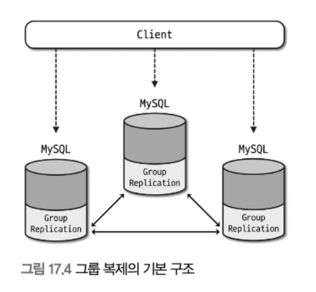</p>

<br>

그룹 복제에 참여하는 서버들은 그룹 복제 플러그인을 통해 서로 지속적으로 통신 → 복제 동기화

그룹 복제가 설정되면 group_relication_applier라는 복제 채널을 생성

그룹 복제 분산 복구 작업이 필요한 경우

group_replication_recovery라는 복제 채널을 생성해서 분산 복구 작업을 진행

<br>

<p align="center">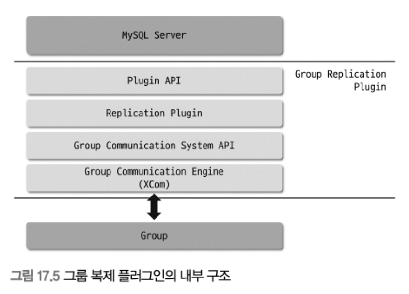</p>

<br>

**그룹 복제 플러그인 내부 구조**

MySQL 서버와 상호작용하기 위해 구현된 인터페이스인 플러그인 API 집합이 존재

<details>
<summary>API 존재 이유</summary>

서로 다른 시스템 간의 통신을 가능하게

예를 들어, 웹 애플리케이션이 데이터베이스와 통신하거나, 모바일 앱이 서버와 통신할 때 API를 사용

</div>
</details>
<br>

마지막 계층에서는 그룹 통신 시스템 API와 그룹 통신 엔진으로 이루어져 있음

플러그인의 모듈들이 만들어낸 내용들을 그룹 통신 API를 받아서 그룹 통신 엔진과 상호 작용

그룹 통신 엔진은 그룹 복제를 설정할 때 별도 포트(33061)를 통해 통신을 수행

그룹 통신 엔진은 트랜잭션이 그룹 복제 멤버들에 동일한 순서로 전달될 수 있도록 보장해주며 그룹 복제 토폴리지의 변경과 그룹 멤버의 장애 등을 감지

<br>

그룹 복제 같은 분산 처리 시스템에서는 합의 처리를 위해서 사용하는 대표적인 알고리즘으로 Paxos와 Raft가 존재

Paxos는 분산 시스템에서 데이터 변경이 발생하는 서버가 여러 대 존재하는 경우 사용

Raft는 데이터 변경이 1대만 가능한 경우

근데 그룹 복제는 모두 쓰기를 처리할 수 있으므로 이를 지원하기 위해 Paxos 계열의 Mencius 알고리즘을 기반으로 구현

### 그룹 복제 모드

쓰기 처리할 수 있는 프라이머리 서버 수에 따라 싱글과 멀티 프라이머리 모드로 나뉨

group_replication_single_primary_mode가 ON이면 싱글,  OFF면 멀티

**참여하려는 서버들 모두 같은 값을 가지고 있어야 함**

#### 싱글 프라이머리 모드

쓰기를 처리할 수 있는 프라이머리 서버가 한 대만 존재하는 형태

<p align="center">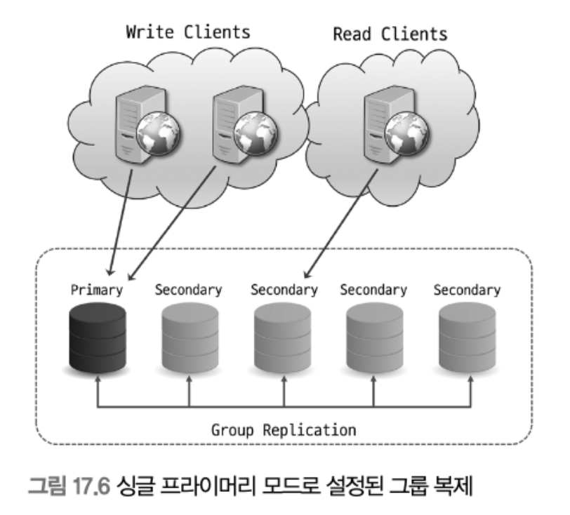</p>

<br>

group_relication_set_as_primary() UDF(User Defined Function)을 통해 사용자가 지정한 서버로 변경되는 것이 아닌 경우

그룹 복제에서 정해진 기준들을 바탕으로 새로운 프라이머리를 선출하게 되는데 고려 기준과 우선 순위

1. MySQL 서버 버전
    
    새로운 프라이머리를 선출할 때 제일 우선시 고려되는 요소
    
2. 각 멤버의 가중치 값
    
    group_replication_memeber_weight에 지정된 가중치 값 비교
    
    기본값 50
    
3. UUID 값의 사전식 순서
서버 버전과 가중치를 기준으로 선정된 멤버가 둘 이상 있으면 server_uuid의 사전식 순서를 바탕으로 가장 낮은 값


#### 멀티 프라이머리 모드

그룹 멤버 전부 프라이머리로 동작하는 형태

<p align="center">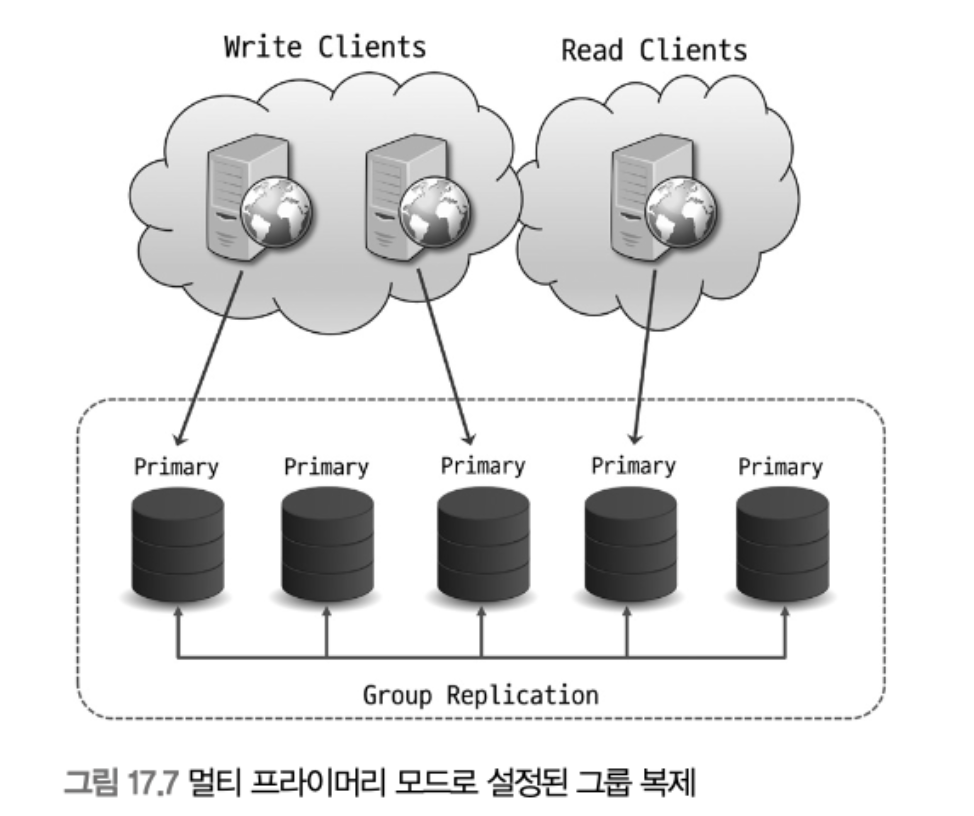</p>

<br>

호환성을 위해 모든 멤버가 동일한 MySQL 버전으로 실행되는 것이 좋음

- 새로운 멤버과 그룹에 존재하는 가장 낮은 MySQL 버전보다 낮은 MySQL 버전을 사용 중인 경우 그룹에 참여할 수 없음

- 새로운 멤버가 그룹에 존재하는 가장 낮은 MySQL 버전보다 높은 MySQL 버전을 사용중인 경우 그룹 참여는 가능하지만 읽기 전용 모드를 유지

가장 낮은 버전을 사용하는 멤버가 읽기 + 쓰기 모드


### 그룹 멤버 관리

performance_schema.replication_group_members에서 그룹 멤버 목록 확인 가능

그룹 복제가 관리하는 멤버 목록과 상태 정보를 뷰라고 하는데 

뷰는 뷰 ID라는 고유 식별자를 가지며 그룹 멤버가 변경될 떄마다 새로운 뷰 ID 값이 생성

이를 통해서 뷰의 변경의 추적하고 뷰가 변경된 시점을 구분할 수 있음

<p align="center">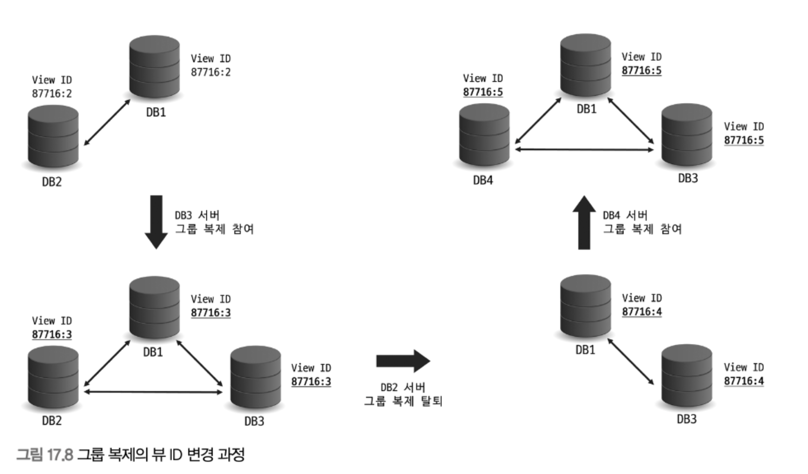</p>

<br>

뷰 ID 값이 변경되면 바이너리 로그에도 view_change라는 이벤트로 뷰 변경 내역이 기록

다만 새로운 멤버가 추가되어 뷰가 변경되는 경우에만 기록

### 그룹 복제에서의 트랜잭션 처리

그룹 복제에서 트랜잭션은 다음의 단계들을 거친 후 최종적으로 그룹의 각 서버들에 적용

- 합의(Consensus)
- 인증(Certification)

합의

그룹 내 일관된 트랜잭션 적용을 위해 그룹 멤버들에게 트랜잭션 적용을 제안하고 승낙받는 과정

클라이언트가 한 그룹 멤버에서 트랜잭션을 실행하고

커밋 요청을 보내면

이 멤버는 그룹 통신 엔진(XCom)을 통해서 트랜잭션에서 변경한 데이터에 대한 WriteSet과 트랜잭션이 커밋될 당시의 gtid_executed 스냅숏 정보, 트랜잭션의 이벤트 로그 데이터 등이 포함된 트랜잭션 데이터를 다른 멤버들로 전파

Paxos 기반 프로토콜을 바탕으로 그룹 멤버들 간의 합의를 수행하고

최종적으로 합의가 완료되어 트랜잭션이 실행된 멤버에서 그룹의 과반수 이상에 해당하는 멤버들로부터 ACK를 전달받으면 다음 프로세스 진행

못받으면 트랜잭션은 적용되지 않고 에러 반환

실행된 트랜잭션들이 글로벌하게 정렬돼서 모두 동일한 순서로 인증 단계를 거침

각 멤버들은 전달받은 트랜잭션 WriteSet 데이터와 

로컬에서 관리하고 있는 WriteSet 히스토리 데이터를 바탕으로 

해당 트랜잭션이 이미 인증 단계를 거친 선행 트랜잭션과 동시점에 동일한 데이터를 변경한 것인지를 검사해서 트랜잭션 충돌 여부 검사

충돌이 감지되면 커밋되지 않고 롤백

트랜잭션 충돌이 자주 발생할 수 있는 상황( 어떤 상황이 있을까 )에서는 싱글 프라이머리 모드로 사용해서 자동으로 롤백되지 않고 대기 후 처리될 수 있게 하는 것이 더 나은 방법

그래서 인증 단계를 거친 후에 바이너리 로그에 트랜잭션을 기록하고 최종적으로 commit을 완료

클라이언트는 이 시점에 커밋 요청에 대한 응답을 받게 됨

인증이 통과되면 함께 전달받은 트랜잭션 로그 데이터를 바탕으로 릴레이 로그 이벤트를 작성

그룹 복제의 어플라이어 스레드에서는 릴레이 로그에 기록된 트랜잭션을 실행하고 바이너리 로그에도 기록해서 최종적으로 서버에 해당 트랜잭션을 적용


<p align="center">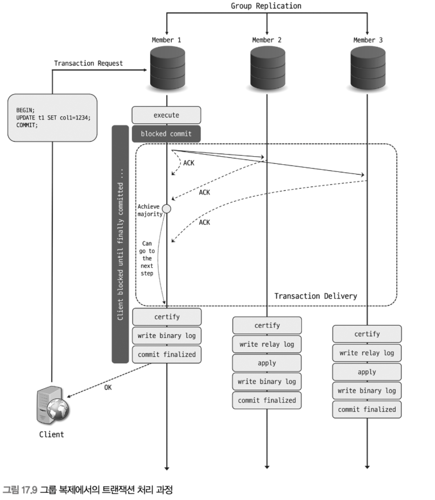</p>

<br>

#### 트랜잭션 일관성 수준

각 멤버들은 동일한 트랜잭션을 적용하지만 실제 적용 시점까지 완전히 일치하는 것은 아님

따라서, 한 멤버에서 쓰기를 수행한 후 바로 다른 멤버에서 해당 데이터를 읽으면 최신 변경 사항이 반영되지 않았을 수도 있음

또한, 프라이머리 장애로 인해 페일오버가 발생하는 경우에도 이런 상황 발생

새로 선출된 프라이머리가 이전 프라이머리에서 발생했던 트랜잭션들을 적용하고 있는데 클라이언트가 여기로 연결해서 트랜잭션을 실행하면 오래된 데이터를 읽거나 쓸 수 있음

멤버간 동기화는 빠르게 처리되지만 일시적으로 아주 짧은 시간에 발생할 수 있으며 이런 상황에 민감한 서버스에서는 문제가 될 수도

8.0.14버전부터 그룹 복제에서 트랜잭션 일관성 수준을 설정 가능

group_replication_consistency 시스템 변수

<br>

##### EVENTUAL 일관성 수준

기본값

읽기 전용 및 읽기-쓰기 트랜잭션이 별도의 제약 없이 바로 실행 가능

그래서 트랜잭션이 직접 실행한 멤버가 아닌 다른 그룹 멤버들에서는 일시적으로 변경 직전의 데이터가 읽혀질 수도

프라이머리 페일오버가 발생한 경우 새로운 프라이머리가 이전 프라이머리의 트랜잭션을 모두 적용하기 전에  트랜잭션이 실행 가능해서 

읽기 트랜잭션의 경우 오래된 데이터를 읽을 수 있고 읽기 - 쓰기 트랜잭션의 경우 커밋시 이전 프라이머리 트랜잭션과 충돌로 인해 롤백 가능

<p align="center">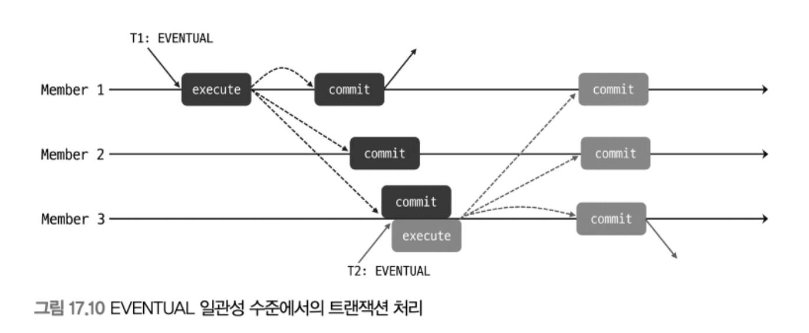</p>

<br>

##### BEFORE_ON_PRIMARY_FAILOVER 일관성 수준


싱글 프라이머리 모드로 설정된 그룹 복제에서 프라이머리 페일 오버가 발생해서 신규 프라이머리가 선출됐을 때만 트랜잭션에 영향을 미침

이랬을 때 이전 프라이머리 트랜잭션을 아직 적용하고 있다면 새로운 읽기 전용 및 읽기-쓰기 트랜잭션은 이전 프라이머리 트랜잭션이 모두 적용될 때까지 처리되지 못하고 대기

<p align="center">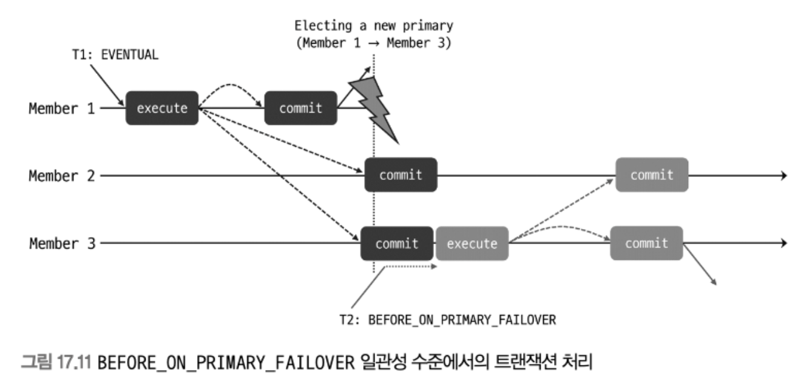</p>

<br>

일반적인 상황에서는 트랜잭션들이 EVENTUAL 일관성 수준으로 설정된 트랜잭션처럼 처리

##### BEFORE 일관성 수준


읽기 전용 및 읽기 쓰기 트랜잭션은 모든 선행 트랜잭션이 완료될 떄까지 대기 후 처리


<p align="center">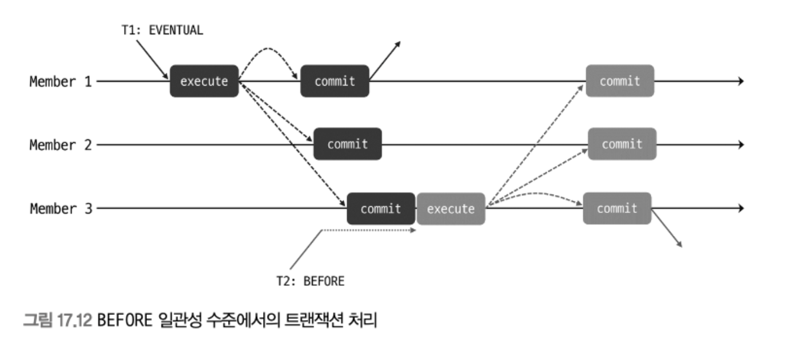</p>

<br>

트랜잭션이 반드시 최신 데이터를 읽어야 하며, 읽기 요청은 적고 쓰기 요청이 많은 경우 사용

##### AFTER 일관성 수준

트랜잭션이 적용되면 해당 시점에 그룹 멤버들이 모두 동기화된 데이터를 갖게 함

읽기-쓰기 트랜잭션은 다른 모든 멤버들에서도 해당 트랜잭션이 커밋될 준비가 됐을 때까지 대기한 후 최종적으로 처리

읽기 트랜잭션은 별도 제약없이 바로 처리

<p align="center">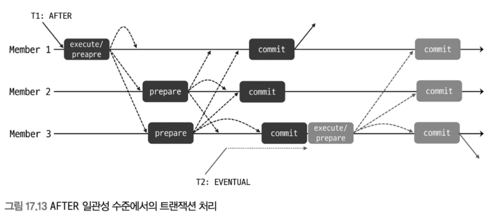</p>

<br>

##### BEFORE_AND_AFTER 일관성 수준

BEFORE + AFTER

읽기 쓰기 트랜잭션은 모든 선행 트랜잭션이 적용될 때까지 기다린 후 실행

트랜잭션이 다른 모든 멤버들에서 커밋이 준비되어 응답을 보내면 그 떄 커밋

읽기 전용 트랜잭션은 모든 선행 트랜잭션이 적용될 떄까지 대기한 후 실행

<p align="center">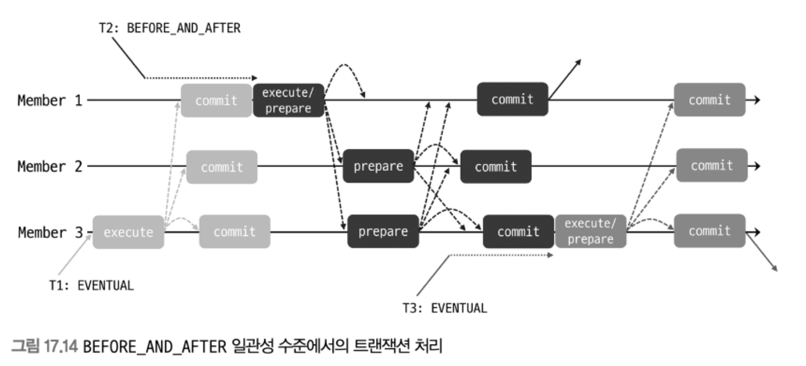</p>

<br>

#### 흐름 제어 (Flow Control)

다른 멤버보다 하드웨어 스펙이 낮거나 네트워크 대역폭이 작거나 부하를 더 많이 받고 있는 경우 다른 멤버보다 트랜잭션 적용이 지연

그룹 멤버 간의 트랜잭션 적용 불균형 문제를 방지하기 위해서 그룹 멤버들의 쓰기 처리량을 조절하는 흐름 제어가 구현

흐름 제어를 통해서 멤버 간 트랜잭션 갭을 적게 유지해서 최대한 동기화가 된 상태로

group_replication_flow_control_mode로 사용 여부 결정

QOUTA와 DISABLE

QOUTA는 그룹에서 쓰기를 처리하는 멤버가 정해진 할당량만큼만 처리할 수 있도록

QOUTA 모드로 동작 방식

1. 모든 그룹 멤버들의 쓰기 처리량 및 처리 대기 중인 트랜잭션에 대한 통계를 수집해서 멤버의 처리량을 조절할 필요가 있는지 확인

2. 처리량 조절이 필요한 경우 최대 쓰기 처리량을 넘어 쓰기를 처리하지 않도록 멤버의 쓰기 처리 제한

흐름 제어는 개별적으로 수행

인증 큐 크기, 적용 큐 크기, 인증된 총 트랜잭션 수, 적용된 원격 트랜잭션 수, 로컬 트랜잭션 수

가 수집되어 공유

<br>

인증 큐 크기와 적용 큐 크기를 바탕으로 멤버의 처리량을 조절할 것인지 판단

그니까 인증 단계와 적용 단계에서 얼마나 많은 트랜잭션이 대기하고 있는지를 확인


<br>


group_replication_flow_control_certifier_threshold

인증 큐에서 대기 중인 트랜잭션 수 제한

group_replication_flow_control_applier_threshold

적용 큐에서 대기 중인 트랜잭션 수 제한

흐름 제어가 실행해야 한다고 판단되면 트랜잭션 적용이 가장 뒤쳐진 멤버가 처리할 수 있는 수준으로 계산

다음 시스템 변수들을 참고해서 최종 쓰기 처리량을 계산

group_replication_flow_control_min_quota

흐름 제어로 계산된 쓰기 처리량과 관계없이 멤버에게 할당돼야 하는 최소 쓰기 처리량

group_replication_flow_control_min_recovery_quota

그룹에서 복구 상태의 멤버가 존재하는 경우 위의 시스템 변수 대신 적용하는 시스템 변수

group_replication_flow_control_max_quota

흐름 제어에서 그룹에 할당할 수 있는 최대 쓰기 처리량

group_replication_flow_control_member_quota_percent

멤버에게 할당할 쓰기 처리량에서 실제로 얼마 정도의 양을 멤버가 사용하게 할 것인지

멀티 프라이머리 모드에만 유효

group_replication_flow_control_hold_percent

멤버에게 할당되는 쓰기 처리량에서 사용하지 않고 남겨둘 처리량의 백분율을 설정

group_replocation_flow_control_release_percent

쓰기 멤버에 대해 처리량을 제한할 필요가 없을 때 흐름 제어 주기당 증가시킬 할당량의 백분율

<br>

멤버에게 할당할 쓰기 처리량을 계산하는 로직

<p align="center">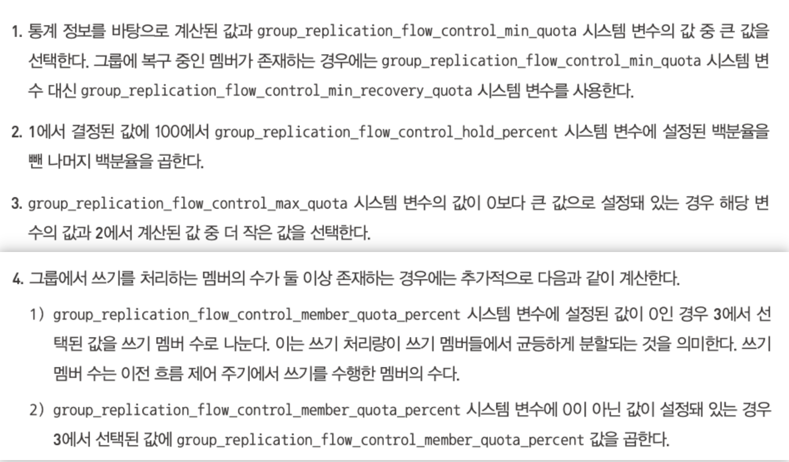</p>

<br>

### 그룹 복제의 자동 장애 감지 및 대응

문제 상태에 있는 멤버를 식별하고 해당 멤버를 그룹 복제에서 제외

멤버 간에 주기적으로 통신 메시지를 주고 받으며 서로의 상태를 확인

멤버로부터 5초 내로 메시지를 받지 못하면 문제가 생긴 것으로 의심

장애가 의심되는 멤버에 대해 과반수가 동의하면 그룹에서 추방

멤버가 추방되면 그룹 뷰가 변경되므로 새로운 뷰 ID를 갖게 됨

추방된 멤버가 다시 그룹에 연결되면 그룹의 현재 뷰 ID가 자기가 가진 뷰 ID랑 다른 것을 알고 그룹에서 추방됐음을 알게 됨

### 그룹 복제의 분산 복구

멤버에 새로 가입하거나 탈퇴 후 다시 가입할 때, 그룹에 적용된 트랜잭션들이 적용되어야 동일한 데이터를 갖게 됨

이런 누락된 트랜잭션을 다른 그룹 멤버에서 갖고와서 적용하는 복구 프로세스를 분산 복구

#### 분산 복구 방식

복구 작업시 먼저 가입 멤버에서 group_replication_applier 복제 채널의 릴레이 로그를 확인하는데

이는 가입한 멤버가 이전에 그룹에 가입한 적이 있다면 그룹에서 탈퇴하는 시점에 릴레이 로그에는 기록돼 있으나 아직 실제로 적용되지 않은 트랜잭션이 존재할 수 있기 때문

이처럼 미처 적용되지 못하고 남아있는 트랜잭션이 있는지 확인하고 발견되는 경우 이를 먼저 적용하는 것으로 복구 작업을 시작

당연히 새로 가입하는 멤버는 해당되지 않음
<br>


분산 복구에서는 두가지 방식을 `적절히 조합`해서 작업 진행

- 바이너리 로그 복제 방식
- 원격 클론 방식


<br>


바이너리 로그 복제 방식은 기본 복제인 비동기 복제를 기반으로 구현

기증자로 선택된 다른 멤버와 

group replication recovery라는 별도의 복제 채널로 연결되어

해당 멤버의 바이너리 로그에서

가입한 멤버에 적용되지 않은 트랜잭션들을 복제해서

가입한 멤버에 적용하는 방식

<br>

원격 클론 방식은 클론 플러그인을 사용하는 방식으로

다른 그룹 멤버들의 InnoDB 스토리지 엔진에 저장된 모든 데이터와 메타데이터를

일관된 스냅숏으로 가져와 가입 멤버를 재구축하는 방식

그룹 멤버와 가입 멤버 모두 클론 플러그인 설치

<br>

분산 복구는 가장 적합한 형태의 복구 방식을 자동으로 선택

바이너리 로그 파일이 모두 존재하는지, 트랜잭션 갭이 크거나 일부가 기존 그룹 멤버의 바이너리 로그에 없거나 하는 경우에는 원격 클론 방식으로 사용

<br>

#### 분산 복구 프로세스

1. 로컬 복구
    
    가입 멤버가 이전에 그룹에 가입한 적이 있으면 릴레이 로그에 미처 적용하지 못한 트랜잭션이 있을 수도
    
    그래서 이 트랜잭션들을 적용(릴레이 로그에서 적용하지 못한 트랜잭션)하고 본격적으로 복구 작업 진행

<br>


2. 글로벌 복구
    
    기증자 역할을 할 멤버를 선택해서 해당 멤버로부터 데이터나 누락된 트랜잭션을 가져와서 자신에게 적용
    
    또한 현재 그룹에서 처리되는 트랜잭션들을 내부적으로 캐싱

<br>

3. 캐시 트랜잭션 적용
    
    글로벌 복구 단계가 완료되면 캐싱해서 보관하고 있던 트랜잭션들을 적용해 최종적으로 그룹에 참여

새로운 멤버가 가입하면 그룹 뷰가 변경되어 뷰 변경 로그 이벤트가 생성되고 멤버들의 바이너리 로그에 해당 이벤트가 기록

<p align="center">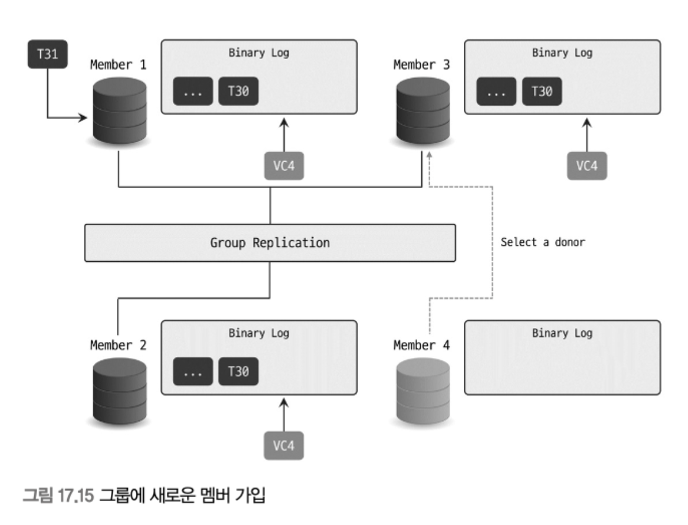</p>

<br>

가입 멤버는 분산 복구 프로세스를 진행하며 

1차적으로 로컬 복구가 완료되면 

무작위로 기증자 멤버를 선정하고

가입 멤버는 기증자 멤버에 연결해서

원격 클론 방식 or 바이너리 로그 복제 방식으로 복구를 시작하고
<br>


원격 클론 방식이라면 기증자 멤버의 스냅숏 데이터를 모두 전달받으면 MySQL 서버를 재시작

group_replication_start_on_boot = ON이라면 MySQL 서버가 재시작할 때 그룹 복제가 자동으로 시작되고

바이너리 로그 복제 방식의 분삭 복구가 진행

OFF인 경우 수동으로 START GROUP _ REPLICATION 명령을 실행
<br>


바이너리 로그 복제 복구 방식에서는 가입 멤버가 참여한 시점까지만 복구 작업을 진행

복구 작업동안 그룹에서 처리된 트랜잭션을 캐싱하고 자기가 그룹에 있었을 때 해당되는 뷰 변경 로그 이벤트를 만나면

복제를 중지하고 캐싱된 트랜잭션을 적용하는 것으로 전환

<p align="center">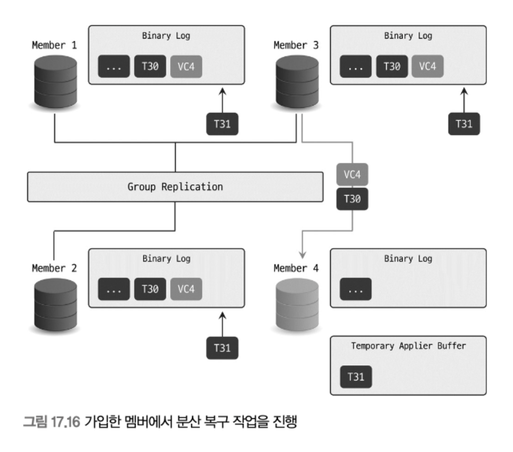</p>

<br>

<p align="center">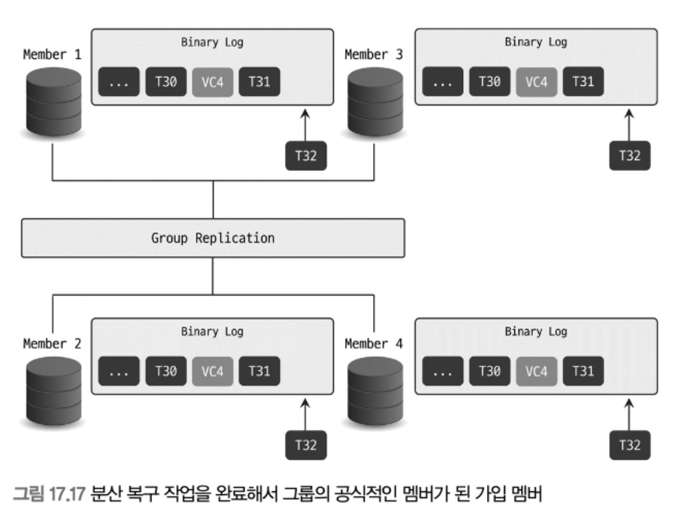</p>

<br>


### MySQL 셸

단순 SQL 문만 실행 가능했던 기존 클라이언트 툴보다 확장 기능 제공

자바 스크립트와 파이썬 언어 모드

<br>

### MySQL 라우터

InnoDB 클러스터에서 애플리케이션 서버로부터 유입된 쿼리 요청을 클러스터 내 적절한 MySQL 서버로 전달하고 MySQL 서버에서 반환된 쿼리 결과를 다시 애플리케이션 서버로 전달하는 Proxy 역할을 수행

<p align="center">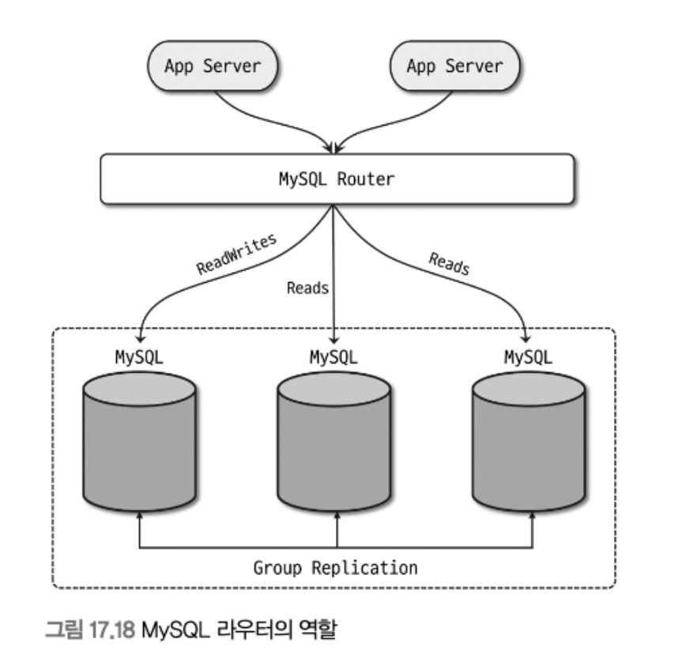</p>

<br>

중요 기능

- InnoDB 클러스터의 MySQL 구성 변경 자동 감지
- 쿼리 부하 분산
- 자동 페일오버

MySQL 라우터 같이 중간 계층에서 프락시 역할을 하는 프로그램을 사용하지 않는 애플리케이션 서버에서는 MySQL 서버에 직접 연결해서 쿼리를 실행

애플리케이션 서버는 MySQL의 IP와 같은 정보를 커넥션 설정에 저장해서 사용하게 됨

MySQL 라우터에서는 클러스터 내 MySQL 서버 들에 대한 정보를 메모리에 캐시하고 있으며 주기적으로 이 정보를 갱신

