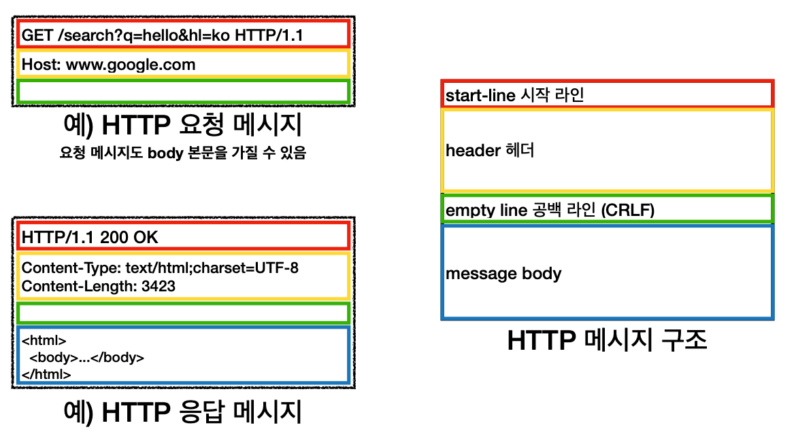
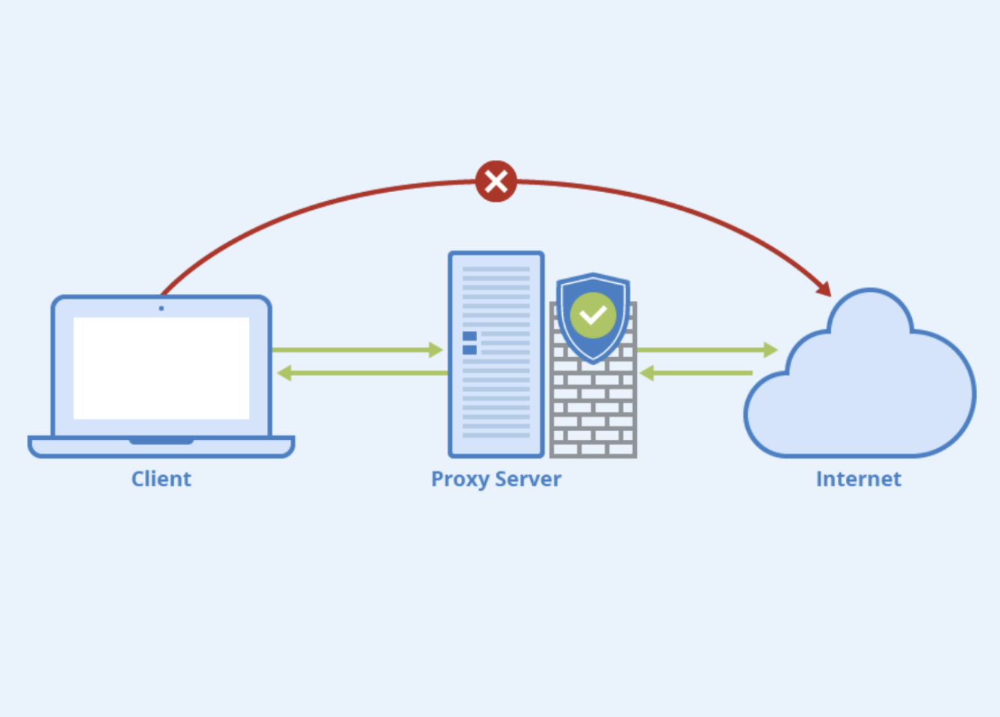

# 1장. HTTP 개관

<br>

## 소개

<br>

HTTP(Hypetext Transfer Protocol)는 현대 인터넷 공용어이다.

해당 장을 통해 다음과 같은 내용을 알아본다.

- 얼마나 많은 클라이언트와 서버가 통신하는지
  
- 리소스(웹 콘텐츠)가 어디서 오는지
  
- 웹 트랜잭션이 어떻게 동작하는지
  
- HTTP 통신을 위해 사용하는 메시지의 형식
  
- HTTP 기저의 TCP 네트워크 전송
  
- 여러 종류의 HTTP 프로토콜
  
- 인터넷 곳곳에 설치된 다양한 HTTP 구성요소

<br><br>

## 1.1 HTTP: 인터넷의 멀티미디어 배달부
    
- HTTP는 `신뢰성 있는 데이터 전송 프로토콜`을 사용하기 때문에, `전송 중 손상되거나 꼬이지 않음`을 보장한다.

<br><br>

## 1.2 웹 클라이언트와 서버

- 웹 콘텐츠는 웹 서버에 존재하며 `웹 서버는 HTTP 프로토콜로 의사소통`하기 때문에 HTTP 서버라고 불린다.

- 클라이언트는 `서버에게 HTTP 요청을 보내고` 웹 콘텐츠가 있는 서버는 `요청된 데이터를 HTTP 응답으로 돌려준다.`

<br>

- 예를 들어 http://<e>www.oreilly<e>.com/index.html 페이지를 열어 볼 때,
    
  웹 브라우저는 HTTP 요청을 <e>www.oreilly<e>.com 서버로 보내고, 
  
  서버는 요청 받은 객체(/index.html)을 찾고 성공했다면 타입, 길이 등의 정보와 함께
  
  HTTP 응답에 실어서 클라이언트에게 보낸다.

<br><br>

## 1.3 리소스

- 웹 서버는 웹 리소스를 관리하고 제공한다.

- 가장 단순한 웹 리소스는 웹 서버 파일 시스템의 정적 파일(word 파일, 이미지 파일, 동영상 파일 등)이다.

<br>

- 하지만 반드시 정적 파일이어야 할 필요는 없다. 요청에 따라 프로그램이 될 수도 있다. 

- 이러한 동적 콘텐츠 리소스는 사용자가 누구인지, 어떤 정보를 요청했는지, 몇 시인지에 따라 다른 콘텐츠를 생성한다.

<br>

- 요약하자면 어떤 종류의 콘텐츠 소스도 리소스가 될 수 있다.

<br><br>

### 1.3.1 미디어 타입

- HTTP는 웹에서 전송되는 객체 각각에 MIME(Multipurpose Internet Mail Extensions) 타입이라는 데이터 포맷 라벨을 붙인다. 

- 웹 서버는 모든 HTTP 객체 데이터에 MIME 타입을 붙이고, 웹 브라우저는 서버로부터 객체를 돌려받을 때, MIME 타입을 통해 확인한다.


<br>

- MIME 타입은 사선(/)으로 구분된 주 타입과 부타입으로 이루어진 문자열 라벨이다.

- 예를 들어 HTML로 작성된 텍스트 문서는 text/html

    GIF 이미지는 image/GIF

    애플 퀵타임 동영상은 video/quicktime

    ```
    # MIME 타입
    Content-type : image/jpeg
    Content-length : 12984
    ```

<br><br>

### 1.3.2 URI

- 서버 리소스의 이름을 통합 자원 식별자(URI)라고 부른다.

- URI는 `인터넷의 우편물 주소 같은 개념`으로 정보 리소스를 고유하게 식별하고 위치를 지정할 수 있다.

<br>

- 예를 들어, http://<e>www.joes-hardware<e>.com/special/saw-blade.gif 는 이런 의미를 가진다.

<br>

-  http:// 의 의미는 `HTTP 프로토콜을 사용하라`

- <e>www.joes-hardware<e>.com 의 의미는 `joes-hardware.com으로 이동하라`

- /special/saw-blade.gif 의 의미는` /special/saw-blade.gif라고 불리는 리소스를 가져와라`

<br><br>

### 1.3.3 URL

- 통합 자원 지시자(URL)은 특정 서버의 한 리소스에 대한 구체적인 위치를 서술한다.

- `리소스가 정확히 어디에 있고 어떻게 접근할 수 있는지 알려준다.`

<br>

- 예를 들어 http://<e>www.joes-hardwoare<e>.com/inventory-check.cgi$<e>item=12731 는 물품 #12731의 재고가 있는지 확인하는 프로그램이라는 의미를 가진다. 

<br>

- 대부분의 URL은 세 부분으로 이루어진 표준 포맷을 따른다.

    - 리소스에 접근하기 위해 사용되는 프로토콜인 스킴 ex) http://

    - 서버의 인터넷 주소를 제공 ex) <e>www.joes-hardware<e>.com

    - 웹 서버의 리소스 ex) /specials/saw-balde.gif

<br>

- 오늘날 대부분의 URI는 URL이다.

<br><br>

### 1.3.4 URN

- 유니폼 리소스 이름(URN)은 콘텐츠를 이루는 한 리소스에 대해, 그 리소스의 위치에 영향 받지 않는 유일무이한 이름 역할을 한다.

- 예를 들어, urn:ietf:rfc:2141 은 인터넷 표준 문서 'RFC 2141'가 어디에 있거나 상관없이 그것을 지칭하기 위해 사용할 수 있다.

- URN은 아직 실험 중인 상태이고 채택이 늦춰지고 있다.

<br><br>

## 1.4 트랜잭션 

- `HTTP 트랜잭션은 요청 명령(클라이언트 -> 서버)과 응답 결과(서버 -> 클라이언트)로 구성`되어 있다.

    ~~~
    HTTP 요청 메시지 = 명령 + URI

    GET /special/saw-blade.gif HTTP/1.0
    Host: www.joes-hardware.com
    ~~~

    ~~~
    HTTP 응답 메시지 = 트랜잭션 결과 + 응답 결과

    HTTP/1.0 200 OK
    Content-type: image/gif
    Content-length: 8572
    ~~~

<br><br>

### 1.4.1 메서드

- HTTP는 HTTP 메서드라고 불리는 여러 종류의 요청 명령을 지원한다.

    | HTTP 메서드 | 설명 | 
    | --- | --- | 
    | GET | 서버에서 클라이언트로 지정한 리소스를 보내라 | 
    | PUT | 클라이언트에서 서버로 보낸 데이터를 지정한 이름의 리소스로 저장하라 | 
    | DELETE | 지정한 리소스를 서버에서 삭제하라 |
    | POST | 클라이언트 데이터를 서버 게이트웨이 애플리케이션으로 보내라 | 
    | HEAD | 지정한 리소스에 대한 응답에서 HTTP 헤더 부분만 보내라 | 

<br><br>

### 1.4.2 상태 코드

- 모든 HTTP 응답 메시지는 상태 코드와 함께 반환된다.

- 상태 코드는 클라이언트에게 요청이 성공했는지 아니면 추가 조치가 필요한지 알려주는 세자리 숫자이다.

    | HTTP 상태 코드 | 설명 | 
    | --- | --- | 
    | 200 | 좋다. 문서가 바르게 반환되었다. | 
    | 302 | 다시 보내라. 다른 곳에 가서 리소스를 가져가라. | 
    | 404 | 없음. 리소스를 찾을 수 없다. |

<br><br>

### 1.4.3 웹페이지는 여러 객체로 이루어질 수 있다

- 애플리케이션은 하나의 작업을 수행하기 위해 여러 HTTP 트랜잭션을 수행한다.

- 예를 들어, 네이버 웹페이지를 가져올 때 페이지 레이아웃인 HTML을 가져오고, 첨부 이미지, 그래픽 조각 등을 가져온다.

- 이와 같이 `웹페이지는 보통 하나의 리소스가 아닌 리소스의 모음`이다.

<br><br>

## 1.5 메시지

- 웹 클라이언트에서 웹 서버로 보낸 HTTP 메시지를 요청 메시지라고 부른다.

- 서버에서 클라이언트로 가는 메시지는 응답 메시지라고 부른다.

<br>

<p align="center"></p>

<br>

- 시작 라인

    요청이라면 무엇을 해야 하는지, 응답이라면 무슨 일이 일어났는지 나타낸다.

- 헤더

    시작 라인 다음에는 0개 이상의 헤더 필드가 이어진다.
    
    헤더는 빈줄로 끝난다.

- 본문

    요청의 본문은 웹 서버로 데이터를 실어 보내며, 응답의 본문은 클라이언트로 데이터를 반환한다. 

    텍스트, 이미지, 비디오, 오디오 트랙 등의 데이터를 포함할 수 있다.

<br><br>

### 1.5.1 간단한 메시지의 예

    
    HTTP 요청 메시지

    GET /tools.html HTTP/1.0 <- 요청 시작 라인 
    User-agent: Mozilla/4.75 [en] (Win98; U) <- 요청 헤더
    Host: www.joes-hardware.com
    Accpet: text/html, image/gif, image/jpeg
    Accept-language: en

    

<br>

    
    HTTP 응답 메시지

    HTTP/1.0 200 OK <- 응답 시작 라인
    Date: Sun, o1 OCt 2000 23:25:17 GMT  <- 응답 헤더
    Server: Apache/1.3.11 Bsafe-SSL/1.38 (Unix)
    Last-modified: Tue, 04 Jul 2000 09:46:21 GMT
    Content-type: text/html
    Content-length: 403

    <HTML> <- 응답 본문
    ...

- 웹 브라우저는 HTTP요청 메시지를 보내고, 요청 시작 라인에 GET 메소드, 로컬 리소스는 /tools.html이다.

- 서버는 응답 메시지를 돌려준다. HTTP 버전 번호, 성공 상태, 응답 헤더 필드 영역 중 본문 길이(Content-Length)와 MIME 타입(Content-Type)을 알 수 있다.

<br><br>

## 1.6 TCP 커넥션

- 어떻게 메시지가 TCP(전송 제어 프로토콜) 커넥션을 통해 한 곳에서 다른 곳으로 옮겨갈까?

<br><br>

### 1.6.1 TCP/IP

- HTTP는 애플리케이션 계층 프로토콜이다. HTTP는 네트워크 통신의 핵심적인 세부사항에 대해서 신경 쓰지 않고, 대중적이고 신뢰성 있는 인터넷 전송 프로토콜인 TCP/IP에게 맡긴다.

- TCP는 다음을 제공한다.

    - 오류 없는 데이터 전송

    - 순서에 맞는 전달 (데이터는 언제나 보낸 순서대로 도착)

    - 조각나지 않는 데이터 스트림 (언제든 어떤 크기로든 보낼 수 있다)

<br>

- 인터넷 자체가 컴퓨터들과 네트워크 장치들 사이에서 TCP/IP에 기초한다.

- TCP/IP는 TCP와 IP가 층을 이루는 패킷 교환 네트워크 프로토콜 집합이다.

- TCP/IP는 어떤 종류의 컴퓨터나 네트워크든 신뢰성 있는 의사소통을 하게 해준다.

- TCP 커넥션이 맺어지면, 교환되는 메시지가 삭제, 손상, 순서가 뒤바뀌어 수신되는 일이 없다.

- HTTP(애플리케이션 계층)는 자신의 메시지 데이터를 전송하기 위해 TCP(전송 게층)을 사용한다. IP(네트워크 계층)

<br><br>

### 1.6.2 접속, IP 주소 그리고 포트번호

- HTTP 클라이언트가 서버에 메시지를 전송할 수 있게 되기 전에 IP 주소와 포트번호를 사용해 클라이언트와 서버 사이에 TCP/IP 커넥션을 맺어야 한다.

<br>

- TCP 커넥션을 맺는 것은 다른 회사 사무실에 있는 누군가에게 전화를 거는 것과 비슷하다.

- 먼저 회사의 전화번호를 누르고, 회사로 연결하고, 전화를 걸고자 하는 상대방이 쓰는 번호를 누른다.

<br>

- TCP에서는 서버 컴퓨터에 대한 IP 주소와 그 서버에서 실행 중인 프로그램이 사용 중인 포트번호가 필요하다.

- URL은 리소스에 대한 주소이기에 URL을 이용해서 IP 주소를 알 수 있다.

- 예를 들어,

    - http://<e>207.200.83.29:80<e>/index.html

        IP 주소 + 포트 번호

        <br>

    - http://<e>www.netscape<e>.com:80/index.html

        글자로 된 도메인 이름 or 호스트 명(<e>www.netscape<e>.com)

        호스트 명은 DNS(Domain Name Service)를 통해 쉽게 IP로 변환 가능 

        <br>

    - http://<e>www.netscape<e>.com/index.html

        포트 번호가 빠진 경우 기본값 80

<br>

- IP 주소와 포트 번호를 이용해 클라이언트는 TCP/IP로 쉽게 통신할 수 있다. 

-  리소스를 사용자에게 보여주는 순서

    1. 웹 브라우저는 서버의 URL에서 호스트 명을 추출

    2. 웹 브라우저는 서버의 호스트 명을 IP로 변환

    3. 웹 브라우저는 URL에서 포트 번호(있다면)를 추출

    4. 웹 브라우저는 웹 서버와 TCP 커넥션을 맺음

    5. 웹 브라우저는 서버에 HTTP 요청을 보냄

    6. 서버는 웹 브라우저에 HTTP 응답을 돌려줌

    7. 커넥션이 닫히면, 웹 브라우저는 문서를 보여줌

<br><br>

## 1.7 프로토콜 버전

- HTTP/0.9

    1991년 나온 버전, 오로지 GET 메서드만 지원하고 심각한 디자인 결함이 다수 있음

<br>

- HTTP/1.0

    처음 널리 쓰이기 시작한 HTTP 버전

    버전 번호, HTTP 헤더, 추가 메서드, 멀티미디어 객체 처리 가능

    웹페이지와 상호작용하는 폼을 실현, WWW을 대세로 만듦

<br>

- HTTP/1.1

    HTTP 설계의 구조적 결함 교정, 성능 최적화, 잘못된 기능 제거

<br>

- HTTP/2.0

    HTTP/1.1 성능 문제를 개선하기 위해 구글의 SPDY 프로토콜을 기반으로 설계

<br><br>

## 1.8 웹의 구성요소

- 프록시

    클라이언트와 서버 사이에 위치한 HTTP 중개자

<br>

- 캐시

    많이 찾는 웹페이지를 클라이언트 가까이에 보관하는 HTTP 창고

<br>

- 게이트웨이

    다른 애플리케이션과 연결된 특별한 웹 서버

<br>

- 터널

    단순히 HTTP 통신을 전달하기만 하는 특별한 프록시

<br>

- 에이전트

    자동화된 HTTP 요청을 만드는 준지능적(semi-intelligent) 웹클라이언트

<br><br>

### 1.8.1 프록시

<br>

<p align="center"></p>

<br>

- 웹 보안, 애플리케이션 통합, 성능 최적화를 위한 구성요소이다.

- 클라이언트와 서버 사이에 위치하여, 클라이언트의 모든 HTTP 요청을 받아 서버에 전달한다.

- 주로 보안을 위해 사용된다. 웹 트래픽 흐름 속에서 신뢰할 수 있는 중개자 역할을 하며 요청과 응답을 필터링한다.

<br>

### 1.8.2 캐시

- 웹 캐시와 캐시 프록시는 자신을 거쳐 가는 문서들 중 자주 찾는 것의 사본을 저장해두는 특별한 HTTP 프록시 서버다.

- 멀리 떨어진 웹 서버보다 훨씬 더 빨리 문서를 다운 받을 수 있다.

- HTTP는 캐시를 효율적으로 동작하게 하고 캐시된 콘텐츠를 최신 버전으로 유지하면서 프라이버시도 보호하기 위한 많은 기능을 정의한다.

<br>

### 1.8.3 게이트웨이

- 다른 서버들의 중개자로 동작하는 특별한 서버이다.

- 주로 HTTP 트래픽을 다른 프로토콜로 변환하기 위해서 사용한다.

<br>

### 1.8.4 터널

- 두 커넥션 사이에서 raw 데이터를 열어보지 않고 그대로 전달해주는 HTTP 애플리케이션이다.

- 암호화된 SSL 트래픽을 HTTP 커넥션으로 전송함으로써 웹 트래픽만 허용하는 사내 방화벽을 통과시키는 대표적인 예가 있다.

<br>

### 1.8.5 에이전트

- 사용자를 위해 HTTP 요청을 만들어주는 클라이언트 프로그램이다.

- 웹브라우저 이외에 자동화된 에이전트인 스파이더나 웹로봇 같은 것도 모두 에이전트이다.

